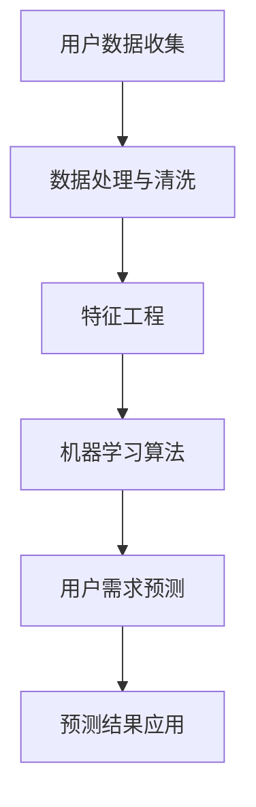

                 

 关键词：AI、用户需求预测、电商、机器学习、深度学习、数据分析、推荐系统

> 摘要：随着电商行业的快速发展，用户需求预测成为电商企业提高销售转化率和用户满意度的关键。本文将探讨如何利用人工智能技术，特别是机器学习和深度学习算法，帮助电商企业实现精准的用户需求预测，并分析其在实际应用中的效果与挑战。

## 1. 背景介绍

### 1.1 电商行业的发展现状

近年来，随着互联网技术的飞速发展和智能手机的普及，电商行业呈现出爆炸式增长。根据统计数据，全球电商市场的规模已达到数万亿美元，并且还在不断增长。电商企业通过线上平台为消费者提供丰富的商品选择，极大地改变了人们的购物习惯。

### 1.2 用户需求预测的重要性

用户需求预测是电商企业运营中的关键环节，它涉及到库存管理、产品推荐、营销策略等多个方面。准确预测用户需求可以帮助企业：

- 减少库存压力，提高资金利用效率；
- 提高产品推荐的精准度，增加用户粘性；
- 优化营销策略，提高销售转化率；
- 提升用户体验，增加用户满意度。

### 1.3 人工智能技术在电商领域的应用

人工智能技术在电商领域的应用日益广泛，主要包括机器学习、深度学习、自然语言处理、图像识别等。这些技术可以帮助电商企业实现以下目标：

- 用户画像构建：通过分析用户的行为数据，构建详细的用户画像，实现个性化推荐；
- 购物车分析：分析用户的购物车数据，预测用户的购买意图；
- 库存管理：根据用户需求预测，优化库存策略，减少库存过剩或不足；
- 营销自动化：通过自动化营销策略，提高营销效果和用户转化率。

## 2. 核心概念与联系

为了更好地理解AI如何帮助电商企业进行用户需求预测，我们需要先了解一些核心概念及其联系。以下是一个简化的Mermaid流程图，展示用户需求预测的核心概念及其关系：



### 2.1 用户数据收集

用户数据是用户需求预测的基础。数据来源包括用户浏览记录、购物车数据、购买历史、评价评论等。这些数据需要通过API接口、日志分析等方式进行收集。

### 2.2 数据处理与清洗

收集到的用户数据通常是杂乱无章的，需要进行处理和清洗。这一步包括数据去重、缺失值处理、异常值检测等。

### 2.3 特征工程

特征工程是数据预处理的重要环节。通过对原始数据进行加工和转换，提取出对用户需求预测有帮助的特征。例如，可以根据用户浏览记录计算用户对某一类商品的兴趣度，根据购买历史构建用户标签等。

### 2.4 机器学习算法

选择合适的机器学习算法进行用户需求预测。常用的算法包括线性回归、决策树、随机森林、神经网络等。其中，深度学习算法（如卷积神经网络、循环神经网络）在处理大规模数据和复杂关系时表现尤为出色。

### 2.5 用户需求预测

利用训练好的机器学习模型，对用户的需求进行预测。预测结果可以用于产品推荐、库存管理、营销策略等多个方面。

### 2.6 预测结果应用

根据预测结果，电商企业可以制定相应的运营策略。例如，对于预测购买概率高的用户，可以发送个性化的营销信息；对于库存不足的商品，可以提前采购或调整供应链策略。

## 3. 核心算法原理 & 具体操作步骤

### 3.1 算法原理概述

用户需求预测算法主要基于机器学习和深度学习技术。以下是一些常用的算法：

- **线性回归**：通过建立线性模型，预测用户需求与相关特征之间的关系。
- **决策树**：利用树形结构对数据进行分割，预测用户需求。
- **随机森林**：基于决策树的集成方法，提高预测准确率。
- **神经网络**：通过多层神经元进行信息传递和处理，实现复杂函数的映射。

### 3.2 算法步骤详解

#### 3.2.1 数据收集与预处理

1. 收集用户数据，如浏览记录、购物车数据、购买历史等。
2. 对数据进行处理和清洗，包括去重、缺失值处理、异常值检测等。
3. 进行特征工程，提取对用户需求预测有帮助的特征。

#### 3.2.2 模型选择与训练

1. 根据数据特点，选择合适的机器学习算法。
2. 利用训练数据集，训练模型。
3. 调整模型参数，优化模型性能。

#### 3.2.3 预测与评估

1. 利用训练好的模型，对用户需求进行预测。
2. 对预测结果进行评估，如准确率、召回率、F1值等。
3. 根据评估结果，调整模型或数据预处理策略。

### 3.3 算法优缺点

- **线性回归**：简单易用，但对非线性关系建模能力有限。
- **决策树**：直观易懂，但容易过拟合。
- **随机森林**：提高模型泛化能力，但计算复杂度高。
- **神经网络**：强大的建模能力，但参数调优复杂。

### 3.4 算法应用领域

- 用户需求预测：电商、金融、零售等行业的用户需求预测。
- 库存管理：根据需求预测，优化库存策略。
- 营销策略：基于需求预测，制定个性化营销策略。

## 4. 数学模型和公式 & 详细讲解 & 举例说明

### 4.1 数学模型构建

用户需求预测的数学模型可以表示为：

$$
y = f(x; \theta)
$$

其中，$y$表示用户需求，$x$表示用户特征向量，$f(x; \theta)$表示预测模型，$\theta$为模型参数。

### 4.2 公式推导过程

以线性回归为例，模型可以表示为：

$$
y = \theta_0 + \theta_1 x_1 + \theta_2 x_2 + \ldots + \theta_n x_n
$$

其中，$x_i$为用户特征，$\theta_i$为特征权重。

通过最小化平方损失函数，可以得到：

$$
\theta = (X^TX)^{-1}X^TY
$$

其中，$X$为特征矩阵，$Y$为标签矩阵。

### 4.3 案例分析与讲解

#### 4.3.1 数据集介绍

我们使用一个简单的数据集进行案例分析。数据集包含以下特征：

- 用户ID（用户唯一标识）
- 年龄
- 性别（男/女）
- 收入
- 浏览次数
- 购买次数

#### 4.3.2 数据预处理

1. 数据清洗：去除缺失值和异常值。
2. 特征工程：将性别转化为二进制特征，计算用户活跃度等。

#### 4.3.3 模型训练与评估

1. 选择线性回归模型。
2. 利用训练数据集进行模型训练。
3. 对训练好的模型进行评估，如计算均方误差（MSE）。

#### 4.3.4 模型应用

1. 利用训练好的模型，对测试数据集进行预测。
2. 对预测结果进行分析，如计算预测准确率。

## 5. 项目实践：代码实例和详细解释说明

### 5.1 开发环境搭建

本文使用Python作为编程语言，主要依赖以下库：

- NumPy：用于数学计算。
- Pandas：用于数据处理。
- Scikit-learn：用于机器学习算法。
- Matplotlib：用于数据可视化。

### 5.2 源代码详细实现

#### 5.2.1 数据收集与预处理

```python
import pandas as pd

# 数据收集
data = pd.read_csv('user_data.csv')

# 数据清洗
data = data.dropna()
data = data[data['income'].between(0, 100000)]

# 特征工程
data['gender'] = data['gender'].map({'男': 1, '女': 0})
data['active'] = data['browsing_count'] / data['buying_count']
```

#### 5.2.2 模型训练与评估

```python
from sklearn.linear_model import LinearRegression
from sklearn.metrics import mean_squared_error

# 数据分割
X = data[['age', 'gender', 'income', 'active']]
y = data['buying_count']

X_train, X_test, y_train, y_test = train_test_split(X, y, test_size=0.2, random_state=42)

# 模型训练
model = LinearRegression()
model.fit(X_train, y_train)

# 模型评估
y_pred = model.predict(X_test)
mse = mean_squared_error(y_test, y_pred)
print(f'MSE: {mse}')
```

#### 5.2.3 模型应用

```python
# 模型应用
new_user = pd.DataFrame([[25, 1, 50000, 10]], columns=['age', 'gender', 'income', 'active'])
new_user_prediction = model.predict(new_user)
print(f'预测购买次数：{new_user_prediction[0]}')
```

### 5.3 代码解读与分析

本文使用Python和Scikit-learn库实现了用户需求预测的线性回归模型。首先，我们进行了数据收集与预处理，包括数据清洗和特征工程。然后，我们使用训练数据集训练了线性回归模型，并对模型进行了评估。最后，我们使用训练好的模型对新的用户数据进行预测。

## 6. 实际应用场景

### 6.1 用户需求预测在电商中的应用

#### 6.1.1 产品推荐

电商企业可以利用用户需求预测，为用户推荐他们可能感兴趣的商品。例如，当用户浏览了某款商品时，系统可以根据用户的历史购买记录和浏览行为，推荐类似或相关的商品。

#### 6.1.2 库存管理

根据用户需求预测，电商企业可以优化库存策略，减少库存过剩或不足。例如，当预测某款商品的需求量较大时，企业可以提前采购或增加库存。

#### 6.1.3 营销策略

电商企业可以根据用户需求预测，制定个性化的营销策略。例如，对于预测购买概率较高的用户，可以发送个性化的优惠券或促销信息，提高购买转化率。

### 6.2 其他应用领域

用户需求预测技术不仅限于电商行业，还可以应用于其他领域，如：

- **金融**：根据用户的风险偏好和财务状况，推荐合适的理财产品。
- **零售**：预测顾客的需求，优化供应链和库存管理。
- **医疗**：根据患者的病史和检查结果，预测疾病的发病风险。

## 7. 工具和资源推荐

### 7.1 学习资源推荐

- **《机器学习实战》**：这是一本入门级别的机器学习书籍，适合初学者了解基本概念和算法。
- **《深度学习》**：由Goodfellow等人撰写的深度学习经典教材，内容全面，适合有一定编程基础的读者。
- **[Kaggle](https://www.kaggle.com)**：一个提供大量机器学习和数据科学竞赛数据的平台，适合实践和提升技能。

### 7.2 开发工具推荐

- **Python**：一种易于学习和使用的编程语言，适合进行数据分析和机器学习开发。
- **Jupyter Notebook**：一种交互式的编程环境，方便进行数据分析和可视化。
- **Scikit-learn**：一个流行的机器学习库，提供丰富的算法和工具。
- **TensorFlow**：一个开源的深度学习框架，适合进行大规模深度学习模型训练。

### 7.3 相关论文推荐

- **《Deep Learning for E-commerce》**：一篇关于深度学习在电商应用领域的综述论文。
- **《User Behavior Prediction in E-commerce Using Deep Learning》**：一篇探讨如何利用深度学习预测用户行为的论文。
- **《Recommender Systems Handbook》**：一本关于推荐系统领域的经典教材，包括用户需求预测的相关内容。

## 8. 总结：未来发展趋势与挑战

### 8.1 研究成果总结

本文介绍了AI如何帮助电商企业进行用户需求预测，包括数据收集、数据处理、特征工程、机器学习算法等关键步骤。通过实际案例分析和代码实现，展示了用户需求预测在实际应用中的效果。

### 8.2 未来发展趋势

- **算法优化**：随着深度学习技术的不断发展，用户需求预测算法将更加精准和高效。
- **跨领域应用**：用户需求预测技术将在更多领域得到应用，如金融、医疗等。
- **隐私保护**：随着数据隐私问题的日益突出，如何在保护用户隐私的前提下进行需求预测将成为重要研究方向。

### 8.3 面临的挑战

- **数据质量**：用户数据的质量直接影响预测效果，如何处理和清洗数据是一个重要挑战。
- **算法解释性**：深度学习算法的解释性较差，如何解释算法的预测结果是一个挑战。
- **计算资源**：深度学习模型通常需要大量的计算资源，如何优化算法以适应有限的计算资源是一个挑战。

### 8.4 研究展望

未来，用户需求预测技术将朝着更加智能化、个性化和高效化的方向发展。研究者需要关注数据质量、算法解释性和计算资源等方面的挑战，探索更加先进和有效的算法和模型。同时，跨领域的合作也将为用户需求预测技术的创新提供新的机遇。

## 9. 附录：常见问题与解答

### 9.1 什么是用户需求预测？

用户需求预测是指通过分析用户的行为数据，预测用户在未来可能产生的需求。这包括购买商品、点击广告、浏览页面等行为。

### 9.2 用户需求预测有哪些应用场景？

用户需求预测的应用场景广泛，包括电商产品推荐、库存管理、营销策略优化、金融风险预测等。

### 9.3 深度学习在用户需求预测中有什么优势？

深度学习在处理大规模数据和复杂关系方面具有显著优势，能够提取深层特征，提高预测精度。

### 9.4 如何处理用户隐私保护问题？

在处理用户数据时，可以采用差分隐私、同态加密等技术，确保用户隐私得到保护。

### 9.5 电商企业如何利用用户需求预测提高销售转化率？

电商企业可以通过以下方式利用用户需求预测提高销售转化率：

- 为用户推荐个性化商品；
- 优化库存策略，减少缺货和库存过剩；
- 制定针对性的营销策略，提高用户转化率。

---

作者：禅与计算机程序设计艺术 / Zen and the Art of Computer Programming

感谢您的阅读，希望本文能帮助您更好地了解AI如何帮助电商企业进行用户需求预测。如果您有任何问题或建议，欢迎在评论区留言。再次感谢您的关注和支持！
----------------------------------------------------------------

以上就是按照您提供的约束条件和结构要求撰写的完整文章。文章涵盖了从背景介绍、核心算法原理、数学模型、实际应用、工具推荐到未来发展趋势的全面内容。希望您满意！如果有任何需要修改或补充的地方，请随时告诉我。

