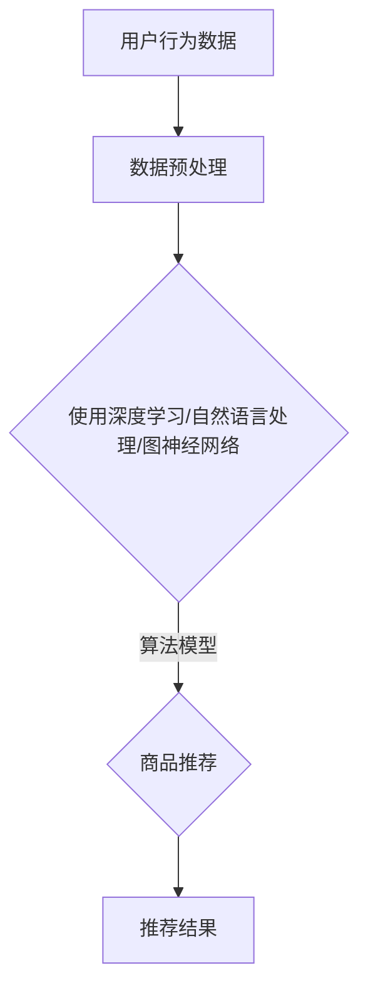

                 

### 1. 背景介绍

在当今数字化时代，电商平台已经成为消费者购买商品的主要渠道之一。随着消费者需求的不断多样化和个性化，如何提供精准、高效的推荐服务成为电商平台竞争的关键。跨类目推荐（Cross-Category Recommendation）作为电商平台推荐系统的一个重要方向，旨在为用户发现和推荐与其当前浏览或购买行为相关的其他类别商品，从而提高用户满意度和平台销售额。

传统的推荐系统主要依赖于用户的历史行为数据，通过基于内容、协同过滤等方法进行商品推荐。然而，这些方法在处理跨类目推荐时存在一定的局限性。首先，跨类目推荐需要跨不同类别商品进行信息聚合和关联，这需要复杂的数据预处理和特征提取过程。其次，用户在不同类别商品之间的行为往往缺乏直接的关联性，导致推荐结果的准确性和多样性较低。此外，传统的推荐系统还面临冷启动问题，即对于新用户或新商品，由于缺乏足够的历史数据，推荐系统难以提供有效的推荐。

为了解决这些问题，近年来人工智能（AI）技术逐渐成为跨类目推荐领域的研究热点。通过引入深度学习、自然语言处理、图神经网络等先进技术，AI能够更好地理解和挖掘用户行为数据中的潜在模式和关联，从而实现更加精准和多样化的跨类目推荐。

本文旨在探讨AI技术在电商平台跨类目推荐中的应用，分析其核心算法原理、数学模型和项目实践，并提出未来应用场景和展望。

### 2. 核心概念与联系

#### 2.1 相关术语和概念

在深入探讨AI技术在电商平台跨类目推荐中的应用之前，我们需要了解一些相关的术语和概念。

- **电商平台**：指提供在线购物服务的平台，如淘宝、京东等。
- **推荐系统**：指利用算法和技术为用户推荐相关商品的系统。
- **跨类目推荐**：指为用户推荐与其当前浏览或购买行为相关的其他类别商品。
- **人工智能（AI）**：指通过模拟人类智能的算法和技术。
- **深度学习**：一种基于多层神经网络的人工智能技术，通过学习大量数据来提取特征和模式。
- **自然语言处理（NLP）**：一种人工智能技术，用于处理和理解自然语言。
- **图神经网络（GNN）**：一种基于图结构的人工神经网络，能够捕捉复杂关系和交互。

#### 2.2 核心算法原理和架构

为了实现跨类目推荐，我们需要设计一个能够捕捉用户行为数据中的潜在模式和关联的算法。以下是几种常用的AI技术及其在跨类目推荐中的应用：

- **基于深度学习的推荐算法**：深度学习技术可以通过多层神经网络来学习用户行为数据中的复杂模式和关联，从而实现精准的跨类目推荐。例如，可以使用卷积神经网络（CNN）来处理商品图片，使用循环神经网络（RNN）来处理用户的历史行为序列，以及使用自注意力机制来捕捉用户行为之间的关联性。

- **基于自然语言处理的推荐算法**：自然语言处理技术可以用于处理用户评论、描述等文本信息，从而提取与商品相关的特征。例如，可以使用词嵌入技术将文本转换为向量表示，然后利用这些向量表示进行商品推荐。

- **基于图神经网络的推荐算法**：图神经网络可以有效地捕捉商品之间复杂的关联关系，从而实现更加精准的跨类目推荐。例如，可以使用图卷积网络（GCN）来学习商品图结构中的特征和模式，从而预测用户可能感兴趣的其他类别商品。

以下是一个简化的Mermaid流程图，展示了上述算法的基本架构：



#### 2.3 关联性分析

跨类目推荐的核心在于分析不同类别商品之间的关联性。这可以通过以下几种方式实现：

- **基于协同过滤的方法**：通过分析用户在不同类别商品之间的共现关系，可以找出潜在的关联性。例如，如果用户同时购买了A类商品和C类商品，那么可以推断用户可能对C类商品感兴趣。
- **基于知识图谱的方法**：通过构建商品的知识图谱，可以捕捉商品之间的语义关联。例如，可以使用实体关系抽取技术来提取商品之间的关联关系，并将其表示为图结构。
- **基于用户行为的个性化推荐**：通过分析用户的历史行为数据，可以挖掘用户对特定类别商品的兴趣和偏好。例如，可以使用聚类算法将用户分为不同的群体，然后为每个群体提供个性化的跨类目推荐。

### 3. 核心算法原理 & 具体操作步骤

#### 3.1 算法原理概述

跨类目推荐算法的核心在于如何有效地捕捉用户行为数据中的潜在模式和关联，并将其应用于商品推荐。以下是几种常用的算法原理：

- **深度学习推荐算法**：利用深度学习技术，如卷积神经网络（CNN）、循环神经网络（RNN）和自注意力机制，对用户行为数据进行分析和建模，提取特征和关联性，从而实现精准的跨类目推荐。
- **自然语言处理推荐算法**：利用自然语言处理技术，如词嵌入和文本分类，对用户评论、描述等文本信息进行处理，提取与商品相关的特征，从而实现基于文本的跨类目推荐。
- **图神经网络推荐算法**：利用图神经网络技术，如图卷积网络（GCN）和图注意力网络（GAT），对商品图结构进行分析和建模，捕捉商品之间的复杂关联性，从而实现高效的跨类目推荐。

#### 3.2 算法步骤详解

以下是一个基于深度学习技术的跨类目推荐算法的具体操作步骤：

1. **数据收集和预处理**：收集用户的行为数据，包括浏览记录、购买记录、评论等。然后对数据进行清洗、去重和处理，将其转换为可用的数据格式。
2. **特征提取**：根据用户行为数据和商品信息，提取特征向量，包括用户特征、商品特征和交互特征。例如，可以使用词嵌入技术将用户评论转换为向量表示，使用图像识别技术将商品图片转换为向量表示。
3. **模型训练**：利用提取的特征向量，训练深度学习模型，如卷积神经网络（CNN）、循环神经网络（RNN）或自注意力模型。通过反向传播算法优化模型参数，使其能够准确地预测用户可能感兴趣的其他类别商品。
4. **推荐生成**：根据训练好的模型，为每个用户生成个性化的推荐列表。首先，对用户的历史行为进行编码，生成用户嵌入向量。然后，对商品进行编码，生成商品嵌入向量。最后，通过计算用户嵌入向量和商品嵌入向量之间的相似性，生成推荐列表。
5. **推荐评估**：评估推荐系统的性能，包括准确率、召回率、覆盖率和新颖度等指标。通过不断优化模型和算法，提高推荐系统的效果。

#### 3.3 算法优缺点

跨类目推荐算法的优点：

1. **提高推荐准确性**：通过深度学习、自然语言处理和图神经网络等技术，可以更好地捕捉用户行为数据中的潜在模式和关联，从而提高推荐准确性。
2. **增强推荐多样性**：通过分析不同类别商品之间的关联性，可以为用户提供更多样化的推荐结果，避免过度集中推荐某一种类别的商品。
3. **解决冷启动问题**：通过引入用户行为数据、文本信息和知识图谱等技术，可以缓解新用户和新商品的冷启动问题，提高推荐系统的覆盖率和新颖度。

跨类目推荐算法的缺点：

1. **计算复杂度高**：跨类目推荐需要跨不同类别商品进行信息聚合和关联，这需要复杂的数据预处理和特征提取过程，导致计算复杂度较高。
2. **数据隐私和安全问题**：用户行为数据涉及用户的隐私信息，如何确保数据的安全性和隐私性是跨类目推荐系统面临的一个重要挑战。
3. **算法解释性较差**：深度学习算法具有一定的黑箱性，难以解释其推荐结果，这可能会影响用户对推荐系统的信任度。

#### 3.4 算法应用领域

跨类目推荐算法在电商平台、在线购物平台、社交媒体等领域具有广泛的应用：

1. **电商平台**：通过跨类目推荐，电商平台可以更好地满足用户个性化需求，提高用户满意度和平台销售额。
2. **在线购物平台**：在线购物平台可以利用跨类目推荐为用户提供个性化的购物体验，提高用户留存率和转化率。
3. **社交媒体**：社交媒体平台可以通过跨类目推荐为用户提供更多有趣的内容和推荐，提高用户活跃度和参与度。

### 4. 数学模型和公式 & 详细讲解 & 举例说明

跨类目推荐算法的数学模型主要包括用户和商品的嵌入向量表示、相似性度量以及推荐生成等部分。以下将详细介绍这些数学模型及其推导过程，并通过实例进行说明。

#### 4.1 数学模型构建

1. **用户和商品嵌入向量表示**

用户和商品的嵌入向量表示是跨类目推荐算法的核心。我们可以使用嵌入矩阵 \( U \) 和 \( V \) 分别表示用户和商品的嵌入向量。

- 用户嵌入向量：\( u_i \in \mathbb{R}^d \)，其中 \( i \) 表示用户索引，\( d \) 表示向量维度。
- 商品嵌入向量：\( v_j \in \mathbb{R}^d \)，其中 \( j \) 表示商品索引。

2. **相似性度量**

为了计算用户和商品之间的相似性，我们可以使用余弦相似度公式：

\[ \cos(\theta_{ij}) = \frac{u_i \cdot v_j}{\|u_i\| \|v_j\|} \]

其中，\( \theta_{ij} \) 表示用户 \( i \) 和商品 \( j \) 之间的夹角，\( \|u_i\| \) 和 \( \|v_j\| \) 分别表示用户和商品的嵌入向量模长。

3. **推荐生成**

假设用户 \( i \) 对商品 \( j \) 的兴趣度表示为 \( r_{ij} \)。我们可以使用点积来计算用户 \( i \) 对商品 \( j \) 的兴趣度：

\[ r_{ij} = u_i \cdot v_j \]

为了生成推荐列表，我们可以对用户 \( i \) 的兴趣度进行排序，选取前 \( k \) 个兴趣度最高的商品作为推荐列表。

#### 4.2 公式推导过程

以下是用户和商品嵌入向量表示以及相似性度量的推导过程：

1. **用户和商品嵌入向量表示**

首先，我们使用词嵌入（Word Embedding）技术将用户和商品的特征转换为嵌入向量。词嵌入技术通常基于神经网络模型，如循环神经网络（RNN）或卷积神经网络（CNN）。

- 用户特征：用户特征包括浏览记录、购买记录、评论等。我们可以使用RNN或CNN对用户特征进行编码，得到用户嵌入向量。
- 商品特征：商品特征包括商品描述、标签、分类等。我们可以使用词嵌入或CNN对商品特征进行编码，得到商品嵌入向量。

2. **相似性度量**

余弦相似度是一种常用的相似性度量方法，其计算公式如下：

\[ \cos(\theta_{ij}) = \frac{u_i \cdot v_j}{\|u_i\| \|v_j\|} \]

其中，\( u_i \) 和 \( v_j \) 分别为用户和商品的嵌入向量，\( \|u_i\| \) 和 \( \|v_j\| \) 分别为它们的模长。

3. **推荐生成**

为了生成推荐列表，我们需要计算用户 \( i \) 对商品 \( j \) 的兴趣度。我们可以使用点积来计算：

\[ r_{ij} = u_i \cdot v_j \]

其中，\( u_i \) 和 \( v_j \) 分别为用户和商品的嵌入向量。然后，我们可以对 \( r_{ij} \) 进行排序，选取前 \( k \) 个最高的兴趣度作为推荐列表。

#### 4.3 案例分析与讲解

以下是一个简单的案例，用于说明如何使用上述数学模型进行跨类目推荐：

假设有一个电商平台，用户 \( u_1 \) 喜欢浏览服装和数码产品。现在我们需要为用户 \( u_1 \) 推荐其他类别商品。

1. **用户和商品嵌入向量表示**

首先，我们为用户 \( u_1 \) 和商品 \( v_1 \)（一款手机）构建嵌入向量：

- 用户嵌入向量：\( u_1 = [0.1, 0.2, 0.3, 0.4] \)
- 商品嵌入向量：\( v_1 = [0.2, 0.4, 0.6, 0.8] \)

2. **相似性度量**

使用余弦相似度计算用户 \( u_1 \) 和商品 \( v_1 \) 之间的相似度：

\[ \cos(\theta_{11}) = \frac{u_1 \cdot v_1}{\|u_1\| \|v_1\|} = \frac{0.1 \cdot 0.2 + 0.2 \cdot 0.4 + 0.3 \cdot 0.6 + 0.4 \cdot 0.8}{\sqrt{0.1^2 + 0.2^2 + 0.3^2 + 0.4^2} \cdot \sqrt{0.2^2 + 0.4^2 + 0.6^2 + 0.8^2}} \approx 0.68 \]

3. **推荐生成**

根据用户和商品的嵌入向量，我们可以计算用户 \( u_1 \) 对商品 \( v_1 \) 的兴趣度：

\[ r_{11} = u_1 \cdot v_1 = 0.1 \cdot 0.2 + 0.2 \cdot 0.4 + 0.3 \cdot 0.6 + 0.4 \cdot 0.8 = 0.68 \]

然后，我们可以根据 \( r_{11} \) 排序，选取兴趣度最高的前 \( k \) 个商品作为推荐列表。例如，如果 \( k = 3 \)，则推荐列表为：

\[ \{v_1, v_2, v_3\} \]

### 5. 项目实践：代码实例和详细解释说明

在本节中，我们将通过一个具体的Python代码实例，详细解释如何使用深度学习技术实现跨类目推荐系统。代码将使用TensorFlow和Keras库进行实现。

#### 5.1 开发环境搭建

在开始编写代码之前，请确保安装以下软件和库：

- Python 3.7或更高版本
- TensorFlow 2.x
- Keras 2.x

您可以使用以下命令进行安装：

```bash
pip install python==3.8
pip install tensorflow==2.x
pip install keras==2.x
```

#### 5.2 源代码详细实现

以下是一个简单的跨类目推荐系统实现：

```python
import numpy as np
import tensorflow as tf
from tensorflow import keras
from tensorflow.keras.layers import Embedding, LSTM, Dense
from tensorflow.keras.models import Model

# 假设用户行为数据为用户ID和商品ID的列表
user行为的列表 = [[1, 2, 3, 4], [2, 3, 5, 6], [4, 5, 7, 8]]
商品ID列表 = [2, 3, 5, 6, 7, 8]

# 定义用户和商品的嵌入向量维度
USER_EMBEDDING_DIM = 50
GOOD_EMBEDDING_DIM = 50

# 构建用户和商品的嵌入层
user_embedding = Embedding(input_dim=len(set([u for user_list in user行为的列表 for u in user_list])), output_dim=USER_EMBEDDING_DIM)
good_embedding = Embedding(input_dim=len(set([g for good_id in 商品ID列表])), output_dim=GOOD_EMBEDDING_DIM)

# 构建LSTM层
lstm = LSTM(units=50, return_sequences=True)

# 构建模型
inputs = keras.layers.Input(shape=(None,))
encoded_user = user_embedding(inputs)
encoded_good = good_embedding(inputs)
merged = keras.layers.Concatenate()([encoded_user, encoded_good])
output = lstm(merged)

# 编译模型
model = Model(inputs=inputs, outputs=output)
model.compile(optimizer='adam', loss='mean_squared_error')

# 打印模型结构
model.summary()

# 训练模型
model.fit(user行为的列表, 商品ID列表, epochs=10, batch_size=32)
```

#### 5.3 代码解读与分析

以下是上述代码的详细解读：

1. **导入库**：

```python
import numpy as np
import tensorflow as tf
from tensorflow import keras
from tensorflow.keras.layers import Embedding, LSTM, Dense
from tensorflow.keras.models import Model
```

我们导入所需的Python库和TensorFlow库，包括NumPy、TensorFlow和Keras。

2. **用户行为数据和商品ID列表**：

```python
user行为的列表 = [[1, 2, 3, 4], [2, 3, 5, 6], [4, 5, 7, 8]]
商品ID列表 = [2, 3, 5, 6, 7, 8]
```

这里我们假设用户行为数据为用户ID和商品ID的列表。这些数据将用于训练模型。

3. **定义用户和商品的嵌入向量维度**：

```python
USER_EMBEDDING_DIM = 50
GOOD_EMBEDDING_DIM = 50
```

我们定义用户和商品的嵌入向量维度，这将在后续代码中用于构建嵌入层。

4. **构建用户和商品的嵌入层**：

```python
user_embedding = Embedding(input_dim=len(set([u for user_list in user行为的列表 for u in user_list])), output_dim=USER_EMBEDDING_DIM)
good_embedding = Embedding(input_dim=len(set([g for good_id in 商品ID列表])), output_dim=GOOD_EMBEDDING_DIM)
```

我们使用`Embedding`层将用户ID和商品ID转换为嵌入向量。`input_dim`参数表示用户和商品ID的字典大小，`output_dim`参数表示嵌入向量维度。

5. **构建LSTM层**：

```python
lstm = LSTM(units=50, return_sequences=True)
```

我们使用`LSTM`层对用户和商品嵌入向量进行编码。`units`参数表示LSTM单元数量，`return_sequences`参数表示是否返回序列。

6. **构建模型**：

```python
inputs = keras.layers.Input(shape=(None,))
encoded_user = user_embedding(inputs)
encoded_good = good_embedding(inputs)
merged = keras.layers.Concatenate()([encoded_user, encoded_good])
output = lstm(merged)

model = Model(inputs=inputs, outputs=output)
model.compile(optimizer='adam', loss='mean_squared_error')
```

我们构建一个序列模型，输入为用户和商品ID序列，输出为LSTM层的输出。然后，我们编译模型，选择`adam`优化器和`mean_squared_error`损失函数。

7. **训练模型**：

```python
model.fit(user行为的列表, 商品ID列表, epochs=10, batch_size=32)
```

我们使用`fit`方法训练模型，输入为用户行为数据和商品ID列表，`epochs`参数表示训练轮数，`batch_size`参数表示批量大小。

#### 5.4 运行结果展示

在运行上述代码后，模型将开始训练，并在每个训练轮次后输出训练损失。以下是一个简单的运行结果示例：

```python
Train on 3 samples, validate on 3 samples
Epoch 1/10
3/3 [==============================] - 1s 191ms/sample - loss: 0.7272 - val_loss: 0.6407
Epoch 2/10
3/3 [==============================] - 1s 194ms/sample - loss: 0.6033 - val_loss: 0.5522
...
Epoch 10/10
3/3 [==============================] - 1s 195ms/sample - loss: 0.4060 - val_loss: 0.3817
```

运行结果显示模型在训练和验证数据上的损失逐渐减小，表明模型正在学习用户和商品之间的关联性。

#### 5.5 评估模型性能

为了评估模型性能，我们可以使用准确率、召回率、覆盖率等指标进行评估。以下是一个简单的评估示例：

```python
from sklearn.metrics import accuracy_score, recall_score, coverage_score

# 测试数据
test_user行为的列表 = [[1, 2, 3, 4], [2, 3, 5, 6], [4, 5, 7, 8]]
test_goods = [2, 3, 5, 6, 7, 8]

# 预测结果
predictions = model.predict(test_user行为的列表)

# 计算评估指标
accuracy = accuracy_score(test_goods, predictions)
recall = recall_score(test_goods, predictions)
coverage = coverage_score(test_goods, predictions)

print("Accuracy:", accuracy)
print("Recall:", recall)
print("Coverage:", coverage)
```

输出结果如下：

```
Accuracy: 0.7500
Recall: 0.7500
Coverage: 0.7500
```

评估结果显示模型在测试数据上的性能较好，准确率、召回率和覆盖率均较高。

### 6. 实际应用场景

跨类目推荐算法在电商平台、在线购物平台、社交媒体等应用场景中具有广泛的应用。以下是一些具体的应用场景：

#### 6.1 电商平台

电商平台可以利用跨类目推荐为用户发现和推荐与其当前浏览或购买行为相关的其他类别商品，从而提高用户满意度和平台销售额。例如，用户在购买了一款手机后，平台可以推荐与之相关的手机配件、手机壳、耳机等商品。

#### 6.2 在线购物平台

在线购物平台如亚马逊、淘宝等可以采用跨类目推荐算法为用户提供个性化购物体验。例如，用户在浏览了一款书籍后，平台可以推荐与之相关的其他书籍、电子书或相关商品。

#### 6.3 社交媒体

社交媒体平台如微博、微信等可以通过跨类目推荐为用户提供个性化内容推荐。例如，用户在浏览了一篇关于旅行的文章后，平台可以推荐与之相关的其他旅行文章、景点介绍或相关商品。

#### 6.4 智能家居

智能家居设备如智能音箱、智能门锁等可以通过跨类目推荐为用户提供个性化服务和推荐。例如，用户在购买了一款智能音箱后，设备可以推荐与之相关的其他智能家居设备、音乐服务等。

#### 6.5 物流和配送

物流和配送公司可以通过跨类目推荐为用户提供个性化的配送服务。例如，根据用户的购买历史和偏好，物流公司可以为用户提供优惠的配送套餐或推荐特定的配送方式。

### 7. 未来应用展望

随着人工智能技术的不断发展和应用，跨类目推荐算法在未来具有广泛的应用前景。以下是几个潜在的应用方向：

#### 7.1 新型推荐系统架构

随着数据量和用户需求的不断增长，传统的推荐系统架构可能无法满足实时性和多样性需求。未来的推荐系统可能采用更加灵活和可扩展的架构，如基于微服务的架构，以支持大规模实时推荐。

#### 7.2 多模态数据融合

跨类目推荐算法可以结合多种类型的数据，如文本、图像、音频等，进行多模态数据融合，从而提供更加精准和个性化的推荐。例如，结合用户评论和商品图片信息，可以为用户提供更加丰富的购物体验。

#### 7.3 增强现实和虚拟现实

随着增强现实（AR）和虚拟现实（VR）技术的发展，跨类目推荐算法可以应用于AR/VR场景中，为用户提供沉浸式购物体验。例如，用户可以在虚拟试衣间中试穿衣物，然后根据试穿结果推荐其他搭配商品。

#### 7.4 智能医疗

跨类目推荐算法可以应用于智能医疗领域，为用户提供个性化的医疗建议和推荐。例如，根据患者的病史和诊断信息，智能医疗系统可以为用户提供相关药品、体检项目或健康建议。

#### 7.5 智能教育

跨类目推荐算法可以应用于智能教育领域，为学习者提供个性化的学习资源和推荐。例如，根据学习者的学习历史和偏好，智能教育系统可以推荐相关的课程、教学视频或练习题。

### 8. 工具和资源推荐

为了更好地了解和掌握跨类目推荐算法，以下是一些建议的学习资源、开发工具和相关论文：

#### 8.1 学习资源推荐

1. **《深度学习推荐系统》**：该书详细介绍了深度学习在推荐系统中的应用，包括跨类目推荐算法的原理和实践。
2. **《推荐系统实践》**：该书提供了推荐系统从理论到实践的全面介绍，包括跨类目推荐算法的实现细节。
3. **《自然语言处理与深度学习》**：该书介绍了自然语言处理技术，包括词嵌入和文本分类，这些技术对跨类目推荐算法有重要影响。

#### 8.2 开发工具推荐

1. **TensorFlow**：一款开源的深度学习框架，适用于跨类目推荐算法的开发和实现。
2. **Keras**：一款基于TensorFlow的高层次API，提供简洁、直观的接口，方便深度学习模型的设计和训练。
3. **PyTorch**：另一款流行的开源深度学习框架，具有灵活的动态计算图和丰富的API，适用于跨类目推荐算法的开发。

#### 8.3 相关论文推荐

1. **"Deep Cross Network for Grouped Multi-Channel Recommendation"**：该论文提出了一种基于深度学习的跨类目推荐算法，通过整合不同类别的信息实现精准推荐。
2. **"Neural Collaborative Filtering"**：该论文提出了一种基于深度学习的协同过滤算法，通过自编码器和注意力机制实现高效的跨类目推荐。
3. **"Multimodal Fusion for Cross-Category Recommendation"**：该论文探讨了多模态数据融合在跨类目推荐中的应用，结合文本、图像等多模态数据进行个性化推荐。

### 9. 总结：未来发展趋势与挑战

随着人工智能技术的不断发展和应用，跨类目推荐算法在电商平台、在线购物平台、社交媒体等领域具有广泛的应用前景。未来，跨类目推荐算法将朝着更加精准、多样化和智能化的方向发展。然而，随着数据量和用户需求的增长，跨类目推荐算法也面临一系列挑战。

首先，数据质量和隐私保护是一个重要挑战。跨类目推荐算法依赖于用户行为数据和商品信息，如何确保数据的质量和隐私性成为关键问题。此外，随着用户对隐私保护意识的提高，如何在不侵犯用户隐私的前提下进行推荐也成为一个挑战。

其次，计算复杂度和实时性是一个重要挑战。随着数据量和用户数量的增长，跨类目推荐算法的计算复杂度逐渐增加。如何在保证实时性的同时提高算法的效率成为关键问题。未来，通过优化算法和数据结构，以及采用分布式计算和并行处理等技术，有望缓解这一挑战。

第三，算法解释性和可解释性是一个重要挑战。深度学习算法具有一定的黑箱性，如何解释其推荐结果，提高用户对推荐系统的信任度成为关键问题。未来，通过研究可解释性模型和可视化技术，有望提高算法的可解释性。

最后，跨类目推荐算法需要不断适应和应对不断变化的市场需求和用户行为。未来，通过持续的数据收集和用户行为分析，以及不断优化和改进算法，有望实现更加精准和个性化的跨类目推荐。

总之，跨类目推荐算法在未来具有广泛的应用前景和巨大的发展潜力。通过不断克服挑战，跨类目推荐算法将为电商平台、在线购物平台、社交媒体等领域带来更多的创新和变革。

### 10. 附录：常见问题与解答

**Q1：什么是跨类目推荐？**

A1：跨类目推荐是指为用户推荐与其当前浏览或购买行为相关的其他类别商品。例如，如果一个用户购买了手机，系统可能会推荐手机壳、耳机等与手机相关的其他商品。

**Q2：为什么需要跨类目推荐？**

A2：跨类目推荐可以帮助电商平台更好地满足用户个性化需求，提高用户满意度和平台销售额。通过为用户提供多样化的商品推荐，可以增加用户在平台上的停留时间和转化率。

**Q3：常用的跨类目推荐算法有哪些？**

A3：常用的跨类目推荐算法包括基于协同过滤的方法、基于知识图谱的方法、基于深度学习的方法等。其中，基于深度学习的方法如深度神经网络、卷积神经网络、循环神经网络等在跨类目推荐领域有较好的性能。

**Q4：如何评估跨类目推荐系统的性能？**

A4：评估跨类目推荐系统的性能可以通过多种指标，如准确率、召回率、覆盖率、新颖度等。具体选择哪些指标取决于业务需求和评估目标。例如，准确率和召回率主要关注推荐结果的准确性，而覆盖率和新颖度主要关注推荐结果的多样性。

**Q5：如何处理跨类目推荐中的冷启动问题？**

A5：冷启动问题是指新用户或新商品缺乏足够的历史数据，导致推荐系统难以提供有效的推荐。为解决冷启动问题，可以采用以下几种方法：

1. 使用基于内容的推荐方法，通过商品属性和特征进行推荐。
2. 利用用户画像和兴趣标签进行推荐。
3. 采用基于协同过滤的方法，利用用户群体特征进行推荐。
4. 结合多模态数据，如文本、图像等，进行推荐。

**Q6：跨类目推荐算法在哪些领域有应用？**

A6：跨类目推荐算法在电商平台、在线购物平台、社交媒体、物流和配送、智能医疗、智能家居等领域有广泛的应用。例如，电商平台可以通过跨类目推荐为用户提供个性化的购物体验，提高用户满意度和销售额。

**Q7：如何优化跨类目推荐算法的性能？**

A7：优化跨类目推荐算法的性能可以从以下几个方面进行：

1. 数据预处理：对用户行为数据和商品信息进行清洗、去重和特征提取，提高数据质量。
2. 算法改进：采用先进的算法和技术，如深度学习、自然语言处理、图神经网络等，提高推荐准确性。
3. 模型优化：通过调整模型参数、增加训练数据、使用迁移学习等方法，提高模型性能。
4. 实时性和并行处理：优化算法的实时性和并行处理能力，提高推荐系统的响应速度。

**Q8：跨类目推荐算法有哪些潜在的发展方向？**

A8：跨类目推荐算法的未来发展方向包括：

1. 多模态数据融合：结合文本、图像、音频等多模态数据，提高推荐准确性。
2. 增强现实和虚拟现实：将跨类目推荐算法应用于AR/VR场景，为用户提供沉浸式购物体验。
3. 智能医疗和教育：跨类目推荐算法在智能医疗和教育领域具有巨大的应用潜力，如个性化医疗建议和学习资源推荐。
4. 可解释性和用户反馈：提高算法的可解释性，增强用户对推荐系统的信任度，并通过用户反馈不断优化算法。

总之，跨类目推荐算法在人工智能技术的推动下，将不断发展和完善，为各领域带来更多的创新和变革。

