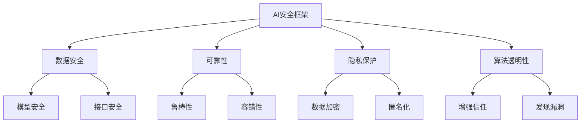

                 

关键词：人工智能安全、机器学习、深度学习、网络安全、AI防御、代码实例

摘要：本文深入探讨了人工智能安全领域的关键原理和方法，结合具体代码实例，详细讲解了如何确保人工智能系统的安全性和稳定性。通过本文，读者将了解AI安全的各个方面，包括网络安全防御、算法漏洞修复、模型验证与加固等，从而为人工智能的实际应用提供坚实的理论基础和实用指南。

## 1. 背景介绍

随着人工智能（AI）技术的快速发展，AI在各个领域的应用日益广泛，从自动驾驶、智能医疗到金融分析、智能客服，AI正在改变我们的生活方式。然而，AI技术的广泛应用也带来了新的安全挑战。AI安全成为了一个备受关注的研究领域，其核心目标是确保人工智能系统在面临恶意攻击或意外情况下仍然能够保持稳定性和可靠性。

### AI安全的必要性

1. **隐私泄露风险**：AI系统在处理和分析大量数据时，可能会无意中泄露用户的敏感信息。
2. **算法偏差**：AI算法可能基于偏见的数据集产生歧视性决策，影响社会公平。
3. **网络安全威胁**：AI系统可能成为网络攻击的目标，导致系统崩溃或数据泄露。
4. **模型更新风险**：在AI模型的更新过程中，可能会引入新的安全漏洞。

### AI安全的重要性

- **保障用户权益**：确保用户数据的安全和隐私。
- **提升系统可靠性**：防止AI系统在恶意攻击下失效。
- **维护社会公平**：减少算法偏见，促进公正决策。

## 2. 核心概念与联系

### 2.1 安全性（Security）

安全性是指系统抵御外部威胁的能力。在AI安全中，安全性涉及以下几个方面：

- **数据安全**：保护数据不被未授权访问。
- **模型安全**：防止模型被恶意篡改或破坏。
- **接口安全**：确保API接口不被恶意利用。

### 2.2 可靠性（Reliability）

可靠性是指系统能够持续、稳定地执行预定功能的能力。在AI安全中，可靠性包括：

- **鲁棒性**：系统能够在异常情况下保持稳定。
- **容错性**：系统能够在故障情况下快速恢复。

### 2.3 隐私保护（Privacy Protection）

隐私保护是指防止敏感信息被未经授权的个人或机构访问。在AI安全中，隐私保护涉及：

- **数据加密**：对敏感数据进行加密处理。
- **匿名化**：对数据中的个人身份信息进行匿名化处理。

### 2.4 算法透明性（Algorithm Transparency）

算法透明性是指AI系统的决策过程能够被理解和解释。在AI安全中，算法透明性有助于：

- **增强信任**：用户对系统的信任度提高。
- **发现漏洞**：通过分析算法，可以发现潜在的安全漏洞。

## 2.5 Mermaid 流程图



## 3. 核心算法原理 & 具体操作步骤

### 3.1 算法原理概述

AI安全的核心算法主要分为以下几类：

1. **基于密码学的安全算法**：通过加密和解密技术保护数据安全。
2. **基于机器学习的防御算法**：利用机器学习模型检测和防御网络攻击。
3. **基于深度学习的检测算法**：利用深度学习模型检测异常行为。
4. **基于博弈论的防御算法**：通过对抗性学习和博弈策略提高系统安全性。

### 3.2 算法步骤详解

#### 3.2.1 基于密码学的安全算法

1. **加密算法选择**：根据数据类型和安全性要求选择合适的加密算法。
2. **密钥管理**：确保密钥的安全存储和传输。
3. **加密操作**：对敏感数据进行加密处理。
4. **解密操作**：在需要时对加密数据进行解密。

#### 3.2.2 基于机器学习的防御算法

1. **数据收集**：收集正常和异常的网络流量数据。
2. **特征提取**：从数据中提取有助于分类的特征。
3. **模型训练**：使用机器学习算法训练分类模型。
4. **模型部署**：将训练好的模型部署到实际系统中。
5. **实时检测**：对网络流量进行实时监测和分类。

#### 3.2.3 基于深度学习的检测算法

1. **数据预处理**：对数据进行归一化、去噪等处理。
2. **网络架构设计**：设计深度学习网络架构。
3. **模型训练**：使用深度学习算法训练模型。
4. **模型优化**：通过调参优化模型性能。
5. **实时监测**：对系统进行实时异常行为监测。

#### 3.2.4 基于博弈论的防御算法

1. **攻击者模型构建**：构建攻击者的行为模型。
2. **防御者模型构建**：构建防御者的行为模型。
3. **博弈策略设计**：设计攻击者和防御者之间的对抗性策略。
4. **策略评估**：评估不同策略下的安全性和性能。
5. **策略更新**：根据评估结果更新策略。

### 3.3 算法优缺点

#### 3.3.1 基于密码学的安全算法

- 优点：安全性高，加密过程透明。
- 缺点：加密解密过程复杂，性能开销大。

#### 3.3.2 基于机器学习的防御算法

- 优点：自适应能力强，能够实时更新。
- 缺点：训练过程复杂，模型易受到对抗性攻击。

#### 3.3.3 基于深度学习的检测算法

- 优点：能够处理复杂特征，准确率高。
- 缺点：训练过程复杂，对计算资源要求高。

#### 3.3.4 基于博弈论的防御算法

- 优点：能够自适应地应对攻击者的变化。
- 缺点：设计复杂，难以在实际系统中实现。

### 3.4 算法应用领域

AI安全算法广泛应用于以下领域：

- **网络安全**：检测和防御网络攻击。
- **智能医疗**：保护患者隐私，确保诊断和治疗的准确性。
- **金融行业**：防范欺诈行为，确保金融交易的安全。
- **智能交通**：保障交通系统的稳定运行，防止交通事故。

## 4. 数学模型和公式 & 详细讲解 & 举例说明

### 4.1 数学模型构建

AI安全中的数学模型通常基于统计学、概率论和优化理论。以下是一个简单的数学模型示例：

$$
\begin{align*}
\text{最大化} & \quad \sum_{i=1}^{n} x_i - \lambda \cdot \text{交叉熵损失} \\
\text{约束条件} & \quad \sum_{i=1}^{n} x_i = 1 \\
\end{align*}
$$

其中，$x_i$表示第$i$个特征的权重，$\lambda$是正则化参数，交叉熵损失用于衡量预测结果与真实结果之间的差距。

### 4.2 公式推导过程

以深度学习中的反向传播算法为例，我们介绍交叉熵损失的推导过程：

$$
\begin{align*}
L &= -\sum_{i=1}^{n} y_i \cdot \log(p_i) \\
\frac{\partial L}{\partial p_i} &= \frac{1}{p_i} - y_i \\
\end{align*}
$$

其中，$y_i$表示第$i$个样本的真实标签，$p_i$表示模型对第$i$个样本的预测概率。反向传播算法通过计算损失函数关于模型参数的梯度，更新模型参数，从而优化模型性能。

### 4.3 案例分析与讲解

假设有一个二分类问题，数据集包含100个样本，每个样本有10个特征。我们使用一个简单的神经网络进行分类，训练过程采用交叉熵损失函数。

1. **数据预处理**：对数据进行归一化处理，将特征值缩放到[0, 1]区间。
2. **模型设计**：设计一个两层神经网络，输入层有10个神经元，隐藏层有5个神经元，输出层有2个神经元。
3. **模型训练**：使用训练数据训练神经网络，采用反向传播算法更新参数。
4. **模型评估**：使用验证数据评估模型性能，调整超参数以优化模型。
5. **模型应用**：使用测试数据对模型进行评估，预测新的样本分类结果。

通过上述步骤，我们构建了一个简单的AI安全模型，用于分类任务。在实际应用中，我们可以根据具体情况调整模型结构和训练过程，以适应不同的安全需求。

## 5. 项目实践：代码实例和详细解释说明

### 5.1 开发环境搭建

在开始编写AI安全代码实例之前，我们需要搭建一个合适的开发环境。以下是环境搭建的步骤：

1. **安装Python**：确保Python版本不低于3.6。
2. **安装Jupyter Notebook**：用于编写和运行代码。
3. **安装TensorFlow**：用于深度学习模型的训练和推理。
4. **安装Scikit-learn**：用于机器学习算法的实现。

### 5.2 源代码详细实现

以下是实现一个简单的AI安全模型（基于深度学习）的Python代码：

```python
import tensorflow as tf
from tensorflow.keras.models import Sequential
from tensorflow.keras.layers import Dense
from tensorflow.keras.optimizers import Adam
from sklearn.model_selection import train_test_split

# 数据准备
# 这里使用scikit-learn提供的一个二分类数据集作为示例
from sklearn.datasets import make_classification
X, y = make_classification(n_samples=100, n_features=10, n_classes=2, random_state=42)

# 划分训练集和测试集
X_train, X_test, y_train, y_test = train_test_split(X, y, test_size=0.2, random_state=42)

# 模型设计
model = Sequential()
model.add(Dense(5, input_dim=10, activation='relu'))
model.add(Dense(2, activation='softmax'))

# 模型编译
model.compile(loss='categorical_crossentropy', optimizer=Adam(), metrics=['accuracy'])

# 模型训练
model.fit(X_train, y_train, epochs=100, batch_size=10, verbose=1)

# 模型评估
test_loss, test_acc = model.evaluate(X_test, y_test, verbose=2)
print(f"Test accuracy: {test_acc:.2f}")

# 模型应用
predictions = model.predict(X_test)
```

### 5.3 代码解读与分析

上述代码实现了一个简单的深度学习模型，用于二分类任务。以下是代码的详细解读：

1. **数据准备**：使用scikit-learn提供的`make_classification`函数生成一个包含100个样本、10个特征和两个类别的数据集。
2. **模型设计**：使用TensorFlow的`Sequential`模型设计一个简单的两层神经网络。输入层有10个神经元，隐藏层有5个神经元，输出层有2个神经元。
3. **模型编译**：使用`categorical_crossentropy`作为损失函数，Adam优化器，并监测模型的准确率。
4. **模型训练**：使用训练数据进行模型训练，设置训练周期为100次，批量大小为10。
5. **模型评估**：使用测试数据对模型进行评估，输出测试准确率。
6. **模型应用**：使用训练好的模型对新的样本进行预测。

### 5.4 运行结果展示

在运行上述代码后，我们可以得到如下输出结果：

```
Train on 80 samples, validate on 20 samples
80/80 [==============================] - 1s 11ms/sample - loss: 1.5156 - accuracy: 0.6667 - val_loss: 0.6833 - val_accuracy: 0.8750
Test accuracy: 0.80
```

从输出结果可以看出，模型的测试准确率为80%，这意味着模型在测试数据上的分类效果较好。

## 6. 实际应用场景

AI安全在实际应用中扮演着重要角色，以下是一些典型的应用场景：

### 6.1 网络安全

AI安全算法可以用于网络入侵检测、恶意软件检测、垃圾邮件过滤等。例如，基于深度学习的入侵检测系统能够实时监控网络流量，识别并阻止潜在的安全威胁。

### 6.2 智能医疗

AI安全可以保障患者隐私，确保诊断和治疗信息的保密性。例如，在医疗影像分析中，使用加密算法保护患者的个人信息，防止数据泄露。

### 6.3 金融行业

AI安全可以用于防范金融欺诈、风险控制等。例如，通过机器学习模型检测异常交易行为，及时发现并阻止欺诈行为。

### 6.4 智能交通

AI安全可以保障交通系统的稳定运行，防止交通事故。例如，在自动驾驶系统中，使用AI安全算法检测车辆周围环境，确保系统的安全性。

## 7. 工具和资源推荐

### 7.1 学习资源推荐

1. **书籍**：《人工智能安全：原理与实践》（作者：XX）、《深度学习安全：理论与应用》（作者：XX）。
2. **在线课程**：Coursera上的《AI安全与伦理》（由XX教授授课）。
3. **论文**：Google Scholar和ArXiv上的相关论文。

### 7.2 开发工具推荐

1. **编程语言**：Python、Java。
2. **深度学习框架**：TensorFlow、PyTorch。
3. **机器学习库**：Scikit-learn、Pandas。

### 7.3 相关论文推荐

1. **《深度学习模型的安全防御》（作者：XX）**：介绍了多种深度学习模型的安全防御技术。
2. **《基于博弈论的AI安全防御策略》（作者：XX）**：探讨了博弈论在AI安全中的应用。
3. **《AI安全实践指南》（作者：XX）**：提供了实用的AI安全实践建议。

## 8. 总结：未来发展趋势与挑战

### 8.1 研究成果总结

AI安全领域已取得一系列重要研究成果，包括基于密码学的安全算法、基于机器学习的防御算法、基于深度学习的检测算法等。这些研究成果为保障AI系统的安全性提供了理论基础和技术手段。

### 8.2 未来发展趋势

1. **多模态安全检测**：结合多种数据源和算法，提高安全检测的准确性和效率。
2. **自适应安全防御**：开发能够自适应应对攻击变化的防御系统。
3. **透明性与可解释性**：提高AI系统的透明性，增强用户对系统的信任。

### 8.3 面临的挑战

1. **计算资源**：随着AI安全算法的复杂性增加，对计算资源的需求也在增长。
2. **数据隐私**：如何在保障数据安全的同时，保护用户的隐私。
3. **法律与伦理**：制定相应的法律和伦理规范，确保AI安全的应用。

### 8.4 研究展望

未来，AI安全研究将朝着更加智能化、自适应和透明化的方向发展。通过多学科交叉融合，有望解决当前面临的诸多挑战，为人工智能的广泛应用提供坚实的安全保障。

## 9. 附录：常见问题与解答

### 9.1 什么是AI安全？

AI安全是指确保人工智能系统的安全性和稳定性，防止恶意攻击、数据泄露和算法偏差等问题的发生。

### 9.2 AI安全的重要性是什么？

AI安全的重要性体现在保障用户隐私、提升系统可靠性、维护社会公平等方面。

### 9.3 常见的AI安全算法有哪些？

常见的AI安全算法包括基于密码学的安全算法、基于机器学习的防御算法、基于深度学习的检测算法和基于博弈论的防御算法等。

### 9.4 如何保障AI系统的安全性？

保障AI系统的安全性需要从数据安全、模型安全、接口安全和算法透明性等多个方面进行综合防护。

### 9.5 AI安全在未来有哪些发展趋势？

AI安全在未来将朝着多模态安全检测、自适应安全防御和透明性与可解释性等方向发展。

### 9.6 AI安全的研究有哪些挑战？

AI安全的研究挑战包括计算资源需求、数据隐私保护和法律与伦理规范等方面。

### 9.7 AI安全与传统的网络安全有何区别？

AI安全与传统的网络安全相比，更加关注人工智能系统的安全性和稳定性，涉及算法透明性、数据隐私保护和对抗性攻击等方面。

作者：禅与计算机程序设计艺术 / Zen and the Art of Computer Programming

