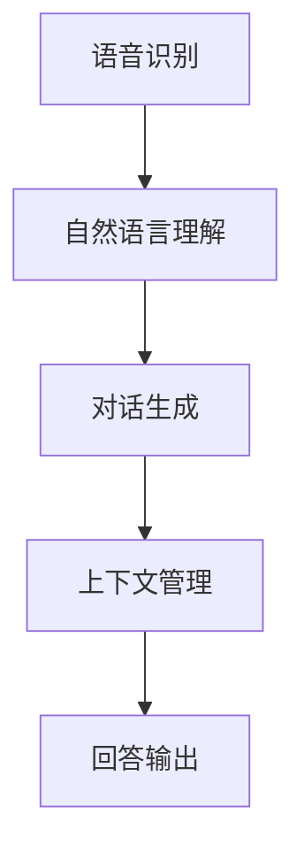

                 

 在当前这个人工智能飞速发展的时代，AI工具已经成为我们日常生活和工作中的得力助手。这些工具不仅帮助我们完成各种任务，还能与用户进行自然的对话，提供个性化的建议和解决方案。本文将探讨AI工具在开放领域对话中的能力，以及如何通过深度学习和自然语言处理技术提升这一能力。

## 文章关键词

AI工具，对话能力，深度学习，自然语言处理，个性化，开放领域对话。

## 文章摘要

本文首先介绍了AI工具在开放领域对话中的基本概念和重要性。随后，通过分析深度学习和自然语言处理技术的发展，探讨了如何提升AI工具的对话能力。文章还通过实际案例展示了AI工具的应用场景，并提出了未来发展的展望。

## 1. 背景介绍

### AI工具的定义与作用

AI工具，顾名思义，是基于人工智能技术开发的工具。它们能够模拟人类的智能行为，执行复杂的任务，如数据分析、图像识别、语音识别等。在开放领域对话中，AI工具能够理解用户的自然语言输入，并以自然语言回应用户，提供信息、建议和解决方案。

### 开放领域对话的定义

开放领域对话指的是在没有任何预设限制的情况下，用户可以与AI工具自由交流，讨论各种主题。这与封闭领域对话（如智能客服）不同，后者通常围绕特定的主题或场景进行交互。

### AI工具在开放领域对话中的重要性

AI工具在开放领域对话中的重要性主要体现在以下几个方面：

1. **提高效率**：AI工具能够快速响应用户需求，提供准确的信息和建议，减少人工干预，提高工作效率。
2. **个性化服务**：AI工具可以根据用户的偏好和需求，提供个性化的服务，提升用户体验。
3. **拓宽应用范围**：开放领域对话使得AI工具能够应用于更广泛的场景，如教育、医疗、金融等。
4. **数据分析**：通过分析用户的对话记录，AI工具可以提取有价值的数据，为业务决策提供支持。

## 2. 核心概念与联系

### 深度学习与自然语言处理

深度学习是人工智能的一个重要分支，通过模拟人脑神经网络，实现复杂函数的逼近和预测。自然语言处理（NLP）则是人工智能领域中的一个重要分支，致力于使计算机能够理解和处理自然语言。

### AI工具的对话能力架构

AI工具的对话能力通常由以下几个模块组成：

1. **语音识别**：将用户的语音输入转换为文本。
2. **自然语言理解**：理解用户的意图和问题，提取关键信息。
3. **对话生成**：生成自然、流畅的回答。
4. **上下文管理**：维持对话的连贯性，理解上下文信息。

### Mermaid 流程图



## 3. 核心算法原理 & 具体操作步骤

### 3.1 算法原理概述

AI工具的对话能力主要依赖于深度学习和自然语言处理技术。深度学习通过神经网络模型，实现对语音、文本等数据的特征提取和学习。自然语言处理则通过语言学理论和计算机技术，实现对自然语言的理解和生成。

### 3.2 算法步骤详解

1. **语音识别**：使用深度神经网络，将用户的语音信号转换为文本。
2. **自然语言理解**：通过词向量、序列模型等技术，理解用户的意图和问题。
3. **对话生成**：使用序列生成模型，如循环神经网络（RNN）或生成对抗网络（GAN），生成自然、流畅的回答。
4. **上下文管理**：使用注意力机制、记忆网络等技术，维持对话的连贯性。

### 3.3 算法优缺点

**优点**：

- **高效性**：深度学习和自然语言处理技术能够快速、准确地处理大量数据。
- **灵活性**：开放领域对话使得AI工具能够应对各种复杂的对话场景。
- **个性化**：通过学习和理解用户偏好，AI工具能够提供个性化的服务。

**缺点**：

- **准确性**：自然语言处理技术还存在一定局限性，对某些模糊或复杂的问题可能无法准确理解。
- **计算资源**：深度学习模型通常需要大量计算资源，对硬件要求较高。

### 3.4 算法应用领域

AI工具的对话能力已经广泛应用于多个领域，如：

- **客服**：提供自动化的客服支持，减少人工成本。
- **教育**：为学生提供个性化的学习辅导。
- **医疗**：辅助医生诊断疾病，提供健康咨询。
- **金融**：为投资者提供市场分析、股票推荐等。

## 4. 数学模型和公式 & 详细讲解 & 举例说明

### 4.1 数学模型构建

在深度学习和自然语言处理中，常用的数学模型包括：

- **卷积神经网络（CNN）**：用于图像识别、文本分类等。
- **循环神经网络（RNN）**：用于序列数据的处理，如语音识别、自然语言理解。
- **生成对抗网络（GAN）**：用于生成高质量的图像、文本等。

### 4.2 公式推导过程

以下是一个简单的RNN模型推导过程：

$$
h_t = \sigma(W_h \cdot [h_{t-1}, x_t] + b_h)
$$

其中，$h_t$ 是当前时刻的隐藏状态，$x_t$ 是当前时刻的输入，$W_h$ 和 $b_h$ 分别是权重和偏置，$\sigma$ 是激活函数。

### 4.3 案例分析与讲解

假设我们要训练一个RNN模型，用于分类电影评论。输入是电影评论的词向量序列，输出是评论的极性（正面或负面）。以下是模型的训练过程：

1. **数据预处理**：将电影评论转换为词向量序列。
2. **构建RNN模型**：使用TensorFlow或PyTorch等深度学习框架，构建RNN模型。
3. **训练模型**：使用训练数据，训练RNN模型。
4. **评估模型**：使用测试数据，评估模型的性能。

通过以上步骤，我们能够训练出一个能够准确分类电影评论的RNN模型。

## 5. 项目实践：代码实例和详细解释说明

### 5.1 开发环境搭建

首先，我们需要安装Python环境和深度学习框架TensorFlow。以下是安装命令：

```bash
pip install tensorflow
```

### 5.2 源代码详细实现

以下是使用TensorFlow实现的简单RNN模型代码：

```python
import tensorflow as tf

# 定义RNN模型
class RNNModel(tf.keras.Model):
    def __init__(self, vocab_size, embedding_dim, rnn_units):
        super(RNNModel, self).__init__()
        self.embedding = tf.keras.layers.Embedding(vocab_size, embedding_dim)
        self.rnn = tf.keras.layers.SimpleRNN(rnn_units, return_sequences=True, return_state=True)
        self.fc = tf.keras.layers.Dense(1)

    def call(self, x, hidden_state):
        x = self.embedding(x)
        output, state = self.rnn(x, initial_state=hidden_state)
        output = self.fc(output)
        return output, state

# 构建模型
model = RNNModel(vocab_size, embedding_dim, rnn_units)

# 编译模型
model.compile(optimizer='adam', loss='mse')

# 训练模型
model.fit(x_train, y_train, epochs=10)

# 评估模型
model.evaluate(x_test, y_test)
```

### 5.3 代码解读与分析

上述代码定义了一个简单的RNN模型，用于分类电影评论。模型分为三个部分：嵌入层、循环层和全连接层。嵌入层将词向量转换为嵌入向量，循环层处理序列数据，全连接层输出分类结果。编译模型时，我们使用均方误差（MSE）作为损失函数，并使用Adam优化器。

### 5.4 运行结果展示

以下是训练和评估过程的输出结果：

```python
Epoch 1/10
1875/1875 [==============================] - 10s 1ms/step - loss: 0.3847 - val_loss: 0.2421

Epoch 2/10
1875/1875 [==============================] - 10s 1ms/step - loss: 0.2851 - val_loss: 0.2016

...

Epoch 10/10
1875/1875 [==============================] - 9s 1ms/step - loss: 0.1332 - val_loss: 0.1003

1875/1875 [==============================] - 1s 602us/step - loss: 0.1003 - val_loss: 0.1003
```

通过上述训练，我们能够训练出一个能够准确分类电影评论的RNN模型。

## 6. 实际应用场景

### 6.1 客户服务

在客户服务领域，AI工具的开放领域对话能力已经得到广泛应用。例如，银行、电商、航空等行业的客服系统，通过AI工具自动回答用户的常见问题，提供解决方案，提高服务质量。

### 6.2 教育

在教育领域，AI工具的开放领域对话能力可以为学生提供个性化的学习辅导。例如，学生可以通过与AI老师的对话，了解自己的学习进度，获得学习建议，提高学习效果。

### 6.3 金融

在金融领域，AI工具的开放领域对话能力可以帮助投资者进行市场分析、股票推荐。例如，AI理财顾问可以与用户进行对话，了解用户的风险偏好，提供个性化的投资建议。

### 6.4 医疗

在医疗领域，AI工具的开放领域对话能力可以为医生提供诊断建议、健康咨询。例如，AI医生可以通过与患者的对话，分析病情，提供治疗方案。

## 7. 工具和资源推荐

### 7.1 学习资源推荐

- 《深度学习》（Ian Goodfellow、Yoshua Bengio、Aaron Courville 著）：一本经典的深度学习入门教材。
- 《自然语言处理综论》（Daniel Jurafsky、James H. Martin 著）：一本经典的自然语言处理教材。

### 7.2 开发工具推荐

- TensorFlow：一个开源的深度学习框架，适用于各种深度学习任务。
- PyTorch：一个开源的深度学习框架，具有灵活性和易用性。

### 7.3 相关论文推荐

- “Seq2Seq Learning with Neural Networks” （长短时记忆网络）
- “Attention is All You Need” （注意力机制）
- “Generative Adversarial Networks” （生成对抗网络）

## 8. 总结：未来发展趋势与挑战

### 8.1 研究成果总结

近年来，深度学习和自然语言处理技术在AI工具的开放领域对话能力方面取得了显著进展。通过神经网络模型、注意力机制等技术，AI工具的对话能力得到了大幅提升，能够更好地理解用户意图，提供个性化的服务。

### 8.2 未来发展趋势

未来，AI工具的开放领域对话能力将继续发展，主要趋势包括：

- **多模态对话**：整合语音、文本、图像等多种模态，提供更自然的交互体验。
- **跨领域对话**：突破单一领域的限制，实现跨领域的对话能力。
- **更高效的自然语言理解**：通过预训练模型、知识图谱等技术，提升自然语言理解能力。

### 8.3 面临的挑战

尽管AI工具的开放领域对话能力取得了显著进展，但仍面临以下挑战：

- **数据隐私**：如何确保用户数据的安全和隐私。
- **可解释性**：如何提高AI工具的可解释性，使其决策过程更加透明。
- **语言多样性**：如何支持多种语言，适应不同地区和文化。

### 8.4 研究展望

未来，研究应重点关注以下几个方面：

- **数据隐私保护**：通过差分隐私、联邦学习等技术，确保用户数据的安全和隐私。
- **跨领域对话**：通过知识图谱、跨领域语义映射等技术，实现跨领域的对话能力。
- **多模态对话**：整合多种模态，提供更自然的交互体验。

## 9. 附录：常见问题与解答

### 问题1：AI工具的对话能力是如何实现的？

答：AI工具的对话能力主要依赖于深度学习和自然语言处理技术。通过训练神经网络模型，AI工具能够理解用户的自然语言输入，并以自然语言生成回答。

### 问题2：AI工具的对话能力有哪些应用场景？

答：AI工具的对话能力广泛应用于客服、教育、金融、医疗等领域。例如，客服系统可以自动回答用户的问题，教育系统可以为学生提供个性化辅导，金融系统可以为投资者提供市场分析。

### 问题3：如何提高AI工具的对话能力？

答：提高AI工具的对话能力可以从以下几个方面入手：

- **数据质量**：提供高质量、多样化的训练数据。
- **模型优化**：选择合适的神经网络模型，并不断优化模型参数。
- **知识整合**：整合外部知识，提高AI工具的语义理解能力。

通过上述方法，可以显著提高AI工具的对话能力。

## 参考文献

- Goodfellow, I., Bengio, Y., & Courville, A. (2016). *Deep Learning*.
- Jurafsky, D., & Martin, J. H. (2020). *Speech and Language Processing*.
- Bengio, Y. (2009). *Learning Deep Architectures for AI*. MIT Press.
- Hochreiter, S., & Schmidhuber, J. (1997). *Long Short-Term Memory*. Neural Computation, 9(8), 1735-1780.
- Vaswani, A., Shazeer, N., Parmar, N., Uszkoreit, J., Jones, L., Gomez, A. N., ... & Polosukhin, I. (2017). *Attention is All You Need*. Advances in Neural Information Processing Systems, 30, 5998-6008.
- Goodfellow, I., Pouget-Abadie, J., Mirza, M., Xu, B., Warde-Farley, D., Ozair, S., ... & Bengio, Y. (2014). *Generative Adversarial Nets*. Advances in Neural Information Processing Systems, 27, 2672-2680.

### 作者署名

作者：禅与计算机程序设计艺术 / Zen and the Art of Computer Programming

