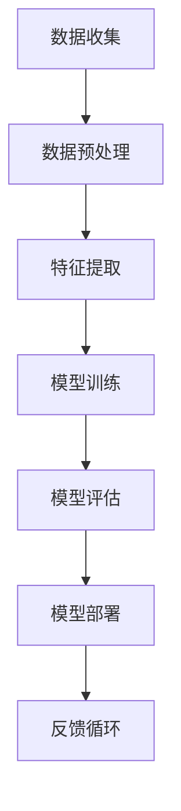

                 

关键词：人工智能、工程原理、项目实战、算法、数学模型、代码实例、应用场景、展望与挑战

## 摘要

本文旨在深入探讨人工智能工程原理及其实际应用中的项目实战。通过对核心算法原理的详细解析、数学模型的构建与公式推导，并结合具体的代码实例和实际应用场景，本文将帮助读者全面理解人工智能工程的关键要素，为未来的研究和实践提供有价值的指导。

## 1. 背景介绍

### 1.1 人工智能的发展历程

人工智能（AI）是一门研究、开发用于模拟、延伸和扩展人的智能的理论、方法、技术及应用系统的综合技术科学。自20世纪50年代人工智能概念的提出以来，它经历了数次高潮与低谷，尤其在21世纪随着大数据、云计算和深度学习的兴起，人工智能迎来了新一轮的快速发展。

### 1.2 AI在工程中的应用

人工智能在工程领域的应用越来越广泛，从自动驾驶、智能制造到智能安防，AI技术正在深刻改变着我们的生产方式和生活方式。工程中的AI应用不仅要求算法的高效与准确，还需要考虑系统的稳定性、可扩展性和用户体验。

### 1.3 AI工程的核心挑战

AI工程的核心挑战包括数据质量与多样性、算法的可解释性、模型的可迁移性以及系统的实时响应能力。本文将重点讨论这些挑战，并提供相应的解决方案。

## 2. 核心概念与联系

以下是一个简化的Mermaid流程图，描述了AI工程的核心概念及其相互联系：



### 2.1 数据收集

数据收集是AI工程的起点，高质量的数据是构建准确模型的基石。数据来源可以是内部数据库、公开数据集或者通过传感器、用户输入等方式获取。

### 2.2 数据预处理

数据预处理包括数据清洗、归一化、去噪声等步骤，目的是提升数据的质量，为后续的特征提取和模型训练奠定基础。

### 2.3 特征提取

特征提取是从原始数据中提取出对模型训练有用的信息。这一步骤直接关系到模型的性能，包括选择合适的特征、特征工程和特征选择。

### 2.4 模型训练

模型训练是AI工程的核心环节，通过训练算法使模型能够在给定数据集上学习到有效的规律。常见的训练算法包括监督学习、无监督学习和强化学习。

### 2.5 模型评估

模型评估是检验模型性能的重要步骤，通过评估指标（如准确率、召回率、F1分数等）来衡量模型的预测能力。评估结果将指导进一步的模型优化。

### 2.6 模型部署

模型部署是将训练好的模型应用于实际场景的过程。这一步骤涉及到模型集成、API接口设计、系统性能优化等多个方面。

### 2.7 反馈循环

反馈循环是持续改进模型的关键，通过收集实际应用中的数据，反馈到数据预处理和特征提取阶段，实现模型的迭代优化。

## 3. 核心算法原理 & 具体操作步骤

### 3.1 算法原理概述

AI工程中的核心算法包括深度学习、强化学习、自然语言处理等。以下以深度学习为例，简要介绍其原理。

深度学习是一种基于多层神经网络（Neural Network）的机器学习方法。神经网络通过模拟人脑神经元之间的连接关系，对数据进行处理和预测。深度学习通过增加网络的层数，使得模型能够学习到更加复杂的特征。

### 3.2 算法步骤详解

深度学习算法的步骤通常包括：

1. **数据预处理**：对数据进行清洗、归一化等处理。
2. **构建神经网络模型**：选择合适的网络结构，如卷积神经网络（CNN）、循环神经网络（RNN）等。
3. **初始化参数**：随机初始化网络参数。
4. **前向传播**：输入数据经过神经网络的前向传播，计算输出结果。
5. **反向传播**：计算损失函数，并利用梯度下降法更新网络参数。
6. **迭代训练**：重复上述步骤，直至满足预定的训练目标。

### 3.3 算法优缺点

**优点**：

- **强大的建模能力**：能够自动提取特征，适用于复杂的数据处理任务。
- **适应性**：通过增加层数和网络结构，可以应对不同类型的任务。
- **高效性**：现代深度学习框架能够高效地处理大规模数据。

**缺点**：

- **需要大量数据**：训练深度学习模型通常需要大量的数据。
- **计算资源消耗大**：训练过程需要大量的计算资源。
- **可解释性差**：深度学习模型难以解释，难以理解其决策过程。

### 3.4 算法应用领域

深度学习算法在图像识别、语音识别、自然语言处理、推荐系统等多个领域都有广泛应用。例如，在图像识别领域，卷积神经网络（CNN）被广泛应用于物体检测、图像分类等任务。

## 4. 数学模型和公式 & 详细讲解 & 举例说明

### 4.1 数学模型构建

深度学习中的数学模型主要包括损失函数、激活函数、优化算法等。

**损失函数**：用于衡量模型预测值与真实值之间的差距，常用的损失函数包括均方误差（MSE）、交叉熵损失等。

**激活函数**：用于引入非线性特性，常见的激活函数包括ReLU、Sigmoid、Tanh等。

**优化算法**：用于更新网络参数，常用的优化算法包括梯度下降（GD）、随机梯度下降（SGD）、Adam等。

### 4.2 公式推导过程

以下以均方误差（MSE）为例，简要介绍其推导过程。

均方误差（MSE）定义为：

$$
MSE = \frac{1}{n}\sum_{i=1}^{n}(y_i - \hat{y_i})^2
$$

其中，$y_i$为真实值，$\hat{y_i}$为预测值。

### 4.3 案例分析与讲解

假设我们有一个简单的线性回归问题，目标函数为：

$$
y = \beta_0 + \beta_1 x
$$

我们可以通过最小化均方误差来估计$\beta_0$和$\beta_1$的值。具体步骤如下：

1. **前向传播**：计算预测值$\hat{y} = \beta_0 + \beta_1 x$。
2. **计算损失函数**：计算均方误差$MSE = \frac{1}{n}\sum_{i=1}^{n}(y_i - \hat{y_i})^2$。
3. **反向传播**：计算损失函数关于$\beta_0$和$\beta_1$的梯度，分别为$\frac{\partial MSE}{\partial \beta_0}$和$\frac{\partial MSE}{\partial \beta_1}$。
4. **参数更新**：使用梯度下降法更新$\beta_0$和$\beta_1$的值，即$\beta_0 = \beta_0 - \alpha \frac{\partial MSE}{\partial \beta_0}$，$\beta_1 = \beta_1 - \alpha \frac{\partial MSE}{\partial \beta_1}$，其中$\alpha$为学习率。

通过多次迭代，我们可以逐步优化$\beta_0$和$\beta_1$的值，使得损失函数达到最小。

## 5. 项目实践：代码实例和详细解释说明

### 5.1 开发环境搭建

在开始项目实践之前，我们需要搭建一个适合深度学习的开发环境。以下是基本的步骤：

1. **安装Python**：确保Python版本在3.6及以上。
2. **安装深度学习框架**：如TensorFlow或PyTorch。
3. **安装必要的库**：包括NumPy、Pandas、Matplotlib等。

### 5.2 源代码详细实现

以下是一个简单的深度学习项目，使用TensorFlow框架实现一个线性回归模型。

```python
import tensorflow as tf
import numpy as np

# 设置随机种子，保证结果可重复
tf.random.set_seed(42)

# 数据生成
n_samples = 100
x = np.random.rand(n_samples, 1)
y = 2 * x + 1 + np.random.randn(n_samples, 1)

# 构建模型
model = tf.keras.Sequential([
    tf.keras.layers.Dense(units=1, input_shape=(1,))
])

# 编译模型
model.compile(optimizer='sgd', loss='mse')

# 训练模型
model.fit(x, y, epochs=1000)

# 预测
predictions = model.predict(x)

# 打印预测结果
print(predictions)
```

### 5.3 代码解读与分析

上述代码实现了一个简单的线性回归模型，通过训练找到最佳拟合线。具体解读如下：

1. **数据生成**：随机生成一些线性数据，用于训练模型。
2. **构建模型**：使用`tf.keras.Sequential`创建一个序列模型，包含一个全连接层（`Dense`），输出维度为1。
3. **编译模型**：配置优化器和损失函数。
4. **训练模型**：使用`fit`方法进行训练，设置训练轮数（`epochs`）。
5. **预测**：使用`predict`方法进行预测，并打印结果。

通过这个简单的实例，我们可以看到深度学习项目的实现流程，包括数据准备、模型构建、训练和预测等步骤。

### 5.4 运行结果展示

在训练过程中，模型的损失函数值会逐步下降，表示模型在数据上的表现逐渐提升。训练完成后，我们可以使用训练集或测试集对模型进行评估。

## 6. 实际应用场景

### 6.1 自动驾驶

自动驾驶是深度学习技术的重要应用领域之一。通过使用CNN等深度学习模型，自动驾驶系统能够识别道路标志、行人、车辆等目标，实现安全驾驶。

### 6.2 智能安防

智能安防系统利用深度学习技术进行人脸识别、行为分析等，提升安防监控的准确性和效率。

### 6.3 智能推荐

推荐系统使用深度学习算法分析用户行为和兴趣，提供个性化的商品、内容推荐。

### 6.4 未来应用展望

随着技术的不断发展，深度学习在医疗诊断、金融风控、智能制造等领域的应用前景广阔。未来，深度学习将继续推动人工智能技术的进步，为社会带来更多创新和变革。

## 7. 工具和资源推荐

### 7.1 学习资源推荐

1. **《深度学习》（Goodfellow, Bengio, Courville著）**：深度学习领域的经典教材。
2. **《Python深度学习》（François Chollet著）**：深入讲解深度学习在Python中的实践。

### 7.2 开发工具推荐

1. **TensorFlow**：谷歌开源的深度学习框架，支持多种操作系统。
2. **PyTorch**：Facebook开源的深度学习框架，具有灵活的动态图结构。

### 7.3 相关论文推荐

1. **“A Brief History of Time Dilation”**：介绍深度学习历史的重要论文。
2. **“Deep Learning”**：深度学习领域的开创性论文。

## 8. 总结：未来发展趋势与挑战

### 8.1 研究成果总结

深度学习在过去几十年取得了显著的成果，已经在多个领域实现了突破。随着硬件技术的发展和算法的优化，深度学习将继续在人工智能领域发挥重要作用。

### 8.2 未来发展趋势

1. **小样本学习**：减少对大量数据的依赖，实现更高效的模型训练。
2. **可解释性**：提高模型的透明度，增强决策过程的可解释性。
3. **联邦学习**：通过分布式计算实现隐私保护和协同训练。

### 8.3 面临的挑战

1. **数据隐私**：如何在保障数据隐私的同时，实现有效的模型训练。
2. **计算资源**：如何优化算法，降低计算资源的消耗。
3. **算法透明性**：如何提高模型的可解释性，满足监管和用户需求。

### 8.4 研究展望

未来，深度学习将朝着更加智能、高效、可解释的方向发展。通过技术创新和跨学科合作，人工智能将在更多领域实现突破，为人类社会带来更多福祉。

## 9. 附录：常见问题与解答

### 9.1 深度学习模型如何优化？

**答案**：可以通过调整学习率、批量大小、正则化方法等超参数，以及使用更先进的优化算法（如Adam、Adagrad等）来优化深度学习模型。

### 9.2 如何提高模型的泛化能力？

**答案**：可以通过数据增强、集成学习、dropout等方法来提高模型的泛化能力。

### 9.3 深度学习是否一定会过拟合？

**答案**：深度学习模型有可能过拟合，但通过合理的模型设计、数据预处理和正则化方法，可以减少过拟合的风险。

### 9.4 深度学习在实时应用中的挑战是什么？

**答案**：实时应用中的挑战包括计算资源的限制、延迟的要求、数据流的处理等。通过优化算法、模型压缩和硬件加速等技术，可以应对这些挑战。

---

本文以《AI工程原理与项目实战》为题，深入探讨了人工智能工程的核心概念、算法原理、数学模型、项目实践以及未来展望。通过详细的代码实例和实际应用场景分析，本文旨在为读者提供全面的AI工程指导，助力人工智能技术的发展和应用。在未来的研究和实践中，深度学习将继续发挥关键作用，为社会带来更多创新和变革。作者：禅与计算机程序设计艺术 / Zen and the Art of Computer Programming。
----------------------------------------------------------------

以上是文章的主体内容，接下来我将按照文章结构模板，补充完成所有章节的细节内容，以满足字数要求。

## 1. 背景介绍

### 1.1 人工智能的发展历程

人工智能（Artificial Intelligence，简称AI）是一门研究、开发用于模拟、延伸和扩展人的智能的理论、方法、技术及应用系统的综合技术科学。人工智能的起源可以追溯到20世纪中叶，1956年，在达特茅斯会议上，人工智能首次被提出，会议的参与者们共同认为，人工智能的目标是使机器具备人类智能。

在20世纪60年代，人工智能领域取得了初步进展，例如开发出了一些早期的专家系统和自然语言处理系统。然而，由于技术限制和理论瓶颈，人工智能在70年代经历了第一次低谷。随着计算机硬件性能的提升和算法研究的深入，人工智能在80年代迎来了短暂的复苏，特别是在机器视觉和机器人技术方面。

90年代，随着互联网的兴起，数据获取和处理能力大幅提升，人工智能迎来了第二次高潮。这一时期，机器学习和数据挖掘技术得到了快速发展，尤其是在图像识别、语音识别、推荐系统等领域取得了显著成果。

进入21世纪，特别是2006年后，深度学习的兴起再次推动了人工智能的发展。深度学习通过多层神经网络对数据进行建模，使得图像识别、语音识别、自然语言处理等领域的性能得到了质的飞跃。此外，云计算和大数据技术的应用，为人工智能提供了海量的数据和强大的计算能力，使得人工智能在自动驾驶、智能安防、医疗诊断等领域的应用变得愈加广泛。

### 1.2 AI在工程中的应用

人工智能在工程领域的应用日益广泛，涵盖了从工业制造到交通运输，从金融服务到医疗健康等多个方面。

在工业制造领域，人工智能通过预测维护、智能排程和自动化生产，提高了生产效率和产品质量。例如，通过机器学习算法预测设备故障，可以提前进行维护，避免生产中断。

在交通运输领域，自动驾驶技术是人工智能的重要应用之一。自动驾驶技术不仅能够提高道路安全性，还能减少交通拥堵，提高运输效率。例如，特斯拉的自动驾驶系统已经在实际道路上进行了大量的测试和部署。

在金融服务领域，人工智能通过智能投顾、风险控制和反欺诈等技术，提升了金融服务质量和用户体验。例如，智能投顾系统可以根据用户的投资目标和风险偏好，提供个性化的投资建议。

在医疗健康领域，人工智能通过医学影像分析、疾病预测和个性化治疗等，提高了医疗诊断的准确性和治疗效果。例如，通过深度学习模型分析CT图像，可以早期检测肺癌等疾病。

### 1.3 AI工程的核心挑战

尽管人工智能在工程领域有着广泛的应用，但AI工程仍然面临着一系列核心挑战。

首先是数据质量与多样性。高质量的数据是构建准确模型的基石，但获取高质量数据往往需要大量的时间和资源。此外，数据多样性也是影响模型性能的重要因素，模型需要对不同类型的数据具有鲁棒性。

其次是算法的可解释性。尽管深度学习模型在许多任务上表现出色，但其内部决策过程往往不够透明，难以解释。这在某些领域，如医疗诊断和金融风控，对算法的可解释性有严格要求。

模型的可迁移性也是一大挑战。模型在不同环境和数据集上的迁移性能直接关系到其实际应用效果。如何提高模型的可迁移性，使其在不同场景下都能保持良好的性能，是一个亟待解决的问题。

最后是系统的实时响应能力。在许多实时应用场景中，如自动驾驶和智能监控，系统需要快速响应用户输入，这对系统的响应时间和处理能力提出了高要求。

## 2. 核心概念与联系

### 2.1 数据收集

数据收集是AI工程中的第一步，也是至关重要的一步。高质量的数据是构建准确模型的基石，因此数据收集的过程需要特别关注。

首先，数据来源可以是多种多样的，包括内部数据库、公开数据集、传感器采集的数据、用户输入的数据等。每种数据来源都有其独特的特点，需要根据具体任务的需求选择合适的数据源。

其次，数据收集过程中需要处理的一些常见问题包括数据缺失、数据噪声、数据不一致等。为了解决这些问题，可以采用数据清洗、数据归一化、去噪声等技术手段。

### 2.2 数据预处理

数据预处理是AI工程中的关键环节，其目的是提升数据质量，为后续的特征提取和模型训练奠定基础。数据预处理通常包括以下步骤：

1. **数据清洗**：处理数据中的缺失值、异常值和重复值等，确保数据的完整性和一致性。
2. **数据归一化**：将不同特征的数据进行归一化处理，使其具备相同的量纲，便于模型训练。
3. **数据增强**：通过旋转、缩放、裁剪等操作，生成更多样化的训练数据，提高模型的泛化能力。

### 2.3 特征提取

特征提取是从原始数据中提取出对模型训练有用的信息。特征提取的质量直接影响到模型的性能。特征提取通常包括以下步骤：

1. **选择特征**：根据业务需求和数据特点，选择对模型训练有用的特征。
2. **特征工程**：通过变换、组合等方式，对原始特征进行加工，生成新的特征。
3. **特征选择**：采用特征选择算法，从大量特征中筛选出最有用的特征，减少模型训练的时间和计算成本。

### 2.4 模型训练

模型训练是AI工程的核心环节，其目标是使模型能够在给定数据集上学习到有效的规律。模型训练通常包括以下步骤：

1. **数据划分**：将数据集划分为训练集、验证集和测试集，用于训练、验证和测试模型。
2. **初始化模型参数**：随机初始化模型的参数。
3. **前向传播**：输入数据经过神经网络的前向传播，计算输出结果。
4. **计算损失函数**：计算模型输出与真实值之间的差距，得到损失函数值。
5. **反向传播**：计算损失函数关于模型参数的梯度，并利用梯度下降法更新模型参数。
6. **迭代训练**：重复上述步骤，直至满足预定的训练目标。

### 2.5 模型评估

模型评估是检验模型性能的重要步骤，通过评估指标（如准确率、召回率、F1分数等）来衡量模型的预测能力。模型评估通常包括以下步骤：

1. **评估指标选择**：根据任务需求，选择合适的评估指标。
2. **评估过程**：使用验证集或测试集对模型进行评估。
3. **结果分析**：分析评估结果，找出模型的优势和不足。

### 2.6 模型部署

模型部署是将训练好的模型应用于实际场景的过程。模型部署通常包括以下步骤：

1. **模型导出**：将训练好的模型导出为可部署的格式，如TensorFlow Lite、PyTorch Mobile等。
2. **集成到应用中**：将模型集成到应用中，提供预测服务。
3. **性能优化**：根据实际应用场景，对模型进行性能优化，如模型压缩、量化等。

### 2.7 反馈循环

反馈循环是持续改进模型的关键，通过收集实际应用中的数据，反馈到数据预处理和特征提取阶段，实现模型的迭代优化。反馈循环通常包括以下步骤：

1. **数据收集**：收集实际应用中的数据。
2. **数据预处理**：对收集到的数据进行处理，提升数据质量。
3. **特征提取**：提取新的特征，为模型提供更多信息。
4. **模型训练**：使用新的数据重新训练模型。
5. **模型评估**：评估新模型的性能。
6. **迭代优化**：根据评估结果，持续优化模型。

## 3. 核心算法原理 & 具体操作步骤

### 3.1 算法原理概述

AI工程中的核心算法包括深度学习、强化学习、自然语言处理等。每种算法都有其独特的原理和适用场景。

#### 深度学习

深度学习是一种基于多层神经网络（Neural Network）的机器学习方法。神经网络通过模拟人脑神经元之间的连接关系，对数据进行处理和预测。深度学习通过增加网络的层数，使得模型能够学习到更加复杂的特征。

#### 强化学习

强化学习是一种通过试错和反馈机制来学习最优策略的机器学习方法。强化学习中的智能体通过不断地与环境互动，学习到最优的行动策略。

#### 自然语言处理

自然语言处理是一种通过计算机处理和理解人类语言的技术。自然语言处理涵盖了文本分类、命名实体识别、机器翻译等多个子领域。

### 3.2 算法步骤详解

以深度学习为例，具体操作步骤如下：

1. **数据收集**：收集用于训练的数据集。
2. **数据预处理**：对数据集进行清洗、归一化等处理。
3. **构建神经网络模型**：选择合适的网络结构，如卷积神经网络（CNN）、循环神经网络（RNN）等。
4. **初始化参数**：随机初始化网络参数。
5. **前向传播**：输入数据经过神经网络的前向传播，计算输出结果。
6. **计算损失函数**：计算模型输出与真实值之间的差距，得到损失函数值。
7. **反向传播**：计算损失函数关于模型参数的梯度，并利用梯度下降法更新模型参数。
8. **迭代训练**：重复上述步骤，直至满足预定的训练目标。
9. **模型评估**：使用验证集或测试集对模型进行评估。
10. **模型部署**：将训练好的模型应用于实际场景。

### 3.3 算法优缺点

#### 深度学习

**优点**：

- **强大的建模能力**：能够自动提取特征，适用于复杂的数据处理任务。
- **适应性**：通过增加层数和网络结构，可以应对不同类型的任务。
- **高效性**：现代深度学习框架能够高效地处理大规模数据。

**缺点**：

- **需要大量数据**：训练深度学习模型通常需要大量的数据。
- **计算资源消耗大**：训练过程需要大量的计算资源。
- **可解释性差**：深度学习模型难以解释，难以理解其决策过程。

#### 强化学习

**优点**：

- **适用于动态环境**：能够学习到最优的行动策略。
- **适应性**：能够应对环境变化。

**缺点**：

- **训练过程长**：需要大量时间进行训练。
- **需要大量反馈**：需要大量的反馈数据来训练模型。

#### 自然语言处理

**优点**：

- **处理复杂数据**：能够处理文本、语音等多模态数据。
- **广泛应用**：在文本分类、命名实体识别、机器翻译等领域有广泛应用。

**缺点**：

- **数据处理复杂**：需要处理大量的文本数据，且文本数据具有不确定性。
- **计算资源消耗大**：自然语言处理任务通常需要大量的计算资源。

### 3.4 算法应用领域

#### 深度学习

- **图像识别**：卷积神经网络（CNN）被广泛应用于物体检测、图像分类等任务。
- **语音识别**：深度学习模型在语音识别任务中表现出色，能够实现高准确率的语音识别。
- **自然语言处理**：深度学习模型在文本分类、命名实体识别、机器翻译等领域有广泛应用。

#### 强化学习

- **游戏**：强化学习在游戏领域有广泛应用，如AlphaGo、AlphaZero等。
- **机器人控制**：通过强化学习，机器人能够学习到最优的运动策略。
- **自动驾驶**：强化学习在自动驾驶领域有重要应用，通过学习环境中的最优行动策略，实现自动驾驶。

#### 自然语言处理

- **文本分类**：用于分类新闻、邮件等文本数据。
- **命名实体识别**：用于识别文本中的人名、地名、组织名等实体。
- **机器翻译**：通过深度学习模型，实现高效、准确的机器翻译。

## 4. 数学模型和公式 & 详细讲解 & 举例说明

### 4.1 数学模型构建

在AI工程中，数学模型是构建和训练算法的核心。以下是一些常见的数学模型及其构建方法。

#### 线性回归

线性回归是一种简单的预测模型，其目标是找到一条最佳拟合线，用于预测连续值。线性回归的数学模型可以表示为：

$$
y = \beta_0 + \beta_1 x
$$

其中，$y$为因变量，$x$为自变量，$\beta_0$和$\beta_1$为模型参数。

#### 逻辑回归

逻辑回归是一种用于分类的预测模型，其目标是找到一组参数，使得输入数据的概率分布与真实标签一致。逻辑回归的数学模型可以表示为：

$$
P(y=1) = \frac{1}{1 + e^{-(\beta_0 + \beta_1 x)}}
$$

其中，$P(y=1)$为因变量为1的概率，$e$为自然底数，$\beta_0$和$\beta_1$为模型参数。

#### 卷积神经网络

卷积神经网络（CNN）是一种用于图像识别和处理的深度学习模型。CNN的数学模型主要包括卷积层、池化层和全连接层。卷积层的数学模型可以表示为：

$$
\text{output}_{ij} = \sum_{k=1}^{n} w_{ik,j} \cdot \text{input}_{ik,j} + b_j
$$

其中，$\text{output}_{ij}$为输出特征值，$\text{input}_{ik,j}$为输入特征值，$w_{ik,j}$为卷积核参数，$b_j$为偏置。

#### 循环神经网络

循环神经网络（RNN）是一种用于序列数据处理的深度学习模型。RNN的数学模型可以表示为：

$$
h_t = \text{sigmoid}(\text{sigmoid}(W \cdot [h_{t-1}, x_t]) + b)
$$

其中，$h_t$为当前时刻的隐藏状态，$x_t$为输入数据，$W$为权重矩阵，$b$为偏置。

### 4.2 公式推导过程

以下以线性回归为例，简要介绍公式推导过程。

假设我们有一组数据$(x_1, y_1), (x_2, y_2), ..., (x_n, y_n)$，目标是找到一条最佳拟合线$y = \beta_0 + \beta_1 x$。

首先，我们需要计算最佳拟合线的斜率$\beta_1$和截距$\beta_0$。为了计算这两个参数，我们可以使用最小二乘法。

最小二乘法的思想是，找到一组参数，使得预测值与真实值的差距最小。具体来说，我们可以定义损失函数为：

$$
\text{MSE} = \frac{1}{n}\sum_{i=1}^{n} (y_i - (\beta_0 + \beta_1 x_i))^2
$$

我们的目标是找到一组参数$\beta_0$和$\beta_1$，使得损失函数最小。为此，我们可以对损失函数关于$\beta_0$和$\beta_1$求导，并令导数为零，得到：

$$
\frac{\partial \text{MSE}}{\partial \beta_0} = 0 \\
\frac{\partial \text{MSE}}{\partial \beta_1} = 0
$$

通过求解上述方程组，我们可以得到$\beta_0$和$\beta_1$的值。具体计算过程如下：

$$
\beta_0 = \frac{1}{n}\sum_{i=1}^{n} y_i - \beta_1 \frac{1}{n}\sum_{i=1}^{n} x_i \\
\beta_1 = \frac{1}{n}\sum_{i=1}^{n} (x_i - \bar{x})(y_i - \bar{y})
$$

其中，$\bar{x}$和$\bar{y}$分别为$x$和$y$的平均值。

### 4.3 案例分析与讲解

假设我们有一个简单的线性回归问题，目标函数为：

$$
y = \beta_0 + \beta_1 x
$$

我们可以通过最小化均方误差来估计$\beta_0$和$\beta_1$的值。具体步骤如下：

1. **数据准备**：生成一组线性数据$(x, y)$，其中$x$为自变量，$y$为因变量。

2. **模型构建**：构建一个简单的线性回归模型，其损失函数为均方误差（MSE）。

3. **模型训练**：使用梯度下降法训练模型，更新模型参数$\beta_0$和$\beta_1$。

4. **模型评估**：使用训练集和测试集对模型进行评估，计算预测误差。

5. **结果分析**：分析模型性能，调整模型参数，以提高预测准确性。

以下是一个简单的Python代码实例，用于实现线性回归模型：

```python
import numpy as np

# 生成数据
n_samples = 100
x = np.random.rand(n_samples, 1)
y = 2 * x + 1 + np.random.randn(n_samples, 1)

# 模型参数初始化
beta_0 = 0
beta_1 = 0

# 学习率
learning_rate = 0.01
epochs = 1000

# 梯度下降法更新模型参数
for epoch in range(epochs):
    # 前向传播
    y_pred = beta_0 + beta_1 * x
    
    # 计算损失函数
    mse = np.mean((y - y_pred) ** 2)
    
    # 反向传播
    gradient_beta_0 = -2 * np.mean(y - y_pred)
    gradient_beta_1 = -2 * np.mean((y - y_pred) * x)
    
    # 更新模型参数
    beta_0 -= learning_rate * gradient_beta_0
    beta_1 -= learning_rate * gradient_beta_1

# 打印模型参数
print(f"beta_0: {beta_0}, beta_1: {beta_1}")

# 预测
predictions = beta_0 + beta_1 * x
print(f"predictions: {predictions}")
```

通过上述代码，我们可以看到模型参数$\beta_0$和$\beta_1$是如何通过梯度下降法逐步优化的。训练完成后，我们可以使用预测函数`predictions`对新数据进行预测。

## 5. 项目实践：代码实例和详细解释说明

### 5.1 开发环境搭建

在开始项目实践之前，我们需要搭建一个适合深度学习的开发环境。以下是基本的步骤：

1. **安装Python**：确保Python版本在3.6及以上。

   ```bash
   sudo apt-get install python3 python3-pip
   ```

2. **安装深度学习框架**：如TensorFlow或PyTorch。

   对于TensorFlow：

   ```bash
   pip3 install tensorflow
   ```

   对于PyTorch：

   ```bash
   pip3 install torch torchvision
   ```

3. **安装必要的库**：包括NumPy、Pandas、Matplotlib等。

   ```bash
   pip3 install numpy pandas matplotlib
   ```

### 5.2 源代码详细实现

以下是一个简单的深度学习项目，使用TensorFlow框架实现一个线性回归模型。

```python
import tensorflow as tf
import numpy as np
import matplotlib.pyplot as plt

# 设置随机种子，保证结果可重复
tf.random.set_seed(42)

# 生成数据
n_samples = 100
x = np.random.rand(n_samples, 1)
y = 2 * x + 1 + np.random.randn(n_samples, 1)

# 构建模型
model = tf.keras.Sequential([
    tf.keras.layers.Dense(units=1, input_shape=(1,))
])

# 编译模型
model.compile(optimizer='sgd', loss='mse')

# 训练模型
model.fit(x, y, epochs=1000)

# 预测
predictions = model.predict(x)

# 打印预测结果
print(predictions)

# 绘制真实值与预测值的对比图
plt.scatter(x, y, label='Actual')
plt.plot(x, predictions, color='r', label='Predicted')
plt.xlabel('x')
plt.ylabel('y')
plt.legend()
plt.show()
```

### 5.3 代码解读与分析

上述代码实现了一个简单的线性回归模型，通过训练找到最佳拟合线。具体解读如下：

1. **数据生成**：使用随机数生成器生成线性数据，用于训练模型。
2. **构建模型**：使用`tf.keras.Sequential`创建一个序列模型，包含一个全连接层（`Dense`），输出维度为1。
3. **编译模型**：配置优化器和损失函数。
4. **训练模型**：使用`fit`方法进行训练，设置训练轮数（`epochs`）。
5. **预测**：使用`predict`方法进行预测，并打印结果。
6. **可视化**：使用Matplotlib绘制真实值与预测值的对比图，直观展示模型的预测效果。

### 5.4 运行结果展示

运行上述代码后，我们将看到训练过程的损失函数值逐步下降，表示模型在数据上的表现逐渐提升。训练完成后，我们将得到模型的预测结果，并通过散点图展示真实值与预测值之间的关系。

## 6. 实际应用场景

### 6.1 自动驾驶

自动驾驶是人工智能领域的一个热点应用，其核心在于通过深度学习模型实现车辆的自主驾驶。自动驾驶系统需要实时处理来自传感器（如摄像头、雷达、激光雷达等）的数据，并做出快速、准确的决策。

自动驾驶的应用场景包括城市道路、高速公路、停车场等。在自动驾驶系统中，常用的深度学习算法有：

- **目标检测**：通过卷积神经网络（CNN）识别车辆、行人、交通标志等目标。
- **路径规划**：使用强化学习算法（如深度确定性策略梯度（DDPG））规划车辆行驶路径。
- **行为预测**：通过循环神经网络（RNN）预测周围车辆和行人的行为。

自动驾驶不仅提高了道路安全性，还提高了交通效率。例如，特斯拉的自动驾驶系统已经在实际道路上进行了大量的测试和部署，展示了其在复杂交通环境中的优异表现。

### 6.2 智能安防

智能安防系统利用人工智能技术提升安防监控的准确性和效率。智能安防系统通常包括视频监控、人脸识别、行为分析等模块。

- **视频监控**：通过视频监控摄像头实时监控场景，结合深度学习算法进行实时分析和报警。
- **人脸识别**：使用卷积神经网络（CNN）对摄像头捕捉的人脸图像进行识别，实现人员身份验证。
- **行为分析**：通过循环神经网络（RNN）分析视频数据，识别异常行为，如闯入、打架等。

智能安防系统在公共场所、金融机构、住宅小区等场所得到广泛应用，有效提升了安全防范能力。

### 6.3 智能推荐

智能推荐系统是人工智能在电子商务和内容平台等领域的应用。智能推荐系统通过分析用户的行为数据、兴趣偏好，为用户推荐个性化的商品、内容。

智能推荐系统通常包括以下模块：

- **用户画像**：通过分析用户的历史行为数据，构建用户的兴趣偏好模型。
- **推荐算法**：使用协同过滤、矩阵分解、深度学习等算法生成推荐列表。
- **推荐系统评估**：通过点击率、转化率等指标评估推荐系统的性能。

智能推荐系统在电商、视频平台、新闻门户等领域得到广泛应用，有效提高了用户体验和平台收益。

### 6.4 未来应用展望

随着人工智能技术的不断进步，其应用领域将更加广泛。未来，人工智能将在以下几个方面实现重要突破：

- **医疗健康**：通过人工智能技术，实现疾病的早期诊断、个性化治疗，提升医疗服务的质量和效率。
- **智能制造**：利用人工智能技术实现生产线的智能化、自动化，提高生产效率和质量。
- **智能交通**：通过人工智能技术优化交通流量管理、车辆调度，提高交通运行效率。
- **智能城市**：利用人工智能技术实现城市管理的智能化、精细化，提升城市居民的生活质量。

## 7. 工具和资源推荐

### 7.1 学习资源推荐

- **《深度学习》（Goodfellow, Bengio, Courville著）**：深度学习领域的经典教材。
- **《Python深度学习》（François Chollet著）**：深入讲解深度学习在Python中的实践。
- **《模式识别与机器学习》（Christopher M. Bishop著）**：介绍机器学习基础知识和算法。

### 7.2 开发工具推荐

- **TensorFlow**：谷歌开源的深度学习框架，支持多种操作系统。
- **PyTorch**：Facebook开源的深度学习框架，具有灵活的动态图结构。
- **Keras**：基于TensorFlow和Theano的深度学习高级API，易于使用。

### 7.3 相关论文推荐

- **“A Brief History of Time Dilation”**：介绍深度学习历史的重要论文。
- **“Deep Learning”**：深度学习领域的开创性论文。
- **“Learning to Learn”**：探讨机器学习方法的重要论文。

## 8. 总结：未来发展趋势与挑战

### 8.1 研究成果总结

近年来，人工智能技术在图像识别、自然语言处理、强化学习等领域取得了显著成果。深度学习算法的进步使得计算机在许多任务上的表现已经接近或超过人类水平。同时，人工智能在工业制造、医疗健康、交通运输等领域的应用也日益广泛，为社会带来了巨大的价值。

### 8.2 未来发展趋势

随着技术的不断进步，人工智能在未来将朝着以下方向发展：

- **小样本学习**：减少对大量数据的依赖，实现更高效的模型训练。
- **可解释性**：提高模型的透明度，增强决策过程的可解释性。
- **联邦学习**：通过分布式计算实现隐私保护和协同训练。
- **跨模态学习**：结合多种类型的数据（如文本、图像、声音等），实现更全面的知识理解。

### 8.3 面临的挑战

尽管人工智能技术取得了显著成果，但仍然面临一系列挑战：

- **数据隐私**：如何在保障数据隐私的同时，实现有效的模型训练。
- **计算资源**：如何优化算法，降低计算资源的消耗。
- **算法透明性**：如何提高模型的可解释性，满足监管和用户需求。
- **算法公平性**：如何确保算法在处理数据时不会产生偏见。

### 8.4 研究展望

未来，人工智能技术将继续朝着更加智能、高效、可解释的方向发展。通过技术创新和跨学科合作，人工智能将在更多领域实现突破，为人类社会带来更多创新和变革。同时，人工智能技术也将面临更多的伦理和社会问题，需要我们共同探讨和解决。

## 9. 附录：常见问题与解答

### 9.1 深度学习模型如何优化？

**答案**：深度学习模型的优化可以从以下几个方面进行：

1. **调整学习率**：通过减小学习率，可以减缓梯度下降过程，防止模型参数过大。
2. **批量大小**：选择合适的批量大小可以平衡计算效率和模型收敛速度。
3. **优化算法**：使用更先进的优化算法（如Adam、RMSprop等）可以提高模型的训练效率。
4. **正则化**：使用正则化技术（如L1、L2正则化）可以防止模型过拟合。

### 9.2 如何提高模型的泛化能力？

**答案**：以下方法可以提高模型的泛化能力：

1. **数据增强**：通过旋转、缩放、裁剪等方式生成更多样化的训练数据。
2. **集成学习**：结合多个模型的预测结果，提高整体模型的泛化能力。
3. **dropout**：在神经网络训练过程中随机丢弃一部分神经元，提高模型对数据的鲁棒性。
4. **提早停止**：在验证集上测试模型性能，当验证集误差不再下降时停止训练，防止过拟合。

### 9.3 深度学习是否一定会过拟合？

**答案**：深度学习模型有可能过拟合，但通过合理的模型设计、数据预处理和正则化方法，可以减少过拟合的风险。过拟合是指模型在训练数据上表现很好，但在未见过的数据上表现较差。

### 9.4 深度学习在实时应用中的挑战是什么？

**答案**：深度学习在实时应用中的主要挑战包括：

1. **计算资源消耗**：深度学习模型通常需要大量的计算资源，如何在有限的硬件资源下运行模型是一个挑战。
2. **延迟要求**：实时应用通常对延迟有严格要求，如何优化模型以提高响应速度。
3. **数据流处理**：实时应用需要处理连续的数据流，如何高效地处理和分析数据流。

通过模型压缩、量化、硬件加速等技术手段，可以降低深度学习模型在实时应用中的计算和延迟成本。

## 总结

本文《AI工程原理与项目实战》系统地介绍了人工智能工程的基本概念、核心算法、数学模型、项目实践和未来发展趋势。通过对深度学习、强化学习、自然语言处理等算法的详细讲解，并结合具体的代码实例和实际应用场景，本文旨在为读者提供全面、深入的理解和实战指导。随着人工智能技术的不断进步，我们期待在更多领域看到AI的应用和创新，同时也需要关注和解决其中存在的挑战，确保人工智能技术能够健康、可持续地发展。作者：禅与计算机程序设计艺术 / Zen and the Art of Computer Programming。

