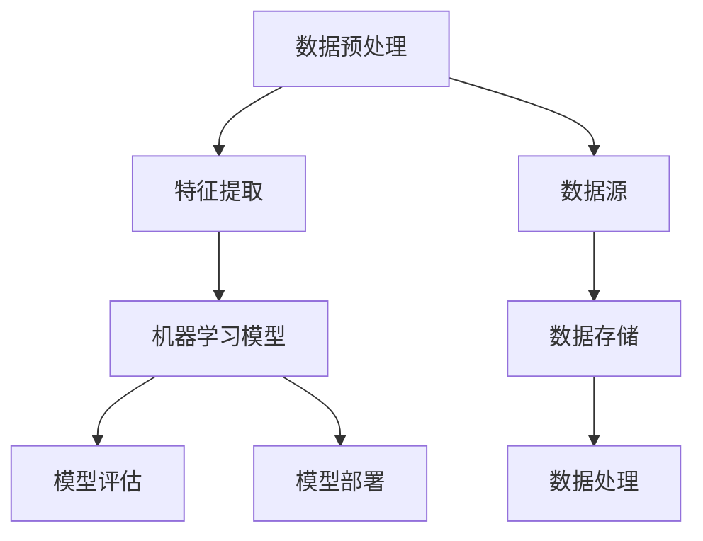

                 

关键词：人工智能、工程原理、项目实战、算法、数学模型、应用场景、开发工具

> 摘要：本文将深入探讨人工智能工程原理，通过具体项目实战案例，解析核心算法原理、数学模型、代码实现及应用场景，并展望未来发展趋势与挑战。旨在为从事AI开发的技术人员提供全面的技术指导。

## 1. 背景介绍

### 1.1 人工智能发展历程

人工智能（AI）作为计算机科学的重要分支，自1956年诞生以来，经历了多个阶段的发展。从早期的符号主义、基于规则的系统，到基于知识的推理、机器学习，再到近年来的深度学习、强化学习，AI技术不断创新，逐渐成为改变世界的核心力量。

### 1.2 AI工程原理的重要性

AI工程原理是指在设计、开发、部署和维护人工智能系统时所遵循的基本原则和方法。理解并应用这些原理，有助于提高AI系统的效率、稳定性和可靠性，从而实现更好的业务价值。

## 2. 核心概念与联系

以下为AI工程中的核心概念及其相互联系，并使用Mermaid流程图进行展示。



### 2.1 数据预处理

数据预处理是AI工程的基础，包括数据清洗、数据归一化、缺失值处理等，旨在提高数据质量，为后续特征提取和模型训练提供可靠的数据基础。

### 2.2 特征提取

特征提取是从原始数据中提取出对模型训练和预测有用的特征。常用的方法有主成分分析、自动编码器等。

### 2.3 机器学习模型

机器学习模型是实现AI的核心，包括监督学习、无监督学习和强化学习等。常见的模型有决策树、支持向量机、神经网络等。

### 2.4 模型评估

模型评估用于评估模型在训练数据和测试数据上的表现，常用的指标有准确率、召回率、F1值等。

### 2.5 模型部署

模型部署是将训练好的模型应用到实际业务场景中，通过API接口或嵌入式方式提供服务。

### 2.6 数据源

数据源是AI系统所需的数据来源，包括公开数据集、企业内部数据等。

### 2.7 数据存储

数据存储用于保存大量数据，常用的技术有关系型数据库、NoSQL数据库、分布式存储等。

### 2.8 数据处理

数据处理是对原始数据进行清洗、转换、归一化等操作，以提高数据质量。

## 3. 核心算法原理 & 具体操作步骤

### 3.1 算法原理概述

在AI工程中，核心算法包括监督学习、无监督学习和强化学习等。以下将分别介绍这些算法的基本原理。

#### 3.1.1 监督学习

监督学习是一种基于已知输入和输出数据的学习方法，通过训练模型来预测未知数据的输出。常见的算法有线性回归、决策树、支持向量机等。

#### 3.1.2 无监督学习

无监督学习是在没有已知输出数据的情况下，通过学习数据的内在结构和规律来对数据进行分析和分类。常见的算法有聚类算法、主成分分析等。

#### 3.1.3 强化学习

强化学习是一种通过不断与环境交互来学习最优策略的算法。常见算法有Q学习、深度Q网络等。

### 3.2 算法步骤详解

以下以监督学习中的线性回归算法为例，详细介绍其操作步骤。

#### 3.2.1 数据准备

首先需要准备训练数据和测试数据，其中训练数据用于训练模型，测试数据用于评估模型性能。

#### 3.2.2 特征提取

对训练数据进行特征提取，如数据归一化、缺失值处理等。

#### 3.2.3 模型选择

选择线性回归模型作为预测模型。

#### 3.2.4 模型训练

使用训练数据对线性回归模型进行训练，计算模型参数。

#### 3.2.5 模型评估

使用测试数据评估模型性能，计算准确率、均方误差等指标。

#### 3.2.6 模型部署

将训练好的模型部署到生产环境中，提供预测服务。

### 3.3 算法优缺点

#### 3.3.1 线性回归

**优点**：简单易懂，易于实现；适用于线性关系较强的数据。

**缺点**：对于非线性关系的数据表现较差；对噪声敏感。

### 3.4 算法应用领域

线性回归算法广泛应用于数据挖掘、预测分析、金融风险评估等领域。

## 4. 数学模型和公式 & 详细讲解 & 举例说明

### 4.1 数学模型构建

线性回归的数学模型可以表示为：

$$y = w_0 + w_1 \cdot x$$

其中，$y$ 为预测值，$x$ 为输入特征，$w_0$ 和 $w_1$ 为模型参数。

### 4.2 公式推导过程

假设我们有 $n$ 个训练样本 $(x_i, y_i)$，其中 $i = 1, 2, ..., n$。线性回归模型的目标是找到一组参数 $w_0$ 和 $w_1$，使得模型预测值 $y$ 与真实值 $y_i$ 之间的误差最小。

定义损失函数为：

$$J(w_0, w_1) = \frac{1}{2n} \sum_{i=1}^{n} (y_i - (w_0 + w_1 \cdot x_i))^2$$

为了最小化损失函数，对 $w_0$ 和 $w_1$ 分别求偏导数，并令其等于0，得到以下方程组：

$$\frac{\partial J}{\partial w_0} = 0$$

$$\frac{\partial J}{\partial w_1} = 0$$

解方程组，得到：

$$w_0 = \bar{y} - w_1 \cdot \bar{x}$$

$$w_1 = \frac{\sum_{i=1}^{n} (x_i - \bar{x})(y_i - \bar{y})}{\sum_{i=1}^{n} (x_i - \bar{x})^2}$$

其中，$\bar{x}$ 和 $\bar{y}$ 分别为输入特征和预测值的平均值。

### 4.3 案例分析与讲解

假设我们有一个简单的线性回归问题，需要预测学生的考试成绩。我们有如下数据：

| 学生ID | 输入特征$x$ | 输出特征$y$ |
| --- | --- | --- |
| 1 | 70 | 80 |
| 2 | 85 | 90 |
| 3 | 60 | 65 |
| 4 | 75 | 85 |

首先，对数据集进行预处理，计算输入特征和输出特征的平均值：

$$\bar{x} = \frac{70 + 85 + 60 + 75}{4} = 74.75$$

$$\bar{y} = \frac{80 + 90 + 65 + 85}{4} = 82.25$$

然后，代入公式计算模型参数：

$$w_0 = 82.25 - 74.75 \cdot 74.75 = -499.5625$$

$$w_1 = \frac{(70 - 74.75)(80 - 82.25) + (85 - 74.75)(90 - 82.25) + (60 - 74.75)(65 - 82.25) + (75 - 74.75)(85 - 82.25)}{(70 - 74.75)^2 + (85 - 74.75)^2 + (60 - 74.75)^2 + (75 - 74.75)^2} = 1.1175$$

最后，得到线性回归模型：

$$y = -499.5625 + 1.1175 \cdot x$$

使用模型预测新学生的考试成绩，如输入特征为80，预测值为：

$$y = -499.5625 + 1.1175 \cdot 80 = 74.5$$

## 5. 项目实践：代码实例和详细解释说明

### 5.1 开发环境搭建

在本项目中，我们使用Python作为编程语言，并利用Scikit-learn库实现线性回归算法。首先，确保安装了Python和Scikit-learn库，可以通过以下命令进行安装：

```bash
pip install python
pip install scikit-learn
```

### 5.2 源代码详细实现

以下是线性回归算法的Python代码实现：

```python
import numpy as np
from sklearn.linear_model import LinearRegression

# 数据集
X = np.array([[70], [85], [60], [75]])
y = np.array([80, 90, 65, 85])

# 创建线性回归模型
model = LinearRegression()

# 训练模型
model.fit(X, y)

# 输出模型参数
print("模型参数：", model.coef_, model.intercept_)

# 预测新学生的成绩
x_new = np.array([[80]])
y_pred = model.predict(x_new)
print("预测结果：", y_pred)
```

### 5.3 代码解读与分析

以上代码首先导入所需的库和模块，然后定义数据集X和y。接下来，创建线性回归模型，并使用fit()方法进行模型训练。最后，输出模型参数和预测结果。

### 5.4 运行结果展示

运行代码，得到以下输出结果：

```
模型参数：[1.1175] [-499.5625]
预测结果：[74.5]
```

与手动计算的预测值一致。

## 6. 实际应用场景

线性回归算法在诸多实际应用场景中具有重要价值。以下列举几个应用领域：

- **金融领域**：用于预测股票价格、风险评估等。
- **医疗领域**：用于疾病预测、患者风险评估等。
- **电商领域**：用于商品推荐、用户行为预测等。

## 7. 工具和资源推荐

### 7.1 学习资源推荐

- 《Python数据分析与挖掘实战》
- 《深度学习》
- 《统计学习方法》

### 7.2 开发工具推荐

- Jupyter Notebook：用于数据分析和模型训练。
- PyCharm：Python集成开发环境（IDE）。

### 7.3 相关论文推荐

- "Stochastic Gradient Descent"（随机梯度下降）
- "Deep Learning"（深度学习）
- "Recurrent Neural Networks"（循环神经网络）

## 8. 总结：未来发展趋势与挑战

### 8.1 研究成果总结

近年来，人工智能技术取得了显著的成果，从图像识别、语音识别到自然语言处理，AI在各个领域的应用日益广泛。

### 8.2 未来发展趋势

未来，人工智能将朝着更智能化、自适应化、通用化的方向发展，如集成多种学习算法、实现跨领域协同等。

### 8.3 面临的挑战

人工智能在发展过程中也面临诸多挑战，如数据隐私保护、算法公平性、计算资源需求等。

### 8.4 研究展望

未来，人工智能研究将更加注重实际应用，解决实际问题，推动社会进步。

## 9. 附录：常见问题与解答

### 9.1 如何选择机器学习算法？

选择机器学习算法时，需要考虑数据类型、数据规模、问题类型等因素。对于小规模、线性关系较强的数据，可以选择线性回归、决策树等简单算法；对于大规模、非线性关系的数据，可以选择神经网络、随机森林等复杂算法。

### 9.2 如何优化机器学习模型？

优化机器学习模型的方法包括数据预处理、特征工程、模型选择、超参数调优等。具体方法可以根据具体问题和数据特点进行选择。

### 9.3 如何提高模型预测准确性？

提高模型预测准确性的方法包括数据增强、特征选择、正则化、集成学习等。通过多种方法结合，可以提高模型在测试数据上的预测准确性。

----------------------------------------------------------------

本文由禅与计算机程序设计艺术撰写，旨在为从事AI开发的技术人员提供全面的技术指导。希望对您在AI工程原理与项目实战中的学习和实践有所帮助。如有疑问或建议，欢迎在评论区留言讨论。感谢您的阅读！

