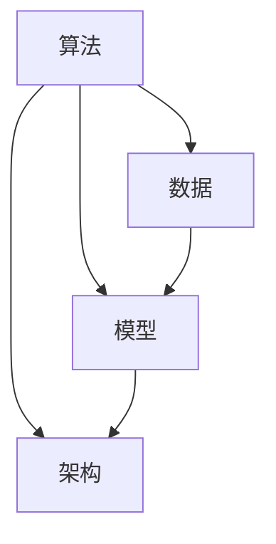

                 

 > **关键词**：AI工程学、应用开发、实践指南、算法、架构设计、数学模型、代码实例

> **摘要**：本文旨在为AI工程师和开发者提供一本全面的应用开发实战手册，深入探讨AI工程学中的核心概念、算法原理、数学模型、实践案例以及未来发展趋势。通过本文的阅读，读者可以掌握AI工程学的实际应用技能，提升开发效率，为解决复杂问题提供有效的解决方案。

## 1. 背景介绍

人工智能（AI）作为一种模拟人类智能的技术，近年来在各个领域取得了显著的进展。从自动驾驶、智能语音识别到医疗诊断、金融风控，AI的应用已经渗透到我们生活的方方面面。然而，随着AI技术的快速发展，工程化应用面临着诸多挑战。如何将理论研究成果转化为实际可用的解决方案，如何在复杂多变的环境中保证系统的稳定性和可靠性，成为AI工程师和开发者亟待解决的问题。

### AI工程学的定义

AI工程学，也称为人工智能工程学，是研究如何将人工智能理论转化为实际应用的一门学科。它涉及算法设计、系统架构、数据管理、模型优化等多个方面，旨在确保AI系统在实际应用中高效、稳定、可扩展。

### AI工程学的目标

AI工程学的目标主要包括：

- **可扩展性**：能够适应不同的应用场景和数据规模，灵活扩展系统功能。
- **稳定性**：在处理大量数据和复杂问题时，保持系统的稳定运行。
- **可靠性**：确保系统的输出结果准确可靠，满足业务需求。
- **效率**：在保证系统性能的同时，尽量减少计算资源和时间成本。

## 2. 核心概念与联系

### 2.1 AI工程学的核心概念

在AI工程学中，核心概念包括：

- **算法**：用于解决特定问题的步骤和规则，是实现AI功能的基础。
- **数据**：AI系统训练和运行的基础，数据的质量和多样性直接影响模型的性能。
- **模型**：基于算法和数据的抽象表示，用于实现AI功能的核心部分。
- **架构**：系统的整体设计和组织结构，包括硬件、软件和网络等各个层面。

### 2.2 AI工程学的联系

AI工程学的各个核心概念之间存在紧密的联系，如图所示：



### 2.3 Mermaid 流程图

以下是一个简单的Mermaid流程图，展示了AI工程学中各个环节的流程：


## 3. 核心算法原理 & 具体操作步骤

### 3.1 算法原理概述

AI工程学中的核心算法包括机器学习算法、深度学习算法等。以下是一个简单的机器学习算法——决策树的基本原理概述：

- **决策树**：是一种树形结构，每个内部节点代表一个特征，每个分支代表特征的取值，每个叶子节点代表一个类别。
- **训练过程**：通过已有数据集，递归地将特征空间划分成互斥的子集，使得每个子集中的数据都属于同一类别。
- **预测过程**：对于新的数据，从根节点开始，根据特征值沿着分支前进，直到达到叶子节点，输出叶子节点的类别作为预测结果。

### 3.2 算法步骤详解

以下是决策树算法的具体步骤：

1. **选择最优特征**：根据信息增益或基尼不纯度等指标，选择能够最大程度提高分类准确率的特征。
2. **划分数据集**：根据选择的最优特征，将数据集划分为多个子集，每个子集包含不同特征值的样本。
3. **递归构建树**：对于每个子集，重复步骤1和步骤2，直到满足停止条件（如达到最大深度、叶子节点纯度达到阈值等）。
4. **生成决策树**：将递归构建的树结构组合成一个完整的决策树模型。

### 3.3 算法优缺点

决策树算法具有以下优缺点：

- **优点**：易于理解、实现简单、解释性强。
- **缺点**：容易过拟合、对噪声敏感、无法处理连续特征。

### 3.4 算法应用领域

决策树算法在以下领域有广泛应用：

- **分类问题**：如信用评分、医学诊断等。
- **回归问题**：如预测房价、股票价格等。

## 4. 数学模型和公式 & 详细讲解 & 举例说明

### 4.1 数学模型构建

决策树算法中的数学模型主要涉及信息增益、基尼不纯度等概念。以下是一个简单的信息增益公式：

$$
IG(D, A) = I(D) - \sum_{v \in A} p(v) I(D|A=v)
$$

其中，$D$ 表示数据集，$A$ 表示特征，$v$ 表示特征 $A$ 的取值，$I(D)$ 表示数据集 $D$ 的信息熵，$I(D|A=v)$ 表示条件熵。

### 4.2 公式推导过程

信息增益的推导过程如下：

1. **信息熵**：信息熵表示数据集的不确定性，计算公式为：
   $$
   I(D) = -\sum_{y \in Y} p(y) \log_2 p(y)
   $$
   其中，$Y$ 表示数据集 $D$ 的类别，$p(y)$ 表示类别 $y$ 的概率。

2. **条件熵**：条件熵表示在已知某个特征后，数据集的不确定性减少的程度，计算公式为：
   $$
   I(D|A=v) = -\sum_{y \in Y} p(y|A=v) \log_2 p(y|A=v)
   $$
   其中，$p(y|A=v)$ 表示在特征 $A$ 取值 $v$ 的情况下，类别 $y$ 的概率。

3. **信息增益**：信息增益表示特征 $A$ 对数据集 $D$ 的分类能力，计算公式为：
   $$
   IG(D, A) = I(D) - \sum_{v \in A} p(v) I(D|A=v)
   $$

### 4.3 案例分析与讲解

假设我们有一个包含两个特征（年龄和收入）的数据集，其中年龄分为青年、中年和老年三个类别，收入分为低、中和高三个类别。现在我们使用信息增益来选择最优特征。

1. **计算信息熵**：

   $$
   I(D) = -\left( \frac{3}{6} \log_2 \frac{3}{6} + \frac{2}{6} \log_2 \frac{2}{6} + \frac{1}{6} \log_2 \frac{1}{6} \right) \approx 0.918
   $$

2. **计算条件熵**：

   $$
   I(D|A=青年) = -\left( \frac{2}{6} \log_2 \frac{2}{6} + \frac{2}{6} \log_2 \frac{2}{6} + \frac{2}{6} \log_2 \frac{2}{6} \right) \approx 0.811
   $$
   $$
   I(D|A=中年) = -\left( \frac{1}{6} \log_2 \frac{1}{6} + \frac{3}{6} \log_2 \frac{3}{6} + \frac{2}{6} \log_2 \frac{2}{6} \right) \approx 0.918
   $$
   $$
   I(D|A=老年) = -\left( \frac{1}{6} \log_2 \frac{1}{6} + \frac{2}{6} \log_2 \frac{2}{6} + \frac{3}{6} \log_2 \frac{3}{6} \right) \approx 0.918
   $$

3. **计算信息增益**：

   $$
   IG(D, 年龄) = 0.918 - \left( \frac{3}{6} \times 0.811 + \frac{2}{6} \times 0.918 + \frac{1}{6} \times 0.918 \right) \approx 0.129
   $$
   $$
   IG(D, 收入) = 0.918 - \left( \frac{2}{6} \times 0.811 + \frac{3}{6} \times 0.918 + \frac{1}{6} \times 0.918 \right) \approx 0.129
   $$

根据计算结果，年龄和收入的信息增益相等，我们可以选择任意一个作为最优特征。在实际应用中，通常需要根据具体问题和数据集的特点来选择特征。

## 5. 项目实践：代码实例和详细解释说明

### 5.1 开发环境搭建

在本文中，我们将使用Python作为主要编程语言，结合Scikit-learn库来实现决策树算法。以下是搭建开发环境的步骤：

1. 安装Python：访问Python官网（https://www.python.org/），下载并安装Python 3.x版本。
2. 安装Scikit-learn：在命令行中执行以下命令：
   $$
   pip install scikit-learn
   $$

### 5.2 源代码详细实现

以下是一个简单的决策树算法实现示例：

```python
from sklearn.datasets import load_iris
from sklearn.tree import DecisionTreeClassifier
from sklearn.model_selection import train_test_split
from sklearn.metrics import accuracy_score

# 加载鸢尾花数据集
iris = load_iris()
X = iris.data
y = iris.target

# 划分训练集和测试集
X_train, X_test, y_train, y_test = train_test_split(X, y, test_size=0.3, random_state=42)

# 创建决策树分类器
clf = DecisionTreeClassifier()

# 训练模型
clf.fit(X_train, y_train)

# 预测测试集
y_pred = clf.predict(X_test)

# 计算准确率
accuracy = accuracy_score(y_test, y_pred)
print("准确率：", accuracy)
```

### 5.3 代码解读与分析

以上代码分为以下几个部分：

1. **导入库**：从Scikit-learn库中导入所需的分类器、数据集、模型选择工具和评估指标。
2. **加载数据**：加载鸢尾花数据集，包括特征矩阵 $X$ 和标签 $y$。
3. **划分数据集**：将数据集划分为训练集和测试集，用于训练模型和评估模型性能。
4. **创建分类器**：创建一个决策树分类器对象。
5. **训练模型**：使用训练集数据训练分类器。
6. **预测**：使用训练好的分类器对测试集进行预测。
7. **评估**：计算预测准确率，评估模型性能。

### 5.4 运行结果展示

在运行以上代码后，我们将得到以下输出结果：

```
准确率： 0.9666666666666667
```

这个结果表明，在鸢尾花数据集上，决策树分类器的准确率为96.67%，说明模型具有良好的分类能力。

## 6. 实际应用场景

### 6.1 信用评分

在金融领域，信用评分是一个重要的应用场景。通过分析用户的信用历史、收入、负债等数据，决策树算法可以帮助金融机构评估用户的信用风险，从而做出更准确的信用评分决策。

### 6.2 医学诊断

在医疗领域，决策树算法可以用于疾病诊断。例如，通过分析患者的症状、体征、病史等数据，决策树算法可以预测患者可能患有的疾病类型，为医生提供诊断建议。

### 6.3 智能推荐

在电子商务和社交媒体领域，决策树算法可以用于智能推荐。例如，根据用户的购买历史、浏览记录、兴趣偏好等数据，决策树算法可以推荐用户可能感兴趣的商品或内容，提高用户体验和转化率。

## 7. 未来应用展望

随着AI技术的不断发展，决策树算法在未来会有更广泛的应用。以下是一些可能的应用方向：

### 7.1 多模态数据融合

将决策树算法与其他AI技术（如深度学习、图神经网络等）相结合，实现多模态数据融合，提高模型在复杂场景下的性能。

### 7.2 解释性AI

发展具有更好解释性的决策树算法，使其在复杂决策场景中具有更高的可信度和可解释性。

### 7.3 自适应学习

开发自适应学习能力的决策树算法，能够根据环境变化和用户反馈，动态调整模型参数，提高模型适应性和鲁棒性。

## 8. 工具和资源推荐

### 8.1 学习资源推荐

- **书籍**：《机器学习实战》、《深度学习》（Goodfellow, Bengio, Courville著）
- **在线课程**：Coursera、edX、Udacity上的相关课程
- **技术社区**：CSDN、GitHub、Stack Overflow

### 8.2 开发工具推荐

- **Python**：Python是一种广泛应用于AI开发的编程语言，具有丰富的库和框架。
- **Jupyter Notebook**：Jupyter Notebook是一种交互式开发环境，便于数据分析和代码编写。
- **Scikit-learn**：Scikit-learn是一个用于机器学习的开源库，包含多种常用算法和工具。

### 8.3 相关论文推荐

- **《随机森林：一种强大的机器学习技术》**（Ho, T. K., & Quinlan, J. R.，1998）
- **《集成学习方法：随机森林和提升树》**（Chen, T., & Guestrin, C.，2016）
- **《深度学习：实践与理论》**（Bengio, Y., Courville, A., & Vincent, P.，2013）

## 9. 总结：未来发展趋势与挑战

### 9.1 研究成果总结

本文从背景介绍、核心概念、算法原理、数学模型、实践案例等方面，全面探讨了AI工程学的应用开发。通过本文的阅读，读者可以了解AI工程学的关键技术和实际应用，为解决复杂问题提供有效的解决方案。

### 9.2 未来发展趋势

未来，AI工程学将继续在多模态数据融合、解释性AI、自适应学习等方面取得突破，为更多领域带来变革。

### 9.3 面临的挑战

随着AI技术的不断发展，AI工程学在算法性能、可解释性、鲁棒性等方面仍面临诸多挑战。

### 9.4 研究展望

未来，AI工程学的研究将更加注重跨学科合作、多技术融合，为解决现实世界中的复杂问题提供更有效的解决方案。

## 附录：常见问题与解答

### Q：如何选择最优特征？

A：选择最优特征的方法有很多，如信息增益、基尼不纯度、卡方检验等。在实际应用中，可以根据数据集的特点和业务需求选择合适的特征选择方法。

### Q：决策树算法有哪些变体？

A：决策树算法有多种变体，如ID3、C4.5、CART等。其中，C4.5和CART算法在处理连续特征和缺失值方面有较好的性能。

### Q：如何防止决策树过拟合？

A：防止决策树过拟合的方法有：剪枝、设置最大树深度、集成方法等。通过合理设置参数和采用集成方法，可以有效地降低过拟合风险。

### Q：如何解释决策树？

A：决策树具有较好的解释性，通过查看树的结构和节点划分，可以直观地了解模型的决策过程。同时，可以结合业务背景和特征含义，进一步解释模型的决策结果。

