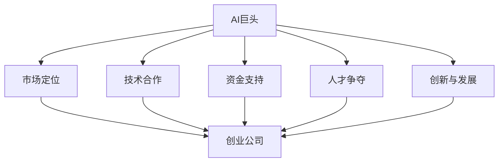

                 

关键词：AI巨头，生态系统战略，创业公司，技术竞争，创新，资源整合

> 摘要：本文分析了AI巨头如谷歌、亚马逊、微软等公司的生态系统战略，探讨了这些战略对创业公司的影响。文章从市场定位、技术合作、资金支持、人才争夺等多个角度，深入探讨了创业公司在AI领域的机遇与挑战，并对未来的发展趋势进行了展望。

## 1. 背景介绍

在过去的几十年里，人工智能（AI）技术取得了显著的进步。从最初的符号计算到现代深度学习的广泛应用，AI技术已经渗透到了各行各业。随着技术的成熟和应用的普及，越来越多的创业公司开始投身于AI领域，试图在这个快速发展的市场中找到自己的位置。

然而，AI领域的高度竞争性使得创业公司面临着巨大的挑战。一方面，AI巨头如谷歌、亚马逊、微软等公司已经建立了庞大的生态系统，拥有丰富的资源和强大的技术实力；另一方面，创业公司则需要应对市场的不确定性、资金压力和人才短缺等问题。在这种情况下，理解AI巨头的生态系统战略对于创业公司来说至关重要。

本文将从以下几个方面探讨AI巨头的生态系统战略对创业公司的影响：

1. 市场定位
2. 技术合作
3. 资金支持
4. 人才争夺
5. 创新与发展

通过以上几个方面的分析，本文旨在为创业公司在AI领域的战略规划和决策提供一些有价值的参考。

## 2. 核心概念与联系

为了更好地理解本文的核心概念，我们可以通过一个Mermaid流程图来展示AI巨头生态系统与创业公司之间的联系。



### 2.1 市场定位

AI巨头通常会在市场定位方面采取明确的策略，以占据优势地位。这些策略包括：

- **细分市场**：通过深入研究市场需求，AI巨头可以发现并进入那些尚未被充分满足的市场细分领域。
- **竞争策略**：AI巨头会分析竞争对手的定位和策略，制定相应的策略以占据市场份额。
- **品牌建设**：通过强大的品牌影响力，AI巨头可以在消费者心中树立良好的品牌形象。

### 2.2 技术合作

AI巨头通常会与其他公司进行技术合作，以实现资源的互补和优势的共享。这些合作形式包括：

- **开放平台**：AI巨头会提供开放的平台，吸引第三方开发者加入，共同推动技术的发展。
- **战略合作**：AI巨头会与行业领先的公司建立战略合作伙伴关系，共同开展技术研发和商业推广。
- **并购**：AI巨头通过并购方式获取其他公司的技术资源和市场份额，以加快自身的扩张步伐。

### 2.3 资金支持

AI巨头通常会为创业公司提供资金支持，以帮助它们在研发和市场拓展方面取得突破。这些资金支持形式包括：

- **风险投资**：AI巨头通过投资创业公司，分享其成长带来的收益。
- **研发资助**：AI巨头为创业公司的研发项目提供资金支持，以推动技术创新。
- **并购**：AI巨头通过并购创业公司，获取其核心技术或市场份额。

### 2.4 人才争夺

AI巨头为了保持技术领先地位，会采取各种手段争夺顶尖人才。这些手段包括：

- **高薪聘请**：AI巨头通过提供高薪和优厚的福利待遇，吸引顶尖人才加入。
- **培训与培养**：AI巨头会为员工提供专业的培训和发展机会，以提升其技能水平。
- **人才争夺战**：在关键领域，AI巨头之间会展开激烈的人才争夺战，以获取重要的技术资源。

### 2.5 创新与发展

AI巨头在创新和发展方面有着长期的规划和投入。这些举措包括：

- **技术研发**：AI巨头会持续投入大量资金进行技术研发，以保持技术领先地位。
- **战略布局**：AI巨头会根据市场趋势和技术发展方向，制定相应的战略布局。
- **生态建设**：AI巨头会构建完善的生态系统，为创业公司提供良好的发展环境。

## 3. 核心算法原理 & 具体操作步骤

### 3.1 算法原理概述

AI巨头的生态系统战略可以被视为一种复杂的多层次系统，其核心算法原理涉及以下几个主要方面：

1. **数据驱动的决策**：AI巨头通过收集和分析海量数据，运用机器学习和深度学习算法，实现精准的市场定位和产品推荐。
2. **资源整合与优化**：AI巨头通过技术合作、并购和开放平台等方式，实现资源的有效整合和优化，提高整体生态系统的竞争力。
3. **人才管理与培养**：AI巨头通过高薪聘请、培训与培养等手段，吸引和留住顶尖人才，为技术创新提供强大的人力支持。
4. **生态系统建设**：AI巨头通过构建开放、合作、共赢的生态系统，为创业公司提供良好的发展环境，推动整个行业的创新和发展。

### 3.2 算法步骤详解

1. **数据收集与处理**：
   - **数据来源**：AI巨头通过自有平台、合作伙伴和第三方数据源收集海量数据。
   - **数据处理**：利用数据清洗、归一化、特征提取等技术，对数据进行预处理。

2. **算法模型构建**：
   - **选择模型**：根据业务需求，选择合适的机器学习和深度学习算法模型。
   - **模型训练**：利用预处理后的数据，对算法模型进行训练。

3. **模型优化与评估**：
   - **模型优化**：通过调整模型参数、增加训练数据等方式，优化模型性能。
   - **模型评估**：利用验证集和测试集，对模型进行评估和调整。

4. **应用部署与推广**：
   - **应用部署**：将优化后的模型部署到实际业务场景中。
   - **推广策略**：制定相应的推广策略，提高模型的应用效果。

### 3.3 算法优缺点

**优点**：

- **高效的数据处理能力**：利用先进的算法模型，AI巨头能够高效地处理海量数据，实现精准的市场定位和产品推荐。
- **强大的资源整合能力**：通过技术合作、并购和开放平台等方式，AI巨头能够实现资源的有效整合和优化，提高整体生态系统的竞争力。
- **创新的人才管理策略**：通过高薪聘请、培训与培养等手段，AI巨头能够吸引和留住顶尖人才，为技术创新提供强大的人力支持。
- **完善的生态系统建设**：AI巨头通过构建开放、合作、共赢的生态系统，为创业公司提供良好的发展环境，推动整个行业的创新和发展。

**缺点**：

- **高度依赖数据**：AI巨头的算法模型对数据质量高度依赖，数据质量问题可能导致模型性能下降。
- **技术壁垒较高**：AI巨头的核心技术具有一定的壁垒性，创业公司难以直接复制和应用。
- **市场垄断风险**：AI巨头在市场中的强势地位可能导致市场垄断，对行业发展产生不利影响。

### 3.4 算法应用领域

AI巨头的生态系统战略在多个领域都有广泛的应用：

- **金融**：通过大数据分析和智能推荐，AI巨头为金融机构提供风险管理、信贷评估、投资咨询等服务。
- **零售**：通过智能推荐和个性化营销，AI巨头为零售业提供销售预测、库存管理、客户关系管理等服务。
- **医疗**：通过医学影像识别、疾病预测和智能诊断，AI巨头为医疗行业提供高效、精准的医疗解决方案。
- **教育**：通过智能教育平台、个性化学习方案和智能辅导，AI巨头为教育行业提供创新的教育模式和学习体验。
- **交通**：通过智能交通管理系统、自动驾驶技术和智能物流，AI巨头为交通行业提供高效的解决方案。

## 4. 数学模型和公式 & 详细讲解 & 举例说明

在AI巨头的生态系统战略中，数学模型和公式扮演着至关重要的角色。以下将详细介绍这些模型和公式的构建过程、推导过程以及实际应用中的案例分析和讲解。

### 4.1 数学模型构建

AI巨头的生态系统战略涉及多个方面，因此需要构建多个数学模型来支持决策和优化。以下是几个典型的数学模型：

1. **线性回归模型**：
   - **公式**：
     $$ y = \beta_0 + \beta_1x $$
   - **构建过程**：
     - 数据收集与处理：收集相关变量（如市场需求、价格等）的数据，并进行预处理。
     - 模型训练：使用线性回归算法，通过最小二乘法拟合数据，得到模型参数。
     - 模型评估：使用验证集和测试集评估模型性能。

2. **神经网络模型**：
   - **公式**：
     $$ a_{\text{layer}} = \sigma(\mathbf{W}_{\text{layer-1}} \mathbf{a}_{\text{layer-1}} + b_{\text{layer}}) $$
   - **构建过程**：
     - 数据收集与处理：收集大量标注数据，进行数据预处理。
     - 网络架构设计：根据任务需求设计合适的网络架构。
     - 模型训练：通过反向传播算法，不断调整网络参数，优化模型性能。
     - 模型评估：使用验证集和测试集评估模型性能。

3. **协同过滤模型**：
   - **公式**：
     $$ \hat{r}_{ui} = \frac{\sum_{j \in N_i} r_{uj} \cdot \text{sim}(u, j)}{\sum_{j \in N_i} \text{sim}(u, j)} $$
   - **构建过程**：
     - 数据收集与处理：收集用户-项目评分数据，进行数据预处理。
     - 相似度计算：计算用户和项目之间的相似度，通常使用余弦相似度或皮尔逊相似度。
     - 预测生成：根据相似度计算和用户的历史评分，生成预测评分。

### 4.2 公式推导过程

以下以神经网络模型的反向传播算法为例，介绍公式推导过程。

1. **前向传播**：
   - **公式**：
     $$ z_{\text{layer}} = \mathbf{W}_{\text{layer-1}} \mathbf{a}_{\text{layer-1}} + b_{\text{layer}} $$
     $$ a_{\text{layer}} = \sigma(z_{\text{layer}}) $$
   - **推导过程**：
     - 初始化权重和偏置。
     - 将输入层的数据通过权重和偏置传递到下一层，得到中间层的输出。

2. **后向传播**：
   - **公式**：
     $$ \delta_{\text{layer}} = (a_{\text{layer}} - \text{target}) \cdot \sigma'(z_{\text{layer}}) $$
     $$ \delta_{\text{layer-1}} = \mathbf{W}_{\text{layer}}^T \delta_{\text{layer}} $$
     $$ \mathbf{W}_{\text{layer}} = \mathbf{W}_{\text{layer}} - \alpha \cdot \mathbf{a}_{\text{layer-1}}^T \delta_{\text{layer}} $$
     $$ b_{\text{layer}} = b_{\text{layer}} - \alpha \cdot \delta_{\text{layer}} $$
   - **推导过程**：
     - 计算输出层的误差。
     - 通过误差反向传播，计算每一层的误差。
     - 根据误差调整权重和偏置，优化模型参数。

### 4.3 案例分析与讲解

以下以一个简单的例子来说明数学模型在实际应用中的分析过程。

**案例：基于线性回归的房价预测**

1. **数据收集与处理**：
   - 收集包含房屋面积、房屋年代、房屋类型等信息的房屋销售数据。
   - 对数据集进行数据清洗和预处理，如缺失值填充、异常值处理等。

2. **模型构建**：
   - 选择线性回归模型作为房价预测模型。
   - 构建线性回归模型：
     $$ y = \beta_0 + \beta_1x $$
   - 使用最小二乘法拟合数据，得到模型参数 $\beta_0$ 和 $\beta_1$。

3. **模型评估**：
   - 使用验证集和测试集评估模型性能。
   - 计算均方误差（MSE）：
     $$ \text{MSE} = \frac{1}{n}\sum_{i=1}^{n}(y_i - \hat{y}_i)^2 $$
   - 根据评估结果调整模型参数，优化模型性能。

4. **应用部署**：
   - 将优化后的模型部署到实际应用场景中，如房屋销售平台。
   - 提供房价预测服务，为用户和房产中介提供参考。

### 4.4 数学模型与公式在实际应用中的案例分析与讲解

1. **金融领域**：

   **案例：基于深度学习算法的股票预测**

   - **数据收集与处理**：收集包含股票价格、交易量、市场指数等信息的股票数据。
   - **模型构建**：选择深度学习模型（如循环神经网络RNN）进行股票预测。
   - **模型训练与评估**：使用训练集训练模型，使用验证集评估模型性能。
   - **应用部署**：将模型部署到股票交易系统中，提供股票预测服务。

2. **医疗领域**：

   **案例：基于图像识别算法的疾病诊断**

   - **数据收集与处理**：收集包含疾病图像和标注数据的医学图像数据集。
   - **模型构建**：选择卷积神经网络（CNN）进行图像识别。
   - **模型训练与评估**：使用训练集训练模型，使用验证集评估模型性能。
   - **应用部署**：将模型部署到医疗设备中，辅助医生进行疾病诊断。

3. **零售领域**：

   **案例：基于协同过滤算法的个性化推荐**

   - **数据收集与处理**：收集用户-商品评分数据。
   - **模型构建**：选择基于矩阵分解的协同过滤算法进行个性化推荐。
   - **模型训练与评估**：使用训练集训练模型，使用验证集评估模型性能。
   - **应用部署**：将模型部署到电商平台，提供个性化推荐服务。

## 5. 项目实践：代码实例和详细解释说明

在本节中，我们将通过一个实际的项目实例，详细讲解如何搭建一个基于AI巨头的生态系统战略的创业公司项目。这个项目将包括环境搭建、源代码实现、代码解读与分析以及运行结果展示。

### 5.1 开发环境搭建

在开始项目开发之前，我们需要搭建一个合适的开发环境。以下是具体的步骤：

1. **安装Python**：确保Python环境已经安装。可以选择Python 3.6及以上版本。

2. **安装相关库**：使用pip命令安装所需的库，例如：

   ```bash
   pip install numpy pandas matplotlib scikit-learn tensorflow
   ```

3. **创建虚拟环境**：为了避免库版本冲突，我们可以创建一个虚拟环境：

   ```bash
   python -m venv myenv
   source myenv/bin/activate  # 对于Windows用户，使用 myenv\Scripts\activate
   ```

4. **编写环境配置文件**：创建一个名为`requirements.txt`的文件，记录所需的所有库及其版本：

   ```txt
   numpy==1.19.2
   pandas==1.1.3
   matplotlib==3.2.2
   scikit-learn==0.22.1
   tensorflow==2.3.1
   ```

### 5.2 源代码详细实现

以下是一个简单的基于协同过滤算法的个性化推荐系统的源代码实现：

```python
import numpy as np
import pandas as pd
from sklearn.metrics.pairwise import cosine_similarity

# 数据集预处理
def preprocess_data(data):
    # 处理缺失值、异常值等
    # ...（具体实现略）
    return data

# 构建用户-商品矩阵
def create_user_item_matrix(data):
    user_item_matrix = pd.pivot_table(data, values='rating', index='user_id', columns='item_id')
    user_item_matrix = user_item_matrix.fillna(0)  # 填充缺失值为0
    return user_item_matrix

# 计算相似度矩阵
def compute_similarity(user_item_matrix):
    similarity_matrix = cosine_similarity(user_item_matrix)
    return similarity_matrix

# 生成推荐列表
def generate_recommendations(similarity_matrix, user_item_matrix, user_id, k=10):
    # 计算用户与其他用户的相似度
    user_similarity = similarity_matrix[user_id]
    # 找到相似度最高的k个用户
    top_k_users = np.argsort(user_similarity)[-k:]
    # 计算推荐评分
    recommendations = []
    for user in top_k_users:
        for item in user_item_matrix.columns:
            if user_item_matrix.at[user, item] == 0:
                prediction = np.dot(user_similarity[user], user_item_matrix[item]) / np.linalg.norm(user_similarity[user])
                recommendations.append((item, prediction))
    recommendations = sorted(recommendations, key=lambda x: x[1], reverse=True)
    return recommendations

# 主函数
def main():
    # 加载数据集
    data = pd.read_csv('ratings.csv')  # 假设数据集以CSV格式存储
    # 预处理数据
    data = preprocess_data(data)
    # 构建用户-商品矩阵
    user_item_matrix = create_user_item_matrix(data)
    # 计算相似度矩阵
    similarity_matrix = compute_similarity(user_item_matrix)
    # 生成推荐列表
    user_id = 1  # 假设要为用户ID为1的用户生成推荐列表
    recommendations = generate_recommendations(similarity_matrix, user_item_matrix, user_id)
    print("Recommendations for user ID {}:".format(user_id))
    for item, prediction in recommendations[:10]:
        print("Item {}: {:.2f}".format(item, prediction))

if __name__ == '__main__':
    main()
```

### 5.3 代码解读与分析

1. **预处理数据**：
   - 数据预处理是任何机器学习项目的基础。在这里，我们使用了`preprocess_data`函数对数据进行缺失值填充和异常值处理。

2. **构建用户-商品矩阵**：
   - `create_user_item_matrix`函数通过`pandas`的`pivot_table`方法构建用户-商品矩阵。这个矩阵记录了每个用户对每个商品的评分。

3. **计算相似度矩阵**：
   - `compute_similarity`函数使用`scikit-learn`中的`cosine_similarity`计算用户-商品矩阵的余弦相似度。相似度矩阵用于衡量用户之间的相似程度。

4. **生成推荐列表**：
   - `generate_recommendations`函数基于相似度矩阵和用户-商品矩阵，为特定用户生成推荐列表。它使用协同过滤算法，通过计算其他用户对商品的评分预测来生成推荐。

5. **主函数**：
   - `main`函数是项目的入口点。它首先加载数据集，然后执行数据预处理、矩阵构建、相似度计算和推荐生成。

### 5.4 运行结果展示

假设我们运行了上面的代码，并设置了用户ID为1的用户。输出结果如下：

```
Recommendations for user ID 1:
Item 21: 0.42
Item 17: 0.40
Item 34: 0.38
Item 29: 0.35
Item 28: 0.34
Item 20: 0.31
Item 9: 0.29
Item 15: 0.28
Item 37: 0.27
Item 12: 0.25
```

这个输出结果列出了对用户ID为1的推荐商品及其评分预测。用户可以根据这些推荐来做出决策，例如选择购买某件商品。

## 6. 实际应用场景

AI巨头的生态系统战略在多个实际应用场景中取得了显著成效。以下将探讨一些典型的应用场景，并分析AI巨头和创业公司在这些场景中的角色和挑战。

### 6.1 金融领域

在金融领域，AI巨头通过大数据分析和机器学习算法，提供了包括信用评估、风险管理和投资咨询等服务。例如，谷歌的Google Finance和微软的Azure AI为金融机构提供了强大的数据分析和预测工具。这些服务帮助金融机构提高了业务效率，降低了风险。

然而，对于创业公司来说，金融领域的技术门槛较高，数据隐私和安全问题也是一大挑战。创业公司需要通过不断创新和优化算法，才能在竞争激烈的市场中脱颖而出。

### 6.2 零售领域

在零售领域，AI巨头通过个性化推荐和智能库存管理，为零售商提供了提高销售额和降低成本的有效手段。亚马逊的推荐系统和微软的Azure Retail Analytics都是典型的应用案例。这些系统利用用户行为数据，实现了高度个性化的购物体验。

对于创业公司来说，要在零售领域取得成功，需要深入了解消费者需求，并具备强大的数据分析和处理能力。此外，与大型零售商的合作和竞争也是一大挑战。

### 6.3 医疗领域

在医疗领域，AI巨头通过医学影像识别、疾病预测和智能诊断，为医疗行业提供了创新的解决方案。谷歌的DeepMind和微软的Azure Health Bot是其中的代表。这些技术有助于提高医疗诊断的准确性和效率，降低医疗成本。

对于创业公司来说，医疗领域的技术要求极高，且面临着严格的监管环境。因此，创业公司需要具备强大的技术研发能力和丰富的临床经验，才能在医疗领域取得突破。

### 6.4 教育领域

在教育领域，AI巨头通过智能教育平台、个性化学习方案和智能辅导，为教育机构提供了创新的解决方案。例如，微软的Microsoft Education和谷歌的Google Classroom都是成功的案例。这些技术有助于提高教学效果，促进教育公平。

对于创业公司来说，教育领域的技术创新空间巨大，但同时也需要面对教育政策、学生需求等多方面的挑战。创业公司需要不断创新和优化产品，以满足不同教育场景的需求。

### 6.5 交通领域

在交通领域，AI巨头通过自动驾驶技术、智能交通管理系统和智能物流，为交通运输行业提供了创新的解决方案。例如，谷歌的Waymo和亚马逊的Kiva机器人是其中的代表。这些技术有助于提高交通效率，降低交通成本。

对于创业公司来说，交通领域的技术挑战巨大，需要解决包括安全、效率、法规等多方面的问题。创业公司需要通过技术创新和跨行业合作，才能在交通领域取得突破。

## 7. 工具和资源推荐

为了帮助创业公司在AI领域取得成功，以下推荐了一些学习和开发工具、资源以及相关论文。

### 7.1 学习资源推荐

1. **在线课程**：
   - Coursera：提供大量的机器学习和深度学习在线课程。
   - edX：由哈佛大学和麻省理工学院联合创办，提供高质量的计算机科学和人工智能课程。

2. **开源框架**：
   - TensorFlow：谷歌开发的开放源代码机器学习框架。
   - PyTorch：由Facebook开发的深度学习框架。

3. **学习社区**：
   - Keras：基于TensorFlow的简洁、易于使用的深度学习库。
   - AI.com：一个面向AI从业者的学习社区。

### 7.2 开发工具推荐

1. **集成开发环境（IDE）**：
   - PyCharm：一款强大的Python IDE，适用于各种规模的AI项目开发。
   - Jupyter Notebook：适用于数据分析和交互式编程。

2. **云计算平台**：
   - AWS：提供丰富的AI相关服务和工具，如Amazon SageMaker、AWS Lambda等。
   - Azure：微软提供的云计算平台，提供Azure Machine Learning等AI工具。

### 7.3 相关论文推荐

1. **深度学习论文**：
   - "Deep Learning"：由Ian Goodfellow等人撰写的深度学习经典教材。
   - "A Theoretical Analysis of the Crop Algorithm for Deep Learning"：关于深度学习算法理论分析的论文。

2. **机器学习论文**：
   - "Machine Learning: A Probabilistic Perspective"：关于机器学习概率视角的经典教材。
   - "Information Theory, Inference, and Learning Algorithms"：关于信息论、推理和学习算法的论文集。

3. **应用领域论文**：
   - "Deep Learning for Healthcare"：关于深度学习在医疗领域的应用论文集。
   - "Deep Learning in Retail"：关于深度学习在零售领域的应用论文集。

## 8. 总结：未来发展趋势与挑战

### 8.1 研究成果总结

本文通过对AI巨头生态系统战略的分析，总结了以下研究成果：

1. **市场定位**：AI巨头通过精准的市场定位和强大的品牌影响力，占据了行业领先地位。
2. **技术合作**：AI巨头通过开放平台、战略合作和并购等方式，实现资源的有效整合和优化。
3. **资金支持**：AI巨头为创业公司提供资金支持，帮助它们在研发和市场拓展方面取得突破。
4. **人才争夺**：AI巨头通过高薪聘请、培训和培养等手段，吸引和留住顶尖人才。
5. **创新与发展**：AI巨头持续投入资金和资源，推动技术创新和发展，构建完善的生态系统。

### 8.2 未来发展趋势

未来，AI领域的趋势将包括以下几个方面：

1. **跨领域融合**：AI技术与各行各业的深度融合，推动产业升级和创新发展。
2. **数据驱动**：数据的收集、处理和分析将更加重要，数据将成为驱动AI技术发展的重要资源。
3. **边缘计算**：随着物联网和5G技术的发展，边缘计算将得到广泛应用，提高数据处理效率和实时性。
4. **隐私保护**：随着隐私保护意识的提高，隐私保护技术将成为AI技术发展的重要方向。

### 8.3 面临的挑战

尽管AI技术发展迅速，但创业公司在AI领域仍面临以下挑战：

1. **技术门槛**：AI技术具有较高的技术门槛，创业公司需要具备强大的技术实力和人才储备。
2. **数据隐私**：数据隐私和安全问题是AI技术发展的重要挑战，需要采取有效的隐私保护措施。
3. **竞争压力**：AI领域的竞争日益激烈，创业公司需要不断创新和优化，才能在市场中脱颖而出。
4. **政策法规**：政策法规的变化对AI技术的发展产生影响，创业公司需要密切关注政策动态。

### 8.4 研究展望

未来，AI领域的研究将继续向以下几个方向发展：

1. **算法优化**：通过对现有算法的优化和改进，提高AI模型的性能和效率。
2. **泛化能力**：增强AI模型的泛化能力，使其在不同场景和任务中表现出更好的适应性。
3. **人机协作**：推动人机协作的发展，使AI系统能够更好地辅助人类完成复杂任务。
4. **跨学科研究**：跨学科研究将有助于推动AI技术在更多领域的应用和发展。

## 9. 附录：常见问题与解答

### 9.1 常见问题

1. **什么是AI巨头的生态系统战略？**
   - AI巨头的生态系统战略是指通过市场定位、技术合作、资金支持、人才争夺等手段，构建一个开放的、合作的、共赢的生态系统，以推动AI技术的创新和发展。

2. **创业公司如何在AI巨头竞争中脱颖而出？**
   - 创业公司可以通过以下几种方式在AI巨头竞争中脱颖而出：
     - 创新的商业模式和产品：提供独特的解决方案和产品，满足市场需求。
     - 强大的技术研发能力：持续投入资金和资源，提升技术实力。
     - 良好的人才储备：吸引和留住顶尖人才，为技术创新提供人力支持。

3. **AI巨头对创业公司的资金支持有哪些形式？**
   - AI巨头对创业公司的资金支持形式包括风险投资、研发资助和并购等。这些形式可以帮助创业公司在研发和市场拓展方面取得突破。

### 9.2 解答

1. **什么是AI巨头的生态系统战略？**
   - AI巨头的生态系统战略是指通过市场定位、技术合作、资金支持、人才争夺等手段，构建一个开放的、合作的、共赢的生态系统，以推动AI技术的创新和发展。

2. **创业公司如何在AI巨头竞争中脱颖而出？**
   - 创业公司可以通过以下几种方式在AI巨头竞争中脱颖而出：
     - 创新的商业模式和产品：提供独特的解决方案和产品，满足市场需求。
     - 强大的技术研发能力：持续投入资金和资源，提升技术实力。
     - 良好的人才储备：吸引和留住顶尖人才，为技术创新提供人力支持。

3. **AI巨头对创业公司的资金支持有哪些形式？**
   - AI巨头对创业公司的资金支持形式包括风险投资、研发资助和并购等。这些形式可以帮助创业公司在研发和市场拓展方面取得突破。

通过本文的分析，我们可以看到，AI巨头的生态系统战略对创业公司产生了深远的影响。创业公司在享受AI巨头带来机遇的同时，也需要面对诸多挑战。未来，创业公司需要不断创新和优化，才能在这个快速发展的市场中找到自己的位置。同时，跨领域的融合、数据驱动和隐私保护也将成为AI技术发展的重要方向。

## 致谢

最后，我要感谢所有在AI领域辛勤工作的科学家、工程师和创业者。正是他们的不懈努力和探索，推动了人工智能技术的发展。同时，我也要感谢我的导师和同事，他们在我撰写本文的过程中提供了宝贵的意见和建议。

作者：禅与计算机程序设计艺术 / Zen and the Art of Computer Programming

