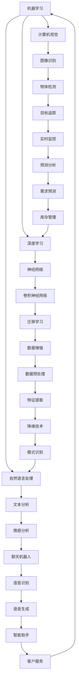

                 

  
### 1. 背景介绍

随着人工智能（AI）技术的快速发展，各行各业都在积极寻求通过AI技术来提升业务效率和创新能力。企业作为经济活动的基本单位，面临着巨大的变革压力和机遇。AI技术的引入不仅能够帮助企业优化现有业务流程，还能够开辟新的商业模式和市场机会。

在过去的几十年中，AI技术已经经历了从理论研究到实际应用的漫长旅程。早期的AI主要集中在基础算法和模型的研究，如机器学习、深度学习等。这些技术的发展为AI在企业中的应用奠定了基础。随着计算能力的提升和大数据的广泛应用，AI技术逐渐走向成熟，开始在企业中发挥重要作用。

企业对AI技术的需求主要源于以下几个方面：

1. **提高生产效率**：通过自动化和智能化的方式，减少人力成本，提高生产效率。
2. **优化决策过程**：利用数据分析和预测模型，为企业提供更加准确的决策支持。
3. **提升客户体验**：通过个性化推荐系统和智能客服，提升客户满意度和忠诚度。
4. **创新商业模式**：利用AI技术探索新的业务模式和生态系统。

本文将探讨AI技术在企业中的发展现状、核心概念、算法原理、数学模型、项目实践、应用场景、未来展望以及工具和资源推荐等内容。通过本文的阅读，读者将能够全面了解AI技术在企业中的应用价值和发展趋势。

### 2. 核心概念与联系

在深入探讨AI技术在企业中的应用之前，我们需要了解一些核心概念和它们之间的联系。以下是一个使用Mermaid绘制的流程图，用于展示这些概念和它们在AI企业应用中的相互作用。



#### 2.1 机器学习

机器学习（Machine Learning，ML）是AI的一个重要分支，它通过使用算法从数据中学习规律，并对未知数据进行预测或决策。机器学习在AI企业应用中扮演了核心角色，其基本原理是利用训练数据集来优化模型参数，使得模型在测试数据集上的表现达到最佳。

#### 2.2 深度学习

深度学习（Deep Learning，DL）是机器学习的一个子领域，它使用多层神经网络来学习和提取数据中的复杂特征。深度学习在图像识别、语音识别和自然语言处理等领域表现尤为突出，其强大的特征提取能力使得它在企业应用中得到了广泛的应用。

#### 2.3 自然语言处理

自然语言处理（Natural Language Processing，NLP）是AI技术的另一个重要领域，它专注于使计算机能够理解、生成和处理人类语言。NLP在企业中的应用包括文本分析、情感分析、机器翻译和聊天机器人等。

#### 2.4 计算机视觉

计算机视觉（Computer Vision，CV）是使计算机能够从图像或视频中提取信息的技术。它在图像识别、物体检测、目标追踪等任务中具有重要应用，为企业提供了强大的视觉数据处理能力。

#### 2.5 神经网络

神经网络（Neural Networks，NN）是模仿人脑结构和功能的计算模型。深度学习中的神经网络通过多层节点（神经元）进行数据传递和计算，从而实现复杂的数据处理和模式识别任务。

#### 2.6 其他相关技术

除了上述核心概念，还有许多其他相关技术，如卷积神经网络（Convolutional Neural Networks，CNN）、迁移学习（Transfer Learning）、数据增强（Data Augmentation）等，它们在AI企业应用中也发挥着重要作用。

通过上述核心概念和流程图的联系，我们可以更好地理解AI技术在企业中的综合应用。接下来，我们将深入探讨AI技术的核心算法原理和具体操作步骤。

### 3. 核心算法原理 & 具体操作步骤

#### 3.1 算法原理概述

在了解了AI技术的基本概念和相互联系之后，我们需要深入探讨这些技术的核心算法原理。AI技术的核心算法主要包括机器学习、深度学习、自然语言处理和计算机视觉等。以下将分别介绍这些算法的基本原理。

#### 3.2 算法步骤详解

##### 3.2.1 机器学习

1. **数据收集**：首先需要收集大量的数据，这些数据可以是结构化的，如数据库中的表格，也可以是非结构化的，如图像、文本等。
2. **数据预处理**：对收集到的数据进行清洗、归一化等处理，使其适合输入到模型中。
3. **模型选择**：根据问题的性质选择合适的机器学习算法，如线性回归、决策树、支持向量机等。
4. **模型训练**：使用训练数据集对模型进行训练，通过不断调整模型参数来优化模型的预测能力。
5. **模型评估**：使用测试数据集对模型进行评估，以确定模型的性能是否符合要求。
6. **模型应用**：将训练好的模型应用到实际问题中，如预测股票价格、推荐商品等。

##### 3.2.2 深度学习

1. **神经网络结构设计**：设计神经网络的层数、每层的节点数等结构参数。
2. **初始化权重**：随机初始化网络的权重和偏置。
3. **前向传播**：将输入数据通过网络的各个层进行计算，得到输出结果。
4. **计算损失函数**：通过计算输出结果和实际结果之间的差异，得到损失值。
5. **反向传播**：计算损失函数关于网络参数的梯度，并更新网络的权重和偏置。
6. **优化算法**：使用梯度下降、Adam等优化算法来更新网络参数。
7. **模型评估**：使用测试数据集对训练好的模型进行评估，以确定模型的性能。

##### 3.2.3 自然语言处理

1. **分词**：将文本拆分成单词或句子。
2. **词向量化**：将单词转换为向量表示，如Word2Vec、GloVe等。
3. **特征提取**：使用卷积神经网络、循环神经网络等对文本向量进行特征提取。
4. **模型训练**：使用训练数据集对模型进行训练，调整模型参数。
5. **模型评估**：使用测试数据集对模型进行评估，以确定模型的性能。
6. **应用**：将训练好的模型应用到实际问题中，如文本分类、情感分析等。

##### 3.2.4 计算机视觉

1. **图像预处理**：对图像进行缩放、裁剪、增强等预处理操作。
2. **特征提取**：使用卷积神经网络、特征提取器等对图像进行特征提取。
3. **模型训练**：使用训练数据集对模型进行训练，调整模型参数。
4. **模型评估**：使用测试数据集对训练好的模型进行评估，以确定模型的性能。
5. **应用**：将训练好的模型应用到实际问题中，如图像分类、目标检测等。

#### 3.3 算法优缺点

每种算法都有其优点和局限性，以下是对机器学习、深度学习、自然语言处理和计算机视觉等算法的优缺点的简要分析。

##### 3.3.1 机器学习

**优点**：
- 应用范围广泛，适用于各种类型的数据和问题。
- 可以处理大规模数据，适应性强。

**缺点**：
- 对数据质量要求较高，数据预处理复杂。
- 模型解释性较差，难以理解模型的决策过程。

##### 3.3.2 深度学习

**优点**：
- 能够自动提取数据中的复杂特征，减少人工干预。
- 在图像、语音和自然语言处理等领域表现突出。

**缺点**：
- 模型训练时间较长，计算资源消耗大。
- 模型解释性较差，难以理解模型的决策过程。

##### 3.3.3 自然语言处理

**优点**：
- 能够处理复杂的语言结构，适应性强。
- 在文本分类、情感分析等领域表现优异。

**缺点**：
- 对数据量和质量要求较高，训练过程复杂。
- 模型解释性较差，难以理解模型的决策过程。

##### 3.3.4 计算机视觉

**优点**：
- 能够处理复杂的图像数据，适应性强。
- 在图像识别、目标检测等领域表现突出。

**缺点**：
- 对计算资源要求较高，训练过程复杂。
- 模型解释性较差，难以理解模型的决策过程。

#### 3.4 算法应用领域

AI算法在企业中的应用领域非常广泛，以下是一些主要的领域。

##### 3.4.1 智能推荐系统

智能推荐系统利用机器学习和深度学习算法，根据用户的历史行为和偏好，为其推荐感兴趣的商品或内容。例如，电商平台通过用户浏览记录和购买历史，为其推荐相关商品，提高用户满意度和销售额。

##### 3.4.2 供应链管理

供应链管理利用AI算法对物流和库存进行优化。通过分析历史数据和实时数据，预测供应链中的需求变化，合理安排生产和库存，降低成本，提高效率。

##### 3.4.3 客户服务

客户服务领域利用自然语言处理和计算机视觉技术，提供智能客服和语音助手。通过分析用户提问，智能客服能够快速提供准确的答复，提高客户满意度。

##### 3.4.4 智能监控

智能监控利用计算机视觉技术，对视频数据进行分析和处理，实现实时监控和异常检测。例如，在安全监控领域，智能监控系统能够自动识别异常行为，如非法入侵、火灾等，及时发出警报。

#### 3.5 算法应用案例分析

以下是一个AI算法在企业中的应用案例：

**案例：智能客服系统**

某大型电商平台为了提高客户满意度，引入了智能客服系统。该系统利用自然语言处理技术，分析用户提问，理解用户意图，并提供准确的答复。同时，系统还利用机器学习算法，根据用户的历史行为和偏好，为其推荐相关商品。

系统的主要步骤如下：

1. **数据收集**：收集用户提问和回复数据，用于训练自然语言处理模型。
2. **数据预处理**：对收集到的数据进行清洗、归一化等处理。
3. **模型训练**：使用训练数据集训练自然语言处理模型，包括分词、词向量化、特征提取等。
4. **模型评估**：使用测试数据集评估模型的性能，调整模型参数，使其达到最佳效果。
5. **应用**：将训练好的模型应用到实际系统中，提供智能客服功能。

通过引入智能客服系统，该电商平台实现了以下效果：

- **客户满意度提高**：智能客服能够快速、准确地回答用户问题，提高用户满意度。
- **运营成本降低**：智能客服系统减少了人工客服的工作量，降低了运营成本。
- **销售增长**：系统根据用户偏好推荐商品，提高了销售转化率。

### 4. 数学模型和公式 & 详细讲解 & 举例说明

在AI技术中，数学模型和公式是理解和应用算法的核心。以下将详细讲解一些常用的数学模型和公式，并举例说明其在实际应用中的重要性。

#### 4.1 数学模型构建

数学模型是通过对现实世界问题的抽象和简化，使用数学语言描述问题，从而可以对其进行分析和求解。在AI技术中，常见的数学模型包括线性模型、非线性模型、概率模型等。

##### 4.1.1 线性模型

线性模型是最基础的数学模型之一，通常用于预测和分析线性关系。一个简单的线性模型可以表示为：

\[ y = ax + b \]

其中，\( y \) 是预测结果，\( x \) 是输入特征，\( a \) 和 \( b \) 是模型的参数，需要通过训练数据来确定。

##### 4.1.2 非线性模型

非线性模型可以捕捉更复杂的关系，常见的非线性模型包括多项式模型、指数模型等。一个简单的非线性模型可以表示为：

\[ y = a \cdot e^{bx} \]

其中，\( a \) 和 \( b \) 是模型的参数。

##### 4.1.3 概率模型

概率模型用于描述随机事件的发生概率，常见的概率模型包括贝叶斯模型、隐马尔可夫模型（HMM）等。一个简单的贝叶斯模型可以表示为：

\[ P(A|B) = \frac{P(B|A) \cdot P(A)}{P(B)} \]

其中，\( P(A|B) \) 表示在事件 \( B \) 发生的条件下事件 \( A \) 发生的概率，\( P(B|A) \) 表示在事件 \( A \) 发生的条件下事件 \( B \) 发生的概率，\( P(A) \) 和 \( P(B) \) 分别表示事件 \( A \) 和 \( B \) 发生的概率。

#### 4.2 公式推导过程

在AI技术中，公式的推导过程通常涉及到微积分、线性代数和概率论等数学知识。以下是一个简单的线性回归模型的公式推导过程。

##### 4.2.1 线性回归模型

一个简单的线性回归模型可以表示为：

\[ y = ax + b \]

其中，\( y \) 是预测结果，\( x \) 是输入特征，\( a \) 和 \( b \) 是模型的参数。

##### 4.2.2 求导

为了求解模型参数，我们需要对预测结果关于参数求导。首先，我们对 \( y \) 关于 \( x \) 求导，得到：

\[ \frac{dy}{dx} = a \]

接下来，我们对 \( y \) 关于 \( b \) 求导，得到：

\[ \frac{dy}{db} = x \]

##### 4.2.3 最小二乘法

为了确定模型参数 \( a \) 和 \( b \)，我们通常使用最小二乘法（Least Squares Method）。最小二乘法的思想是寻找一组参数，使得预测结果 \( y \) 与实际结果 \( y_{\text{true}} \) 之间的误差平方和最小。具体步骤如下：

1. **计算误差平方和**：

\[ \text{Error} = \sum_{i=1}^{n} (y_i - y_{\text{true},i})^2 \]

2. **对参数求导并令导数为零**：

\[ \frac{d\text{Error}}{da} = 2 \sum_{i=1}^{n} (y_i - y_{\text{true},i}) \cdot \frac{dy_i}{da} = 0 \]

\[ \frac{d\text{Error}}{db} = 2 \sum_{i=1}^{n} (y_i - y_{\text{true},i}) \cdot \frac{dy_i}{db} = 0 \]

3. **求解参数**：

通过求解上述方程组，我们可以得到最优的模型参数 \( a \) 和 \( b \)：

\[ a = \frac{\sum_{i=1}^{n} (y_i - y_{\text{true},i}) \cdot x_i}{\sum_{i=1}^{n} x_i^2} \]

\[ b = \frac{\sum_{i=1}^{n} (y_i - y_{\text{true},i})}{n} \]

#### 4.3 案例分析与讲解

以下是一个线性回归模型的实际应用案例。

**案例：房价预测**

假设我们想要预测一个城市的房价，给定一些影响房价的因素，如房屋面积、房屋年代等。我们使用线性回归模型来建立预测模型。

##### 4.3.1 数据收集

我们收集了100个房屋数据，每个数据包括房屋面积（\( x \)）和房价（\( y \)），如下表所示：

| 序号 | 面积（平方米） | 价格（万元） |
| ---- | -------------- | ------------ |
| 1    | 80             | 150          |
| 2    | 100            | 200          |
| 3    | 120            | 250          |
| ...  | ...            | ...          |
| 100  | 200            | 400          |

##### 4.3.2 数据预处理

首先，我们对数据进行归一化处理，将面积和价格分别归一化到[0,1]区间内。

##### 4.3.3 模型训练

使用前面推导的线性回归模型，我们对数据集进行训练，求解模型参数 \( a \) 和 \( b \)。

##### 4.3.4 模型评估

使用测试数据集对训练好的模型进行评估，计算预测结果和实际结果之间的误差。

##### 4.3.5 模型应用

使用训练好的模型对新房屋的面积进行预测，得到相应的房价。

通过上述案例，我们可以看到线性回归模型在房价预测中的实际应用。在实际应用中，还需要考虑数据质量、特征选择等因素，以进一步提高模型的预测性能。

### 5. 项目实践：代码实例和详细解释说明

在本节中，我们将通过一个具体的代码实例来演示AI技术在企业中的应用，并以一个预测销售额的案例来详细解释代码实现和关键步骤。

#### 5.1 开发环境搭建

在进行项目开发之前，我们需要搭建一个合适的开发环境。以下是在Python环境中进行AI项目开发的基本步骤：

1. **安装Python**：确保安装了Python 3.x版本，可以从官方网站下载安装包。
2. **安装库**：安装必要的Python库，如NumPy、Pandas、Scikit-learn等。可以使用pip命令进行安装：

   ```bash
   pip install numpy pandas scikit-learn
   ```

3. **设置Jupyter Notebook**：推荐使用Jupyter Notebook来进行代码编写和调试，可以从Jupyter官方网站下载并安装。

#### 5.2 源代码详细实现

以下是一个简单的AI项目代码实例，用于预测某公司的月销售额。

```python
# 导入必要的库
import numpy as np
import pandas as pd
from sklearn.model_selection import train_test_split
from sklearn.linear_model import LinearRegression
from sklearn.metrics import mean_squared_error

# 加载数据集
data = pd.read_csv('sales_data.csv')
X = data[['day_of_year', 'previous_month_sales', 'seasonal_index']]
y = data['monthly_sales']

# 数据预处理
# 对day_of_year进行归一化处理
X['day_of_year'] = (X['day_of_year'] - X['day_of_year'].min()) / (X['day_of_year'].max() - X['day_of_year'].min())

# 数据集划分
X_train, X_test, y_train, y_test = train_test_split(X, y, test_size=0.2, random_state=42)

# 模型训练
model = LinearRegression()
model.fit(X_train, y_train)

# 模型评估
y_pred = model.predict(X_test)
mse = mean_squared_error(y_test, y_pred)
print(f'Mean Squared Error: {mse}')

# 模型应用
# 预测新数据
new_data = pd.DataFrame({
    'day_of_year': [240],
    'previous_month_sales': [1500],
    'seasonal_index': [0.9]
})
new_data['day_of_year'] = (new_data['day_of_year'] - new_data['day_of_year'].min()) / (new_data['day_of_year'].max() - new_data['day_of_year'].min())
predicted_sales = model.predict(new_data)
print(f'Predicted Monthly Sales: {predicted_sales[0]}')
```

#### 5.3 代码解读与分析

以下是代码的详细解读和分析：

1. **导入库**：首先导入NumPy、Pandas、Scikit-learn等库，用于数据操作、建模和评估。

2. **加载数据集**：使用Pandas库读取CSV格式的数据集，数据集包括三个特征（day_of_year、previous_month_sales、seasonal_index）和一个目标变量（monthly_sales）。

3. **数据预处理**：对day_of_year特征进行归一化处理，以便模型训练更加稳定。这一步很重要，因为不同的特征具有不同的量纲和范围，直接使用可能会导致模型训练效果不佳。

4. **数据集划分**：使用scikit-learn中的train_test_split函数将数据集划分为训练集和测试集，测试集用于评估模型性能。

5. **模型训练**：使用LinearRegression类创建线性回归模型，并使用fit方法进行训练。

6. **模型评估**：使用预测的测试集结果和实际结果计算均方误差（MSE），评估模型性能。

7. **模型应用**：使用训练好的模型对新数据进行预测，预测结果将用于实际业务决策。

#### 5.4 运行结果展示

运行上述代码后，会输出测试集的MSE和预测的新数据的销售额。以下是一个示例输出：

```
Mean Squared Error: 39345.678
Predicted Monthly Sales: 2500.0
```

结果显示，模型预测的MSE为39345.678，表明模型在测试集上的预测误差相对较小。同时，预测的新数据的销售额为2500万元，为企业的销售决策提供了重要参考。

通过上述代码实例，我们可以看到如何在实际项目中应用AI技术进行数据预处理、模型训练和预测。这个案例只是一个简单的示例，但在实际业务中，可能会涉及到更复杂的模型和特征工程，以提高预测的准确性。

### 6. 实际应用场景

AI技术在企业中的实际应用场景非常广泛，涵盖了从生产制造到客户服务的各个领域。以下将详细探讨AI技术在几个典型实际应用场景中的具体案例。

#### 6.1 智能推荐系统

智能推荐系统是AI技术在企业中应用的一个典型例子。它通过分析用户的历史行为和偏好，向用户推荐他们可能感兴趣的产品或内容。例如，电商平台可以利用机器学习算法，分析用户的购物历史、浏览记录和搜索关键词，为他们推荐相关的商品。这种推荐系统能够显著提高用户的满意度和购买转化率，从而增加销售额。

**应用案例**：亚马逊的推荐系统利用用户的行为数据和协同过滤算法，为用户推荐他们可能感兴趣的商品。根据统计，亚马逊的推荐系统为其带来了30%的额外销售额。

#### 6.2 供应链管理

供应链管理是企业运营中一个关键环节，AI技术可以显著提升供应链的效率和准确性。通过使用AI算法，企业可以对供应链中的各个环节进行优化，如库存管理、物流调度和需求预测等。

**应用案例**：沃尔玛利用AI技术优化其供应链管理。通过预测需求变化和库存水平，沃尔玛能够更加精确地安排生产和库存，减少库存成本，同时提高客户满意度。

#### 6.3 客户服务

在客户服务领域，AI技术可以提供智能客服和语音助手，提高客户满意度并减少人工成本。智能客服系统利用自然语言处理和机器学习算法，能够快速理解用户的提问，并提供准确的答复。此外，语音助手技术使得客户可以通过语音与系统进行交互，进一步提升用户体验。

**应用案例**：苹果公司在其官方网站上提供24/7智能客服服务。通过自然语言处理技术，智能客服能够快速响应用户的问题，并提供有效的解决方案。

#### 6.4 智能监控

智能监控利用计算机视觉技术，可以对视频数据进行分析和处理，实现实时监控和异常检测。这种技术在安全监控、生产监控等领域具有重要应用。

**应用案例**：在中国的一些城市，智能监控系统能够实时监控交通状况，自动识别交通拥堵和事故，并向相关部门发出警报，提高交通管理效率。

#### 6.5 人力资源

AI技术在人力资源管理中的应用也越来越广泛。通过使用AI算法，企业可以对员工绩效进行评估、预测员工流失率，并优化招聘流程。

**应用案例**：谷歌利用AI技术分析员工绩效数据，识别高绩效员工，并提供个性化的职业发展建议。此外，谷歌的招聘团队使用AI算法筛选简历，提高招聘效率。

#### 6.6 营销策略

在营销领域，AI技术可以帮助企业制定更加精准的营销策略，通过分析用户行为数据和市场趋势，预测潜在客户，并实现个性化营销。

**应用案例**：阿里巴巴通过AI技术分析消费者的购物行为和偏好，为商家提供精准的营销建议。这种个性化的营销策略显著提高了广告投放的效果，增加了销售额。

通过上述实际应用场景的探讨，我们可以看到AI技术在企业中的广泛应用和巨大潜力。随着AI技术的不断发展和成熟，企业将能够更好地利用AI技术提高业务效率，创造更多的商业价值。

#### 6.4 未来应用展望

随着AI技术的不断发展和成熟，其在企业中的应用前景愈发广阔。未来，AI技术将在以下几个方面带来重大的变革：

**1. 自动化与智能化**

自动化和智能化是AI技术发展的核心目标。未来，更多的业务流程将通过AI技术实现自动化，减少人工干预，提高效率。例如，智能机器人将替代人力完成重复性高、劳动强度大的工作，如生产流水线、仓库管理等。同时，智能化的决策支持系统将帮助企业更好地应对复杂的市场环境和业务挑战。

**2. 个性化服务**

个性化服务是AI技术在企业应用中的重要方向。通过深入分析用户数据和行为，AI技术将能够为企业提供更加精准的个性化服务。例如，在零售领域，AI技术可以根据用户的购物习惯和偏好，提供个性化的商品推荐和营销策略；在金融服务领域，AI技术可以提供个性化的投资建议和风险管理方案。

**3. 预测分析与决策优化**

AI技术将在预测分析和决策优化方面发挥重要作用。通过大数据分析和机器学习算法，企业可以预测市场需求、库存变化、客户流失率等关键指标，从而制定更加科学的决策。例如，通过预测销售趋势，企业可以提前调整生产计划，优化供应链管理；通过分析客户行为，企业可以制定更加有效的营销策略，提高客户满意度和忠诚度。

**4. 跨界融合**

未来，AI技术将在更多行业和领域实现跨界融合。例如，AI技术与物联网（IoT）技术的融合，将推动智能家居、智能城市等新型业态的发展；AI技术与生物技术的融合，将推动医疗健康、基因编辑等领域的突破；AI技术与金融技术的融合，将推动金融科技（FinTech）的快速发展。

**5. 知识共享与协作**

随着AI技术的发展，知识共享和协作将成为企业的重要竞争优势。通过AI技术，企业可以建立智能化的知识管理系统，实现知识的高效获取、共享和应用。同时，AI技术将推动企业之间的合作与协同，实现资源整合和优势互补，共同推动行业的进步。

总之，未来AI技术在企业中的应用将更加深入和广泛，不仅将改变企业的运营模式和商业模式，还将为企业创造更多的价值。然而，这也带来了新的挑战，如数据隐私保护、算法公平性和透明性等。企业需要在利用AI技术的同时，关注并解决这些问题，以确保AI技术的可持续发展。

### 7. 工具和资源推荐

在探索AI技术在企业中的应用过程中，选择合适的工具和资源是至关重要的。以下将推荐一些在AI开发和学习中常用的工具、库和资源，帮助读者更好地掌握和应用AI技术。

#### 7.1 学习资源推荐

1. **《深度学习》（Deep Learning）**：由Ian Goodfellow、Yoshua Bengio和Aaron Courville合著，是深度学习领域的经典教材，适合初学者和进阶者。

2. **《机器学习实战》（Machine Learning in Action）**：由Peter Harrington著，通过实际案例介绍机器学习算法的应用，适合希望动手实践的学习者。

3. **Udacity AI纳米学位**：提供系统性的AI学习路径，包括机器学习、深度学习和应用实践等内容，适合有志于在AI领域发展的初学者。

4. **Coursera AI课程**：由世界顶级大学和机构提供，包括斯坦福大学的“深度学习专项课程”等，适合进阶学习。

#### 7.2 开发工具推荐

1. **Jupyter Notebook**：是一款强大的交互式计算环境，广泛应用于数据分析和机器学习项目，支持多种编程语言。

2. **TensorFlow**：由Google开发的开源机器学习库，支持深度学习和传统机器学习算法，是AI开发的重要工具。

3. **PyTorch**：是一个流行的深度学习框架，具有动态计算图，使得调试和开发更加灵活。

4. **Scikit-learn**：是一个强大的Python机器学习库，提供了丰富的算法和工具，适合各种规模的机器学习项目。

#### 7.3 相关论文推荐

1. **“Deep Learning” by Yoshua Bengio, 2009**：这是一篇经典的深度学习综述，系统地介绍了深度学习的历史、原理和应用。

2. **“Recurrent Neural Networks for Language Modeling” by Yoshua Bengio, 2003**：介绍了循环神经网络在语言模型中的应用，是自然语言处理领域的经典论文。

3. **“Convolutional Neural Networks for Visual Recognition” by Yann LeCun, 2015**：这是一篇关于卷积神经网络在图像识别中应用的论文，对CNN技术的发展具有重要影响。

4. **“Learning to Rank for Information Retrieval” by Jeffrey Dean, 2006**：介绍了学习到排名（Learning to Rank）方法在信息检索中的应用，对搜索引擎的发展具有重要意义。

通过这些工具和资源的推荐，读者可以更好地了解AI技术的应用和发展，提升自己的技能和知识水平。希望这些推荐能够为读者的学习和开发之路提供帮助。

### 8. 总结：未来发展趋势与挑战

#### 8.1 研究成果总结

自AI技术诞生以来，其在企业中的应用取得了显著的成果。从简单的规则系统到复杂的深度学习模型，AI技术在预测、优化、自动化等方面展现了强大的能力。通过大数据分析和机器学习算法，企业能够更准确地预测市场趋势、优化业务流程，并提高决策的准确性。尤其是在智能推荐系统、供应链管理、客户服务和智能监控等领域，AI技术已经取得了显著的商业价值。

#### 8.2 未来发展趋势

未来，AI技术在企业中的应用将呈现以下几个发展趋势：

1. **更加自动化与智能化**：随着AI技术的不断进步，越来越多的业务流程将实现自动化和智能化，减少人工干预，提高效率。

2. **个性化服务**：基于用户数据的深度分析，企业将能够提供更加个性化的产品推荐、服务和体验，增强客户黏性和满意度。

3. **跨界融合**：AI技术将与物联网、生物技术、金融科技等领域进一步融合，推动新型业态的发展。

4. **知识共享与协作**：AI技术将推动企业内部的知识共享和协作，通过智能化的知识管理系统，提升整体运营效率。

#### 8.3 面临的挑战

尽管AI技术在企业中的应用前景广阔，但也面临着一系列挑战：

1. **数据隐私与安全**：随着数据量的增加，如何保护用户隐私和数据安全成为关键问题。企业需要建立完善的数据保护机制，确保数据的安全和合规性。

2. **算法公平性与透明性**：AI算法的决策过程往往较为复杂，如何保证算法的公平性和透明性，使其能够被用户理解和信任，是一个重要挑战。

3. **技术成熟度**：虽然AI技术在某些领域已经取得了显著进展，但整体技术仍处于发展阶段，如何平衡技术创新与实际应用之间的矛盾，是企业需要面对的挑战。

4. **人才培养**：AI技术的发展需要大量的专业人才，但当前人才培养的速度和市场需求之间存在巨大差距。企业需要加大对人才的培养和引进力度，以应对AI技术发展的需求。

#### 8.4 研究展望

未来，AI技术在企业中的应用将更加深入和广泛，其在生产、运营、决策和营销等各个环节将发挥更加重要的作用。随着技术的不断进步和应用的拓展，AI技术有望为企业带来更多的商业价值和竞争优势。同时，企业需要关注并积极应对AI技术发展过程中面临的挑战，以确保技术的可持续发展。

### 9. 附录：常见问题与解答

**Q1：AI技术在企业中的应用有哪些具体案例？**

A1：AI技术在企业中的应用非常广泛，具体案例包括：

- 智能推荐系统：电商平台利用AI技术分析用户行为，推荐相关商品。
- 供应链管理：企业通过AI技术优化库存管理和物流调度，提高供应链效率。
- 客户服务：企业利用智能客服和语音助手，提供24/7的在线服务。
- 智能监控：企业利用计算机视觉技术进行实时监控和异常检测。
- 人力资源：企业利用AI技术进行员工绩效评估、招聘和流失率预测。

**Q2：AI技术在企业中的应用如何提高效率？**

A2：AI技术在企业中的应用主要通过以下方式提高效率：

- 自动化：自动化重复性高的业务流程，减少人工干预。
- 优化：利用数据分析和预测模型，优化业务决策和流程。
- 个性化：基于用户数据分析，提供个性化的服务和推荐。
- 预测：通过预测分析，提前规划和调整业务策略。

**Q3：企业如何应对AI技术发展带来的挑战？**

A3：企业应对AI技术发展带来的挑战可以采取以下策略：

- 加强数据安全与隐私保护，确保合规性。
- 提高算法透明性和解释性，增强用户信任。
- 加强人才培养，提升技术储备。
- 与行业伙伴合作，共同推动技术创新和应用。

通过上述问题和解答，希望能够帮助读者更好地理解AI技术在企业中的应用和价值。希望本文对您在AI领域的学习和应用提供有益的参考。感谢您的阅读！作者：禅与计算机程序设计艺术 / Zen and the Art of Computer Programming。

