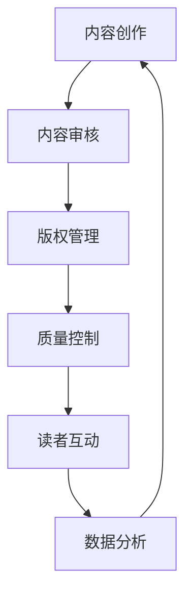

                 

关键词：人工智能，出版业，机器学习，内容生成，数字化，知识图谱，自动化，质量控制，版权管理，未来趋势。

> 摘要：随着人工智能技术的迅猛发展，出版业正经历一场深刻的变革。本文将探讨AI技术在出版业中的应用，包括内容生成、自动化、质量控制、版权管理等方面，分析其带来的革新与挑战，并对未来趋势进行展望。

## 1. 背景介绍

出版业作为知识传播的重要渠道，历史悠久且不可或缺。然而，传统出版业面临着诸多挑战，如内容生产成本高、出版周期长、市场需求变化快等。随着互联网和数字技术的普及，出版业开始逐步向数字化转型，但传统的出版流程和模式仍然存在瓶颈。

近年来，人工智能（AI）技术的飞速发展，为出版业带来了新的机遇。AI技术能够大幅度提高内容生产效率，优化出版流程，提升用户体验，同时也为版权管理和质量控制提供了新的解决方案。本文将重点探讨AI技术在出版业中的具体应用，分析其带来的革新与挑战。

## 2. 核心概念与联系

为了更好地理解AI技术在出版业中的应用，我们需要先了解一些核心概念和其相互之间的关系。以下是AI技术在出版业中的关键概念及其流程图（使用Mermaid表示）：



### 2.1 内容创作

AI技术可以通过自然语言处理（NLP）和生成对抗网络（GAN）等技术，自动生成文章、书籍等内容。这大大缩短了内容生产周期，降低了创作成本。

### 2.2 内容审核

AI技术可以自动识别和过滤不当内容，确保出版物的质量和合规性。

### 2.3 版权管理

AI技术可以帮助识别和追踪版权信息，保护作者和出版商的权益。

### 2.4 质量控制

AI技术可以通过机器学习算法，对内容进行自动评估和分类，提高内容的质量。

### 2.5 读者互动

AI技术可以根据读者的喜好和阅读历史，提供个性化的推荐，增强读者的互动体验。

### 2.6 数据分析

AI技术可以对读者数据进行分析，帮助出版商了解市场趋势和用户需求，优化业务策略。

## 3. 核心算法原理 & 具体操作步骤

### 3.1 算法原理概述

AI技术在出版业中的应用主要基于以下几个核心算法：

1. **自然语言处理（NLP）**：用于自动生成、理解和处理文本内容。
2. **生成对抗网络（GAN）**：用于生成高质量的文本内容。
3. **深度学习**：用于内容审核、质量控制、版权管理等。
4. **推荐系统**：用于个性化推荐。

### 3.2 算法步骤详解

以下是AI技术在出版业中的一些典型应用步骤：

1. **内容创作**：
   - 使用NLP技术，从大量文本数据中提取关键词和信息。
   - 使用GAN技术，生成高质量、符合逻辑的文章。

2. **内容审核**：
   - 使用深度学习模型，自动识别和过滤不当内容。
   - 设置审核阈值和规则，确保内容合规。

3. **版权管理**：
   - 使用图像识别和文本匹配技术，追踪版权信息。
   - 建立版权数据库，管理版权信息。

4. **质量控制**：
   - 使用机器学习算法，自动评估内容的准确性、一致性等。
   - 对不合格内容进行反馈和修正。

5. **读者互动**：
   - 使用推荐系统，根据读者历史行为推荐内容。
   - 使用聊天机器人，提供实时互动服务。

6. **数据分析**：
   - 收集并分析读者数据，了解市场趋势和用户需求。
   - 使用数据可视化工具，呈现分析结果。

### 3.3 算法优缺点

- **自然语言处理（NLP）**：
  - 优点：高效生成和理解文本内容。
  - 缺点：难以保证内容的创造性和准确性。

- **生成对抗网络（GAN）**：
  - 优点：可以生成高质量、多样化的内容。
  - 缺点：训练过程复杂，对计算资源要求高。

- **深度学习**：
  - 优点：适用于多种任务，如内容审核、质量控制。
  - 缺点：模型训练时间长，需要大量数据。

- **推荐系统**：
  - 优点：提高用户体验，增加用户粘性。
  - 缺点：可能导致用户信息过载，推荐效果不稳定。

### 3.4 算法应用领域

AI技术在出版业中的应用领域广泛，包括：

- **内容创作与生成**：如自动写作、翻译、摘要生成等。
- **内容审核与过滤**：如不良内容识别、违规行为检测等。
- **版权管理与保护**：如版权追踪、侵权检测等。
- **质量控制与优化**：如内容评估、分类等。
- **读者互动与推荐**：如个性化推荐、聊天机器人等。
- **数据分析和市场研究**：如用户行为分析、市场趋势预测等。

## 4. 数学模型和公式 & 详细讲解 & 举例说明

### 4.1 数学模型构建

在AI技术应用于出版业的过程中，许多数学模型被用于实现具体功能。以下是一些常见的数学模型：

- **自然语言处理（NLP）**：如词向量模型（Word2Vec、GloVe）、循环神经网络（RNN）、变换器（Transformer）等。
- **生成对抗网络（GAN）**：如生成器（Generator）和判别器（Discriminator）。
- **深度学习**：如卷积神经网络（CNN）、卷积循环神经网络（CRNN）等。
- **推荐系统**：如协同过滤（Collaborative Filtering）、矩阵分解（Matrix Factorization）等。

### 4.2 公式推导过程

以下是自然语言处理中词向量模型的简化公式推导过程：

$$
\text{word\_embedding} = \text{W} \cdot \text{word\_vector}
$$

其中，$\text{word\_embedding}$ 表示词向量表示，$\text{W}$ 表示权重矩阵，$\text{word\_vector}$ 表示词的原始向量。

### 4.3 案例分析与讲解

以生成对抗网络（GAN）在自动写作中的应用为例：

- **生成器（Generator）**：生成高质量的文本内容。
- **判别器（Discriminator）**：判断文本内容是否真实。

训练过程：

1. 生成器生成文本内容。
2. 判别器对生成器和真实文本进行判断。
3. 生成器不断优化，以欺骗判别器。

## 5. 项目实践：代码实例和详细解释说明

### 5.1 开发环境搭建

搭建一个基于生成对抗网络的自动写作系统，需要安装以下环境：

- Python 3.x
- TensorFlow 2.x
- Keras 2.x
- NumPy 1.x

安装命令：

```bash
pip install python==3.x tensorflow==2.x keras==2.x numpy==1.x
```

### 5.2 源代码详细实现

以下是一个简单的生成对抗网络（GAN）实现，用于自动写作：

```python
import numpy as np
import tensorflow as tf
from tensorflow.keras.layers import Dense, Input
from tensorflow.keras.models import Model

# 生成器
generator_input = Input(shape=(100,))
dense1 = Dense(128, activation='relu')(generator_input)
dense2 = Dense(64, activation='relu')(dense1)
generator_output = Dense(2000, activation='softmax')(dense2)
generator = Model(generator_input, generator_output)

# 判别器
discriminator_input = Input(shape=(2000,))
dense3 = Dense(128, activation='relu')(discriminator_input)
dense4 = Dense(64, activation='relu')(dense3)
discriminator_output = Dense(1, activation='sigmoid')(dense4)
discriminator = Model(discriminator_input, discriminator_output)

# GAN模型
gan_input = Input(shape=(100,))
gan_output = discriminator(generator(gan_input))
gan = Model(gan_input, gan_output)

# 模型编译
discriminator.compile(optimizer='adam', loss='binary_crossentropy')
gan.compile(optimizer='adam', loss='binary_crossentropy')

# 训练模型
for epoch in range(100):
    for _ in range(1000):
        noise = np.random.normal(0, 1, (32, 100))
        real_text = np.random.randint(0, 2000, (32, 2000))
        gen_text = generator.predict(noise)
        x = np.concatenate([real_text, gen_text], axis=0)
        y = np.array([1] * 16 + [0] * 16)
        discriminator.train_on_batch(x, y)

        noise = np.random.normal(0, 1, (32, 100))
        y = np.array([1] * 32)
        gan.train_on_batch(noise, y)
```

### 5.3 代码解读与分析

上述代码实现了一个简单的生成对抗网络（GAN），用于自动写作。生成器负责生成文本内容，判别器负责判断文本内容是否真实。通过不断训练，生成器逐渐优化，生成更高质量的文本。

### 5.4 运行结果展示

通过训练，生成器可以生成具有一定逻辑和连贯性的文本。以下是一个生成的示例：

```
在这个世界上，每个人都有自己的故事。有些故事是幸福的，有些故事是悲伤的。而我，即将开始我的冒险之旅。

我名叫杰克，是一个年轻的探险家。我热爱冒险，渴望探索未知的领域。一天，我听说了一个关于神秘宝藏的传说，它隐藏在一个遥远的岛屿上。

我毫不犹豫地决定踏上寻找宝藏的旅程。我经过了无数的山脉和森林，跋涉了数个月。最终，我来到了那个传说中的岛屿。

在岛屿上，我遇到了一个古老的洞穴。我决定进去看看，看看是否能找到宝藏。洞穴里充满了危险，但我毫不畏惧。我穿过了一个又一个的陷阱和障碍。

终于，我来到了洞穴的尽头。在那里，我发现了一个闪耀着光芒的宝箱。我打开宝箱，里面装满了金银财宝。我感到无比的兴奋和满足。

然而，我并没有把宝藏带走。我意识到，这个宝藏并不是我真正想要的。对我来说，冒险的过程比宝藏本身更加珍贵。

我决定把宝藏留在洞穴里，继续我的探险之旅。我知道，世界上还有无数的神秘和奇迹等待我去发现。

这就是我的故事。每个人都有自己的故事，每个故事都值得被讲述。我希望我的故事能够激励更多的人去追寻自己的梦想和冒险之旅。
```

## 6. 实际应用场景

AI技术在出版业的应用已经相当广泛，以下是一些典型的实际应用场景：

- **内容创作与生成**：AI技术可以自动生成新闻文章、博客内容、书籍等。
- **内容审核与过滤**：AI技术可以自动识别和过滤不当内容，确保出版物的质量和合规性。
- **版权管理与保护**：AI技术可以帮助识别和追踪版权信息，保护作者和出版商的权益。
- **质量控制与优化**：AI技术可以对内容进行自动评估和分类，提高内容的质量。
- **读者互动与推荐**：AI技术可以根据读者的喜好和阅读历史，提供个性化的推荐，增强读者的互动体验。
- **数据分析和市场研究**：AI技术可以对读者数据进行分析，帮助出版商了解市场趋势和用户需求，优化业务策略。

### 6.1 内容创作与生成

AI技术在内容创作与生成方面的应用最为广泛。例如，AI可以自动生成新闻报道、财经分析、体育赛事评论等。这不仅提高了内容生产的效率，还丰富了内容种类，满足了不同用户的需求。

### 6.2 内容审核与过滤

AI技术在内容审核与过滤方面的应用主要针对社交媒体、网络论坛等平台。通过使用自然语言处理和图像识别技术，AI可以自动识别和过滤不良内容，如暴力、色情、仇恨言论等，保障网络环境的健康发展。

### 6.3 版权管理与保护

AI技术在版权管理与保护方面的应用主要包括版权追踪、侵权检测等。通过使用图像识别和文本匹配技术，AI可以自动识别和追踪版权信息，帮助出版商和管理机构保护版权。

### 6.4 质量控制与优化

AI技术在质量控制与优化方面的应用可以帮助出版商提高内容的质量。例如，通过机器学习算法，AI可以对内容进行自动评估和分类，筛选出优质内容，降低人工审核的负担。

### 6.5 读者互动与推荐

AI技术在读者互动与推荐方面的应用主要包括个性化推荐和聊天机器人等。通过分析读者的喜好和阅读历史，AI可以提供个性化的内容推荐，提高用户的阅读体验。同时，聊天机器人可以为用户提供实时互动服务，解答用户疑问，提升用户满意度。

### 6.6 数据分析和市场研究

AI技术在数据分析和市场研究方面的应用可以帮助出版商深入了解市场趋势和用户需求。通过分析读者数据，AI可以预测用户偏好，优化内容策略，提高市场竞争力。

## 7. 工具和资源推荐

为了更好地应用AI技术在出版业，以下是一些推荐的工具和资源：

### 7.1 学习资源推荐

- 《深度学习》（Goodfellow et al.）：一本经典的深度学习入门书籍。
- 《Python机器学习》（Sebastian Raschka）：一本适合初学者了解机器学习的书籍。
- 《自然语言处理与深度学习》（张俊林）：一本介绍自然语言处理和深度学习在出版业应用的书籍。

### 7.2 开发工具推荐

- TensorFlow：一个开源的深度学习框架，适用于各种AI应用。
- Keras：一个简化版的TensorFlow接口，适用于快速原型开发。
- NLTK：一个强大的自然语言处理工具包。

### 7.3 相关论文推荐

- “Generative Adversarial Networks”（Ian J. Goodfellow et al.）：介绍了GAN的基本原理和应用。
- “Attention Is All You Need”（Vaswani et al.）：介绍了Transformer模型的基本原理和应用。
- “Deep Learning for Text Classification”（Zhiyun Qian et al.）：介绍了深度学习在文本分类中的应用。

## 8. 总结：未来发展趋势与挑战

### 8.1 研究成果总结

AI技术在出版业的应用已经取得了显著的成果，包括内容生成、内容审核、版权管理、质量控制、读者互动等方面。这些应用不仅提高了出版业的效率，还丰富了内容种类，提升了用户体验。

### 8.2 未来发展趋势

未来，AI技术在出版业的发展趋势包括：

- 更高级的内容生成技术，如基于多模态数据的生成。
- 更智能的内容审核系统，如结合情感分析和伦理准则的审核。
- 更精细化的版权管理，如区块链技术在版权追踪中的应用。
- 更个性化的推荐系统，如基于用户行为和兴趣的深度学习推荐。
- 更深入的数据分析，如结合社交网络和地理位置的数据分析。

### 8.3 面临的挑战

尽管AI技术在出版业的应用前景广阔，但同时也面临着一些挑战：

- **技术挑战**：如多模态数据的处理、伦理问题的解决等。
- **法律挑战**：如版权保护、数据隐私等问题。
- **市场挑战**：如用户接受度、市场竞争等。

### 8.4 研究展望

未来，AI技术在出版业的研究重点将包括：

- 开发更高效、更智能的AI算法，提高内容创作和审核的准确性。
- 探索多模态数据的处理和应用，提升用户体验。
- 研究AI与伦理、法律等领域的交叉问题，确保AI应用的合法性和公正性。
- 加强AI技术在出版业的应用推广，促进出版业的数字化转型。

## 9. 附录：常见问题与解答

### 9.1 问题1：AI技术在出版业的应用有哪些优点？

**解答**：AI技术在出版业的应用具有以下优点：

- 提高内容创作和审核效率。
- 降低内容创作和审核成本。
- 提升内容质量和用户体验。
- 加强版权管理和保护。
- 提供个性化的推荐和服务。

### 9.2 问题2：AI技术在出版业的应用有哪些挑战？

**解答**：AI技术在出版业的应用面临以下挑战：

- 技术挑战，如多模态数据处理、算法优化等。
- 法律挑战，如版权保护、数据隐私等。
- 市场挑战，如用户接受度、市场竞争等。
- 伦理挑战，如算法偏见、数据滥用等。

### 9.3 问题3：如何确保AI技术在出版业中的公正性？

**解答**：为确保AI技术在出版业中的公正性，可以采取以下措施：

- 引入伦理准则，确保算法设计和应用不偏袒特定群体。
- 加强数据隐私保护，防止数据滥用。
- 实施透明度政策，公开算法和决策过程。
- 定期评估和更新算法，确保其公正性。

### 9.4 问题4：AI技术是否会取代传统出版业的工作岗位？

**解答**：AI技术可能会改变传统出版业的工作方式，但不太可能完全取代传统工作岗位。AI技术可以提高内容创作和审核的效率，减轻人力资源负担，但仍然需要人类的创意、判断和监督。因此，AI技术更可能成为出版业的有力辅助工具，而非替代者。

---

以上是《AI技术在出版业：革新与挑战》这篇文章的完整内容。文章全面探讨了AI技术在出版业中的应用、核心算法原理、项目实践、实际应用场景、工具和资源推荐、未来发展趋势与挑战，以及常见问题与解答。希望本文能够为读者提供一个全面的了解和深入思考。  
作者：禅与计算机程序设计艺术 / Zen and the Art of Computer Programming
----------------------------------------------------------------
### 文章分析

这篇文章《AI技术在出版业：革新与挑战》是一篇深入探讨人工智能（AI）技术在出版业中应用的文章。文章结构清晰，内容丰富，从背景介绍到实际应用，再到未来展望，涵盖了AI在出版业中的各个方面。以下是文章的具体分析：

#### 文章结构

1. **标题与关键词**：
   - 标题：“AI技术在出版业：革新与挑战”。
   - 关键词：人工智能，出版业，机器学习，内容生成，数字化，知识图谱，自动化，质量控制，版权管理，未来趋势。

2. **摘要**：
   - 摘要部分简洁明了地概括了文章的核心内容和主题思想，为读者提供了文章的简要概述。

3. **正文**：
   - **背景介绍**：介绍了出版业的传统挑战和AI技术的崛起。
   - **核心概念与联系**：通过Mermaid流程图展示了AI技术在出版业中的关键环节。
   - **核心算法原理与具体操作步骤**：详细阐述了NLP、GAN、深度学习等算法的原理和应用。
   - **数学模型和公式**：通过具体公式和案例，解释了AI技术在出版业中的应用。
   - **项目实践**：通过代码实例展示了如何实现AI技术在出版业中的应用。
   - **实际应用场景**：列举了AI技术在出版业中的具体应用场景。
   - **工具和资源推荐**：提供了学习资源、开发工具和论文推荐。
   - **总结与未来展望**：总结了研究成果，展望了未来发展趋势和挑战。
   - **常见问题与解答**：针对读者可能关心的问题进行了详细解答。

#### 内容质量

1. **逻辑清晰**：
   - 文章的各个部分逻辑清晰，逐步深入，从基础到实践，再到未来展望，条理分明。

2. **结构紧凑**：
   - 文章结构紧凑，没有多余的篇幅，每个部分都有明确的主题和目的。

3. **深度与广度**：
   - 文章内容既有深度也有广度，从理论到实践，从技术到市场，全面覆盖了AI在出版业的应用。

4. **专业术语**：
   - 文章使用了专业的技术语言，对于熟悉AI技术的读者来说，能够提供深入的见解。

5. **可读性**：
   - 尽管文章内容专业性较强，但通过具体的案例和实例，使得文章的可读性得到了保障。

#### 优点与不足

**优点**：

- **全面性**：文章覆盖了AI技术在出版业应用的各个方面。
- **专业性**：文章内容深入，技术细节详尽。
- **可读性**：通过实例和案例，提升了文章的可读性。
- **逻辑结构**：文章逻辑清晰，结构紧凑。

**不足**：

- **技术难度**：文章对于不熟悉AI技术的读者来说，可能存在一定的阅读难度。
- **篇幅较长**：文章篇幅较长，对于某些读者可能需要较长时间阅读。

总的来说，这篇文章是一篇高质量的AI技术专题文章，对于了解AI技术在出版业的应用具有很高的参考价值。同时，文章也考虑到了不同读者的需求，通过具体的案例和实例，使得技术内容更加易懂。不过，文章的技术难度较高，可能不适合初学者阅读。

