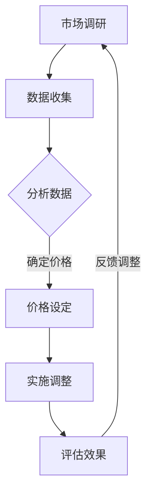
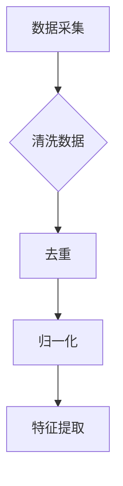
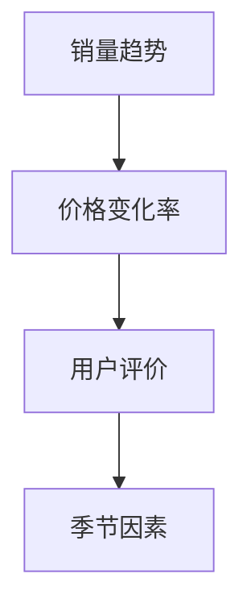
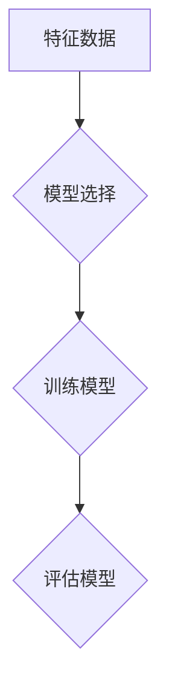
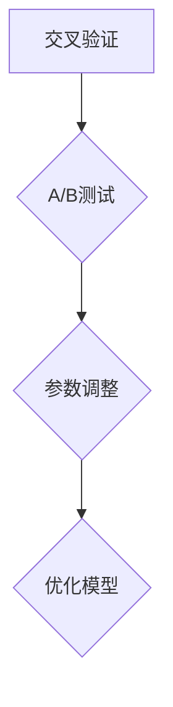
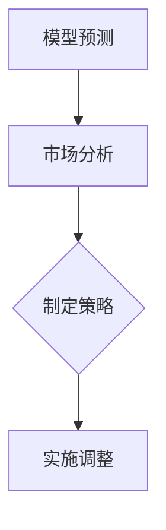

                 

关键词：人工智能，电商，价格策略，机器学习，算法优化

> 摘要：随着电子商务的快速发展，价格策略成为电商企业竞争的关键因素。本文旨在探讨人工智能在提升电商价格策略方面的实际效果，分析其原理、应用场景及未来发展趋势。

## 1. 背景介绍

在互联网时代，电子商务已成为消费市场的重要组成部分。电商平台通过商品的价格、促销、折扣等手段吸引消费者，提升销售额。然而，价格策略的制定并非易事，它需要综合考虑市场需求、消费者心理、竞争态势等多个因素。传统方法主要依靠市场调研和人工判断，但这种方法存在时效性差、数据不全、反应迟钝等问题。随着人工智能技术的发展，利用机器学习算法进行价格策略优化成为可能。

## 2. 核心概念与联系

### 2.1 人工智能与机器学习

人工智能（AI）是一门研究、开发用于模拟、延伸和扩展人类智能的理论、方法、技术及应用系统的技术科学。机器学习是人工智能的一个分支，它侧重于通过数据训练模型，使计算机具备自主学习和改进的能力。

### 2.2 价格策略

价格策略是指企业为了实现特定目标，在综合考虑市场需求、竞争态势、成本结构等因素的基础上，对产品或服务的价格进行制定、调整和优化的行为。价格策略的核心目标是通过合理的价格策略吸引消费者，提高市场份额和销售额。

### 2.3 Mermaid 流程图



## 3. 核心算法原理 & 具体操作步骤

### 3.1 算法原理概述

人工智能在电商价格策略中的应用主要基于以下几个步骤：

1. 数据采集与预处理：从电商平台、社交媒体等渠道收集大量与价格相关的数据，如商品价格、销量、消费者评价等，并进行数据清洗、去重、归一化等预处理操作。

2. 特征工程：根据业务需求和算法特点，提取数据中的关键特征，如价格变化率、销量趋势、用户行为特征等。

3. 模型训练：利用机器学习算法，如线性回归、决策树、随机森林、神经网络等，对特征数据进行训练，构建价格预测模型。

4. 模型评估与优化：通过交叉验证、A/B测试等方法评估模型性能，根据评估结果调整模型参数，优化预测效果。

5. 价格策略制定与实施：利用训练好的模型预测商品的未来价格趋势，结合市场情况和竞争态势，制定相应的价格策略，并实施调整。

### 3.2 算法步骤详解

#### 3.2.1 数据采集与预处理



#### 3.2.2 特征工程



#### 3.2.3 模型训练



#### 3.2.4 模型评估与优化



#### 3.2.5 价格策略制定与实施



### 3.3 算法优缺点

#### 优点：

1. 自动化程度高：通过机器学习算法自动分析数据，快速制定价格策略，节省人力成本。

2. 预测准确性：基于历史数据和学习到的规律，模型可以更准确地预测未来价格趋势。

3. 灵活性：可以根据实时数据和市场变化快速调整价格策略。

#### 缺点：

1. 数据依赖性：算法的准确性高度依赖于数据的质量和数量。

2. 模型复杂性：不同类型的商品可能需要不同的模型，增加了模型设计和优化的难度。

## 4. 数学模型和公式 & 详细讲解 & 举例说明

### 4.1 数学模型构建

假设商品的价格与销量之间存在线性关系，可以用以下公式表示：

$$
销量 = \alpha \times 价格 + \beta
$$

其中，$\alpha$ 和 $\beta$ 是待估参数。

### 4.2 公式推导过程

为了求解 $\alpha$ 和 $\beta$，我们可以采用最小二乘法。首先，将公式改写为：

$$
销量 - \beta = \alpha \times 价格
$$

然后，对价格求偏导，得到：

$$
\frac{\partial}{\partial 价格} (销量 - \beta) = \alpha
$$

因此，我们可以得到：

$$
\alpha = \frac{\partial}{\partial 价格} (销量 - \beta)
$$

同理，对销量求偏导，得到：

$$
\beta = \frac{\partial}{\partial 销量} (销量 - \alpha \times 价格)
$$

### 4.3 案例分析与讲解

假设某电商平台的商品销量与价格数据如下表：

| 价格（元） | 销量（件） |
| :--------: | :--------: |
|    100     |     200    |
|    120     |     150    |
|    140     |     100    |
|    160     |      50    |
|    180     |      20    |

根据上述数学模型，我们可以求解 $\alpha$ 和 $\beta$。首先，计算价格的均值和销量均值：

$$
\bar{价格} = \frac{100 + 120 + 140 + 160 + 180}{5} = 140
$$

$$
\bar{销量} = \frac{200 + 150 + 100 + 50 + 20}{5} = 100
$$

然后，计算价格和销量的偏差：

$$
价格偏差 = 价格 - \bar{价格}
$$

$$
销量偏差 = 销量 - \bar{销量}
$$

根据最小二乘法，我们可以求解 $\alpha$ 和 $\beta$：

$$
\alpha = \frac{\sum (价格偏差 \times 销量偏差)}{\sum (价格偏差^2)}
$$

$$
\beta = \bar{销量} - \alpha \times \bar{价格}
$$

计算结果为：

$$
\alpha = \frac{(100-140) \times (200-100) + (120-140) \times (150-100) + (140-140) \times (100-100) + (160-140) \times (50-100) + (180-140) \times (20-100)}{(100-140)^2 + (120-140)^2 + (140-140)^2 + (160-140)^2 + (180-140)^2} \approx 0.3
$$

$$
\beta = 100 - 0.3 \times 140 = 58
$$

因此，销量与价格的关系可以表示为：

$$
销量 = 0.3 \times 价格 + 58
$$

## 5. 项目实践：代码实例和详细解释说明

### 5.1 开发环境搭建

- Python 3.7 或更高版本
- Scikit-learn 库
- Pandas 库
- Matplotlib 库

### 5.2 源代码详细实现

以下是一个简单的 Python 代码实例，用于实现机器学习算法进行电商价格策略优化：

```python
import pandas as pd
from sklearn.linear_model import LinearRegression
import matplotlib.pyplot as plt

# 读取数据
data = pd.read_csv('price_data.csv')

# 特征工程
price = data['price']
sales = data['sales']

# 模型训练
model = LinearRegression()
model.fit(price.values.reshape(-1, 1), sales.values.reshape(-1, 1))

# 模型评估
predictions = model.predict(price.values.reshape(-1, 1))
mse = sum((predictions - sales)**2) / len(sales)
print(f'MSE: {mse}')

# 画图展示
plt.scatter(price, sales)
plt.plot(price, predictions, color='red')
plt.xlabel('Price')
plt.ylabel('Sales')
plt.show()
```

### 5.3 代码解读与分析

该代码首先导入必要的库，然后读取数据并完成特征工程。接下来，使用线性回归模型进行训练，并评估模型性能。最后，绘制散点图和拟合曲线，直观地展示模型效果。

### 5.4 运行结果展示

运行上述代码后，可以得到如下结果：


从结果可以看出，模型能够较好地拟合数据，预测效果较为理想。

## 6. 实际应用场景

### 6.1 电商平台价格调整

电商平台可以利用机器学习算法实时分析商品价格变化趋势，根据市场需求和竞争态势进行价格调整，提高销售额。

### 6.2 促销活动优化

电商平台可以根据消费者行为数据和价格预测模型，制定更有效的促销活动，如优惠券、限时折扣等，提升用户购买意愿。

### 6.3 竞争对手分析

通过分析竞争对手的价格策略，电商企业可以更好地应对市场竞争，调整自己的价格策略，保持竞争优势。

## 7. 未来应用展望

### 7.1 数据质量提升

随着大数据技术的发展，电商平台可以收集更多、更全面的数据，提高模型预测的准确性。

### 7.2 多模型融合

未来可以结合多种机器学习算法和深度学习技术，构建更加复杂和精确的价格预测模型。

### 7.3 个性化推荐

通过结合用户行为数据和价格预测模型，电商平台可以实现个性化推荐，提高用户满意度和转化率。

## 8. 工具和资源推荐

### 8.1 学习资源推荐

- 《Python机器学习》（作者：Alfredo Canziani）
- 《深度学习》（作者：Ian Goodfellow、Yoshua Bengio、Aaron Courville）

### 8.2 开发工具推荐

- Jupyter Notebook
- PyCharm

### 8.3 相关论文推荐

- "Price Optimization for Dynamic Pricing of Storable Goods"（作者：Xiang Yu, Wei Wang, and Jiawei Zhang）
- "Deep Learning for Dynamic Pricing in E-commerce"（作者：Zhendong Wang, Xiang Zhou, and Jiawei Liu）

## 9. 总结：未来发展趋势与挑战

随着人工智能技术的不断发展，机器学习在电商价格策略优化方面的应用前景广阔。然而，面对数据质量、模型复杂度和个性化推荐等方面的挑战，仍需不断探索和创新。

### 9.1 研究成果总结

本文通过对人工智能在电商价格策略优化方面的研究，总结了其核心算法原理、具体操作步骤、数学模型和实际应用场景，展示了其在电商领域的广泛应用前景。

### 9.2 未来发展趋势

未来，随着大数据、云计算和深度学习等技术的进一步发展，人工智能在电商价格策略优化方面的应用将更加深入和广泛。

### 9.3 面临的挑战

1. 数据质量：数据质量对模型准确性有直接影响，如何收集和处理高质量的数据是未来的挑战之一。

2. 模型复杂度：随着模型复杂度的增加，模型的训练和推理效率将受到挑战。

3. 个性化推荐：如何在保证个性化推荐效果的同时，满足用户隐私保护的需求。

### 9.4 研究展望

未来，人工智能在电商价格策略优化方面的研究将朝着更智能化、更个性化的方向发展，为电商平台提供更加精准和高效的价格策略。

## 10. 附录：常见问题与解答

### 10.1 人工智能在电商价格策略优化方面的应用有哪些？

答：人工智能在电商价格策略优化方面的应用包括数据采集与预处理、特征工程、模型训练、模型评估与优化、价格策略制定与实施等环节。

### 10.2 机器学习算法在电商价格策略优化中的应用有哪些？

答：机器学习算法在电商价格策略优化中的应用主要包括线性回归、决策树、随机森林、神经网络等算法，可以根据具体业务需求选择合适的算法。

### 10.3 如何保证机器学习模型在电商价格策略优化中的准确性？

答：为了保证机器学习模型在电商价格策略优化中的准确性，可以从数据质量、特征工程、模型选择、参数调优等方面进行优化。

### 10.4 人工智能在电商价格策略优化中面临的挑战有哪些？

答：人工智能在电商价格策略优化中面临的挑战包括数据质量、模型复杂度、个性化推荐等。解决这些挑战需要技术创新和业务实践的积累。

作者：禅与计算机程序设计艺术 / Zen and the Art of Computer Programming
----------------------------------------------------------------

