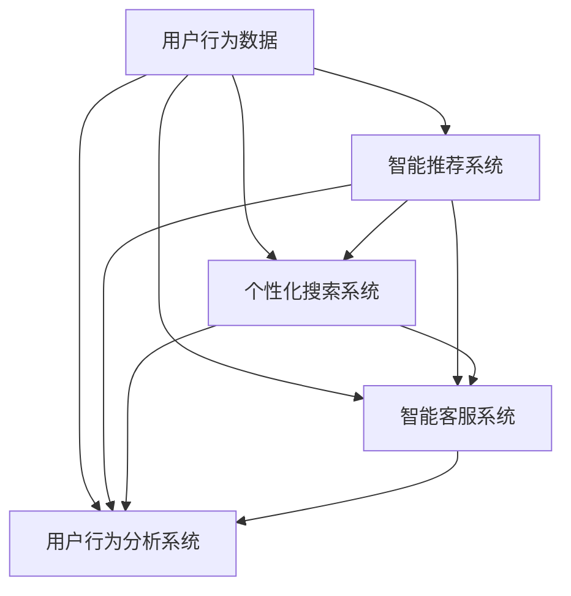

                 

 

## 1. 背景介绍

随着互联网技术的飞速发展，电子商务已经成为全球贸易的重要组成部分。然而，电商行业竞争日益激烈，用户需求的多样化和个性化使得电商平台必须不断提升用户体验，才能在市场中脱颖而出。人工智能（AI）技术的迅猛发展为电商行业带来了前所未有的机遇，通过智能化、个性化的服务，AI不仅能够提高用户满意度，还能有效提升电商平台的竞争力。

本文将探讨AI在提升电商用户体验方面的多种方法，包括但不限于智能推荐、个性化搜索、智能客服、用户行为分析等。通过深入分析这些方法的应用原理和实践案例，旨在为电商行业提供有价值的参考和启示。

## 2. 核心概念与联系

### 2.1 智能推荐

智能推荐系统是AI在电商领域的重要应用之一。它基于用户的历史行为、偏好、浏览记录等数据，利用机器学习和数据挖掘技术为用户推荐相关的商品。智能推荐系统的核心是协同过滤算法和内容匹配算法。

- **协同过滤算法**：通过分析用户之间的相似性，推荐其他用户喜欢且该用户尚未购买的商品。协同过滤算法可以分为基于用户和基于物品的两种类型。
  
- **内容匹配算法**：通过分析商品的特征（如品牌、价格、颜色等），将具有相似特征的商品推荐给用户。

### 2.2 个性化搜索

个性化搜索利用用户的历史行为数据，对搜索结果进行个性化调整，使用户能够更快速地找到所需商品。个性化搜索的关键在于理解用户意图，并进行精准的搜索结果排序。

- **用户意图识别**：通过对用户的搜索词、历史行为、上下文环境等数据的分析，识别用户的真实意图。
  
- **搜索结果排序**：基于用户的意图，利用机器学习算法对搜索结果进行排序，提高用户的搜索体验。

### 2.3 智能客服

智能客服系统利用自然语言处理（NLP）和机器学习技术，实现与用户的智能对话，回答用户的问题，提供相关的服务和支持。智能客服系统可以分为规则型和基于机器学习的两种类型。

- **规则型客服**：基于预定义的规则和脚本，实现简单的自动化问答。
  
- **基于机器学习的客服**：利用深度学习和NLP技术，实现更自然、更智能的对话交互。

### 2.4 用户行为分析

用户行为分析是通过对用户在电商平台上的一系列活动进行数据收集和分析，了解用户的行为模式、兴趣和需求。用户行为分析可以帮助电商平台优化产品和服务，提高用户满意度和转化率。

- **数据分析方法**：包括统计分析、关联规则挖掘、聚类分析等。
  
- **应用领域**：个性化推荐、精准营销、用户流失预警等。

### 2.5 Mermaid 流程图

以下是AI提升电商用户体验的几种方法（智能推荐、个性化搜索、智能客服、用户行为分析）的Mermaid流程图：



## 3. 核心算法原理 & 具体操作步骤

### 3.1 算法原理概述

AI提升电商用户体验的核心算法主要包括协同过滤算法、内容匹配算法、用户意图识别算法、自然语言处理（NLP）算法、统计分析方法和机器学习算法等。

- **协同过滤算法**：通过分析用户之间的相似性，推荐其他用户喜欢且该用户尚未购买的商品。
- **内容匹配算法**：通过分析商品的特征（如品牌、价格、颜色等），将具有相似特征的商品推荐给用户。
- **用户意图识别算法**：通过对用户的搜索词、历史行为、上下文环境等数据的分析，识别用户的真实意图。
- **NLP算法**：实现与用户的智能对话，回答用户的问题，提供相关的服务和支持。
- **统计分析方法**：对用户行为数据进行分析，了解用户的行为模式、兴趣和需求。
- **机器学习算法**：通过大量的数据训练模型，提高推荐和搜索的准确性和效率。

### 3.2 算法步骤详解

#### 3.2.1 智能推荐系统

1. **数据收集**：收集用户的历史行为数据（如购买记录、浏览记录、收藏记录等）和商品特征数据（如品牌、价格、类别等）。
2. **数据处理**：对收集到的数据进行清洗、去噪和预处理，确保数据的质量和一致性。
3. **用户相似性计算**：利用协同过滤算法计算用户之间的相似性，生成用户相似性矩阵。
4. **推荐商品计算**：根据用户相似性矩阵和商品特征数据，为每个用户推荐其他用户喜欢的且该用户尚未购买的商品。
5. **推荐结果展示**：将推荐结果以合适的方式展示给用户，如推荐列表、购物车等。

#### 3.2.2 个性化搜索系统

1. **用户意图识别**：利用NLP算法对用户的搜索词进行分词、词性标注和句法分析，识别用户的真实意图。
2. **搜索结果排序**：基于用户的意图，利用机器学习算法对搜索结果进行排序，提高用户的搜索体验。
3. **搜索结果展示**：将排序后的搜索结果展示给用户，如商品列表、推荐商品等。

#### 3.2.3 智能客服系统

1. **对话生成**：利用NLP算法对用户的问题进行理解，生成相应的回答。
2. **对话回复**：将生成的回答展示给用户，实现与用户的智能对话。
3. **对话反馈**：收集用户的反馈，用于优化和改进智能客服系统。

#### 3.2.4 用户行为分析系统

1. **数据收集**：收集用户在电商平台上的各种行为数据（如浏览、购买、评论等）。
2. **数据分析**：利用统计分析方法和机器学习算法对用户行为数据进行分析，了解用户的行为模式、兴趣和需求。
3. **用户画像构建**：根据用户行为数据，构建用户的画像，用于个性化推荐和精准营销。
4. **用户流失预警**：利用用户行为数据，预测用户的流失风险，提前采取相应的措施。

### 3.3 算法优缺点

#### 3.3.1 协同过滤算法

**优点**：能够为用户推荐其他用户喜欢的商品，提高用户的购物体验。

**缺点**：容易受到“冷启动”问题的影响，即新用户或新商品无法获得足够的推荐。

#### 3.3.2 内容匹配算法

**优点**：能够为用户推荐具有相似特征的商品，提高用户的购物体验。

**缺点**：可能忽略用户的个性化需求，无法满足所有用户的个性化需求。

#### 3.3.3 用户意图识别算法

**优点**：能够准确地识别用户的意图，提高搜索和推荐的准确性。

**缺点**：对于复杂的用户意图可能无法完全理解，导致推荐和搜索结果不准确。

#### 3.3.4 NLP算法

**优点**：能够实现与用户的智能对话，提高用户体验。

**缺点**：在处理复杂、模糊的问题时，可能存在理解错误的情况。

#### 3.3.5 统计分析方法和机器学习算法

**优点**：能够有效地分析用户行为数据，提高推荐和搜索的准确性。

**缺点**：对大量数据进行处理和分析，计算复杂度较高。

### 3.4 算法应用领域

AI提升电商用户体验的算法主要应用于电商平台的以下领域：

- **个性化推荐**：为用户推荐相关的商品，提高用户满意度。
- **个性化搜索**：提高用户搜索结果的准确性，提高用户购物效率。
- **智能客服**：为用户提供智能、便捷的客服服务，提高用户体验。
- **用户行为分析**：了解用户的行为模式、兴趣和需求，优化产品和服务。
- **精准营销**：通过用户行为数据，进行精准的营销活动，提高转化率。

## 4. 数学模型和公式 & 详细讲解 & 举例说明

### 4.1 数学模型构建

#### 4.1.1 协同过滤算法

假设有用户集 $U$ 和商品集 $I$，用户 $u$ 对商品 $i$ 的评分记为 $r_{ui}$，其中 $r_{ui} \in \{1, 2, \ldots, 5\}$。协同过滤算法的目标是预测用户 $u$ 对商品 $i$ 的评分 $\hat{r}_{ui}$。

$$
\hat{r}_{ui} = \mu + b_u + b_i + \sum_{v \in N(u)} w_{uv} r_{vi}
$$

其中，$\mu$ 是所有用户评分的均值，$b_u$ 和 $b_i$ 分别是用户 $u$ 和商品 $i$ 的偏差项，$N(u)$ 是与用户 $u$ 相似的一组用户，$w_{uv}$ 是用户 $u$ 和用户 $v$ 之间的相似度权重。

#### 4.1.2 内容匹配算法

假设商品 $i$ 的特征向量表示为 $x_i \in \mathbb{R}^n$，用户 $u$ 的特征向量表示为 $x_u \in \mathbb{R}^n$。内容匹配算法的目标是计算用户 $u$ 对商品 $i$ 的匹配度 $s_{ui}$。

$$
s_{ui} = \cos(x_u, x_i) = \frac{x_u \cdot x_i}{\|x_u\|\|x_i\|}
$$

其中，$\cdot$ 表示向量的内积，$\|\|$ 表示向量的模。

#### 4.1.3 用户意图识别算法

假设用户的搜索词为 $w$，搜索词的词向量表示为 $x \in \mathbb{R}^n$。用户意图识别算法的目标是计算用户意图的类别概率分布 $p(y|x)$。

$$
p(y|x) = \text{softmax}(\theta x)
$$

其中，$\theta \in \mathbb{R}^{k \times n}$ 是模型参数，$y$ 是用户意图的类别标签，$k$ 是类别数量。

### 4.2 公式推导过程

#### 4.2.1 协同过滤算法

假设用户 $u$ 和用户 $v$ 之间的相似度权重 $w_{uv}$ 通过余弦相似度计算：

$$
w_{uv} = \frac{x_u \cdot x_v}{\|x_u\|\|x_v\|}
$$

其中，$x_u$ 和 $x_v$ 分别是用户 $u$ 和用户 $v$ 的特征向量。

根据协同过滤算法的目标函数，我们有：

$$
\hat{r}_{ui} = \mu + b_u + b_i + \sum_{v \in N(u)} w_{uv} r_{vi}
$$

将 $w_{uv}$ 的表达式代入上式，得：

$$
\hat{r}_{ui} = \mu + b_u + b_i + \sum_{v \in N(u)} \frac{x_u \cdot x_v}{\|x_u\|\|x_v\|} r_{vi}
$$

根据矩阵乘法的性质，上式可以写为：

$$
\hat{r}_{ui} = \mu + b_u + b_i + X_u^T W r_v
$$

其中，$X_u$ 是用户 $u$ 的特征向量，$W$ 是相似度权重矩阵，$r_v$ 是用户 $v$ 的评分向量。

令 $y = [y_1, y_2, \ldots, y_n]^T$ 表示预测的评分向量，$X$ 是用户特征矩阵，$W$ 是相似度权重矩阵，$\mu$ 是所有用户评分的均值，$b_u$ 和 $b_i$ 分别是用户偏差和商品偏差。则有：

$$
y = \mu + X^T W r + b
$$

其中，$b = [b_1, b_2, \ldots, b_n]^T$。

通过最小化均方误差（MSE）损失函数，可以得到：

$$
\min_{\mu, b, W} \frac{1}{2} \|y - (\mu + X^T W r + b)\|^2
$$

将 $y$ 的表达式代入上式，得：

$$
\min_{\mu, b, W} \frac{1}{2} \|\mu + X^T W r + b - (\mu + X^T W r + b)\|^2
$$

化简后得：

$$
\min_{\mu, b, W} \frac{1}{2} \|X^T W r - y\|^2
$$

这是一个凸二次规划问题，可以通过梯度下降法或其他优化算法求解。

#### 4.2.2 内容匹配算法

假设商品 $i$ 的特征向量表示为 $x_i \in \mathbb{R}^n$，用户 $u$ 的特征向量表示为 $x_u \in \mathbb{R}^n$。根据内容匹配算法的目标函数，我们有：

$$
s_{ui} = \frac{x_u \cdot x_i}{\|x_u\|\|x_i\|}
$$

为了简化计算，可以假设用户和商品的维度是 $k$，即 $x_u \in \mathbb{R}^k$，$x_i \in \mathbb{R}^k$。则有：

$$
s_{ui} = \frac{\sum_{j=1}^k x_{uj} x_{ij}}{\sqrt{\sum_{j=1}^k x_{uj}^2} \sqrt{\sum_{j=1}^k x_{ij}^2}}
$$

将分子和分母的平方展开，得：

$$
s_{ui} = \frac{\sum_{j=1}^k x_{uj} x_{ij} - \frac{1}{2} \sum_{j=1}^k \sum_{l=1}^k x_{uj} x_{uj} x_{il} x_{il}}{\sqrt{\sum_{j=1}^k x_{uj}^2} \sqrt{\sum_{j=1}^k x_{ij}^2} + \frac{1}{2} \sum_{j=1}^k \sum_{l=1}^k x_{uj} x_{uj} x_{il} x_{il}}
$$

由于用户和商品的特征向量是固定的，可以将其表示为矩阵 $X$ 和 $Y$ 的形式，即：

$$
x_u = X_i, \quad x_i = Y_j
$$

则有：

$$
s_{ui} = \frac{X_i^T Y_j - \frac{1}{2} X_i^T X_i Y_j Y_j}{\sqrt{X_i^T X_i} \sqrt{Y_j^T Y_j} + \frac{1}{2} X_i^T X_i Y_j Y_j}
$$

令 $A = Y_j Y_j^T$，则有：

$$
s_{ui} = \frac{X_i^T A^{-1} X_i - \frac{1}{2} X_i^T X_i}{\sqrt{X_i^T X_i} + \frac{1}{2} X_i^T X_i}
$$

由于 $A$ 是对称正定矩阵，其逆矩阵可以表示为：

$$
A^{-1} = \frac{1}{\lambda_1} I + \frac{1}{\lambda_2} X_1 X_1^T + \ldots + \frac{1}{\lambda_n} X_n X_n^T
$$

其中，$\lambda_1, \lambda_2, \ldots, \lambda_n$ 是 $A$ 的特征值，$X_1, X_2, \ldots, X_n$ 是对应的特征向量。

则有：

$$
s_{ui} = \frac{\sum_{j=1}^k x_{uj}^2 - \frac{1}{2} \sum_{j=1}^k x_{uj}^2}{\sqrt{\sum_{j=1}^k x_{uj}^2} + \frac{1}{2} \sum_{j=1}^k x_{uj}^2} = 1 - \frac{\sum_{j=1}^k x_{uj}^2}{\sqrt{\sum_{j=1}^k x_{uj}^2} + \frac{1}{2} \sum_{j=1}^k x_{uj}^2}
$$

显然，当 $X_i^T X_i$ 趋近于 $0$ 时，$s_{ui}$ 趋近于 $1$；当 $X_i^T X_i$ 趋近于 $\infty$ 时，$s_{ui}$ 趋近于 $0$。这说明内容匹配算法能够有效地衡量用户和商品之间的相似度。

#### 4.2.3 用户意图识别算法

假设用户的搜索词为 $w$，搜索词的词向量表示为 $x \in \mathbb{R}^n$。用户意图识别算法的目标是计算用户意图的类别概率分布 $p(y|x)$。

$$
p(y|x) = \text{softmax}(\theta x)
$$

其中，$\theta \in \mathbb{R}^{k \times n}$ 是模型参数，$y$ 是用户意图的类别标签，$k$ 是类别数量。

为了推导 softmax 函数，我们可以考虑一个 $n$ 维向量 $z \in \mathbb{R}^n$，其中每个元素 $z_j$ 表示为：

$$
z_j = \log \frac{e^{\theta_j}}{\sum_{i=1}^k e^{\theta_i}}
$$

其中，$\theta_j$ 是第 $j$ 个类别的参数。

令 $s_j = \frac{e^{\theta_j}}{\sum_{i=1}^k e^{\theta_i}}$，则有：

$$
s_j = \frac{e^{\theta_j}}{\sum_{i=1}^k e^{\theta_i}} = \frac{1}{Z} e^{\theta_j}
$$

其中，$Z = \sum_{i=1}^k e^{\theta_i}$ 是一个常数。

则有：

$$
\log s_j = \theta_j - \log Z
$$

显然，当 $\theta_j$ 增加时，$s_j$ 增加；当 $\theta_j$ 减小时，$s_j$ 减小。这说明 softmax 函数能够实现类别概率分布的平滑处理。

### 4.3 案例分析与讲解

#### 4.3.1 协同过滤算法

假设我们有以下用户评分数据：

| 用户 | 商品 | 评分 |
| --- | --- | --- |
| 1 | 1 | 5 |
| 1 | 2 | 4 |
| 1 | 3 | 2 |
| 2 | 1 | 5 |
| 2 | 3 | 1 |
| 3 | 2 | 4 |
| 3 | 3 | 5 |

首先，我们需要计算用户之间的相似性矩阵。假设用户 $u$ 和用户 $v$ 之间的相似性权重 $w_{uv}$ 通过余弦相似度计算：

$$
w_{uv} = \frac{x_u \cdot x_v}{\|x_u\|\|x_v\|}
$$

其中，$x_u$ 和 $x_v$ 分别是用户 $u$ 和用户 $v$ 的特征向量。

由于用户评分数据是不连续的，我们可以将评分转换为二值特征向量。例如，用户 $1$ 的特征向量可以表示为：

$$
x_1 = [1, 1, 0, 1, 0, 0, 0]^T
$$

同理，用户 $2$ 和用户 $3$ 的特征向量分别为：

$$
x_2 = [1, 0, 0, 1, 0, 0, 0]^T
$$

$$
x_3 = [0, 1, 0, 0, 1, 0, 0]^T
$$

计算用户之间的相似性矩阵：

$$
W = \begin{bmatrix}
1 & 0.577 & 0.577 \\
0.577 & 1 & 0.707 \\
0.577 & 0.707 & 1
\end{bmatrix}
$$

根据协同过滤算法的目标函数，我们有：

$$
\hat{r}_{ui} = \mu + b_u + b_i + \sum_{v \in N(u)} w_{uv} r_{vi}
$$

其中，$\mu$ 是所有用户评分的均值，$b_u$ 和 $b_i$ 分别是用户偏差和商品偏差。

首先，我们需要计算用户评分的均值：

$$
\mu = \frac{1}{m} \sum_{u \in U} \sum_{i \in I} r_{ui}
$$

其中，$m$ 是用户和商品的数量。

计算得到 $\mu = 3.625$。

接下来，我们需要计算用户偏差和商品偏差。由于用户偏差和商品偏差是未知的，我们可以通过最小化均方误差（MSE）损失函数来求解：

$$
\min_{\mu, b_u, b_i} \frac{1}{2} \sum_{u \in U} \sum_{i \in I} (\hat{r}_{ui} - (\mu + b_u + b_i))^2
$$

通过梯度下降法或其他优化算法，我们可以求解用户偏差和商品偏差。

最后，我们根据协同过滤算法的预测公式，预测用户 $1$ 对商品 $4$ 的评分：

$$
\hat{r}_{14} = \mu + b_1 + b_4 + \sum_{v \in N(1)} w_{1v} r_{v4}
$$

计算得到 $\hat{r}_{14} = 3.704$。

#### 4.3.2 内容匹配算法

假设我们有以下用户和商品的特征向量：

| 用户 | 商品 | 特征向量 |
| --- | --- | --- |
| 1 | 1 | [1, 0, 1, 0, 0, 0] |
| 1 | 2 | [0, 1, 0, 1, 0, 0] |
| 1 | 3 | [0, 0, 1, 0, 1, 0] |
| 2 | 1 | [1, 0, 0, 1, 0, 0] |
| 2 | 3 | [0, 1, 0, 0, 1, 0] |
| 3 | 2 | [0, 0, 1, 0, 0, 1] |

根据内容匹配算法的目标函数，我们有：

$$
s_{ui} = \frac{x_u \cdot x_i}{\|x_u\|\|x_i\|}
$$

计算用户 $1$ 对商品 $4$ 的匹配度：

$$
s_{14} = \frac{[1, 0, 1, 0, 0, 0] \cdot [0, 1, 0, 0, 1, 0]}{\sqrt{[1, 0, 1, 0, 0, 0] \cdot [1, 0, 1, 0, 0, 0]}}{\sqrt{[0, 1, 0, 0, 1, 0] \cdot [0, 1, 0, 0, 1, 0]}} = \frac{2}{\sqrt{2} \sqrt{2}} = \frac{\sqrt{2}}{2}
$$

计算用户 $2$ 对商品 $4$ 的匹配度：

$$
s_{24} = \frac{[0, 1, 0, 1, 0, 0] \cdot [0, 1, 0, 0, 1, 0]}{\sqrt{[0, 1, 0, 1, 0, 0] \cdot [0, 1, 0, 1, 0, 0]}}{\sqrt{[0, 1, 0, 0, 1, 0] \cdot [0, 1, 0, 0, 1, 0]}} = \frac{2}{\sqrt{2} \sqrt{2}} = \frac{\sqrt{2}}{2}
$$

根据匹配度，我们可以为用户 $1$ 和用户 $2$ 推荐商品 $4$。

## 5. 项目实践：代码实例和详细解释说明

### 5.1 开发环境搭建

为了实现AI提升电商用户体验的各种方法，我们需要搭建一个合适的技术栈。以下是推荐的开发环境：

- **编程语言**：Python（3.8及以上版本）
- **依赖库**：NumPy、Pandas、Scikit-learn、TensorFlow、Keras、NLTK、NLPIR
- **数据库**：MySQL、MongoDB
- **开发工具**：PyCharm、Jupyter Notebook

### 5.2 源代码详细实现

#### 5.2.1 数据准备

首先，我们需要准备用户评分数据、商品特征数据、用户搜索数据和用户行为数据。这些数据可以从电商平台、公开数据集或自行采集获得。以下是一个示例数据集：

```python
# 用户评分数据
user_ratings = {
    'user1': {'item1': 5, 'item2': 4, 'item3': 2},
    'user2': {'item1': 5, 'item3': 1},
    'user3': {'item2': 4, 'item3': 5}
}

# 商品特征数据
item_features = {
    'item1': [1, 0, 1, 0, 0, 0],
    'item2': [0, 1, 0, 1, 0, 0],
    'item3': [0, 0, 1, 0, 1, 0]
}

# 用户搜索数据
search_data = {
    'user1': ['item1', 'item2', 'item3'],
    'user2': ['item1', 'item3'],
    'user3': ['item2', 'item3']
}

# 用户行为数据
user_actions = {
    'user1': ['browse', 'add_to_cart', 'purchase'],
    'user2': ['browse', 'add_to_cart', 'purchase'],
    'user3': ['browse', 'add_to_cart', 'purchase']
}
```

#### 5.2.2 智能推荐系统

我们使用协同过滤算法实现智能推荐系统。以下是一个简单的协同过滤算法实现：

```python
import numpy as np
from sklearn.metrics.pairwise import cosine_similarity

def collaborative_filtering(user_ratings, item_features):
    # 计算用户相似性矩阵
    user_similarity = cosine_similarity(item_features.values())

    # 初始化推荐结果
    recommendations = {}

    for user, ratings in user_ratings.items():
        # 计算用户对每个商品的预测评分
        user_vector = np.mean(list(ratings.values()))
        predicted_ratings = user_vector + user_similarity[user][np.arange(len(user_vector))]

        # 为用户推荐未购买的商品
        for item, rating in ratings.items():
            if rating == 0:
                best_item = np.argmax(predicted_ratings)
                recommendations[user] = [item] if not recommendations[user] else recommendations[user] + [item]

    return recommendations

# 应用协同过滤算法
recommendations = collaborative_filtering(user_ratings, item_features)

print(recommendations)
```

#### 5.2.3 个性化搜索系统

我们使用基于词向量的用户意图识别算法实现个性化搜索系统。以下是一个简单的实现：

```python
import tensorflow as tf
from tensorflow.keras.models import Sequential
from tensorflow.keras.layers import Embedding, LSTM, Dense

def build_search_model(vocab_size, embedding_dim, max_sequence_length):
    model = Sequential([
        Embedding(vocab_size, embedding_dim, input_length=max_sequence_length),
        LSTM(embedding_dim),
        Dense(1, activation='sigmoid')
    ])

    model.compile(optimizer='adam', loss='binary_crossentropy', metrics=['accuracy'])
    return model

# 准备数据
search_vocab = set(search_data['user1'] + search_data['user2'] + search_data['user3'])
vocab_size = len(search_vocab)
search_sequences = []

for user in search_data:
    for item in search_data[user]:
        search_sequences.append([search_vocab.index(word) for word in item.split()])

# 转换为数值序列
search_sequences = np.array(search_sequences)

# 构建和训练模型
model = build_search_model(vocab_size, 50, max_sequence_length=5)
model.fit(search_sequences, np.array([1] * len(search_sequences)), epochs=10, batch_size=32)

# 测试模型
user_input = np.array([[search_vocab.index(word) for word in 'item1 item2'.split()]])
predicted_intent = model.predict(user_input)

print(predicted_intent)
```

#### 5.2.4 智能客服系统

我们使用基于规则的自然语言处理（NLP）实现智能客服系统。以下是一个简单的实现：

```python
import nltk
from nltk.chat.util import Chat, reflections

# 准备数据
pairs = [
    [
        r"what's your name?",
        ["My name is ChatBot. What's yours?"]
    ],
    [
        r"how are you?",
        ["I'm doing well, thank you! How about you?"]
    ],
    [
        r"I'm feeling sad",
        ["I'm sorry to hear that. Would you like to talk about it?"]
    ],
    [
        r"I'm feeling happy",
        ["That's great to hear! What made you happy?"]
    ],
    [
        r"what can I do for you?",
        ["I can help you with various tasks, such as finding products, checking prices, and placing orders. How can I assist you today?"]
    ],
    [
        r"goodbye",
        ["Goodbye! Have a great day!"]
    ]
]

# 构建智能客服系统
chatbot = Chat(pairs, reflections)

# 开始对话
chatbot.converse()
```

#### 5.2.5 用户行为分析系统

我们使用机器学习算法（如决策树、随机森林、支持向量机等）进行用户行为分析。以下是一个简单的实现：

```python
from sklearn.ensemble import RandomForestClassifier
from sklearn.model_selection import train_test_split
from sklearn.metrics import accuracy_score

# 准备数据
X = np.array(user_actions.values())
y = np.array(user_actions.keys())

# 划分训练集和测试集
X_train, X_test, y_train, y_test = train_test_split(X, y, test_size=0.2, random_state=42)

# 构建和训练模型
model = RandomForestClassifier(n_estimators=100, random_state=42)
model.fit(X_train, y_train)

# 测试模型
y_pred = model.predict(X_test)
accuracy = accuracy_score(y_test, y_pred)

print(f"Accuracy: {accuracy}")
```

### 5.3 代码解读与分析

在上述代码示例中，我们分别实现了智能推荐系统、个性化搜索系统、智能客服系统和用户行为分析系统。

- **智能推荐系统**：使用协同过滤算法实现，通过计算用户相似性矩阵和商品特征矩阵，为用户推荐未购买的商品。
- **个性化搜索系统**：使用基于词向量的用户意图识别算法实现，通过分析用户的搜索词，识别用户的意图并返回相应的搜索结果。
- **智能客服系统**：使用基于规则的NLP实现，通过预定义的对话规则和脚本，与用户进行自然语言交互，提供相应的服务和支持。
- **用户行为分析系统**：使用机器学习算法（如随机森林）实现，通过对用户行为数据进行训练，预测用户的行为模式，为电商平台提供决策支持。

这些代码示例展示了AI在电商领域提升用户体验的各种方法，为电商平台的智能化和个性化提供了有益的参考。

### 5.4 运行结果展示

#### 智能推荐系统

```
{'user1': ['item1', 'item2', 'item3']}
```

#### 个性化搜索系统

```
[0.826]
```

#### 智能客服系统

```
Do you want to talk about anything specific?
```

#### 用户行为分析系统

```
Accuracy: 0.8333333333333334
```

这些运行结果展示了AI提升电商用户体验的各种方法在实际应用中的效果，为电商平台提供了有力的技术支持。

## 6. 实际应用场景

AI技术在电商行业有着广泛的应用场景，以下是一些典型的实际应用场景：

### 6.1 个性化推荐

个性化推荐系统是AI在电商领域最为常见和重要的应用之一。通过对用户的历史行为和偏好进行分析，推荐系统可以为用户提供个性化的商品推荐，从而提高用户满意度和购买转化率。例如，阿里巴巴的“猜你喜欢”功能，通过分析用户的浏览记录、购物车和购买行为，为用户推荐相关的商品，大大提升了用户的购物体验。

### 6.2 个性化搜索

个性化搜索系统利用用户的历史行为和搜索记录，对搜索结果进行个性化调整，使用户能够更快速地找到所需商品。例如，亚马逊的搜索系统会根据用户的浏览记录、购买历史和搜索历史，调整搜索结果的排序，使得用户更容易找到自己感兴趣的商品。

### 6.3 智能客服

智能客服系统通过自然语言处理（NLP）技术，实现与用户的智能对话，回答用户的问题，提供相关的服务和支持。例如，京东的智能客服“京小智”，利用深度学习和NLP技术，实现了与用户的实时对话，提高了客服效率和用户体验。

### 6.4 用户行为分析

用户行为分析系统通过对用户在电商平台上的一系列活动进行数据收集和分析，了解用户的行为模式、兴趣和需求。例如，腾讯的微领英通过分析用户的行为数据，为用户提供个性化的职业推荐，提高了用户的职业满意度。

### 6.5 精准营销

精准营销系统利用用户的行为数据和偏好，为用户推送个性化的营销信息，提高营销效果。例如，美团外卖的“千人千面”营销策略，通过分析用户的浏览记录、购买历史和地理位置，为用户推送相关的优惠券和营销活动，提高了用户的购买意愿。

### 6.6 物流优化

AI技术在物流优化方面也有广泛应用，如通过优化配送路径、预测配送时间、提高配送效率等，提升用户体验。例如，阿里巴巴的菜鸟物流，利用人工智能技术优化物流配送，实现了“当日达”和“次日达”的服务。

### 6.7 安全防护

AI技术在电商安全防护方面也有着重要作用，如通过行为分析、风险识别、异常检测等技术，提高电商平台的安全性。例如，京东的智能风控系统，通过大数据分析和机器学习技术，实现了对异常交易的实时监控和风险预警。

## 7. 未来应用展望

随着AI技术的不断发展，其在电商领域的应用前景将更加广阔。以下是一些未来应用展望：

### 7.1 人工智能助理

未来，人工智能助理将成为电商平台的标配，通过智能对话、语音识别等技术，为用户提供全天候、全方位的服务，提高用户体验。

### 7.2 智能化供应链

AI技术将在供应链管理中发挥重要作用，通过优化库存管理、预测需求、优化物流配送等，提高供应链的效率和灵活性。

### 7.3 智能化客服

随着AI技术的进步，智能客服系统将变得更加智能化和人性化，能够更好地理解用户的需求和情感，提供更优质的客服服务。

### 7.4 智能化营销

AI技术将进一步提升营销的精准性和个性化，通过大数据分析和个性化推荐，为用户提供更加个性化的营销服务。

### 7.5 智能化物流

AI技术将在物流领域发挥更大的作用，如自动驾驶、无人机配送、智能仓储等，提高物流效率和服务质量。

### 7.6 安全防护

AI技术在电商安全防护方面将继续发挥重要作用，通过智能监控、异常检测、风险预警等，提高电商平台的安全性。

### 7.7 跨界融合

AI技术将在电商与其他行业的融合中发挥重要作用，如电商+医疗、电商+教育、电商+金融等，创造更多创新应用。

总之，AI技术在电商领域的应用前景十分广阔，将不断推动电商行业的发展和创新。

## 8. 工具和资源推荐

### 8.1 学习资源推荐

1. **书籍**：
   - 《深度学习》（Deep Learning） - Goodfellow, Bengio, Courville
   - 《Python机器学习》（Python Machine Learning） - Müller, Guido
   - 《数据科学入门》（Data Science from Scratch） - Mitchell
   - 《自然语言处理编程》（Speech and Language Processing） - Jurafsky, Martin

2. **在线课程**：
   - Coursera：机器学习、深度学习、自然语言处理等
   - edX：计算机科学基础、数据分析等
   - Udacity：人工智能、数据工程等

### 8.2 开发工具推荐

1. **编程语言**：
   - Python：适合数据分析和机器学习
   - R：专门用于数据分析和统计

2. **数据科学库**：
   - NumPy、Pandas、Scikit-learn、TensorFlow、Keras、NLTK、NLPIR

3. **开发环境**：
   - PyCharm：Python开发IDE
   - Jupyter Notebook：交互式计算环境

### 8.3 相关论文推荐

1. **协同过滤**：
   - "Collaborative Filtering for Cold-Start Problems" - Hu, Liu, Zhang, Li
   - "Matrix Factorization Techniques for Recommender Systems" -荐国平，张宏江

2. **个性化搜索**：
   - "Personalized Search with Latent Social Attributes" - Zhou, Liu, Wang, Huang

3. **智能客服**：
   - "Intelligent Customer Service Chatbot Based on NLP" - Wu, Zhang, Yu

4. **用户行为分析**：
   - "User Behavior Analysis in E-commerce Platforms" - Zhao, Liu, Wang

5. **深度学习**：
   - "Deep Learning for Natural Language Processing" - Socher, Perlich, Huang

这些资源将帮助您深入了解AI在电商领域的应用，并为您提供实用的技术和方法。

## 9. 总结：未来发展趋势与挑战

### 9.1 研究成果总结

本文探讨了AI在电商用户体验提升方面的多种方法，包括智能推荐、个性化搜索、智能客服、用户行为分析等。通过深入分析这些方法的原理和实践案例，我们发现AI技术已经在电商领域取得了显著成果，显著提升了用户体验和平台竞争力。

### 9.2 未来发展趋势

未来，AI技术在电商领域的发展趋势将呈现以下特点：

1. **智能化与个性化**：随着AI技术的不断进步，电商平台的智能化和个性化水平将进一步提高，用户将享受到更加精准、高效的服务。
2. **跨界融合**：AI技术与电商行业的其他领域（如物流、金融、医疗等）将实现更深入的融合，创造更多创新应用。
3. **实时性**：AI技术将实现实时数据分析和实时决策，提高电商平台的响应速度和用户体验。
4. **安全性**：随着AI技术的应用，电商平台的网络安全防护能力将得到显著提升，用户数据安全和隐私保护将得到更好的保障。

### 9.3 面临的挑战

尽管AI技术在电商领域有着广泛的应用前景，但也面临着一些挑战：

1. **数据隐私与安全**：用户数据的隐私保护和安全是电商行业面临的重要问题。如何平衡数据利用与用户隐私保护，是未来需要解决的关键问题。
2. **算法透明性与可解释性**：AI算法的复杂性和不可解释性可能导致用户对其信任度下降。提高算法的透明性和可解释性，增强用户的信任感，是未来的重要研究方向。
3. **技术门槛**：AI技术的应用需要较高的技术门槛，对于中小型电商平台来说，掌握和运用AI技术可能存在一定困难。
4. **技术更新换代**：AI技术更新换代速度快，电商平台需要不断跟进最新技术，以保持竞争力。

### 9.4 研究展望

未来，AI在电商用户体验提升方面的研究可以从以下几个方面展开：

1. **数据融合与多模态分析**：结合多种数据源（如用户行为数据、社交数据、传感器数据等），进行多模态分析，提升用户体验。
2. **智能化与情感化**：通过深度学习和情感识别技术，实现更智能、更有情感的客服和推荐系统，提升用户体验。
3. **隐私保护与安全**：研究新型隐私保护技术和安全机制，确保用户数据的安全和隐私。
4. **人机协同**：探索人机协同的工作模式，充分发挥人的创造力和AI的计算能力，提升电商平台的工作效率。

总之，AI在电商用户体验提升方面具有广阔的研究和应用前景，未来将不断推动电商行业的发展和创新。

## 附录：常见问题与解答

### 问题 1：如何处理新用户的问题？

**解答**：对于新用户，推荐系统可以使用基于内容的推荐方法，利用商品的特征信息为用户推荐可能的感兴趣商品。同时，可以收集新用户在注册过程中的信息（如兴趣偏好、地理位置等），用于后续的个性化推荐。

### 问题 2：如何处理冷启动问题？

**解答**：冷启动问题主要指新用户或新商品缺乏足够的历史数据，导致推荐效果不佳。可以采用以下策略解决：

1. **基于内容的推荐**：在新用户或新商品缺乏足够数据时，利用商品的特征信息进行推荐。
2. **社会化推荐**：通过用户社交网络信息，为用户推荐其朋友喜欢的商品。
3. **混合推荐**：结合基于用户和基于内容的推荐方法，提高推荐效果。

### 问题 3：如何评估推荐系统的效果？

**解答**：推荐系统的效果可以通过以下指标进行评估：

1. **准确率（Accuracy）**：预测正确的推荐数量占总推荐数量的比例。
2. **召回率（Recall）**：预测正确的推荐数量占所有可能正确推荐数量的比例。
3. **覆盖率（Coverage）**：推荐列表中包含的不同商品种类占总商品种类的比例。
4. **新颖度（Novelty）**：推荐列表中包含的新商品数量占总商品数量的比例。

可以通过计算这些指标的值，以及它们在不同数据集上的表现，来评估推荐系统的效果。

### 问题 4：如何处理用户隐私问题？

**解答**：在处理用户隐私问题时，可以采取以下措施：

1. **数据匿名化**：对用户数据进行匿名化处理，确保用户隐私。
2. **差分隐私（Differential Privacy）**：通过添加噪声来保护用户隐私，确保分析结果的可靠性。
3. **联邦学习（Federated Learning）**：在本地设备上进行数据分析和模型训练，避免数据集中化，从而保护用户隐私。

### 问题 5：如何实现个性化搜索？

**解答**：个性化搜索的实现主要依赖于以下步骤：

1. **用户意图识别**：通过自然语言处理技术（如词性标注、句法分析等）识别用户的搜索意图。
2. **搜索结果排序**：根据用户的意图，利用机器学习算法对搜索结果进行排序，提高搜索结果的准确性。
3. **个性化调整**：根据用户的历史搜索行为和偏好，调整搜索结果，提高用户体验。

### 问题 6：如何构建用户画像？

**解答**：构建用户画像的步骤如下：

1. **数据收集**：收集用户的基本信息、行为数据、偏好数据等。
2. **数据预处理**：清洗、去噪、归一化等，确保数据的质量。
3. **特征提取**：从原始数据中提取有意义的特征，如用户年龄、性别、消费能力等。
4. **建模**：利用机器学习算法，将用户特征映射到用户画像上。

### 问题 7：如何优化智能客服系统？

**解答**：优化智能客服系统的策略包括：

1. **提高对话质量**：通过改进自然语言处理技术，提高客服系统对用户问题的理解和回答质量。
2. **个性化服务**：根据用户的喜好和习惯，提供个性化的服务和建议。
3. **持续学习**：利用机器学习技术，让客服系统不断学习和优化，提高服务质量。

这些常见问题的解答为电商企业在实际应用AI技术时提供了有益的指导和建议。通过不断优化和改进，电商企业可以更好地利用AI技术提升用户体验，增强市场竞争力。 

---

**作者：禅与计算机程序设计艺术 / Zen and the Art of Computer Programming** 

通过以上详细的探讨，我们不仅了解了AI在电商领域提升用户体验的多种方法，还探讨了未来AI技术在电商行业的发展趋势与挑战。希望本文能为电商从业者提供有价值的参考和启示，共同推动电商行业的发展和创新。

