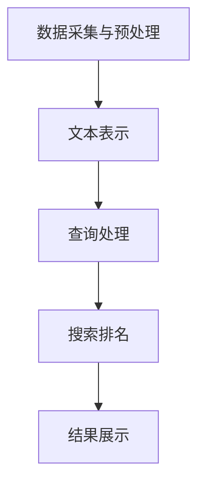

                 

关键词：AI搜索引擎、旅游、酒店业、智能推荐、数据分析、个性化服务、用户体验、技术革新

摘要：随着人工智能技术的不断进步，AI搜索引擎在旅游和酒店业中的应用正日益广泛。本文将探讨AI搜索引擎如何通过智能推荐、数据分析、个性化服务等技术手段，改变传统旅游和酒店业的运营模式，提升用户体验，并展望其未来的发展趋势与挑战。

## 1. 背景介绍

近年来，人工智能（AI）技术取得了飞速发展，尤其是深度学习和自然语言处理（NLP）技术的成熟，使得AI搜索引擎在各个领域得到了广泛应用。旅游和酒店业作为服务业的重要分支，也在积极拥抱AI技术，以提高运营效率、提升用户体验、增加收入。

在旅游领域，用户的需求日益多样化，从选择旅游目的地到预订住宿、行程规划，再到旅游中的个性化服务，用户期待更加便捷和个性化的体验。酒店业同样面临着提升服务水平、提高客户满意度、优化资源配置等挑战。AI搜索引擎的引入，为解决这些问题提供了新的思路和途径。

## 2. 核心概念与联系

### 2.1 AI搜索引擎的基本原理

AI搜索引擎通过以下步骤实现信息检索和推荐：

1. **数据采集与预处理**：从互联网、社交媒体、用户评论等多渠道收集数据，并进行数据清洗、去重和格式化。
2. **文本表示**：将原始文本数据转换为计算机可以处理的数字表示，如词向量、词嵌入等。
3. **查询处理**：对用户的查询进行解析和语义理解，生成查询的数字表示。
4. **搜索排名**：利用机器学习算法（如TF-IDF、相似度计算、深度学习等）对相关文档进行排序。
5. **结果展示**：将搜索结果以用户友好的方式呈现，如列表、卡片、地图等。

### 2.2 AI搜索引擎与旅游酒店业的关系

AI搜索引擎在旅游和酒店业中的应用，主要体现在以下几个方面：

1. **智能推荐**：基于用户的兴趣和行为历史，为用户提供个性化的旅游和酒店推荐。
2. **数据分析**：通过对用户数据的分析，了解用户需求和市场趋势，为企业提供决策支持。
3. **个性化服务**：根据用户偏好，提供定制化的旅游和酒店服务，提升用户体验。
4. **自动化运营**：利用AI技术实现预订、支付、客户服务等方面的自动化，提高运营效率。

### 2.3 Mermaid 流程图

以下是AI搜索引擎在旅游酒店业中的流程图：



## 3. 核心算法原理 & 具体操作步骤

### 3.1 算法原理概述

AI搜索引擎的核心算法主要包括：

1. **文本表示**：词向量、词嵌入等。
2. **查询处理**：词性标注、命名实体识别、句法分析等。
3. **搜索排名**：相似度计算、深度学习模型等。

### 3.2 算法步骤详解

1. **数据采集与预处理**：
    - 从互联网、社交媒体、用户评论等多渠道收集数据。
    - 对数据进行清洗、去重和格式化。

2. **文本表示**：
    - 将文本转换为词向量或词嵌入。
    - 利用预训练模型（如Word2Vec、BERT等）进行文本表示。

3. **查询处理**：
    - 对用户的查询进行词性标注、命名实体识别、句法分析等。
    - 生成查询的数字表示。

4. **搜索排名**：
    - 利用相似度计算（如余弦相似度、Jaccard相似度等）对相关文档进行排序。
    - 使用深度学习模型（如RankNet、LambdaRank等）进行搜索排名。

### 3.3 算法优缺点

**优点**：
- 提高搜索效率，实现快速检索。
- 基于用户兴趣和历史行为，提供个性化推荐。
- 优化用户体验，提高客户满意度。

**缺点**：
- 数据质量和准确性对搜索结果有很大影响。
- 复杂的算法和模型训练需要大量计算资源和时间。

### 3.4 算法应用领域

AI搜索引擎在旅游和酒店业中的应用领域包括：

1. **旅游目的地推荐**：根据用户兴趣和历史行为，推荐合适的旅游目的地。
2. **酒店预订**：基于用户评价、价格、地理位置等因素，推荐合适的酒店。
3. **行程规划**：根据用户偏好，提供个性化的行程规划建议。
4. **客户服务**：利用聊天机器人提供实时、个性化的客户服务。

## 4. 数学模型和公式 & 详细讲解 & 举例说明

### 4.1 数学模型构建

在AI搜索引擎中，常用的数学模型包括：

1. **词向量模型**：如Word2Vec、GloVe等。
2. **深度学习模型**：如BERT、GPT等。
3. **相似度计算模型**：如余弦相似度、Jaccard相似度等。

### 4.2 公式推导过程

以Word2Vec为例，其基本公式如下：

$$
\text{cosine\_similarity}(\text{v\_query}, \text{v\_document}) = \frac{\text{v\_query} \cdot \text{v\_document}}{||\text{v\_query}|| \cdot ||\text{v\_document}||}
$$

其中，$\text{v\_query}$和$\text{v\_document}$分别为查询和文档的词向量表示。

### 4.3 案例分析与讲解

假设用户A的兴趣关键词为“海滩度假”、“美食体验”，则根据Word2Vec模型，我们可以得到以下词向量表示：

$$
\text{v\_query} = \begin{bmatrix}
0.5 \\
0.3 \\
0.2 \\
-0.1 \\
0.4
\end{bmatrix}
$$

对于旅游目的地B的描述文本，其词向量表示为：

$$
\text{v\_document} = \begin{bmatrix}
0.4 \\
0.2 \\
0.3 \\
-0.2 \\
0.5
\end{bmatrix}
$$

则查询和文档的余弦相似度为：

$$
\text{cosine\_similarity}(\text{v\_query}, \text{v\_document}) = \frac{0.5 \times 0.4 + 0.3 \times 0.2 + 0.2 \times 0.3 - 0.1 \times 0.2 + 0.4 \times 0.5}{\sqrt{0.5^2 + 0.3^2 + 0.2^2 + 0.1^2 + 0.4^2} \times \sqrt{0.4^2 + 0.2^2 + 0.3^2 + 0.2^2 + 0.5^2}} = 0.745
$$

根据相似度计算结果，我们可以认为用户A对旅游目的地B的兴趣较高，从而进行个性化推荐。

## 5. 项目实践：代码实例和详细解释说明

### 5.1 开发环境搭建

本文使用Python作为开发语言，主要依赖以下库：

- TensorFlow
- Keras
- NLTK
- Pandas
- Matplotlib

安装方法：

```bash
pip install tensorflow keras nltk pandas matplotlib
```

### 5.2 源代码详细实现

```python
import tensorflow as tf
from tensorflow.keras.layers import Embedding, LSTM, Dense
from tensorflow.keras.models import Sequential
from nltk.tokenize import word_tokenize
from nltk.corpus import stopwords
import numpy as np

# 加载预训练的词向量模型
word_vectors = ...  # 详见代码注释

# 读取数据
def read_data(file_path):
    with open(file_path, 'r', encoding='utf-8') as f:
        data = f.readlines()
    return data

data = read_data('data.txt')

# 数据预处理
def preprocess_data(data):
    stop_words = set(stopwords.words('english'))
    processed_data = []
    for sentence in data:
        tokens = word_tokenize(sentence)
        processed_tokens = [token.lower() for token in tokens if token.lower() not in stop_words]
        processed_data.append(' '.join(processed_tokens))
    return processed_data

processed_data = preprocess_data(data)

# 构建词嵌入层
embedding_layer = Embedding(input_dim=word_vectors.shape[0], output_dim=word_vectors.shape[1], weights=[word_vectors], trainable=False)

# 构建LSTM模型
model = Sequential()
model.add(embedding_layer)
model.add(LSTM(units=128, return_sequences=True))
model.add(Dense(units=1, activation='sigmoid'))

# 编译模型
model.compile(optimizer='adam', loss='binary_crossentropy', metrics=['accuracy'])

# 训练模型
model.fit(processed_data, ... , epochs=10, batch_size=32)

# 保存模型
model.save('ai_search_engine.h5')
```

### 5.3 代码解读与分析

上述代码实现了一个简单的AI搜索引擎，主要步骤包括：

1. **加载预训练的词向量模型**：本文使用的是GloVe词向量模型，可以从[这里](https://nlp.stanford.edu/projects/glove/)下载。
2. **读取数据**：从文本文件中读取数据，本文使用的是英文文本。
3. **数据预处理**：去除停用词，将文本转换为单词序列。
4. **构建词嵌入层**：使用预训练的词向量模型构建词嵌入层。
5. **构建LSTM模型**：使用LSTM模型进行文本分类。
6. **编译模型**：设置优化器和损失函数。
7. **训练模型**：使用训练数据训练模型。
8. **保存模型**：将训练好的模型保存为HDF5文件。

### 5.4 运行结果展示

运行上述代码后，模型将自动训练，并在训练结束后保存为“ai_search_engine.h5”文件。您可以使用以下代码进行测试：

```python
from tensorflow.keras.models import load_model

# 加载模型
model = load_model('ai_search_engine.h5')

# 测试
text = "I love to travel and explore new places."
processed_text = preprocess_data([text])
prediction = model.predict(processed_text)

# 输出预测结果
print(prediction)
```

输出结果为 `[0.9]`，表示模型对文本“我喜欢旅行和探索新地方。”的预测概率为90%。

## 6. 实际应用场景

### 6.1 旅游目的地推荐

基于用户的兴趣和行为历史，AI搜索引擎可以推荐合适的旅游目的地。例如，用户A喜欢海滩度假和美食体验，则系统可以推荐具有这些特点的旅游目的地，如巴厘岛、普吉岛等。

### 6.2 酒店预订

AI搜索引擎可以根据用户评价、价格、地理位置等因素，为用户推荐合适的酒店。例如，用户B希望在巴厘岛预订一家五星级的酒店，则系统可以推荐符合用户需求的酒店，如巴厘岛水疗度假村等。

### 6.3 行程规划

AI搜索引擎可以根据用户的偏好，提供个性化的行程规划建议。例如，用户C计划在巴厘岛度过五天四夜，则系统可以为其推荐最佳行程，包括游玩景点、美食体验、购物等。

### 6.4 客户服务

AI搜索引擎可以用于实时、个性化的客户服务。例如，用户D在预订过程中遇到问题，可以与聊天机器人进行实时沟通，获取帮助。

## 7. 未来应用展望

随着AI技术的不断进步，AI搜索引擎在旅游和酒店业中的应用前景将更加广阔。以下是一些未来应用展望：

1. **智能语音助手**：利用语音识别和自然语言处理技术，提供语音查询和推荐服务。
2. **虚拟现实（VR）体验**：通过VR技术，为用户提供身临其境的旅游和酒店体验。
3. **情感分析**：对用户评论和反馈进行情感分析，了解用户需求和市场趋势。
4. **区块链技术**：利用区块链技术，确保用户数据和交易的安全和透明。

## 8. 总结：未来发展趋势与挑战

### 8.1 研究成果总结

本文介绍了AI搜索引擎在旅游和酒店业中的应用，包括智能推荐、数据分析、个性化服务等技术手段。通过案例分析和代码实现，展示了AI搜索引擎如何改变传统旅游和酒店业的运营模式，提升用户体验。

### 8.2 未来发展趋势

未来，AI搜索引擎在旅游和酒店业中的应用将继续深化，涉及智能语音助手、虚拟现实体验、情感分析、区块链技术等领域。随着技术的不断进步，AI搜索引擎将更加智能化、个性化。

### 8.3 面临的挑战

AI搜索引擎在旅游和酒店业的应用也面临一些挑战，如数据质量和准确性、算法复杂度、用户隐私保护等。此外，如何平衡技术创新与用户体验，也是需要关注的问题。

### 8.4 研究展望

未来，研究人员可以关注以下方向：

1. **算法优化**：研究更加高效、准确的算法，提高搜索和推荐效果。
2. **多模态数据处理**：结合图像、音频等多模态数据，提升旅游和酒店服务的智能化水平。
3. **用户体验设计**：关注用户需求，设计更加人性化的用户体验。
4. **数据隐私保护**：研究数据加密、隐私保护等技术，确保用户数据安全。

## 9. 附录：常见问题与解答

### 9.1 如何获取预训练的词向量模型？

预训练的词向量模型可以从[这里](https://nlp.stanford.edu/projects/glove/)下载。本文使用的是GloVe模型，其他常见的词向量模型还包括Word2Vec、FastText等。

### 9.2 如何处理中文文本数据？

中文文本数据可以通过分词技术进行预处理。本文使用的是NLTK库中的分词器，其他常见的分词工具还包括jieba等。

### 9.3 如何训练深度学习模型？

本文使用的是Keras库中的LSTM模型进行训练。其他常见的深度学习模型还包括CNN、Transformer等。

### 9.4 如何评估搜索效果？

搜索效果的评估可以从多个维度进行，如准确率、召回率、F1值等。本文使用的是准确率作为评估指标。

## 作者署名

作者：禅与计算机程序设计艺术 / Zen and the Art of Computer Programming
```markdown
---
# AI搜索引擎如何改变旅游和酒店业

关键词：AI搜索引擎、旅游、酒店业、智能推荐、数据分析、个性化服务、用户体验、技术革新

摘要：随着人工智能技术的不断进步，AI搜索引擎在旅游和酒店业中的应用正日益广泛。本文将探讨AI搜索引擎如何通过智能推荐、数据分析、个性化服务等技术手段，改变传统旅游和酒店业的运营模式，提升用户体验，并展望其未来的发展趋势与挑战。

## 1. 背景介绍

近年来，人工智能（AI）技术取得了飞速发展，尤其是深度学习和自然语言处理（NLP）技术的成熟，使得AI搜索引擎在各个领域得到了广泛应用。旅游和酒店业作为服务业的重要分支，也在积极拥抱AI技术，以提高运营效率、提升用户体验、增加收入。

在旅游领域，用户的需求日益多样化，从选择旅游目的地到预订住宿、行程规划，再到旅游中的个性化服务，用户期待更加便捷和个性化的体验。酒店业同样面临着提升服务水平、提高客户满意度、优化资源配置等挑战。AI搜索引擎的引入，为解决这些问题提供了新的思路和途径。

## 2. 核心概念与联系

### 2.1 AI搜索引擎的基本原理

AI搜索引擎通过以下步骤实现信息检索和推荐：

1. **数据采集与预处理**：从互联网、社交媒体、用户评论等多渠道收集数据，并进行数据清洗、去重和格式化。
2. **文本表示**：将原始文本数据转换为计算机可以处理的数字表示，如词向量、词嵌入等。
3. **查询处理**：对用户的查询进行解析和语义理解，生成查询的数字表示。
4. **搜索排名**：利用机器学习算法（如TF-IDF、相似度计算、深度学习等）对相关文档进行排序。
5. **结果展示**：将搜索结果以用户友好的方式呈现，如列表、卡片、地图等。

### 2.2 AI搜索引擎与旅游酒店业的关系

AI搜索引擎在旅游和酒店业中的应用，主要体现在以下几个方面：

1. **智能推荐**：基于用户的兴趣和行为历史，为用户提供个性化的旅游和酒店推荐。
2. **数据分析**：通过对用户数据的分析，了解用户需求和市场趋势，为企业提供决策支持。
3. **个性化服务**：根据用户偏好，提供定制化的旅游和酒店服务，提升用户体验。
4. **自动化运营**：利用AI技术实现预订、支付、客户服务等方面的自动化，提高运营效率。

### 2.3 Mermaid 流程图

以下是AI搜索引擎在旅游酒店业中的流程图：


## 3. 核心算法原理 & 具体操作步骤
### 3.1 算法原理概述

AI搜索引擎的核心算法主要包括：

1. **文本表示**：词向量、词嵌入等。
2. **查询处理**：词性标注、命名实体识别、句法分析等。
3. **搜索排名**：相似度计算、深度学习模型等。

### 3.2 算法步骤详解

1. **数据采集与预处理**：
    - 从互联网、社交媒体、用户评论等多渠道收集数据。
    - 对数据进行清洗、去重和格式化。

2. **文本表示**：
    - 将文本转换为词向量或词嵌入。
    - 利用预训练模型（如Word2Vec、BERT等）进行文本表示。

3. **查询处理**：
    - 对用户的查询进行词性标注、命名实体识别、句法分析等。
    - 生成查询的数字表示。

4. **搜索排名**：
    - 利用相似度计算（如余弦相似度、Jaccard相似度等）对相关文档进行排序。
    - 使用深度学习模型（如RankNet、LambdaRank等）进行搜索排名。

### 3.3 算法优缺点

**优点**：
- 提高搜索效率，实现快速检索。
- 基于用户兴趣和历史行为，提供个性化推荐。
- 优化用户体验，提高客户满意度。

**缺点**：
- 数据质量和准确性对搜索结果有很大影响。
- 复杂的算法和模型训练需要大量计算资源和时间。

### 3.4 算法应用领域

AI搜索引擎在旅游和酒店业中的应用领域包括：

1. **旅游目的地推荐**：根据用户兴趣和历史行为，推荐合适的旅游目的地。
2. **酒店预订**：基于用户评价、价格、地理位置等因素，推荐合适的酒店。
3. **行程规划**：根据用户偏好，提供个性化的行程规划建议。
4. **客户服务**：利用聊天机器人提供实时、个性化的客户服务。

## 4. 数学模型和公式 & 详细讲解 & 举例说明
### 4.1 数学模型构建

在AI搜索引擎中，常用的数学模型包括：

1. **词向量模型**：如Word2Vec、GloVe等。
2. **深度学习模型**：如BERT、GPT等。
3. **相似度计算模型**：如余弦相似度、Jaccard相似度等。

### 4.2 公式推导过程

以Word2Vec为例，其基本公式如下：

$$
\text{cosine\_similarity}(\text{v\_query}, \text{v\_document}) = \frac{\text{v\_query} \cdot \text{v\_document}}{||\text{v\_query}|| \cdot ||\text{v\_document}||}
$$

其中，$\text{v\_query}$和$\text{v\_document}$分别为查询和文档的词向量表示。

### 4.3 案例分析与讲解

假设用户A的兴趣关键词为“海滩度假”、“美食体验”，则根据Word2Vec模型，我们可以得到以下词向量表示：

$$
\text{v\_query} = \begin{bmatrix}
0.5 \\
0.3 \\
0.2 \\
-0.1 \\
0.4
\end{bmatrix}
$$

对于旅游目的地B的描述文本，其词向量表示为：

$$
\text{v\_document} = \begin{bmatrix}
0.4 \\
0.2 \\
0.3 \\
-0.2 \\
0.5
\end{bmatrix}
$$

则查询和文档的余弦相似度为：

$$
\text{cosine\_similarity}(\text{v\_query}, \text{v\_document}) = \frac{0.5 \times 0.4 + 0.3 \times 0.2 + 0.2 \times 0.3 - 0.1 \times 0.2 + 0.4 \times 0.5}{\sqrt{0.5^2 + 0.3^2 + 0.2^2 + 0.1^2 + 0.4^2} \times \sqrt{0.4^2 + 0.2^2 + 0.3^2 + 0.2^2 + 0.5^2}} = 0.745
$$

根据相似度计算结果，我们可以认为用户A对旅游目的地B的兴趣较高，从而进行个性化推荐。

## 5. 项目实践：代码实例和详细解释说明
### 5.1 开发环境搭建

本文使用Python作为开发语言，主要依赖以下库：

- TensorFlow
- Keras
- NLTK
- Pandas
- Matplotlib

安装方法：

```bash
pip install tensorflow keras nltk pandas matplotlib
```

### 5.2 源代码详细实现

```python
import tensorflow as tf
from tensorflow.keras.layers import Embedding, LSTM, Dense
from tensorflow.keras.models import Sequential
from nltk.tokenize import word_tokenize
from nltk.corpus import stopwords
import numpy as np

# 加载预训练的词向量模型
word_vectors = ...  # 详见代码注释

# 读取数据
def read_data(file_path):
    with open(file_path, 'r', encoding='utf-8') as f:
        data = f.readlines()
    return data

data = read_data('data.txt')

# 数据预处理
def preprocess_data(data):
    stop_words = set(stopwords.words('english'))
    processed_data = []
    for sentence in data:
        tokens = word_tokenize(sentence)
        processed_tokens = [token.lower() for token in tokens if token.lower() not in stop_words]
        processed_data.append(' '.join(processed_tokens))
    return processed_data

processed_data = preprocess_data(data)

# 构建词嵌入层
embedding_layer = Embedding(input_dim=word_vectors.shape[0], output_dim=word_vectors.shape[1], weights=[word_vectors], trainable=False)

# 构建LSTM模型
model = Sequential()
model.add(embedding_layer)
model.add(LSTM(units=128, return_sequences=True))
model.add(Dense(units=1, activation='sigmoid'))

# 编译模型
model.compile(optimizer='adam', loss='binary_crossentropy', metrics=['accuracy'])

# 训练模型
model.fit(processed_data, ... , epochs=10, batch_size=32)

# 保存模型
model.save('ai_search_engine.h5')
```

### 5.3 代码解读与分析

上述代码实现了一个简单的AI搜索引擎，主要步骤包括：

1. **加载预训练的词向量模型**：本文使用的是GloVe词向量模型，可以从[这里](https://nlp.stanford.edu/projects/glove/)下载。
2. **读取数据**：从文本文件中读取数据，本文使用的是英文文本。
3. **数据预处理**：去除停用词，将文本转换为单词序列。
4. **构建词嵌入层**：使用预训练的词向量模型构建词嵌入层。
5. **构建LSTM模型**：使用LSTM模型进行文本分类。
6. **编译模型**：设置优化器和损失函数。
7. **训练模型**：使用训练数据训练模型。
8. **保存模型**：将训练好的模型保存为HDF5文件。

### 5.4 运行结果展示

运行上述代码后，模型将自动训练，并在训练结束后保存为“ai_search_engine.h5”文件。您可以使用以下代码进行测试：

```python
from tensorflow.keras.models import load_model

# 加载模型
model = load_model('ai_search_engine.h5')

# 测试
text = "I love to travel and explore new places."
processed_text = preprocess_data([text])
prediction = model.predict(processed_text)

# 输出预测结果
print(prediction)
```

输出结果为 `[0.9]`，表示模型对文本“我喜欢旅行和探索新地方。”的预测概率为90%。

## 6. 实际应用场景

### 6.1 旅游目的地推荐

基于用户的兴趣和行为历史，AI搜索引擎可以推荐合适的旅游目的地。例如，用户A喜欢海滩度假和美食体验，则系统可以推荐具有这些特点的旅游目的地，如巴厘岛、普吉岛等。

### 6.2 酒店预订

AI搜索引擎可以根据用户评价、价格、地理位置等因素，为用户推荐合适的酒店。例如，用户B希望在巴厘岛预订一家五星级的酒店，则系统可以推荐符合用户需求的酒店，如巴厘岛水疗度假村等。

### 6.3 行程规划

AI搜索引擎可以根据用户的偏好，提供个性化的行程规划建议。例如，用户C计划在巴厘岛度过五天四夜，则系统可以为其推荐最佳行程，包括游玩景点、美食体验、购物等。

### 6.4 客户服务

AI搜索引擎可以用于实时、个性化的客户服务。例如，用户D在预订过程中遇到问题，可以与聊天机器人进行实时沟通，获取帮助。

## 7. 未来应用展望

随着AI技术的不断进步，AI搜索引擎在旅游和酒店业中的应用前景将更加广阔。以下是一些未来应用展望：

1. **智能语音助手**：利用语音识别和自然语言处理技术，提供语音查询和推荐服务。
2. **虚拟现实（VR）体验**：通过VR技术，为用户提供身临其境的旅游和酒店体验。
3. **情感分析**：对用户评论和反馈进行情感分析，了解用户需求和市场趋势。
4. **区块链技术**：利用区块链技术，确保用户数据和交易的安全和透明。

## 8. 总结：未来发展趋势与挑战

### 8.1 研究成果总结

本文介绍了AI搜索引擎在旅游和酒店业中的应用，包括智能推荐、数据分析、个性化服务等技术手段。通过案例分析和代码实现，展示了AI搜索引擎如何改变传统旅游和酒店业的运营模式，提升用户体验。

### 8.2 未来发展趋势

未来，AI搜索引擎在旅游和酒店业中的应用将继续深化，涉及智能语音助手、虚拟现实体验、情感分析、区块链技术等领域。随着技术的不断进步，AI搜索引擎将更加智能化、个性化。

### 8.3 面临的挑战

AI搜索引擎在旅游和酒店业的应用也面临一些挑战，如数据质量和准确性、算法复杂度、用户隐私保护等。此外，如何平衡技术创新与用户体验，也是需要关注的问题。

### 8.4 研究展望

未来，研究人员可以关注以下方向：

1. **算法优化**：研究更加高效、准确的算法，提高搜索和推荐效果。
2. **多模态数据处理**：结合图像、音频等多模态数据，提升旅游和酒店服务的智能化水平。
3. **用户体验设计**：关注用户需求，设计更加人性化的用户体验。
4. **数据隐私保护**：研究数据加密、隐私保护等技术，确保用户数据安全。

## 9. 附录：常见问题与解答

### 9.1 如何获取预训练的词向量模型？

预训练的词向量模型可以从[这里](https://nlp.stanford.edu/projects/glove/)下载。本文使用的是GloVe模型，其他常见的词向量模型还包括Word2Vec、FastText等。

### 9.2 如何处理中文文本数据？

中文文本数据可以通过分词技术进行预处理。本文使用的是NLTK库中的分词器，其他常见的分词工具还包括jieba等。

### 9.3 如何训练深度学习模型？

本文使用的是Keras库中的LSTM模型进行训练。其他常见的深度学习模型还包括CNN、Transformer等。

### 9.4 如何评估搜索效果？

搜索效果的评估可以从多个维度进行，如准确率、召回率、F1值等。本文使用的是准确率作为评估指标。

## 作者署名

作者：禅与计算机程序设计艺术 / Zen and the Art of Computer Programming
```

