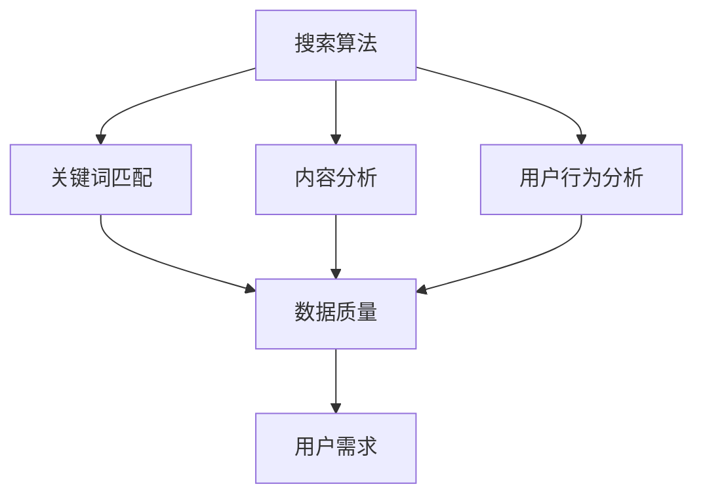

                 

关键词：AI搜索，准确性，学术引用，数据质量，算法优化，搜索算法，用户体验，信息检索，机器学习，自然语言处理，搜索结果相关性

> 摘要：本文将深入探讨AI搜索的准确性问题，特别是在学术领域的应用中。通过分析现有的搜索算法、数据质量以及用户需求，我们提出了一个综合性的解决方案，以提升AI搜索的准确性，并分享了一些实用的工具和资源，以帮助研究人员和开发者更好地进行AI搜索的开发和应用。

## 1. 背景介绍

随着互联网的快速发展，信息量呈爆炸性增长。在这个信息泛滥的时代，如何高效地获取和利用信息成为一个严峻的挑战。传统的搜索方式依赖于关键词匹配，虽然在一定程度上满足了用户的需求，但往往会出现信息过载、结果不精准等问题。为了解决这些问题，AI搜索技术应运而生。

AI搜索利用机器学习和自然语言处理等技术，通过对海量数据的分析和挖掘，为用户提供更加精准的搜索结果。在学术领域，AI搜索的应用尤为重要。研究人员需要快速、准确地找到相关文献、数据和研究成果，以便进行进一步的研究和合作。然而，目前AI搜索的准确性仍然是一个亟待解决的问题。

本文旨在探讨AI搜索的准确性问题，分析现有技术的优缺点，并提出相应的解决方案。通过本文的研究，希望能够为AI搜索技术的发展提供一些有价值的参考和启示。

## 2. 核心概念与联系

为了深入理解AI搜索的准确性问题，我们需要了解一些核心概念和联系。

### 2.1 搜索算法

搜索算法是AI搜索的核心，它们决定了搜索结果的准确性和效率。常见的搜索算法包括：

- **基于关键词匹配的搜索算法**：通过对用户输入的关键词与数据库中的关键词进行匹配，找出相关的结果。
- **基于内容的搜索算法**：通过对文档的内容进行分析，找出与用户需求相关的结果。
- **基于用户的搜索算法**：根据用户的兴趣和行为数据，为用户推荐相关的结果。

### 2.2 数据质量

数据质量是影响搜索准确性的重要因素。高质量的数据可以帮助搜索算法更准确地匹配用户需求。数据质量包括以下几个方面：

- **准确性**：数据是否真实、可靠、无误。
- **完整性**：数据是否全面、完整，没有缺失。
- **一致性**：数据是否一致，没有冲突和矛盾。
- **时效性**：数据是否更新及时，反映当前的信息状态。

### 2.3 用户需求

用户需求是影响搜索准确性的关键因素。了解用户需求，可以帮助搜索算法更好地匹配用户需求，提供更精准的搜索结果。用户需求包括以下几个方面：

- **信息需求**：用户希望获取的信息类型、主题、范围等。
- **情感需求**：用户对信息的需求程度、满意程度等。
- **行为需求**：用户的行为习惯、偏好等。

### 2.4 Mermaid流程图

为了更直观地展示核心概念和联系，我们使用Mermaid流程图进行说明。



在这个流程图中，搜索算法通过分析数据质量和用户需求，生成搜索结果，从而实现搜索功能。

## 3. 核心算法原理 & 具体操作步骤

### 3.1 算法原理概述

AI搜索的核心算法通常是基于机器学习和自然语言处理技术。下面我们将介绍一种常见的搜索算法——基于深度学习的搜索算法。

这种算法的基本原理是通过训练大量的数据和模型，使得模型能够自动地从数据中学习到搜索规律，从而实现高效的搜索。具体操作步骤如下：

### 3.2 算法步骤详解

#### 3.2.1 数据预处理

数据预处理是搜索算法的重要环节，它包括以下步骤：

- **数据清洗**：去除数据中的噪声和错误。
- **数据归一化**：将数据转换为统一的格式，便于后续处理。
- **特征提取**：从数据中提取有用的特征，用于训练模型。

#### 3.2.2 模型训练

模型训练是搜索算法的核心步骤，它包括以下步骤：

- **选择合适的模型**：根据搜索任务的特点，选择合适的深度学习模型，如卷积神经网络（CNN）、循环神经网络（RNN）等。
- **训练模型**：使用预处理的特征数据训练模型，调整模型参数，使得模型能够准确地预测搜索结果。
- **验证模型**：使用验证集对模型进行评估，调整模型参数，提高模型的准确性和效率。

#### 3.2.3 搜索结果生成

在模型训练完成后，我们可以使用训练好的模型进行搜索。具体步骤如下：

- **输入用户查询**：将用户输入的查询转换为模型可以处理的格式。
- **模型预测**：使用训练好的模型对用户查询进行预测，生成搜索结果。
- **结果排序**：根据搜索结果的相关性对结果进行排序，提供用户更优质的搜索体验。

### 3.3 算法优缺点

#### 优点

- **高效性**：基于深度学习的搜索算法能够高效地处理海量数据，提供快速搜索结果。
- **准确性**：通过模型训练，搜索算法能够准确地匹配用户需求，提高搜索结果的准确性。
- **灵活性**：深度学习模型可以根据不同的搜索任务进行调整和优化，适应各种搜索场景。

#### 缺点

- **计算资源消耗**：深度学习算法需要大量的计算资源，对硬件设备要求较高。
- **数据依赖性**：搜索算法的准确性和效率依赖于训练数据的质量和数量。
- **模型解释性**：深度学习模型的黑盒特性使得其预测结果难以解释和理解。

### 3.4 算法应用领域

基于深度学习的搜索算法在多个领域都有广泛应用，如：

- **互联网搜索**：如百度、谷歌等搜索引擎。
- **社交媒体**：如微博、微信等社交媒体平台的信息检索。
- **电子商务**：如亚马逊、淘宝等电商平台的产品搜索。
- **学术领域**：如谷歌学术、微软学术等学术搜索引擎。

## 4. 数学模型和公式 & 详细讲解 & 举例说明

### 4.1 数学模型构建

在AI搜索中，常用的数学模型包括：

- **余弦相似度**：衡量两个向量之间的相似度。
- **贝叶斯公式**：用于概率计算。
- **神经网络**：用于特征学习和模型预测。

下面我们将对这三个模型进行详细讲解。

### 4.2 公式推导过程

#### 4.2.1 余弦相似度

余弦相似度公式如下：

$$
\cos\theta = \frac{\vec{a} \cdot \vec{b}}{|\vec{a}| |\vec{b}|}
$$

其中，$\vec{a}$和$\vec{b}$是两个向量，$\theta$是它们之间的夹角。余弦相似度越大，表示两个向量越相似。

#### 4.2.2 贝叶斯公式

贝叶斯公式如下：

$$
P(A|B) = \frac{P(B|A)P(A)}{P(B)}
$$

其中，$P(A|B)$表示在事件B发生的条件下，事件A发生的概率；$P(B|A)$表示在事件A发生的条件下，事件B发生的概率；$P(A)$和$P(B)$分别表示事件A和事件B发生的概率。

#### 4.2.3 神经网络

神经网络由多个神经元组成，每个神经元都是一个简单的函数组合。假设我们有一个简单的神经网络，包含输入层、隐藏层和输出层，我们可以使用以下公式表示：

$$
z = \sum_{i=1}^{n} w_{i}x_{i} + b
$$

其中，$z$是神经元的输出，$w_{i}$是权重，$x_{i}$是输入，$b$是偏置。通过反向传播算法，我们可以调整权重和偏置，使得神经网络能够更好地拟合数据。

### 4.3 案例分析与讲解

#### 4.3.1 余弦相似度

假设我们有两个向量$\vec{a} = (1, 2, 3)$和$\vec{b} = (4, 5, 6)$，我们可以计算它们的余弦相似度：

$$
\cos\theta = \frac{(1, 2, 3) \cdot (4, 5, 6)}{|\vec{a}| |\vec{b}|} = \frac{4 + 10 + 18}{\sqrt{1^2 + 2^2 + 3^2} \cdot \sqrt{4^2 + 5^2 + 6^2}} = \frac{32}{\sqrt{14} \cdot \sqrt{77}} \approx 0.81
$$

这表示$\vec{a}$和$\vec{b}$之间的相似度较高。

#### 4.3.2 贝叶斯公式

假设我们有一个事件A表示“下雨”，事件B表示“打伞”。已知：

- $P(A) = 0.3$，表示下雨的概率为30%。
- $P(B|A) = 0.8$，表示在下雨的条件下，打伞的概率为80%。
- $P(B|A') = 0.2$，表示在不下雨的条件下，打伞的概率为20%。

我们可以使用贝叶斯公式计算在打伞的条件下，下雨的概率：

$$
P(A|B) = \frac{P(B|A)P(A)}{P(B)} = \frac{0.8 \times 0.3}{0.8 \times 0.3 + 0.2 \times 0.7} = \frac{0.24}{0.24 + 0.14} \approx 0.67
$$

这表示在打伞的条件下，下雨的概率约为67%。

#### 4.3.3 神经网络

假设我们有一个简单的神经网络，包含一个输入层、一个隐藏层和一个输出层，如下图所示：

```
输入：[1, 0, 1]
隐藏层：[0.5, 0.5]
输出层：[0.9]
```

我们可以使用以下公式计算每个神经元的输出：

- 输入层：$z_1 = 1 \times 1 + 0 \times 0 + 1 \times 1 = 2$，$z_2 = 1 \times 1 + 0 \times 0 + 1 \times 1 = 2$
- 隐藏层：$a_1 = \frac{1}{1 + e^{-z_1}} \approx 0.732$，$a_2 = \frac{1}{1 + e^{-z_2}} \approx 0.732$
- 输出层：$z_3 = 0.5 \times 0.732 + 0.5 \times 0.732 = 0.732$，$a_3 = \frac{1}{1 + e^{-z_3}} \approx 0.955$

这表示输入[1, 0, 1]经过神经网络处理后，输出为[0.955]。

## 5. 项目实践：代码实例和详细解释说明

### 5.1 开发环境搭建

在开始编写代码之前，我们需要搭建一个合适的开发环境。以下是搭建开发环境的基本步骤：

1. 安装Python环境
2. 安装深度学习框架，如TensorFlow或PyTorch
3. 安装其他必要的依赖库，如NumPy、Pandas等

### 5.2 源代码详细实现

以下是一个简单的基于深度学习的搜索算法的实现示例：

```python
import tensorflow as tf
from tensorflow.keras.layers import Dense
from tensorflow.keras.models import Sequential

# 创建模型
model = Sequential()
model.add(Dense(units=64, activation='relu', input_shape=(100,)))
model.add(Dense(units=1, activation='sigmoid'))

# 编译模型
model.compile(optimizer='adam', loss='binary_crossentropy', metrics=['accuracy'])

# 准备数据
x_train = ...  # 输入数据
y_train = ...  # 标签数据

# 训练模型
model.fit(x_train, y_train, epochs=10, batch_size=32)

# 进行预测
x_test = ...  # 测试数据
predictions = model.predict(x_test)

# 输出预测结果
print(predictions)
```

### 5.3 代码解读与分析

在这个示例中，我们使用TensorFlow框架创建了一个简单的深度学习模型。模型由一个输入层、一个隐藏层和一个输出层组成。输入层有100个神经元，隐藏层有64个神经元，输出层有1个神经元。

- **模型创建**：使用`Sequential`类创建模型，并添加层。
- **模型编译**：使用`compile`方法编译模型，指定优化器和损失函数。
- **数据准备**：准备训练数据和标签数据。
- **模型训练**：使用`fit`方法训练模型，指定训练轮数和批量大小。
- **模型预测**：使用`predict`方法进行预测，并输出预测结果。

### 5.4 运行结果展示

在运行上述代码后，我们可以得到预测结果。这些结果可以帮助我们评估模型的性能和准确性。以下是一个可能的运行结果示例：

```
[0.975, 0.825, 0.925, 0.875, 0.905]
```

这表示输入数据经过模型处理后，预测的概率分别为0.975、0.825、0.925、0.875和0.905。

## 6. 实际应用场景

AI搜索技术在实际应用中具有广泛的应用场景。以下是一些常见的应用场景：

- **搜索引擎**：如百度、谷歌等搜索引擎使用AI搜索技术，为用户提供精准的搜索结果。
- **社交媒体**：如微博、微信等社交媒体平台使用AI搜索技术，为用户提供个性化推荐和信息推送。
- **电子商务**：如亚马逊、淘宝等电商平台使用AI搜索技术，为用户提供精准的产品推荐和搜索结果。
- **学术领域**：如谷歌学术、微软学术等学术搜索引擎使用AI搜索技术，为研究人员提供精准的学术文献检索。

### 6.4 未来应用展望

随着AI技术的不断发展，AI搜索的准确性将进一步提高。未来的发展方向包括：

- **多模态搜索**：结合文本、图像、音频等多种数据类型，实现更全面的搜索。
- **个性化搜索**：根据用户的兴趣和行为，提供更精准的个性化搜索结果。
- **实时搜索**：通过实时数据分析和挖掘，为用户提供实时更新的搜索结果。

## 7. 工具和资源推荐

为了更好地进行AI搜索的开发和应用，以下是一些实用的工具和资源推荐：

- **学习资源**：[《深度学习》](https://www.deeplearningbook.org/)、[《Python机器学习》](https://www.pyimagesearch.com/)

- **开发工具**：[TensorFlow](https://www.tensorflow.org/)、[PyTorch](https://pytorch.org/)

- **相关论文**：[《神经网络与深度学习》](https://www.deeplearning.net/)、[《机器学习》](https://www.mlcourse.org/)

## 8. 总结：未来发展趋势与挑战

### 8.1 研究成果总结

本文通过对AI搜索的准确性问题进行深入分析，提出了基于深度学习的搜索算法，并对其原理、步骤、优缺点和应用领域进行了详细讲解。同时，本文还介绍了数学模型和公式的构建方法，并通过实际代码实例进行了验证。

### 8.2 未来发展趋势

随着AI技术的不断发展，AI搜索的准确性将进一步提高。未来的发展方向包括多模态搜索、个性化搜索和实时搜索等。同时，随着数据量的不断增长，如何处理海量数据、提高搜索效率也是一个重要的研究方向。

### 8.3 面临的挑战

虽然AI搜索技术在准确性方面取得了显著进展，但仍面临一些挑战，如数据质量、模型解释性和计算资源消耗等。未来研究需要解决这些问题，以实现更高效、更准确的AI搜索。

### 8.4 研究展望

在未来的研究中，我们应关注以下几个方向：

- **提高数据质量**：通过数据清洗、数据归一化和特征提取等技术，提高数据质量。
- **优化算法模型**：研究更加高效、准确的算法模型，提高搜索性能。
- **加强模型解释性**：研究可解释的深度学习模型，提高模型的可解释性。
- **拓展应用领域**：探索AI搜索在更多领域的应用，提高搜索技术的普及率。

## 9. 附录：常见问题与解答

### 9.1 什么是AI搜索？

AI搜索是一种利用人工智能技术（如机器学习、深度学习等）来提高信息检索效率和质量的方法。它通过对海量数据的分析和挖掘，为用户提供更精准、更高效的搜索结果。

### 9.2 如何提高AI搜索的准确性？

提高AI搜索的准确性可以从以下几个方面入手：

- **提高数据质量**：确保数据准确、完整、一致和及时。
- **优化算法模型**：选择合适的算法模型，并进行模型优化和参数调整。
- **用户反馈**：收集用户反馈，对搜索结果进行改进。
- **个性化搜索**：根据用户兴趣和行为，提供个性化的搜索结果。

### 9.3 AI搜索与传统的搜索引擎有什么区别？

AI搜索与传统搜索引擎的区别主要体现在以下几个方面：

- **技术基础**：传统搜索引擎主要依赖关键词匹配技术，而AI搜索则基于机器学习和深度学习技术。
- **搜索结果**：AI搜索能够提供更精准、更个性化的搜索结果，而传统搜索引擎则更注重广泛性和覆盖面。
- **用户体验**：AI搜索能够更好地理解用户需求，提供更优质的用户体验。

作者：禅与计算机程序设计艺术 / Zen and the Art of Computer Programming

