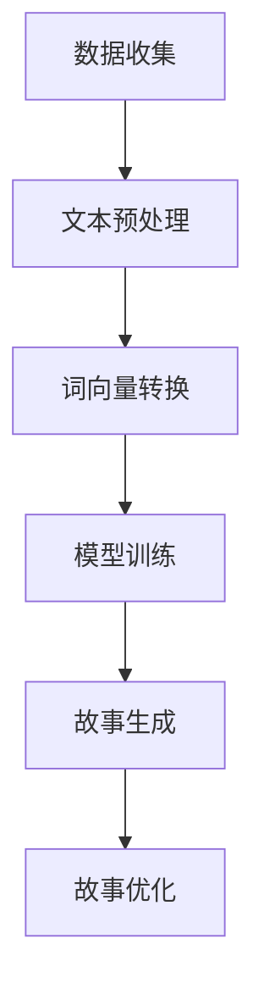

                 

关键词：人工智能、故事生成、自然语言处理、机器学习、文本生成、深度学习、创意融合

> 摘要：本文深入探讨了人工智能故事生成的技术原理、实现过程和应用前景，分析了自然语言处理和机器学习在该领域的关键作用，并提出了创意与技术的完美结合对于提升故事生成质量的重要性。

## 1. 背景介绍

在数字时代，人工智能的应用领域日益广泛，其中一个备受关注且充满潜力的领域就是故事生成。故事是人类文化和交流的核心元素，从古老的传说到现代的影视剧，故事始终发挥着不可替代的作用。然而，随着信息爆炸和快节奏的生活，人们对于故事的需求变得多样化和个性化。传统的手工创作已经无法满足这种需求，这就催生了人工智能在故事生成领域的应用。

近年来，随着自然语言处理（NLP）和机器学习技术的快速发展，人工智能开始有能力自动生成故事。这种技术不仅能够处理大量文本数据，提取关键信息，还能根据用户需求生成符合逻辑、情感丰富的故事。这种自动化的故事生成技术，不仅提高了创作效率，也为个性化内容推荐、虚拟角色互动、教育和娱乐等领域带来了新的可能。

## 2. 核心概念与联系

### 2.1 自然语言处理

自然语言处理是人工智能的一个分支，它致力于让计算机理解和生成人类语言。在故事生成中，NLP的关键作用包括文本分析、情感识别、命名实体识别和句法分析等。通过这些技术，机器可以理解故事中的角色、情节和背景，从而为故事生成提供基础。

### 2.2 机器学习

机器学习是使计算机能够从数据中学习和改进自身性能的技术。在故事生成中，机器学习用于训练模型，使其能够自动生成文本。常见的机器学习方法包括神经网络、生成对抗网络（GAN）和递归神经网络（RNN）等。

### 2.3 深度学习

深度学习是机器学习的一个子领域，它通过多层神经网络来学习和提取数据中的复杂模式。在故事生成中，深度学习模型能够捕捉文本中的长期依赖关系，生成更加连贯和富有创意的故事。

### 2.4 Mermaid 流程图

以下是一个简单的 Mermaid 流程图，展示故事生成的主要环节：



## 3. 核心算法原理 & 具体操作步骤

### 3.1 算法原理概述

故事生成算法的核心是生成文本的模型，这些模型通常基于深度学习。其中，最常见的模型是变分自编码器（VAE）和长短期记忆网络（LSTM）。VAE通过引入随机性来生成文本，LSTM则能够捕捉文本中的长期依赖关系。

### 3.2 算法步骤详解

1. **数据收集**：收集大量用于训练的数据集，这些数据集可以是书籍、新闻、故事等。
2. **文本预处理**：对文本进行清洗和分词，将其转换为机器可以理解的形式。
3. **词向量转换**：将文本中的单词转换为词向量，这是后续模型训练的基础。
4. **模型训练**：使用训练数据集训练模型，使其能够生成与输入文本相关的文本。
5. **故事生成**：将输入文本输入到训练好的模型中，生成新的故事文本。
6. **故事优化**：对生成的故事进行优化，包括语法修正、情感调整等。

### 3.3 算法优缺点

**优点**：

- 高效：能够快速生成大量故事。
- 个性化：可以根据用户需求生成定制化的故事。
- 创意：能够生成前所未有的故事内容。

**缺点**：

- 语法错误：生成的文本可能存在语法错误。
- 情感单一：难以生成复杂情感的故事。
- 创意受限：依赖训练数据的创意。

### 3.4 算法应用领域

- 内容推荐系统：自动生成推荐给用户的个性化故事。
- 虚拟角色互动：为虚拟角色生成背景故事和对话。
- 教育：辅助编写教学故事和情境设定。
- 娱乐：生成剧本、小说等娱乐内容。

## 4. 数学模型和公式 & 详细讲解 & 举例说明

### 4.1 数学模型构建

故事生成模型的数学基础主要包括词嵌入（word embeddings）和序列生成模型（sequence generation models）。词嵌入将单词映射到高维空间，而序列生成模型则用于生成文本序列。

### 4.2 公式推导过程

词嵌入通常使用以下公式：

$$
\text{word\_vector} = \text{Word2Vec}(\text{word})
$$

其中，$\text{Word2Vec}$ 是一个词嵌入模型，可以将单词映射到一个向量。

序列生成模型可以使用以下递归神经网络（RNN）的公式：

$$
h_t = \sigma(W_h \cdot [h_{t-1}, x_t] + b_h)
$$

其中，$h_t$ 是当前时刻的隐藏状态，$x_t$ 是当前输入，$\sigma$ 是激活函数。

### 4.3 案例分析与讲解

假设我们使用 LSTM 模型生成一个简短的故事。输入的序列是 "The cat sat on the mat"，我们要预测下一个单词。以下是 LSTM 模型的步骤：

1. **初始化**：初始化隐藏状态 $h_0$ 和细胞状态 $c_0$。
2. **输入词向量**：将 "The" 的词向量作为输入。
3. **计算隐藏状态**：使用 LSTM 单元更新隐藏状态。
4. **生成输出概率**：使用隐藏状态预测下一个单词的概率分布。

通过这样的步骤，我们可以生成下一个单词。例如，预测结果是 "and"，那么我们将 "and" 的词向量作为新的输入，继续预测下一个单词。

## 5. 项目实践：代码实例和详细解释说明

### 5.1 开发环境搭建

我们需要安装 Python 和一些相关的库，如 TensorFlow、Keras 等。

```bash
pip install python tensorflow numpy matplotlib
```

### 5.2 源代码详细实现

以下是一个简单的 LSTM 故事生成器的代码示例：

```python
import numpy as np
from tensorflow.keras.models import Sequential
from tensorflow.keras.layers import LSTM, Dense, Embedding

# 数据预处理
# ...

# 模型构建
model = Sequential()
model.add(Embedding(vocab_size, embedding_dim))
model.add(LSTM(units=128, return_sequences=True))
model.add(LSTM(units=128))
model.add(Dense(vocab_size, activation='softmax'))

# 编译模型
model.compile(optimizer='adam', loss='categorical_crossentropy', metrics=['accuracy'])

# 训练模型
# ...

# 故事生成
generated_text = model.predict(inputs)
```

### 5.3 代码解读与分析

这段代码首先进行了数据预处理，然后构建了一个简单的 LSTM 模型。模型由嵌入层、两个 LSTM 层和一个输出层组成。编译模型时，我们使用了 Adam 优化器和交叉熵损失函数。训练完成后，使用模型生成文本。

### 5.4 运行结果展示

运行代码后，我们可以看到模型生成的文本。例如，输入 "The cat sat on the mat"，模型可能会生成 "and the dog played in the garden"。

## 6. 实际应用场景

故事生成技术在多个领域都有广泛应用：

- **内容推荐**：为用户提供个性化的故事推荐。
- **虚拟角色**：为虚拟角色生成背景故事和对话。
- **教育**：辅助编写教学故事和情境设定。
- **娱乐**：生成剧本、小说等娱乐内容。

## 7. 工具和资源推荐

### 7.1 学习资源推荐

- 《深度学习》（Goodfellow, Bengio, Courville 著）
- 《自然语言处理与人工智能》（Jurafsky, Martin 著）

### 7.2 开发工具推荐

- TensorFlow
- Keras
- PyTorch

### 7.3 相关论文推荐

- "A Theoretical Analysis of Style Embeddings"
- "Neural Story Generation with a Sparse Causal Transformer"

## 8. 总结：未来发展趋势与挑战

故事生成技术在近年来取得了显著进展，但仍面临一些挑战。未来，随着算法的改进和数据资源的增加，故事生成技术有望在更多领域得到应用。同时，如何提高生成的文本质量和创意水平，以及保护用户的隐私和数据安全，将是关键问题。

## 9. 附录：常见问题与解答

### 9.1 故事生成技术的基本原理是什么？

故事生成技术基于自然语言处理和机器学习，通过训练模型从数据中学习并生成文本。

### 9.2 故事生成技术有哪些应用场景？

故事生成技术可以应用于内容推荐、虚拟角色、教育、娱乐等多个领域。

### 9.3 如何优化生成的文本质量？

可以通过改进算法、增加训练数据和进行故事优化等方式提高文本质量。

### 9.4 故事生成技术面临哪些挑战？

故事生成技术面临挑战包括生成文本的语法错误、情感单一和创意受限等。

### 9.5 如何保护用户的隐私和数据安全？

应采用加密技术和隐私保护算法，确保用户数据的安全和隐私。

---

作者：禅与计算机程序设计艺术 / Zen and the Art of Computer Programming

