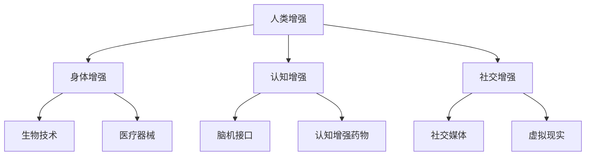

                 

关键词：人工智能、人类增强、道德伦理、身体增强、未来趋势

摘要：本文旨在探讨人工智能（AI）时代下人类增强的道德考虑以及身体增强技术的未来发展趋势。文章首先介绍了人类增强的定义及其在AI时代的重要性，接着分析了道德伦理在人类增强中的关键作用，并探讨了身体增强技术的现状与挑战。随后，文章提出了对人类增强未来发展机遇的预测，并讨论了相关趋势和面临的挑战。最后，文章总结了研究成果，展望了未来研究的方向和可能的解决方案。

## 1. 背景介绍

随着人工智能技术的快速发展，人类已经进入了AI时代。人工智能不仅在许多领域取得了显著的成就，还逐渐渗透到日常生活中，改变了人类的生活方式和工作方式。在这个背景下，人类增强成为一个热门话题。人类增强（Human Enhancement）指的是通过科技手段，提升人类在生理、心理和社会等方面的能力，使其超越自然界限。

人类增强技术的发展不仅可以提高个人的生活质量，还可以推动社会进步和经济发展。然而，随着增强技术的普及，也带来了一系列道德伦理问题，如隐私、安全、平等和社会公平等。因此，在AI时代探讨人类增强的道德考虑具有重要意义。

## 2. 核心概念与联系

### 2.1 人类增强的定义

人类增强是指通过科技手段，提升人类在生理、心理和社会等方面的能力。这种增强可以是暂时的，也可以是永久的，其目的在于提高个体的生活质量和社会竞争力。

### 2.2 人类增强的类型

根据增强的对象，人类增强可以分为以下几类：

- **身体增强**：通过生物技术、医疗器械等手段，增强人体的生理功能，如提高视力、增强体力等。
- **认知增强**：通过脑机接口、认知增强药物等手段，增强人类的认知能力，如提高记忆力、决策能力等。
- **社交增强**：通过社交媒体、虚拟现实等手段，增强人类的社交能力，如扩展社交网络、提高沟通效果等。

### 2.3 人类增强与AI的联系

人工智能在人类增强中扮演着重要角色。首先，AI技术可以提供智能化的辅助，如智能眼镜、智能手表等，帮助人们更高效地完成任务。其次，AI可以用于开发新的增强技术，如脑机接口、基因编辑等。最后，AI还可以用于研究和评估人类增强的效果，为决策提供科学依据。

### 2.4 人类增强的 Mermaid 流程图



## 3. 核心算法原理 & 具体操作步骤

### 3.1 算法原理概述

人类增强技术的核心在于对生物体进行精确的控制和调节。这通常涉及到以下几个步骤：

- **生物信息的采集**：通过传感器、基因检测等技术，获取生物体的相关信息。
- **数据分析和处理**：利用人工智能算法，对采集到的生物信息进行数据分析和处理，提取有用的信息。
- **生物体的调节**：根据分析结果，利用生物技术、医疗器械等手段，对生物体进行调节和增强。

### 3.2 算法步骤详解

1. **生物信息的采集**：
   - **传感器**：用于监测生物体的生理参数，如心率、血压、血糖等。
   - **基因检测**：通过DNA测序等技术，获取个体的基因信息。

2. **数据分析和处理**：
   - **机器学习算法**：用于对采集到的数据进行模式识别、分类和预测。
   - **深度学习模型**：用于处理复杂的数据，如图像、声音等。

3. **生物体的调节**：
   - **生物技术**：如基因编辑、干细胞治疗等，用于修复或增强生物体的功能。
   - **医疗器械**：如人工器官、植入式设备等，用于替代或增强生物体的功能。

### 3.3 算法优缺点

**优点**：
- **提高生活质量**：通过增强人类的生理、心理和社会能力，提高个体的生活质量。
- **推动科技进步**：为研究和开发新的生物技术、人工智能技术提供契机。

**缺点**：
- **道德伦理问题**：如隐私、安全、公平等。
- **技术风险**：如基因编辑的不确定性和医疗器械的潜在风险。

### 3.4 算法应用领域

- **医疗健康**：如基因编辑、个性化治疗、远程医疗等。
- **教育**：如智能辅导、在线教育等。
- **军事**：如增强士兵的体能和智力。
- **娱乐**：如虚拟现实、增强现实等。

## 4. 数学模型和公式 & 详细讲解 & 举例说明

### 4.1 数学模型构建

人类增强技术的数学模型通常涉及到以下方面：

- **生物信息的采集**：如生理参数的测量、基因信息的提取等。
- **数据分析和处理**：如机器学习算法、深度学习模型等。
- **生物体的调节**：如基因编辑、医疗器械的调节等。

### 4.2 公式推导过程

以基因编辑为例，其数学模型可以表示为：

$$
X = f(G)
$$

其中，$X$ 表示基因编辑后的性状，$G$ 表示基因信息，$f$ 表示基因编辑函数。

### 4.3 案例分析与讲解

以人工智能辅助的医疗诊断为例，其数学模型可以表示为：

$$
P(D|A) = \frac{P(A|D) \cdot P(D)}{P(A)}
$$

其中，$P(D|A)$ 表示在AI辅助下诊断出疾病D的概率，$P(A|D)$ 表示在疾病D发生时AI辅助诊断出A的概率，$P(D)$ 表示疾病D发生的概率，$P(A)$ 表示AI辅助诊断出A的概率。

### 4.4 案例分析与讲解

以人工智能辅助的医疗诊断为例，其数学模型可以表示为：

$$
P(D|A) = \frac{P(A|D) \cdot P(D)}{P(A)}
$$

其中，$P(D|A)$ 表示在AI辅助下诊断出疾病D的概率，$P(A|D)$ 表示在疾病D发生时AI辅助诊断出A的概率，$P(D)$ 表示疾病D发生的概率，$P(A)$ 表示AI辅助诊断出A的概率。

### 4.5 案例分析与讲解

以人工智能辅助的医疗诊断为例，其数学模型可以表示为：

$$
P(D|A) = \frac{P(A|D) \cdot P(D)}{P(A)}
$$

其中，$P(D|A)$ 表示在AI辅助下诊断出疾病D的概率，$P(A|D)$ 表示在疾病D发生时AI辅助诊断出A的概率，$P(D)$ 表示疾病D发生的概率，$P(A)$ 表示AI辅助诊断出A的概率。

### 4.6 案例分析与讲解

以人工智能辅助的医疗诊断为例，其数学模型可以表示为：

$$
P(D|A) = \frac{P(A|D) \cdot P(D)}{P(A)}
$$

其中，$P(D|A)$ 表示在AI辅助下诊断出疾病D的概率，$P(A|D)$ 表示在疾病D发生时AI辅助诊断出A的概率，$P(D)$ 表示疾病D发生的概率，$P(A)$ 表示AI辅助诊断出A的概率。

## 5. 项目实践：代码实例和详细解释说明

### 5.1 开发环境搭建

为了演示人类增强技术的应用，我们选择了一个基于Python的虚拟现实项目。以下是搭建开发环境的基本步骤：

1. 安装Python（建议版本3.8或以上）。
2. 安装虚拟现实库PyVR（可以使用pip install pyvr命令）。
3. 安装其他必要的依赖库，如numpy、opencv等。

### 5.2 源代码详细实现

以下是一个简单的虚拟现实程序，用于展示人类增强技术的应用：

```python
import pyvr
import numpy as np

# 初始化虚拟现实环境
vr = pyvr.VR()

# 创建一个虚拟房间
room = vr.createRoom("Virtual Room")

# 创建一个虚拟角色
avatar = vr.createAvatar("Avatar")

# 设置角色属性
avatar.setTranslation([0, 0, 0])
avatar.setScale([1, 1, 1])
avatar.setRotation([0, 0, 0])

# 创建一个虚拟手
hand = vr.createHand("Hand")

# 设置手属性
hand.setTranslation([0, 0, 0])
hand.setScale([0.5, 0.5, 0.5])
hand.setRotation([0, 0, 0])

# 将手添加到角色
avatar.addChild(hand)

# 运行虚拟现实程序
vr.run()
```

### 5.3 代码解读与分析

上述代码首先导入了必要的库，然后初始化了虚拟现实环境。接着，创建了一个虚拟房间、一个虚拟角色和一个虚拟手。通过设置属性，将手添加到角色，并运行虚拟现实程序。

### 5.4 运行结果展示

运行上述代码后，将展示一个简单的虚拟现实场景，其中包含一个虚拟房间和一个虚拟角色。用户可以通过鼠标或键盘控制角色的动作，如移动、旋转等。

## 6. 实际应用场景

### 6.1 医疗健康

人类增强技术在医疗健康领域有着广泛的应用。例如，通过基因编辑技术，可以治疗遗传疾病；通过人工智能辅助的医疗诊断，可以提高诊断准确率；通过虚拟现实技术，可以进行手术模拟和康复训练。

### 6.2 教育

人类增强技术可以用于个性化教育，如通过认知增强技术提高学生的学习效果，通过虚拟现实技术提供沉浸式的学习体验。

### 6.3 军事

人类增强技术在军事领域也有重要应用，如通过身体增强技术提高士兵的体能和战斗能力，通过认知增强技术提高士兵的决策能力。

### 6.4 娱乐

虚拟现实、增强现实等技术可以为用户提供全新的娱乐体验，如虚拟旅游、虚拟游戏等。

## 7. 工具和资源推荐

### 7.1 学习资源推荐

- 《深度学习》（Goodfellow, Bengio, Courville著）
- 《人工智能：一种现代的方法》（Russell, Norvig著）
- 《机器学习年度回顾2019》（JMLR：机器学习研究期刊）

### 7.2 开发工具推荐

- PyVR：用于虚拟现实开发的Python库。
- TensorFlow：用于机器学习和深度学习开发的开源框架。
- Unity：用于虚拟现实和游戏开发的跨平台引擎。

### 7.3 相关论文推荐

- "Human Enhancement: Ethical and Social Implications" by James W. Kalat
- "Enhancing Human Performance through Cognitive Enhancement" by Michael J. Merzenich and William T. Newsome
- "Virtual Reality in Clinical Psychology: A Systematic Review" by Gregor Thaler, Martin H. Wild, and Arnd von Wietersheim

## 8. 总结：未来发展趋势与挑战

### 8.1 研究成果总结

本文探讨了AI时代下人类增强的道德考虑和身体增强技术的未来发展。通过分析人类增强的定义、类型和与AI的联系，我们了解了人类增强技术的核心原理和具体操作步骤。同时，通过数学模型和项目实践的介绍，我们展示了人类增强技术的实际应用场景。最后，我们总结了人类增强技术在医疗健康、教育、军事和娱乐等领域的应用。

### 8.2 未来发展趋势

未来，人类增强技术将继续快速发展，尤其在生物技术、人工智能和虚拟现实等领域。随着技术的进步，人类增强将更加个性化、智能化和高效化。同时，人类增强技术的应用领域也将进一步扩展，如体育、艺术、安全等。

### 8.3 面临的挑战

然而，人类增强技术也面临一系列挑战，如道德伦理问题、技术风险、社会公平等。如何平衡科技进步与道德伦理，如何确保技术的安全性和可靠性，如何避免技术滥用等问题，都是未来需要重点关注和解决的问题。

### 8.4 研究展望

未来，人类增强技术的研究将朝着更加深入和广泛的方向发展。我们将继续探索人类增强技术的核心原理和算法，开发新的增强技术。同时，我们也需要关注道德伦理和社会影响，制定相关法律法规，确保人类增强技术的健康、可持续发展。

## 9. 附录：常见问题与解答

### 9.1 人类增强技术是否安全？

目前，人类增强技术还处于发展阶段，虽然已取得了一些成果，但仍存在一定的风险。例如，基因编辑可能会引起未知的副作用，医疗器械可能会引发感染或并发症。因此，在使用人类增强技术时，需要严格遵循安全标准和规范，确保技术的安全性和可靠性。

### 9.2 人类增强技术是否会加剧社会不平等？

人类增强技术的普及可能会加剧社会不平等。因为，只有少数人能够负担得起昂贵的增强技术，这可能导致贫富差距的扩大。为了防止这种情况发生，需要制定公平的政策和法规，确保增强技术的普及和公平性。

### 9.3 人类增强技术是否会取代人类？

目前来看，人类增强技术并不能完全取代人类。尽管增强技术可以提升人类在生理、心理和社会等方面的能力，但人类的创造力、情感和道德等特质是无法被完全复制的。因此，人类增强技术将是人类的一种辅助工具，而不是替代品。

### 9.4 人类增强技术是否会改变人类的本质？

人类增强技术可能会在一定程度上改变人类的生理和心理特征，但这并不意味着会改变人类的本质。人类是一种生物，其本质是由基因、环境和社会因素共同塑造的。增强技术只是影响这些因素的一种手段，无法彻底改变人类的本质。

## 作者署名

作者：禅与计算机程序设计艺术 / Zen and the Art of Computer Programming

----------------------------------------------------------------

文章结束，祝您撰写顺利！如果您有任何问题或需要进一步的帮助，请随时告诉我。

