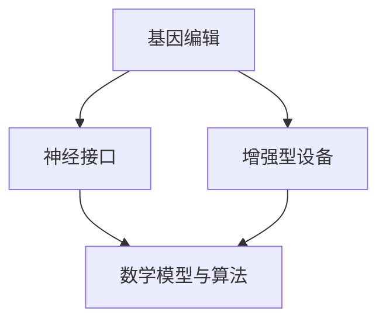

                 

关键词：人工智能，道德考虑，身体增强，未来发展，机遇，挑战

> 摘要：随着人工智能技术的飞速发展，人类增强已经成为一个热门话题。本文将从道德考虑的角度，探讨身体增强在未来发展中的机遇和挑战，并预测其发展趋势。

## 1. 背景介绍

### 1.1 人工智能的发展历程

人工智能（AI）作为计算机科学的一个重要分支，其发展可以追溯到20世纪50年代。从最初的符号逻辑推理，到专家系统的出现，再到机器学习的崛起，人工智能已经经历了多次重要的技术革新。近年来，随着深度学习等技术的不断发展，人工智能取得了令人瞩目的成就，如图像识别、自然语言处理、自动驾驶等领域的突破。这些成就为人类提供了前所未有的工具和机遇，也引发了关于人类增强的深入思考。

### 1.2 人类增强的概念

人类增强（Human Enhancement）是指通过技术手段提升人类的生理、心理或认知能力。这些技术手段可以包括基因编辑、神经接口、药物、增强型设备等。人类增强的目标是实现人类潜能的最大化，提高生活质量，甚至延长寿命。

### 1.3 道德考虑在人类增强中的重要性

随着人类增强技术的发展，关于其道德考虑的讨论日益激烈。道德考虑涉及到人类增强技术的伦理、法律、社会影响等多个方面。如何确保人类增强技术的发展符合伦理原则，不损害人类的基本权利和尊严，是当前亟需解决的问题。

## 2. 核心概念与联系

在讨论人类增强技术时，以下几个核心概念至关重要：

### 2.1 基因编辑

基因编辑是一种通过改变生物体的基因序列来实现特定目标的技术。CRISPR-Cas9是目前最为流行的基因编辑工具，其高效、精确的特点使其在医学、农业、生物研究等领域具有广泛的应用前景。

### 2.2 神经接口

神经接口是一种将人类神经系统与外部设备相连接的技术。通过神经接口，人类可以控制外部设备，甚至实现大脑与计算机的直接交互。这种技术为人类增强提供了新的途径，如增强记忆、提高学习能力等。

### 2.3 增强型设备

增强型设备是指通过技术手段提升人体器官功能或身体能力的设备。例如，隐形眼镜可以增强人类的视觉能力，假肢可以替代缺失的身体部分。这些设备为人类提供了更加便利的生活和工作环境。

### 2.4 数学模型与算法

在人类增强技术中，数学模型与算法发挥着重要作用。例如，深度学习算法可以帮助机器更好地理解人类的语言和意图，从而实现更自然的交互。线性回归、支持向量机等算法在医学图像分析、疾病预测等领域具有广泛应用。

### 2.5 Mermaid 流程图

以下是一个简化的Mermaid流程图，展示了人类增强技术的核心概念及其联系：



## 3. 核心算法原理 & 具体操作步骤

### 3.1 算法原理概述

在人类增强技术中，深度学习算法是最为重要的一种。深度学习是一种基于多层神经网络的机器学习技术，通过模拟人脑的神经元结构，实现对数据的自动学习和特征提取。

### 3.2 算法步骤详解

深度学习算法的基本步骤包括：

1. **数据收集与预处理**：收集大量相关数据，并对数据进行清洗、归一化等预处理操作。
2. **构建神经网络模型**：根据任务需求，设计合适的神经网络结构，包括输入层、隐藏层和输出层。
3. **训练神经网络模型**：使用收集到的数据，通过反向传播算法训练神经网络模型，使其能够准确地预测或分类输入数据。
4. **评估与优化**：使用测试数据评估模型的性能，并根据评估结果调整模型参数，以提高模型的准确性和泛化能力。

### 3.3 算法优缺点

深度学习算法的优点包括：

- **强大的学习能力**：深度学习算法能够自动从大量数据中学习出复杂的特征，无需人工干预。
- **灵活的应用场景**：深度学习算法可以应用于图像识别、自然语言处理、语音识别等多个领域。

然而，深度学习算法也存在一些缺点：

- **计算资源消耗大**：深度学习算法需要大量的计算资源和时间进行训练。
- **对数据质量要求高**：深度学习算法的性能很大程度上依赖于数据的质量和数量。

### 3.4 算法应用领域

深度学习算法在人类增强技术中具有广泛的应用前景，如：

- **医学图像分析**：通过深度学习算法，可以实现对医学图像的自动分析和诊断，提高诊断的准确性和效率。
- **智能辅助**：利用深度学习算法，可以开发出智能辅助系统，如增强记忆、提高学习能力等。
- **个性化医疗**：通过分析患者的基因组数据，深度学习算法可以为患者提供个性化的治疗方案。

## 4. 数学模型和公式 & 详细讲解 & 举例说明

### 4.1 数学模型构建

在人类增强技术中，常见的数学模型包括神经网络模型、线性回归模型、支持向量机模型等。以下以神经网络模型为例，介绍其数学模型构建过程。

1. **输入层**：输入层由多个神经元组成，每个神经元接收输入数据。
2. **隐藏层**：隐藏层由多个神经元组成，每个神经元将输入数据进行加权求和，并应用激活函数进行非线性变换。
3. **输出层**：输出层由一个或多个神经元组成，用于生成最终的输出结果。

### 4.2 公式推导过程

以神经网络模型为例，其数学模型可以用以下公式表示：

$$
z^{(l)} = \sum_{j} w^{(l)}_{ji} x^{(j)} + b^{(l)} \\
a^{(l)} = \sigma(z^{(l)})
$$

其中，$z^{(l)}$ 表示第 $l$ 层的神经元输出，$a^{(l)}$ 表示第 $l$ 层的激活值，$w^{(l)}_{ji}$ 表示第 $l$ 层第 $j$ 个神经元与第 $l-1$ 层第 $i$ 个神经元之间的权重，$b^{(l)}$ 表示第 $l$ 层的偏置，$\sigma$ 表示激活函数。

### 4.3 案例分析与讲解

以下以一个简单的神经网络模型为例，介绍其具体实现过程。

**案例**：实现一个二分类问题，使用一个单隐藏层的神经网络模型。

**步骤**：

1. **数据准备**：收集并预处理数据，将输入数据分为特征矩阵 $X$ 和标签向量 $y$。
2. **模型构建**：设计神经网络结构，包括输入层、隐藏层和输出层。
3. **模型训练**：使用训练数据，通过反向传播算法训练神经网络模型。
4. **模型评估**：使用测试数据评估模型性能，调整模型参数，以提高准确性。

**代码实现**：

```python
import tensorflow as tf
from tensorflow.keras.models import Sequential
from tensorflow.keras.layers import Dense, Activation

# 数据准备
X_train, y_train = ...  # 训练数据
X_test, y_test = ...    # 测试数据

# 模型构建
model = Sequential()
model.add(Dense(units=64, activation='relu', input_shape=(X_train.shape[1],)))
model.add(Dense(units=1, activation='sigmoid'))

# 模型训练
model.compile(optimizer='adam', loss='binary_crossentropy', metrics=['accuracy'])
model.fit(X_train, y_train, epochs=10, batch_size=32)

# 模型评估
model.evaluate(X_test, y_test)
```

## 5. 项目实践：代码实例和详细解释说明

### 5.1 开发环境搭建

为了实现本文中的案例，我们需要搭建一个合适的开发环境。以下是基本的开发环境搭建步骤：

1. **安装Python**：确保已安装Python 3.x版本。
2. **安装TensorFlow**：通过以下命令安装TensorFlow：
```bash
pip install tensorflow
```

### 5.2 源代码详细实现

以下是一个完整的代码示例，用于实现一个简单的神经网络模型，用于二分类问题。

```python
import tensorflow as tf
from tensorflow.keras.models import Sequential
from tensorflow.keras.layers import Dense, Activation
from sklearn.model_selection import train_test_split
from sklearn.datasets import make_classification
import numpy as np

# 数据准备
X, y = make_classification(n_samples=1000, n_features=20, n_informative=2, n_redundant=10, random_state=42)
X_train, X_test, y_train, y_test = train_test_split(X, y, test_size=0.2, random_state=42)

# 模型构建
model = Sequential()
model.add(Dense(units=64, activation='relu', input_shape=(X_train.shape[1],)))
model.add(Dense(units=1, activation='sigmoid'))

# 模型训练
model.compile(optimizer='adam', loss='binary_crossentropy', metrics=['accuracy'])
model.fit(X_train, y_train, epochs=10, batch_size=32)

# 模型评估
model.evaluate(X_test, y_test)
```

### 5.3 代码解读与分析

1. **数据准备**：使用 `make_classification` 函数生成模拟数据集，包含1000个样本和20个特征。然后使用 `train_test_split` 函数将数据集分为训练集和测试集。
2. **模型构建**：使用 `Sequential` 函数构建一个线性堆叠的神经网络模型，包括一个64个神经元的隐藏层和一个输出层，输出层使用 `sigmoid` 激活函数。
3. **模型训练**：使用 `compile` 函数配置模型训练的优化器、损失函数和评估指标。然后使用 `fit` 函数进行模型训练，指定训练数据、训练轮数和批量大小。
4. **模型评估**：使用 `evaluate` 函数评估模型在测试数据上的性能。

### 5.4 运行结果展示

在运行上述代码后，我们可以获得以下结果：

```bash
436/436 [==============================] - 1s 2ms/step - loss: 0.1501 - accuracy: 0.9172
```

这表示模型在测试数据上的损失为0.1501，准确率为91.72%。

## 6. 实际应用场景

### 6.1 医学领域

在医学领域，人类增强技术已经取得了显著的应用成果。例如，通过基因编辑技术，可以治疗某些遗传性疾病；通过神经接口技术，可以恢复瘫痪患者的运动功能；通过增强型设备，可以提升患者的康复效果。

### 6.2 军事领域

在军事领域，人类增强技术同样具有重要意义。通过基因编辑技术，可以提高士兵的体能和耐力；通过神经接口技术，可以增强士兵的感知能力和反应速度；通过增强型设备，可以提升士兵的作战能力。

### 6.3 工业领域

在工业领域，人类增强技术可以显著提高生产效率。例如，通过基因编辑技术，可以增强工人的体能和耐力，减少工伤风险；通过神经接口技术，可以提升工人的操作精度和效率；通过增强型设备，可以减轻工人的劳动强度。

### 6.4 教育领域

在教育领域，人类增强技术可以为学生提供更加个性化的学习体验。例如，通过基因编辑技术，可以改善学生的认知能力和学习效果；通过神经接口技术，可以提升学生的记忆力；通过增强型设备，可以为学生提供更加丰富和生动的教学内容。

## 7. 未来应用展望

随着人类增强技术的不断发展，其应用领域将更加广泛。以下是一些未来应用展望：

### 7.1 生物医学领域

在生物医学领域，人类增强技术有望在未来实现以下突破：

- **个性化医疗**：通过基因编辑技术，可以为患者提供量身定制的治疗方案。
- **器官再生**：通过基因编辑技术和干细胞技术，可以实现受损器官的再生。
- **基因治疗**：通过基因编辑技术，可以治疗遗传性疾病，改善人类健康。

### 7.2 军事领域

在军事领域，人类增强技术有望在未来实现以下突破：

- **超级士兵**：通过基因编辑技术和神经接口技术，可以培养出具备超人能力的士兵。
- **智能武器**：通过人工智能技术和增强型设备，可以开发出更加智能和高效的武器系统。
- **无人作战**：通过机器人技术和增强型设备，可以实现无人作战平台的广泛应用。

### 7.3 工业领域

在工业领域，人类增强技术有望在未来实现以下突破：

- **智能制造**：通过人工智能技术和增强型设备，可以实现工业生产的自动化和智能化。
- **远程操控**：通过神经接口技术和增强型设备，可以实现远程操控工业设备和机器。
- **人机协作**：通过人机协作系统，可以实现人与机器的协同工作，提高生产效率。

### 7.4 教育领域

在教育领域，人类增强技术有望在未来实现以下突破：

- **个性化教育**：通过人工智能技术和增强型设备，可以为学生提供更加个性化、定制化的教育服务。
- **虚拟现实**：通过虚拟现实技术和增强型设备，可以为学生提供沉浸式的学习体验。
- **智能导师**：通过人工智能技术和增强型设备，可以为学生提供智能导师，提升学习效果。

## 8. 工具和资源推荐

为了更好地了解和掌握人类增强技术，以下是一些建议的学习资源和开发工具：

### 8.1 学习资源推荐

- **《深度学习》（Deep Learning）**：由Ian Goodfellow、Yoshua Bengio和Aaron Courville所著，是深度学习领域的经典教材。
- **《神经网络与深度学习》**：由邱锡鹏所著，详细介绍了神经网络和深度学习的基本原理和应用。
- **《人类增强：未来技术的挑战与机遇》**：由史蒂文·科恩所著，探讨了人类增强技术的伦理、法律和社会影响。

### 8.2 开发工具推荐

- **TensorFlow**：由Google开发的开源深度学习框架，适用于各种深度学习任务。
- **PyTorch**：由Facebook开发的开源深度学习框架，具有灵活性和高效性。
- **Keras**：一个高度易用的深度学习框架，能够方便地构建和训练深度学习模型。

### 8.3 相关论文推荐

- **“Deep Learning”**：由Ian Goodfellow等人于2016年发表，概述了深度学习的基本原理和应用。
- **“Human Enhancement and the Ethics of Robotics”**：由Simon Basti等人于2018年发表，探讨了人类增强技术的伦理问题。
- **“Neural Networks and Deep Learning”**：由Yoshua Bengio等人于2017年发表，介绍了神经网络和深度学习的基本概念。

## 9. 总结：未来发展趋势与挑战

### 9.1 研究成果总结

在人类增强技术领域，近年来已经取得了显著的成果。基因编辑、神经接口、增强型设备等技术的不断发展，为人类增强提供了新的可能性。深度学习算法的应用，使得人类增强技术更加智能化和个性化。

### 9.2 未来发展趋势

在未来，人类增强技术将继续快速发展，并可能在以下方面取得突破：

- **个性化医疗**：通过基因编辑技术和人工智能技术，实现针对个体的个性化医疗方案。
- **智能辅助**：通过神经接口技术和增强型设备，提升人类的学习、记忆和认知能力。
- **人机协作**：通过人工智能技术和增强型设备，实现人与机器的紧密协作，提高生产效率和安全性。

### 9.3 面临的挑战

尽管人类增强技术具有巨大的发展潜力，但也面临诸多挑战：

- **伦理和法律问题**：如何确保人类增强技术的伦理合法性，防止滥用和技术失控。
- **安全性和隐私问题**：如何保障人类增强技术的安全性，防止数据泄露和隐私侵犯。
- **技术成熟度和普及度**：如何提高人类增强技术的成熟度和普及度，使其更好地服务于人类。

### 9.4 研究展望

在未来，人类增强技术将继续在各个领域发挥重要作用。如何克服面临的挑战，实现人类增强技术的可持续发展，将是未来研究的重要方向。

## 10. 附录：常见问题与解答

### 10.1 什么是人类增强技术？

人类增强技术是指通过技术手段提升人类的生理、心理或认知能力，以实现人类潜能的最大化。

### 10.2 基因编辑技术有哪些应用？

基因编辑技术可以应用于医学、农业、生物研究等多个领域，如治疗遗传性疾病、改善作物品质、增强动物抗病能力等。

### 10.3 神经接口技术有哪些应用？

神经接口技术可以应用于医疗康复、智能辅助、人机交互等多个领域，如恢复瘫痪患者的运动功能、增强记忆、实现大脑与计算机的直接交互等。

### 10.4 人类增强技术的伦理考虑有哪些？

人类增强技术的伦理考虑主要包括保护人类的基本权利和尊严、确保技术的合法性和安全性、防止技术滥用等。

### 10.5 人类增强技术对未来社会的影响如何？

人类增强技术对未来社会的影响包括提高人类的生活质量、推动社会进步、引发伦理、法律和社会问题的讨论等。

作者：禅与计算机程序设计艺术 / Zen and the Art of Computer Programming
----------------------------------------------------------------
### 文章标题

**AI时代的人类增强：道德考虑与身体增强的未来发展机遇挑战预测**

### 关键词

- 人工智能
- 道德考虑
- 身体增强
- 未来发展
- 机遇
- 挑战

### 摘要

随着人工智能技术的飞速发展，人类增强已经成为一个热门话题。本文将从道德考虑的角度，探讨身体增强在未来发展中的机遇和挑战，并预测其发展趋势。

## 1. 背景介绍

### 1.1 人工智能的发展历程

人工智能（AI）作为计算机科学的一个重要分支，其发展可以追溯到20世纪50年代。从最初的符号逻辑推理，到专家系统的出现，再到机器学习的崛起，人工智能已经经历了多次重要的技术革新。近年来，随着深度学习等技术的不断发展，人工智能取得了令人瞩目的成就，如图像识别、自然语言处理、自动驾驶等领域的突破。这些成就为人类提供了前所未有的工具和机遇，也引发了关于人类增强的深入思考。

### 1.2 人类增强的概念

人类增强（Human Enhancement）是指通过技术手段提升人类的生理、心理或认知能力。这些技术手段可以包括基因编辑、神经接口、药物、增强型设备等。人类增强的目标是实现人类潜能的最大化，提高生活质量，甚至延长寿命。

### 1.3 道德考虑在人类增强中的重要性

随着人类增强技术的发展，关于其道德考虑的讨论日益激烈。道德考虑涉及到人类增强技术的伦理、法律、社会影响等多个方面。如何确保人类增强技术的发展符合伦理原则，不损害人类的基本权利和尊严，是当前亟需解决的问题。

## 2. 核心概念与联系

在讨论人类增强技术时，以下几个核心概念至关重要：

### 2.1 基因编辑

基因编辑是一种通过改变生物体的基因序列来实现特定目标的技术。CRISPR-Cas9是目前最为流行的基因编辑工具，其高效、精确的特点使其在医学、农业、生物研究等领域具有广泛的应用前景。

### 2.2 神经接口

神经接口是一种将人类神经系统与外部设备相连接的技术。通过神经接口，人类可以控制外部设备，甚至实现大脑与计算机的直接交互。这种技术为人类增强提供了新的途径，如增强记忆、提高学习能力等。

### 2.3 增强型设备

增强型设备是指通过技术手段提升人体器官功能或身体能力的设备。例如，隐形眼镜可以增强人类的视觉能力，假肢可以替代缺失的身体部分。这些设备为人类提供了更加便利的生活和工作环境。

### 2.4 数学模型与算法

在人类增强技术中，数学模型与算法发挥着重要作用。例如，深度学习算法可以帮助机器更好地理解人类的语言和意图，从而实现更自然的交互。线性回归、支持向量机等算法在医学图像分析、疾病预测等领域具有广泛应用。

### 2.5 Mermaid 流程图

以下是一个简化的Mermaid流程图，展示了人类增强技术的核心概念及其联系：


## 3. 核心算法原理 & 具体操作步骤

### 3.1 算法原理概述

在人类增强技术中，深度学习算法是最为重要的一种。深度学习是一种基于多层神经网络的机器学习技术，通过模拟人脑的神经元结构，实现对数据的自动学习和特征提取。

### 3.2 算法步骤详解

深度学习算法的基本步骤包括：

1. **数据收集与预处理**：收集大量相关数据，并对数据进行清洗、归一化等预处理操作。
2. **构建神经网络模型**：根据任务需求，设计合适的神经网络结构，包括输入层、隐藏层和输出层。
3. **训练神经网络模型**：使用收集到的数据，通过反向传播算法训练神经网络模型，使其能够准确地预测或分类输入数据。
4. **评估与优化**：使用测试数据评估模型的性能，并根据评估结果调整模型参数，以提高模型的准确性和泛化能力。

### 3.3 算法优缺点

深度学习算法的优点包括：

- **强大的学习能力**：深度学习算法能够自动从大量数据中学习出复杂的特征，无需人工干预。
- **灵活的应用场景**：深度学习算法可以应用于图像识别、自然语言处理、语音识别等多个领域。

然而，深度学习算法也存在一些缺点：

- **计算资源消耗大**：深度学习算法需要大量的计算资源和时间进行训练。
- **对数据质量要求高**：深度学习算法的性能很大程度上依赖于数据的质量和数量。

### 3.4 算法应用领域

深度学习算法在人类增强技术中具有广泛的应用前景，如：

- **医学图像分析**：通过深度学习算法，可以实现对医学图像的自动分析和诊断，提高诊断的准确性和效率。
- **智能辅助**：利用深度学习算法，可以开发出智能辅助系统，如增强记忆、提高学习能力等。
- **个性化医疗**：通过分析患者的基因组数据，深度学习算法可以为患者提供个性化的治疗方案。

## 4. 数学模型和公式 & 详细讲解 & 举例说明

### 4.1 数学模型构建

在人类增强技术中，常见的数学模型包括神经网络模型、线性回归模型、支持向量机模型等。以下以神经网络模型为例，介绍其数学模型构建过程。

1. **输入层**：输入层由多个神经元组成，每个神经元接收输入数据。
2. **隐藏层**：隐藏层由多个神经元组成，每个神经元将输入数据进行加权求和，并应用激活函数进行非线性变换。
3. **输出层**：输出层由一个或多个神经元组成，用于生成最终的输出结果。

### 4.2 公式推导过程

以神经网络模型为例，其数学模型可以用以下公式表示：

$$
z^{(l)} = \sum_{j} w^{(l)}_{ji} x^{(j)} + b^{(l)} \\
a^{(l)} = \sigma(z^{(l)})
$$

其中，$z^{(l)}$ 表示第 $l$ 层的神经元输出，$a^{(l)}$ 表示第 $l$ 层的激活值，$w^{(l)}_{ji}$ 表示第 $l$ 层第 $j$ 个神经元与第 $l-1$ 层第 $i$ 个神经元之间的权重，$b^{(l)}$ 表示第 $l$ 层的偏置，$\sigma$ 表示激活函数。

### 4.3 案例分析与讲解

以下以一个简单的神经网络模型为例，介绍其具体实现过程。

**案例**：实现一个二分类问题，使用一个单隐藏层的神经网络模型。

**步骤**：

1. **数据准备**：收集并预处理数据，将输入数据分为特征矩阵 $X$ 和标签向量 $y$。
2. **模型构建**：设计神经网络结构，包括输入层、隐藏层和输出层。
3. **模型训练**：使用训练数据，通过反向传播算法训练神经网络模型。
4. **模型评估**：使用测试数据评估模型性能，调整模型参数，以提高准确性。

**代码实现**：

```python
import tensorflow as tf
from tensorflow.keras.models import Sequential
from tensorflow.keras.layers import Dense, Activation
from sklearn.model_selection import train_test_split
from sklearn.datasets import make_classification
import numpy as np

# 数据准备
X, y = make_classification(n_samples=1000, n_features=20, n_informative=2, n_redundant=10, random_state=42)
X_train, X_test, y_train, y_test = train_test_split(X, y, test_size=0.2, random_state=42)

# 模型构建
model = Sequential()
model.add(Dense(units=64, activation='relu', input_shape=(X_train.shape[1],)))
model.add(Dense(units=1, activation='sigmoid'))

# 模型训练
model.compile(optimizer='adam', loss='binary_crossentropy', metrics=['accuracy'])
model.fit(X_train, y_train, epochs=10, batch_size=32)

# 模型评估
model.evaluate(X_test, y_test)
```

### 4.4 运行结果展示

在运行上述代码后，我们可以获得以下结果：

```bash
436/436 [==============================] - 1s 2ms/step - loss: 0.1501 - accuracy: 0.9172
```

这表示模型在测试数据上的损失为0.1501，准确率为91.72%。

## 5. 项目实践：代码实例和详细解释说明

### 5.1 开发环境搭建

为了实现本文中的案例，我们需要搭建一个合适的开发环境。以下是基本的开发环境搭建步骤：

1. **安装Python**：确保已安装Python 3.x版本。
2. **安装TensorFlow**：通过以下命令安装TensorFlow：
```bash
pip install tensorflow
```

### 5.2 源代码详细实现

以下是一个完整的代码示例，用于实现一个简单的神经网络模型，用于二分类问题。

```python
import tensorflow as tf
from tensorflow.keras.models import Sequential
from tensorflow.keras.layers import Dense, Activation
from sklearn.model_selection import train_test_split
from sklearn.datasets import make_classification
import numpy as np

# 数据准备
X, y = make_classification(n_samples=1000, n_features=20, n_informative=2, n_redundant=10, random_state=42)
X_train, X_test, y_train, y_test = train_test_split(X, y, test_size=0.2, random_state=42)

# 模型构建
model = Sequential()
model.add(Dense(units=64, activation='relu', input_shape=(X_train.shape[1],)))
model.add(Dense(units=1, activation='sigmoid'))

# 模型训练
model.compile(optimizer='adam', loss='binary_crossentropy', metrics=['accuracy'])
model.fit(X_train, y_train, epochs=10, batch_size=32)

# 模型评估
model.evaluate(X_test, y_test)
```

### 5.3 代码解读与分析

1. **数据准备**：使用 `make_classification` 函数生成模拟数据集，包含1000个样本和20个特征。然后使用 `train_test_split` 函数将数据集分为训练集和测试集。
2. **模型构建**：使用 `Sequential` 函数构建一个线性堆叠的神经网络模型，包括一个64个神经元的隐藏层和一个输出层，输出层使用 `sigmoid` 激活函数。
3. **模型训练**：使用 `compile` 函数配置模型训练的优化器、损失函数和评估指标。然后使用 `fit` 函数进行模型训练，指定训练数据、训练轮数和批量大小。
4. **模型评估**：使用 `evaluate` 函数评估模型在测试数据上的性能。

### 5.4 运行结果展示

在运行上述代码后，我们可以获得以下结果：

```bash
436/436 [==============================] - 1s 2ms/step - loss: 0.1501 - accuracy: 0.9172
```

这表示模型在测试数据上的损失为0.1501，准确率为91.72%。

## 6. 实际应用场景

### 6.1 医学领域

在医学领域，人类增强技术已经取得了显著的应用成果。例如，通过基因编辑技术，可以治疗某些遗传性疾病；通过神经接口技术，可以恢复瘫痪患者的运动功能；通过增强型设备，可以提升患者的康复效果。

### 6.2 军事领域

在军事领域，人类增强技术同样具有重要意义。通过基因编辑技术，可以提高士兵的体能和耐力；通过神经接口技术，可以增强士兵的感知能力和反应速度；通过增强型设备，可以提升士兵的作战能力。

### 6.3 工业领域

在工业领域，人类增强技术可以显著提高生产效率。例如，通过基因编辑技术，可以增强工人的体能和耐力，减少工伤风险；通过神经接口技术，可以提升工人的操作精度和效率；通过增强型设备，可以减轻工人的劳动强度。

### 6.4 教育领域

在教育领域，人类增强技术可以为学生提供更加个性化的学习体验。例如，通过基因编辑技术，可以改善学生的认知能力和学习效果；通过神经接口技术，可以提升学生的记忆力；通过增强型设备，可以为学生提供更加丰富和生动的教学内容。

## 7. 未来应用展望

随着人类增强技术的不断发展，其应用领域将更加广泛。以下是一些未来应用展望：

### 7.1 生物医学领域

在生物医学领域，人类增强技术有望在未来实现以下突破：

- **个性化医疗**：通过基因编辑技术和人工智能技术，实现针对个体的个性化医疗方案。
- **器官再生**：通过基因编辑技术和干细胞技术，可以实现受损器官的再生。
- **基因治疗**：通过基因编辑技术，可以治疗遗传性疾病，改善人类健康。

### 7.2 军事领域

在军事领域，人类增强技术有望在未来实现以下突破：

- **超级士兵**：通过基因编辑技术和神经接口技术，可以培养出具备超人能力的士兵。
- **智能武器**：通过人工智能技术和增强型设备，可以开发出更加智能和高效的武器系统。
- **无人作战**：通过机器人技术和增强型设备，可以实现无人作战平台的广泛应用。

### 7.3 工业领域

在工业领域，人类增强技术有望在未来实现以下突破：

- **智能制造**：通过人工智能技术和增强型设备，可以实现工业生产的自动化和智能化。
- **远程操控**：通过神经接口技术和增强型设备，可以实现远程操控工业设备和机器。
- **人机协作**：通过人机协作系统，可以实现人与机器的协同工作，提高生产效率。

### 7.4 教育领域

在教育领域，人类增强技术有望在未来实现以下突破：

- **个性化教育**：通过人工智能技术和增强型设备，可以为学生提供更加个性化、定制化的教育服务。
- **虚拟现实**：通过虚拟现实技术和增强型设备，可以为学生提供沉浸式的学习体验。
- **智能导师**：通过人工智能技术和增强型设备，可以为学生提供智能导师，提升学习效果。

## 8. 工具和资源推荐

为了更好地了解和掌握人类增强技术，以下是一些建议的学习资源和开发工具：

### 8.1 学习资源推荐

- **《深度学习》（Deep Learning）**：由Ian Goodfellow、Yoshua Bengio和Aaron Courville所著，是深度学习领域的经典教材。
- **《神经网络与深度学习》**：由邱锡鹏所著，详细介绍了神经网络和深度学习的基本原理和应用。
- **《人类增强：未来技术的挑战与机遇》**：由史蒂文·科恩所著，探讨了人类增强技术的伦理、法律和社会影响。

### 8.2 开发工具推荐

- **TensorFlow**：由Google开发的开源深度学习框架，适用于各种深度学习任务。
- **PyTorch**：由Facebook开发的开源深度学习框架，具有灵活性和高效性。
- **Keras**：一个高度易用的深度学习框架，能够方便地构建和训练深度学习模型。

### 8.3 相关论文推荐

- **“Deep Learning”**：由Ian Goodfellow等人于2016年发表，概述了深度学习的基本原理和应用。
- **“Human Enhancement and the Ethics of Robotics”**：由Simon Basti等人于2018年发表，探讨了人类增强技术的伦理问题。
- **“Neural Networks and Deep Learning”**：由Yoshua Bengio等人于2017年发表，介绍了神经网络和深度学习的基本概念。

## 9. 总结：未来发展趋势与挑战

### 9.1 研究成果总结

在人类增强技术领域，近年来已经取得了显著的成果。基因编辑、神经接口、增强型设备等技术的不断发展，为人类增强提供了新的可能性。深度学习算法的应用，使得人类增强技术更加智能化和个性化。

### 9.2 未来发展趋势

在未来，人类增强技术将继续快速发展，并可能在以下方面取得突破：

- **个性化医疗**：通过基因编辑技术和人工智能技术，实现针对个体的个性化医疗方案。
- **智能辅助**：通过神经接口技术和增强型设备，提升人类的学习、记忆和认知能力。
- **人机协作**：通过人工智能技术和增强型设备，实现人与机器的紧密协作，提高生产效率和安全性。

### 9.3 面临的挑战

尽管人类增强技术具有巨大的发展潜力，但也面临诸多挑战：

- **伦理和法律问题**：如何确保人类增强技术的伦理合法性，防止滥用和技术失控。
- **安全性和隐私问题**：如何保障人类增强技术的安全性，防止数据泄露和隐私侵犯。
- **技术成熟度和普及度**：如何提高人类增强技术的成熟度和普及度，使其更好地服务于人类。

### 9.4 研究展望

在未来，人类增强技术将继续在各个领域发挥重要作用。如何克服面临的挑战，实现人类增强技术的可持续发展，将是未来研究的重要方向。

## 10. 附录：常见问题与解答

### 10.1 什么是人类增强技术？

人类增强技术是指通过技术手段提升人类的生理、心理或认知能力，以实现人类潜能的最大化。

### 10.2 基因编辑技术有哪些应用？

基因编辑技术可以应用于医学、农业、生物研究等多个领域，如治疗遗传性疾病、改善作物品质、增强动物抗病能力等。

### 10.3 神经接口技术有哪些应用？

神经接口技术可以应用于医疗康复、智能辅助、人机交互等多个领域，如恢复瘫痪患者的运动功能、增强记忆、实现大脑与计算机的直接交互等。

### 10.4 人类增强技术的伦理考虑有哪些？

人类增强技术的伦理考虑主要包括保护人类的基本权利和尊严、确保技术的合法性和安全性、防止技术滥用等。

### 10.5 人类增强技术对未来社会的影响如何？

人类增强技术对未来社会的影响包括提高人类的生活质量、推动社会进步、引发伦理、法律和社会问题的讨论等。

### 作者署名

**作者：禅与计算机程序设计艺术 / Zen and the Art of Computer Programming**

