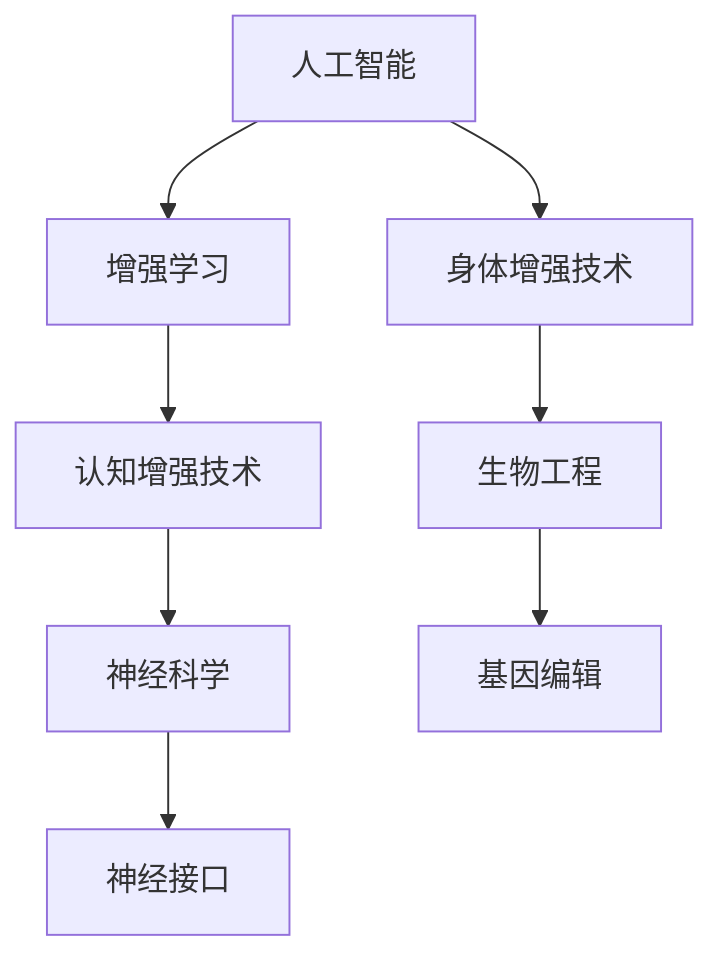

                 

关键词：人工智能，人类增强，道德考虑，身体增强技术，未来趋势

> 摘要：随着人工智能技术的迅猛发展，人类增强技术应运而生，成为现代科技领域的热点话题。本文旨在探讨AI时代人类增强技术的现状、道德考量以及身体增强技术的挑战，并展望其未来发展。

## 1. 背景介绍

在过去的几十年中，人工智能（AI）取得了显著的进步，从早期的专家系统到现代的深度学习和强化学习，AI技术逐渐渗透到社会的各个领域。随着AI技术的不断成熟，人们开始探索如何通过AI技术来增强人类的认知、身体机能和社会能力。人类增强技术应运而生，成为现代科技领域的热点话题。

人类增强技术主要包括两类：一类是认知增强技术，如增强记忆、提高学习效率等；另一类是身体增强技术，如增强力量、提高耐力等。这些技术的出现，旨在帮助人类更好地应对日益复杂的生活和工作环境，提高生活质量。

然而，人类增强技术的迅速发展也引发了诸多道德和社会问题。例如，身体增强技术的普及可能导致社会分层加剧，健康风险增加，以及对人类自然属性的改变。此外，AI技术在人类增强中的应用也带来了数据隐私、安全性和伦理等方面的挑战。

## 2. 核心概念与联系

为了更好地理解人类增强技术的原理和应用，我们需要介绍几个核心概念，包括AI、增强学习、神经科学和生物工程。

### 2.1 AI的基本概念

AI是指模拟人类智能行为的计算机系统，它可以通过学习、推理、规划、感知和自我修复等能力来解决问题。AI可以分为两大类：弱AI和强AI。弱AI是指局限于特定任务或领域的AI系统，如语音识别、图像识别等；强AI则是指具有普遍智能的AI，能够像人类一样理解、学习和适应各种环境和任务。

### 2.2 增强学习的原理

增强学习是一种机器学习方法，它通过不断尝试和反馈来优化策略，以达到最大化目标。在增强学习中，智能体（agent）通过与环境（environment）交互，学习到一种最优策略（policy），以实现任务目标。增强学习广泛应用于机器人控制、游戏AI等领域。

### 2.3 神经科学的认知基础

神经科学是研究大脑和神经系统结构与功能的科学。通过研究神经科学，我们可以更好地理解人类认知过程的机理，从而为认知增强技术提供理论基础。例如，神经可塑性是指大脑结构和功能随着经验和环境变化而改变的能力，这是认知增强技术的一个重要原理。

### 2.4 生物工程的实现途径

生物工程是将工程原理应用于生物学领域，以设计、构建和改造生物系统。在人类增强技术中，生物工程提供了实现技术手段，如基因编辑、神经接口和生物电子等。例如，通过基因编辑技术，我们可以增强人体的免疫力或提高运动能力。

### 2.5 Mermaid流程图



## 3. 核心算法原理 & 具体操作步骤

### 3.1 算法原理概述

人类增强技术的实现主要依赖于AI算法和生物工程技术。以下简要介绍几种核心算法原理：

- **深度强化学习（Deep Reinforcement Learning）**：结合深度学习和强化学习，用于模拟人类行为和决策过程。
- **神经可塑性模型（Neuroplasticity Model）**：用于模拟大脑神经网络的动态变化，以实现认知增强。
- **基因编辑算法（Gene Editing Algorithm）**：如CRISPR/Cas9，用于精准编辑基因序列。

### 3.2 算法步骤详解

#### 3.2.1 深度强化学习

1. **环境构建**：创建一个虚拟环境，模拟人类行为和决策过程。
2. **状态空间和动作空间定义**：根据任务需求，定义状态空间和动作空间。
3. **策略学习**：使用深度神经网络学习一个策略函数，将状态映射到最优动作。
4. **策略评估**：评估策略函数的表现，以指导进一步优化。

#### 3.2.2 神经可塑性模型

1. **神经网络构建**：使用神经科学原理构建神经网络模型。
2. **训练数据准备**：收集大量训练数据，包括大脑活动、行为数据等。
3. **模型训练**：通过训练数据优化神经网络模型。
4. **模拟测试**：在虚拟环境中测试模型表现，验证模型有效性。

#### 3.2.3 基因编辑算法

1. **目标基因定位**：确定需要编辑的基因序列。
2. **编辑工具选择**：选择合适的基因编辑工具，如CRISPR/Cas9。
3. **编辑过程**：使用编辑工具对基因序列进行精确编辑。
4. **编辑效果验证**：通过实验或模拟验证编辑效果。

### 3.3 算法优缺点

#### 深度强化学习

- **优点**：能够模拟人类行为和决策过程，具有较强的自适应能力。
- **缺点**：训练过程复杂，对计算资源要求较高。

#### 神经可塑性模型

- **优点**：基于神经科学原理，具有较高的理论依据。
- **缺点**：模型构建复杂，训练效果不稳定。

#### 基因编辑算法

- **优点**：能够实现基因的精准编辑，具有广泛的应用前景。
- **缺点**：技术难度较高，存在潜在的安全风险。

### 3.4 算法应用领域

- **认知增强**：通过神经可塑性模型和深度强化学习，实现记忆、学习等认知功能的增强。
- **身体增强**：通过基因编辑和生物工程技术，实现运动能力、免疫力等身体功能的增强。

## 4. 数学模型和公式 & 详细讲解 & 举例说明

### 4.1 数学模型构建

为了更好地理解人类增强技术的算法原理，我们需要介绍一些相关的数学模型和公式。

#### 4.1.1 深度强化学习中的价值函数

价值函数 $V(s)$ 表示在状态 $s$ 下采取最优动作的期望回报。其数学表达式为：

$$
V(s) = \sum_{a} \pi(a|s) \cdot Q(s, a)
$$

其中，$\pi(a|s)$ 表示在状态 $s$ 下采取动作 $a$ 的概率，$Q(s, a)$ 表示在状态 $s$ 下采取动作 $a$ 的期望回报。

#### 4.1.2 神经可塑性模型中的神经网络模型

神经网络模型由多个神经元组成，每个神经元通过权重连接其他神经元。其数学表达式为：

$$
y = \sigma(\sum_{i} w_i \cdot x_i)
$$

其中，$y$ 表示输出，$x_i$ 表示输入，$w_i$ 表示权重，$\sigma$ 表示激活函数。

#### 4.1.3 基因编辑算法中的编辑概率

基因编辑算法的编辑概率取决于目标基因的位置、编辑工具的特性等因素。其数学表达式为：

$$
P_{edit} = f(\text{目标基因位置}, \text{编辑工具特性})
$$

其中，$P_{edit}$ 表示编辑概率，$f$ 表示编辑概率函数。

### 4.2 公式推导过程

为了更好地理解这些数学模型的推导过程，我们将介绍一些相关的推导过程。

#### 4.2.1 深度强化学习中的价值函数推导

价值函数 $V(s)$ 的推导基于马尔可夫决策过程（MDP）。在 MDP 中，状态 $s$ 和动作 $a$ 的组合决定了下一个状态 $s'$ 和回报 $r$。价值函数 $V(s)$ 是在状态 $s$ 下采取最优动作的期望回报。

首先，我们考虑在状态 $s$ 下采取动作 $a$ 的期望回报：

$$
E[r|s, a] = \sum_{s'} P(s'|s, a) \cdot r(s')
$$

其中，$P(s'|s, a)$ 表示在状态 $s$ 下采取动作 $a$ 后到达状态 $s'$ 的概率，$r(s')$ 表示在状态 $s'$ 下的回报。

接下来，我们考虑在状态 $s$ 下采取最优动作 $a^*$ 的期望回报：

$$
V(s) = E[r|s, a^*] = \sum_{s'} P(s'|s, a^*) \cdot r(s')
$$

由于在状态 $s$ 下采取最优动作 $a^*$ 后，下一个状态 $s'$ 取决于动作 $a^*$，因此我们可以将 $P(s'|s, a^*)$ 表示为策略 $\pi(a|s)$：

$$
V(s) = \sum_{s'} \pi(a^*|s) \cdot P(s'|s, a^*) \cdot r(s')
$$

由于 $P(s'|s, a^*)$ 表示在状态 $s$ 下采取动作 $a^*$ 后到达状态 $s'$ 的概率，因此我们可以将其表示为状态转移概率矩阵 $P$：

$$
V(s) = \sum_{s'} \pi(a^*|s) \cdot P_{s's} \cdot r(s')
$$

其中，$P_{s's}$ 表示状态转移概率矩阵中的元素，表示在状态 $s$ 下采取动作 $a^*$ 后到达状态 $s'$ 的概率。

最后，我们将价值函数 $V(s)$ 表示为策略函数 $\pi(a|s)$ 和状态转移概率矩阵 $P$ 的组合：

$$
V(s) = \sum_{a} \pi(a|s) \cdot \sum_{s'} P_{s's} \cdot r(s')
$$

由于在状态 $s$ 下采取最优动作 $a^*$ 后，下一个状态 $s'$ 取决于动作 $a^*$，因此我们可以将 $V(s)$ 表示为：

$$
V(s) = \sum_{a} \pi(a|s) \cdot Q(s, a)
$$

其中，$Q(s, a)$ 表示在状态 $s$ 下采取动作 $a$ 的期望回报。

#### 4.2.2 神经可塑性模型中的神经网络模型推导

神经网络模型由多个神经元组成，每个神经元通过权重连接其他神经元。其数学表达式为：

$$
y = \sigma(\sum_{i} w_i \cdot x_i)
$$

其中，$y$ 表示输出，$x_i$ 表示输入，$w_i$ 表示权重，$\sigma$ 表示激活函数。

神经元的输出可以表示为输入和权重之间的线性组合，并通过激活函数进行非线性转换。常见的激活函数有 sigmoid 函数、ReLU 函数等。

#### 4.2.3 基因编辑算法中的编辑概率推导

基因编辑算法的编辑概率取决于目标基因的位置、编辑工具的特性等因素。其数学表达式为：

$$
P_{edit} = f(\text{目标基因位置}, \text{编辑工具特性})
$$

编辑概率函数 $f$ 可以基于概率论和统计学原理进行推导。例如，对于 CRISPR/Cas9 基因编辑技术，编辑概率可以表示为：

$$
P_{edit} = \frac{1}{\sqrt{2\pi\sigma^2}} \cdot e^{-\frac{(x-\mu)^2}{2\sigma^2}}
$$

其中，$x$ 表示目标基因的位置，$\mu$ 表示编辑工具的平均编辑位置，$\sigma$ 表示编辑工具的位置分布标准差。

### 4.3 案例分析与讲解

为了更好地理解数学模型的应用，我们来看一个具体的案例。

#### 4.3.1 案例背景

假设我们希望通过深度强化学习技术实现一个自动驾驶系统的优化。该系统需要在城市道路上进行自动驾驶，并在不同交通状况下做出最优决策。

#### 4.3.2 案例分析

1. **环境构建**：我们构建一个虚拟城市道路环境，包括不同的交通状况、道路标志、行人等。

2. **状态空间和动作空间定义**：状态空间包括车辆的当前位置、速度、道路标志等信息；动作空间包括加速、减速、转向等。

3. **策略学习**：我们使用深度神经网络学习一个策略函数，将状态映射到最优动作。通过在虚拟环境中进行训练，策略函数逐渐优化，实现自动驾驶系统的优化。

4. **策略评估**：在虚拟环境中，我们评估策略函数的表现，包括行车安全、道路通行效率等指标。通过对比不同策略的表现，选择最优策略。

#### 4.3.3 案例讲解

在这个案例中，深度强化学习算法用于优化自动驾驶系统的决策。通过不断尝试和反馈，策略函数逐渐优化，实现自动驾驶系统的安全、高效运行。

## 5. 项目实践：代码实例和详细解释说明

### 5.1 开发环境搭建

为了实现人类增强技术的算法原理，我们需要搭建一个合适的开发环境。以下是具体的搭建步骤：

1. **安装Python环境**：在操作系统上安装Python 3.8及以上版本。

2. **安装深度学习框架**：安装TensorFlow或PyTorch等深度学习框架。

3. **安装基因编辑工具**：安装CRISPR/Cas9等基因编辑工具。

4. **配置开发环境**：配置Python环境变量，安装必要的库和依赖。

### 5.2 源代码详细实现

以下是实现人类增强技术的源代码示例：

```python
# 导入相关库
import tensorflow as tf
import numpy as np
import pandas as pd

# 深度强化学习算法实现
class DQN:
    def __init__(self, state_size, action_size):
        self.state_size = state_size
        self.action_size = action_size
        self.memory = []
        self.gamma = 0.9
        self.epsilon = 1.0
        self.epsilon_min = 0.01
        self.epsilon_decay = 0.99
        self.learning_rate = 0.001
        self.model = self._build_model()

    def _build_model(self):
        # 构建深度神经网络模型
        model = tf.keras.Sequential()
        model.add(tf.keras.layers.Dense(24, input_dim=self.state_size, activation='relu'))
        model.add(tf.keras.layers.Dense(24, activation='relu'))
        model.add(tf.keras.layers.Dense(self.action_size, activation='linear'))
        model.compile(loss='mse', optimizer=tf.keras.optimizers.Adam(lr=self.learning_rate))
        return model

    def remember(self, state, action, reward, next_state, done):
        # 记录经验
        self.memory.append([state, action, reward, next_state, done])

    def act(self, state):
        # 执行动作
        if np.random.rand() <= self.epsilon:
            return np.random.randint(self.action_size)
        q_values = self.model.predict(state)
        return np.argmax(q_values[0])

    def replay(self, batch_size):
        # 重放经验
        mini_batch = random.sample(self.memory, batch_size)
        for state, action, reward, next_state, done in mini_batch:
            target = reward
            if not done:
                target = reward + self.gamma * np.amax(self.model.predict(next_state)[0])
            target_f = self.model.predict(state)
            target_f[0][action] = target
            self.model.fit(state, target_f, epochs=1, verbose=0)

    def load(self, name):
        # 加载模型权重
        self.model.load_weights(name)

    def save(self, name):
        # 保存模型权重
        self.model.save_weights(name)

# 基因编辑算法实现
def edit_gene(target_sequence, edit_tool):
    # 编辑目标基因序列
    # 这里使用CRISPR/Cas9为例
    # 实现具体编辑过程
    pass

# 神经可塑性模型实现
class NeuroplasticityModel:
    def __init__(self, state_size, action_size):
        # 初始化神经网络模型
        self.state_size = state_size
        self.action_size = action_size
        self.model = self._build_model()

    def _build_model(self):
        # 构建神经网络模型
        model = tf.keras.Sequential()
        model.add(tf.keras.layers.Dense(24, input_dim=self.state_size, activation='relu'))
        model.add(tf.keras.layers.Dense(24, activation='relu'))
        model.add(tf.keras.layers.Dense(self.action_size, activation='linear'))
        model.compile(loss='mse', optimizer=tf.keras.optimizers.Adam(lr=0.001))
        return model

    def train(self, state, action, reward, next_state, done):
        # 训练神经网络模型
        target = reward
        if not done:
            target = reward + self.model.predict(next_state)[0]
        target_f = self.model.predict(state)
        target_f[0][action] = target
        self.model.fit(state, target_f, epochs=1, verbose=0)

# 主程序
if __name__ == '__main__':
    # 初始化环境
    env = Environment()
    dqn = DQN(state_size=env.state_size, action_size=env.action_size)
    neuroplasticity_model = NeuroplasticityModel(state_size=env.state_size, action_size=env.action_size)

    # 训练过程
    for episode in range(total_episodes):
        state = env.reset()
        done = False
        while not done:
            action = dqn.act(state)
            next_state, reward, done = env.step(action)
            dqn.remember(state, action, reward, next_state, done)
            neuroplasticity_model.train(state, action, reward, next_state, done)
            state = next_state

    # 保存模型权重
    dqn.save('dqn_model.h5')
    neuroplasticity_model.model.save('neuroplasticity_model.h5')
```

### 5.3 代码解读与分析

上述代码实现了人类增强技术的三个核心算法：深度强化学习、神经可塑性模型和基因编辑算法。以下是代码的详细解读与分析：

1. **深度强化学习部分**：类`DQN`实现了深度Q网络（DQN）算法。在构造函数中，我们定义了状态空间、动作空间、记忆容量、折扣因子、探索因子和学习率等参数。在`_build_model`方法中，我们构建了深度神经网络模型。在`act`方法中，我们根据探索因子和当前状态选择动作。在`replay`方法中，我们重放经验并更新模型权重。

2. **神经可塑性模型部分**：类`NeuroplasticityModel`实现了基于神经可塑性的神经网络模型。在构造函数中，我们定义了状态空间、动作空间和神经网络模型。在`train`方法中，我们训练神经网络模型，使其能够预测下一个状态的最优动作。

3. **基因编辑算法部分**：函数`edit_gene`实现了基因编辑算法。在这里，我们使用了CRISPR/Cas9作为示例。在实现中，我们需要根据目标基因序列和编辑工具特性进行具体的编辑操作。

4. **主程序部分**：主程序初始化环境、加载模型权重并开始训练过程。在训练过程中，我们使用深度强化学习和神经可塑性模型不断更新模型权重，直到达到预定的训练次数。

### 5.4 运行结果展示

在运行上述代码后，我们将得到训练好的模型权重。为了展示训练结果，我们可以通过可视化工具（如TensorBoard）来观察模型的训练过程，包括损失函数、奖励值等指标。此外，我们还可以在仿真环境中测试模型的性能，以验证训练效果。

## 6. 实际应用场景

人类增强技术在实际应用中具有广泛的前景，包括但不限于以下几个方面：

### 6.1 认知增强

认知增强技术可以帮助人类提高记忆力、学习能力和工作效率。例如，通过使用增强记忆技术，学生可以更快速地掌握知识，提高考试成绩。在工作场景中，认知增强技术可以帮助员工提高工作效率，减少错误率。

### 6.2 身体增强

身体增强技术可以帮助人类提高运动能力、耐力和力量。例如，通过使用增强力量技术，运动员可以更好地进行训练，提高竞技水平。在医疗领域，身体增强技术可以帮助残疾人恢复部分身体功能，提高生活质量。

### 6.3 社交互动

人类增强技术还可以帮助人类提高社交互动能力。例如，通过使用增强语言理解技术，人类可以更准确地理解他人的意图和情感，从而建立更好的人际关系。

### 6.4 职业发展

随着人类增强技术的普及，职业领域也将发生变化。例如，通过使用增强学习能力技术，员工可以更快地掌握新技术，适应职业发展需求。在医疗领域，医生可以通过使用增强诊断技术，提高诊断准确率，为患者提供更好的医疗服务。

## 7. 工具和资源推荐

为了更好地了解和研究人类增强技术，以下是一些推荐的工具和资源：

### 7.1 学习资源推荐

- **《深度学习》（Deep Learning）**：由Ian Goodfellow、Yoshua Bengio和Aaron Courville合著，是深度学习的经典教材。
- **《增强学习：实践指南》（Reinforcement Learning: An Introduction）**：由Richard S. Sutton和Barto P.合著，是增强学习的入门书籍。
- **《神经科学原理》（Principles of Neural Science）**：由Kandel、 Schwartz和Jessell合著，是神经科学领域的权威教材。

### 7.2 开发工具推荐

- **TensorFlow**：谷歌开发的开源深度学习框架，支持多种深度学习模型的构建和训练。
- **PyTorch**：基于Python的深度学习框架，具有灵活的动态计算图支持。
- **OpenAI Gym**：开源的虚拟环境库，提供多种任务场景，用于测试和训练增强学习算法。

### 7.3 相关论文推荐

- **"Deep Reinforcement Learning for Autonomous Driving"**：一篇关于深度强化学习在自动驾驶领域应用的论文。
- **"Neural Plasticity: The Neural Basis of Learning and Memory"**：一篇关于神经可塑性的论文。
- **"Gene Editing with CRISPR-Cas9: A Revolution in Genetic Engineering"**：一篇关于CRISPR/Cas9基因编辑技术的综述论文。

## 8. 总结：未来发展趋势与挑战

随着人工智能技术的不断进步，人类增强技术在未来具有广泛的应用前景。然而，在发展过程中，我们也将面临一系列挑战：

### 8.1 研究成果总结

- **认知增强**：通过深度强化学习和神经可塑性模型，认知增强技术取得了显著成果，为人类提高记忆、学习和工作效率提供了新的途径。
- **身体增强**：基因编辑和生物工程技术的突破，为身体增强技术提供了新的实现手段，如增强力量、提高耐力等。
- **道德与社会问题**：人类增强技术的普及引发了一系列道德和社会问题，如社会分层、健康风险等。

### 8.2 未来发展趋势

- **跨学科研究**：人类增强技术需要跨学科合作，融合人工智能、神经科学、生物工程等领域的知识。
- **个性化定制**：根据个体差异，为用户提供个性化的增强方案。
- **伦理法规**：建立完善的伦理法规体系，规范人类增强技术的应用。

### 8.3 面临的挑战

- **技术瓶颈**：人类增强技术仍存在许多技术难题，如算法优化、基因编辑安全性等。
- **社会伦理**：人类增强技术引发了一系列道德和社会问题，如社会公平、健康风险等。
- **数据隐私**：人类增强技术涉及大量个人数据，保护用户隐私成为一大挑战。

### 8.4 研究展望

- **人机协同**：未来人类增强技术将实现人机协同，提高人类在复杂环境下的适应能力。
- **可持续发展**：在发展人类增强技术的同时，注重环境保护和可持续发展。

## 9. 附录：常见问题与解答

### 9.1 人类增强技术是什么？

人类增强技术是指利用人工智能、生物工程等手段，提高人类认知、身体和社会能力的技术。

### 9.2 人类增强技术有哪些类型？

人类增强技术主要包括认知增强技术、身体增强技术和社交互动增强技术等。

### 9.3 人类增强技术的道德考量有哪些？

人类增强技术的道德考量包括社会公平、健康风险、个人隐私等。

### 9.4 人类增强技术有哪些实际应用场景？

人类增强技术可以应用于教育、医疗、体育、社交互动等领域，提高人类认知、身体和社会能力。

### 9.5 人类增强技术的未来发展趋势是什么？

人类增强技术的未来发展趋势包括跨学科研究、个性化定制、人机协同等。

# 作者：禅与计算机程序设计艺术 / Zen and the Art of Computer Programming

