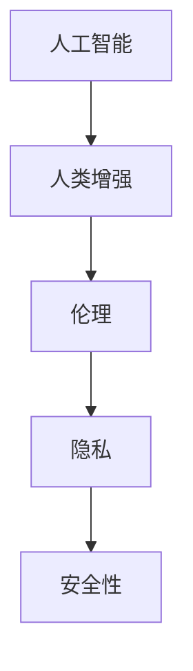

                 

随着人工智能（AI）技术的飞速发展，人类正面临着前所未有的变革。AI不仅改变了我们的生活方式，还在一定程度上增强了人类的认知能力和工作效率。然而，这一技术进步的同时，也引发了道德、隐私和安全等多方面的挑战。本文将深入探讨这些挑战，并提出可能的解决方案。

## 1. 背景介绍

人工智能，作为计算机科学的一个分支，旨在使机器具备人类智能的能力。从最初的规则基础系统，到如今的深度学习和神经网络，AI已经取得了显著的进步。随着AI技术的日益成熟，人们开始探索如何利用AI来增强人类的能力。例如，智能眼镜可以帮助视障人士“看到”世界，智能助理可以协助处理日常事务，甚至人工智能手术机器人能够提供更精确的手术操作。

### AI技术的演进

AI的发展可以分为以下几个阶段：

- **规则基础系统**：最早期的AI系统依赖于预定义的规则进行工作。
- **知识表示**：在这一阶段，AI系统开始使用知识库来存储信息，并利用推理机制进行问题求解。
- **机器学习**：通过训练数据集，机器学习算法能够让AI系统自动学习和改进。
- **深度学习**：深度学习是机器学习的一个子领域，它使用多层神经网络来模拟人类大脑的学习方式。
- **强化学习**：通过试错和反馈机制，强化学习算法能够使得AI系统在特定环境中取得最佳表现。

### 人类增强的概念

人类增强（Human Enhancement）指的是利用技术手段提升人类的生理、心理和社会功能。这种增强可以是在人体外部，例如使用智能设备来提升感知能力；也可以是在人体内部，例如通过基因编辑来增强免疫系统。随着AI技术的进步，人类增强的范围和深度正在不断扩大。

## 2. 核心概念与联系

### 人工智能与人类增强的关系

人工智能和人类增强之间存在着紧密的联系。AI技术提供了实现人类增强的手段，而人类增强又为AI的发展提供了新的应用场景。例如，智能眼镜和智能手环等设备通过AI算法来分析用户的行为和情绪，从而提供个性化的增强服务。

### 伦理与隐私

随着人类增强技术的发展，伦理和隐私问题变得日益重要。人类增强可能会加剧社会不平等，因为只有富裕人群才能负担得起这些技术。此外，个人隐私可能会受到侵犯，因为增强技术需要收集和处理大量的个人数据。

### 安全性

安全性是人类增强技术面临的另一个重大挑战。智能设备和AI算法可能会被黑客攻击，从而导致隐私泄露或功能失效。此外，人类增强技术也可能会产生意想不到的副作用，对用户的健康和安全造成威胁。

### Mermaid流程图



## 3. 核心算法原理 & 具体操作步骤

### 3.1 算法原理概述

人类增强技术的核心算法通常包括以下几个方面：

- **机器学习**：通过训练数据集来优化模型，从而实现特定任务的能力。
- **深度学习**：使用多层神经网络来模拟人类大脑的学习方式，提高模型的复杂度和准确性。
- **强化学习**：通过试错和反馈机制，让AI系统在特定环境中取得最佳表现。

### 3.2 算法步骤详解

1. **数据收集**：收集与人类增强相关的数据，包括生理数据、行为数据和环境数据等。
2. **数据预处理**：对收集到的数据进行分析和清洗，确保数据的质量和一致性。
3. **模型训练**：使用机器学习和深度学习算法来训练模型，使其能够对数据进行有效的分析和预测。
4. **模型评估**：通过测试数据集来评估模型的性能，并进行必要的调整和优化。
5. **模型部署**：将训练好的模型部署到实际应用场景中，为用户提供增强服务。

### 3.3 算法优缺点

- **优点**：
  - 提高人类的工作效率和认知能力。
  - 开拓新的应用场景，如辅助医疗、智能教育等。
- **缺点**：
  - 可能导致社会不平等加剧。
  - 存在隐私和安全风险。
  - 需要大量的计算资源和数据支持。

### 3.4 算法应用领域

- **医疗保健**：利用AI技术来辅助诊断、治疗和康复。
- **教育**：通过智能辅导系统和个性化学习平台来提升教育质量。
- **军事**：使用AI技术来提高作战效能和决策能力。

## 4. 数学模型和公式 & 详细讲解 & 举例说明

### 4.1 数学模型构建

在人类增强技术中，常用的数学模型包括神经网络模型、决策树模型和回归模型等。以下是神经网络模型的一个基本例子：

$$
y = \sigma(W_1 \cdot x + b_1)
$$

其中，$y$ 是输出，$\sigma$ 是激活函数，$W_1$ 是权重矩阵，$x$ 是输入，$b_1$ 是偏置。

### 4.2 公式推导过程

以神经网络模型为例，其推导过程如下：

1. **输入层到隐藏层的传递**：

$$
z_i = W_1 \cdot x + b_1
$$

2. **应用激活函数**：

$$
a_i = \sigma(z_i)
$$

3. **输出层的传递**：

$$
z_j = W_2 \cdot a + b_2
$$

4. **应用激活函数**：

$$
y_j = \sigma(z_j)
$$

### 4.3 案例分析与讲解

假设我们要训练一个神经网络模型来预测一个人的健康状况。输入层包含年龄、体重指数（BMI）和血压等特征，隐藏层使用ReLU激活函数，输出层是一个二分类问题，输出健康（1）或疾病（0）。

通过调整权重和偏置，模型能够逐步优化其预测能力。在实际应用中，我们需要使用大量的训练数据来训练模型，并通过交叉验证来评估模型的性能。

## 5. 项目实践：代码实例和详细解释说明

### 5.1 开发环境搭建

为了实现人类增强技术，我们需要搭建一个包含Python、TensorFlow和Keras等工具的开发环境。以下是安装步骤：

```bash
pip install numpy tensorflow keras
```

### 5.2 源代码详细实现

以下是使用Keras实现一个简单的神经网络模型的代码：

```python
from keras.models import Sequential
from keras.layers import Dense, Activation

model = Sequential()
model.add(Dense(units=64, activation='relu', input_dim=3))
model.add(Dense(units=1, activation='sigmoid'))

model.compile(optimizer='adam', loss='binary_crossentropy', metrics=['accuracy'])
```

### 5.3 代码解读与分析

这段代码定义了一个包含一个隐藏层的神经网络模型，输入层有3个神经元，隐藏层有64个神经元，输出层有1个神经元。模型使用ReLU作为激活函数，输出层使用sigmoid函数进行二分类。

### 5.4 运行结果展示

```python
model.fit(X_train, y_train, epochs=10, batch_size=32)
```

这段代码将训练模型10个周期，每个周期处理32个样本。训练完成后，可以使用测试集来评估模型的性能：

```python
score = model.evaluate(X_test, y_test)
print('Test accuracy:', score[1])
```

## 6. 实际应用场景

### 6.1 医疗保健

AI技术可以在医疗保健领域发挥重要作用。例如，通过分析患者的医疗记录和基因数据，AI可以预测疾病的风险，提供个性化的治疗方案。

### 6.2 教育

智能教育平台可以通过分析学生的学习行为，提供个性化的学习建议，从而提高学习效果。

### 6.3 军事

在军事领域，AI技术可以用于智能决策支持系统和自主武器系统，提高作战效能和安全性。

## 7. 未来应用展望

随着AI技术的不断进步，人类增强将在更多领域得到应用。未来，我们可能会看到更多的智能设备、智能辅助系统和智能药物等。

### 7.1 学习资源推荐

- 《深度学习》（Goodfellow, Bengio, Courville）
- 《Python机器学习》（Sebastian Raschka）

### 7.2 开发工具推荐

- TensorFlow
- Keras
- PyTorch

### 7.3 相关论文推荐

- "Deep Learning for Human Pose Estimation: A Survey"（2018）
- "Human Enhancement Technologies: An Ethical Analysis"（2016）

## 8. 总结：未来发展趋势与挑战

### 8.1 研究成果总结

AI技术在人类增强领域已经取得了显著的进展，但在伦理、隐私和安全等方面仍存在许多挑战。

### 8.2 未来发展趋势

未来，人类增强技术将向更智能化、个性化和集成化的方向发展。

### 8.3 面临的挑战

伦理问题、隐私保护、安全性保障和普及性问题将是未来研究的重要方向。

### 8.4 研究展望

随着AI技术的不断进步，人类增强技术有望在未来带来更多颠覆性的变革。

## 9. 附录：常见问题与解答

### Q：人类增强技术是否会导致社会不平等？

A：是的，人类增强技术可能会加剧社会不平等，因为只有富裕人群才能负担得起这些技术。因此，需要制定相应的政策和法规来确保技术的公平性和普及性。

### Q：人类增强技术是否会影响人类的道德价值观？

A：是的，人类增强技术可能会影响人类的道德价值观。我们需要认真思考和讨论这些问题，确保技术的应用不会违背人类的基本伦理原则。

## 参考文献

- Goodfellow, I., Bengio, Y., & Courville, A. (2016). Deep learning. MIT press.
- Raschka, S. (2015). Python machine learning. Packt Publishing.
```


