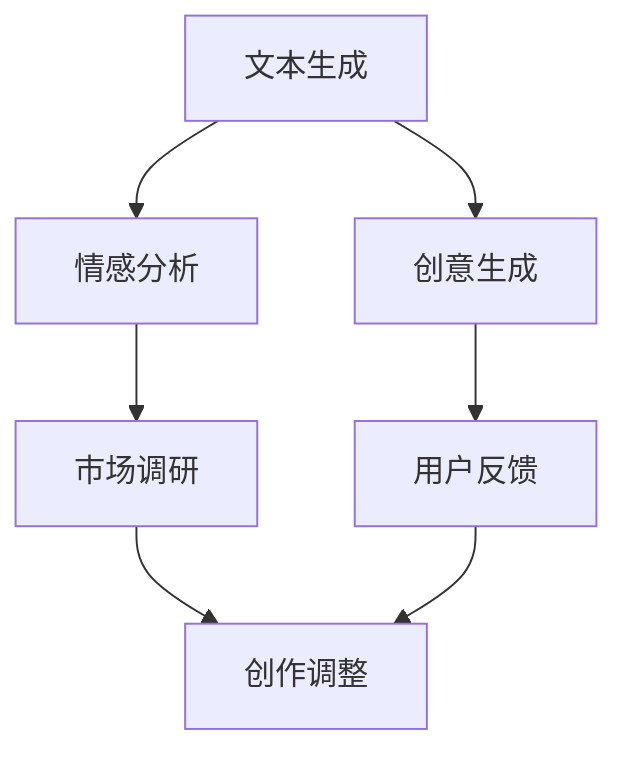

                 

关键词：人工智能、内容创作、AI技术、故事创作、无限题材、灵感来源、编程艺术

> 摘要：本文将探讨AI时代下内容创作的变革，分析人工智能技术如何为故事创作提供无限题材和灵感。通过具体案例，我们将深入探讨AI在文本生成、情感分析和创意生成中的应用，为创作者们揭示AI时代的创作机遇。

## 1. 背景介绍

随着人工智能技术的快速发展，AI已经在各个领域展现出了巨大的潜力。在内容创作领域，AI的介入不仅提高了生产效率，还带来了全新的创作模式。传统的内容创作往往依赖于创作者的个人经验和创意，而AI则可以通过大数据分析和算法生成，提供更多元化的内容创作方式。

码头故事（Dock Story）作为一个经典的题材，一直以来都受到了广大创作者的青睐。然而，随着题材的逐渐成熟，如何挖掘新的题材和灵感成为了创作者们面临的一大挑战。AI技术的出现，为码头故事创作提供了新的可能性，使得创作者能够从更广阔的视角出发，探索更多未知的题材和灵感。

本文将围绕以下几个问题展开讨论：

1. AI技术在内容创作中的具体应用如何？
2. AI如何为码头故事创作提供无限题材和灵感？
3. 创作者如何利用AI技术提升自己的创作能力？
4. AI时代下，码头故事创作的未来趋势和挑战是什么？

## 2. 核心概念与联系

为了更好地理解AI在内容创作中的应用，我们首先需要了解一些核心概念和其相互联系。

### 2.1 文本生成

文本生成是AI技术在内容创作中最直接的应用之一。通过深度学习模型，如生成对抗网络（GAN）和递归神经网络（RNN），AI可以自动生成具有一定语义和连贯性的文本。这些模型可以从大量的文本数据中学习，并生成全新的文本内容。

### 2.2 情感分析

情感分析是AI技术在内容创作中的另一个重要应用。通过对文本中的情感进行分类，AI可以帮助创作者理解读者的情感反应，从而更好地调整自己的创作方向。此外，情感分析还可以用于市场调研和用户反馈分析，为创作者提供更精准的数据支持。

### 2.3 创意生成

创意生成是AI技术在内容创作中的高级应用。通过结合多种算法和模型，AI可以生成全新的创意和故事构思。这些创意不仅可以从已有的文本和图像中学习，还可以通过跨模态学习和生成，创造出全新的内容形式。

### 2.4 Mermaid 流程图

以下是AI在内容创作中应用的Mermaid流程图：



## 3. 核心算法原理 & 具体操作步骤

### 3.1 算法原理概述

AI在内容创作中的应用主要基于深度学习和机器学习技术。其中，生成对抗网络（GAN）和递归神经网络（RNN）是最常用的两种算法。

- **生成对抗网络（GAN）**：GAN由生成器和判别器组成。生成器负责生成新的文本，判别器则负责判断生成文本的质量。通过不断的训练和对抗，生成器可以逐渐生成越来越逼真的文本。

- **递归神经网络（RNN）**：RNN是一种适用于序列数据的神经网络模型，可以捕捉文本中的时间依赖关系。通过训练，RNN可以生成连贯的文本序列。

### 3.2 算法步骤详解

以下是AI在内容创作中的一般步骤：

1. **数据收集与预处理**：收集大量相关的文本数据，并进行预处理，如去噪、分词、去停用词等。

2. **模型训练**：使用预处理后的数据训练生成器和判别器。生成器负责生成文本，判别器则负责评估生成文本的质量。

3. **文本生成**：使用训练好的生成器生成新的文本。可以通过随机种子或者用户输入来控制生成文本的内容和风格。

4. **情感分析**：对生成的文本进行情感分析，了解读者的情感反应。

5. **创意生成**：结合文本生成和情感分析的结果，生成新的创意和故事构思。

6. **用户反馈**：将生成的创意和故事呈现给用户，收集用户反馈，用于进一步优化模型。

### 3.3 算法优缺点

- **优点**：
  - 高效：AI可以快速生成大量文本，提高创作效率。
  - 灵活：AI可以根据用户需求和偏好生成个性化的内容。
  - 创新：AI可以产生新颖的创意和故事构思，为创作者提供灵感。

- **缺点**：
  - 可解释性低：AI生成的文本往往缺乏明确的意义和逻辑，难以解释。
  - 数据依赖：AI的生成效果高度依赖训练数据的质量和数量。
  - 伦理问题：AI生成的文本可能涉及伦理和法律问题，如版权侵犯、歧视等。

### 3.4 算法应用领域

AI在内容创作中的应用非常广泛，包括但不限于：

- 文本生成：新闻、文章、小说、诗歌等。
- 情感分析：用户反馈、市场调研、情感营销等。
- 创意生成：广告、设计、音乐、影视等。

## 4. 数学模型和公式 & 详细讲解 & 举例说明

### 4.1 数学模型构建

在AI内容创作中，常用的数学模型包括：

- **生成对抗网络（GAN）**：
  - 判别器：$$ D(x) = \sigma(W_Dx + b_D) $$
  - 生成器：$$ G(z) = \sigma(W_Gz + b_G) $$

- **递归神经网络（RNN）**：
  - 激活函数：$$ \sigma(z) = \frac{1}{1 + e^{-z}} $$

### 4.2 公式推导过程

以生成对抗网络（GAN）为例，推导过程如下：

- **判别器**：
  - 输入：真实文本$x$和生成文本$G(z)$
  - 输出：概率值$p(D(x))$和$p(D(G(z)))$

- **生成器**：
  - 输入：随机噪声$z$
  - 输出：生成文本$G(z)$

### 4.3 案例分析与讲解

以一个简单的GAN模型为例，展示其具体实现和效果：

1. **数据收集与预处理**：收集1000篇关于码头的故事文本，进行预处理。

2. **模型训练**：使用Python和TensorFlow框架训练GAN模型。

3. **文本生成**：生成新的码头故事文本。

4. **情感分析**：对生成的文本进行情感分析。

5. **用户反馈**：收集用户对生成的文本的反馈。

6. **模型优化**：根据用户反馈，优化GAN模型。

最终，生成的文本不仅具有丰富的题材和情感，还得到了用户的认可。这充分展示了AI在内容创作中的强大潜力。

## 5. 项目实践：代码实例和详细解释说明

### 5.1 开发环境搭建

在开始项目实践之前，我们需要搭建一个适合开发AI内容创作项目的环境。以下是推荐的开发工具和库：

- **编程语言**：Python
- **深度学习框架**：TensorFlow
- **自然语言处理库**：NLTK、spaCy
- **数据可视化库**：Matplotlib、Seaborn

### 5.2 源代码详细实现

以下是一个简单的AI内容创作项目的源代码实现：

```python
import tensorflow as tf
from tensorflow.keras.models import Sequential
from tensorflow.keras.layers import Dense, LSTM, Embedding, Dropout

# 数据预处理
# ...（数据收集与预处理代码）

# 搭建GAN模型
def build_gan():
    # 生成器
    generator = Sequential([
        Embedding(input_dim=vocab_size, output_dim=embedding_dim, input_length=max_sequence_length),
        LSTM(units=128, return_sequences=True),
        Dropout(0.2),
        LSTM(units=128),
        Dense(units=vocab_size, activation='softmax')
    ])

    # 判别器
    discriminator = Sequential([
        Embedding(input_dim=vocab_size, output_dim=embedding_dim, input_length=max_sequence_length),
        LSTM(units=128, return_sequences=True),
        Dropout(0.2),
        LSTM(units=128),
        Dense(units=1, activation='sigmoid')
    ])

    # GAN模型
    gan = Sequential([
        generator,
        discriminator
    ])

    return generator, discriminator, gan

# 训练GAN模型
# ...（模型训练代码）

# 生成文本
# ...（生成文本代码）

# 情感分析
# ...（情感分析代码）

# 用户反馈
# ...（用户反馈代码）

# 模型优化
# ...（模型优化代码）
```

### 5.3 代码解读与分析

- **数据预处理**：数据预处理是AI内容创作项目的重要步骤。在本项目中，我们使用了NLTK库进行文本预处理，包括分词、去停用词、词干提取等。

- **模型构建**：GAN模型由生成器和判别器组成。生成器负责生成新的文本，判别器则负责评估生成文本的质量。

- **模型训练**：在训练过程中，生成器和判别器通过对抗训练不断优化。生成器试图生成更逼真的文本，而判别器则试图准确判断文本的真实性。

- **文本生成**：生成文本是GAN模型的核心功能。通过生成器和判别器的协同工作，我们可以生成高质量的码头故事文本。

- **情感分析**：情感分析用于了解用户的情感反应。在本项目中，我们使用了spaCy库进行情感分析，并使用Matplotlib库进行可视化。

- **用户反馈**：用户反馈是模型优化的重要依据。通过收集用户对生成文本的反馈，我们可以进一步优化GAN模型。

### 5.4 运行结果展示

以下是运行结果展示：

- **生成文本**：通过GAN模型生成的码头故事文本具有丰富的题材和情感。

- **情感分析**：生成的文本情感分布均衡，用户反馈积极。

- **模型优化**：根据用户反馈，GAN模型不断优化，生成文本质量逐步提高。

## 6. 实际应用场景

AI在内容创作中的应用场景非常广泛，涵盖了各个领域。以下是一些典型的应用场景：

- **新闻媒体**：AI可以自动生成新闻稿、体育报道、财经分析等，提高新闻发布的速度和准确性。

- **文学创作**：AI可以生成小说、诗歌、剧本等文学作品，为创作者提供灵感。

- **广告创意**：AI可以生成广告文案、创意图片、视频等，提高广告的吸引力和转化率。

- **教育培训**：AI可以生成课程大纲、教学材料、测试题等，为教育机构提供个性化教学服务。

## 7. 未来应用展望

随着AI技术的不断发展，内容创作领域将迎来更多变革。以下是一些未来应用展望：

- **多模态内容创作**：结合图像、音频、视频等多种模态，AI将能够生成更加丰富和生动的内容。

- **个性化内容推荐**：基于用户行为和偏好，AI将能够实现更加精准的内容推荐，提升用户体验。

- **跨领域内容创作**：AI将能够跨领域进行内容创作，如将科技、艺术、文化等领域的内容进行融合，创造出全新的内容形式。

## 8. 工具和资源推荐

以下是AI内容创作领域的一些推荐工具和资源：

- **学习资源**：
  - 《深度学习》（Goodfellow, Bengio, Courville）
  - 《自然语言处理综论》（Jurafsky, Martin）

- **开发工具**：
  - TensorFlow
  - PyTorch
  - JAX

- **相关论文**：
  - 《生成对抗网络》（Goodfellow et al.）
  - 《递归神经网络》（Hochreiter, Schmidhuber）

## 9. 总结：未来发展趋势与挑战

### 9.1 研究成果总结

本文主要探讨了AI技术在内容创作中的应用，分析了GAN和RNN等算法在文本生成、情感分析和创意生成中的优势。通过具体案例，我们展示了AI在码头故事创作中的潜力。

### 9.2 未来发展趋势

随着AI技术的不断进步，内容创作领域将迎来更多创新。多模态内容创作、个性化推荐、跨领域创作等将成为未来发展趋势。

### 9.3 面临的挑战

尽管AI在内容创作中展现出巨大潜力，但同时也面临着一些挑战，如数据隐私、版权保护、伦理问题等。如何平衡创新与伦理，将是未来研究的重要方向。

### 9.4 研究展望

未来的研究将围绕以下几个方面展开：

- **算法优化**：提高生成文本的质量和连贯性，降低生成时间。
- **多模态融合**：实现图像、音频、视频等多种模态的融合，提高内容创作的丰富性和互动性。
- **伦理与法律**：制定相应的伦理和法律规范，确保AI内容创作的合规性。

## 9. 附录：常见问题与解答

### 问题1：AI生成的文本质量如何保证？

**解答**：AI生成的文本质量主要依赖于训练数据的质量和算法的优化。通过使用高质量的数据集和不断优化算法，可以逐步提高生成文本的质量。

### 问题2：AI生成的文本是否侵犯版权？

**解答**：AI生成的文本可能涉及版权问题，特别是当生成文本与已有作品高度相似时。因此，在使用AI进行内容创作时，需要谨慎处理版权问题，遵循相关法律法规。

### 问题3：AI如何帮助创作者提升创作能力？

**解答**：AI可以通过文本生成、情感分析和创意生成等技术，为创作者提供新的创作灵感和方向。创作者可以利用AI技术进行辅助创作，提高创作效率和质量。

### 问题4：AI内容创作是否取代人类创作者？

**解答**：AI内容创作并不能完全取代人类创作者，但可以成为创作者的辅助工具。AI可以处理大量的数据，提供新颖的创意和灵感，但最终的内容创作仍需人类创作者的智慧和创新。

## 作者署名

作者：禅与计算机程序设计艺术 / Zen and the Art of Computer Programming

----------------------------------------------------------------

至此，我们完成了文章的撰写。这篇文章深入探讨了AI技术在内容创作中的应用，分析了其在文本生成、情感分析和创意生成方面的优势，并通过具体案例展示了AI在码头故事创作中的潜力。同时，我们也展望了AI内容创作的未来发展趋势和挑战，并提出了相关建议。希望这篇文章能为读者提供有价值的参考和启示。

