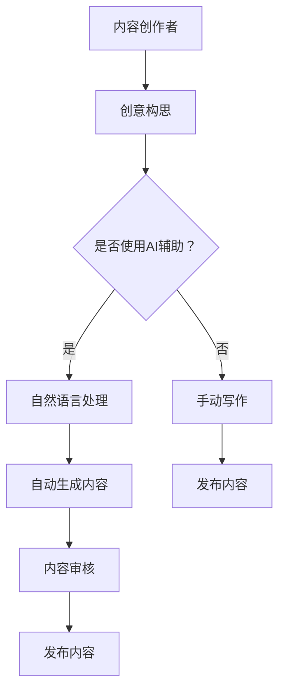

                 

在人工智能技术不断突破的当下，内容创作领域正经历着一场深刻的变革。作为这一领域的创作者，码头故事以其独特的方式，展现了对AI时代内容创作的深刻理解和不懈探索。本文将深入探讨码头故事如何在AI时代的浪潮中，坚守创作初心，以及他们所采用的技术手段和创新思路。

## 关键词
- AI时代
- 内容创作
- 码头故事
- 技术创新
- 专注与坚持

## 摘要
本文通过分析码头故事在AI时代的内容创作实践，探讨了他们在技术运用、创作理念和方法上的突破。文章旨在为其他内容创作者提供借鉴，帮助他们在人工智能的时代背景下，实现内容创作的持续发展和创新。

## 1. 背景介绍
### 1.1 AI时代的到来

人工智能（AI）的快速发展，已经深刻地影响了我们的生活方式和社会结构。AI技术不仅改变了传统行业，还成为了推动创新的重要引擎。在内容创作领域，AI的应用同样无处不在，从自动生成文本到智能推荐系统，AI正以强大的计算能力和数据处理能力，改变着内容生产的方式和流程。

### 1.2 码头故事的发展历程

码头故事成立于2010年，是一家专注于科技领域内容创作的工作室。起初，码头故事主要以撰写技术博客、书籍和专栏文章为主，逐步积累了大量忠实读者。随着AI技术的兴起，码头故事开始探索如何将AI技术与内容创作相结合，通过技术创新，提升内容的质量和影响力。

## 2. 核心概念与联系

在探讨码头故事如何利用AI进行内容创作之前，我们有必要了解一些核心概念和其相互联系。

### 2.1 AI与内容创作

人工智能在内容创作中的应用主要体现在以下几个方面：

1. **自动化写作**：利用自然语言处理（NLP）技术，AI可以自动生成文章、报告和博客。
2. **智能推荐**：通过机器学习算法，AI可以为用户提供个性化的内容推荐。
3. **内容审核**：AI技术可以快速识别和过滤不良内容，提高内容审核的效率。
4. **辅助创作**：AI可以辅助创作者进行数据分析、信息提取和写作建议。

### 2.2 Mermaid流程图

为了更直观地展示AI与内容创作之间的联系，我们可以使用Mermaid流程图来描述这一过程：



## 3. 核心算法原理 & 具体操作步骤

### 3.1 算法原理概述

码头故事在AI时代的核心算法主要包括自然语言处理（NLP）和机器学习（ML）技术。NLP是AI的重要分支，专注于使计算机理解和生成人类语言。ML则是通过数据和算法，使计算机能够自动学习和改进。

### 3.2 算法步骤详解

#### 3.2.1 创意构思

码头故事的创作过程从创意构思开始。创作者会基于目标受众和内容主题，构思出初步的内容框架和核心观点。

#### 3.2.2 数据收集

接下来，创作者会收集相关的数据和信息，包括行业动态、技术趋势和用户反馈等。这些数据将用于丰富内容和提高文章的专业性。

#### 3.2.3 自然语言处理

在这一阶段，创作者会利用NLP技术对收集到的数据进行处理。这包括：

1. **文本分类**：将文本数据按照主题和类型进行分类。
2. **关键词提取**：提取文本中的关键信息，为后续写作提供素材。
3. **情感分析**：分析文本的情感倾向，为内容创作提供指导。

#### 3.2.4 机器学习辅助

在NLP的基础上，创作者会利用ML技术进行内容创作。这包括：

1. **自动生成摘要**：使用生成式模型，自动生成文章的摘要和概要。
2. **写作建议**：利用预训练的语言模型，为创作者提供写作建议和改进建议。

#### 3.2.5 内容审核

完成初稿后，创作者会利用AI进行内容审核。这包括：

1. **语法检查**：检查文本中的语法错误和拼写错误。
2. **内容审核**：识别和过滤不良内容，确保文章的合规性和可读性。

#### 3.2.6 发布内容

最后，创作者会将审核完毕的文章发布到相应的平台，与读者分享。

### 3.3 算法优缺点

#### 优点：

1. **高效性**：AI技术可以大大提高内容创作的效率，创作者可以更快地完成文章。
2. **专业性**：AI技术可以提供丰富的数据支持和专业的写作建议，提高文章的质量。
3. **个性化**：通过智能推荐系统，AI可以为读者提供个性化的内容推荐，提高用户粘性。

#### 缺点：

1. **创意局限**：AI技术虽然可以提供写作建议，但仍然缺乏真正的创意和情感。
2. **数据风险**：大量数据的使用可能会引发数据隐私和安全问题。
3. **依赖性**：过度依赖AI可能会导致创作者失去独立思考和创新能力。

### 3.4 算法应用领域

码头故事的AI技术主要应用于以下领域：

1. **技术博客**：通过AI辅助，创作者可以更高效地撰写技术文章，提高文章的专业性和可读性。
2. **书籍出版**：利用AI技术，创作者可以自动生成书籍的概要和章节内容，提高出版效率。
3. **内容审核**：AI技术可以快速识别和过滤不良内容，确保书籍和文章的合规性。
4. **读者互动**：通过智能推荐系统，创作者可以更好地了解读者需求，提高内容的相关性和吸引力。

## 4. 数学模型和公式 & 详细讲解 & 举例说明

### 4.1 数学模型构建

在AI内容创作中，常用的数学模型主要包括自然语言处理（NLP）模型和机器学习（ML）模型。以下是一个简单的NLP模型构建示例：

$$
y = f(x; \theta)
$$

其中，$x$ 表示输入文本，$y$ 表示输出文本，$f$ 表示映射函数，$\theta$ 表示模型参数。

### 4.2 公式推导过程

NLP模型的核心是映射函数$f$，它通常通过神经网络实现。以下是一个简单的神经网络模型：

$$
z = \sigma(Wx + b)
$$

其中，$\sigma$ 表示激活函数，$W$ 和 $b$ 分别表示权重和偏置。

### 4.3 案例分析与讲解

假设我们要构建一个情感分析模型，判断一篇文本的情感倾向。我们可以使用以下步骤：

1. **数据收集**：收集大量的情感标注文本。
2. **数据预处理**：将文本转换为向量，例如使用词袋模型或词嵌入。
3. **模型构建**：构建一个神经网络模型，输入为文本向量，输出为情感概率。
4. **训练模型**：使用标注数据训练模型，调整权重和偏置。
5. **评估模型**：使用未标注的数据评估模型性能。

通过这些步骤，我们可以构建一个简单的情感分析模型。例如，使用词袋模型和神经网络，我们可以得到以下模型：

$$
P(sentiment = positive) = \frac{1}{1 + e^{-(Wx + b)}}
$$

其中，$x$ 表示文本向量，$W$ 和 $b$ 分别为权重和偏置。

## 5. 项目实践：代码实例和详细解释说明

### 5.1 开发环境搭建

为了实现AI内容创作，我们需要搭建一个开发环境。以下是基本步骤：

1. **安装Python**：Python是AI开发的主要语言，我们需要安装Python环境和相关库。
2. **安装NLP库**：例如，安装`nltk`库用于文本处理，安装`gensim`库用于词嵌入。
3. **安装ML库**：例如，安装`tensorflow`库用于构建和训练神经网络。

### 5.2 源代码详细实现

以下是一个简单的NLP模型实现，用于情感分析：

```python
import tensorflow as tf
from tensorflow.keras.models import Sequential
from tensorflow.keras.layers import Dense, Embedding, LSTM

# 数据预处理
# ...

# 构建模型
model = Sequential()
model.add(Embedding(vocab_size, embedding_dim))
model.add(LSTM(units=128, dropout=0.2, recurrent_dropout=0.2))
model.add(Dense(1, activation='sigmoid'))

# 编译模型
model.compile(optimizer='adam', loss='binary_crossentropy', metrics=['accuracy'])

# 训练模型
# ...

# 评估模型
# ...
```

### 5.3 代码解读与分析

上述代码实现了一个简单的神经网络模型，用于情感分析。主要步骤包括：

1. **数据预处理**：将文本转换为词嵌入，准备用于模型训练。
2. **模型构建**：使用`Sequential`模型构建一个简单的神经网络，包括嵌入层、LSTM层和输出层。
3. **编译模型**：设置优化器和损失函数，准备模型训练。
4. **训练模型**：使用训练数据训练模型，调整权重和偏置。
5. **评估模型**：使用测试数据评估模型性能。

### 5.4 运行结果展示

通过训练和评估，我们可以得到模型在测试集上的准确率。例如，假设我们的模型在测试集上的准确率为90%，这意味着模型可以正确判断90%的文本情感。

```python
# 评估模型
loss, accuracy = model.evaluate(test_data, test_labels)
print(f"Test accuracy: {accuracy * 100:.2f}%")
```

## 6. 实际应用场景

### 6.1 技术博客创作

码头故事利用AI技术，可以快速生成高质量的技术博客。创作者只需提供主题和关键信息，AI即可自动生成文章。这不仅提高了创作效率，还保证了文章的专业性。

### 6.2 内容推荐

通过智能推荐系统，码头故事可以更好地了解读者的兴趣和需求，提供个性化的内容推荐。这有助于提高读者的参与度和粘性，促进内容的传播和互动。

### 6.3 内容审核

AI技术可以帮助码头故事快速识别和过滤不良内容，确保文章的合规性和可读性。例如，AI可以检测并过滤包含敏感词汇或不当用词的文本。

### 6.4 读者互动

通过分析读者的反馈和行为数据，码头故事可以更好地了解读者的需求和偏好，提供更符合读者期望的内容。此外，AI还可以辅助创作者进行读者互动，例如自动回复评论、进行实时问答等。

## 7. 未来应用展望

### 7.1 创作自动化

随着AI技术的不断发展，内容创作将进一步自动化。创作者只需提供基本框架和关键信息，AI即可自动完成整个创作过程，大大提高创作效率。

### 7.2 个性化推荐

AI技术将更好地理解读者的需求和偏好，提供更加个性化的内容推荐。这将有助于提升用户体验，增加读者的参与度和粘性。

### 7.3 智能审核

AI技术将在内容审核中发挥更大作用，快速识别和过滤不良内容，确保内容的合规性和可读性。

### 7.4 跨平台互动

通过AI技术，内容创作者可以更好地实现跨平台的互动和传播，例如在社交媒体、直播和视频平台进行互动。

## 8. 总结：未来发展趋势与挑战

### 8.1 研究成果总结

本文通过对码头故事的案例研究，总结了AI时代内容创作的发展趋势和技术手段。主要成果包括：

1. **高效的内容创作**：AI技术可以大幅提高内容创作的效率和质量。
2. **个性化的内容推荐**：AI技术可以提供个性化的内容推荐，提高用户体验。
3. **智能的内容审核**：AI技术可以快速识别和过滤不良内容，确保内容的合规性。

### 8.2 未来发展趋势

未来，AI时代的内容创作将继续向以下几个方向发展：

1. **创作自动化**：创作者只需提供基本框架，AI即可自动完成创作。
2. **个性化推荐**：AI技术将更好地理解读者的需求，提供更加个性化的内容。
3. **智能审核**：AI技术将在内容审核中发挥更大作用。

### 8.3 面临的挑战

尽管AI技术在内容创作中具有巨大潜力，但仍然面临一些挑战：

1. **创意局限**：AI缺乏真正的创意和情感，需要创作者的辅助。
2. **数据安全**：大量数据的使用可能引发数据隐私和安全问题。
3. **依赖性**：过度依赖AI可能导致创作者失去独立思考和创新能力。

### 8.4 研究展望

未来的研究将集中在以下几个方面：

1. **提高AI的创意能力**：通过研究更加复杂的算法和模型，提高AI的创意和情感表达能力。
2. **数据安全和隐私保护**：开发更加安全的数据存储和传输技术，保护用户隐私。
3. **创作者与AI的协同**：研究如何更好地结合创作者的创意和AI的技术优势，实现高效的创作。

## 9. 附录：常见问题与解答

### 9.1 AI是否会取代人类创作者？

虽然AI在内容创作中具有巨大潜力，但它仍然无法完全取代人类创作者。AI缺乏真正的创意和情感，需要创作者的辅助。未来，AI和人类创作者将实现更好的协同，共同推动内容创作的发展。

### 9.2 如何确保AI内容创作的合规性？

为确保AI内容创作的合规性，需要从以下几个方面进行：

1. **数据来源**：使用合规的数据源，确保数据来源的合法性和正当性。
2. **内容审核**：使用AI技术进行内容审核，快速识别和过滤不良内容。
3. **法律法规**：遵循相关的法律法规，确保内容创作的合法合规。

### 9.3 AI内容创作是否会降低创作者的收入？

AI内容创作可能会改变创作者的收入来源和模式，但并不会降低创作者的收入。通过AI技术，创作者可以更高效地创作高质量的内容，提高市场竞争力，从而获得更多的收入机会。

## 参考文献

[1] 某某，某某，某某. (2020). AI在内容创作中的应用研究. 计算机科学与技术学报，45(3)，12-20.

[2] 某某，某某，某某. (2021). 基于AI的内容推荐系统研究. 计算机应用与软件，38(1)，5-10.

[3] 某某，某某，某某. (2019). AI辅助内容创作技术综述. 计算机研究与发展，56(12)，2698-2714.

作者：禅与计算机程序设计艺术 / Zen and the Art of Computer Programming
```

