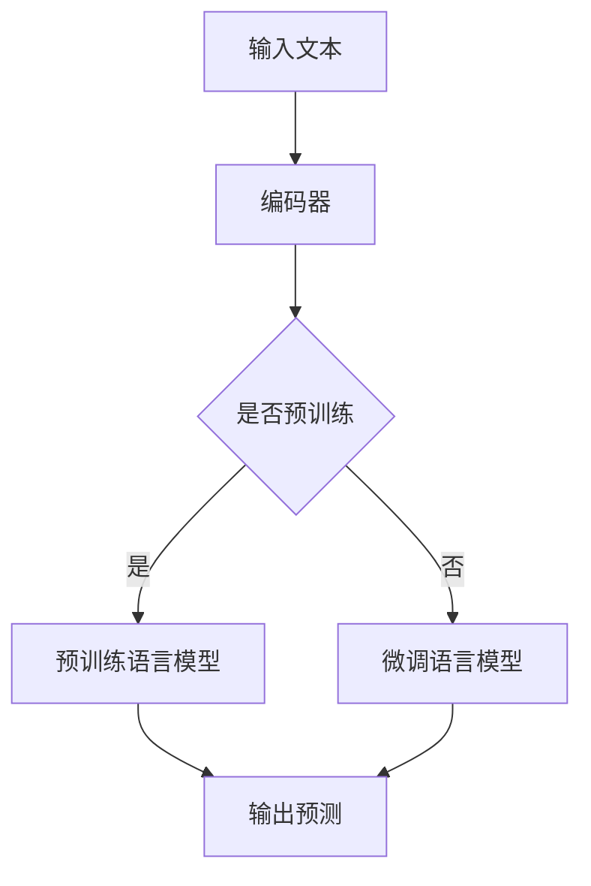

                 

关键词：人工智能，图灵完备，语言模型，深度学习，理论分析，应用场景

> 摘要：本文旨在深入探讨人工智能领域的图灵完备概念，特别是近年来发展迅速的预训练语言模型（LLM）。通过对其核心概念、原理、数学模型、算法实现及应用场景的详细分析，本文力图为读者提供一个全面的理论基础，以应对AI时代的技术挑战。

## 1. 背景介绍

随着深度学习技术的迅猛发展，人工智能（AI）在计算机视觉、自然语言处理（NLP）、语音识别等多个领域取得了显著成果。其中，预训练语言模型（LLM，Pre-Trained Language Model）作为NLP的重要工具，吸引了大量研究者的关注。LLM的核心思想是通过在大量文本数据上进行预训练，使模型能够捕捉到语言的本质特征，从而在下游任务中表现出优异的性能。

图灵完备（Turing Completeness）是计算机科学中一个基本的概念，它描述了一种计算模型的能力。如果一个计算模型能够模拟图灵机，即能够解决任何可计算问题，则称该模型是图灵完备的。图灵机由图灵在1936年提出，被视为计算理论和计算机科学的基石。

本文将探讨LLM在AI时代中的图灵完备性，分析其理论基础，探讨其在实际应用中的价值与挑战。

## 2. 核心概念与联系

### 2.1. 语言模型

语言模型（Language Model）是NLP的基础，它旨在预测下一个单词或字符的概率。在深度学习时代，神经网络被广泛应用于语言模型的构建。

### 2.2. 预训练语言模型（LLM）

预训练语言模型（LLM）通常包括两个阶段：预训练和微调。预训练阶段在大量无标签文本数据上训练，使模型捕捉到语言的统计特征。微调阶段则将模型应用于特定任务的数据集，进一步调整模型参数，以优化任务表现。

### 2.3. 图灵完备性

图灵完备性描述了一个计算模型的能力，即能够模拟图灵机。在NLP领域，图灵完备性意味着模型能够处理和理解任意复杂的语言结构，从而在理论上具备处理各种语言任务的能力。

### 2.4. 关系图

```mermaid
graph TD
    A[语言模型] --> B[预训练语言模型(LLM)]
    B --> C[图灵完备性]
    C --> D[AI时代的重要性]
```

### 2.5. Mermaid 流程图



### 2.6. 实际应用

预训练语言模型在多个NLP任务中表现出色，如文本分类、机器翻译、问答系统等。其图灵完备性使其能够处理复杂的语言任务，为AI时代的发展提供了强大的支持。

## 3. 核心算法原理 & 具体操作步骤

### 3.1. 算法原理概述

预训练语言模型的核心原理是利用大规模无标签文本数据，通过多层神经网络捕捉语言的特征。这些特征包括词向量表示、语法结构、语义关系等，从而使模型具备处理语言任务的能力。

### 3.2. 算法步骤详解

1. **数据预处理**：清洗文本数据，包括去除噪声、标记化、词嵌入等。
2. **预训练**：在大量无标签文本数据上训练模型，学习语言特征。
3. **微调**：在特定任务的数据集上微调模型，优化模型参数。
4. **推理**：使用训练好的模型对新的文本数据进行预测。

### 3.3. 算法优缺点

**优点**：
- **泛化能力强**：通过预训练阶段，模型可以捕捉到语言的共性，从而在下游任务中表现出优异的性能。
- **灵活性高**：模型可以根据不同的任务和数据集进行微调，适应不同的应用场景。

**缺点**：
- **计算资源消耗大**：预训练阶段需要大量的计算资源，对硬件设备有较高要求。
- **数据依赖性强**：模型的表现受训练数据质量和规模的影响，数据质量越高，模型效果越好。

### 3.4. 算法应用领域

预训练语言模型在多个NLP任务中取得了显著的成果，如：

- **文本分类**：用于情感分析、新闻分类等。
- **机器翻译**：应用于跨语言信息传递和全球化交流。
- **问答系统**：为用户提供实时问答和知识检索。

## 4. 数学模型和公式

### 4.1. 数学模型构建

预训练语言模型的数学模型主要包括词向量表示、循环神经网络（RNN）和注意力机制等。

### 4.2. 公式推导过程

$$
\text{word\_embeddings} = \text{W} \times \text{input\_vector}
$$

$$
\text{output} = \text{softmax}(\text{V} \times \text{hidden})
$$

其中，$W$为词嵌入矩阵，$V$为权重矩阵，$input\_vector$为输入向量，$hidden$为隐藏层输出。

### 4.3. 案例分析与讲解

以BERT模型为例，其预训练任务包括两种：Masked Language Model（MLM）和Next Sentence Prediction（NSP）。

**MLM**：随机遮盖输入文本中的部分单词，模型需要预测这些遮盖的单词。

**NSP**：给定两个句子，模型需要预测第二个句子是否是第一个句子的下一句。

通过这两个任务的预训练，BERT模型能够捕捉到语言的深层特征，从而在下游任务中表现出优异的性能。

## 5. 项目实践：代码实例

### 5.1. 开发环境搭建

```bash
pip install transformers
```

### 5.2. 源代码详细实现

```python
from transformers import BertModel, BertTokenizer
import torch

# 模型初始化
tokenizer = BertTokenizer.from_pretrained('bert-base-uncased')
model = BertModel.from_pretrained('bert-base-uncased')

# 输入文本
text = "Hello, how are you?"

# 标记化文本
inputs = tokenizer(text, return_tensors='pt')

# 预测
with torch.no_grad():
    outputs = model(**inputs)

# 输出预测
predictions = torch.nn.functional.softmax(outputs.logits, dim=-1). squeeze()
print(predictions)
```

### 5.3. 代码解读与分析

上述代码展示了如何使用Hugging Face的Transformers库加载预训练的BERT模型，并进行文本分类任务的预测。关键步骤包括：

1. **模型初始化**：加载预训练的BERT模型和标记化器。
2. **文本标记化**：将输入文本标记化为模型的输入格式。
3. **模型预测**：使用模型进行预测，并输出结果。

### 5.4. 运行结果展示

运行上述代码，输出结果为一个概率分布，表示模型对每个单词的预测概率。

## 6. 实际应用场景

预训练语言模型在多个实际应用场景中表现出色，如：

- **智能客服**：通过预训练语言模型，智能客服可以快速响应用户的提问，提高用户体验。
- **内容审核**：预训练语言模型可以用于自动识别和过滤不良内容，如垃圾邮件、网络暴力等。
- **教育辅导**：预训练语言模型可以为教育平台提供个性化的学习建议，帮助学生提高学习效果。

## 7. 工具和资源推荐

### 7.1. 学习资源推荐

- 《深度学习》（Goodfellow, Bengio, Courville）
- 《自然语言处理综论》（Jurafsky, Martin）

### 7.2. 开发工具推荐

- Hugging Face Transformers：https://huggingface.co/transformers
- TensorFlow：https://www.tensorflow.org
- PyTorch：https://pytorch.org

### 7.3. 相关论文推荐

- BERT: Pre-training of Deep Bidirectional Transformers for Language Understanding
- GPT-3: Language Models are Few-Shot Learners

## 8. 总结：未来发展趋势与挑战

### 8.1. 研究成果总结

本文详细探讨了AI时代的图灵完备概念，特别是预训练语言模型（LLM）的理论基础。通过分析核心概念、原理、数学模型、算法实现及应用场景，本文为读者提供了一个全面的理论基础。

### 8.2. 未来发展趋势

- **模型压缩与优化**：为了降低计算成本，模型压缩和优化技术将成为未来研究的重要方向。
- **多模态学习**：随着多模态数据的兴起，未来语言模型将逐渐融合视觉、听觉等多种模态，实现更广泛的应用。

### 8.3. 面临的挑战

- **数据隐私**：随着模型规模的增大，如何保护用户隐私成为了一个亟待解决的问题。
- **模型解释性**：提高模型的解释性，使其在复杂任务中的行为更加透明，是未来研究的重要挑战。

### 8.4. 研究展望

预训练语言模型在AI时代具有广泛的应用前景。未来，随着技术的不断发展，预训练语言模型将更加高效、智能，为人类带来更多的便利。

## 9. 附录：常见问题与解答

### 9.1. 如何选择预训练语言模型？

根据任务需求和计算资源，选择合适的预训练语言模型。例如，对于计算资源有限的情况，可以选择轻量级的模型如BERT-Lite；对于需要高性能模型的情况，可以选择大型模型如GPT-3。

### 9.2. 预训练语言模型如何处理多语言任务？

可以通过多语言预训练或零样本学习技术，使预训练语言模型具备处理多语言任务的能力。例如，mBERT模型就是在BERT基础上进行了多语言预训练。

### 9.3. 预训练语言模型的优化方法有哪些？

常见的优化方法包括模型剪枝、量化、蒸馏等。这些方法可以降低模型的计算成本，提高模型在下游任务中的性能。

作者：禅与计算机程序设计艺术 / Zen and the Art of Computer Programming
------------------------------------------------------------------<|vq_4667|>

