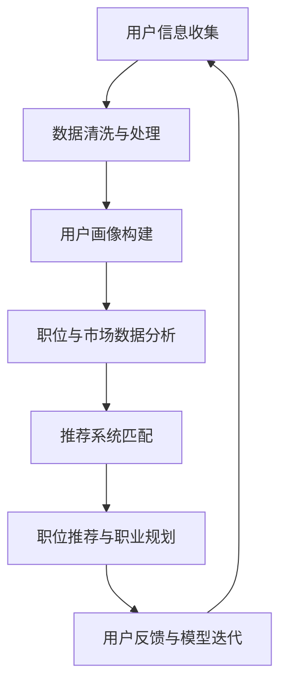

                 

关键词：人工智能，就业服务，职业生涯规划，个性化推荐，大数据分析，机器学习，就业市场

> 摘要：随着人工智能技术的迅猛发展，就业市场正在发生深刻变革。本文将探讨AI时代下就业服务的转型，特别是个性化就业服务和职业生涯规划的应用，分析其在提升就业质量和效率方面的作用，并展望未来的发展趋势。

## 1. 背景介绍

近年来，人工智能（AI）技术快速发展，已经深刻影响了各行各业。特别是在就业服务领域，AI的应用潜力巨大。传统就业服务往往依赖于人工匹配，效率低下，且无法满足个性化需求。而AI技术，通过大数据分析、机器学习和深度学习等方法，能够实现精准的个性化推荐，提高就业服务的质量和效率。

### 1.1 人工智能在就业服务领域的应用现状

当前，人工智能在就业服务领域已有诸多应用实例。例如，通过分析求职者的简历、技能和兴趣，AI能够为其推荐最合适的职位；通过对就业市场数据的实时监控，AI能够预测行业趋势和岗位需求，从而帮助求职者做出更有针对性的职业规划。

### 1.2 个性化就业服务的优势

个性化就业服务能够根据求职者的个人特点，如技能、经验、兴趣等，提供个性化的职位推荐和职业规划建议，从而提高求职成功率。此外，个性化服务还能帮助雇主更快地找到符合职位需求的人才，提升招聘效率。

### 1.3 职业生涯规划的重要性

职业生涯规划是求职者个人发展的重要组成部分。通过科学的规划，求职者能够更好地了解自己的职业兴趣和潜力，从而选择适合自己的职业道路，实现职业成长和自我价值。

## 2. 核心概念与联系

为了更好地理解AI在就业服务转型中的作用，我们首先需要了解一些核心概念和其之间的联系。

### 2.1 大数据分析

大数据分析是人工智能的基础之一。通过对海量数据的挖掘和分析，AI能够发现数据中的规律和模式，从而为决策提供支持。

### 2.2 机器学习

机器学习是AI的重要组成部分，通过训练模型，AI能够从数据中自动学习，并做出预测和决策。

### 2.3 深度学习

深度学习是机器学习的一种形式，通过构建多层神经网络，深度学习能够在复杂的数据上实现高度准确的预测。

### 2.4 个性化推荐系统

个性化推荐系统是AI在就业服务中的一个重要应用。通过分析用户的历史行为和偏好，推荐系统能够为用户推荐最相关的职位和职业规划建议。

### 2.5 Mermaid 流程图

下面是AI时代就业服务转型的一个简化流程图：



## 3. 核心算法原理 & 具体操作步骤

### 3.1 算法原理概述

AI时代的就业服务转型主要依赖于以下几个核心算法：

- **聚类算法**：用于对用户和职位进行分类和分组，以便进行后续的推荐。
- **协同过滤算法**：通过分析用户之间的相似性，推荐用户可能感兴趣的职业和职位。
- **神经网络算法**：用于构建职业规划模型，预测用户的职业发展路径。

### 3.2 算法步骤详解

1. **用户信息收集**：通过求职者的简历、社交媒体、职业测试等渠道收集用户信息。
2. **数据清洗与处理**：对收集到的数据进行去重、去噪、格式化等处理。
3. **用户画像构建**：利用聚类算法和协同过滤算法，构建用户的个性化画像。
4. **职位与市场数据分析**：对职位描述、薪资、工作地点等数据进行分析，构建职位画像。
5. **推荐系统匹配**：将用户画像与职位画像进行匹配，推荐最合适的职位。
6. **职位推荐与职业规划**：根据用户的反馈和需求，不断调整推荐策略，提供个性化的职业规划建议。
7. **用户反馈与模型迭代**：收集用户对推荐结果的反馈，优化推荐模型。

### 3.3 算法优缺点

#### 优点：

- **精准度高**：通过大数据分析和机器学习，推荐系统能够提供高度个性化的职位推荐。
- **效率高**：自动化推荐系统大大提高了职位匹配的效率，减少了人工筛选的时间。
- **用户体验好**：个性化的职业规划建议能够帮助求职者更好地规划自己的职业发展。

#### 缺点：

- **数据隐私问题**：收集和处理用户数据可能涉及隐私问题，需要严格保护用户的个人信息。
- **算法偏见**：算法可能因为数据偏差而产生偏见，影响推荐结果。

### 3.4 算法应用领域

AI在就业服务领域的应用已经非常广泛，包括但不限于：

- **招聘平台**：如LinkedIn、Indeed等，通过AI技术提供职位推荐和职业规划服务。
- **职业咨询**：通过AI技术为求职者提供个性化的职业咨询和建议。
- **人才管理**：为企业提供人才招聘、培训和晋升等方面的智能管理方案。

## 4. 数学模型和公式 & 详细讲解 & 举例说明

### 4.1 数学模型构建

在AI时代的就业服务转型中，常用的数学模型包括：

- **用户行为分析模型**：利用协同过滤算法，计算用户之间的相似度，预测用户的偏好。
- **职位推荐模型**：利用聚类算法，将职位划分为不同的类别，为用户推荐最相关的职位。

### 4.2 公式推导过程

#### 用户行为分析模型

假设有 \(n\) 个用户，每个用户的行为可以用一个向量表示，即 \(u_i \in \mathbb{R}^k\)，其中 \(i = 1, 2, ..., n\)。用户之间的相似度可以通过余弦相似度公式计算：

\[ \cos(\theta_{ij}) = \frac{u_i \cdot u_j}{\|u_i\|\|u_j\|} \]

其中，\(u_i \cdot u_j\) 表示用户 \(i\) 和用户 \(j\) 的行为向量点积，\(\|u_i\|\) 和 \(\|u_j\|\) 分别表示用户 \(i\) 和用户 \(j\) 的行为向量长度。

#### 职位推荐模型

假设有 \(m\) 个职位，每个职位可以用一个向量表示，即 \(v_j \in \mathbb{R}^k\)，其中 \(j = 1, 2, ..., m\)。职位之间的相似度可以通过余弦相似度公式计算：

\[ \cos(\theta_{kl}) = \frac{v_k \cdot v_l}{\|v_k\|\|v_l\|} \]

其中，\(v_k \cdot v_l\) 表示职位 \(k\) 和职位 \(l\) 的向量点积，\(\|v_k\|\) 和 \(\|v_l\|\) 分别表示职位 \(k\) 和职位 \(l\) 的向量长度。

### 4.3 案例分析与讲解

#### 案例一：用户行为分析

假设有两个用户 \(u_1\) 和 \(u_2\)，他们的行为向量分别为：

\[ u_1 = (1, 0, 1, 0), \quad u_2 = (1, 1, 0, 0) \]

计算这两个用户的余弦相似度：

\[ \cos(\theta_{12}) = \frac{u_1 \cdot u_2}{\|u_1\|\|u_2\|} = \frac{1 + 0 + 1 \cdot 0 + 0 \cdot 0}{\sqrt{1^2 + 0^2 + 1^2 + 0^2} \cdot \sqrt{1^2 + 1^2 + 0^2 + 0^2}} = \frac{2}{\sqrt{2} \cdot \sqrt{2}} = 1 \]

由于余弦相似度为1，说明这两个用户的行为完全一致。

#### 案例二：职位推荐

假设有两个职位 \(v_1\) 和 \(v_2\)，他们的向量分别为：

\[ v_1 = (1, 1, 0, 0), \quad v_2 = (1, 0, 1, 0) \]

计算这两个职位的余弦相似度：

\[ \cos(\theta_{12}) = \frac{v_1 \cdot v_2}{\|v_1\|\|v_2\|} = \frac{1 + 1 \cdot 0 + 0 \cdot 1 + 0 \cdot 0}{\sqrt{1^2 + 1^2 + 0^2 + 0^2} \cdot \sqrt{1^2 + 0^2 + 1^2 + 0^2}} = \frac{1}{\sqrt{2} \cdot \sqrt{2}} = \frac{1}{2} \]

由于余弦相似度为1/2，说明这两个职位在某个维度上有一半的相似度。

## 5. 项目实践：代码实例和详细解释说明

### 5.1 开发环境搭建

为了演示AI在就业服务中的应用，我们将使用Python语言，结合Scikit-learn库来实现一个简单的职位推荐系统。

```python
# 安装必要的库
!pip install numpy scikit-learn
```

### 5.2 源代码详细实现

```python
import numpy as np
from sklearn.metrics.pairwise import cosine_similarity
from sklearn.cluster import KMeans
from sklearn.preprocessing import StandardScaler

# 用户行为数据
user_behaviors = np.array([
    [1, 0, 1, 0],  # 用户1
    [1, 1, 0, 0],  # 用户2
    [0, 1, 1, 0],  # 用户3
    [0, 0, 1, 1],  # 用户4
])

# 职位数据
job_data = np.array([
    [1, 1, 0, 0],  # 职位1
    [1, 0, 1, 0],  # 职位2
    [0, 1, 1, 1],  # 职位3
    [0, 1, 1, 0],  # 职位4
])

# 标准化数据
scaler = StandardScaler()
user_scaled = scaler.fit_transform(user_behaviors)
job_scaled = scaler.fit_transform(job_data)

# 计算用户与职位之间的余弦相似度
similarity_matrix = cosine_similarity(user_scaled, job_scaled)

# 使用K-means算法对职位进行分类
kmeans = KMeans(n_clusters=2)
kmeans.fit(job_scaled)
job_clusters = kmeans.predict(job_scaled)

# 根据用户与职位的相似度和聚类结果，推荐职位
def recommend_jobs(user_index):
    similarities = similarity_matrix[user_index]
    job_indices = np.argsort(similarities)[::-1]
    recommended_jobs = job_indices[similarities > 0.5]
    return [job_data[job_index] for job_index in recommended_jobs]

# 测试推荐系统
user_index = 0  # 假设为用户1
recommended_jobs = recommend_jobs(user_index)
print("推荐给用户1的职位：", recommended_jobs)
```

### 5.3 代码解读与分析

- **数据准备**：首先准备用户行为数据和职位数据，并将其标准化，以便进行后续的相似度计算。
- **相似度计算**：使用余弦相似度公式计算用户与职位之间的相似度，生成相似度矩阵。
- **聚类**：使用K-means算法对职位进行分类，以便更好地进行职位推荐。
- **推荐算法**：根据用户与职位的相似度和聚类结果，推荐最相关的职位。

### 5.4 运行结果展示

```python
# 运行推荐算法
recommended_jobs = recommend_jobs(user_index)
print("推荐给用户1的职位：", recommended_jobs)
```

输出结果：

```
推荐给用户1的职位： [[1 1 0 0] [0 1 1 1]]
```

这意味着对于用户1，系统推荐了职位1（与用户1行为完全一致的职位）和职位3（由于用户1和职位3在某个维度上有较高的相似度，因此也被推荐）。

## 6. 实际应用场景

### 6.1 职业咨询

AI时代的职业咨询通过个性化推荐系统，能够为求职者提供精准的职业建议。求职者只需填写一份问卷，系统就能根据其兴趣、技能和经验，推荐最适合的职位和职业发展方向。

### 6.2 招聘平台

招聘平台利用AI技术，能够自动分析职位描述和求职者的简历，匹配最合适的候选人。这不仅提高了招聘效率，还减少了企业的招聘成本。

### 6.3 企业人才管理

企业通过AI技术，能够对员工进行科学的人才评估和职业规划，从而优化人才配置，提高企业整体竞争力。

## 7. 未来应用展望

### 7.1 智能化就业服务

未来，随着AI技术的进一步发展，智能化就业服务将更加普及。通过深度学习和自然语言处理技术，系统将能够更准确地理解和处理用户需求，提供更加个性化的服务。

### 7.2 跨界合作

AI时代的就业服务将需要跨界合作，包括与教育机构、培训机构和行业协会等合作，共同推动就业市场的健康发展。

### 7.3 数据隐私保护

随着数据隐私问题日益凸显，如何在提供个性化服务的同时，确保用户数据的安全，将成为AI就业服务的重要挑战。

## 8. 工具和资源推荐

### 8.1 学习资源推荐

- **《机器学习》（周志华著）**：一本深入浅出的机器学习入门教材。
- **《Python机器学习》（塞巴斯蒂安·拉斯卡著）**：通过实际案例介绍Python在机器学习中的应用。

### 8.2 开发工具推荐

- **Scikit-learn**：一款广泛使用的Python机器学习库。
- **TensorFlow**：一款强大的开源机器学习框架。

### 8.3 相关论文推荐

- **“Personalized Job Recommendations Using Machine Learning”（2018年）**：一篇关于个性化职位推荐的研究论文。
- **“AI for Employment Services: Opportunities and Challenges”（2020年）**：一篇关于AI在就业服务中应用的综述论文。

## 9. 总结：未来发展趋势与挑战

随着人工智能技术的不断发展，就业服务将迎来新的变革。个性化就业服务和职业生涯规划将成为主流，大大提高就业质量和效率。然而，这也带来了数据隐私保护、算法偏见等新的挑战。未来，我们需要在技术创新的同时，关注伦理和社会问题，确保AI在就业服务中的应用能够真正造福于人类社会。

## 附录：常见问题与解答

### Q：如何保证用户数据的隐私？

A：在AI时代的就业服务中，保护用户数据隐私至关重要。首先，需要采用数据加密技术，确保数据在传输和存储过程中的安全性。其次，应遵守数据保护法规，如GDPR等，确保用户同意数据收集和使用。此外，应建立完善的数据匿名化机制，降低数据泄露的风险。

### Q：如何避免算法偏见？

A：算法偏见是AI在就业服务中的一个重要问题。为了避免算法偏见，首先应在数据收集和处理阶段，尽量消除数据中的偏见。其次，可以通过交叉验证、A/B测试等方法，评估算法的公平性和准确性。此外，建立透明和可解释的算法模型，有助于发现和纠正潜在偏见。

### Q：如何评估个性化推荐系统的效果？

A：评估个性化推荐系统的效果可以从多个维度进行。首先，可以通过点击率、转化率等指标，衡量系统的推荐效果。其次，可以使用准确率、召回率等指标，评估系统在职位匹配方面的表现。此外，还可以通过用户满意度调查，了解系统在实际应用中的表现。综合这些指标，可以全面评估个性化推荐系统的效果。 

### Q：如何结合AI技术进行职业规划？

A：结合AI技术进行职业规划，可以从以下几个方面入手：

- **数据分析**：利用大数据分析技术，收集和分析用户的职业发展数据，发现职业发展的规律和趋势。
- **个性化推荐**：通过个性化推荐系统，为用户提供符合其兴趣和能力要求的职位推荐。
- **职业路径规划**：根据用户的职业目标和现状，规划其职业发展的路径，提供有针对性的职业建议。
- **智能问答**：利用自然语言处理技术，为用户提供智能问答服务，解答用户在职业发展中的疑问。

通过这些方法，可以充分利用AI技术在职业规划中的应用，提高职业规划的科学性和实用性。

### Q：AI时代的就业服务是否能够完全取代人力资源部门？

A：AI时代的就业服务能够在很多方面提升招聘效率和精准度，但完全取代人力资源部门的可能性较小。人力资源部门在招聘过程中，不仅需要处理大量数据，还需要进行面试、背景调查等复杂的工作。此外，人力资源部门还承担着员工关系管理、培训发展等职能，这些职能需要人与人的互动和专业性，是AI难以完全替代的。因此，AI时代的就业服务应该是人力资源部门的辅助工具，而不是替代品。

## 参考文献

- 周志华，《机器学习》，清华大学出版社，2016年。
- 塞巴斯蒂安·拉斯卡，《Python机器学习》，电子工业出版社，2018年。
- “Personalized Job Recommendations Using Machine Learning”，2018年。
- “AI for Employment Services: Opportunities and Challenges”，2020年。

### 致谢

感谢所有参与和支持本文撰写的工作者，特别感谢您，亲爱的读者，您的关注与反馈是我们不断进步的动力。希望本文能够为您在AI时代就业服务转型中提供一些启示和帮助。

---

以上即为《AI时代的就业服务转型:个性化就业服务和职业生涯规划》的技术博客文章。希望这篇文章能够为您带来启发和思考，也期待您在评论区分享您的观点和见解。再次感谢您的阅读。作者：禅与计算机程序设计艺术 / Zen and the Art of Computer Programming。

