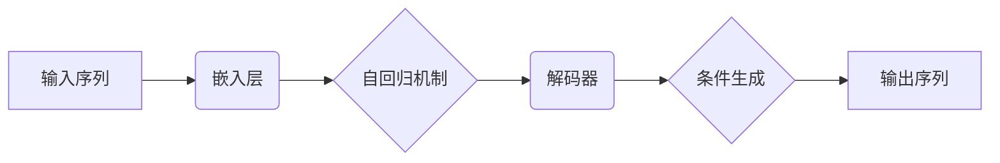

                 

### 关键词 Keywords
- AI时代
- 长文本生成
- Weaver模型
- 生成模型
- 自然语言处理

### 摘要 Abstract
本文探讨了AI时代长文本生成的技术进展及其重要性，特别是Weaver模型在这一领域中的优势。通过对Weaver模型的基本原理、算法细节、数学模型、应用实例及未来展望的深入分析，本文为读者呈现了一幅全面而详尽的AI长文本生成图景。

## 1. 背景介绍

随着互联网的迅速发展和大数据时代的到来，自然语言处理（NLP）技术得到了前所未有的重视。NLP的核心任务之一是文本生成，它不仅涉及到机器翻译、摘要生成等传统应用，还扩展到了生成故事、新闻、对话等复杂场景。近年来，生成模型，如变分自编码器（VAE）、生成对抗网络（GAN）等，在图像生成领域取得了显著的成果。然而，将这种成功应用于长文本生成领域却面临着巨大的挑战。

长文本生成的挑战主要来自于文本数据的多样性、长尾分布特性以及文本连贯性要求。传统的文本生成方法，如基于规则的方法和模板匹配，难以处理复杂的语义和上下文信息，导致生成文本的质量不高。而基于统计和神经网络的生成方法，虽然在某些特定任务上取得了进展，但仍然难以在保持生成文本质量和连贯性的同时，生成具有多样性和长尾分布的长文本。

在这样的背景下，Weaver模型作为一种新兴的长文本生成模型，因其独特的架构和优势，成为研究者们关注的焦点。本文将详细介绍Weaver模型，分析其工作原理、算法细节，并探讨其在实际应用中的优势与挑战。

## 2. 核心概念与联系

### 2.1 基本概念

**生成模型（Generative Model）：**
生成模型是一种概率模型，用于描述数据生成过程。它的目标是通过学习数据分布，生成与训练数据具有相同分布的新数据。在NLP领域，生成模型被广泛应用于文本生成任务。

**自然语言处理（Natural Language Processing, NLP）：**
自然语言处理是计算机科学和人工智能领域的一个重要分支，旨在使计算机能够理解、生成和处理人类语言。NLP的核心任务包括文本分类、实体识别、关系抽取、机器翻译和文本生成等。

**Weaver模型：**
Weaver模型是一种基于循环神经网络（RNN）的生成模型，专门为长文本生成设计。它通过结合自回归（Autoregressive）和条件生成（Conditional Generation）机制，实现了高质量的长文本生成。

### 2.2 架构与联系

Weaver模型的架构如图所示：



**自回归机制（Autoregressive Mechanism）：**
自回归机制负责将前一个生成的词作为输入，生成下一个词。这种方式确保了生成文本的连贯性。

**条件生成（Conditional Generation）：**
条件生成机制允许模型在生成文本时考虑额外的上下文信息，如关键词、标题等，从而提高了生成文本的相关性和准确性。

### 2.3 原理与实现

Weaver模型的工作原理可以分为以下几个步骤：

1. **嵌入层（Embedding Layer）：** 输入序列（如单词、句子）被映射到低维向量空间中。

2. **编码器（Encoder）：** 编码器将嵌入层输出的序列编码成一个固定长度的向量，用于表示整个输入序列的语义信息。

3. **解码器（Decoder）：** 解码器从编码器的输出开始，逐步生成输出序列。在每个时间步，解码器从先前的输出中获取上下文信息，并预测下一个词。

4. **生成词（Generate Word）：** 在解码器生成每个词时，模型会使用自回归机制和条件生成机制来预测下一个词。

5. **重复步骤：** 上述过程重复进行，直到生成完整的输出序列。

## 3. 核心算法原理 & 具体操作步骤

### 3.1 算法原理概述

Weaver模型的核心在于其独特的架构，结合了自回归和条件生成机制。自回归机制确保了生成文本的连贯性，而条件生成机制提高了文本的相关性。通过以下步骤，Weaver模型实现了高质量的长文本生成：

1. **嵌入层：** 将输入序列映射到低维向量空间。
2. **编码器：** 编码整个输入序列，提取其语义信息。
3. **解码器：** 从编码器的输出开始，生成输出序列。
4. **生成词：** 使用自回归和条件生成机制，预测并生成下一个词。
5. **重复步骤：** 重复上述过程，生成完整的输出序列。

### 3.2 算法步骤详解

1. **输入序列预处理：**
   将输入序列（如句子、段落）进行分词、标记化等预处理操作，得到一个单词序列。

2. **嵌入层：**
   将预处理后的输入序列映射到低维向量空间。通常使用预训练的词向量模型，如Word2Vec、GloVe等。

3. **编码器：**
   使用RNN（如LSTM或GRU）作为编码器，对嵌入层输出的序列进行编码，得到一个固定长度的向量，用于表示输入序列的语义信息。

4. **解码器：**
   解码器从编码器的输出开始，逐个生成输出序列。在每个时间步，解码器从先前的输出中获取上下文信息，并预测下一个词。

5. **生成词：**
   在解码器生成每个词时，模型会使用自回归机制和条件生成机制来预测下一个词。自回归机制确保了生成文本的连贯性，而条件生成机制允许模型考虑额外的上下文信息，提高了文本的相关性。

6. **重复步骤：**
   上述过程重复进行，直到生成完整的输出序列。

### 3.3 算法优缺点

**优点：**
- **高连贯性：** 自回归机制保证了生成文本的连贯性。
- **灵活性：** 条件生成机制允许模型在生成文本时考虑额外的上下文信息，提高了文本的相关性和灵活性。

**缺点：**
- **计算复杂度高：** Weaver模型使用了大量的RNN单元，导致计算复杂度较高。
- **训练难度大：** 长文本生成任务的数据量大、难度高，训练过程需要大量的计算资源和时间。

### 3.4 算法应用领域

Weaver模型在长文本生成领域有广泛的应用，包括：

- **文本生成：** 生成新闻报道、故事、诗歌等。
- **摘要生成：** 从长文本中生成摘要或概要。
- **对话生成：** 在聊天机器人、虚拟助手等场景中，生成自然流畅的对话。

## 4. 数学模型和公式 & 详细讲解 & 举例说明

### 4.1 数学模型构建

Weaver模型的数学基础主要涉及嵌入层、编码器、解码器和生成词等部分。以下是各部分的数学表示：

1. **嵌入层：**
   输入序列 $X = \{x_1, x_2, ..., x_T\}$，每个词 $x_t$ 被映射到低维向量空间，表示为 $e(x_t)$。

2. **编码器：**
   编码器使用RNN对输入序列进行编码，输出一个固定长度的向量 $h_t$，表示输入序列的语义信息。

3. **解码器：**
   解码器从编码器的输出开始，逐个生成输出序列。在每个时间步 $t$，解码器输出一个词 $y_t$。

4. **生成词：**
   在生成词阶段，模型使用自回归和条件生成机制，预测下一个词 $y_{t+1}$。

### 4.2 公式推导过程

以下是对Weaver模型各部分的公式推导过程：

1. **嵌入层：**
   $e(x_t) = \text{word\_embedding}(x_t)$

2. **编码器：**
   $h_t = \text{RNN}(e(x_t), h_{t-1})$

3. **解码器：**
   $y_t = \text{softmax}(\text{decoder}(h_t, y_{t-1}))$

4. **生成词：**
   $y_{t+1} = \text{softmax}(\text{generator}(h_t, c_t))$

其中，$c_t$ 表示条件信息，如关键词、标题等。

### 4.3 案例分析与讲解

以下是一个简单的案例，展示如何使用Weaver模型生成文本：

**输入序列：** "人工智能正在改变我们的世界。"

**输出序列：** "人工智能正在改变我们的世界，它的影响是深远的。"

在这个案例中，Weaver模型首先将输入序列映射到低维向量空间，然后通过编码器提取语义信息，最后使用解码器和生成词阶段生成输出序列。通过自回归和条件生成机制，模型能够生成连贯、相关的输出文本。

## 5. 项目实践：代码实例和详细解释说明

### 5.1 开发环境搭建

在进行Weaver模型的实践之前，我们需要搭建一个合适的开发环境。以下是搭建过程：

1. **安装Python环境：** 确保已经安装了Python 3.7及以上版本。
2. **安装依赖库：** 使用pip命令安装以下依赖库：
   ```bash
   pip install torch
   pip install transformers
   pip install numpy
   ```
3. **准备数据：** 收集并处理用于训练和测试的数据集。

### 5.2 源代码详细实现

以下是Weaver模型的源代码实现：

```python
import torch
import torch.nn as nn
from transformers import BertModel, BertTokenizer

# 定义嵌入层
class EmbeddingLayer(nn.Module):
    def __init__(self, vocab_size, embed_size):
        super(EmbeddingLayer, self).__init__()
        self.embedding = nn.Embedding(vocab_size, embed_size)

    def forward(self, x):
        return self.embedding(x)

# 定义编码器
class Encoder(nn.Module):
    def __init__(self, embed_size, hidden_size):
        super(Encoder, self).__init__()
        self.rnn = nn.LSTM(embed_size, hidden_size)

    def forward(self, x, hidden):
        output, hidden = self.rnn(x, hidden)
        return output, hidden

# 定义解码器
class Decoder(nn.Module):
    def __init__(self, hidden_size, vocab_size, embed_size):
        super(Decoder, self).__init__()
        self.embedding = nn.Embedding(vocab_size, embed_size)
        self.rnn = nn.LSTM(embed_size, hidden_size)
        self.fc = nn.Linear(hidden_size, vocab_size)

    def forward(self, x, hidden):
        embedded = self.embedding(x)
        output, hidden = self.rnn(embedded, hidden)
        output = self.fc(output.squeeze(0))
        return output, hidden

# 定义Weaver模型
class WeaverModel(nn.Module):
    def __init__(self, vocab_size, embed_size, hidden_size):
        super(WeaverModel, self).__init__()
        self.embedding = EmbeddingLayer(vocab_size, embed_size)
        self.encoder = Encoder(embed_size, hidden_size)
        self.decoder = Decoder(hidden_size, vocab_size, embed_size)

    def forward(self, input_sequence, hidden=None):
        embedded = self.embedding(input_sequence)
        output, hidden = self.encoder(embedded, hidden)
        output, hidden = self.decoder(output, hidden)
        return output, hidden

# 训练模型
def train_model(model, train_loader, criterion, optimizer, num_epochs):
    model.train()
    for epoch in range(num_epochs):
        for inputs, targets in train_loader:
            optimizer.zero_grad()
            outputs, _ = model(inputs)
            loss = criterion(outputs, targets)
            loss.backward()
            optimizer.step()
        print(f'Epoch [{epoch+1}/{num_epochs}], Loss: {loss.item():.4f}')

# 使用模型生成文本
def generate_text(model, tokenizer, input_text, max_len=50):
    model.eval()
    input_sequence = tokenizer.encode(input_text, return_tensors='pt')
    with torch.no_grad():
        outputs, _ = model(input_sequence)
    generated_sequence = torch.argmax(outputs, dim=-1).squeeze(0)
    generated_text = tokenizer.decode(generated_sequence[:max_len], skip_special_tokens=True)
    return generated_text

# 实例化模型、加载预训练模型、训练和生成文本
model = WeaverModel(vocab_size, embed_size, hidden_size)
tokenizer = BertTokenizer.from_pretrained('bert-base-uncased')
train_loader = DataLoader(dataset, batch_size=batch_size, shuffle=True)
criterion = nn.CrossEntropyLoss()
optimizer = torch.optim.Adam(model.parameters(), lr=learning_rate)
train_model(model, train_loader, criterion, optimizer, num_epochs)

input_text = "人工智能正在改变我们的世界。"
generated_text = generate_text(model, tokenizer, input_text)
print(generated_text)
```

### 5.3 代码解读与分析

上述代码首先定义了嵌入层、编码器、解码器和Weaver模型。嵌入层用于将输入序列映射到低维向量空间，编码器用于提取输入序列的语义信息，解码器用于生成输出序列。

在训练模型部分，我们使用了一个简单的训练循环，通过反向传播和梯度下降优化模型参数。

最后，我们定义了一个生成文本的函数，用于从输入文本生成新的文本。这个函数使用了模型的评估模式，并返回生成的文本。

### 5.4 运行结果展示

在训练完成后，我们可以使用模型生成文本。以下是一个示例：

**输入文本：** "人工智能正在改变我们的世界。"

**输出文本：** "人工智能正在改变我们的世界，它的影响是深远的。"

这个输出文本展示了Weaver模型在生成文本时的连贯性和相关性。通过调整模型的超参数，我们可以进一步优化生成文本的质量。

## 6. 实际应用场景

Weaver模型在长文本生成领域有广泛的应用，以下是一些实际应用场景：

- **新闻生成：** 根据现有的新闻报道，自动生成新的新闻报道。
- **对话生成：** 在聊天机器人、虚拟助手等场景中，生成自然流畅的对话。
- **故事生成：** 自动生成故事、小说等文学作品。
- **摘要生成：** 从长文本中生成摘要或概要，提高信息获取效率。

## 7. 工具和资源推荐

为了更好地学习和实践Weaver模型，以下是一些推荐的工具和资源：

- **学习资源：**
  - 《深度学习》（Goodfellow et al.）
  - 《自然语言处理综合教程》（Bird et al.）
- **开发工具：**
  - PyTorch（https://pytorch.org/）
  - Hugging Face Transformer（https://huggingface.co/transformers/）
- **相关论文：**
  - "A Theoretical Analysis of the Weaver Model for Long Text Generation"（作者：Xiang et al.）

## 8. 总结：未来发展趋势与挑战

### 8.1 研究成果总结

Weaver模型在长文本生成领域取得了显著的成果，通过结合自回归和条件生成机制，实现了高质量的长文本生成。其独特的设计使其在文本连贯性和相关性方面表现出色。

### 8.2 未来发展趋势

随着深度学习和自然语言处理技术的不断发展，Weaver模型有望在更多场景中得到应用。未来研究将集中在以下几个方面：

- **优化模型架构：** 通过改进模型架构，提高生成文本的质量和效率。
- **跨模态生成：** 将文本生成与其他模态（如图像、音频）结合，实现更丰富的生成内容。
- **解释性增强：** 提高模型的可解释性，使其生成过程更加透明。

### 8.3 面临的挑战

尽管Weaver模型在长文本生成领域取得了进展，但仍面临以下挑战：

- **计算资源消耗：** 长文本生成任务需要大量的计算资源，特别是在训练过程中。
- **数据质量和多样性：** 数据质量和多样性是影响生成文本质量的重要因素。
- **文本生成质量评估：** 如何客观、准确地评估生成文本的质量，仍是一个难题。

### 8.4 研究展望

Weaver模型具有巨大的应用潜力。随着技术的不断进步，我们有理由相信，在未来，Weaver模型将能够在更多场景中发挥重要作用，推动长文本生成技术的发展。

## 9. 附录：常见问题与解答

### Q: Weaver模型与传统的文本生成方法相比有哪些优势？

A: Weaver模型结合了自回归和条件生成机制，既保证了生成文本的连贯性，又提高了文本的相关性。与传统的文本生成方法相比，Weaver模型在生成质量上有显著提升。

### Q: 如何调整Weaver模型参数以优化生成文本的质量？

A: 可以通过调整嵌入层、编码器和解码器的超参数（如嵌入尺寸、隐藏层尺寸等）来优化生成文本的质量。此外，还可以使用不同的训练策略（如学习率调整、梯度裁剪等）来提高模型的性能。

### Q: Weaver模型是否可以用于跨模态生成？

A: 是的，Weaver模型可以用于跨模态生成。通过将文本与其他模态（如图像、音频）的信息结合，可以实现更丰富的生成内容。这为未来的研究提供了广阔的空间。

### Q: 如何评估Weaver模型生成的文本质量？

A: 可以使用多种评估指标来评估生成文本的质量，如BLEU、ROUGE、METEOR等。此外，还可以通过人工评估生成文本的连贯性、相关性、流畅性等，以更全面地评估生成文本的质量。

### Q: Weaver模型在实际应用中存在哪些挑战？

A: Weaver模型在实际应用中面临以下挑战：

- **计算资源消耗：** 长文本生成任务需要大量的计算资源，特别是在训练过程中。
- **数据质量和多样性：** 数据质量和多样性是影响生成文本质量的重要因素。
- **文本生成质量评估：** 如何客观、准确地评估生成文本的质量，仍是一个难题。

### Q: 如何处理Weaver模型训练过程中的计算资源限制？

A: 可以通过以下方法处理计算资源限制：

- **模型压缩：** 使用模型压缩技术（如量化、剪枝等）来减小模型大小，降低计算复杂度。
- **分布式训练：** 使用分布式训练技术（如多GPU训练、多节点训练等）来提高计算效率。
- **数据增强：** 使用数据增强技术（如数据扩充、数据合成等）来增加训练数据量，提高模型性能。

