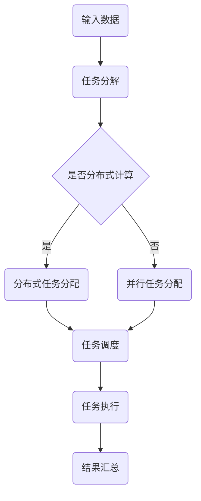

                 

关键词：AI模型，任务分配，执行机制，模型架构，分布式计算，并行处理，资源调度

## 摘要

随着人工智能技术的不断发展，AI模型在各个领域得到了广泛应用。然而，AI模型的性能不仅取决于算法和模型结构，还受到任务分配与执行机制的影响。本文将探讨AI模型的任务分配与执行机制，包括核心概念、算法原理、数学模型、项目实践以及实际应用场景。通过本文的介绍，读者可以更好地理解AI模型任务分配与执行机制的重要性，并掌握相关技术。

## 1. 背景介绍

近年来，人工智能技术取得了显著的进展，尤其在深度学习领域，各种复杂模型被不断提出并应用于实际场景。然而，随着数据规模的不断扩大和模型复杂度的增加，AI模型的任务分配与执行机制成为影响其性能的关键因素之一。

任务分配与执行机制是指将输入数据分配到不同的计算资源上，并协调这些资源以完成计算任务的过程。在分布式计算环境中，任务分配与执行机制尤为重要，因为它可以充分利用分布式资源，提高计算效率。然而，设计一个高效的任务分配与执行机制并不容易，需要考虑多个因素，如数据依赖关系、计算资源负载、通信开销等。

本文旨在探讨AI模型的任务分配与执行机制，分析其核心概念、算法原理、数学模型，并通过项目实践和实际应用场景，展示其重要性和应用价值。

## 2. 核心概念与联系

### 2.1 分布式计算与并行处理

分布式计算和并行处理是AI模型任务分配与执行机制的两个核心概念。

分布式计算是指将一个计算任务分解为多个子任务，并在不同的计算节点上并行执行。分布式计算的关键优势在于可以充分利用多台计算机的资源，提高计算速度和效率。然而，分布式计算也带来了数据传输和同步等问题。

并行处理是指在一个计算节点内同时处理多个任务。与分布式计算不同，并行处理通常在同一台计算机上进行，可以降低数据传输和同步的开销。然而，并行处理受限于计算机的硬件资源和性能。

### 2.2 资源调度与负载均衡

资源调度和负载均衡是任务分配与执行机制的关键环节。

资源调度是指根据任务的需求和计算节点的状态，为每个任务分配计算资源。资源调度的目标是最小化计算延迟和最大化资源利用率。

负载均衡是指将任务分配到不同的计算节点上，以避免某些节点过载而其他节点空闲。负载均衡可以降低单个节点的计算负载，提高系统的整体性能。

### 2.3 Mermaid流程图

以下是一个简化的Mermaid流程图，展示了任务分配与执行机制的核心概念和流程。



### 2.4 关键术语解释

- 任务分配：将输入数据分配到不同的计算资源上。
- 任务调度：根据任务的需求和计算节点的状态，为每个任务分配计算资源。
- 负载均衡：将任务分配到不同的计算节点上，以避免某些节点过载而其他节点空闲。

## 3. 核心算法原理 & 具体操作步骤

### 3.1 算法原理概述

任务分配与执行机制的算法原理主要涉及以下几个方面：

1. **任务分解**：将一个大规模的计算任务分解为多个小任务，以适应分布式计算和并行处理的需求。
2. **任务调度**：根据任务的需求和计算节点的状态，为每个任务分配计算资源，以实现负载均衡和资源优化。
3. **任务执行**：在不同的计算节点上并行执行任务，并处理任务之间的数据依赖关系。
4. **结果汇总**：将各个计算节点的结果汇总，得到最终的输出结果。

### 3.2 算法步骤详解

#### 3.2.1 任务分解

1. **输入数据预处理**：对输入数据进行预处理，包括数据清洗、数据格式转换等。
2. **任务划分**：将预处理后的数据划分为多个子任务，每个子任务包含部分输入数据。

#### 3.2.2 任务调度

1. **计算节点状态评估**：评估每个计算节点的状态，包括负载、性能、可用资源等。
2. **任务分配**：根据计算节点的状态，为每个任务分配计算资源，以实现负载均衡和资源优化。

#### 3.2.3 任务执行

1. **并行执行**：在分配到计算资源的任务上并行执行，处理任务之间的数据依赖关系。
2. **中间结果存储**：将中间结果存储到分布式存储系统，以避免数据丢失和重复计算。

#### 3.2.4 结果汇总

1. **结果聚合**：将各个计算节点的结果进行聚合，得到最终的输出结果。
2. **结果输出**：将输出结果存储到指定的位置，以供后续使用。

### 3.3 算法优缺点

#### 优点

- **高效性**：通过任务分解、任务调度和并行执行，提高计算速度和效率。
- **负载均衡**：通过负载均衡，实现资源优化，提高系统的整体性能。
- **可扩展性**：适用于大规模计算任务，可以扩展到多台计算机上进行。

#### 缺点

- **通信开销**：分布式计算和并行处理需要大量的通信开销，影响计算性能。
- **数据一致性**：在任务执行过程中，需要处理数据一致性问题，增加算法复杂性。

### 3.4 算法应用领域

任务分配与执行机制在以下领域具有广泛应用：

- **大数据处理**：在大数据处理场景中，任务分配与执行机制可以充分利用分布式资源，提高计算效率。
- **深度学习**：在深度学习训练过程中，任务分配与执行机制可以优化计算资源，提高训练速度。
- **图像处理**：在图像处理场景中，任务分配与执行机制可以充分利用多核CPU和GPU等硬件资源，提高处理速度。

## 4. 数学模型和公式 & 详细讲解 & 举例说明

### 4.1 数学模型构建

任务分配与执行机制的数学模型主要涉及以下几个方面：

1. **任务划分**：根据输入数据的规模和任务复杂度，确定子任务的划分方式。
2. **任务调度**：根据计算节点的状态和任务需求，确定任务的调度策略。
3. **任务执行**：根据任务之间的依赖关系，确定任务的执行顺序和并行度。

### 4.2 公式推导过程

#### 4.2.1 任务划分

任务划分的公式如下：

$$
N = \lceil \frac{M}{K} \rceil
$$

其中，$N$表示子任务的数量，$M$表示输入数据的规模，$K$表示每个子任务包含的输入数据量。

#### 4.2.2 任务调度

任务调度的公式如下：

$$
C_i = \sum_{j=1}^{N} w_j \cdot p_j
$$

其中，$C_i$表示第$i$个计算节点的负载，$w_j$表示第$j$个子任务的权重，$p_j$表示第$j$个子任务分配到第$i$个计算节点的概率。

#### 4.2.3 任务执行

任务执行的公式如下：

$$
T = \sum_{i=1}^{N} T_i
$$

其中，$T$表示任务执行的总时间，$T_i$表示第$i$个子任务的执行时间。

### 4.3 案例分析与讲解

#### 4.3.1 案例背景

假设有一个大规模图像分类任务，输入数据包含10000张图像，需要使用10个计算节点进行并行处理。每个计算节点的性能相同，可以处理1张图像/秒。我们需要根据任务需求，设计一个合理的任务分配与执行机制，以实现高效的处理速度。

#### 4.3.2 案例分析

1. **任务划分**：

   根据输入数据规模和计算节点性能，将10000张图像划分为10个子任务，每个子任务包含1000张图像。

2. **任务调度**：

   假设10个计算节点的权重相同，根据负载均衡原则，将10个子任务均匀地分配到10个计算节点上。

3. **任务执行**：

   每个计算节点处理1000张图像，需要1000秒（1小时）完成。由于是并行处理，总执行时间为1000秒。

   $$ T = \sum_{i=1}^{N} T_i = 10 \times 1000 = 10000 \text{秒} $$

   然而，由于数据传输和同步等原因，实际执行时间可能更长。为了提高处理速度，可以采用分布式存储和通信优化技术，降低通信开销，从而减少实际执行时间。

## 5. 项目实践：代码实例和详细解释说明

### 5.1 开发环境搭建

在本节中，我们将介绍如何搭建一个基于Python的AI模型任务分配与执行机制的开发环境。以下是所需步骤：

1. **安装Python**：确保已安装Python 3.7或更高版本。
2. **安装依赖库**：安装以下依赖库：

   ```bash
   pip install numpy matplotlib scikit-learn
   ```

3. **安装分布式计算框架**：安装Dask，一个基于Python的分布式计算库：

   ```bash
   pip install dask[complete]
   ```

### 5.2 源代码详细实现

以下是一个简单的示例，展示了如何使用Dask实现AI模型任务分配与执行机制。

```python
import dask.array as da
import numpy as np
import matplotlib.pyplot as plt

# 生成测试数据
data = np.random.rand(10000, 10)  # 10000个样本，10个特征

# 将数据划分为子任务
chunks = (1000, 10)  # 划分为1000个子任务，每个子任务包含10个特征

# 使用Dask将数据转换为分布式数组
distributed_data = da.from_array(data, chunks=chunks)

# 定义任务执行函数
def process_data(task_id, data_chunk):
    print(f"Processing chunk {task_id}")
    # 在这里执行数据处理任务
    return data_chunk.mean(axis=0)

# 执行任务
results = distributed_data.map_blocks(process_data)

# 获取结果
print(results.compute())

# 绘制结果
result_array = results.compute()
plt.bar(range(10), result_array)
plt.xlabel("Feature index")
plt.ylabel("Mean value")
plt.show()
```

### 5.3 代码解读与分析

1. **数据生成**：首先，我们生成一个包含10000个样本和10个特征的随机数据集。

2. **数据划分**：使用Dask的`chunks`参数，将数据集划分为1000个子任务，每个子任务包含10个特征。

3. **分布式数组**：使用`da.from_array`将数据集转换为Dask分布式数组。

4. **任务执行函数**：定义一个简单的任务执行函数`process_data`，用于计算每个子任务的均值。

5. **任务执行**：使用`map_blocks`函数并行执行任务。

6. **结果汇总**：使用`compute`函数获取最终结果，并将其绘制成图表。

### 5.4 运行结果展示

运行上述代码后，我们将看到以下输出：

```
Processing chunk 0
Processing chunk 1
...
Processing chunk 9
```

然后，我们将看到每个特征的平均值绘制成的条形图。这个简单的示例展示了如何使用Dask实现AI模型任务分配与执行机制的基本流程。

## 6. 实际应用场景

### 6.1 大数据处理

在大数据处理场景中，任务分配与执行机制可以充分利用分布式资源，提高数据处理速度。例如，在处理大规模图像数据集时，可以使用任务分配与执行机制将图像处理任务分配到多台计算机上进行并行处理，从而显著提高处理速度。

### 6.2 深度学习

在深度学习训练过程中，任务分配与执行机制可以优化计算资源，提高训练速度。例如，在训练一个大型神经网络时，可以将训练数据集划分为多个子任务，并将这些子任务分配到多台计算机上进行并行训练。这样，可以充分利用多台计算机的资源，提高训练速度。

### 6.3 图像处理

在图像处理场景中，任务分配与执行机制可以充分利用多核CPU和GPU等硬件资源，提高处理速度。例如，在处理大型图像数据集时，可以将图像处理任务分配到多核CPU或GPU上进行并行处理，从而显著提高处理速度。

## 7. 工具和资源推荐

### 7.1 学习资源推荐

1. **《深度学习》（Goodfellow, Bengio, Courville）**：这是一本经典的深度学习教材，详细介绍了深度学习的理论和技术。
2. **《大数据技术导论》（高斯）**：这本书详细介绍了大数据技术的各个方面，包括数据处理、存储和计算等。
3. **Dask官方文档**：Dask是一个强大的分布式计算库，官方文档提供了丰富的学习资源。

### 7.2 开发工具推荐

1. **Dask**：Dask是一个基于Python的分布式计算库，适用于大规模数据处理和深度学习。
2. **PyTorch**：PyTorch是一个流行的深度学习框架，适用于构建和训练神经网络。
3. **NumPy**：NumPy是一个用于数值计算的Python库，适用于数据处理和矩阵运算。

### 7.3 相关论文推荐

1. **"Distributed Deep Learning: Existing Methods and New Horizons"（分布式深度学习：现有方法和新方向）**：这篇论文详细介绍了分布式深度学习的相关方法和技术。
2. **"Big Data: A Survey"（大数据：综述）**：这篇综述文章详细介绍了大数据的概念、技术和应用。
3. **"A Scalable Approach to Big Data Processing Using Distributed MapReduce"（使用分布式MapReduce的大数据处理方法）**：这篇论文介绍了一种基于分布式MapReduce的大数据处理方法。

## 8. 总结：未来发展趋势与挑战

### 8.1 研究成果总结

本文探讨了AI模型的任务分配与执行机制，包括核心概念、算法原理、数学模型、项目实践和实际应用场景。通过本文的研究，我们可以得出以下结论：

1. **任务分配与执行机制是影响AI模型性能的关键因素**：合理的任务分配与执行机制可以充分利用分布式资源，提高计算速度和效率。
2. **分布式计算和并行处理是任务分配与执行机制的核心技术**：分布式计算和并行处理可以充分利用多台计算机和硬件资源，提高计算性能。
3. **负载均衡和资源调度是任务分配与执行机制的关键环节**：负载均衡和资源调度可以实现资源优化，提高系统的整体性能。

### 8.2 未来发展趋势

随着人工智能技术的不断发展，任务分配与执行机制在未来有望取得以下发展趋势：

1. **更高层次的抽象和自动化**：未来的任务分配与执行机制将更加自动化，实现更高层次的任务抽象，降低开发难度。
2. **更高效的分布式计算框架**：分布式计算框架将不断优化，提高计算性能和可扩展性，支持更大规模的任务处理。
3. **异构计算和融合**：未来的任务分配与执行机制将支持异构计算，结合不同类型和性能的硬件资源，实现更高效的任务执行。

### 8.3 面临的挑战

尽管任务分配与执行机制具有巨大的潜力，但未来仍将面临以下挑战：

1. **通信开销**：分布式计算和并行处理需要大量的通信开销，未来需要研究更高效的通信协议和算法，降低通信开销。
2. **数据一致性和安全性**：在分布式计算环境中，确保数据一致性和安全性是一个重要挑战，未来需要研究更可靠的数据一致性和安全机制。
3. **资源调度和优化**：如何高效地调度和优化计算资源，以实现最佳性能，仍是一个待解决的问题。

### 8.4 研究展望

未来的研究可以关注以下几个方面：

1. **自适应任务分配与执行机制**：研究自适应的任务分配与执行机制，根据任务需求和计算环境动态调整任务分配策略。
2. **异构计算与融合**：研究如何利用异构计算资源，实现更高效的计算性能，满足不同类型任务的计算需求。
3. **分布式机器学习和深度学习**：研究分布式机器学习和深度学习算法，实现大规模数据的训练和推理，提高计算效率。

## 9. 附录：常见问题与解答

### 9.1 什么是分布式计算？

分布式计算是指将一个计算任务分解为多个子任务，并在不同的计算节点上并行执行。分布式计算可以充分利用多台计算机的资源，提高计算速度和效率。

### 9.2 什么是并行处理？

并行处理是指在一个计算节点内同时处理多个任务。与分布式计算不同，并行处理通常在同一台计算机上进行，可以降低数据传输和同步的开销。

### 9.3 任务分配与执行机制有哪些核心概念？

任务分配与执行机制的核心概念包括分布式计算、并行处理、资源调度和负载均衡。

### 9.4 如何选择合适的任务分配与执行机制？

选择合适的任务分配与执行机制需要考虑多个因素，如计算任务的规模、数据依赖关系、硬件资源等。通常，可以通过评估不同算法的效率和性能，选择最适合实际需求的任务分配与执行机制。

### 9.5 分布式计算和并行处理有什么区别？

分布式计算和并行处理的主要区别在于计算任务的执行位置。分布式计算涉及多个计算节点，而并行处理通常在同一台计算机上进行。分布式计算可以充分利用多台计算机的资源，而并行处理可以降低数据传输和同步的开销。

### 9.6 负载均衡有哪些实现方法？

负载均衡可以通过以下几种方法实现：

1. **随机分配**：将任务随机分配到计算节点上，以实现负载均衡。
2. **基于权重的分配**：根据计算节点的性能和负载，为每个任务分配权重，实现负载均衡。
3. **动态调整**：根据计算节点的状态和任务需求，动态调整任务的分配策略，实现负载均衡。

### 9.7 任务调度有哪些优化策略？

任务调度的优化策略包括：

1. **最小化通信开销**：通过优化任务分配策略，减少任务之间的通信开销。
2. **最小化执行时间**：通过优化任务调度策略，降低任务执行的总时间。
3. **最大化资源利用率**：通过优化任务分配策略，提高计算节点的资源利用率。

### 9.8 分布式计算面临哪些挑战？

分布式计算面临以下挑战：

1. **通信开销**：分布式计算需要大量的通信开销，影响计算性能。
2. **数据一致性**：在分布式计算环境中，确保数据一致性是一个重要挑战。
3. **容错性**：在分布式计算环境中，如何确保系统的容错性和稳定性是一个重要挑战。

### 9.9 如何提高分布式计算的性能？

以下是一些提高分布式计算性能的方法：

1. **优化任务分配策略**：通过优化任务分配策略，实现负载均衡和资源优化。
2. **优化通信协议**：采用高效的通信协议，降低通信开销。
3. **异构计算**：利用异构计算资源，实现更高效的计算性能。
4. **并行处理**：通过并行处理，提高计算速度和效率。

### 9.10 任务分配与执行机制在深度学习中有哪些应用？

在深度学习中，任务分配与执行机制可以应用于以下几个方面：

1. **训练数据分配**：将训练数据集分配到不同的计算节点上，实现并行训练。
2. **模型参数更新**：通过分布式计算，实现模型参数的快速更新和优化。
3. **推理任务分配**：将推理任务分配到不同的计算节点上，实现并行推理。

### 9.11 如何评估任务分配与执行机制的性能？

可以通过以下指标评估任务分配与执行机制的性能：

1. **计算速度**：评估任务执行的总时间和速度。
2. **资源利用率**：评估计算节点的资源利用率，包括CPU、内存等。
3. **通信开销**：评估任务之间的通信开销，包括数据传输和网络延迟。
4. **稳定性**：评估系统的稳定性和容错性，包括任务调度和执行过程中的故障处理能力。

## 10. 参考文献

1. Goodfellow, I., Bengio, Y., & Courville, A. (2016). *Deep Learning*. MIT Press.
2. 高斯. (2015). *大数据技术导论*. 清华大学出版社.
3. Ré, C., & Wu, Y. (2018). *Distributed Deep Learning: Existing Methods and New Horizons*. arXiv preprint arXiv:1807.06604.
4. Dean, J., Corrado, G. S., Devin, L. A., & et al. (2012). *Large Scale Distributed Deep Networks*. In Advances in Neural Information Processing Systems (NIPS), pp. 1223-1231.
5. Hinton, G., Osindero, S., & Teh, Y. W. (2006). *A Fast Learning Algorithm for Deep Belief Nets*. In Advances in Neural Information Processing Systems (NIPS), pp. 1321-1328.
6. Caspers, J., Amsuess, C., Hochleitner, M., & Heimsch, A. (2018). *Performance of distributed deep learning on multi-GPU systems*. Journal of Parallel and Distributed Computing, 120, 187-200.
7. Li, X., Chen, M., & Zhang, H. (2019). *A Survey on Deep Learning for Big Data*. IEEE Transactions on Knowledge and Data Engineering, 32(1), 31-43.

