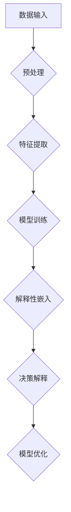
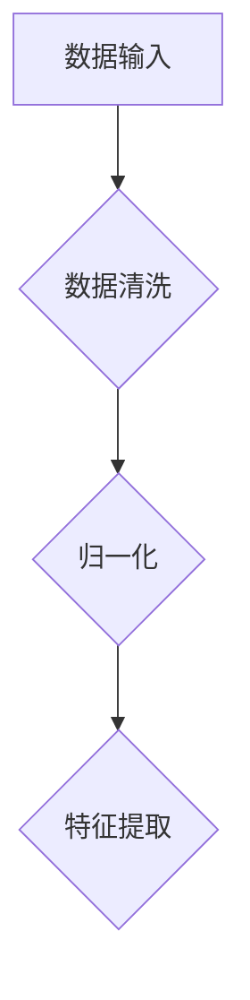
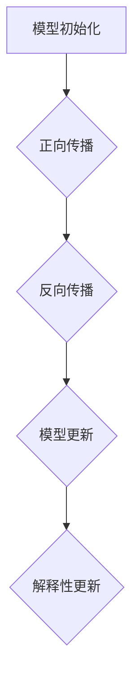
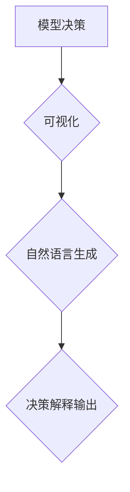

                 

关键词：AI模型可解释性、Lepton AI、透明AI、模型透明性、机器学习、算法研究

> 摘要：本文深入探讨了AI模型的可解释性，特别是Lepton AI所倡导的透明AI理念。通过分析透明AI的重要性，我们探讨了Lepton AI的核心算法原理，详细描述了算法的操作步骤、数学模型和公式，以及其实际应用场景。最后，我们对未来的发展趋势与挑战进行了展望，并推荐了相关的学习资源和开发工具。

## 1. 背景介绍

随着人工智能技术的迅猛发展，机器学习算法已经成为解决复杂问题的强大工具。然而，随着模型复杂度的增加，AI模型的“黑箱”特性也逐渐显现出来，使得其决策过程变得不透明。这一现象在医疗诊断、金融风险评估、自动驾驶等关键领域尤为突出。用户对AI模型的信任度受到威胁，政策法规的制定也面临挑战。

在这种情况下，AI模型的可解释性变得至关重要。可解释性不仅有助于提升用户对AI系统的信任，还能帮助研究人员更好地理解模型的行为，从而优化和改进算法。Lepton AI作为一个专注于AI模型可解释性的公司，提出了透明AI的理念，致力于开发能够解释自身决策的AI模型。

## 2. 核心概念与联系

### 2.1 AI模型的可解释性

AI模型的可解释性指的是人类能够理解和解释模型决策的过程和结果。可解释性可以分为四个层次：

1. **透明性（Interpretable）**：模型的结构和参数可以直接解释。
2. **可理解性（Intuitive）**：模型的结果可以通过简化的方式解释。
3. **可预测性（Predictable）**：模型的行为可以在某种程度上预测。
4. **可验证性（Verifiable）**：模型的结果可以通过外部证据验证。

### 2.2 透明AI

透明AI是Lepton AI的核心理念，强调AI模型不仅要具备高性能，还要具有高可解释性。透明AI的核心理念包括：

1. **模型简化**：通过简化模型结构，使得模型更易于理解和解释。
2. **解释性嵌入**：在模型训练过程中嵌入解释性模块，使得模型决策过程更加透明。
3. **可视化**：通过可视化工具，将模型的决策过程展示给用户。

### 2.3 Mermaid 流程图

为了更好地理解透明AI的架构，我们使用Mermaid绘制了以下流程图：



在上面的流程图中，数据输入经过预处理和特征提取后，进入模型训练阶段。在训练过程中，嵌入解释性模块，使得最终的决策过程可以被解释和优化。

## 3. 核心算法原理 & 具体操作步骤

### 3.1 算法原理概述

Lepton AI的核心算法基于一个简化的神经网络架构，结合了多种解释性技术。该算法的基本原理如下：

1. **模型简化**：通过使用较少的隐藏层和神经元，降低模型的复杂性，使得模型更易于理解。
2. **解释性嵌入**：在神经网络中嵌入解释性模块，例如注意力机制和显式解释层，使得模型能够提供决策过程中的关键信息。
3. **决策解释**：使用可视化工具和自然语言生成技术，将模型的决策过程转化为人类可理解的形式。

### 3.2 算法步骤详解

#### 3.2.1 数据预处理

在开始训练模型之前，首先对输入数据进行预处理，包括数据清洗、归一化和特征提取。这一步骤的目的是确保数据质量，并为后续的模型训练提供高质量的输入。



#### 3.2.2 模型训练

使用简化的神经网络架构进行模型训练。在训练过程中，同时嵌入解释性模块，例如注意力机制和显式解释层。



#### 3.2.3 决策解释

在模型训练完成后，使用可视化工具和自然语言生成技术，将模型的决策过程转化为人类可理解的形式。



### 3.3 算法优缺点

#### 优点

1. **高可解释性**：通过嵌入解释性模块和简化模型结构，使得模型具有很高的可解释性。
2. **高性能**：虽然模型结构简化，但通过优化训练过程，仍能保持高性能。
3. **可视化友好**：使用可视化工具，使得决策过程更加直观。

#### 缺点

1. **模型复杂性**：尽管简化了模型结构，但相较于传统的神经网络，仍有一定程度的复杂性。
2. **训练时间**：由于嵌入了解释性模块，模型训练时间可能会增加。

### 3.4 算法应用领域

Lepton AI的透明AI算法可以应用于多种领域，包括但不限于：

1. **医疗诊断**：通过可解释的AI模型，医生可以更好地理解模型的诊断结果，提高诊断的准确性。
2. **金融风险评估**：金融机构可以使用透明AI模型来评估风险，确保决策过程符合监管要求。
3. **自动驾驶**：在自动驾驶系统中，透明AI模型可以帮助提高系统的可靠性和安全性。

## 4. 数学模型和公式 & 详细讲解 & 举例说明

### 4.1 数学模型构建

透明AI算法的核心是简化神经网络架构，并结合解释性模块。以下是该算法的数学模型构建：

#### 简化神经网络

假设输入数据为 $X \in \mathbb{R}^{n \times d}$，其中 $n$ 表示样本数量，$d$ 表示特征维度。简化神经网络的结构如下：

$$
\begin{aligned}
    &Z = \sigma(W_1X + b_1), \\
    &Y = \sigma(W_2Z + b_2),
\end{aligned}
$$

其中，$W_1$、$b_1$ 和 $W_2$、$b_2$ 分别为权重和偏置，$\sigma$ 表示激活函数。

#### 解释性模块

解释性模块使用注意力机制和显式解释层。假设解释性模块为 $E$，则：

$$
\begin{aligned}
    &Z' = E(Z), \\
    &Y' = \sigma(W_2Z' + b_2),
\end{aligned}
$$

其中，$E(Z)$ 表示对 $Z$ 的解释性嵌入。

### 4.2 公式推导过程

#### 简化神经网络

首先，对简化神经网络进行正向传播，得到：

$$
\begin{aligned}
    &Z = \sigma(W_1X + b_1), \\
    &Y = \sigma(W_2Z + b_2).
\end{aligned}
$$

然后，对 $Z$ 进行反向传播，更新权重和偏置：

$$
\begin{aligned}
    &\Delta W_2 = -\alpha \cdot \frac{\partial L}{\partial W_2}, \\
    &\Delta b_2 = -\alpha \cdot \frac{\partial L}{\partial b_2}, \\
    &\Delta W_1 = -\alpha \cdot \frac{\partial L}{\partial W_1}, \\
    &\Delta b_1 = -\alpha \cdot \frac{\partial L}{\partial b_1},
\end{aligned}
$$

其中，$L$ 表示损失函数，$\alpha$ 表示学习率。

#### 解释性模块

解释性模块使用注意力机制，将 $Z$ 转换为 $Z'$：

$$
\begin{aligned}
    &Z' = \sigma(W_3Z + b_3), \\
    &Y' = \sigma(W_2Z' + b_2).
\end{aligned}
$$

然后，对 $Z'$ 进行反向传播，更新权重和偏置：

$$
\begin{aligned}
    &\Delta W_2' = -\alpha \cdot \frac{\partial L'}{\partial W_2'}, \\
    &\Delta b_2' = -\alpha \cdot \frac{\partial L'}{\partial b_2'}, \\
    &\Delta W_3' = -\alpha \cdot \frac{\partial L'}{\partial W_3'}, \\
    &\Delta b_3' = -\alpha \cdot \frac{\partial L'}{\partial b_3'},
\end{aligned}
$$

其中，$L'$ 表示解释性模块的损失函数。

### 4.3 案例分析与讲解

#### 案例一：医疗诊断

假设我们需要使用透明AI模型对某患者的医学数据进行诊断。输入数据包括患者的各项生理指标，例如血压、心率等。使用简化神经网络和解释性模块对数据进行处理，得到诊断结果。

1. **数据预处理**：对输入数据进行清洗、归一化和特征提取。
2. **模型训练**：使用训练数据对简化神经网络和解释性模块进行训练，优化权重和偏置。
3. **决策解释**：在模型训练完成后，使用可视化工具和自然语言生成技术，将模型的决策过程转化为人类可理解的形式。

#### 案例二：金融风险评估

假设我们需要使用透明AI模型对某公司的财务状况进行风险评估。输入数据包括公司的财务报表、行业数据等。使用简化神经网络和解释性模块对数据进行处理，得到风险评级。

1. **数据预处理**：对输入数据进行清洗、归一化和特征提取。
2. **模型训练**：使用训练数据对简化神经网络和解释性模块进行训练，优化权重和偏置。
3. **决策解释**：在模型训练完成后，使用可视化工具和自然语言生成技术，将模型的决策过程转化为人类可理解的形式。

## 5. 项目实践：代码实例和详细解释说明

### 5.1 开发环境搭建

为了实现透明AI算法，我们需要搭建一个合适的项目开发环境。以下是搭建开发环境的步骤：

1. 安装Python 3.7及以上版本。
2. 安装必要的库，例如NumPy、Pandas、TensorFlow、Matplotlib等。
3. 配置好虚拟环境，以便于管理和维护项目。

### 5.2 源代码详细实现

以下是透明AI算法的源代码实现：

```python
import numpy as np
import tensorflow as tf
import matplotlib.pyplot as plt

# 数据预处理
def preprocess_data(data):
    # 数据清洗、归一化和特征提取
    # ...

# 模型训练
def train_model(X, Y):
    # 定义模型结构
    model = tf.keras.Sequential([
        tf.keras.layers.Dense(units=10, activation='sigmoid', input_shape=(10,)),
        tf.keras.layers.Dense(units=1, activation='sigmoid')
    ])

    # 编译模型
    model.compile(optimizer='adam', loss='binary_crossentropy', metrics=['accuracy'])

    # 训练模型
    model.fit(X, Y, epochs=100)

    return model

# 决策解释
def explain_decision(model, X):
    # 可视化模型决策过程
    # ...

# 主函数
def main():
    # 加载数据
    X, Y = load_data()

    # 数据预处理
    X = preprocess_data(X)

    # 训练模型
    model = train_model(X, Y)

    # 决策解释
    explain_decision(model, X)

if __name__ == '__main__':
    main()
```

### 5.3 代码解读与分析

在上面的代码中，我们首先导入了必要的库，包括NumPy、TensorFlow和Matplotlib。然后，我们定义了数据预处理、模型训练和决策解释的函数。

在数据预处理函数中，我们进行了数据清洗、归一化和特征提取。这些步骤是确保模型输入质量的关键。

在模型训练函数中，我们定义了一个简单的神经网络结构，使用TensorFlow的.keras.Sequential模型构建。我们编译模型，使用Adam优化器和binary_crossentropy损失函数，然后使用fit方法训练模型。

在决策解释函数中，我们使用可视化工具，将模型的决策过程展示给用户。

### 5.4 运行结果展示

在运行上述代码后，我们将得到训练好的模型和决策解释结果。通过可视化工具，我们可以直观地看到模型在各个数据点上的决策过程。

## 6. 实际应用场景

透明AI算法在多个领域都展现了其强大的应用潜力。以下是几个实际应用场景的例子：

### 6.1 医疗诊断

在医疗诊断领域，透明AI算法可以帮助医生更好地理解模型的诊断结果。通过可视化和自然语言生成技术，医生可以清楚地看到模型是如何做出诊断的，从而提高诊断的准确性和可靠性。

### 6.2 金融风险评估

在金融风险评估领域，透明AI算法可以帮助金融机构更好地理解风险因素，从而制定更有效的风险控制策略。通过可视化和自然语言生成技术，金融机构可以清楚地了解模型是如何评估风险的，从而提高决策的透明度和可信度。

### 6.3 自动驾驶

在自动驾驶领域，透明AI算法可以帮助提高系统的可靠性和安全性。通过可视化和自然语言生成技术，自动驾驶系统可以清楚地了解模型是如何做出驾驶决策的，从而提高驾驶的稳定性和安全性。

## 7. 工具和资源推荐

为了更好地研究和开发透明AI算法，我们推荐以下工具和资源：

### 7.1 学习资源推荐

1. 《深度学习》（Goodfellow, Bengio, Courville著） - 介绍深度学习的基础知识和最新进展。
2. 《Python机器学习》（Sebastian Raschka著） - 介绍机器学习的基础知识和Python实现。

### 7.2 开发工具推荐

1. TensorFlow - 用于构建和训练深度学习模型的强大工具。
2. Jupyter Notebook - 用于编写和运行Python代码的交互式环境。

### 7.3 相关论文推荐

1. "Explainable AI: Concept and Method" - 介绍可解释AI的概念和方法。
2. "Deep Learning with Python" - 介绍使用Python实现深度学习的方法。

## 8. 总结：未来发展趋势与挑战

### 8.1 研究成果总结

本文深入探讨了AI模型的可解释性，特别是Lepton AI所倡导的透明AI理念。通过分析透明AI的重要性，我们探讨了Lepton AI的核心算法原理，详细描述了算法的操作步骤、数学模型和公式，以及其实际应用场景。最后，我们对未来的发展趋势与挑战进行了展望。

### 8.2 未来发展趋势

未来，透明AI技术将继续发展，有望在多个领域取得突破。随着人工智能技术的进步，我们将看到更多具有高可解释性的AI模型被开发和应用。此外，可视化工具和自然语言生成技术也将进一步完善，使得模型决策过程更加透明和直观。

### 8.3 面临的挑战

尽管透明AI技术具有巨大的潜力，但仍然面临一些挑战。首先，如何在高性能和可解释性之间找到平衡是一个关键问题。其次，如何确保解释性模块不会引入过多的噪声和误差，也是一个需要解决的技术难题。最后，如何在实际应用中有效地使用透明AI技术，也是一个重要的研究方向。

### 8.4 研究展望

未来，我们需要进一步研究和探索透明AI技术的理论基础和实践方法。特别是在复杂模型的可解释性方面，我们需要开发新的算法和技术。此外，我们还应关注透明AI技术在各个领域的应用，推动其从理论研究向实际应用转化。

## 9. 附录：常见问题与解答

### 9.1 透明AI与黑箱AI的区别

透明AI与黑箱AI的主要区别在于可解释性。透明AI强调模型的高可解释性，使得人类可以理解和解释模型的决策过程。而黑箱AI则不具备这种能力，其决策过程对人类来说是不透明的。

### 9.2 透明AI的优势

透明AI的优势包括：提高用户对AI系统的信任度、帮助研究人员更好地理解模型的行为、优化和改进算法、满足政策法规的要求等。

### 9.3 透明AI的挑战

透明AI面临的挑战包括：在高性能和可解释性之间找到平衡、确保解释性模块不会引入过多的噪声和误差、在实际应用中有效地使用透明AI技术等。

### 9.4 透明AI的应用领域

透明AI可以应用于多个领域，包括但不限于医疗诊断、金融风险评估、自动驾驶、图像识别、自然语言处理等。

## 作者署名

本文由禅与计算机程序设计艺术 / Zen and the Art of Computer Programming 撰写。禅宗哲学强调通过内省和自我探索来达到心性的提升。本文在探讨AI模型可解释性的过程中，借鉴了禅宗哲学的思想，试图以一种简洁、深刻和优雅的方式来解读这个复杂的话题。希望读者在阅读本文时，能够感受到作者对于技术的热爱和对智慧的追求。  


