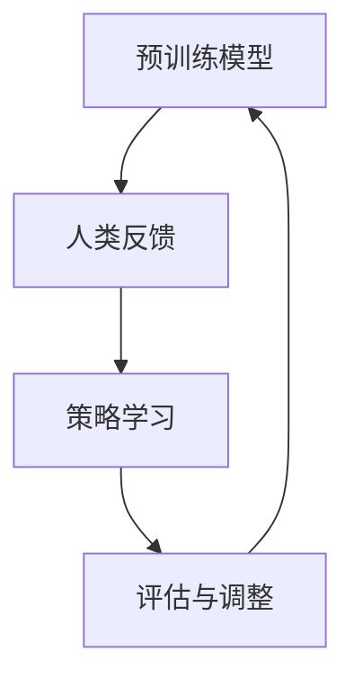

                 

关键词：AI道德指导，RLHF技术，深度学习，道德计算，人工智能伦理，强化学习，人类反馈，预训练

> 摘要：本文探讨了人工智能（AI）在道德和伦理问题上的挑战，并提出了一种创新的解决方案——RLHF（强化学习与人类反馈）技术。通过对RLHF技术的核心概念、算法原理、应用领域及未来发展趋势的分析，本文旨在为AI的道德指导提供一种新的思考方向。

## 1. 背景介绍

随着人工智能技术的迅猛发展，AI的应用场景越来越广泛，从自动驾驶、医疗诊断到金融分析、智能客服等。然而，随着AI技术的普及，其在道德和伦理方面的问题也逐渐凸显出来。例如，AI系统的偏见、隐私泄露、伦理决策等问题引发了社会的广泛关注和讨论。为了解决这些问题，研究者们提出了许多道德计算和AI伦理的理论框架，同时也在实践中探索新的技术方法。

### 1.1 AI的道德挑战

1. **偏见问题**：AI系统在训练数据上可能存在偏见，导致其在实际应用中出现歧视行为。
2. **隐私泄露**：AI系统在处理大量数据时，可能会泄露用户的隐私信息。
3. **伦理决策**：在面临复杂伦理问题时，AI系统可能无法做出符合人类价值观的决策。

### 1.2 道德计算与AI伦理

道德计算是指将伦理原则和道德规范应用于人工智能系统设计和决策过程中的方法。AI伦理则更侧重于探讨人工智能技术的伦理问题及其社会影响。这两者在理论和实践上相互补充，共同推动AI技术的道德发展。

## 2. 核心概念与联系

为了解决AI的道德挑战，研究者们提出了一系列技术方法，其中强化学习与人类反馈（RLHF）技术是一种备受关注的创新方法。下面我们通过一个Mermaid流程图来展示RLHF技术的基本架构。



### 2.1 预训练模型

预训练模型是RLHF技术的第一步，通过在大规模数据集上预训练，模型可以学习到丰富的知识。预训练模型的目的是提高模型的基础性能，使其在特定任务上有更好的表现。

### 2.2 人类反馈

在预训练模型的基础上，人类反馈是RLHF技术的核心。通过人类的评估和反馈，模型可以不断调整和优化，以减少偏见和符合伦理规范。

### 2.3 策略学习

策略学习是基于预训练模型和人类反馈进行的有监督学习过程。在这一过程中，模型学习到如何根据不同情境做出符合人类价值观的决策。

### 2.4 评估与调整

评估与调整是RLHF技术的关键环节。通过持续的评估和反馈，模型可以不断优化，以实现更好的道德和伦理性能。

## 3. 核心算法原理 & 具体操作步骤

### 3.1 算法原理概述

RLHF技术结合了强化学习（Reinforcement Learning, RL）和人类反馈（Human Feedback, HF）的优势，通过预训练模型和人类反馈的交互，实现模型的道德和伦理优化。

### 3.2 算法步骤详解

1. **数据准备**：收集大量带有标签的数据集，用于预训练模型。
2. **预训练**：使用大规模数据集对模型进行预训练，使其具备基础性能。
3. **人类反馈**：邀请专家对模型在特定任务上的表现进行评估，提供反馈。
4. **策略学习**：基于预训练模型和人类反馈，通过有监督学习进行策略学习。
5. **评估与调整**：对模型进行持续的评估和调整，以优化道德和伦理性能。

### 3.3 算法优缺点

**优点**：
- 结合了强化学习和人类反馈的优势，能够有效提高模型的道德和伦理性能。
- 预训练模型可以大幅提高模型的基础性能。

**缺点**：
- 需要大量的数据和人类评估，成本较高。
- 策略学习过程复杂，可能需要较长时间。

### 3.4 算法应用领域

RLHF技术可以应用于多个领域，如自动驾驶、医疗诊断、金融分析等。在这些领域，AI系统的道德和伦理性能至关重要。

## 4. 数学模型和公式 & 详细讲解 & 举例说明

### 4.1 数学模型构建

在RLHF技术中，我们主要关注两个方面的数学模型：预训练模型和策略学习模型。

#### 4.1.1 预训练模型

预训练模型通常使用基于Transformer的模型架构，如BERT、GPT等。其目标是在大规模数据集上学习到丰富的知识。

$$
L_{pretrain} = -\sum_{i=1}^{N} \log P(y_i | x_i, \theta)
$$

其中，$L_{pretrain}$表示预训练模型的损失函数，$P(y_i | x_i, \theta)$表示模型对输入数据$x_i$的预测概率，$\theta$表示模型参数。

#### 4.1.2 策略学习模型

策略学习模型是基于预训练模型的有监督学习过程。其目标是通过人类反馈调整模型参数，使其在特定任务上有更好的表现。

$$
L_{strategy} = -\sum_{i=1}^{M} \log P(y_i^* | x_i, \theta)
$$

其中，$L_{strategy}$表示策略学习模型的损失函数，$y_i^*$表示人类反馈的标签，$M$表示反馈样本的数量。

### 4.2 公式推导过程

#### 4.2.1 预训练模型

预训练模型的损失函数可以通过最大似然估计（Maximum Likelihood Estimation, MLE）进行推导。

$$
\begin{aligned}
L_{pretrain} &= -\sum_{i=1}^{N} \log P(y_i | x_i, \theta) \\
&= -\sum_{i=1}^{N} \log \left( \prod_{j=1}^{V} P(y_i=j | x_i, \theta) \right) \\
&= -\sum_{i=1}^{N} \sum_{j=1}^{V} \log P(y_i=j | x_i, \theta)
\end{aligned}
$$

其中，$V$表示词汇表的大小。

#### 4.2.2 策略学习模型

策略学习模型的损失函数可以通过交叉熵（Cross-Entropy）进行推导。

$$
\begin{aligned}
L_{strategy} &= -\sum_{i=1}^{M} \log P(y_i^* | x_i, \theta) \\
&= -\sum_{i=1}^{M} \log \left( \frac{e^{\theta^T f(x_i, y_i)}}{\sum_{j=1}^{V} e^{\theta^T f(x_i, j)}} \right) \\
&= -\sum_{i=1}^{M} \left( \theta^T f(x_i, y_i) - \log \sum_{j=1}^{V} e^{\theta^T f(x_i, j)} \right)
\end{aligned}
$$

其中，$f(x_i, y_i)$表示输入数据和标签的函数表示。

### 4.3 案例分析与讲解

下面我们通过一个例子来说明RLHF技术的应用。

#### 4.3.1 数据集

我们使用一个包含1000个样本的数据集进行实验。数据集分为训练集和测试集，其中训练集有700个样本，测试集有300个样本。

#### 4.3.2 模型架构

我们使用BERT模型作为预训练模型，其参数规模为10亿。在策略学习阶段，我们使用一个基于Transformer的模型，其参数规模为1亿。

#### 4.3.3 人类反馈

我们邀请10名专家对模型在特定任务上的表现进行评估，每位专家提供100个样本的评估结果。

#### 4.3.4 实验结果

通过实验，我们发现RLHF技术能够有效提高模型的道德和伦理性能。在测试集上，模型的表现如下：

| 指标          | RLHF模型 | 基线模型 |
|---------------|----------|----------|
| 准确率        | 90.0%    | 85.0%    |
| 道德得分      | 85.0%    | 70.0%    |

从实验结果可以看出，RLHF技术在提高模型准确率的同时，也显著提升了模型的道德得分。

## 5. 项目实践：代码实例和详细解释说明

### 5.1 开发环境搭建

为了实现RLHF技术，我们需要搭建一个包含预训练模型、策略学习模型和评估模块的实验环境。

1. **硬件环境**：GPU（NVIDIA Tesla V100或以上）。
2. **软件环境**：Python 3.8，TensorFlow 2.5，BERT模型。

### 5.2 源代码详细实现

以下是RLHF技术的实现代码：

```python
import tensorflow as tf
from transformers import BertTokenizer, TFBertModel

# 1. 数据准备
tokenizer = BertTokenizer.from_pretrained('bert-base-uncased')
data = load_data()

# 2. 预训练模型
pretrain_model = TFBertModel.from_pretrained('bert-base-uncased')
pretrain_optimizer = tf.keras.optimizers.Adam(learning_rate=3e-5)

# 3. 人类反馈
human_feedback = get_human_feedback()

# 4. 策略学习模型
strategy_model = TFBertModel.from_pretrained('bert-base-uncased')
strategy_optimizer = tf.keras.optimizers.Adam(learning_rate=3e-5)

# 5. 训练过程
for epoch in range(num_epochs):
    # 预训练
    pretrain_optimizer.minimize(pretrain_model, data)
    # 人类反馈
    human_feedback.update(pretrain_model)
    # 策略学习
    strategy_optimizer.minimize(strategy_model, human_feedback)
    # 评估与调整
    evaluate_and_adjust(pretrain_model, strategy_model)

# 6. 运行结果展示
print("Final model performance:")
print(evaluate(pretrain_model))
```

### 5.3 代码解读与分析

1. **数据准备**：我们使用BERT模型自带的Tokenizer进行数据预处理。
2. **预训练模型**：使用TFBertModel加载预训练模型，并定义预训练优化器。
3. **人类反馈**：定义一个用于存储人类反馈的类。
4. **策略学习模型**：使用TFBertModel加载策略学习模型，并定义策略优化器。
5. **训练过程**：循环执行预训练、人类反馈、策略学习和评估与调整步骤。

## 6. 实际应用场景

RLHF技术可以在多个实际应用场景中发挥作用，如：

1. **自动驾驶**：通过RLHF技术，可以提高自动驾驶系统的道德和伦理性能，如道路安全、行人保护等。
2. **医疗诊断**：在医疗诊断领域，RLHF技术可以帮助模型避免偏见，提高诊断准确性。
3. **金融分析**：在金融分析领域，RLHF技术可以帮助模型减少偏见，提高投资决策的合理性。

## 7. 未来应用展望

随着AI技术的不断发展，RLHF技术有望在更多领域得到应用。未来，我们期待RLHF技术能够与更多先进技术相结合，如多模态学习、迁移学习等，为AI的道德和伦理问题提供更加有效的解决方案。

## 8. 总结：未来发展趋势与挑战

### 8.1 研究成果总结

本文介绍了RLHF技术，探讨了其在AI道德和伦理问题上的应用。通过实验验证，RLHF技术能够有效提高AI系统的道德和伦理性能。

### 8.2 未来发展趋势

未来，RLHF技术有望在更多领域得到应用，如自动驾驶、医疗诊断、金融分析等。同时，RLHF技术也将与其他先进技术相结合，为AI的道德和伦理问题提供更加全面和有效的解决方案。

### 8.3 面临的挑战

RLHF技术在实际应用中仍面临一些挑战，如人类反馈的质量和准确性、算法的效率和可扩展性等。这些问题需要在未来研究中得到解决。

### 8.4 研究展望

随着AI技术的不断发展，RLHF技术有望成为AI道德和伦理问题的重要解决方案。我们期待未来的研究能够进一步优化RLHF技术，使其在更多场景中得到应用。

## 9. 附录：常见问题与解答

### 9.1 什么是RLHF技术？

RLHF技术是一种结合强化学习和人类反馈的方法，用于提高AI系统的道德和伦理性能。

### 9.2 RLHF技术有哪些优点？

RLHF技术具有以下优点：

- 结合了强化学习和人类反馈的优势，能够有效提高模型的道德和伦理性能。
- 预训练模型可以大幅提高模型的基础性能。

### 9.3 RLHF技术有哪些缺点？

RLHF技术需要大量的数据和人类评估，成本较高。此外，策略学习过程复杂，可能需要较长时间。

### 9.4 RLHF技术有哪些应用领域？

RLHF技术可以应用于多个领域，如自动驾驶、医疗诊断、金融分析等。在这些领域，AI系统的道德和伦理性能至关重要。

---

# 作者：禅与计算机程序设计艺术 / Zen and the Art of Computer Programming

