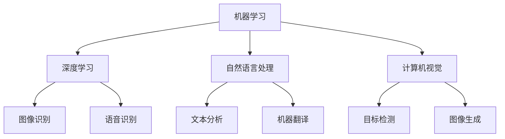

                 

关键词：人工智能，深度学习，机器学习，自然语言处理，计算机视觉，人工智能应用，未来趋势，研究挑战

> 摘要：本文将深入探讨人工智能（AI）研究的最新进展与趋势。从核心概念、算法原理、数学模型、实践案例到应用场景和未来展望，全面梳理AI领域的关键领域和发展动态，旨在为读者提供一幅全面、清晰的AI研究全景图。

## 1. 背景介绍

自20世纪50年代人工智能（AI）概念首次提出以来，AI技术经历了多个发展阶段。早期的AI以符号逻辑和知识表示为主要特征，但受限于计算能力和数据量，其应用范围有限。随着计算机性能的不断提升和大数据时代的到来，机器学习和深度学习逐渐成为AI研究的核心驱动力。

机器学习是AI的重要分支，通过算法让计算机从数据中自动学习并做出决策。深度学习作为机器学习的一个子领域，通过构建多层的神经网络来模拟人脑的学习过程，已经在图像识别、语音识别和自然语言处理等领域取得了显著成果。

自然语言处理（NLP）和计算机视觉是AI领域的两个重要研究方向。NLP旨在使计算机能够理解、生成和处理人类语言，而计算机视觉则致力于使计算机能够“看”和理解现实世界的图像和视频。

## 2. 核心概念与联系

下面我们将使用Mermaid流程图来展示AI领域中的核心概念和它们之间的联系。



### 2.1 机器学习与深度学习

机器学习是一种通过算法让计算机从数据中学习的方法。深度学习则是机器学习的一种特殊形式，利用多层神经网络来进行数据分析和模式识别。深度学习在图像识别、语音识别和自然语言处理等领域具有显著优势。

### 2.2 自然语言处理

自然语言处理旨在使计算机能够理解和生成人类语言。其主要任务包括文本分类、情感分析、文本生成和机器翻译等。

### 2.3 计算机视觉

计算机视觉则致力于使计算机能够理解和分析图像和视频。其主要任务包括目标检测、图像分类、图像分割和图像生成等。

## 3. 核心算法原理 & 具体操作步骤

### 3.1 算法原理概述

深度学习算法的核心是神经网络。神经网络由多个神经元（或节点）组成，每个节点都与其他节点相连。通过反向传播算法，神经网络能够根据输入数据和期望输出不断调整各节点的权重，从而实现数据的自动学习。

### 3.2 算法步骤详解

1. **数据预处理**：将原始数据转化为适合神经网络训练的格式。
2. **构建神经网络**：定义网络结构，包括输入层、隐藏层和输出层。
3. **初始化权重**：随机初始化各节点的权重。
4. **前向传播**：将输入数据传递到神经网络，计算出输出结果。
5. **计算误差**：将输出结果与期望输出进行比较，计算误差。
6. **反向传播**：根据误差调整各节点的权重。
7. **重复步骤4-6**：不断迭代，直到误差达到预定阈值。

### 3.3 算法优缺点

**优点**：
- 能够从大量数据中自动学习并提取特征。
- 具有良好的泛化能力，能够应用于不同领域。

**缺点**：
- 训练时间较长，对计算资源要求较高。
- 对数据质量和预处理要求较高。

### 3.4 算法应用领域

深度学习算法已广泛应用于图像识别、语音识别、自然语言处理和计算机视觉等领域。例如，在图像识别中，深度学习算法可以用于人脸识别、物体检测和图像分类等任务。

## 4. 数学模型和公式 & 详细讲解 & 举例说明

### 4.1 数学模型构建

深度学习中的数学模型主要包括神经网络、激活函数、损失函数和优化算法等。

### 4.2 公式推导过程

下面我们以神经网络中的损失函数为例，讲解其公式推导过程。

假设我们有一个神经网络，其中包含输入层、隐藏层和输出层。输出层有一个神经元，用于预测某个分类结果。假设预测结果为y，真实结果为t，则损失函数可以表示为：

$$
L(y, t) = \frac{1}{2} (y - t)^2
$$

其中，y表示输出值，t表示真实值。

### 4.3 案例分析与讲解

以图像分类任务为例，我们使用一个简单的卷积神经网络（CNN）来对图像进行分类。

1. **数据预处理**：将图像数据缩放到固定的尺寸，并进行归一化处理。
2. **构建神经网络**：定义网络结构，包括卷积层、池化层和全连接层。
3. **初始化权重**：随机初始化各层的权重。
4. **前向传播**：将输入图像传递到神经网络，计算出输出结果。
5. **计算损失**：将输出结果与真实结果进行比较，计算损失值。
6. **反向传播**：根据损失值调整各层的权重。
7. **重复步骤4-6**：不断迭代，直到误差达到预定阈值。

## 5. 项目实践：代码实例和详细解释说明

### 5.1 开发环境搭建

1. 安装Python环境。
2. 安装TensorFlow库。

### 5.2 源代码详细实现

下面是一个简单的图像分类代码实例：

```python
import tensorflow as tf
from tensorflow.keras import datasets, layers, models

# 加载数据集
(train_images, train_labels), (test_images, test_labels) = datasets.cifar10.load_data()

# 数据预处理
train_images, test_images = train_images / 255.0, test_images / 255.0

# 构建卷积神经网络
model = models.Sequential()
model.add(layers.Conv2D(32, (3, 3), activation='relu', input_shape=(32, 32, 3)))
model.add(layers.MaxPooling2D((2, 2)))
model.add(layers.Conv2D(64, (3, 3), activation='relu'))
model.add(layers.MaxPooling2D((2, 2)))
model.add(layers.Conv2D(64, (3, 3), activation='relu'))

# 添加全连接层
model.add(layers.Flatten())
model.add(layers.Dense(64, activation='relu'))
model.add(layers.Dense(10))

# 编译模型
model.compile(optimizer='adam',
              loss=tf.keras.losses.SparseCategoricalCrossentropy(from_logits=True),
              metrics=['accuracy'])

# 训练模型
model.fit(train_images, train_labels, epochs=10, validation_data=(test_images, test_labels))

# 评估模型
test_loss, test_acc = model.evaluate(test_images,  test_labels, verbose=2)
print(f'测试准确率：{test_acc:.4f}')
```

### 5.3 代码解读与分析

1. **数据预处理**：将图像数据缩放到固定的尺寸，并进行归一化处理，以便神经网络能够更好地训练。
2. **构建神经网络**：使用卷积神经网络（CNN）对图像进行特征提取。
3. **编译模型**：指定优化器、损失函数和评估指标。
4. **训练模型**：使用训练数据对模型进行训练。
5. **评估模型**：使用测试数据评估模型的性能。

## 6. 实际应用场景

AI技术在各个领域都有广泛的应用。例如：

1. **医疗领域**：AI可以帮助医生进行疾病诊断、医学图像分析和药物研发。
2. **金融领域**：AI可以用于风险评估、交易策略制定和欺诈检测。
3. **自动驾驶**：AI技术是自动驾驶汽车的核心驱动力，可以实时分析道路情况并做出决策。
4. **智能家居**：AI技术可以实现智能家居设备的自动化控制，提高生活质量。

### 6.4 未来应用展望

随着AI技术的不断发展，未来它将在更多领域得到应用。例如，AI有望在环保、能源、教育和国家安全等领域发挥重要作用。同时，我们也需要关注AI带来的伦理和社会问题，确保其发展符合人类的价值观和利益。

## 7. 工具和资源推荐

### 7.1 学习资源推荐

1. 《深度学习》（Ian Goodfellow, Yoshua Bengio, Aaron Courville著）
2. 《Python机器学习》（Sebastian Raschka著）
3. 《自然语言处理实战》（Michael L.ighb著）

### 7.2 开发工具推荐

1. TensorFlow
2. PyTorch
3. Keras

### 7.3 相关论文推荐

1. "A Neural Algorithm of Artistic Style"（2015）
2. "Deep Learning for Computer Vision: A Comprehensive Review"（2017）
3. "Natural Language Processing with Deep Learning"（2018）

## 8. 总结：未来发展趋势与挑战

### 8.1 研究成果总结

近年来，AI技术取得了显著进展，尤其是在图像识别、语音识别和自然语言处理等领域。深度学习算法的应用使得计算机在某些任务上已经超越了人类。

### 8.2 未来发展趋势

随着计算能力的提升和数据量的增长，AI技术将在更多领域得到应用。同时，新型算法和架构的提出将进一步推动AI技术的发展。

### 8.3 面临的挑战

尽管AI技术取得了显著进展，但仍面临诸多挑战。例如，数据隐私、算法透明度和公平性等问题亟待解决。

### 8.4 研究展望

未来，AI技术将在更多领域发挥重要作用。同时，我们还需要关注其伦理和社会影响，确保其发展符合人类的利益和价值观。

## 9. 附录：常见问题与解答

### 9.1 什么是机器学习？

机器学习是一种通过算法让计算机从数据中学习并做出决策的方法。它包括监督学习、无监督学习和强化学习等不同类型。

### 9.2 什么是深度学习？

深度学习是机器学习的一种特殊形式，利用多层神经网络来进行数据分析和模式识别。它在图像识别、语音识别和自然语言处理等领域具有显著优势。

### 9.3 如何学习AI技术？

学习AI技术可以从以下几个步骤入手：

1. 学习Python编程基础。
2. 学习机器学习和深度学习理论。
3. 实践项目，积累经验。

----------------------------------------------------------------

本文旨在为读者提供一个全面、清晰的AI研究全景图，以期为人工智能技术的发展和应用提供有益的参考。随着AI技术的不断发展，我们有理由相信，它将在未来为人类社会带来更多的变革和机遇。

