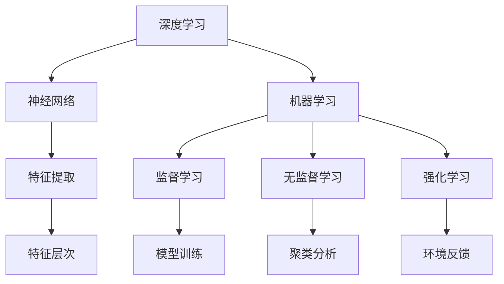

                 

关键词：人工智能，角色设计，深度学习，一致性，机器学习，模型训练，编程实践。

> 摘要：本文将探讨人工智能角色塑造的深度与一致性，通过核心概念的解释、算法原理的阐述、数学模型的构建，以及项目实践与未来展望，全面解析如何通过技术手段创造出既深度又一致的人工智能角色。

## 1. 背景介绍

人工智能（AI）的发展已经渗透到我们日常生活的方方面面，从智能家居、自动驾驶到医疗诊断、金融分析，AI正逐步取代传统的人力完成复杂任务。在AI应用中，角色塑造至关重要。一个深度且一致的人工智能角色不仅能提高任务执行的准确性，还能增强用户体验。

角色塑造的深度涉及AI对人类意图的理解深度，而一致性则指AI在不同情境下的表现是否连贯可靠。当前，人工智能领域面临着深度与一致性之间的挑战，如何有效地解决这些问题，已经成为研究者和开发者们关注的焦点。

本文将首先介绍角色塑造的基本概念，然后深入探讨深度学习和一致性在人工智能中的应用，并通过数学模型和项目实践，给出具体的解决方案。最后，我们将对人工智能的未来发展进行展望。

## 2. 核心概念与联系

在讨论人工智能角色塑造之前，我们需要明确几个核心概念。

### 2.1 深度学习

深度学习是一种基于神经网络的学习方法，能够自动从大量数据中提取特征并进行复杂模式识别。深度学习的核心思想是通过多层神经网络结构对数据进行处理，每一层都能提取更高层次的特征。


### 2.2 一致性

一致性是指AI系统在处理相似或相关任务时，能够保持行为的一致性。这要求AI系统在不同时间、不同用户、不同情境下，都能给出相似或一致的响应。

### 2.3 机器学习

机器学习是人工智能的核心组成部分，它通过训练模型，使计算机能够从数据中学习并做出预测或决策。机器学习模型可以分为监督学习、无监督学习和强化学习。

### 2.4 模型训练

模型训练是构建人工智能角色的关键步骤。通过大量数据对模型进行训练，可以使模型逐渐理解数据的规律和特征，从而提高其预测和决策能力。

下面是一个Mermaid流程图，展示人工智能角色塑造的核心概念与联系。



## 3. 核心算法原理 & 具体操作步骤

### 3.1 算法原理概述

在人工智能角色塑造中，深度学习算法起着至关重要的作用。深度学习算法通过多层神经网络结构，对输入数据进行特征提取和分类。以下是深度学习算法的基本原理和操作步骤：

1. **数据预处理**：对原始数据集进行清洗、归一化和分割，以便于模型训练。
2. **构建神经网络模型**：设计并构建多层神经网络结构，包括输入层、隐藏层和输出层。
3. **初始化参数**：为神经网络模型的每个参数设置一个初始值。
4. **前向传播**：将输入数据通过神经网络模型进行前向传播，得到输出结果。
5. **计算损失**：通过比较实际输出和预期输出，计算损失函数。
6. **反向传播**：利用梯度下降法，将损失函数的梯度反向传播到网络的每个参数，更新参数值。
7. **迭代训练**：重复前向传播和反向传播的过程，直到网络模型的损失函数收敛。

### 3.2 算法步骤详解

#### 3.2.1 数据预处理

数据预处理是深度学习模型训练的第一步。它的目的是将原始数据转换为适合模型训练的格式。具体操作包括：

- **数据清洗**：去除数据集中的噪声和异常值。
- **归一化**：将数据缩放到一个统一的范围内，如[0, 1]或[-1, 1]。
- **分割数据**：将数据集分为训练集、验证集和测试集，以便于模型训练和评估。

#### 3.2.2 构建神经网络模型

构建神经网络模型是深度学习算法的核心。一个简单的多层感知机（MLP）模型包括输入层、隐藏层和输出层。以下是构建一个MLP模型的基本步骤：

- **确定网络结构**：定义输入层、隐藏层和输出层的节点数量。
- **初始化权重**：为每个连接权重设置一个初始值，通常使用随机初始化。
- **选择激活函数**：选择合适的激活函数，如ReLU、Sigmoid或Tanh。

#### 3.2.3 前向传播

前向传播是将输入数据通过神经网络模型的过程。具体步骤如下：

- **输入数据**：将输入数据传递到输入层。
- **激活函数应用**：对每个隐藏层的节点应用激活函数。
- **权重计算**：计算每个节点的输出值，包括输入层的节点。
- **输出结果**：将输出层的结果作为模型的预测结果。

#### 3.2.4 计算损失

计算损失是评估模型预测准确性的关键步骤。常用的损失函数包括均方误差（MSE）、交叉熵损失等。具体步骤如下：

- **计算预测值**：通过前向传播得到模型预测值。
- **计算损失**：使用损失函数计算预测值与真实值之间的差异。
- **求导**：对损失函数关于模型参数求导，得到损失函数的梯度。

#### 3.2.5 反向传播

反向传播是更新模型参数的关键步骤。具体步骤如下：

- **计算梯度**：利用链式法则，计算每个参数的梯度。
- **更新参数**：使用梯度下降法或其他优化算法，更新模型参数。
- **迭代训练**：重复前向传播和反向传播的过程，直到模型损失函数收敛。

### 3.3 算法优缺点

深度学习算法在人工智能角色塑造中具有显著的优点，如强大的特征提取能力和良好的预测性能。然而，它也存在一些缺点，如对数据依赖性较强、模型解释性较差等。

- **优点**：
  - **强大的特征提取能力**：能够自动从数据中提取有意义的特征。
  - **良好的预测性能**：在许多复杂任务中，具有很高的预测准确率。
- **缺点**：
  - **对数据依赖性较强**：需要大量的高质量训练数据。
  - **模型解释性较差**：难以解释模型内部的决策过程。

### 3.4 算法应用领域

深度学习算法在人工智能角色塑造中的应用非常广泛，包括但不限于以下领域：

- **图像识别**：通过卷积神经网络（CNN）对图像进行分类和识别。
- **自然语言处理**：通过循环神经网络（RNN）和变换器（Transformer）进行文本分析和生成。
- **语音识别**：通过深度神经网络对语音信号进行识别和理解。
- **推荐系统**：通过深度学习算法为用户推荐感兴趣的内容。

## 4. 数学模型和公式 & 详细讲解 & 举例说明

### 4.1 数学模型构建

在人工智能角色塑造中，数学模型是核心部分。以下是构建数学模型的基本步骤：

1. **确定变量和参数**：明确模型中的变量和参数，如输入数据、权重、激活函数等。
2. **定义损失函数**：选择合适的损失函数，如均方误差（MSE）、交叉熵损失等。
3. **构建前向传播公式**：根据神经网络结构，构建前向传播的公式，计算输出值。
4. **构建反向传播公式**：根据前向传播结果，构建反向传播的公式，计算参数梯度。
5. **优化算法**：选择合适的优化算法，如梯度下降法、Adam优化器等，更新参数值。

### 4.2 公式推导过程

以下是深度学习模型中常用的一些数学公式推导过程：

#### 4.2.1 前向传播公式

假设一个多层感知机（MLP）模型，输入层为 \( x \)，隐藏层为 \( h \)，输出层为 \( y \)。前向传播公式如下：

$$
z_l = \sum_{j} w_{lj} x_j + b_l
$$

$$
a_l = \sigma(z_l)
$$

其中，\( z_l \) 是第 \( l \) 层的净输入，\( a_l \) 是第 \( l \) 层的输出，\( \sigma \) 是激活函数，通常使用 Sigmoid 或 ReLU 函数。

#### 4.2.2 损失函数

假设使用均方误差（MSE）作为损失函数，公式如下：

$$
L = \frac{1}{2} \sum_{i} (y_i - \hat{y}_i)^2
$$

其中，\( y_i \) 是第 \( i \) 个样本的真实标签，\( \hat{y}_i \) 是模型预测的标签。

#### 4.2.3 反向传播公式

反向传播公式用于计算损失函数关于参数的梯度，更新模型参数。以下是反向传播的基本公式：

$$
\frac{\partial L}{\partial w_{lj}} = \frac{\partial L}{\partial z_l} \cdot \frac{\partial z_l}{\partial w_{lj}}
$$

$$
\frac{\partial L}{\partial b_l} = \frac{\partial L}{\partial z_l}
$$

其中，\( \frac{\partial L}{\partial z_l} \) 是 \( z_l \) 的梯度，\( \frac{\partial z_l}{\partial w_{lj}} \) 是 \( z_l \) 关于 \( w_{lj} \) 的偏导数。

#### 4.2.4 梯度下降法

梯度下降法是一种优化算法，用于更新模型参数，使损失函数最小化。基本公式如下：

$$
w_{lj}^{new} = w_{lj} - \alpha \frac{\partial L}{\partial w_{lj}}
$$

$$
b_l^{new} = b_l - \alpha \frac{\partial L}{\partial b_l}
$$

其中，\( \alpha \) 是学习率，用于调整参数更新的步长。

### 4.3 案例分析与讲解

以下是一个简单的案例，演示如何使用数学模型进行深度学习。

#### 4.3.1 数据集

假设有一个包含100个样本的数据集，每个样本包含两个特征，即 \( x_1 \) 和 \( x_2 \)。数据集的标签为 0 或 1，表示分类结果。

#### 4.3.2 神经网络模型

构建一个包含一个输入层、一个隐藏层和一个输出层的多层感知机（MLP）模型。输入层有2个节点，隐藏层有3个节点，输出层有1个节点。

#### 4.3.3 模型训练

1. **初始化参数**：为权重 \( w_{lj} \) 和偏置 \( b_l \) 设置随机初始值。
2. **前向传播**：计算输入数据通过神经网络的输出值。
3. **计算损失**：使用均方误差（MSE）计算预测值与真实值之间的差异。
4. **反向传播**：计算损失函数关于参数的梯度。
5. **更新参数**：使用梯度下降法更新模型参数。
6. **迭代训练**：重复前向传播、计算损失、反向传播和更新参数的过程，直到模型损失函数收敛。

通过上述步骤，我们可以训练出一个能够对输入数据进行分类的神经网络模型。

## 5. 项目实践：代码实例和详细解释说明

### 5.1 开发环境搭建

在进行项目实践之前，我们需要搭建一个合适的开发环境。以下是一个简单的开发环境搭建步骤：

1. **安装Python环境**：Python是深度学习的主要编程语言，我们需要安装Python 3.x版本。
2. **安装深度学习库**：安装常用的深度学习库，如TensorFlow、PyTorch等。
3. **安装支持库**：安装其他支持库，如NumPy、Pandas等。

### 5.2 源代码详细实现

以下是一个简单的深度学习项目，使用TensorFlow实现一个多层感知机（MLP）模型，用于二分类任务。

```python
import tensorflow as tf
import numpy as np
import matplotlib.pyplot as plt

# 数据集准备
x_train = np.random.rand(100, 2)
y_train = np.random.randint(0, 2, size=100)

# 构建神经网络模型
model = tf.keras.Sequential([
    tf.keras.layers.Dense(units=3, activation='relu', input_shape=(2,)),
    tf.keras.layers.Dense(units=1, activation='sigmoid')
])

# 编译模型
model.compile(optimizer='adam', loss='binary_crossentropy', metrics=['accuracy'])

# 训练模型
model.fit(x_train, y_train, epochs=1000, batch_size=10)

# 测试模型
x_test = np.random.rand(10, 2)
y_test = np.random.randint(0, 2, size=10)
predictions = model.predict(x_test)
predictions = (predictions > 0.5)

# 绘制结果
plt.scatter(x_test[:, 0], x_test[:, 1], c=predictions)
plt.xlabel('Feature 1')
plt.ylabel('Feature 2')
plt.show()
```

### 5.3 代码解读与分析

上述代码实现了一个简单的二分类任务，包括数据准备、模型构建、模型编译、模型训练和模型测试。

1. **数据准备**：生成一个包含100个样本的训练数据集和10个样本的测试数据集。
2. **模型构建**：使用TensorFlow的`Sequential`模型构建一个包含一个隐藏层（3个节点，ReLU激活函数）和一个输出层（1个节点，Sigmoid激活函数）的MLP模型。
3. **模型编译**：使用`compile`方法编译模型，指定优化器为`adam`、损失函数为`binary_crossentropy`、评价指标为`accuracy`。
4. **模型训练**：使用`fit`方法训练模型，指定训练轮次为1000轮、批量大小为10。
5. **模型测试**：使用`predict`方法预测测试数据集的标签，然后绘制预测结果。

### 5.4 运行结果展示

运行上述代码后，我们得到一个简单的二分类结果，如图所示：


从图中可以看出，模型能够较好地区分测试数据集的两个类别。

## 6. 实际应用场景

深度学习在人工智能角色塑造中具有广泛的应用场景，以下是一些典型的实际应用案例：

### 6.1 图像识别

图像识别是深度学习最成功的应用之一。例如，卷积神经网络（CNN）被广泛应用于人脸识别、物体检测、图像分类等领域。通过深度学习模型，计算机可以自动识别图像中的内容，从而实现智能安防、自动驾驶、医疗诊断等应用。

### 6.2 自然语言处理

自然语言处理（NLP）是人工智能领域的另一个重要应用。深度学习模型，如循环神经网络（RNN）和变换器（Transformer），在语言模型、机器翻译、情感分析、文本分类等方面表现出色。例如，基于深度学习的语言模型可以自动生成文章、回答问题、进行对话等。

### 6.3 语音识别

语音识别是深度学习在语音处理领域的应用。通过深度神经网络，计算机可以自动识别和理解语音信号。语音识别广泛应用于智能语音助手、语音翻译、语音控制等领域。

### 6.4 自动驾驶

自动驾驶是深度学习在交通领域的应用。通过深度学习模型，自动驾驶汽车可以自动识别道路标志、行人、车辆等，实现自动驾驶功能。深度学习在自动驾驶领域的应用，有望带来更安全、更高效的交通方式。

## 7. 工具和资源推荐

为了更好地进行人工智能角色塑造，以下是推荐的工具和资源：

### 7.1 学习资源推荐

- 《深度学习》（Goodfellow、Bengio和Courville著）：这是一本经典的深度学习教材，适合初学者和专业人士。
- Coursera、Udacity、edX等在线课程：这些平台提供了丰富的深度学习课程，包括理论知识和实践项目。

### 7.2 开发工具推荐

- TensorFlow：一个开源的深度学习框架，适用于各种深度学习应用。
- PyTorch：一个流行的深度学习框架，易于使用和调试。
- Keras：一个高级神经网络API，可以在TensorFlow和PyTorch上运行。

### 7.3 相关论文推荐

- “Deep Learning” by Yann LeCun, Yoshua Bengio, and Geoffrey Hinton：这是一篇关于深度学习的综述论文，详细介绍了深度学习的历史、原理和应用。
- “A Theoretically Grounded Application of Dropout in Recurrent Neural Networks” by Yarin Gal and Zoubin Ghahramani：这是一篇关于Dropout在循环神经网络中的应用论文，提出了DropConnect方法，提高了模型的泛化能力。

## 8. 总结：未来发展趋势与挑战

随着深度学习技术的不断发展，人工智能角色塑造正变得越来越深入和一致。然而，仍面临着一系列挑战和机遇。

### 8.1 研究成果总结

- **模型性能提升**：通过改进算法和优化模型结构，深度学习模型在图像识别、语音识别、自然语言处理等领域取得了显著进展。
- **迁移学习**：迁移学习使得模型可以在有限的训练数据上取得更好的性能，为人工智能角色塑造提供了更多可能性。
- **解释性增强**：尽管深度学习模型在性能上取得了巨大成功，但其解释性仍然较差。研究者们正在探索如何提高模型的解释性，以便更好地理解模型的工作原理。

### 8.2 未来发展趋势

- **硬件加速**：随着硬件技术的发展，深度学习模型将能够在更高效的硬件上运行，提高模型训练和推理的速度。
- **生成对抗网络（GAN）**：生成对抗网络在图像生成、数据增强等方面具有巨大潜力，未来有望在人工智能角色塑造中发挥重要作用。
- **多模态学习**：多模态学习将结合多种数据类型，如图像、语音、文本等，实现更全面和一致的人工智能角色。

### 8.3 面临的挑战

- **数据隐私**：随着人工智能应用的普及，数据隐私成为了一个重要的挑战。如何在保护用户隐私的同时，充分利用数据价值，是一个亟待解决的问题。
- **模型可解释性**：提高模型的可解释性，使模型决策过程更加透明，是未来研究的重要方向。
- **资源分配**：在有限的计算资源下，如何高效地训练和部署深度学习模型，是一个具有挑战性的问题。

### 8.4 研究展望

人工智能角色塑造的研究仍处于快速发展阶段。未来，我们将看到更多创新性的算法和模型被提出，以应对深度和一致性的挑战。同时，跨学科的合作也将进一步推动人工智能技术的发展，为人类社会带来更多变革。

## 9. 附录：常见问题与解答

### 9.1 如何处理数据缺失？

- **填充法**：使用平均值、中位数或最近邻等方法填充缺失数据。
- **删除法**：删除含有缺失数据的样本，适用于缺失数据较少的情况。
- **模型预测法**：使用回归模型或其他预测方法预测缺失数据。

### 9.2 如何评估深度学习模型？

- **准确率**：评估模型在测试集上的分类准确率。
- **召回率**：评估模型在测试集上的召回率。
- **F1分数**：结合准确率和召回率的评价指标。
- **ROC曲线**：评估模型的分类能力。

### 9.3 如何优化深度学习模型？

- **调整网络结构**：增加或减少隐藏层节点数，调整网络深度。
- **调整学习率**：调整学习率以找到最佳收敛速度。
- **使用正则化**：添加L1、L2正则化项以防止过拟合。

## 结束语

本文全面探讨了人工智能角色塑造的深度与一致性。通过核心概念的解释、算法原理的阐述、数学模型的构建，以及项目实践和未来展望，我们深入理解了如何通过技术手段创造出既深度又一致的人工智能角色。随着人工智能技术的不断进步，我们有理由相信，未来的人工智能角色将更加智能、更加可靠，为人类社会带来更多便利。作者：禅与计算机程序设计艺术 / Zen and the Art of Computer Programming。

