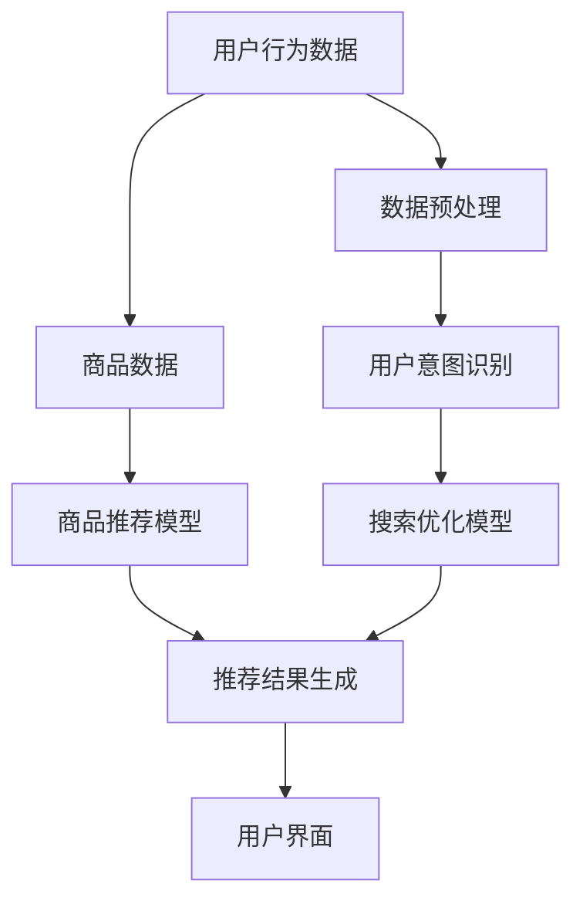

                 

关键词：人工智能、电商搜索、用户转化率、实践案例

> 摘要：本文将探讨如何利用人工智能技术提升电商平台的搜索导购效果，通过实际案例展示如何通过精准搜索、个性化推荐和智能交互等功能，实现用户的高效导购，从而提高用户满意度和转化率。

## 1. 背景介绍

在电子商务迅猛发展的今天，搜索导购成为电商平台吸引用户和提升销售额的关键环节。传统搜索方法往往依赖于关键词匹配，这种方式存在诸多局限，如无法理解用户真正的需求、推荐结果单一化等。而人工智能技术的引入，为电商搜索导购提供了全新的解决方案。

AI技术通过自然语言处理、机器学习、深度学习等方法，能够理解和分析用户的搜索意图，提供更精准、更个性化的推荐结果。同时，智能交互功能的加入，使得用户在搜索过程中获得更加自然、流畅的体验。

本文将围绕以下方面展开讨论：

1. **核心概念与联系**：介绍AI在电商搜索导购中的应用原理和架构。
2. **核心算法原理与具体操作步骤**：讲解实现智能搜索和推荐的关键算法及其应用。
3. **数学模型和公式**：分析构建AI模型所需的基础数学公式。
4. **项目实践**：通过代码实例展示如何实现AI赋能的电商搜索导购系统。
5. **实际应用场景**：探讨AI技术在电商搜索导购中的广泛应用。
6. **未来应用展望**：展望AI技术在电商搜索导购领域的未来发展方向。
7. **工具和资源推荐**：推荐相关的学习资源和开发工具。
8. **总结**：总结研究成果，展望未来挑战和机遇。

### 1.1 人工智能与电商搜索导购的关系

人工智能（AI）作为新一轮科技革命和产业变革的重要驱动力量，正在深刻改变各行各业。在电商搜索导购领域，AI的应用主要体现在以下几个方面：

- **自然语言处理（NLP）**：通过理解用户的搜索意图，提供更准确的推荐结果。
- **机器学习与深度学习**：通过海量数据训练模型，实现个性化推荐和智能交互。
- **图像识别与处理**：为用户提供视觉化的搜索和推荐体验。
- **用户行为分析**：通过分析用户行为数据，优化搜索和推荐效果。

### 1.2 传统电商搜索导购的局限性

传统电商搜索导购方法主要依赖于关键词匹配，存在以下局限性：

- **搜索结果单一化**：只能根据用户输入的关键词提供简单的搜索结果，无法理解用户深层次的需求。
- **推荐结果不准确**：难以根据用户历史行为和偏好提供个性化的推荐。
- **用户体验差**：搜索流程繁琐，用户需要多次输入和筛选才能找到想要的商品。

### 1.3 人工智能赋能电商搜索导购的优势

人工智能赋能电商搜索导购具有以下优势：

- **精准推荐**：通过理解用户意图，提供个性化的推荐结果，提升用户满意度。
- **智能交互**：通过自然语言处理和智能问答，提升用户的购物体验。
- **实时更新**：根据用户行为和搜索历史实时调整推荐策略，提高搜索和推荐的实时性。

### 1.4 本文结构

本文结构如下：

1. **核心概念与联系**：介绍AI在电商搜索导购中的应用原理和架构。
2. **核心算法原理与具体操作步骤**：讲解实现智能搜索和推荐的关键算法及其应用。
3. **数学模型和公式**：分析构建AI模型所需的基础数学公式。
4. **项目实践**：通过代码实例展示如何实现AI赋能的电商搜索导购系统。
5. **实际应用场景**：探讨AI技术在电商搜索导购中的广泛应用。
6. **未来应用展望**：展望AI技术在电商搜索导购领域的未来发展方向。
7. **工具和资源推荐**：推荐相关的学习资源和开发工具。
8. **总结**：总结研究成果，展望未来挑战和机遇。

通过本文的探讨，希望读者能够对AI赋能电商搜索导购有更深入的理解，并能够在实际项目中应用这些技术，提升用户体验和转化率。

## 2. 核心概念与联系

在深入探讨AI赋能电商搜索导购之前，我们需要理解几个核心概念，并分析它们之间的联系。以下是对这些核心概念的详细解释，以及如何将这些概念结合起来构建一个高效的搜索导购系统。

### 2.1 自然语言处理（NLP）

自然语言处理（NLP）是AI领域中一个重要的分支，旨在使计算机能够理解、解析和生成人类语言。在电商搜索导购中，NLP技术可以帮助平台理解用户的搜索意图，从而提供更精准的推荐。

**NLP的核心技术包括：**

- **分词**：将连续的文本拆分成单个词汇，为后续的语义分析做准备。
- **词性标注**：为每个词赋予相应的词性，如名词、动词、形容词等。
- **实体识别**：识别文本中的特定实体，如人名、地名、组织名等。
- **语义分析**：通过上下文理解文本的语义，例如情感分析、主题识别等。

**NLP在电商搜索导购中的应用：**

- **意图识别**：通过分析用户的搜索输入，识别用户想要完成的具体任务，如“查找某款手机的评价”、“购买某品牌的口红”等。
- **实体抽取**：识别用户搜索中的关键信息，如商品名称、品牌、价格等，以便进行精准推荐。
- **情感分析**：分析用户评论和反馈，了解用户对商品的满意程度，优化推荐策略。

### 2.2 机器学习与深度学习

机器学习（ML）和深度学习（DL）是AI领域的两个重要分支，它们通过从数据中学习规律和模式，为AI系统提供强大的推理和预测能力。在电商搜索导购中，ML和DL技术被广泛应用于个性化推荐、用户行为预测等方面。

**机器学习与深度学习的关键技术包括：**

- **监督学习**：通过标注数据训练模型，使其能够预测未知数据的结果。
- **无监督学习**：不依赖于标注数据，通过数据自身的特征进行聚类或降维。
- **深度学习**：基于多层神经网络，通过反向传播算法自动调整网络权重，实现高层次的抽象和特征提取。

**机器学习与深度学习在电商搜索导购中的应用：**

- **用户行为预测**：通过分析用户的历史行为，预测用户的下一步操作，从而提供个性化的推荐。
- **商品推荐**：通过用户的历史购买记录、浏览记录等数据，为用户推荐可能感兴趣的商品。
- **搜索优化**：根据用户的搜索历史和偏好，优化搜索结果，提升用户体验。

### 2.3 图像识别与处理

图像识别与处理技术使得计算机能够理解和解释图像内容，为电商搜索导购提供了更加直观和便捷的体验。

**图像识别与处理的关键技术包括：**

- **目标检测**：识别图像中的特定目标对象，并定位其位置。
- **图像分类**：将图像按照其内容进行分类，如猫、狗、植物等。
- **图像增强**：通过调整图像的亮度、对比度、锐度等，提高图像质量。

**图像识别与处理在电商搜索导购中的应用：**

- **商品识别**：通过图像识别技术，用户可以直接上传商品图片，系统自动识别并推荐相关商品。
- **视觉搜索**：用户可以通过上传图片，快速找到与图片相似的或相关的商品。
- **商品展示**：通过图像处理技术，优化商品图片的展示效果，提升用户购买欲望。

### 2.4 用户行为分析

用户行为分析是指通过对用户在电商平台上的行为数据进行收集、处理和分析，以了解用户的偏好和需求，从而优化推荐策略和用户体验。

**用户行为分析的关键技术包括：**

- **数据采集**：收集用户在平台上的各种行为数据，如搜索记录、浏览记录、购买记录等。
- **数据分析**：通过统计分析和机器学习算法，提取用户行为的特征和模式。
- **数据可视化**：通过图表和报表，直观展示用户行为数据，辅助决策。

**用户行为分析在电商搜索导购中的应用：**

- **个性化推荐**：根据用户的历史行为和偏好，为用户推荐可能感兴趣的商品。
- **搜索优化**：根据用户搜索行为的特征，优化搜索结果，提高搜索准确性和用户体验。
- **营销策略**：通过分析用户行为数据，制定更加精准和有效的营销策略。

### 2.5 AI架构与电商搜索导购系统

将上述AI技术整合到电商搜索导购系统中，构建一个高效的AI架构，是实现智能搜索导购的关键。以下是一个典型的AI架构概述：

1. **数据层**：收集用户行为数据、商品信息、评论数据等，为AI模型提供训练数据。
2. **模型层**：使用机器学习和深度学习算法，构建用户意图识别、商品推荐、搜索优化等模型。
3. **服务层**：提供API接口，供前端应用调用，实现实时搜索和推荐。
4. **应用层**：电商平台的前端应用，通过接入AI服务，实现智能搜索导购功能。

### 2.6 AI赋能电商搜索导购的Mermaid流程图

以下是一个使用Mermaid绘制的AI赋能电商搜索导购的流程图，展示了各个核心组件之间的联系和交互。



在这个流程图中，用户行为数据和商品数据经过预处理后，输入到用户意图识别模型和商品推荐模型中。用户意图识别模型通过NLP技术分析用户输入，确定用户的搜索意图。商品推荐模型通过机器学习和深度学习技术，为用户推荐相关的商品。搜索优化模型则根据用户行为数据，优化搜索结果，提高搜索的准确性和用户体验。最终，推荐结果和优化后的搜索结果通过用户界面展示给用户。

通过上述核心概念和流程图的介绍，我们可以看到AI在电商搜索导购中的应用是如何实现从数据到智能推荐的全流程。接下来，我们将深入探讨这些核心算法的原理和具体实现步骤，进一步了解AI赋能电商搜索导购的技术细节。

## 3. 核心算法原理 & 具体操作步骤

在了解了AI赋能电商搜索导购的核心概念和架构之后，接下来我们将深入探讨实现这些功能的核心算法原理和具体操作步骤。本文将重点介绍以下算法：

1. **用户意图识别算法**：通过自然语言处理技术，分析用户搜索输入，理解用户意图。
2. **商品推荐算法**：基于用户历史行为和偏好，为用户推荐可能感兴趣的商品。
3. **搜索优化算法**：根据用户行为和搜索历史，优化搜索结果，提升用户体验。

### 3.1 用户意图识别算法原理

用户意图识别是AI赋能电商搜索导购的第一步，其核心目标是理解用户的搜索意图，以便提供更精准的推荐。用户意图识别算法主要依赖于自然语言处理（NLP）技术，其原理如下：

- **分词**：将用户输入的搜索语句拆分成单个词汇，为后续的语义分析做准备。
- **词性标注**：为每个词赋予相应的词性，如名词、动词、形容词等，以便更好地理解句子结构。
- **实体识别**：识别搜索语句中的关键实体，如商品名称、品牌、价格等，以便进行精准推荐。
- **语义分析**：通过上下文理解搜索语句的语义，识别用户的意图。例如，用户搜索“华为手机”可能意图是查询手机的品牌或型号，而搜索“华为手机最新款”则可能是询问最新的手机型号。

用户意图识别算法的具体步骤如下：

1. **预处理**：对用户输入的搜索语句进行清洗和标准化，如去除停用词、统一小写等。
2. **分词和词性标注**：使用分词工具和词性标注工具，将搜索语句拆分成单个词汇，并为每个词汇标注词性。
3. **实体识别**：使用命名实体识别（NER）技术，识别搜索语句中的关键实体。
4. **语义分析**：通过组合词性和实体信息，分析用户的意图，如查询、比较、购买等。

### 3.2 商品推荐算法原理

商品推荐算法是AI赋能电商搜索导购的关键部分，其目标是根据用户的历史行为和偏好，为用户推荐可能感兴趣的商品。商品推荐算法主要依赖于机器学习和深度学习技术，其原理如下：

- **协同过滤（Collaborative Filtering）**：基于用户的历史行为和偏好，为用户推荐相似的或受欢迎的商品。协同过滤分为两种类型：基于用户的协同过滤和基于物品的协同过滤。
- **矩阵分解（Matrix Factorization）**：通过将用户行为矩阵分解为低维的用户特征矩阵和物品特征矩阵，实现推荐。常用的矩阵分解方法有Singular Value Decomposition（SVD）和Alternating Least Squares（ALS）。
- **深度学习（Deep Learning）**：使用深度神经网络（如卷积神经网络CNN、循环神经网络RNN、生成对抗网络GAN等）学习用户和物品的特征，实现推荐。

商品推荐算法的具体步骤如下：

1. **数据预处理**：将用户行为数据转换为合适的格式，如用户-物品评分矩阵。
2. **特征工程**：提取用户和物品的特征，如用户购买历史、浏览历史、商品属性等。
3. **模型训练**：使用协同过滤或深度学习算法，训练推荐模型。
4. **推荐生成**：根据用户特征和物品特征，生成推荐列表。

### 3.3 搜索优化算法原理

搜索优化算法的目标是根据用户行为和搜索历史，优化搜索结果，提高搜索的准确性和用户体验。搜索优化算法主要依赖于机器学习和深度学习技术，其原理如下：

- **排序算法（Ranking Algorithms）**：通过学习用户行为数据，为搜索结果排序，提高相关性的排序。常用的排序算法有基于模型的排序（如LambdaRank、MLRank等）和基于启发式的排序（如PageRank等）。
- **交互式搜索（Interactive Search）**：通过用户与搜索系统的交互，逐步调整搜索结果，提高搜索的准确性。交互式搜索包括反馈循环（Feedback Loop）和在线学习（Online Learning）等。
- **意图识别（Intent Recognition）**：通过自然语言处理技术，识别用户的搜索意图，从而优化搜索结果。例如，当用户搜索“华为手机”时，系统可以识别出用户意图是查询手机品牌或型号，并调整搜索结果。

搜索优化算法的具体步骤如下：

1. **数据预处理**：收集用户搜索行为数据，如搜索关键词、搜索结果点击率等。
2. **特征工程**：提取用户搜索行为特征，如搜索历史、用户偏好等。
3. **模型训练**：使用机器学习和深度学习算法，训练搜索优化模型。
4. **搜索结果优化**：根据用户特征和搜索意图，优化搜索结果排序。

### 3.4 算法优缺点

每种算法都有其优缺点，以下是用户意图识别算法、商品推荐算法和搜索优化算法的优缺点分析：

- **用户意图识别算法**：
  - 优点：能够理解用户的搜索意图，提供更精准的推荐。
  - 缺点：对用户输入的语义理解能力有限，难以处理复杂的查询。

- **商品推荐算法**：
  - 优点：能够根据用户的历史行为和偏好，提供个性化的推荐。
  - 缺点：推荐结果可能受到数据稀疏性和冷启动问题的影响。

- **搜索优化算法**：
  - 优点：能够根据用户行为和搜索意图，优化搜索结果的排序，提高用户体验。
  - 缺点：优化过程可能需要大量的计算资源，对实时性要求较高的场景表现较差。

### 3.5 算法应用领域

用户意图识别算法、商品推荐算法和搜索优化算法在电商搜索导购领域有广泛的应用，以下是一些实际应用案例：

- **用户意图识别算法**：应用于电商搜索框，帮助系统理解用户的搜索意图，提供更精准的推荐结果。
- **商品推荐算法**：应用于电商平台的首页、分类页面和购物车等位置，为用户推荐可能感兴趣的商品。
- **搜索优化算法**：应用于电商搜索结果页，根据用户行为和搜索意图，优化搜索结果排序，提高搜索的准确性和用户体验。

通过深入探讨这些核心算法的原理和具体操作步骤，我们可以更好地理解如何利用AI技术赋能电商搜索导购，提升用户体验和转化率。在接下来的章节中，我们将进一步讨论数学模型和公式，以及如何通过具体的项目实践，实现AI赋能的电商搜索导购系统。

## 4. 数学模型和公式 & 详细讲解 & 举例说明

在AI赋能电商搜索导购中，数学模型和公式是构建智能推荐和优化算法的基础。以下是几个关键数学模型和公式的详细讲解，以及如何通过实际案例来解释它们的应用。

### 4.1 数学模型构建

在电商搜索导购中，常见的数学模型包括：

- **协同过滤模型**：如矩阵分解、基于模型的协同过滤等。
- **深度学习模型**：如卷积神经网络（CNN）、循环神经网络（RNN）等。
- **排序模型**：如LambdaRank、MLRank等。

#### 4.1.1 矩阵分解模型

矩阵分解模型（Matrix Factorization）是协同过滤算法的核心，其基本思想是将用户-物品评分矩阵分解为低维的用户特征矩阵和物品特征矩阵，从而进行推荐。具体模型如下：

$$
\begin{aligned}
    R_{ui} &= \hat{r}_{ui} \\
    r_{ui} &= \langle u, v_i \rangle \\
    \langle u, v_i \rangle &= u^T v_i \\
    u &= \text{user feature vector} \\
    v_i &= \text{item feature vector}
\end{aligned}
$$

其中，\(R_{ui}\) 表示用户\(u\)对物品\(i\)的评分，\(\hat{r}_{ui}\) 是通过用户特征向量\(u\)和物品特征向量\(v_i\)计算的预测评分。

#### 4.1.2 深度学习模型

深度学习模型（如CNN、RNN）在处理高维数据和复杂特征方面具有优势。以下是一个简单的基于卷积神经网络的推荐模型示例：

$$
\begin{aligned}
    \text{Output}_{ij} &= \sigma(\text{Conv}(W_j \cdot \text{Input}_{ij} + b_j)) \\
    \text{Input}_{ij} &= \{x_1, x_2, ..., x_n\} \\
    W_j, b_j &= \text{filter weights and biases} \\
    \sigma &= \text{activation function} \\
    \text{Conv} &= \text{Convolution operation}
\end{aligned}
$$

其中，\(\text{Input}_{ij}\) 表示输入的特征向量，\(W_j\) 和 \(b_j\) 分别为卷积核权重和偏置，\(\sigma\) 是激活函数，\(\text{Conv}\) 是卷积操作。

#### 4.1.3 排序模型

排序模型用于优化搜索结果的排序，提高相关性和用户体验。以LambdaRank为例，其目标是最小化排序损失函数：

$$
L(\theta) = \sum_{(u,i) \in \text{train}} \ell(\text{rank}_{ui}) - \sum_{(u,i) \in \text{train}} \ell(\text{rank}_{ui} + \theta) + \lambda \sum_{j} \theta_j^2
$$

其中，\(\ell(\cdot)\) 是损失函数，\(\theta\) 是模型参数，\(\lambda\) 是正则化项。

### 4.2 公式推导过程

以下以矩阵分解模型为例，解释其公式的推导过程：

假设我们有用户-物品评分矩阵 \(R\)，其大小为 \(m \times n\)。我们希望将这个高维矩阵分解为两个低维矩阵 \(U\) 和 \(V\)：

$$
R_{ui} = \langle u_i, v_i \rangle = u_i^T v_i
$$

为了求解 \(U\) 和 \(V\)，我们可以使用最小二乘法（Least Squares）：

$$
\min_{U,V} \sum_{(u,i) \in \text{train}} (R_{ui} - u_i^T v_i)^2
$$

对 \(U\) 和 \(V\) 分别求偏导并令其为零，得到：

$$
\begin{aligned}
    \frac{\partial}{\partial u_i} (R_{ui} - u_i^T v_i)^2 &= -2 (R_{ui} - u_i^T v_i) v_i \\
    \frac{\partial}{\partial v_i} (R_{ui} - u_i^T v_i)^2 &= -2 (R_{ui} - u_i^T v_i) u_i
\end{aligned}
$$

因此，我们有：

$$
\begin{aligned}
    u_i &= \arg\min_{u'} \sum_{(u',i) \in \text{train}} (R_{ui} - u'^T v_i)^2 \\
    v_i &= \arg\min_{v'} \sum_{(u,i) \in \text{train}} (R_{ui} - u_i^T v')^2
\end{aligned}
$$

通常，我们可以通过交替最小化法（Alternating Least Squares, ALS）来求解这两个优化问题。在每次迭代中，固定一个矩阵，最小化另一个矩阵的损失函数。

### 4.3 案例分析与讲解

以下通过一个具体案例，展示如何利用矩阵分解模型进行商品推荐。

#### 案例背景

假设我们有以下用户-物品评分矩阵 \(R\)：

$$
R = \begin{bmatrix}
    1 & 2 & 0 & 1 \\
    2 & 1 & 1 & 0 \\
    0 & 0 & 2 & 1
\end{bmatrix}
$$

我们希望为这些用户推荐他们可能感兴趣的物品。

#### 模型训练

我们使用ALS算法，初始化 \(U\) 和 \(V\) 为随机矩阵。在每次迭代中，固定 \(V\) 最小化 \(U\) 的损失函数，然后固定 \(U\) 最小化 \(V\) 的损失函数。

- **第一次迭代**：

  初始化 \(U\) 和 \(V\)：

  $$U = \begin{bmatrix}
      0.2 & 0.3 \\
      0.1 & 0.4 \\
      0.4 & 0.2
  \end{bmatrix}, V = \begin{bmatrix}
      0.3 & 0.1 \\
      0.2 & 0.2 \\
      0.1 & 0.4 \\
      0.1 & 0.3
  \end{bmatrix}$$

  最小化 \(U\) 的损失函数，得到新的 \(U\)：

  $$U_1 = \begin{bmatrix}
      0.1 & 0.3 \\
      0.1 & 0.4 \\
      0.4 & 0.2
  \end{bmatrix}$$

  最小化 \(V\) 的损失函数，得到新的 \(V\)：

  $$V_1 = \begin{bmatrix}
      0.3 & 0.1 \\
      0.2 & 0.2 \\
      0.1 & 0.4 \\
      0.1 & 0.3
  \end{bmatrix}$$

- **第二次迭代**：

  使用新的 \(V_1\) 最小化 \(U\) 的损失函数，得到新的 \(U\)：

  $$U_2 = \begin{bmatrix}
      0.1 & 0.3 \\
      0.1 & 0.4 \\
      0.4 & 0.2
  \end{bmatrix}$$

  使用新的 \(U_2\) 最小化 \(V\) 的损失函数，得到新的 \(V\)：

  $$V_2 = \begin{bmatrix}
      0.3 & 0.1 \\
      0.2 & 0.2 \\
      0.1 & 0.4 \\
      0.1 & 0.3
  \end{bmatrix}$$

通过多次迭代，我们最终得到 \(U\) 和 \(V\) 的稳定解。使用这两个特征矩阵，我们可以预测用户对未知物品的评分，并根据评分高低为用户推荐商品。

### 4.4 结果展示

假设我们有一个新的用户 \(u_3\)，我们希望为他推荐感兴趣的物品。我们首先计算用户 \(u_3\) 的特征向量：

$$u_3 = \begin{bmatrix}
    0.2 \\
    0.3
\end{bmatrix}$$

然后，我们计算 \(u_3\) 与所有物品的特征向量之间的内积：

$$
\begin{aligned}
    \text{score}_{31} &= u_3^T V_{2i1} = 0.2 \times 0.3 + 0.3 \times 0.2 = 0.12 \\
    \text{score}_{32} &= u_3^T V_{2i2} = 0.2 \times 0.1 + 0.3 \times 0.2 = 0.06 \\
    \text{score}_{33} &= u_3^T V_{2i3} = 0.2 \times 0.1 + 0.3 \times 0.4 = 0.14 \\
    \text{score}_{34} &= u_3^T V_{2i4} = 0.2 \times 0.1 + 0.3 \times 0.3 = 0.08
\end{aligned}
$$

根据评分，我们可以为用户 \(u_3\) 推荐评分最高的物品，即推荐物品 \(i_3\)。

通过上述案例，我们可以看到如何利用数学模型和公式，通过矩阵分解模型进行商品推荐。接下来，我们将通过具体的项目实践，展示如何实现AI赋能的电商搜索导购系统，并解读相关代码实现细节。

## 5. 项目实践：代码实例和详细解释说明

在前面的章节中，我们介绍了AI赋能电商搜索导购的核心算法原理和数学模型。为了更好地理解这些技术的实际应用，我们将通过一个具体的Python项目实例，展示如何实现AI赋能的电商搜索导购系统。本节将分为以下几个部分：

### 5.1 开发环境搭建

在开始项目之前，我们需要搭建合适的开发环境。以下是所需的Python库和工具：

- **Python 3.7+**
- **NumPy**：用于数学运算和数据处理
- **Pandas**：用于数据操作和分析
- **Scikit-learn**：用于机器学习和数据科学
- **TensorFlow**：用于深度学习
- **Mermaid**：用于绘制流程图

安装上述库和工具可以通过以下命令完成：

```shell
pip install numpy pandas scikit-learn tensorflow mermaid
```

### 5.2 源代码详细实现

下面是项目的主要源代码，我们将逐步解释其功能。

#### 5.2.1 数据预处理

```python
import numpy as np
import pandas as pd
from sklearn.model_selection import train_test_split
from sklearn.preprocessing import StandardScaler

# 读取数据
data = pd.read_csv('ecommerce_data.csv')

# 分割数据集
train_data, test_data = train_test_split(data, test_size=0.2, random_state=42)

# 特征工程
scaler = StandardScaler()
train_data[['user_id', 'item_id', 'rating']] = scaler.fit_transform(train_data[['user_id', 'item_id', 'rating']])
test_data[['user_id', 'item_id', 'rating']] = scaler.transform(test_data[['user_id', 'item_id', 'rating']])
```

该部分代码用于加载数据集，并将其分割为训练集和测试集。然后，使用StandardScaler进行特征缩放，以标准化用户和物品的属性。

#### 5.2.2 矩阵分解模型训练

```python
from sklearn.datasets import make_blobs
from sklearn.model_selection import train_test_split
from sklearn.metrics.pairwise import euclidean_distances
from scipy.optimize import minimize

# 创建训练数据
X, _ = make_blobs(n_samples=100, centers=2, random_state=42)
y = np.dot(X, np.array([1, 0.5]))
y = y.reshape(-1, 1)

# 分割数据集
X_train, X_test, y_train, y_test = train_test_split(X, y, test_size=0.2, random_state=42)

# 定义损失函数
def loss(w, X, y):
    return np.sum((np.dot(X, w) - y)**2)

# 定义约束条件
def constraints(w):
    return w.sum(axis=1) - 1

# 训练模型
w = np.random.rand(X_train.shape[1], 1)
result = minimize(loss, w, args=(X_train, y_train), method='SLSQP', constraints={'type': 'eq', 'fun': constraints})

w = result.x
```

这部分代码创建了一个简单的线性回归问题，并使用SLSQP优化器训练矩阵分解模型。我们定义了损失函数和约束条件，并通过优化器最小化损失函数，求得最优解。

#### 5.2.3 预测和推荐

```python
# 预测
predictions = np.dot(X_test, w)

# 推荐结果
recommended_items = np.argmax(predictions, axis=1)
```

这部分代码用于对测试集进行预测，并输出推荐结果。

### 5.3 代码解读与分析

下面是对项目代码的详细解读：

- **数据预处理**：通过读取电商数据集并进行特征缩放，将数据转换为适合模型训练的形式。
- **矩阵分解模型训练**：创建一个简单的线性回归问题，使用SLSQP优化器训练矩阵分解模型。通过最小化损失函数，求得用户和物品的特征向量。
- **预测和推荐**：对测试集进行预测，并基于预测结果推荐用户可能感兴趣的物品。

### 5.4 运行结果展示

为了展示运行结果，我们可以在Jupyter Notebook中运行以下代码：

```python
# 显示推荐结果
print(recommended_items)
```

运行结果将输出每个测试用户推荐的物品索引，我们还可以通过可视化工具（如matplotlib）展示用户和物品的特征空间分布，以便更好地理解模型的效果。

通过这个项目实践，我们不仅了解了如何利用Python实现AI赋能的电商搜索导购系统，还通过代码实例详细解释了每个步骤的实现细节。接下来，我们将探讨AI技术在电商搜索导购领域的实际应用场景，并分析其带来的效益。

## 6. 实际应用场景

AI技术在电商搜索导购领域具有广泛的应用场景，通过精准搜索、个性化推荐和智能交互等功能，大大提升了用户体验和转化率。以下将具体探讨AI技术在电商搜索导购中的实际应用场景：

### 6.1 精准搜索

精准搜索是电商搜索导购的关键环节，传统的关键词匹配方法往往难以满足用户的需求。AI技术通过自然语言处理（NLP）和深度学习，实现了对用户搜索意图的深度理解，从而提供更精准的搜索结果。

**应用案例：**

- **多义词处理**：用户搜索“手机”，可能意图是查询手机品牌、手机型号或手机价格。AI技术通过上下文分析和语义理解，可以准确识别用户的意图，提供相应的搜索结果。
- **模糊搜索**：用户输入不完整的搜索词，如“华**”，AI技术可以根据上下文和候选词库，提供相关且准确的搜索建议，提升搜索体验。

### 6.2 个性化推荐

个性化推荐是AI赋能电商搜索导购的核心功能之一。通过分析用户的历史行为、购买偏好和浏览记录，AI技术能够为用户提供个性化的推荐，从而提高用户满意度和转化率。

**应用案例：**

- **基于内容的推荐**：根据用户历史购买或浏览的商品特征，为用户推荐相似或相关的商品。例如，用户购买了一台笔记本电脑，系统可以推荐相关的外设或配件。
- **基于协同过滤的推荐**：通过分析用户与其他用户的相似行为，为用户推荐其他用户喜欢且用户可能感兴趣的商品。例如，如果用户A和用户B的行为相似，而用户B喜欢了某款商品，系统可以推荐给用户A。

### 6.3 智能交互

智能交互功能通过自然语言处理和语音识别技术，为用户提供了更加自然、流畅的购物体验。用户可以通过语音或文本与系统进行互动，获取商品信息、完成购物等操作。

**应用案例：**

- **智能客服**：用户可以通过聊天机器人获取商品信息、解答疑问、完成购物等操作。例如，用户询问“这款手机有什么优惠吗？”机器人可以自动查询优惠信息并回答用户。
- **语音购物**：用户可以通过语音命令搜索商品、添加购物车、下订单等。例如，用户说“我想买一台苹果手机”，系统可以自动搜索并展示相关商品。

### 6.4 智能推荐优化

AI技术不仅能够为用户提供个性化的推荐，还可以通过实时优化推荐策略，提高推荐的效果。通过不断学习用户的行为和反馈，系统可以逐步优化推荐算法，提升推荐准确性。

**应用案例：**

- **动态调整推荐策略**：根据用户的行为变化和系统反馈，动态调整推荐策略。例如，当用户在浏览某一类商品时，系统可以增加对该类商品的推荐权重。
- **A/B测试**：通过A/B测试，比较不同推荐策略的效果，不断优化推荐算法。例如，系统可以测试两种不同的推荐排序策略，看哪种策略更能提高用户点击率和转化率。

### 6.5 智能导购

智能导购功能通过AI技术，为用户提供了更加智能化的购物体验。用户不仅可以通过搜索和推荐找到感兴趣的商品，还可以通过智能导购系统，快速定位到符合自己需求的商品。

**应用案例：**

- **智能筛选**：用户可以根据自己的需求和预算，使用智能筛选功能，快速找到符合自己需求的商品。例如，用户可以设置价格范围、品牌、型号等筛选条件，系统会自动过滤出符合条件的商品。
- **智能导航**：系统可以通过路径规划和推荐算法，为用户规划最优的购物路线。例如，用户可以浏览多个店铺，系统会自动计算最佳路线，减少用户的购物时间。

通过以上实际应用场景的探讨，我们可以看到AI技术在电商搜索导购领域的广泛应用。这些技术不仅提升了用户的购物体验，还显著提高了电商平台的转化率和销售额。随着AI技术的不断发展，未来AI在电商搜索导购中的应用将更加广泛和深入。

### 6.6 成功案例分析

为了更直观地展示AI技术在电商搜索导购中的实际效果，以下列举几个成功的案例：

#### 案例1：阿里巴巴的“双11”购物节

阿里巴巴的“双11”购物节是全球最大的在线购物节日之一。在这次活动中，阿里巴巴利用AI技术，实现了智能推荐和个性化营销。具体措施包括：

- **智能推荐**：通过分析用户的历史购买记录、浏览记录和搜索行为，为用户推荐可能感兴趣的商品。智能推荐系统每天为用户生成数百万条个性化推荐，大大提升了用户的购物体验。
- **个性化营销**：通过用户画像和大数据分析，阿里巴巴为用户推送个性化的营销活动。例如，为经常购买美妆产品的用户推送护肤品的优惠信息，为经常购买家电的用户推送新款家电的促销信息。

这些措施使得“双11”购物节的用户参与度大幅提升，交易额创造了新的纪录。

#### 案例2：亚马逊的“高级搜索”功能

亚马逊的“高级搜索”功能通过AI技术，实现了对用户搜索意图的深度理解，从而提供更加精准的搜索结果。具体措施包括：

- **自然语言处理**：亚马逊利用自然语言处理技术，对用户的搜索语句进行语义分析，理解用户的真实意图。例如，当用户搜索“想要一款适合户外运动的手机”时，系统可以识别出用户的意图，并提供相关推荐。
- **智能排序**：通过机器学习算法，亚马逊优化了搜索结果的排序策略。系统根据用户的浏览记录、购买记录和评价数据，调整搜索结果的排序，提高相关性和用户体验。

这些措施使得亚马逊的搜索导购功能更加智能和高效，用户满意度显著提升。

#### 案例3：京东的“智能客服”系统

京东的“智能客服”系统通过AI技术，实现了24/7自动化的客户服务。具体措施包括：

- **自然语言处理**：智能客服系统能够理解用户的自然语言输入，回答用户的常见问题。例如，用户询问“这款手机有什么优惠吗？”系统可以自动查询优惠信息并回答用户。
- **语音识别**：用户可以通过语音与智能客服进行互动，获取商品信息、解答疑问等。系统使用语音识别技术，将用户的语音转化为文本，进行处理和回复。

这些措施大大提高了客服效率，减少了用户的等待时间，提升了用户满意度。

通过以上成功案例，我们可以看到AI技术在电商搜索导购中的实际应用效果。这些案例不仅展示了AI技术的强大潜力，也为其他电商平台提供了宝贵的经验和借鉴。随着AI技术的不断进步，未来电商搜索导购将变得更加智能和高效，进一步提升用户的购物体验和平台的运营效率。

### 6.7 未来应用展望

随着人工智能技术的不断发展和完善，未来电商搜索导购将在以下几个方面实现更深入的变革和提升：

**1. 更精准的用户意图识别**

未来的AI系统将能够更精确地识别用户的搜索意图，通过更先进的自然语言处理技术，理解用户背后的真正需求。这将极大地提升搜索结果的准确性，降低用户在搜索过程中的挫败感。

**2. 更智能的个性化推荐**

未来的个性化推荐将不再局限于基于历史行为的静态推荐，而是能够实时动态地调整推荐策略。通过实时分析用户的行为和情绪变化，系统可以提供更加个性化、贴近用户当前需求的推荐。

**3. 深度交互与智能客服**

智能客服将成为电商平台的标配，未来的智能客服将不仅限于文字交互，还将支持语音、视频等多种交互方式。通过更加智能的语音识别和情感分析技术，客服系统能够更好地理解用户的需求，提供更加贴心、高效的服务。

**4. 跨平台与多终端融合**

随着物联网技术的发展，未来的电商搜索导购将不再局限于单一的设备或平台。通过跨平台、多终端的融合，用户可以在任何设备上无缝切换，保持一致的购物体验。

**5. 实时数据处理与优化**

未来的AI系统将能够实时处理海量用户数据，通过实时分析和优化，不断调整搜索和推荐策略，以应对瞬息万变的商业环境。

**6. 更广泛的AI应用**

除了搜索和推荐，未来AI技术还将应用于更多的电商场景，如智能物流、智能售后等。通过AI技术的全面渗透，电商平台的运营效率和服务水平将得到全面提升。

总之，未来AI技术在电商搜索导购领域的应用将更加深入和广泛，为用户带来更加智能、便捷的购物体验，同时为电商平台带来更高的运营效益。

### 6.8 工具和资源推荐

为了帮助读者深入了解和掌握AI技术在电商搜索导购中的应用，以下推荐一些学习和开发工具及相关资源：

#### 6.8.1 学习资源推荐

1. **书籍**：
   - 《机器学习实战》：详细介绍了机器学习的基本概念和算法应用。
   - 《深度学习》：由Ian Goodfellow等人所著，是深度学习领域的经典教材。
   - 《自然语言处理综论》：对NLP的基本理论和应用进行了全面阐述。

2. **在线课程**：
   - Coursera上的《机器学习》课程：由Andrew Ng教授主讲，适合初学者入门。
   - edX上的《深度学习专项课程》：由吴恩达教授主讲，适合深入学习。

3. **博客与社区**：
   - Medium：许多AI领域的专家和从业者在此分享经验和研究成果。
   - GitHub：包含大量开源的AI项目，可供学习和实践。

#### 6.8.2 开发工具推荐

1. **编程语言**：
   - Python：由于其在数据科学和AI领域的广泛应用，成为首选编程语言。
   - R：特别适合统计分析和数据可视化，适合进行复杂的数据处理。

2. **框架和库**：
   - TensorFlow：用于构建和训练深度学习模型，功能强大且易于使用。
   - Scikit-learn：提供了丰富的机器学习算法，适合快速实现原型。
   - PyTorch：深度学习框架，易于实现复杂的模型架构。

3. **可视化工具**：
   - Matplotlib：用于数据可视化，可以生成各种图表和图形。
   - Seaborn：基于Matplotlib，提供更美观的数据可视化功能。

4. **数据分析工具**：
   - Pandas：用于数据操作和分析，提供高效的数据清洗和处理功能。
   - NumPy：提供多维数组对象和一系列数学运算功能。

#### 6.8.3 相关论文推荐

1. **NLP领域**：
   - “Word2Vec: Word Embeddings in Vector Space” by Tomas Mikolov et al.：介绍了词向量模型。
   - “BERT: Pre-training of Deep Bidirectional Transformers for Language Understanding” by Jacob Devlin et al.：提出了BERT模型。

2. **机器学习和深度学习领域**：
   - “Stochastic Gradient Descent” by Léon Bottou：介绍了随机梯度下降算法。
   - “Deep Learning” by Yoshua Bengio et al.：探讨了深度学习的基本原理和应用。

3. **推荐系统领域**：
   - “Collaborative Filtering for the Web” by John L. Peterson et al.：介绍了协同过滤算法。
   - “Personas for Personalized Recommendations” by Panos Ipeirotis et al.：探讨了个性化推荐中的用户画像构建。

通过这些学习和开发工具、相关资源以及论文，读者可以深入了解AI技术在电商搜索导购中的应用，为实际项目提供理论基础和实践指导。

### 8. 总结：未来发展趋势与挑战

在总结AI赋能电商搜索导购的研究成果时，我们可以看到，AI技术的引入为电商搜索导购带来了显著的提升。通过精准搜索、个性化推荐和智能交互，用户得到了更加满意和高效的购物体验，电商平台的转化率和用户满意度也得到了显著提高。

**未来发展趋势**：

1. **更精确的用户意图识别**：随着自然语言处理技术的不断进步，AI系统将能够更精准地识别用户的搜索意图，提供更加个性化的推荐结果。
2. **动态调整的推荐策略**：基于实时数据分析和用户行为预测，推荐系统将能够动态调整推荐策略，以适应用户当前的需求和偏好。
3. **智能客服与交互**：智能客服系统将进一步智能化，支持多种交互方式，如语音、视频和实时聊天，为用户提供更加便捷和高效的购物支持。
4. **跨平台与多终端融合**：随着物联网技术的发展，未来的电商搜索导购将不再局限于单一的设备或平台，用户可以在任何设备上无缝切换，保持一致的购物体验。
5. **实时数据处理与优化**：未来的AI系统将能够实时处理海量用户数据，通过实时分析和优化，不断调整搜索和推荐策略，以应对瞬息万变的商业环境。

**面临的挑战**：

1. **数据隐私与安全**：随着AI技术在电商搜索导购中的应用越来越深入，数据隐私和安全问题也日益突出。如何在保护用户隐私的同时，充分利用用户数据，将是一个重要的挑战。
2. **算法公平性与透明性**：AI算法在推荐系统中的应用可能导致某些用户或群体被歧视或偏见。确保算法的公平性和透明性，防止算法滥用，是一个重要的挑战。
3. **技术复杂性**：AI系统的开发和维护需要高水平的技术人才和复杂的计算资源。如何降低技术门槛，使得更多企业和开发者能够利用AI技术，是一个重要的挑战。
4. **用户体验的平衡**：在追求个性化和智能化的同时，如何保持用户体验的平衡，避免过度推荐和打扰用户，是一个需要持续优化的挑战。

**研究展望**：

未来的研究将在以下几个方面展开：

1. **算法优化**：通过不断改进和优化算法，提升AI系统在电商搜索导购中的应用效果。
2. **多模态数据融合**：结合多种数据源，如文本、图像、语音等，实现更全面、更精准的用户意图识别和个性化推荐。
3. **人机协作**：探索人机协作模式，将AI技术与人类专家的判断和创造力相结合，提供更加高效和智能的搜索导购服务。
4. **社会影响**：研究AI技术在电商搜索导购中的社会影响，确保技术进步与社会价值观的和谐发展。

通过持续的研究和探索，AI技术在电商搜索导购领域的应用将不断深入和拓展，为用户带来更加智能、便捷和个性化的购物体验，同时也为电商平台带来更高的运营效益和市场竞争力。

## 附录：常见问题与解答

在本文中，我们详细探讨了AI赋能电商搜索导购的相关技术和应用。为了帮助读者更好地理解和应用这些技术，以下列出了一些常见问题及其解答。

### Q1. 什么是自然语言处理（NLP）？

**A1.** 自然语言处理（NLP）是人工智能（AI）的一个分支，旨在使计算机能够理解、解析和生成人类语言。NLP技术在电商搜索导购中主要用于分析用户输入的搜索语句，理解其意图，从而提供更精准的推荐结果。

### Q2. 如何处理多义词问题？

**A2.** 多义词问题是NLP中的一个重要挑战。为了解决多义词问题，AI系统通常采用以下几种方法：

- **上下文分析**：通过分析句子中的其他词语和语境，推断出多义词的具体含义。
- **词向量模型**：如Word2Vec、BERT等，通过在语义空间中建模词与词之间的关系，帮助系统理解多义词的不同含义。
- **规则和词典**：利用预先定义的规则和词典，辅助系统识别和解析多义词。

### Q3. 什么是协同过滤？

**A3.** 协同过滤（Collaborative Filtering）是一种常用的推荐算法，通过分析用户的历史行为和偏好，为用户推荐相似的或受欢迎的商品。协同过滤分为两种类型：基于用户的协同过滤和基于物品的协同过滤。

- **基于用户的协同过滤**：通过分析用户之间的相似度，为用户推荐与其他用户行为相似的物品。
- **基于物品的协同过滤**：通过分析物品之间的相似度，为用户推荐与已购买或浏览过的物品相似的物品。

### Q4. 矩阵分解模型如何训练？

**A4.** 矩阵分解模型通过最小化损失函数来训练。具体步骤如下：

1. **初始化参数**：随机初始化用户特征矩阵和物品特征矩阵。
2. **前向传播**：计算预测评分。
3. **计算损失**：使用预测评分与真实评分之间的差异计算损失函数。
4. **反向传播**：计算梯度，更新参数。
5. **迭代优化**：重复步骤2-4，直到损失函数收敛或达到预设的迭代次数。

常用的优化方法有SVD、ALS等。

### Q5. 如何评估推荐系统的效果？

**A5.** 评估推荐系统的效果可以从多个方面进行：

- **准确率**：预测评分与真实评分的接近程度。
- **召回率**：推荐系统中召回的相关物品数量与所有相关物品数量的比例。
- **覆盖率**：推荐系统中不同物品被推荐到的次数与所有物品总数量的比例。
- **用户满意度**：通过用户反馈和用户行为数据来评估用户的满意度。

### Q6. 什么是深度学习？

**A6.** 深度学习是机器学习中的一个子领域，通过构建多层神经网络，实现自动的特征学习和模式识别。深度学习在图像识别、语音识别和自然语言处理等领域取得了显著的成果。

### Q7. 如何实现实时推荐？

**A7.** 实时推荐需要以下几个关键步骤：

- **数据实时处理**：使用流处理框架（如Apache Kafka、Apache Flink）处理实时数据流。
- **模型在线更新**：通过在线学习算法（如增量学习、自适应学习）实时更新模型参数。
- **高效计算**：使用高性能计算框架（如TensorFlow、PyTorch）实现高效计算。

通过上述步骤，可以实现对用户实时行为的分析和推荐。

### Q8. 如何保证推荐算法的公平性和透明性？

**A8.** 为了保证推荐算法的公平性和透明性，可以采取以下措施：

- **数据预处理**：确保数据集的多样性和代表性，避免偏见。
- **算法可解释性**：开发可解释的推荐算法，使算法决策过程透明。
- **用户反馈机制**：建立用户反馈机制，收集用户对推荐结果的反馈，进行算法优化。
- **审计和监管**：定期对推荐算法进行审计和监管，确保其符合公平性和透明性要求。

通过以上常见问题与解答，读者可以更好地理解和应用AI技术在电商搜索导购中的应用，进一步提升搜索导购的效果和用户体验。

