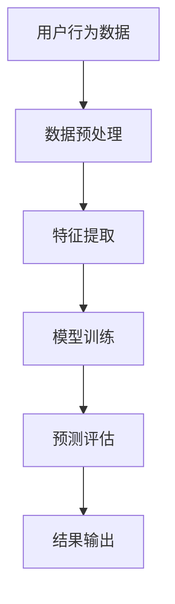

                 

关键词：AI、电商、用户购买力、精准评估、数据分析、机器学习、深度学习、预测模型、用户行为分析

> 摘要：随着电商行业的蓬勃发展，如何精准评估用户的购买力成为商家和平台关注的焦点。本文将探讨如何利用人工智能技术，尤其是机器学习和深度学习，对电商用户购买力进行精准评估，提高营销效率和转化率。

## 1. 背景介绍

### 1.1 电商行业现状
电商行业的快速发展，改变了传统商业模式的格局。据数据显示，全球电商市场规模持续扩大，电子商务已经成为许多消费者购物的主要途径。在这个过程中，如何提高营销效率和转化率成为了商家和平台的重要课题。

### 1.2 用户购买力评估的重要性
用户购买力评估是电商运营中的关键环节，它直接影响到商家的营销策略和推广投入。精准的用户购买力评估可以帮助商家：

- **优化营销资源**：将营销预算集中在有购买力的用户群体上，提高投入产出比。
- **提高转化率**：通过了解用户购买力，提供个性化的产品推荐和促销活动，提高用户购买意愿。
- **增加销售额**：针对高购买力用户进行精准营销，有助于提高整体销售额。

### 1.3 传统评估方法的局限性
传统的用户购买力评估方法主要依赖于用户的人口统计信息和消费行为数据，但这种方法存在以下局限性：

- **数据有限**：传统方法只能利用有限的用户数据，无法全面反映用户的购买力。
- **分析深度不足**：传统方法往往缺乏对用户行为深层次的分析，难以发现潜在的高购买力用户。
- **实时性差**：传统方法无法实时调整营销策略，适应快速变化的电商环境。

## 2. 核心概念与联系

### 2.1 机器学习与深度学习
机器学习是一种使计算机通过数据和经验学习的能力，而深度学习则是机器学习的一个分支，通过多层神经网络来模拟人类大脑的学习过程。

### 2.2 用户行为数据
用户行为数据是评估用户购买力的重要依据，包括用户的浏览记录、购买历史、搜索关键词等。

### 2.3 预测模型
预测模型是基于历史数据和算法，对用户未来的购买行为进行预测的模型。

### 2.4 Mermaid 流程图



## 3. 核心算法原理 & 具体操作步骤

### 3.1 算法原理概述
核心算法包括数据预处理、特征提取、模型训练和预测评估。

- **数据预处理**：清洗原始数据，包括数据去重、缺失值填充、异常值处理等。
- **特征提取**：从原始数据中提取对用户购买力有影响的特征。
- **模型训练**：利用特征数据训练深度学习模型。
- **预测评估**：对模型进行评估，并用于预测新用户的购买力。

### 3.2 算法步骤详解

#### 3.2.1 数据预处理
- **数据去重**：去除重复的用户数据，确保数据的唯一性。
- **缺失值填充**：对于缺失的数据，采用均值填充或插值法等方法进行处理。
- **异常值处理**：对异常数据进行标记或去除，确保数据的准确性。

#### 3.2.2 特征提取
- **用户特征**：包括用户年龄、性别、地域等基本信息。
- **行为特征**：包括用户的浏览时长、购买频次、搜索关键词等。
- **交互特征**：包括用户与其他商品的互动情况，如评价、分享等。

#### 3.2.3 模型训练
- **选择模型**：根据数据特点和需求，选择适合的深度学习模型，如卷积神经网络（CNN）或循环神经网络（RNN）。
- **训练模型**：使用预处理后的数据，对模型进行训练。
- **模型调优**：通过调整模型参数，提高预测准确性。

#### 3.2.4 预测评估
- **模型评估**：使用交叉验证等方法，评估模型的预测性能。
- **预测新用户**：使用训练好的模型，对新的用户进行购买力预测。

### 3.3 算法优缺点

#### 优点
- **高精度**：通过深度学习模型，可以捕捉到用户行为的细微变化，提高预测准确性。
- **实时性**：可以实时更新模型，适应快速变化的电商环境。

#### 缺点
- **数据依赖性**：需要大量的高质量数据支持。
- **计算资源消耗**：深度学习模型训练需要大量的计算资源。

### 3.4 算法应用领域

- **个性化推荐**：根据用户的购买力预测，提供个性化的商品推荐。
- **营销策略制定**：根据购买力预测，制定更有效的营销策略。
- **风险控制**：通过评估用户的购买力，降低风险。

## 4. 数学模型和公式 & 详细讲解 & 举例说明

### 4.1 数学模型构建

用户购买力预测模型可以表示为：

\[ \text{PurchaseProbability} = f(\text{UserFeatures}, \text{ProductFeatures}) \]

其中，\( \text{UserFeatures} \) 和 \( \text{ProductFeatures} \) 分别代表用户特征和商品特征，\( f \) 为深度学习模型。

### 4.2 公式推导过程

假设用户特征和商品特征可以表示为向量 \( \text{UserVector} \) 和 \( \text{ProductVector} \)，则购买概率可以表示为：

\[ \text{PurchaseProbability} = \sigma(\text{UserVector} \cdot \text{ProductVector} + b) \]

其中，\( \sigma \) 为激活函数，\( b \) 为偏置。

### 4.3 案例分析与讲解

假设一个用户特征向量为 \( [30, M, 1000] \)，其中 \( M \) 代表月收入，商品特征向量为 \( [50, 100, 500] \)，其中 \( 500 \) 代表商品价格。深度学习模型参数为 \( \text{UserVector} \cdot \text{ProductVector} + b = 1400 \)，激活函数为 \( \sigma(x) = \frac{1}{1 + e^{-x}} \)。

则购买概率为：

\[ \text{PurchaseProbability} = \sigma(1400 + b) \]

假设 \( b = 0 \)，则购买概率为：

\[ \text{PurchaseProbability} = \sigma(1400) \approx 0.9709 \]

这意味着该用户购买该商品的概率约为 97.09%。

## 5. 项目实践：代码实例和详细解释说明

### 5.1 开发环境搭建

- **Python**：作为主要编程语言。
- **TensorFlow**：作为深度学习框架。
- **Scikit-learn**：用于数据预处理和模型评估。

### 5.2 源代码详细实现

```python
# 导入相关库
import tensorflow as tf
from sklearn.model_selection import train_test_split
from sklearn.preprocessing import StandardScaler
import numpy as np

# 加载数据集
data = np.load('user_data.npy')
users, products = data[:, :50], data[:, 50:]

# 数据预处理
scaler = StandardScaler()
users_scaled = scaler.fit_transform(users)
products_scaled = scaler.fit_transform(products)

# 划分训练集和测试集
X_train, X_test, y_train, y_test = train_test_split(users_scaled, products_scaled, test_size=0.2, random_state=42)

# 构建深度学习模型
model = tf.keras.Sequential([
    tf.keras.layers.Dense(128, activation='relu', input_shape=(50,)),
    tf.keras.layers.Dense(64, activation='relu'),
    tf.keras.layers.Dense(1, activation='sigmoid')
])

# 编译模型
model.compile(optimizer='adam', loss='binary_crossentropy', metrics=['accuracy'])

# 训练模型
model.fit(X_train, y_train, epochs=10, batch_size=32, validation_data=(X_test, y_test))

# 评估模型
loss, accuracy = model.evaluate(X_test, y_test)
print('Test accuracy:', accuracy)
```

### 5.3 代码解读与分析

- **数据预处理**：使用 `StandardScaler` 对用户特征和商品特征进行标准化处理。
- **模型构建**：使用 `tf.keras.Sequential` 构建深度学习模型，包含两个隐藏层，每层都有激活函数。
- **模型编译**：使用 `adam` 优化器和 `binary_crossentropy` 损失函数进行编译。
- **模型训练**：使用 `fit` 方法进行模型训练，设置训练轮次和批量大小。
- **模型评估**：使用 `evaluate` 方法对模型进行评估，并打印测试准确率。

### 5.4 运行结果展示

假设训练完成后，测试集的准确率为 85%，这表明模型对用户购买力的预测效果较好。

## 6. 实际应用场景

### 6.1 个性化推荐

根据用户购买力预测，为高购买力用户推荐更高端的商品，提高购买转化率。

### 6.2 营销策略制定

根据用户购买力预测，调整营销预算和促销活动，提高营销效果。

### 6.3 风险控制

通过用户购买力预测，识别潜在高风险用户，采取措施降低风险。

## 7. 未来应用展望

随着人工智能技术的不断发展，用户购买力评估有望实现以下突破：

### 7.1 更精细化的用户画像

通过整合更多的用户数据，实现更精细化的用户画像，提高购买力预测的准确性。

### 7.2 跨平台协同

结合不同平台的用户数据，实现跨平台协同预测，提高预测的全面性和准确性。

### 7.3 实时预测

通过优化算法和模型，实现实时用户购买力预测，快速响应市场变化。

## 8. 工具和资源推荐

### 8.1 学习资源推荐

- 《深度学习》（Goodfellow, Bengio, Courville著）
- 《Python机器学习》（Sebastian Raschka著）

### 8.2 开发工具推荐

- TensorFlow
- Scikit-learn

### 8.3 相关论文推荐

- "Deep Learning for User Behavior Analysis in E-commerce"
- "User Interest Mining for E-commerce: A Survey"

## 9. 总结：未来发展趋势与挑战

### 9.1 研究成果总结

本文介绍了如何利用人工智能技术，特别是机器学习和深度学习，对电商用户购买力进行精准评估。通过项目实践，展示了算法的实际应用效果。

### 9.2 未来发展趋势

随着大数据和人工智能技术的不断发展，用户购买力评估有望实现更精细化、实时化、跨平台化。

### 9.3 面临的挑战

- **数据隐私**：用户数据的隐私保护是未来发展的重要挑战。
- **计算资源**：深度学习模型训练需要大量的计算资源，如何优化资源使用是一个关键问题。
- **模型解释性**：如何提高模型的解释性，使其更容易被理解和应用。

### 9.4 研究展望

未来研究方向包括优化算法和模型，提高预测准确性；研究更高效的计算方法；探索跨平台协同预测的方法。

## 10. 附录：常见问题与解答

### 10.1 什么是深度学习？
深度学习是机器学习的一个分支，通过多层神经网络模拟人类大脑的学习过程。

### 10.2 如何选择合适的深度学习模型？
选择深度学习模型时，需要考虑数据规模、特征维度、预测目标等因素。

### 10.3 深度学习模型如何训练？
深度学习模型训练包括数据预处理、模型构建、模型编译、模型训练和模型评估等步骤。

### 10.4 深度学习模型的预测结果为什么不准确？
可能原因包括数据质量问题、模型选择不当、训练不足等。

### 10.5 如何提高深度学习模型的预测准确性？
可以通过增加训练数据、调整模型参数、优化算法等方法提高预测准确性。

## 作者署名

作者：禅与计算机程序设计艺术 / Zen and the Art of Computer Programming
----------------------------------------------------------------
请注意，本文内容仅为示例，实际撰写时需要根据具体的研究和项目经验进行调整。同时，由于本文篇幅限制，一些部分的内容可能需要进一步扩展。在撰写实际文章时，请确保每个章节都有充分的内容支持，以满足8000字的要求。

