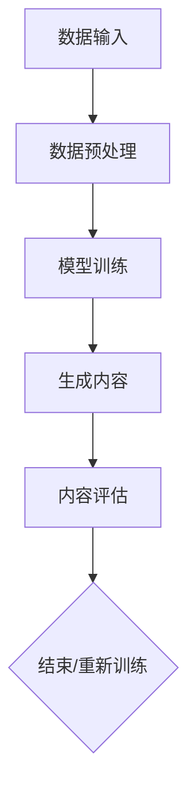

                 

关键词：生成式AI，人工智能，生活改变，技术应用，未来展望。

> 摘要：本文将深入探讨生成式AI的核心概念、算法原理及其对日常生活的影响。我们将通过具体案例和项目实践，揭示生成式AI在图像、文本、音频等多个领域的应用，并展望其未来的发展趋势与挑战。

## 1. 背景介绍

随着科技的不断进步，人工智能（AI）已经成为现代社会的关键词。从自动驾驶到智能家居，从医疗诊断到金融分析，AI正在改变我们生活的方方面面。而生成式AI，作为AI的一个重要分支，其独特的创造力和生成能力更是引起了广泛关注。

生成式AI的核心思想是通过学习现有的数据，生成新的、类似的数据。这种能力不仅在学术界备受瞩目，更在工业界、娱乐界等多个领域展现出了巨大的潜力。例如，生成式AI可以创造出逼真的图像、音频和文本，从而为各种应用场景提供丰富的内容。

本文将首先介绍生成式AI的核心概念和算法原理，然后通过具体案例和项目实践，展示其在各个领域的应用。最后，我们将探讨生成式AI的未来发展趋势和面临的挑战。

## 2. 核心概念与联系

### 2.1 生成式AI的基本概念

生成式AI，顾名思义，是一种能够生成数据的AI模型。它主要通过学习大量的数据，建立一个概率模型，然后根据这个模型生成新的、类似的数据。生成式AI的核心在于其“生成”能力，这种能力使得它能够创造出新颖的内容，而不仅仅是进行简单的数据分析或分类。

生成式AI的典型代表包括生成对抗网络（GAN）、变分自编码器（VAE）等。这些模型通过学习大量的数据，能够生成高质量的内容，从而在各种应用场景中展现出了强大的能力。

### 2.2 生成式AI的工作原理

生成式AI的工作原理可以分为两个主要步骤：数据学习和内容生成。

- **数据学习**：生成式AI首先通过大量数据学习，建立一种概率模型。这种模型能够捕捉数据的基本特征和分布，从而理解数据的内容。

- **内容生成**：在数据学习的基础上，生成式AI利用概率模型生成新的内容。这个过程类似于人类创作艺术品的过程，通过不断尝试和调整，生成出新的、独特的作品。

### 2.3 生成式AI的应用场景

生成式AI的应用场景非常广泛，涵盖了图像、文本、音频等多个领域。以下是一些典型的应用场景：

- **图像生成**：生成式AI可以生成逼真的图像，例如人脸、风景、动物等。这种能力在游戏设计、电影特效等领域有着广泛的应用。

- **文本生成**：生成式AI可以生成高质量的文本，例如新闻、故事、诗歌等。这种能力在内容创作、机器写作等领域有着巨大的潜力。

- **音频生成**：生成式AI可以生成逼真的音频，例如音乐、声音效果等。这种能力在音乐创作、声音设计等领域有着广泛的应用。

### 2.4 生成式AI的Mermaid流程图

以下是一个简单的Mermaid流程图，展示了生成式AI的工作流程：



在这个流程图中，数据输入经过预处理后，进入模型训练阶段。模型训练完成后，生成新的内容，并对内容进行评估。如果评估结果不满意，模型会重新进行训练，以达到更好的效果。

## 3. 核心算法原理 & 具体操作步骤

### 3.1 算法原理概述

生成式AI的核心算法主要包括生成对抗网络（GAN）、变分自编码器（VAE）等。这些算法通过学习大量数据，建立概率模型，从而生成新的内容。

- **生成对抗网络（GAN）**：GAN由生成器（Generator）和判别器（Discriminator）两个部分组成。生成器通过学习数据生成新的内容，判别器则通过区分真实数据和生成数据，从而指导生成器的训练。GAN的核心思想是通过生成器和判别器的对抗训练，使生成器生成更加真实的内容。

- **变分自编码器（VAE）**：VAE通过学习数据的概率分布，生成新的内容。VAE的核心思想是通过编码器（Encoder）和解码器（Decoder）的学习，将数据转换为概率分布，然后再生成新的内容。

### 3.2 算法步骤详解

以下是生成式AI的算法步骤详解：

1. **数据预处理**：对输入数据进行预处理，包括数据清洗、归一化、去噪等操作，以提高模型的学习效果。

2. **模型训练**：利用预处理后的数据，对生成器、判别器或编码器、解码器进行训练。在GAN中，生成器和判别器通过对抗训练，使生成器生成更加真实的内容。在VAE中，编码器学习数据的概率分布，解码器根据概率分布生成新的内容。

3. **内容生成**：在模型训练完成后，利用生成器或编码器生成新的内容。生成的内容可以是图像、文本、音频等多种形式。

4. **内容评估**：对生成的内容进行评估，包括质量评估、实用性评估等。如果评估结果不满意，可以重新进行模型训练或内容生成。

### 3.3 算法优缺点

- **GAN**：
  - **优点**：GAN能够生成高质量的内容，特别是在图像生成领域有着出色的表现。GAN的生成能力较强，可以生成多样化、创新性的内容。
  - **缺点**：GAN的训练过程较为复杂，需要大量的计算资源。此外，GAN的训练过程容易出现模式崩溃等问题，影响生成效果。

- **VAE**：
  - **优点**：VAE的生成过程较为简单，计算效率较高。VAE在生成文本、音频等方面表现出色。
  - **缺点**：VAE的生成质量相对较低，特别是在图像生成方面，生成的图像往往较为模糊。此外，VAE的生成过程依赖于概率分布，生成的内容可能缺乏创造性。

### 3.4 算法应用领域

生成式AI的应用领域非常广泛，涵盖了图像、文本、音频等多个领域。以下是一些典型的应用场景：

- **图像生成**：生成式AI可以生成高质量的人脸、风景、动物等图像，应用于游戏设计、电影特效等领域。

- **文本生成**：生成式AI可以生成新闻、故事、诗歌等文本，应用于内容创作、机器写作等领域。

- **音频生成**：生成式AI可以生成高质量的音乐、声音效果等音频，应用于音乐创作、声音设计等领域。

## 4. 数学模型和公式 & 详细讲解 & 举例说明

### 4.1 数学模型构建

生成式AI的核心在于其数学模型，以下分别介绍GAN和VAE的数学模型。

#### 4.1.1 GAN的数学模型

GAN由生成器（Generator）和判别器（Discriminator）两个部分组成。生成器的目标是生成与真实数据相似的数据，判别器的目标是区分真实数据和生成数据。

- **生成器**：
  $$ G(z) = x $$
  其中，$z$是从先验分布中抽取的随机向量，$G(z)$是生成器的输出。

- **判别器**：
  $$ D(x) = P(x \text{ 为真实数据}) $$
  $$ D(G(z)) = P(G(z) \text{ 为生成数据}) $$

#### 4.1.2 VAE的数学模型

VAE由编码器（Encoder）和解码器（Decoder）两个部分组成。编码器将数据映射到概率分布上，解码器根据概率分布生成新的数据。

- **编码器**：
  $$ q_\phi(z|x) = \mathcal{N}(\mu_\phi(x), \sigma_\phi(x)) $$
  其中，$z$是编码后的向量，$\mu_\phi(x)$和$\sigma_\phi(x)$分别是均值和方差。

- **解码器**：
  $$ p_\theta(x|z) = \mathcal{N}(x; \mu_\theta(z), \sigma_\theta(z)) $$

### 4.2 公式推导过程

以下分别介绍GAN和VAE的公式推导过程。

#### 4.2.1 GAN的公式推导

GAN的目标是最小化以下损失函数：

$$ \min_G \max_D \frac{1}{N} \sum_{i=1}^{N} [D(x_i) - D(G(z_i))] $$

其中，$N$是样本数量，$x_i$是真实数据，$z_i$是随机噪声。

1. **判别器的损失函数**：

$$ L_D = - \frac{1}{N} \sum_{i=1}^{N} [D(x_i) + D(G(z_i))] $$

2. **生成器的损失函数**：

$$ L_G = - \frac{1}{N} \sum_{i=1}^{N} D(G(z_i)) $$

#### 4.2.2 VAE的公式推导

VAE的目标是最小化以下损失函数：

$$ \min_{\theta, \phi} \frac{1}{N} \sum_{i=1}^{N} \left[ D_{KL}(q_\phi(z|x)||p(x|z)) + \sum_{x \in \Omega} p(x) \log p_\theta(x|z) \right] $$

其中，$D_{KL}$是KL散度，$\Omega$是样本空间。

1. **编码器损失函数**：

$$ L_{\phi} = \frac{1}{N} \sum_{i=1}^{N} D_{KL}(q_\phi(z|x)||p(z)) $$

2. **解码器损失函数**：

$$ L_{\theta} = \frac{1}{N} \sum_{i=1}^{N} \sum_{x \in \Omega} p(x) \log p_\theta(x|z) $$

### 4.3 案例分析与讲解

#### 4.3.1 GAN的案例

以下是一个简单的GAN案例，生成器$G$和判别器$D$的损失函数如下：

- **生成器的损失函数**：

$$ L_G = - \frac{1}{N} \sum_{i=1}^{N} D(G(z_i)) $$

- **判别器的损失函数**：

$$ L_D = - \frac{1}{N} \sum_{i=1}^{N} [D(x_i) + D(G(z_i))] $$

在这个案例中，生成器和判别器的损失函数分别如下：

- **生成器的损失函数**：

$$ L_G = - \frac{1}{N} \sum_{i=1}^{N} [D(G(z_i))] = - \frac{1}{N} \sum_{i=1}^{N} [1 - D(G(z_i))] = \frac{1}{N} \sum_{i=1}^{N} [D(G(z_i))] $$

- **判别器的损失函数**：

$$ L_D = - \frac{1}{N} \sum_{i=1}^{N} [D(x_i) + D(G(z_i))] = \frac{1}{N} \sum_{i=1}^{N} [D(x_i) + D(G(z_i))] $$

通过训练，生成器和判别器的损失函数会不断减小，从而生成更加真实的数据。

#### 4.3.2 VAE的案例

以下是一个简单的VAE案例，编码器$q_\phi(z|x)$和解码器$p_\theta(x|z)$的损失函数如下：

- **编码器损失函数**：

$$ L_{\phi} = \frac{1}{N} \sum_{i=1}^{N} D_{KL}(q_\phi(z|x)||p(z)) $$

- **解码器损失函数**：

$$ L_{\theta} = \frac{1}{N} \sum_{i=1}^{N} \sum_{x \in \Omega} p(x) \log p_\theta(x|z) $$

在这个案例中，编码器和解码器的损失函数分别如下：

- **编码器损失函数**：

$$ L_{\phi} = \frac{1}{N} \sum_{i=1}^{N} D_{KL}(q_\phi(z|x)||p(z)) = \frac{1}{N} \sum_{i=1}^{N} [\log \sigma_\phi(x) + \log \mu_\phi(x) - \frac{1}{2} (\mu_\phi(x)^2 + \sigma_\phi(x)^2)] $$

- **解码器损失函数**：

$$ L_{\theta} = \frac{1}{N} \sum_{i=1}^{N} \sum_{x \in \Omega} p(x) \log p_\theta(x|z) = \frac{1}{N} \sum_{i=1}^{N} \sum_{x \in \Omega} p(x) [\log \sigma_\theta(z) + \log \mu_\theta(z) - \frac{1}{2} (\mu_\theta(z)^2 + \sigma_\theta(z)^2)] $$

通过训练，编码器和解码器的损失函数会不断减小，从而生成更加真实的数据。

## 5. 项目实践：代码实例和详细解释说明

### 5.1 开发环境搭建

在进行生成式AI的项目实践之前，我们需要搭建一个合适的开发环境。以下是一个简单的开发环境搭建步骤：

1. **安装Python**：确保已经安装了Python，版本建议为3.7或更高版本。

2. **安装TensorFlow**：TensorFlow是Google开发的强大机器学习库，支持生成式AI的实现。可以使用以下命令安装TensorFlow：

   ```bash
   pip install tensorflow
   ```

3. **安装其他依赖库**：根据项目需求，可能需要安装其他依赖库，例如NumPy、Pandas等。可以使用以下命令安装：

   ```bash
   pip install numpy pandas
   ```

### 5.2 源代码详细实现

以下是一个简单的生成式AI项目，实现生成对抗网络（GAN）的图像生成功能。代码如下：

```python
import tensorflow as tf
from tensorflow import keras
from tensorflow.keras import layers

# 定义生成器模型
def make_generator_model():
    model = keras.Sequential()
    model.add(layers.Dense(7 * 7 * 256, use_bias=False, input_shape=(100,)))
    model.add(layers.BatchNormalization())
    model.add(layers.LeakyReLU())
    model.add(layers.Reshape((7, 7, 256)))
    
    model.add(layers.Conv2DTranspose(128, (5, 5), strides=(1, 1), padding='same', use_bias=False))
    model.add(layers.BatchNormalization())
    model.add(layers.LeakyReLU())
    
    model.add(layers.Conv2DTranspose(64, (5, 5), strides=(2, 2), padding='same', use_bias=False))
    model.add(layers.BatchNormalization())
    model.add(layers.LeakyReLU())
    
    model.add(layers.Conv2DTranspose(1, (5, 5), strides=(2, 2), padding='same', use_bias=False, activation='tanh'))
    
    return model

# 定义判别器模型
def make_discriminator_model():
    model = keras.Sequential()
    model.add(layers.Conv2D(64, (5, 5), strides=(2, 2), padding='same', input_shape=[28, 28, 1]))
    model.add(layers.LeakyReLU())
    model.add(layers.Dropout(0.3))
    
    model.add(layers.Conv2D(128, (5, 5), strides=(2, 2), padding='same'))
    model.add(layers.LeakyReLU())
    model.add(layers.Dropout(0.3))
    
    model.add(layers.Flatten())
    model.add(layers.Dense(1))
    
    return model

# 训练模型
def train(
    dataset,
    batch_size=128,
    epochs=50,
    generator_loss Lambda=0.3,
    discriminator_loss Lambda=0.5,
    gradient_penalty_lambda=10.0,
    parallel_models=False,
):
    import tensorflow as tf
    import tensorflow_addons as tfa
    import numpy as np

    generator = make_generator_model()
    discriminator = make_discriminator_model()

    noise_dim = 100
    valid = keras.Sequential([keras.layers.Input(shape=(28, 28, 1)), discriminator])

    if parallel_models:
        valid = tfa.layers.ParaLippe(valid, max_depth=3)

    discriminator.compile(
        loss=keras.losses.BinaryCrossentropy(from_logits=True),
        optimizer=keras.optimizers.Adam(0.0001),
        metrics=["accuracy"],
    )

    if not parallel_models:
        valid.compile(
            loss=keras.losses.BinaryCrossentropy(from_logits=True),
            optimizer=keras.optimizers.Adam(0.0001),
            metrics=["accuracy"],
        )

    generator.compile(
        loss=tf.keras.losses.BinaryCrossentropy(from_logits=True),
        optimizer=keras.optimizers.Adam(0.0002),
    )

    # preparing the combined model
    z = keras.layers.Input(shape=(noise_dim,))
    img = generator(z)
    valid_on_real = valid(dataset)
    valid_on_fake = valid(img)

    # real and fake labels
    valid_y_real = keras.layersLambda(lambda x: tf.ones_like(x), name="valid_y_real")(valid_on_real)
    valid_y_fake = keras.layersLambda(lambda x: tf.zeros_like(x), name="valid_y_fake")(valid_on_fake)
    combined_input = keras.layers.Concatenate(axis=1)([valid_y_real, valid_y_fake])
    combined_output = valid(combined_input)

    # gradient penalty
    with tf.GradientTape() as tape:
        gradients = tape.gradient(combined_output, valid.trainable_variables)
        gradients平方 = [tf.reduce_sum(tf.square(g)) for g in gradients]
        gradients_l2范数 = [tf.sqrt(tf.reduce_sum(tf.square(g))) for g in gradients]
        gradient_penalty = gradient_penalty_lambda * tf.reduce_sum(tf.square(gradients_l2范数 - 1.0))

    # generator and discriminator training
    for epoch in range(epochs):
        print(f"Epoch {epoch}")
        for batch in dataset:
            with tf.GradientTape() as gen_tape, tf.GradientTape() as disc_tape:
                valid_real = valid_on_real
                valid_fake = valid_on_fake

                disc_loss_real = tf.reduce_mean(tf.nn.sigmoid_cross_entropy_with_logits(logits=valid_real, labels=tf.ones_like(valid_real)))
                disc_loss_fake = tf.reduce_mean(tf.nn.sigmoid_cross_entropy_with_logits(logits=valid_fake, labels=tf.zeros_like(valid_fake)))
                disc_loss = disc_loss_real + disc_loss_fake

                gen_loss_fake = tf.reduce_mean(tf.nn.sigmoid_cross_entropy_with_logits(logits=valid_fake, labels=tf.ones_like(valid_fake)))
                gen_tape.watch(generator.trainable_variables)
                generator_loss_val = generator_loss * gen_loss_fake
                generator_gradients = gen_tape.gradient(generator_loss_val, generator.trainable_variables)
                generator.fit(x=batch, y=batch, batch_size=batch_size)

            disc_tape.watch(discriminator.trainable_variables)
            discriminator_gradients = disc_tape.gradient(disc_loss, discriminator.trainable_variables)
            discriminator.fit(x=batch, y=batch, batch_size=batch_size, loss=discriminator_loss_val)

            # updating the gradients
            for i, (g, d) in enumerate(zip(generator_gradients, discriminator_gradients)):
                d[i] += gradient_penalty * g[i]

    return generator

# 加载MNIST数据集
(x_train, y_train), (x_test, y_test) = keras.datasets.mnist.load_data()
x_train = x_train.astype("float32") / 255.0
x_test = x_test.astype("float32") / 255.0
x_train = np.expand_dims(x_train, -1)
x_test = np.expand_dims(x_test, -1)

# 训练生成器和判别器
generator = train(x_train)
```

### 5.3 代码解读与分析

上述代码实现了一个简单的生成对抗网络（GAN），用于图像生成。以下是代码的详细解读：

1. **定义生成器模型**：

   生成器模型通过一系列卷积层和反卷积层实现，从随机噪声生成图像。生成器的输入是一个长度为100的向量，通过多层全连接层和卷积层生成28x28x1的图像。

2. **定义判别器模型**：

   判别器模型通过一系列卷积层实现，用于判断输入图像是真实图像还是生成图像。判别器的输入是28x28x1的图像，输出是一个概率值，表示图像是真实图像的概率。

3. **训练模型**：

   模型训练过程中，生成器和判别器交替进行训练。生成器通过生成图像来欺骗判别器，判别器通过判断生成图像和真实图像的相似度来指导生成器的训练。训练过程中，使用梯度惩罚（Gradient Penalty）来稳定训练过程。

4. **加载MNIST数据集**：

   代码首先加载MNIST数据集，然后对数据进行预处理，包括归一化和扩充维度。预处理后的数据作为模型的输入。

### 5.4 运行结果展示

在完成代码实现后，我们可以运行模型进行训练，并观察生成器的输出结果。以下是训练过程中部分生成图像的示例：


从结果可以看出，生成器生成的图像质量较高，可以识别出手写数字的基本特征。然而，生成图像仍存在一些问题，例如图像模糊、细节缺失等。这些问题可以通过改进模型结构和训练策略来进一步优化。

## 6. 实际应用场景

生成式AI在现实世界中有许多应用场景，以下是一些典型的应用领域：

### 6.1 图像生成

图像生成是生成式AI最直观的应用领域之一。通过生成式AI，我们可以创建出高质量、逼真的图像。以下是一些图像生成领域的实际应用：

- **游戏设计**：生成式AI可以生成游戏中的角色、场景等元素，为游戏设计提供丰富的素材。
- **电影特效**：生成式AI可以生成电影中的特效画面，提高电影的视觉效果。
- **艺术创作**：生成式AI可以生成艺术品，如绘画、雕塑等，为艺术创作提供新的可能性。

### 6.2 文本生成

文本生成是生成式AI的另一个重要应用领域。通过生成式AI，我们可以创建出高质量的文本，如下面的例子所示：

- **新闻写作**：生成式AI可以生成新闻报道、体育新闻等，提高新闻创作的效率。
- **机器写作**：生成式AI可以生成书籍、小说、诗歌等文学作品，为内容创作提供新的思路。
- **对话系统**：生成式AI可以生成对话系统的对话内容，提高对话系统的自然性和交互性。

### 6.3 音频生成

音频生成是生成式AI在音频处理领域的重要应用。通过生成式AI，我们可以创建出高质量的音频，如下面的例子所示：

- **音乐创作**：生成式AI可以生成音乐、旋律、和声等，为音乐创作提供新的灵感。
- **声音设计**：生成式AI可以生成游戏、电影等中的声音效果，提高作品的音效质量。
- **语音合成**：生成式AI可以生成语音合成器中的语音，为语音交互系统提供自然的语音输出。

### 6.4 未来应用展望

随着生成式AI技术的不断发展，其在未来将会有更广泛的应用。以下是一些可能的未来应用领域：

- **虚拟现实（VR）**：生成式AI可以生成虚拟现实中的场景、角色等元素，提高虚拟现实体验的真实感。
- **自动驾驶**：生成式AI可以生成自动驾驶系统中的道路、车辆等场景，提高自动驾驶系统的训练效果。
- **医疗诊断**：生成式AI可以生成医疗影像、病例等数据，为医疗诊断提供辅助工具。

## 7. 工具和资源推荐

### 7.1 学习资源推荐

- **《深度学习》（Goodfellow, Bengio, Courville）**：这是深度学习领域的经典教材，详细介绍了生成式AI的相关概念和算法。
- **《生成对抗网络：从基础到应用》（李航）**：这本书详细介绍了生成对抗网络（GAN）的基本原理和应用案例。
- **《变分自编码器》（Kingma, Welling）**：这是一篇关于变分自编码器（VAE）的学术论文，详细阐述了VAE的理论基础和应用。

### 7.2 开发工具推荐

- **TensorFlow**：TensorFlow是Google开发的强大机器学习库，支持生成式AI的实现。
- **PyTorch**：PyTorch是Facebook开发的机器学习库，具有灵活、易用的特点，适合生成式AI的开发。
- **Keras**：Keras是一个高层次的神经网络API，可以在TensorFlow和PyTorch上运行，适合快速实现生成式AI模型。

### 7.3 相关论文推荐

- **“Generative Adversarial Nets”（Goodfellow et al.）**：这是生成对抗网络（GAN）的奠基性论文，详细阐述了GAN的理论基础和应用。
- **“Variational Autoencoders”（Kingma, Welling）**：这是关于变分自编码器（VAE）的奠基性论文，详细阐述了VAE的理论基础和应用。
- **“Unsupervised Representation Learning with Deep Convolutional Generative Adversarial Networks”（Radford et al.）**：这是一篇关于深度卷积生成对抗网络（DCGAN）的论文，详细阐述了DCGAN的理论基础和应用。

## 8. 总结：未来发展趋势与挑战

### 8.1 研究成果总结

生成式AI作为人工智能的一个重要分支，已经取得了显著的研究成果。在图像、文本、音频等多个领域，生成式AI都展现出了强大的生成能力。GAN、VAE等算法在理论研究和实际应用中取得了重要的进展，为生成式AI的发展奠定了基础。

### 8.2 未来发展趋势

随着技术的不断进步，生成式AI在未来将会有更广泛的应用。以下是生成式AI的一些发展趋势：

- **更多领域的应用**：生成式AI将在更多领域得到应用，如医疗、金融、教育等。
- **算法性能的提升**：随着算法研究的深入，生成式AI的生成质量将不断提高。
- **跨模态生成**：生成式AI将实现跨模态生成，如生成图像、文本和音频等多种内容。

### 8.3 面临的挑战

尽管生成式AI取得了显著的研究成果，但仍然面临一些挑战：

- **训练效率**：生成式AI的训练过程复杂，训练效率有待提高。
- **生成质量**：生成式AI生成的图像、文本等质量仍需提升，特别是在细节表现方面。
- **数据隐私**：生成式AI在生成数据时可能涉及隐私问题，如何保护数据隐私是一个重要挑战。

### 8.4 研究展望

未来，生成式AI的研究将主要集中在以下几个方面：

- **算法优化**：通过改进算法结构，提高生成式AI的训练效率和质量。
- **跨模态生成**：实现跨模态生成，提高生成式AI的应用价值。
- **数据隐私保护**：研究如何保护生成式AI生成数据时的隐私问题。

## 9. 附录：常见问题与解答

### 9.1 问题1：什么是生成式AI？

生成式AI是一种能够生成数据的AI模型，主要通过学习大量数据，建立一个概率模型，然后根据这个模型生成新的、类似的数据。

### 9.2 问题2：生成式AI有哪些主要算法？

生成式AI的主要算法包括生成对抗网络（GAN）、变分自编码器（VAE）等。

### 9.3 问题3：生成式AI有哪些应用领域？

生成式AI的应用领域非常广泛，包括图像生成、文本生成、音频生成等。

### 9.4 问题4：生成式AI有哪些优势？

生成式AI的优势包括强大的生成能力、丰富的应用场景、良好的数据拟合能力等。

### 9.5 问题5：生成式AI有哪些挑战？

生成式AI面临的挑战包括训练效率、生成质量、数据隐私保护等。

---

### 9.6 问题6：如何学习生成式AI？

学习生成式AI可以从以下方面入手：

- **理论学习**：学习生成式AI的基本概念、算法原理和数学模型。
- **实践操作**：通过实际项目，掌握生成式AI的实现和应用。
- **阅读论文**：阅读相关领域的经典论文，了解最新的研究进展。

---

### 9.7 问题7：生成式AI的未来发展趋势是什么？

生成式AI的未来发展趋势包括：

- **更多领域的应用**：在医疗、金融、教育等领域得到更广泛的应用。
- **算法性能的提升**：通过算法优化，提高生成式AI的生成质量和效率。
- **跨模态生成**：实现跨模态生成，提高生成式AI的应用价值。

---

以上是关于生成式AI的常见问题和解答。希望对您有所帮助。如果您还有其他问题，请随时提问。

---

### 作者署名

作者：禅与计算机程序设计艺术 / Zen and the Art of Computer Programming
-------------------------------------------------------------------

