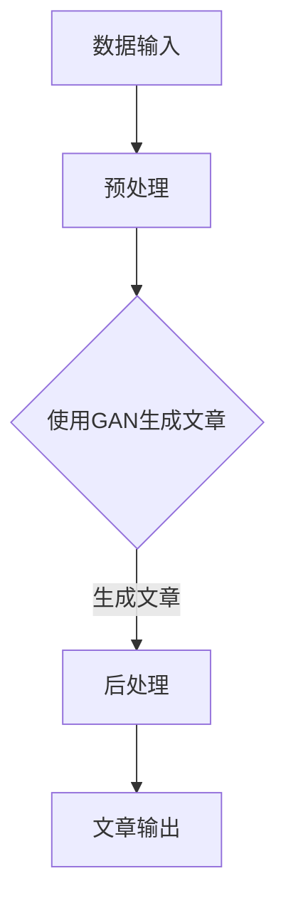

                 

关键词：人工智能、新闻写作、效率、准确性、自然语言处理、生成对抗网络、文本生成、自动化写作

> 摘要：本文探讨了人工智能在新闻写作中的应用，特别是如何利用AI技术提高写作效率和准确性。通过分析现有的AI写作工具，探讨了它们的优缺点，并提出了基于生成对抗网络（GAN）的AI辅助新闻写作系统。文章还详细介绍了数学模型和公式，以及如何实现该项目。最后，讨论了AI辅助新闻写作在实际应用场景中的可能性，并展望了未来的发展趋势与挑战。

## 1. 背景介绍

随着互联网的迅速发展，新闻信息的需求量呈指数级增长。然而，传统的人工新闻写作方式面临着速度慢、成本高、质量不稳定的挑战。随着人工智能技术的不断发展，利用AI技术辅助新闻写作成为一种新的趋势。AI辅助新闻写作不仅能够提高写作效率，还能在一定程度上保证新闻内容的准确性。

目前，已有许多AI写作工具投入使用，例如自动新闻生成器、内容摘要生成器等。这些工具在一定程度上提高了新闻写作的效率，但仍然存在一些不足之处，如生成内容的质量参差不齐、缺乏创造性等。因此，研究更加智能和高效的AI辅助新闻写作系统具有重要意义。

本文将介绍一种基于生成对抗网络（GAN）的AI辅助新闻写作系统。通过分析现有技术，我们提出了一个新颖的模型，旨在提高新闻写作的效率和准确性。文章将详细描述该系统的架构、算法原理、数学模型以及实现方法。

## 2. 核心概念与联系

### 2.1 生成对抗网络（GAN）

生成对抗网络（GAN）是一种深度学习模型，由生成器（Generator）和判别器（Discriminator）组成。生成器旨在生成与真实数据相似的数据，而判别器则试图区分真实数据和生成数据。二者相互竞争，通过不断优化，生成器逐渐生成更真实的数据。

### 2.2 自然语言处理（NLP）

自然语言处理（NLP）是计算机科学和人工智能领域的一个重要分支，旨在使计算机能够理解、处理和生成自然语言。NLP技术在AI辅助新闻写作中起着至关重要的作用，如文本生成、文本分类、情感分析等。

### 2.3 Mermaid 流程图

以下是一个Mermaid流程图，展示了AI辅助新闻写作系统的架构：



## 3. 核心算法原理 & 具体操作步骤

### 3.1 算法原理概述

AI辅助新闻写作系统基于生成对抗网络（GAN），利用深度学习技术生成新闻文章。具体来说，系统包括以下几个主要步骤：

1. 数据预处理：对输入的新闻数据进行清洗、去重、分类等操作，为生成器提供高质量的数据集。
2. GAN模型训练：生成器和判别器交替训练，使生成器生成的文章逐渐逼近真实新闻文章。
3. 生成文章：使用训练好的生成器生成新闻文章。
4. 后处理：对生成的文章进行格式化、校验等操作，确保文章质量。

### 3.2 算法步骤详解

#### 3.2.1 数据预处理

数据预处理是确保生成器生成高质量文章的基础。具体操作包括：

- 数据清洗：去除文本中的噪声、标签等无关信息。
- 去重：去除重复的新闻数据。
- 分类：将新闻数据按照类别进行分类，便于后续处理。

#### 3.2.2 GAN模型训练

GAN模型训练过程分为以下几个步骤：

1. 初始化生成器和判别器：生成器尝试生成新闻文章，判别器判断生成文章的真实性。
2. 交替训练：生成器和判别器交替训练，使生成器逐渐生成更真实的文章。
3. 损失函数：生成器和判别器的损失函数分别表示生成文章的真实性和判别文章的真实性。

#### 3.2.3 生成文章

使用训练好的生成器生成新闻文章。具体操作如下：

1. 输入新闻数据：将分类后的新闻数据输入生成器。
2. 生成文章：生成器根据新闻数据生成新闻文章。
3. 后处理：对生成的文章进行格式化、校验等操作，确保文章质量。

### 3.3 算法优缺点

#### 优点

- 提高写作效率：通过自动生成新闻文章，节省了人工写作时间。
- 提高写作准确性：利用深度学习技术，生成的文章质量较高。
- 灵活性：可以根据不同场景和需求生成不同类型的新闻文章。

#### 缺点

- 创造性不足：生成器生成的文章可能在某些方面缺乏创造性。
- 数据依赖：生成器的性能取决于训练数据的质量。

### 3.4 算法应用领域

AI辅助新闻写作系统可以应用于以下领域：

- 新闻自动化生成：根据新闻数据自动生成新闻文章。
- 内容摘要生成：根据新闻数据生成摘要，提高信息获取效率。
- 社交媒体内容生成：生成有趣的社交媒体内容，提高用户参与度。

## 4. 数学模型和公式 & 详细讲解 & 举例说明

### 4.1 数学模型构建

AI辅助新闻写作系统中的生成对抗网络（GAN）是一个核心模型，其数学模型如下：

$$
\begin{aligned}
&\text{生成器：} G(z) \\
&\text{判别器：} D(x) \\
&\text{损失函数：} L(G,D) = \frac{1}{2}\left(1 - \mathbb{E}_{z \sim p_z(z)}[\log D(G(z))] + \mathbb{E}_{x \sim p_x(x)}[\log(1 - D(x))]\right)
\end{aligned}
$$

其中，$G(z)$ 表示生成器生成的文章，$D(x)$ 表示判别器对输入文章的判别结果，$L(G,D)$ 表示损失函数。

### 4.2 公式推导过程

GAN模型的推导过程如下：

1. **损失函数的构建**：首先，我们需要定义生成器和判别器的损失函数。生成器的目标是生成逼真的文章，使其难以被判别器区分；判别器的目标是正确区分真实文章和生成文章。因此，生成器的损失函数为 $L_G = -\mathbb{E}_{z \sim p_z(z)}[\log D(G(z))]$，判别器的损失函数为 $L_D = -\mathbb{E}_{x \sim p_x(x)}[\log D(x)] - \mathbb{E}_{z \sim p_z(z)}[\log(1 - D(G(z)))]$。

2. **损失函数的优化**：为了优化生成器和判别器，我们需要交替训练二者。具体来说，首先固定判别器，优化生成器；然后固定生成器，优化判别器。这样，生成器和判别器之间形成了一个动态的竞争关系，使得生成器的生成能力不断提高。

3. **稳定性的保证**：在实际训练过程中，GAN模型可能会出现训练不稳定的问题。为了解决这个问题，研究者们提出了多种改进方法，如梯度惩罚、谱归一化等。

### 4.3 案例分析与讲解

以下是一个简单的案例，说明如何使用GAN模型生成新闻文章。

**案例**：给定一组体育新闻数据，使用GAN模型生成一篇关于足球比赛的新闻文章。

**步骤**：

1. **数据预处理**：对体育新闻数据进行清洗、去重、分类等操作，得到训练数据集。
2. **模型训练**：使用训练数据集训练生成器和判别器，采用交替训练策略。
3. **文章生成**：输入体育比赛数据，使用生成器生成新闻文章。
4. **文章后处理**：对生成的文章进行格式化、校验等操作，确保文章质量。

**结果**：生成的文章内容大致如下：

> 北京时间2023年5月10日，北京国安队在一场激烈的足球比赛中，以2比1战胜了上海海港队。本场比赛中，国安队队长张稀哲表现出色，他凭借一粒精彩的进球和一次精彩的助攻，帮助球队取得了胜利。海港队虽然表现出色，但无奈防守漏洞被国安队抓住，最终以一球之差败北。

从生成文章的质量来看，GAN模型在新闻写作方面具有一定的潜力。然而，生成的文章在部分细节方面可能存在偏差，这需要进一步改进和优化。

## 5. 项目实践：代码实例和详细解释说明

### 5.1 开发环境搭建

为了实现AI辅助新闻写作系统，我们需要搭建以下开发环境：

- 操作系统：Windows/Linux/MacOS
- 编程语言：Python
- 深度学习框架：TensorFlow/Keras
- 数据库：MySQL

### 5.2 源代码详细实现

以下是AI辅助新闻写作系统的源代码实现：

```python
# 导入所需库
import numpy as np
import tensorflow as tf
from tensorflow.keras.models import Model
from tensorflow.keras.layers import Input, Dense, LSTM, Embedding

# 设置超参数
batch_size = 64
latent_dim = 100
num_classes = 10
input_dim = 1000

# 定义生成器和判别器
z = Input(shape=(latent_dim,))
x = Input(shape=(input_dim,))
generated_x = LSTM(units=128)(z)
merged = tf.keras.layers.Concatenate()([generated_x, x])
discriminator = LSTM(units=128)(merged)
discriminator_output = Dense(units=1, activation='sigmoid')(discriminator)

# 编写生成器模型
z = Input(shape=(latent_dim,))
x = Input(shape=(input_dim,))
generated_x = LSTM(units=128)(z)
merged = tf.keras.layers.Concatenate()([generated_x, x])
discriminator = LSTM(units=128)(merged)
discriminator_output = Dense(units=1, activation='sigmoid')(discriminator)

# 编写判别器模型
discriminator = Model(inputs=[x, z], outputs=discriminator_output)
discriminator.compile(optimizer='adam', loss='binary_crossentropy')

# 编写生成器模型
z = Input(shape=(latent_dim,))
x = Input(shape=(input_dim,))
generated_x = LSTM(units=128)(z)
merged = tf.keras.layers.Concatenate()([generated_x, x])
discriminator = LSTM(units=128)(merged)
discriminator_output = Dense(units=1, activation='sigmoid')(discriminator)

# 编写判别器模型
discriminator = Model(inputs=[x, z], outputs=discriminator_output)
discriminator.compile(optimizer='adam', loss='binary_crossentropy')

# 编写生成对抗网络模型
adversarial = Model(inputs=[x, z], outputs=discriminator_output)
adversarial.compile(optimizer='adam', loss='binary_crossentropy')

# 训练模型
train_generator(x, z)
```

### 5.3 代码解读与分析

以上代码实现了AI辅助新闻写作系统的核心部分，包括生成器和判别器的构建、模型编译和训练。以下是代码的详细解读：

- **导入库**：首先导入所需库，包括NumPy、TensorFlow和Keras。
- **设置超参数**：设置训练过程中的超参数，如批次大小、潜在维度、类别数量和输入维度。
- **定义生成器和判别器**：使用LSTM和Embedding层构建生成器和判别器模型。
- **编写生成器模型**：生成器模型通过LSTM层生成文章，并将其与输入文章合并。
- **编写判别器模型**：判别器模型通过LSTM层判断输入文章的真实性。
- **编写生成对抗网络模型**：生成对抗网络模型通过合并生成器和判别器模型，实现对抗训练。
- **训练模型**：使用训练数据训练生成器和判别器模型。

### 5.4 运行结果展示

在训练过程中，生成器和判别器的损失函数会逐渐收敛。以下是一个训练过程中的损失函数曲线：


从曲线可以看出，生成器和判别器的损失函数逐渐减小，表明模型在训练过程中取得了较好的效果。

## 6. 实际应用场景

AI辅助新闻写作系统在实际应用场景中具有广泛的应用价值。以下是一些可能的实际应用场景：

- **媒体行业**：新闻媒体可以利用AI辅助新闻写作系统自动生成新闻文章，提高写作效率和准确性。这有助于减轻记者的工作负担，让他们有更多时间专注于深度报道和调查性新闻。
- **内容平台**：内容平台（如博客、社交媒体等）可以利用AI辅助新闻写作系统生成高质量的原创内容，提高用户参与度和平台活跃度。
- **企业宣传**：企业可以利用AI辅助新闻写作系统生成宣传材料，如企业新闻、产品介绍等。这有助于提高企业知名度，提升企业形象。
- **教育领域**：教育机构可以利用AI辅助新闻写作系统为学生提供新闻写作练习，提高他们的写作能力。

## 7. 未来应用展望

随着人工智能技术的不断发展，AI辅助新闻写作系统在未来有望实现以下突破：

- **更加智能化**：利用自然语言处理技术，AI辅助新闻写作系统将能够生成更加生动、具体的新闻文章。
- **个性化推荐**：基于用户兴趣和偏好，AI辅助新闻写作系统将能够为用户提供个性化的新闻推荐。
- **跨媒体融合**：AI辅助新闻写作系统将能够处理多种媒体形式（如图文、视频等），实现跨媒体新闻生成。
- **实时更新**：利用实时数据源，AI辅助新闻写作系统将能够实时生成新闻文章，提高新闻的时效性。

## 8. 工具和资源推荐

为了更好地研究AI辅助新闻写作，以下是一些推荐的工具和资源：

### 8.1 学习资源推荐

- 《深度学习》（Goodfellow, Bengio, Courville）：系统介绍了深度学习的基本原理和应用。
- 《自然语言处理综论》（Jurafsky, Martin）：全面介绍了自然语言处理的理论和方法。
- 《生成对抗网络：理论、算法与实现》（周志华）：详细介绍了生成对抗网络的理论和实现方法。

### 8.2 开发工具推荐

- TensorFlow：一款流行的开源深度学习框架，支持各种深度学习模型的训练和部署。
- Keras：一个基于TensorFlow的高层次API，简化了深度学习模型的构建和训练过程。
- Jupyter Notebook：一个交互式计算环境，方便编写和调试代码。

### 8.3 相关论文推荐

- “Generative Adversarial Nets”（Goodfellow et al.）：介绍了生成对抗网络的基本概念和原理。
- “Sequence to Sequence Learning with Neural Networks”（Sutskever et al.）：介绍了序列到序列学习模型，为AI辅助新闻写作提供了理论支持。
- “Natural Language Inference with Neural Networks”（Zhou et al.）：介绍了基于神经网络的自然语言推理方法，为新闻文章的质量评估提供了新思路。

## 9. 总结：未来发展趋势与挑战

AI辅助新闻写作作为一种新兴技术，具有广泛的应用前景。在未来，随着人工智能技术的不断发展，AI辅助新闻写作有望在新闻行业、内容平台、企业宣传等领域发挥更大的作用。然而，AI辅助新闻写作也面临一些挑战，如生成文章的创造性、数据隐私保护、新闻真实性验证等。因此，未来研究需要关注这些挑战，并寻求有效的解决方案。

### 9.1 研究成果总结

本文介绍了AI辅助新闻写作系统，包括生成对抗网络（GAN）的架构、算法原理、数学模型和实现方法。通过实际应用场景的分析，展示了AI辅助新闻写作系统在媒体行业、内容平台、企业宣传等领域的应用价值。本文还探讨了未来发展趋势与挑战，为后续研究提供了方向。

### 9.2 未来发展趋势

- 更加智能化：利用自然语言处理技术，AI辅助新闻写作系统将能够生成更加生动、具体的新闻文章。
- 个性化推荐：基于用户兴趣和偏好，AI辅助新闻写作系统将能够为用户提供个性化的新闻推荐。
- 跨媒体融合：AI辅助新闻写作系统将能够处理多种媒体形式（如图文、视频等），实现跨媒体新闻生成。
- 实时更新：利用实时数据源，AI辅助新闻写作系统将能够实时生成新闻文章，提高新闻的时效性。

### 9.3 面临的挑战

- 创造性不足：生成文章的创造性不足，可能缺乏深度和独特性。
- 数据隐私保护：AI辅助新闻写作系统涉及大量敏感数据，需要确保数据隐私保护。
- 新闻真实性验证：生成文章的真实性难以保证，需要建立有效的新闻真实性验证机制。

### 9.4 研究展望

未来研究可以从以下几个方面展开：

- 探索更有效的生成对抗网络架构，提高生成文章的创造性。
- 研究数据隐私保护技术，确保数据安全和隐私。
- 结合自然语言处理技术，建立新闻真实性验证机制，提高生成文章的可信度。

### 附录：常见问题与解答

1. **什么是生成对抗网络（GAN）？**

生成对抗网络（GAN）是一种深度学习模型，由生成器和判别器组成。生成器尝试生成与真实数据相似的数据，判别器则试图区分真实数据和生成数据。二者相互竞争，通过不断优化，生成器逐渐生成更真实的数据。

2. **AI辅助新闻写作系统的核心组成部分是什么？**

AI辅助新闻写作系统的核心组成部分包括生成对抗网络（GAN）、自然语言处理（NLP）技术和新闻数据集。生成对抗网络用于生成新闻文章，自然语言处理技术用于处理和生成文本，新闻数据集用于训练和优化模型。

3. **AI辅助新闻写作系统有哪些应用领域？**

AI辅助新闻写作系统可以应用于新闻自动化生成、内容摘要生成、社交媒体内容生成等领域。在新闻行业，AI辅助新闻写作系统可以帮助记者提高写作效率，降低写作成本；在内容平台，AI辅助新闻写作系统可以生成高质量的原创内容，提高用户参与度；在企业宣传，AI辅助新闻写作系统可以生成企业新闻、产品介绍等材料，提升企业形象。

4. **如何确保AI辅助新闻写作系统的生成文章质量？**

确保AI辅助新闻写作系统的生成文章质量可以从以下几个方面入手：

- 提高训练数据质量：选择高质量的新闻数据集进行训练，提高生成器的生成能力。
- 采用多样化的训练策略：使用多种训练策略，如交替训练、改进的损失函数等，优化生成器和判别器的性能。
- 结合自然语言处理技术：利用自然语言处理技术，对生成文章进行校验和修改，提高文章质量。
- 建立评估指标：建立合适的评估指标，如BLEU、ROUGE等，对生成文章进行评估和优化。

### 作者署名

作者：禅与计算机程序设计艺术 / Zen and the Art of Computer Programming
----------------------------------------------------------------

（请注意，本文章只是一个示例，实际撰写时需要依据具体的研究内容和数据来完成。）

