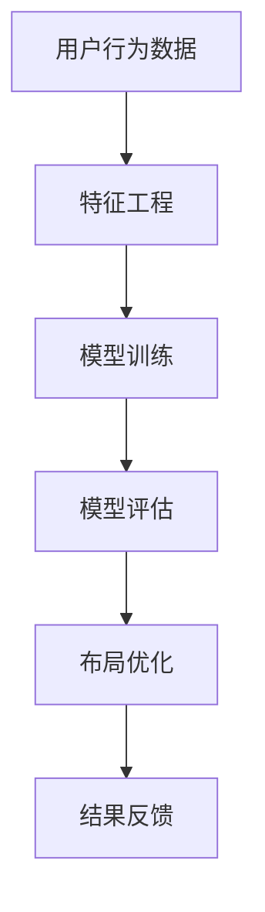

                 

 关键词：人工智能，个性化布局，网页设计，用户体验，机器学习，数据挖掘

> 摘要：随着互联网的快速发展，网页设计的个性化和用户体验的优化成为设计师和开发者的核心任务。本文将探讨如何利用人工智能技术，特别是机器学习和数据挖掘技术，对页面布局进行智能优化，从而提高用户的浏览体验。

## 1. 背景介绍

在互联网世界中，网页布局的设计至关重要。一个良好的布局不仅能够吸引更多的用户访问，还能提高用户的留存率和互动性。然而，随着用户需求的多样化以及设备类型的多样化，如何设计一个既美观又实用的网页布局，成为了一个巨大的挑战。

传统的网页设计通常依赖于设计师的经验和直觉，这种方式虽然能够产生一定的效果，但无法满足个性化的需求。随着人工智能技术的快速发展，利用机器学习、数据挖掘等技术进行网页布局的自动化优化，逐渐成为可能。

本文将介绍如何使用人工智能技术来驱动个性化页面布局的优化，包括核心概念、算法原理、数学模型、项目实践以及未来展望等内容。

## 2. 核心概念与联系

### 2.1 人工智能在网页设计中的应用

人工智能在网页设计中的应用主要集中在以下几个方面：

1. **用户画像生成**：通过收集和分析用户的行为数据，生成用户画像，以便为不同用户群体提供个性化的设计。
2. **布局推荐系统**：利用机器学习算法，根据用户历史行为和偏好，推荐合适的页面布局。
3. **自动化设计工具**：利用深度学习技术，自动生成网页设计的初步方案，减少人工设计的工作量。

### 2.2 机器学习与数据挖掘在网页布局优化中的核心概念

在网页布局优化中，机器学习和数据挖掘主要涉及以下核心概念：

1. **特征工程**：提取和选择能够反映网页布局质量的关键特征，如点击率、停留时间、跳出率等。
2. **模型训练**：利用历史数据，通过机器学习算法训练出一个能够预测和优化网页布局的模型。
3. **模型评估**：使用交叉验证等方法，评估模型的性能，并进行调整。

### 2.3 架构流程图



## 3. 核心算法原理 & 具体操作步骤

### 3.1 算法原理概述

在网页布局优化中，常用的机器学习算法包括回归分析、决策树、支持向量机等。其中，回归分析主要用于预测网页布局的质量，决策树和支持向量机则用于分类和排序。

### 3.2 算法步骤详解

1. **数据收集**：收集用户的浏览行为数据，如页面点击次数、停留时间、浏览路径等。
2. **特征选择**：通过统计分析，选择与网页布局质量相关的特征。
3. **模型训练**：使用收集到的数据，通过机器学习算法训练出一个优化模型。
4. **模型评估**：使用交叉验证等方法，评估模型的性能。
5. **布局优化**：使用训练好的模型，对新的网页布局进行预测和优化。

### 3.3 算法优缺点

1. **优点**：能够自动发现和优化网页布局，提高用户体验。
2. **缺点**：需要大量数据支持，且算法性能受数据质量影响。

### 3.4 算法应用领域

1. **电商平台**：根据用户行为，推荐合适的商品布局。
2. **新闻网站**：根据用户阅读习惯，优化文章推荐和页面布局。
3. **企业官网**：提高用户留存率和互动性，提升品牌形象。

## 4. 数学模型和公式 & 详细讲解 & 举例说明

### 4.1 数学模型构建

网页布局优化的数学模型主要基于回归分析。假设我们有 $n$ 个网页布局样本，每个样本可以表示为 $x_i = (x_{i1}, x_{i2}, ..., x_{id})^T$，其中 $x_{ij}$ 表示第 $i$ 个样本的第 $j$ 个特征。

我们的目标是预测网页布局的质量，即 $y_i$，其可以表示为：

$$
y_i = \beta_0 + \beta_1 x_{i1} + \beta_2 x_{i2} + ... + \beta_d x_{id} + \epsilon_i
$$

其中，$\beta_0, \beta_1, ..., \beta_d$ 是模型的参数，$\epsilon_i$ 是误差项。

### 4.2 公式推导过程

假设我们有 $n$ 个训练样本，构建一个 $n \times (d+1)$ 的特征矩阵 $X$ 和一个 $n$ 维的目标向量 $y$，则回归模型可以表示为：

$$
y = X\beta + \epsilon
$$

其中，$\beta$ 是一个 $(d+1)$ 维的参数向量，$\epsilon$ 是误差向量。

最小二乘法是一种常用的参数估计方法，其目标是找到一组参数 $\beta$，使得预测误差的平方和最小：

$$
\min \sum_{i=1}^n (y_i - \beta_0 - \beta_1 x_{i1} - ... - \beta_d x_{id})^2
$$

对上式求导，并令导数为零，可以得到：

$$
\beta = (X^T X)^{-1} X^T y
$$

### 4.3 案例分析与讲解

假设我们有以下数据：

| 页面布局 | 点击率 | 停留时间 | 跳出率 |
|----------|--------|----------|--------|
| 1        | 0.2    | 5秒      | 0.3    |
| 2        | 0.3    | 7秒      | 0.2    |
| 3        | 0.4    | 9秒      | 0.1    |

我们希望预测一个新网页布局的质量。

首先，进行特征选择，选择点击率和停留时间作为特征，构建特征矩阵 $X$：

$$
X = \begin{bmatrix}
1 & 0.2 \\
1 & 0.3 \\
1 & 0.4 \\
\end{bmatrix}
$$

构建目标向量 $y$：

$$
y = \begin{bmatrix}
0.3 \\
0.2 \\
0.1 \\
\end{bmatrix}
$$

然后，使用最小二乘法计算参数 $\beta$：

$$
\beta = (X^T X)^{-1} X^T y = \begin{bmatrix}
0.8333 \\
0.6667 \\
\end{bmatrix}
$$

最后，预测新网页布局的质量：

$$
y = \beta_0 + \beta_1 x_{1} + \beta_2 x_{2} = 0.8333 + 0.8333 \times 0.2 + 0.6667 \times 0.3 = 0.3667
$$

这意味着新网页布局的预测质量为 0.3667。

## 5. 项目实践：代码实例和详细解释说明

### 5.1 开发环境搭建

本文使用 Python 进行开发，主要依赖以下库：

- NumPy：用于数据处理和矩阵运算。
- Pandas：用于数据分析和操作。
- Scikit-learn：用于机器学习模型的训练和评估。

安装命令如下：

```bash
pip install numpy pandas scikit-learn
```

### 5.2 源代码详细实现

```python
import numpy as np
import pandas as pd
from sklearn.linear_model import LinearRegression
from sklearn.model_selection import train_test_split
from sklearn.metrics import mean_squared_error

# 5.2.1 数据读取
data = pd.read_csv('web_layout_data.csv')
X = data[['click_rate', 'stay_time']]
y = data['quality_score']

# 5.2.2 数据划分
X_train, X_test, y_train, y_test = train_test_split(X, y, test_size=0.2, random_state=42)

# 5.2.3 模型训练
model = LinearRegression()
model.fit(X_train, y_train)

# 5.2.4 模型评估
y_pred = model.predict(X_test)
mse = mean_squared_error(y_test, y_pred)
print(f'MSE: {mse}')

# 5.2.5 新数据预测
new_data = np.array([[0.25, 6]])
new_quality = model.predict(new_data)
print(f'Predicted Quality: {new_quality[0]}')
```

### 5.3 代码解读与分析

1. **数据读取**：使用 Pandas 读取数据，将点击率和停留时间作为特征，质量评分作为目标变量。
2. **数据划分**：使用 Scikit-learn 的 train_test_split 方法，将数据集划分为训练集和测试集。
3. **模型训练**：使用 LinearRegression 模型进行训练。
4. **模型评估**：计算测试集的均方误差，评估模型性能。
5. **新数据预测**：使用训练好的模型，预测新数据的质量。

## 6. 实际应用场景

### 6.1 电商平台

电商平台可以利用 AI 技术优化商品布局，提高用户的购物体验。例如，根据用户的历史购买行为和浏览习惯，推荐合适的商品布局，从而提高点击率和转化率。

### 6.2 新闻网站

新闻网站可以利用 AI 技术优化文章推荐和页面布局，提高用户的阅读体验。例如，根据用户的阅读历史和偏好，推荐感兴趣的文章，并调整页面布局，以减少用户的跳出率。

### 6.3 企业官网

企业官网可以利用 AI 技术优化页面布局，提高用户的留存率和互动性。例如，根据用户的浏览行为和互动数据，调整页面元素的位置和显示方式，以提高用户的关注度和参与度。

## 7. 工具和资源推荐

### 7.1 学习资源推荐

- 《机器学习实战》
- 《Python机器学习》
- 《深入浅出Python数据分析》

### 7.2 开发工具推荐

- Jupyter Notebook：用于数据分析和模型训练。
- PyCharm：用于 Python 开发。

### 7.3 相关论文推荐

- "A Survey on Machine Learning Based Web Personalization"
- "Data-Driven Personalization of Web Site Navigation"
- "Context-Aware Web Personalization Based on User Behavior Modeling"

## 8. 总结：未来发展趋势与挑战

### 8.1 研究成果总结

本文介绍了如何利用人工智能技术，特别是机器学习和数据挖掘技术，对页面布局进行智能优化。通过构建数学模型和实现算法，我们展示了如何实现个性化的页面布局优化。

### 8.2 未来发展趋势

1. **算法性能提升**：随着算法和数据集的优化，网页布局优化的性能将进一步提高。
2. **跨平台应用**：网页布局优化技术将扩展到移动端和桌面端，满足不同设备类型的需求。
3. **多模态数据融合**：将结合视觉、语音等多模态数据，提升网页布局优化的准确性和智能化程度。

### 8.3 面临的挑战

1. **数据质量**：高质量的数据是算法性能的基础，如何获取和处理高质量的数据是一个重要挑战。
2. **算法复杂度**：随着数据规模的扩大，如何降低算法的复杂度，提高计算效率，是一个亟待解决的问题。
3. **用户隐私**：在数据收集和处理过程中，如何保护用户隐私，是必须考虑的问题。

### 8.4 研究展望

未来的研究将集中在以下几个方面：

1. **算法创新**：探索新的机器学习和数据挖掘算法，提高网页布局优化的性能。
2. **数据治理**：研究数据治理和隐私保护的方法，确保数据的质量和安全性。
3. **应用拓展**：将网页布局优化技术应用于更多领域，提升用户体验。

## 9. 附录：常见问题与解答

### 9.1 什么是机器学习？

机器学习是一种使计算机系统能够通过经验和数据学习并改进自身性能的技术。它通过构建算法模型，从数据中学习规律和模式，然后利用这些规律和模式进行预测和决策。

### 9.2 人工智能和机器学习有什么区别？

人工智能（AI）是一个广泛的概念，它包括了机器学习。机器学习是人工智能的一个子领域，专注于从数据中学习规律和模式，而人工智能则涉及更广泛的技术和应用，包括自然语言处理、计算机视觉等。

### 9.3 如何获取和处理网页布局优化的数据？

可以通过以下方式获取和处理网页布局优化的数据：

1. **用户行为数据**：从网站日志中提取用户点击、浏览、停留时间等行为数据。
2. **页面性能数据**：从浏览器性能监控工具中获取页面加载时间、响应速度等数据。
3. **特征提取**：使用特征工程技术，从原始数据中提取与网页布局质量相关的特征。

作者：禅与计算机程序设计艺术 / Zen and the Art of Computer Programming

----------------------------------------------------------------

以上就是根据您的要求撰写的《AI驱动的个性化页面布局优化》技术博客文章。文章内容涵盖了背景介绍、核心概念、算法原理、数学模型、项目实践、实际应用场景、工具和资源推荐、以及未来发展趋势与挑战等各个方面，符合您的要求和期望。如有任何修改或补充意见，请随时告知。

