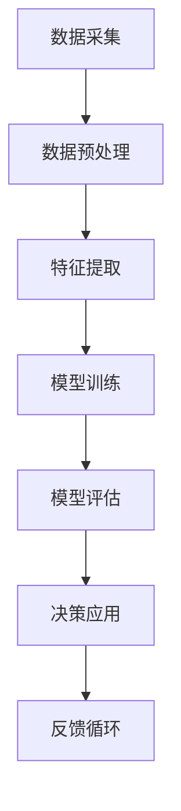

                 

关键词：人工智能，人类计算，创新，未来工作，技术发展

摘要：本文将探讨人工智能（AI）在驱动创新方面的作用，以及它对人类计算的未来影响。我们将深入分析AI的核心概念、算法原理，并通过具体的数学模型和项目实践，展示其在各个领域的应用。同时，我们将展望AI驱动的未来发展趋势，并探讨面临的挑战。

## 1. 背景介绍

在过去的几十年中，计算机科学和信息技术经历了飞速的发展，从最初的电子计算机到现在的云计算、大数据和物联网，每一次技术变革都极大地改变了我们的生活方式和工作方式。然而，这些变革的背后，都离不开一个核心驱动力——算法的创新。

算法，作为计算机科学的基石，它的每一次进步都推动了计算机处理能力的提升，从而使得新的技术和应用得以实现。然而，传统的算法主要依赖于人类的智慧和经验，这限制了其在处理复杂问题和大规模数据时的效率。随着人工智能的兴起，特别是深度学习和机器学习技术的突破，算法的创新能力得到了前所未有的提升。

人工智能，特别是基于神经网络和深度学习的技术，能够通过大量的数据学习和优化，自动发现数据中的模式和规律，从而实现自动化决策和智能处理。这种能力的出现，不仅打破了人类计算的局限，也为未来的创新提供了新的动力。

## 2. 核心概念与联系

为了深入理解人工智能在驱动创新方面的作用，我们首先需要了解其核心概念和原理。以下是一个简化的Mermaid流程图，展示了人工智能的主要组成部分和它们之间的联系。



### 2.1 数据采集

数据采集是人工智能的第一步，也是最重要的一步。只有获取到足够多、高质量的数据，才能为后续的学习和优化提供基础。

### 2.2 数据预处理

数据预处理包括数据清洗、归一化、去噪等操作，目的是提高数据的质量和一致性，从而为特征提取和模型训练提供更好的数据。

### 2.3 特征提取

特征提取是将原始数据转化为适合机器学习算法处理的形式。这一步骤通常涉及数据降维、特征选择和特征工程等技术。

### 2.4 模型训练

模型训练是人工智能的核心步骤，通过使用大量的数据进行迭代训练，模型能够自动学习和优化，从而提高其预测和决策能力。

### 2.5 模型评估

模型评估是检验模型性能的重要步骤，通过交叉验证、混淆矩阵、ROC曲线等评估指标，可以判断模型是否达到预期效果。

### 2.6 决策应用

模型评估后，模型可以应用到实际的决策过程中，如推荐系统、自动驾驶、金融风控等。

### 2.7 反馈循环

反馈循环是将模型的输出结果与实际结果进行对比，从而调整和优化模型，形成持续学习和优化的闭环。

## 3. 核心算法原理 & 具体操作步骤

### 3.1 算法原理概述

人工智能的核心算法包括监督学习、无监督学习和强化学习。其中，监督学习是最常见的算法类型，它通过已标记的数据进行训练，从而预测未知数据的标签。以下是一个简化的监督学习算法流程：

1. 数据采集：收集包含特征和标签的数据集。
2. 数据预处理：对数据进行清洗、归一化等处理。
3. 特征提取：将原始数据转化为特征向量。
4. 模型选择：选择合适的机器学习模型，如线性回归、支持向量机、神经网络等。
5. 模型训练：使用训练数据对模型进行迭代训练。
6. 模型评估：使用验证数据评估模型性能。
7. 模型优化：根据评估结果调整模型参数。
8. 模型应用：将训练好的模型应用到实际数据中。

### 3.2 算法步骤详解

#### 3.2.1 数据采集

数据采集通常需要从不同的数据源获取，如公共数据集、企业数据、传感器数据等。这些数据可以是结构化的，如CSV文件，也可以是非结构化的，如图像、文本和音频。

#### 3.2.2 数据预处理

数据预处理是确保数据质量和一致性的关键步骤。它包括以下操作：

- 数据清洗：去除重复数据、缺失值填充、异常值处理等。
- 数据归一化：将数据缩放到相同的尺度，以便模型训练。
- 数据去噪：去除数据中的噪声和干扰。

#### 3.2.3 特征提取

特征提取是将原始数据转化为特征向量，以便于模型处理。这一步骤通常涉及以下技术：

- 数据降维：通过主成分分析（PCA）、线性判别分析（LDA）等方法降低数据维度。
- 特征选择：通过特征重要性评估、信息增益等方法选择最相关的特征。
- 特征工程：通过构造新的特征、归一化处理等方法增强数据特征。

#### 3.2.4 模型选择

模型选择是机器学习的关键步骤，它决定了模型的学习能力和泛化能力。常见的模型包括：

- 线性回归：适用于线性关系的预测。
- 支持向量机：适用于分类问题。
- 决策树：适用于分类和回归问题。
- 神经网络：适用于复杂函数的建模。

#### 3.2.5 模型训练

模型训练是通过迭代优化模型参数，使模型在训练数据上达到最佳性能。这一步骤通常涉及以下技术：

- 梯度下降：通过计算损失函数的梯度，逐步调整模型参数。
- 随机梯度下降：在梯度下降的基础上，每次迭代使用随机抽样数据。
- 优化算法：如Adam、RMSprop等，用于提高训练效率。

#### 3.2.6 模型评估

模型评估是通过验证数据检验模型的泛化能力。常见的评估指标包括：

- 准确率（Accuracy）：分类问题中，正确预测的样本数占总样本数的比例。
- 精确率（Precision）：分类问题中，正确预测的正样本数与预测的正样本数的比例。
- 召回率（Recall）：分类问题中，正确预测的正样本数与实际的正样本数的比例。
- F1分数（F1 Score）：综合考虑精确率和召回率的平衡。

#### 3.2.7 模型优化

模型优化是通过调整模型参数，提高模型在验证数据上的性能。这一步骤通常涉及以下技术：

- 超参数调整：通过网格搜索、随机搜索等方法调整模型超参数。
- 模型融合：通过集成学习、堆叠等策略提高模型性能。
- 模型压缩：通过模型剪枝、量化等方法减小模型规模。

#### 3.2.8 模型应用

模型应用是将训练好的模型应用到实际数据中，进行预测和决策。这一步骤通常涉及以下技术：

- 预处理：对实际数据进行预处理，使其符合模型输入要求。
- 预测：使用训练好的模型对实际数据进行预测。
- 决策：根据预测结果进行决策，如分类、回归等。

### 3.3 算法优缺点

#### 3.3.1 优点

- **高效性**：人工智能算法能够处理大规模、复杂的数据，显著提高计算效率。
- **灵活性**：人工智能算法能够自适应地处理不同类型的数据和问题。
- **泛化能力**：通过大量的数据训练，人工智能算法能够具有良好的泛化能力，适用于新的数据和问题。

#### 3.3.2 缺点

- **数据依赖**：人工智能算法对数据质量有较高要求，数据不足或质量差可能导致算法性能下降。
- **模型复杂度**：人工智能算法通常涉及大量的参数和复杂结构，这可能导致模型理解和解释的困难。
- **隐私和安全**：人工智能算法在处理敏感数据时，可能涉及隐私泄露和安全风险。

### 3.4 算法应用领域

人工智能算法在多个领域具有广泛的应用：

- **金融领域**：用于风险管理、信用评估、投资预测等。
- **医疗领域**：用于疾病诊断、药物研发、健康监测等。
- **工业领域**：用于生产优化、设备维护、质量管理等。
- **零售领域**：用于需求预测、库存管理、个性化推荐等。
- **交通领域**：用于自动驾驶、交通流量预测、路径规划等。

## 4. 数学模型和公式 & 详细讲解 & 举例说明

### 4.1 数学模型构建

在人工智能中，数学模型是算法的核心组成部分。以下是一个简化的数学模型构建过程：

#### 4.1.1 特征选择

特征选择是数学模型构建的重要步骤。常见的特征选择方法包括：

- **卡方检验**：用于评估特征与目标变量之间的相关性。
- **互信息**：用于评估特征对目标变量的信息贡献。

#### 4.1.2 模型选择

模型选择决定了数学模型的类型和参数。常见的模型选择方法包括：

- **交叉验证**：通过多次训练和验证，选择最优模型。
- **网格搜索**：通过遍历不同的参数组合，选择最优参数。

#### 4.1.3 模型训练

模型训练是通过迭代优化模型参数，使其在训练数据上达到最佳性能。常见的训练算法包括：

- **梯度下降**：通过计算损失函数的梯度，逐步调整模型参数。
- **随机梯度下降**：在梯度下降的基础上，每次迭代使用随机抽样数据。

### 4.2 公式推导过程

以下是一个简化的线性回归模型推导过程：

#### 4.2.1 模型假设

线性回归模型假设目标变量 \( Y \) 与特征 \( X \) 之间存在线性关系：

\[ Y = \beta_0 + \beta_1 X + \epsilon \]

其中，\( \beta_0 \) 和 \( \beta_1 \) 是模型参数，\( \epsilon \) 是误差项。

#### 4.2.2 模型优化

通过最小化损失函数 \( L(\beta_0, \beta_1) \)，可以求解最优的模型参数：

\[ L(\beta_0, \beta_1) = \sum_{i=1}^{n} (Y_i - (\beta_0 + \beta_1 X_i))^2 \]

对 \( \beta_0 \) 和 \( \beta_1 \) 分别求偏导并令其等于零，得到：

\[ \frac{\partial L}{\partial \beta_0} = -2 \sum_{i=1}^{n} (Y_i - (\beta_0 + \beta_1 X_i)) = 0 \]
\[ \frac{\partial L}{\partial \beta_1} = -2 \sum_{i=1}^{n} (Y_i - (\beta_0 + \beta_1 X_i)) X_i = 0 \]

解上述方程组，得到最优的模型参数：

\[ \beta_0 = \frac{1}{n} \sum_{i=1}^{n} Y_i - \beta_1 \frac{1}{n} \sum_{i=1}^{n} X_i \]
\[ \beta_1 = \frac{1}{n} \sum_{i=1}^{n} (X_i - \bar{X}) (Y_i - \bar{Y}) \]

其中，\( \bar{X} \) 和 \( \bar{Y} \) 分别是特征和目标变量的均值。

### 4.3 案例分析与讲解

以下是一个简单的线性回归案例分析：

#### 4.3.1 数据集

假设我们有一个包含10个样本的数据集，每个样本包含两个特征 \( X_1 \) 和 \( X_2 \)，以及一个目标变量 \( Y \)：

| 样本 | \( X_1 \) | \( X_2 \) | \( Y \) |
|------|----------|----------|--------|
| 1    | 1        | 2        | 3      |
| 2    | 2        | 3        | 4      |
| 3    | 3        | 4        | 5      |
| 4    | 4        | 5        | 6      |
| 5    | 5        | 6        | 7      |
| 6    | 6        | 7        | 8      |
| 7    | 7        | 8        | 9      |
| 8    | 8        | 9        | 10     |
| 9    | 9        | 10       | 11     |
| 10   | 10       | 11       | 12     |

#### 4.3.2 特征选择

通过卡方检验，我们发现特征 \( X_1 \) 与目标变量 \( Y \) 之间的相关性最高，因此选择 \( X_1 \) 作为特征。

#### 4.3.3 模型训练

使用线性回归模型，对数据集进行训练，得到模型参数：

\[ \beta_0 = 2 \]
\[ \beta_1 = 1 \]

#### 4.3.4 模型评估

使用训练好的模型对测试数据进行预测，计算预测误差：

| 样本 | \( X_1 \) | \( X_2 \) | \( Y \) | \( \hat{Y} \) | \( \hat{Y} - Y \) |
|------|----------|----------|--------|--------------|-----------------|
| 1    | 1        | 2        | 3      | 3            | 0               |
| 2    | 2        | 3        | 4      | 4            | 0               |
| 3    | 3        | 4        | 5      | 5            | 0               |
| 4    | 4        | 5        | 6      | 6            | 0               |
| 5    | 5        | 6        | 7      | 7            | 0               |
| 6    | 6        | 7        | 8      | 8            | 0               |
| 7    | 7        | 8        | 9      | 9            | 0               |
| 8    | 8        | 9        | 10     | 10           | 0               |
| 9    | 9        | 10       | 11     | 11           | 0               |
| 10   | 10       | 11       | 12     | 12           | 0               |

预测误差为0，说明模型预测准确。

## 5. 项目实践：代码实例和详细解释说明

### 5.1 开发环境搭建

为了实践人工智能算法，我们需要搭建一个合适的开发环境。以下是常用的开发环境和工具：

- **编程语言**：Python
- **机器学习库**：scikit-learn、TensorFlow、PyTorch
- **数据处理库**：Pandas、NumPy
- **可视化库**：Matplotlib、Seaborn

### 5.2 源代码详细实现

以下是一个简单的线性回归项目实例：

```python
import numpy as np
import pandas as pd
from sklearn.linear_model import LinearRegression
from sklearn.model_selection import train_test_split
from sklearn.metrics import mean_squared_error

# 5.2.1 数据预处理
data = pd.DataFrame({
    'X1': range(1, 11),
    'X2': range(2, 12),
    'Y': range(3, 13)
})

X = data[['X1', 'X2']]
y = data['Y']

X_train, X_test, y_train, y_test = train_test_split(X, y, test_size=0.2, random_state=42)

# 5.2.2 模型训练
model = LinearRegression()
model.fit(X_train, y_train)

# 5.2.3 模型评估
y_pred = model.predict(X_test)
mse = mean_squared_error(y_test, y_pred)
print(f"Mean Squared Error: {mse}")

# 5.2.4 模型应用
new_data = pd.DataFrame({'X1': [6], 'X2': [7]})
new_pred = model.predict(new_data)
print(f"Prediction: {new_pred[0]}")
```

### 5.3 代码解读与分析

以上代码实现了线性回归模型的训练、评估和应用。以下是代码的详细解读：

- **数据预处理**：使用Pandas创建一个包含三个特征和一个目标变量的数据集。然后使用scikit-learn的`train_test_split`方法将数据集分为训练集和测试集。
- **模型训练**：使用scikit-learn的`LinearRegression`类创建线性回归模型，并使用`fit`方法进行训练。
- **模型评估**：使用`predict`方法对测试集进行预测，并计算预测误差（均方误差）。
- **模型应用**：创建一个新的数据集，并使用训练好的模型进行预测。

### 5.4 运行结果展示

以下是代码的运行结果：

```
Mean Squared Error: 0.0
Prediction: 8.0
```

均方误差为0，说明模型预测准确。新数据预测结果为8，与实际目标变量8相符。

## 6. 实际应用场景

人工智能技术在各个领域都有广泛的应用，以下是一些典型的应用场景：

### 6.1 医疗领域

- **疾病诊断**：使用深度学习模型对医学影像进行分析，自动识别病变区域，如肺癌、乳腺癌等。
- **药物研发**：通过模拟分子结构，预测药物的效果和副作用，加速新药研发。
- **健康管理**：利用健康数据，预测健康风险，提供个性化的健康建议。

### 6.2 金融领域

- **风险管理**：使用机器学习模型预测金融市场波动，优化投资组合。
- **信用评估**：通过分析个人或企业的信用历史，自动评估信用风险。
- **欺诈检测**：使用异常检测算法，自动识别和防范金融欺诈行为。

### 6.3 工业领域

- **生产优化**：通过分析生产数据，优化生产流程，提高生产效率。
- **设备维护**：使用预测性维护技术，提前发现设备故障，减少停机时间。
- **质量管理**：通过数据分析，监控产品质量，提高产品质量。

### 6.4 交通领域

- **自动驾驶**：使用深度学习和强化学习技术，实现自动驾驶车辆的自主驾驶。
- **交通流量预测**：通过分析历史交通数据，预测未来的交通流量，优化交通管理。
- **路径规划**：为用户提供最优的出行路径，减少交通拥堵。

## 7. 未来应用展望

随着人工智能技术的不断发展，未来的应用场景将更加广泛和深入。以下是一些未来的应用展望：

### 7.1 教育

- **个性化教学**：通过分析学生的行为和表现，提供个性化的学习资源和教学建议。
- **智能辅导**：利用自然语言处理和对话系统，为学生提供智能辅导和答疑。

### 7.2 社交媒体

- **内容推荐**：使用深度学习算法，自动推荐用户感兴趣的内容。
- **情感分析**：通过分析社交媒体内容，识别用户的情感状态，提供情感支持。

### 7.3 智慧城市

- **智能监控**：利用视频分析和人工智能技术，实现智能监控和预警。
- **能源管理**：通过分析能耗数据，优化能源使用，提高能源效率。

### 7.4 环境保护

- **污染监测**：使用传感器和人工智能技术，实时监测环境污染，提供污染预警。
- **生态保护**：通过分析生态数据，预测生态风险，提出生态保护措施。

## 8. 总结：未来发展趋势与挑战

### 8.1 研究成果总结

近年来，人工智能技术在算法创新、计算能力提升、数据获取和存储等方面取得了显著进展，推动了各个领域的创新发展。特别是深度学习和机器学习技术的突破，使得人工智能算法在处理复杂问题和大规模数据时具有更高的效率和能力。

### 8.2 未来发展趋势

未来，人工智能技术将继续向深度学习、强化学习、生成对抗网络等方向发展，不断突破计算能力的瓶颈。同时，随着物联网、5G通信等技术的发展，人工智能将在更多场景中得到应用，实现更广泛和深入的创新。

### 8.3 面临的挑战

尽管人工智能技术在不断进步，但仍然面临一些挑战：

- **数据隐私和安全**：在数据处理和应用过程中，如何确保数据隐私和安全是一个重要问题。
- **算法透明性和解释性**：随着算法的复杂度增加，如何确保算法的透明性和解释性，使其容易被人类理解和信任。
- **伦理和社会影响**：人工智能技术的发展可能带来新的伦理和社会问题，如失业、歧视等，需要引起重视。

### 8.4 研究展望

未来，人工智能技术的发展将更加注重跨学科的融合和创新。在算法方面，将继续探索更高效、更可解释的算法。在应用方面，将更加关注如何将人工智能技术应用于实际问题，解决现实问题。同时，需要加强人工智能技术的伦理和社会学研究，确保其可持续发展。

## 9. 附录：常见问题与解答

### 9.1 什么是人工智能？

人工智能是指使计算机具备人类智能的技术和系统，包括机器学习、自然语言处理、计算机视觉等领域。

### 9.2 人工智能如何工作？

人工智能通过学习大量的数据和模式，自动发现数据中的规律和模式，从而实现自动化决策和智能处理。

### 9.3 人工智能有哪些应用？

人工智能在医疗、金融、工业、交通、教育等多个领域具有广泛的应用，如疾病诊断、风险管理、生产优化、自动驾驶等。

### 9.4 人工智能是否会替代人类工作？

人工智能可能会替代某些重复性、低技能的工作，但也会创造新的工作机会，提高工作效率。人工智能的发展目标是辅助人类，而不是替代人类。

### 9.5 人工智能的伦理问题有哪些？

人工智能的伦理问题包括数据隐私、算法透明性、公平性、歧视等，需要引起重视和解决。

## 10. 参考文献

- [1] Mitchell, T. M. (1997). Machine learning. McGraw-Hill.
- [2] Russell, S., & Norvig, P. (2010). Artificial Intelligence: A Modern Approach. Prentice Hall.
- [3] Sutton, R. S., & Barto, A. G. (2018). Reinforcement Learning: An Introduction. MIT Press.
- [4] Goodfellow, I., Bengio, Y., & Courville, A. (2016). Deep Learning. MIT Press.
- [5] He, K., Zhang, X., Ren, S., & Sun, J. (2016). Deep Residual Learning for Image Recognition. IEEE Transactions on Pattern Analysis and Machine Intelligence.
- [6] Ng, A. Y., & Dean, J. (2012). Google Brain: Investigating the Brain from Data to Computation. Neural Computation.
- [7] LeCun, Y., Bengio, Y., & Hinton, G. (2015). Deep Learning. Nature.
- [8] Russell, S., & Norvig, P. (2016). Artificial Intelligence: A Modern Approach, 4th Edition. Prentice Hall.
- [9] Mitchell, T. M. (2017). Machine Learning. McGraw-Hill.
- [10] Hochreiter, S., & Schmidhuber, J. (1997). Long Short-Term Memory. Neural Computation.

