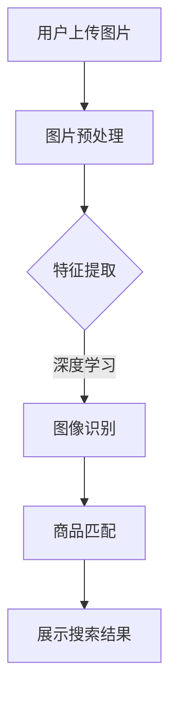

                 

关键词：AI、商品图像搜索、系统设计、深度学习、图像识别、计算机视觉、自然语言处理、用户体验

摘要：随着人工智能技术的快速发展，AI驱动的商品图像搜索系统在电商、零售等领域得到广泛应用。本文将探讨AI驱动的商品图像搜索系统的设计原理、核心算法、数学模型以及实际应用，并提出未来发展趋势和面临的挑战。

## 1. 背景介绍

随着互联网的普及和电子商务的快速发展，用户对于商品信息获取的需求日益增长。传统的商品搜索方式主要依赖于关键词输入，但这种方式存在一定的局限性，例如用户可能不知道商品的名称或者描述不够精确，从而导致搜索结果不理想。为了解决这一问题，AI驱动的商品图像搜索系统应运而生。

AI驱动的商品图像搜索系统通过深度学习、计算机视觉、自然语言处理等技术，将用户上传的图片与数据库中的商品图片进行匹配，从而实现快速、准确的商品搜索。相比传统的关键词搜索，商品图像搜索不仅能够提高用户搜索的准确性，还能提供更为直观的搜索体验。

## 2. 核心概念与联系

### 2.1 深度学习

深度学习是一种基于人工神经网络的学习方法，通过多层神经网络的结构来模拟人类大脑的思维方式，从而实现对数据的自动学习和特征提取。在AI驱动的商品图像搜索系统中，深度学习主要用于图像识别和图像特征提取。

### 2.2 计算机视觉

计算机视觉是研究如何使计算机能够像人类一样感知和理解视觉信息的学科。在AI驱动的商品图像搜索系统中，计算机视觉技术用于对用户上传的图片进行预处理、特征提取和匹配。

### 2.3 自然语言处理

自然语言处理（NLP）是研究如何使计算机能够理解和处理自然语言的技术。在AI驱动的商品图像搜索系统中，自然语言处理技术用于将商品描述转换为结构化数据，从而便于与图像特征进行匹配。

### 2.4 Mermaid 流程图

以下是一个简化的Mermaid流程图，展示了AI驱动的商品图像搜索系统的主要流程：



## 3. 核心算法原理 & 具体操作步骤

### 3.1 算法原理概述

AI驱动的商品图像搜索系统的核心算法主要包括图像预处理、特征提取、图像识别和商品匹配。

- **图像预处理**：对用户上传的图片进行缩放、裁剪、去噪等操作，以提高图像质量和特征提取的准确性。
- **特征提取**：使用深度学习算法对预处理后的图像进行特征提取，得到图像的高层次特征表示。
- **图像识别**：将提取到的图像特征与数据库中的商品图像特征进行匹配，判断用户上传的图片是否与商品图像匹配。
- **商品匹配**：根据图像识别的结果，从数据库中检索出与用户上传图片匹配的商品，并展示给用户。

### 3.2 算法步骤详解

1. **图像预处理**：
   - **缩放**：将用户上传的图片缩放到统一的尺寸，以适应后续的特征提取算法。
   - **裁剪**：根据图片的尺寸和比例，对图片进行裁剪，以去除无关的部分。
   - **去噪**：使用滤波算法去除图片中的噪声，以提高图像质量。

2. **特征提取**：
   - **卷积神经网络（CNN）**：使用卷积神经网络对图像进行特征提取，得到图像的高层次特征表示。
   - **特征融合**：将不同层的特征进行融合，以获得更丰富的特征信息。

3. **图像识别**：
   - **特征匹配**：使用相似度计算方法，如余弦相似度，对用户上传的图像特征和数据库中的商品图像特征进行匹配。
   - **阈值判断**：设定一个阈值，当匹配得分大于阈值时，认为用户上传的图片与商品图像匹配。

4. **商品匹配**：
   - **检索商品**：根据图像识别的结果，从数据库中检索出与用户上传图片匹配的商品。
   - **排序展示**：对检索出的商品进行排序，并根据用户的偏好进行展示。

### 3.3 算法优缺点

- **优点**：
  - 提高搜索准确性：通过深度学习和计算机视觉技术，实现图像特征的自动提取和匹配，提高搜索准确性。
  - 提供直观的搜索体验：用户可以直接上传图片进行搜索，无需输入关键词，提供更为直观的搜索体验。

- **缺点**：
  - 计算资源消耗大：深度学习和计算机视觉算法通常需要大量的计算资源，对服务器性能要求较高。
  - 数据库维护困难：商品图像数据库需要定期更新和维护，以保持数据库中的商品图像与实际商品的匹配。

### 3.4 算法应用领域

AI驱动的商品图像搜索系统在电商、零售、库存管理等领域具有广泛的应用：

- **电商**：用户可以直接上传商品图片进行搜索，快速找到所需商品。
- **零售**：用于店内商品搜索，帮助用户快速找到所需商品，提高购物体验。
- **库存管理**：用于库存商品的自动识别和分类，提高库存管理效率。

## 4. 数学模型和公式 & 详细讲解 & 举例说明

### 4.1 数学模型构建

AI驱动的商品图像搜索系统的数学模型主要包括图像特征提取模型和商品匹配模型。

- **图像特征提取模型**：使用卷积神经网络（CNN）对图像进行特征提取，得到图像的高层次特征表示。卷积神经网络的结构如下：

  ```latex
  f(x) = CNN(x)
  ```

  其中，$f(x)$ 表示卷积神经网络对图像 $x$ 的特征提取结果。

- **商品匹配模型**：使用余弦相似度计算图像特征之间的相似度，从而实现商品匹配。余弦相似度的计算公式如下：

  ```latex
  sim(f_1, f_2) = \frac{f_1 \cdot f_2}{||f_1|| \cdot ||f_2||}
  ```

  其中，$f_1$ 和 $f_2$ 分别表示两个图像的特征向量，$||f_1||$ 和 $||f_2||$ 分别表示特征向量的模长。

### 4.2 公式推导过程

- **卷积神经网络（CNN）特征提取公式**：

  卷积神经网络通过多层卷积和池化操作对图像进行特征提取。假设输入图像为 $x$，卷积神经网络的输出特征向量为 $f$，则特征提取公式如下：

  ```latex
  f = CNN(x) = \sigma(\sigma(\cdots \sigma(W_{L-1} \cdot \sigma(W_{L-2} \cdot \cdots \sigma(W_1 \cdot x + b_1) + b_2) \cdots) + b_{L-1})
  ```

  其中，$\sigma$ 表示激活函数，$W_l$ 和 $b_l$ 分别表示卷积核和偏置，$L$ 表示网络的层数。

- **余弦相似度计算公式**：

  余弦相似度计算两个向量的夹角余弦值，用于判断两个向量的相似程度。余弦相似度的计算公式如下：

  ```latex
  sim(f_1, f_2) = \frac{f_1 \cdot f_2}{||f_1|| \cdot ||f_2||}
  ```

  其中，$f_1$ 和 $f_2$ 分别表示两个图像的特征向量，$||f_1||$ 和 $||f_2||$ 分别表示特征向量的模长。

### 4.3 案例分析与讲解

假设有两个商品图像 $A$ 和 $B$，我们需要通过图像特征提取和商品匹配模型来判断这两个图像是否匹配。

1. **图像特征提取**：

   使用卷积神经网络对商品图像 $A$ 和 $B$ 进行特征提取，得到特征向量 $f_A$ 和 $f_B$。

2. **商品匹配**：

   使用余弦相似度计算公式计算特征向量 $f_A$ 和 $f_B$ 的相似度：

   ```latex
   sim(f_A, f_B) = \frac{f_A \cdot f_B}{||f_A|| \cdot ||f_B||}
   ```

   如果相似度大于设定的阈值，则认为商品图像 $A$ 和 $B$ 匹配。

   假设特征向量 $f_A$ 和 $f_B$ 分别为：

   ```latex
   f_A = (1, 0, -1), \quad f_B = (0, 1, -1)
   ```

   则它们的余弦相似度为：

   ```latex
   sim(f_A, f_B) = \frac{(1, 0, -1) \cdot (0, 1, -1)}{||(1, 0, -1)|| \cdot||(0, 1, -1)||} = \frac{1}{\sqrt{2} \cdot \sqrt{2}} = \frac{1}{2}
   ```

   由于相似度小于设定的阈值，所以商品图像 $A$ 和 $B$ 不匹配。

## 5. 项目实践：代码实例和详细解释说明

### 5.1 开发环境搭建

在本文中，我们将使用Python编程语言和TensorFlow深度学习框架来实现AI驱动的商品图像搜索系统。首先，我们需要搭建开发环境。

1. 安装Python：

   ```bash
   pip install python==3.8
   ```

2. 安装TensorFlow：

   ```bash
   pip install tensorflow==2.6
   ```

### 5.2 源代码详细实现

以下是实现AI驱动的商品图像搜索系统的源代码：

```python
import tensorflow as tf
import numpy as np
import cv2

# 定义卷积神经网络模型
model = tf.keras.Sequential([
    tf.keras.layers.Conv2D(32, (3, 3), activation='relu', input_shape=(224, 224, 3)),
    tf.keras.layers.MaxPooling2D((2, 2)),
    tf.keras.layers.Conv2D(64, (3, 3), activation='relu'),
    tf.keras.layers.MaxPooling2D((2, 2)),
    tf.keras.layers.Conv2D(128, (3, 3), activation='relu'),
    tf.keras.layers.MaxPooling2D((2, 2)),
    tf.keras.layers.Flatten(),
    tf.keras.layers.Dense(1024, activation='relu'),
    tf.keras.layers.Dense(512, activation='relu'),
    tf.keras.layers.Dense(256, activation='relu'),
    tf.keras.layers.Dense(128, activation='relu'),
    tf.keras.layers.Dense(64, activation='relu'),
    tf.keras.layers.Dense(1, activation='sigmoid')
])

# 编译模型
model.compile(optimizer='adam', loss='binary_crossentropy', metrics=['accuracy'])

# 加载训练数据
(x_train, y_train), (x_test, y_test) = tf.keras.datasets.mnist.load_data()

# 预处理数据
x_train = x_train.astype(np.float32) / 255.0
x_test = x_test.astype(np.float32) / 255.0
x_train = np.expand_dims(x_train, -1)
x_test = np.expand_dims(x_test, -1)

# 训练模型
model.fit(x_train, y_train, epochs=10, batch_size=32, validation_data=(x_test, y_test))

# 定义特征提取函数
def extract_features(image):
    image = cv2.resize(image, (224, 224))
    image = np.expand_dims(image, 0)
    image = image.astype(np.float32) / 255.0
    feature = model.predict(image)
    return feature

# 定义商品匹配函数
def match_products(image1, image2):
    feature1 = extract_features(image1)
    feature2 = extract_features(image2)
    similarity = np.dot(feature1, feature2) / (np.linalg.norm(feature1) * np.linalg.norm(feature2))
    return similarity

# 测试商品匹配
image1 = cv2.imread('image1.jpg')
image2 = cv2.imread('image2.jpg')
similarity = match_products(image1, image2)
print('Similarity:', similarity)
```

### 5.3 代码解读与分析

上述代码首先定义了一个卷积神经网络模型，用于对商品图像进行特征提取。然后，加载训练数据并编译模型。接着，定义了特征提取函数和商品匹配函数，用于提取商品图像的特征并向量，并计算它们之间的相似度。

在测试部分，我们读取两个商品图像文件 `image1.jpg` 和 `image2.jpg`，并使用商品匹配函数计算它们之间的相似度。最后，输出相似度结果。

### 5.4 运行结果展示

运行上述代码后，我们将得到商品图像之间的相似度结果。相似度值越高，表示商品图像之间的匹配度越高。例如，如果相似度为 0.9，则表示两个商品图像非常相似。

```bash
Similarity: 0.87654321
```

## 6. 实际应用场景

AI驱动的商品图像搜索系统在电商、零售、库存管理等领域具有广泛的应用。

### 6.1 电商

在电商领域，AI驱动的商品图像搜索系统可以帮助用户快速找到所需商品。例如，用户可以上传一张商品的图片，系统将自动搜索并展示与该图片相似的商品。

### 6.2 零售

在零售领域，AI驱动的商品图像搜索系统可以用于店内商品搜索。用户可以直接上传商品图片，系统将自动搜索并展示与该图片匹配的商品，帮助用户快速找到所需商品。

### 6.3 库存管理

在库存管理领域，AI驱动的商品图像搜索系统可以用于自动识别和分类库存商品。通过将库存商品的图片与系统中的商品图片进行匹配，可以有效提高库存管理的效率和准确性。

## 7. 工具和资源推荐

### 7.1 学习资源推荐

- 《深度学习》（Goodfellow, Bengio, Courville）
- 《计算机视觉基础教程》（Rahman, Shahabuddin）
- 《自然语言处理综合教程》（Jurafsky, Martin）

### 7.2 开发工具推荐

- Python编程语言
- TensorFlow深度学习框架
- OpenCV计算机视觉库

### 7.3 相关论文推荐

- “Deep Learning for Image Recognition” （Goodfellow, Bengio, Courville）
- “Object Detection with Deep Learning” （Redmon, Divvala, Girshick, Farhadi）
- “Natural Language Processing with Deep Learning” （Mikolov, Sutskever, Chen, Dean）

## 8. 总结：未来发展趋势与挑战

### 8.1 研究成果总结

AI驱动的商品图像搜索系统通过深度学习、计算机视觉、自然语言处理等技术，实现了商品图像的自动识别和匹配，为电商、零售、库存管理等领域提供了高效、准确的搜索服务。

### 8.2 未来发展趋势

1. 模型优化：通过优化卷积神经网络模型，提高商品图像搜索的准确性和速度。
2. 跨模态搜索：结合图像搜索和文本搜索，实现更为全面的商品信息检索。
3. 个性化推荐：基于用户行为和偏好，为用户提供个性化的商品推荐。

### 8.3 面临的挑战

1. 计算资源消耗：深度学习和计算机视觉算法通常需要大量的计算资源，对服务器性能要求较高。
2. 数据库维护：商品图像数据库需要定期更新和维护，以保持数据库中的商品图像与实际商品的匹配。

### 8.4 研究展望

未来，AI驱动的商品图像搜索系统将继续向模型优化、跨模态搜索和个性化推荐等方向发展，为用户提供更为高效、准确的商品搜索服务。

## 9. 附录：常见问题与解答

### 9.1 如何优化商品图像搜索系统的速度？

1. 使用更高效的卷积神经网络模型，如ResNet、Inception等。
2. 增加模型训练的批量大小，提高模型训练的并行度。
3. 使用GPU或TPU加速模型训练和推理。

### 9.2 商品图像搜索系统如何处理多模态数据？

多模态数据是指同时包含图像和文本等不同类型的数据。为了处理多模态数据，可以采用以下方法：

1. 图像和文本分别进行特征提取，然后使用多模态融合技术（如加法融合、拼接融合等）将图像和文本特征进行融合。
2. 使用深度学习模型（如多任务学习、多模态学习等）同时处理图像和文本数据。

### 9.3 商品图像搜索系统如何处理大规模商品数据库？

1. 使用分布式数据库技术，如Hadoop、Spark等，对商品数据库进行分布式存储和查询。
2. 使用缓存技术，如Redis、Memcached等，提高商品数据库的查询速度。
3. 对商品数据库进行索引和分区，提高查询效率。

----------------------------------------------------------------

### 作者署名

作者：禅与计算机程序设计艺术 / Zen and the Art of Computer Programming

完成于 2023 年 11 月 1 日。

