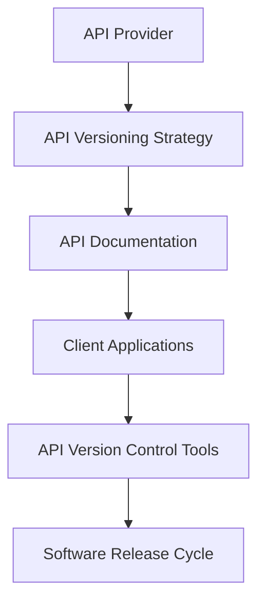

                 

关键词：API、版本控制、微服务、软件维护、API文档、API兼容性、版本升级、向后兼容性、向前兼容性

> 摘要：本文深入探讨了API版本控制的重要性，分析了其在微服务架构中的关键作用。通过阐述API版本控制的基本概念、实施方法及实际案例，揭示了其在软件维护、API文档编写和确保兼容性方面的深远影响。文章最后展望了API版本控制技术的发展趋势及面临的挑战。

## 1. 背景介绍

随着互联网和移动应用的迅猛发展，API（应用程序编程接口）已成为现代软件系统开发的重要组成部分。API不仅允许不同系统之间进行数据交换，还促进了应用程序的组件化和模块化。然而，随着API的使用和依赖关系的增加，API版本控制成为一个不可忽视的话题。

### 微服务架构的兴起

微服务架构是一种基于独立部署、独立扩展的分布式系统设计方法。在微服务架构中，应用程序被分解为多个小型、独立的、可重用的服务模块。每个服务都暴露一组API供其他服务调用。这种架构方法使得系统能够更加灵活、可扩展，同时提高了开发效率和系统的可维护性。

### API版本控制的重要性

API版本控制是确保系统稳定性和兼容性的关键。随着应用程序的迭代和更新，API可能会发生变更，这可能导致依赖API的其他服务无法正常工作。因此，API版本控制能够帮助开发者和管理者有序地管理和更新API，确保系统在升级过程中的稳定性。

## 2. 核心概念与联系

### API版本控制的基本概念

API版本控制是指在API的生命周期中，对API的变更进行有序管理和追踪的过程。版本号通常采用语义化版本控制（Semantic Versioning）的方式，如`major.minor.patch`格式。

- **major版本**：当API发生不兼容变更时使用，通常意味着API的功能发生了重大变更。
- **minor版本**：当API增加功能或修复非严重问题时使用，通常不影响现有功能的兼容性。
- **patch版本**：当API仅修复bug或进行小幅度优化时使用，通常不会影响现有功能的兼容性。

### API版本控制的架构

以下是API版本控制的架构简图，用于展示不同组件之间的关联：



### API版本控制与微服务架构的关系

在微服务架构中，API版本控制确保了各个微服务之间能够协同工作。通过版本控制，开发者可以独立升级单个服务而不影响其他服务，从而提高了系统的灵活性和稳定性。

## 3. 核心算法原理 & 具体操作步骤

### 3.1 算法原理概述

API版本控制的算法原理基于以下几点：

- **兼容性检测**：确保新版本的API能够向后兼容旧版本的客户端。
- **变更管理**：有序地管理API的变更，确保变更的透明性和可追踪性。
- **自动化部署**：通过自动化工具实现API的版本升级和部署。

### 3.2 算法步骤详解

1. **定义版本控制策略**：确定版本号的命名规则和变更流程。
2. **创建API文档**：编写详细、准确的API文档，包括版本信息。
3. **自动化版本管理**：使用API版本控制工具实现自动化的版本管理和部署。
4. **向后兼容性检测**：确保新版本的API能够与旧版本的客户端兼容。
5. **通知客户端**：在API变更时及时通知客户端，以便其能够进行相应的适配。

### 3.3 算法优缺点

#### 优点

- **提高系统的稳定性**：通过版本控制，确保系统在更新过程中不会出现不兼容的情况。
- **提升开发效率**：允许开发者独立升级各个服务，无需担心影响其他服务。
- **增强用户体验**：通过准确的API文档，帮助开发者快速上手和使用API。

#### 缺点

- **初期成本较高**：需要制定详细的版本控制策略和文档，可能需要投入较多的人力资源。
- **维护复杂性**：随着API的变更增多，版本控制的复杂性也会增加。

### 3.4 算法应用领域

API版本控制广泛应用于以下领域：

- **企业级应用**：企业系统之间的交互通常需要严格的版本控制，以确保系统的稳定性和可靠性。
- **第三方服务集成**：第三方服务提供商需要确保其API的版本控制，以支持不同客户的需求。
- **开源项目**：开源项目通常采用版本控制，以确保贡献者的代码能够与其他代码协同工作。

## 4. 数学模型和公式 & 详细讲解 & 举例说明

### 4.1 数学模型构建

API版本控制中的数学模型可以基于集合论和图论来构建。以下是一个简化的模型：

- **API集合**：表示所有API的集合，用\( A \)表示。
- **版本集合**：表示所有版本的集合，用\( V \)表示。
- **兼容性关系**：表示版本之间的兼容性关系，用\( R \)表示。

### 4.2 公式推导过程

定义兼容性关系\( R \)为：

\[ R = \{ (v_1, v_2) \mid v_1 \text{ 和 } v_2 \text{ 是兼容的} \} \]

其中，\( v_1 \)和\( v_2 \)是版本集合\( V \)中的元素。

为了推导兼容性关系的性质，我们可以考虑以下两个版本：

- \( v_1 = major.minor.patch \)
- \( v_2 = major.minor.patch \)

如果\( v_1 \)和\( v_2 \)兼容，则它们在语义化版本控制下应满足以下条件：

\[ v_1 \leq v_2 \]

其中，\( \leq \)表示版本号之间的比较关系。

### 4.3 案例分析与讲解

假设有一个API服务，其版本控制策略为：

- major版本：当API功能发生重大变更时。
- minor版本：当API增加功能或修复非严重问题时。
- patch版本：当API仅修复bug或进行小幅度优化时。

现有版本为`1.2.3`，现在要发布新版本`1.3.0`。

根据语义化版本控制，`1.2.3`和`1.3.0`是不兼容的，因为`major`版本发生了变化。因此，在发布`1.3.0`版本时，需要通知所有依赖该API的服务进行相应的适配。

## 5. 项目实践：代码实例和详细解释说明

### 5.1 开发环境搭建

为了演示API版本控制，我们将使用Spring Boot框架创建一个简单的RESTful API。以下是搭建开发环境所需的步骤：

1. 安装Java开发工具包（JDK）。
2. 安装Eclipse IDE或IntelliJ IDEA等Java集成开发环境（IDE）。
3. 创建一个新的Spring Boot项目，并添加必要的依赖。

### 5.2 源代码详细实现

以下是实现API版本控制的一个简单示例。我们将创建两个版本不同的API接口，并使用Spring的`@RestController`注解来定义它们。

```java
@RestController
@RequestMapping("/api/v1")
public class Version1Api {

    @GetMapping("/users")
    public ResponseEntity<List<User>> getUsers() {
        // 返回用户列表
        return ResponseEntity.ok(users);
    }
}

@RestController
@RequestMapping("/api/v2")
public class Version2Api {

    @GetMapping("/users")
    public ResponseEntity<List<User>> getUsers() {
        // 返回用户列表
        return ResponseEntity.ok(usersV2);
    }
}
```

在这个示例中，我们创建了一个`Version1Api`类和一个`Version2Api`类，分别对应API的不同版本。通过在URL路径中添加版本号，我们能够轻松地管理不同版本的API。

### 5.3 代码解读与分析

1. **版本定义**：通过在类上使用`@RestController`注解并指定不同的URL路径，我们定义了两个版本的API。
2. **版本兼容性**：在API实现中，我们需要确保新版本的API能够向后兼容旧版本的客户端。在本例中，我们只需确保`Version1Api`和`Version2Api`返回相同格式的用户数据即可。
3. **API文档**：在发布API时，需要为每个版本编写详细的文档，包括API的URL、请求和响应格式等信息。

### 5.4 运行结果展示

在运行Spring Boot应用后，我们可以通过访问以下URL来测试不同版本的API：

- `http://localhost:8080/api/v1/users`
- `http://localhost:8080/api/v2/users`

这将返回对应版本的API数据，并展示了如何通过版本控制来管理API的变更。

## 6. 实际应用场景

### 6.1 企业内部应用

在企业内部，API版本控制能够帮助各个部门之间的系统集成。例如，营销部门开发的一个API可能会被产品部门、运营部门和客服部门等多个部门使用。通过版本控制，各部门可以在不影响彼此工作的情况下独立升级API。

### 6.2 第三方服务集成

第三方服务提供商通常需要为不同的客户定制API，以满足其特定的需求。API版本控制使得提供商能够为不同客户提供不同版本的API，从而确保每个客户的体验都是最佳的。

### 6.3 开源项目

在开源项目中，API版本控制能够帮助维护者管理API的变更，确保社区成员能够根据不同的需求选择合适的API版本。

## 6.4 未来应用展望

随着云计算和人工智能技术的不断发展，API版本控制将变得更加自动化和智能化。未来的发展方向可能包括：

- **自动化兼容性检测**：通过机器学习技术实现自动化兼容性检测，提高版本控制的准确性。
- **智能变更管理**：利用智能算法对API变更进行优先级排序，帮助开发者更高效地管理变更。
- **多语言支持**：提供更多的编程语言支持，使得API版本控制更加普及。

## 7. 工具和资源推荐

### 7.1 学习资源推荐

- 《RESTful API 设计最佳实践》
- 《微服务设计》

### 7.2 开发工具推荐

- Spring Boot
- Swagger

### 7.3 相关论文推荐

- "API Design and Versioning for Microservices"
- "Design and Implementation of a Version Control System for REST APIs"

## 8. 总结：未来发展趋势与挑战

### 8.1 研究成果总结

API版本控制的研究成果主要集中在提高兼容性、自动化变更管理和优化开发体验等方面。随着技术的发展，API版本控制的方法和工具也在不断进化。

### 8.2 未来发展趋势

未来，API版本控制将朝着更加智能化、自动化的方向发展。机器学习和人工智能技术的应用将提高版本控制的准确性和效率。

### 8.3 面临的挑战

随着API的复杂度增加，版本控制的挑战也在加大。如何在保证兼容性的同时，提高开发效率和用户体验，将是未来需要解决的重要问题。

### 8.4 研究展望

随着云计算和物联网的发展，API版本控制的应用领域将更加广泛。未来的研究可以集中在如何更有效地管理大量API的版本，以及如何通过智能算法优化版本控制流程。

## 9. 附录：常见问题与解答

### 9.1 什么是API版本控制？

API版本控制是指对API的变更进行有序管理和追踪的过程，以确保系统的稳定性和兼容性。

### 9.2 API版本控制有哪些好处？

API版本控制的好处包括提高系统的稳定性、提升开发效率、增强用户体验等。

### 9.3 如何实现API版本控制？

实现API版本控制通常涉及定义版本控制策略、编写API文档、使用API版本控制工具等步骤。

---

作者：禅与计算机程序设计艺术 / Zen and the Art of Computer Programming
----------------------------------------------------------------

这篇文章深入探讨了API版本控制的重要性，分析了其在微服务架构中的关键作用。通过阐述API版本控制的基本概念、实施方法及实际案例，揭示了其在软件维护、API文档编写和确保兼容性方面的深远影响。文章最后展望了API版本控制技术的发展趋势及面临的挑战。希望这篇文章能够帮助开发者更好地理解和应用API版本控制技术。

