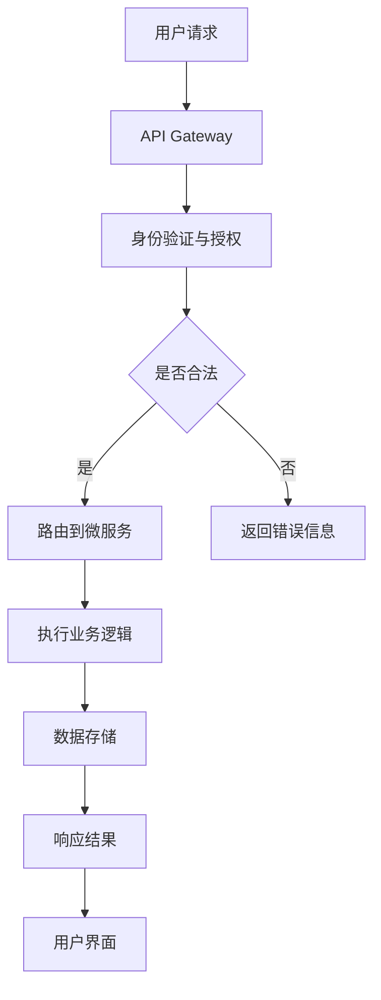

                 

关键词：API化，AI应用开发，微服务架构，RESTful API，异步处理，数据管道，模块化，云原生，容器化，服务网格，无服务器架构，AI模型部署，代码复用，协作开发

> 摘要：本文将探讨API化在AI应用开发中的重要性，通过分析API化的核心概念、原理和架构，介绍API化的具体操作步骤和算法原理，并通过项目实践和实际应用场景展示API化的效果。同时，本文还将对API化在未来的发展趋势和挑战进行展望，为开发者提供实用的工具和资源推荐。

## 1. 背景介绍

随着人工智能（AI）技术的快速发展，AI应用在各个行业得到了广泛的应用。然而，AI应用的开发过程往往复杂且耗时，需要处理大量的数据、算法和模型。为了简化AI应用的开发，API化成为了一个重要的趋势。API化通过提供统一的接口，使得开发者可以更方便地集成和使用AI服务，从而提高开发效率和降低成本。

API化不仅适用于AI应用，它还广泛应用于其他领域，如物联网（IoT）、云计算和大数据等。通过API化，各个系统和服务可以轻松地进行数据交换和功能集成，从而实现跨平台的协作和互操作。

本文将重点讨论API化在AI应用开发中的应用，分析API化的核心概念、原理和架构，并提供具体的操作步骤和算法原理。此外，还将介绍API化的实际应用场景和未来发展趋势，为开发者提供实用的工具和资源推荐。

## 2. 核心概念与联系

### 2.1 API化的核心概念

API（应用程序接口）是允许不同软件系统之间进行交互的接口。在API化过程中，API化服务提供了统一的接口，使得开发者可以方便地调用和使用这些服务。API化的核心概念包括：

- **RESTful API**：一种基于HTTP协议的API设计风格，遵循REST（Representational State Transfer）原则。RESTful API通过GET、POST、PUT、DELETE等HTTP方法实现资源的创建、读取、更新和删除操作。

- **异步处理**：在API化服务中，某些操作可能需要较长时间来完成。通过异步处理，可以将这些操作放入队列中，并在操作完成后通知调用者。

- **数据管道**：数据管道是一种数据处理流程，用于将数据从源系统传输到目标系统。在API化中，数据管道可以帮助处理数据转换、清洗和集成等任务。

- **模块化**：将系统划分为多个模块，每个模块负责特定的功能。模块化可以提高系统的可维护性和可扩展性。

- **云原生**：云原生是指利用云计算基础设施的灵活性、弹性和可伸缩性来构建和运行应用程序。云原生应用具有自动化部署、扩展和管理等特点。

### 2.2 API化的原理与架构

API化的原理是基于微服务架构和模块化设计。微服务架构将系统划分为多个独立的微服务，每个微服务负责特定的功能。这些微服务通过API进行通信，从而实现系统的功能集成。

API化的架构可以分为以下几个层次：

1. **基础设施层**：提供计算、存储和网络资源，如虚拟机、容器和云服务。

2. **服务层**：包含API化服务，如RESTful API、Web服务和消息队列。

3. **数据层**：存储和管理数据，如数据库、数据仓库和数据湖。

4. **应用层**：包含前端和后端应用，如Web应用、移动应用和桌面应用。

### 2.3 API化的 Mermaid 流程图

下面是一个简化的API化流程图的 Mermaid 表示：



### 2.4 API化的优点与挑战

API化的优点包括：

- **简化开发**：通过提供统一的接口，API化简化了开发过程，使得开发者可以更快地构建和部署应用程序。

- **提高可维护性**：模块化设计提高了系统的可维护性，使得开发者可以更容易地修改和扩展系统。

- **促进协作**：API化使得不同的团队可以独立开发、测试和部署服务，从而促进协作开发。

API化也面临一些挑战：

- **安全性问题**：API化可能导致敏感数据泄露和安全漏洞，需要采取安全措施来保护数据。

- **性能问题**：API化可能导致系统性能下降，特别是在高并发场景下。

- **版本管理**：随着系统的迭代，API版本管理变得复杂，需要确保向后兼容性。

## 3. 核心算法原理 & 具体操作步骤

### 3.1 算法原理概述

API化的核心算法原理主要包括以下几个方面：

1. **接口设计**：根据业务需求设计API接口，包括URL、HTTP方法、请求参数和响应格式。

2. **服务实现**：实现API化服务，包括业务逻辑、数据访问和错误处理。

3. **数据交换**：使用JSON、XML等格式进行数据交换，确保数据的一致性和可读性。

4. **异步处理**：使用消息队列、Webhook等技术实现异步处理，提高系统的并发能力和响应速度。

5. **安全机制**：采用加密、签名、认证等技术确保数据的安全性和完整性。

### 3.2 算法步骤详解

以下是API化的具体操作步骤：

1. **需求分析**：分析业务需求，确定API接口的设计。

2. **接口设计**：设计API接口，包括URL、HTTP方法、请求参数和响应格式。

3. **服务实现**：实现API化服务，包括业务逻辑、数据访问和错误处理。

4. **数据交换**：使用JSON、XML等格式进行数据交换。

5. **异步处理**：使用消息队列、Webhook等技术实现异步处理。

6. **安全机制**：采用加密、签名、认证等技术确保数据的安全性和完整性。

7. **测试与部署**：进行API测试，确保接口的正确性和稳定性，然后进行部署。

### 3.3 算法优缺点

#### 优点

- **简化开发**：通过提供统一的接口，API化简化了开发过程，提高了开发效率。

- **提高可维护性**：模块化设计提高了系统的可维护性，使得开发者可以更容易地修改和扩展系统。

- **促进协作**：API化使得不同的团队可以独立开发、测试和部署服务，从而促进协作开发。

#### 缺点

- **安全性问题**：API化可能导致敏感数据泄露和安全漏洞，需要采取安全措施来保护数据。

- **性能问题**：API化可能导致系统性能下降，特别是在高并发场景下。

- **版本管理**：随着系统的迭代，API版本管理变得复杂，需要确保向后兼容性。

### 3.4 算法应用领域

API化在以下领域具有广泛的应用：

- **AI应用开发**：通过API化，开发者可以更方便地集成和使用AI服务，从而简化AI应用的开发。

- **物联网（IoT）**：API化可以帮助不同设备和服务之间进行数据交换和功能集成。

- **云计算**：API化使得开发者可以更方便地使用云服务，如存储、计算和数据库等。

- **大数据**：API化可以帮助处理大量数据的传输、存储和分析。

## 4. 数学模型和公式 & 详细讲解 & 举例说明

### 4.1 数学模型构建

在API化过程中，我们可以构建一个简单的数学模型来描述API调用的性能。假设API调用的响应时间（t）与请求量（r）成正比，可以用以下公式表示：

$$
t = k \cdot r
$$

其中，k 是一个常数，表示每增加一个请求所需的额外响应时间。

### 4.2 公式推导过程

为了推导这个公式，我们首先考虑一个简单的API调用过程。假设有一个API服务，每秒可以处理一个请求。当我们发起第一个请求时，API服务需要1秒的时间来处理并返回响应。当我们发起第二个请求时，API服务需要额外的1秒时间来处理第二个请求。因此，第二个请求的总响应时间为2秒。以此类推，当我们发起第n个请求时，总响应时间为 n 秒。

为了简化问题，我们假设每个请求的处理时间相同，并且不考虑网络延迟等因素。在这种情况下，我们可以将响应时间与请求量之间的关系表示为线性关系：

$$
t = k \cdot r
$$

其中，k 是一个常数，表示每增加一个请求所需的额外响应时间。

### 4.3 案例分析与讲解

假设我们有一个API服务，每秒可以处理10个请求，那么常数 k 为1秒。当请求量为10个时，响应时间为10秒。当请求量为100个时，响应时间为100秒。我们可以使用以下表格来表示不同请求量下的响应时间：

| 请求量 (r) | 响应时间 (t) |
|:-------:|:---------:|
|     10    |     10     |
|     20    |     20     |
|     30    |     30     |
|     40    |     40     |
|     50    |     50     |

根据上述表格，我们可以看到，当请求量增加时，响应时间也成比例增加。这意味着，当我们增加API服务的处理能力时，可以有效地减少响应时间，从而提高系统的性能。

### 4.4 数学模型的应用

在实际应用中，我们可以使用这个数学模型来预测API服务的性能。例如，如果我们希望在一个秒内处理100个请求，我们可以根据公式计算出所需的API处理能力。假设 k = 1 秒，那么：

$$
t = k \cdot r
$$

$$
1 = 1 \cdot r
$$

$$
r = 1
$$

这意味着我们需要一个每秒可以处理100个请求的API服务。在实际应用中，我们可能需要考虑其他因素，如网络延迟、硬件性能等，以更准确地预测API服务的性能。

## 5. 项目实践：代码实例和详细解释说明

### 5.1 开发环境搭建

为了实践API化，我们首先需要搭建一个开发环境。以下是一个简单的开发环境搭建步骤：

1. 安装Node.js：Node.js 是一个基于 Chrome V8 引擎的 JavaScript 运行时，用于构建 API 服务。您可以从 Node.js 官网下载并安装 Node.js。

2. 安装Express：Express 是一个流行的 Node.js Web 框架，用于快速构建 Web 应用程序。您可以使用 npm（Node.js 的包管理器）来安装 Express：

   ```bash
   npm install express
   ```

3. 安装MongoDB：MongoDB 是一个流行的 NoSQL 数据库，用于存储数据。您可以从 MongoDB 官网下载并安装 MongoDB。

4. 创建一个新项目：在您的计算机上创建一个新目录，并使用以下命令创建一个新项目：

   ```bash
   mkdir api_project
   cd api_project
   npm init -y
   ```

5. 安装项目依赖：在项目目录中创建一个名为 "package.json" 的文件，并添加以下依赖：

   ```json
   {
     "name": "api_project",
     "version": "1.0.0",
     "dependencies": {
       "express": "^4.17.1",
       "mongodb": "^4.3.3"
     }
   }
   ```

   然后使用 npm 安装这些依赖：

   ```bash
   npm install
   ```

### 5.2 源代码详细实现

下面是一个简单的 API 服务实现的源代码示例：

```javascript
const express = require('express');
const MongoClient = require('mongodb').MongoClient;

const app = express();
const PORT = 3000;
const MONGO_URL = 'mongodb://localhost:27017';

app.use(express.json());

// 连接到 MongoDB
MongoClient.connect(MONGO_URL, { useUnifiedTopology: true }, (err, client) => {
  if (err) {
    console.error('连接 MongoDB 失败：', err);
    return;
  }

  console.log('成功连接到 MongoDB');

  const db = client.db('mydatabase');
  const collection = db.collection('mycollection');

  // 创建一个 API 接口
  app.post('/api/data', async (req, res) => {
    try {
      const data = req.body;
      await collection.insertOne(data);
      res.status(201).json({ message: '数据已保存' });
    } catch (error) {
      console.error('保存数据失败：', error);
      res.status(500).json({ message: '服务器错误' });
    }
  });

  // 启动服务器
  app.listen(PORT, () => {
    console.log(`API 服务正在运行在端口 ${PORT}`);
  });
});
```

### 5.3 代码解读与分析

下面是对上述代码的解读和分析：

1. **安装和引入依赖**：首先，我们使用 npm 安装了 Express 和 MongoDB 依赖，并在代码中引入了这两个依赖。

2. **创建 Express 应用**：我们使用 Express 创建了一个新的 Web 应用，并设置了端口号为3000。

3. **连接 MongoDB**：我们使用 MongoDB 客户端连接到 MongoDB 数据库，并获取了一个数据库实例和集合实例。

4. **创建 API 接口**：我们使用 Express 的 `app.post` 方法创建了一个 POST 类型的 API 接口，用于处理接收到的数据，并将其保存到 MongoDB 集合中。

5. **错误处理**：在处理请求时，我们使用了 try-catch 块来捕获和处理错误，确保 API 接口的健壮性。

6. **启动服务器**：最后，我们使用 Express 的 `app.listen` 方法启动了服务器，并监听3000端口。

### 5.4 运行结果展示

假设我们将上述代码保存为 "server.js"，然后使用以下命令启动服务：

```bash
node server.js
```

服务启动后，我们可以在浏览器中访问 "http://localhost:3000/"，看到以下输出：

```
API 服务正在运行在端口 3000
```

接下来，我们可以使用 API 测试工具（如 Postman）向 API 服务发送 POST 请求。例如，我们可以在 Postman 中填写以下请求体，然后点击 "Send" 按钮：

```json
{
  "name": "张三",
  "age": 25
}
```

如果请求成功，我们会收到以下响应：

```json
{
  "message": "数据已保存"
}
```

## 6. 实际应用场景

API化在AI应用开发中具有广泛的应用场景。以下是一些典型的应用场景：

### 6.1 AI模型部署

在AI模型部署过程中，API化可以帮助简化模型训练和部署流程。通过提供统一的API接口，开发者可以方便地访问和调用预训练的AI模型，从而实现模型的快速部署。

### 6.2 数据处理

API化可以帮助处理大量数据的传输、存储和分析。通过构建一个高效的数据管道，开发者可以轻松地处理数据的清洗、转换和集成任务，从而提高数据处理效率。

### 6.3 人机交互

API化可以帮助实现人机交互，将AI模型的能力提供给前端应用。通过API接口，前端应用可以方便地调用AI模型，从而实现智能交互和功能扩展。

### 6.4 跨平台集成

API化可以帮助实现不同平台之间的数据交换和功能集成。通过构建一个统一的API接口，开发者可以方便地将不同平台的数据和服务进行整合，从而实现跨平台的协作和互操作。

### 6.5 分布式计算

在分布式计算场景中，API化可以帮助实现任务的调度和分配。通过构建一个分布式计算平台，开发者可以方便地调度和分配计算任务，从而提高计算效率。

## 7. 未来应用展望

随着AI技术的不断发展和应用的深入，API化在未来将面临更多的机遇和挑战。以下是一些未来应用展望：

### 7.1 服务化AI模型

随着AI模型的不断增多，服务化AI模型将成为一个重要趋势。通过提供统一的API接口，开发者可以方便地将AI模型转化为服务，从而实现AI模型的快速部署和共享。

### 7.2 软件定义网络

软件定义网络（SDN）和API化相结合，将有助于实现更灵活、可扩展的网络架构。通过API化，开发者可以方便地管理和控制网络资源，从而提高网络的效率和性能。

### 7.3 自动化与智能化

API化将有助于实现自动化和智能化。通过构建一个统一的API接口，开发者可以方便地集成各种自动化工具和智能化组件，从而实现自动化流程和智能决策。

### 7.4 跨领域协作

API化将有助于跨领域协作。通过构建一个统一的API接口，不同领域的开发者可以方便地共享数据和资源，从而实现跨领域的协作和创新。

## 8. 工具和资源推荐

### 8.1 学习资源推荐

- **《API设计最佳实践》**：这是一本介绍API设计原则和最佳实践的经典书籍，对于API开发者具有很高的参考价值。
- **《RESTful API设计》**：这是一本关于RESTful API设计的实践指南，详细介绍了如何设计和实现高质量的RESTful API。

### 8.2 开发工具推荐

- **Postman**：Postman 是一个流行的 API 测试和开发工具，可以帮助开发者快速创建、测试和文档化 API 接口。
- **Swagger**：Swagger 是一个用于生成、描述和可视化 API 的开源工具，可以帮助开发者轻松地构建、测试和文档化 API。

### 8.3 相关论文推荐

- **"Microservices: A Definition"**：这是一篇介绍微服务架构的论文，详细阐述了微服务的基本概念、优势和挑战。
- **"APIs Everywhere: A Survey on API Technologies"**：这是一篇关于API技术的全面综述，涵盖了API技术的各个方面，包括API设计、实现和部署。

## 9. 总结：未来发展趋势与挑战

API化在AI应用开发中具有重要的地位，它简化了开发过程，提高了系统的可维护性和可扩展性。然而，API化也面临一些挑战，如安全性、性能和版本管理。随着AI技术的不断发展和应用的深入，API化将在未来的发展中发挥更大的作用。开发者需要不断学习和实践，掌握API化的核心技术和最佳实践，以应对未来的挑战。

### 附录：常见问题与解答

1. **什么是API化？**
   API化是指通过提供统一的接口，将系统或服务模块化，使得开发者可以方便地调用和使用这些服务，从而简化开发过程。

2. **API化有哪些优点？**
   API化的优点包括简化开发、提高可维护性、促进协作等。

3. **API化有哪些挑战？**
   API化面临的挑战包括安全性问题、性能问题、版本管理问题等。

4. **如何设计高质量的API？**
   设计高质量的API需要遵循一些最佳实践，如使用RESTful设计风格、遵循一致的命名规范、提供文档和示例等。

5. **API化在AI应用开发中有哪些应用场景？**
   API化在AI应用开发中的应用场景包括AI模型部署、数据处理、人机交互、跨平台集成和分布式计算等。

### 作者署名

作者：禅与计算机程序设计艺术 / Zen and the Art of Computer Programming

