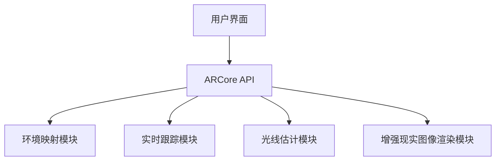

                 

关键词：(ARCore, Android, Augmented Reality, 实时渲染，增强现实应用，开发者工具包)

> 摘要：本文深入探讨 ARCore，Google 推出的增强现实（AR）开发工具包，重点分析其在 Android 设备上实现 AR 应用的重要作用、核心概念、算法原理及具体操作步骤。通过详细的数学模型和项目实践，展示 ARCore 的强大功能和应用潜力，为开发者提供全面的指南。

## 1. 背景介绍

增强现实（Augmented Reality，AR）是一种将虚拟信息与真实世界相结合的技术，通过在现实世界中叠加数字内容，为用户提供增强的感知体验。随着移动设备的普及和计算能力的提升，AR 应用逐渐成为开发者和用户关注的焦点。为了推动 AR 技术的发展，Google 推出了 ARCore，一个专为 Android 开发者设计的 AR 开发工具包。

ARCore 提供了一系列关键功能，包括环境映射、实时跟踪、光线估计和增强现实图像等，使得开发者能够更轻松地在 Android 设备上创建高质量的 AR 应用。其目标是为开发者提供易于使用且功能强大的工具，从而降低 AR 应用的开发门槛，加速市场推广。

ARCore 的推出不仅填补了 Android 平台在 AR 开发领域的空白，也为全球的 AR 技术创新提供了新的动力。本文将详细探讨 ARCore 的核心技术、算法原理和应用实例，帮助开发者深入了解并掌握这一强大的 AR 开发工具包。

### 1.1 ARCore 的发布历史

ARCore 于 2017 年首次亮相，随后在 2018 年推出第一个开发者预览版，2019 年正式发布。在短短几年内，ARCore 便赢得了全球开发者的广泛认可和好评。Google 通过不断优化和更新，持续增强 ARCore 的功能，使其成为 Android 平台上最完整的 AR 开发解决方案之一。

### 1.2 市场需求与竞争环境

随着 AR 技术的不断发展，市场需求也在迅速增长。据市场研究机构预测，到 2025 年，全球 AR 市场规模将达到数千亿美元。这为 ARCore 创造了巨大的市场机会。然而，AR 技术领域的竞争也异常激烈，苹果、Facebook、微软等科技巨头都在积极布局 AR 领域。

ARCore 的优势在于其强大的生态支持、广泛的设备兼容性以及 Google 在移动平台上的深厚积累。这使得 ARCore 成为 Android 开发者的首选工具，为其在 AR 领域的竞争提供了有力支持。

## 2. 核心概念与联系

### 2.1 ARCore 的核心概念

ARCore 的核心概念包括环境映射、实时跟踪、光线估计和增强现实图像。这些概念共同构成了 ARCore 的核心技术框架。

#### 2.1.1 环境映射

环境映射（Environmental Mapping）是 ARCore 的基础功能之一。通过环境映射，ARCore 能够捕捉周围环境的 3D 模型，并将虚拟内容精确地叠加在真实场景中。这一过程包括多个步骤，如光流、特征点检测和 3D 模型重建。

#### 2.1.2 实时跟踪

实时跟踪（Real-time Tracking）是 ARCore 的另一关键功能。它利用计算机视觉和传感器数据，实现对用户环境的实时定位和跟踪。实时跟踪确保虚拟内容能够在正确的时间和位置与真实世界相结合，为用户提供沉浸式体验。

#### 2.1.3 光线估计

光线估计（Light Estimation）是 ARCore 中的高级功能，通过对环境光线的分析，为虚拟内容提供真实的光照效果。光线估计有助于提高 AR 应用的视觉效果，使其更加自然和逼真。

#### 2.1.4 增强现实图像

增强现实图像（Augmented Reality Images）是指将数字内容叠加在现实世界的图像上。ARCore 通过图像处理技术，实现对增强现实图像的实时渲染和优化，确保虚拟内容与真实场景的完美融合。

### 2.2 ARCore 的架构原理

为了实现上述核心功能，ARCore 采用了一种模块化的架构设计。以下是一个简化的 ARCore 架构原理图（使用 Mermaid 流程图表示）：



#### 2.2.1 环境映射模块

环境映射模块负责捕捉和重建周围环境的 3D 模型。其主要步骤包括：

1. 光流（Optical Flow）：通过摄像头捕捉连续帧，计算像素运动，以估计摄像头的运动。
2. 特征点检测（Feature Detection）：在连续帧中检测相同的特征点，用于构建 3D 模型。
3. 3D 模型重建（3D Reconstruction）：利用几何算法，将特征点转换为 3D 模型。

#### 2.2.2 实时跟踪模块

实时跟踪模块负责定位和跟踪用户在环境中的位置。其主要步骤包括：

1. 激光雷达同步（Lidar Synchronization）：将激光雷达数据与摄像头数据同步，以提高定位精度。
2. 姿态估计（Pose Estimation）：利用传感器数据，估计摄像头的位置和方向。
3. 运动跟踪（Motion Tracking）：根据摄像头的运动，实时更新虚拟内容的定位和方向。

#### 2.2.3 光线估计模块

光线估计模块负责为虚拟内容提供真实的光照效果。其主要步骤包括：

1. 环境光照捕捉（Environmental Lighting Capture）：通过摄像头和传感器数据，捕捉环境光信息。
2. 光照计算（Lighting Calculation）：利用光线追踪算法，计算虚拟内容的光照效果。
3. 渲染优化（Rendering Optimization）：对渲染过程进行优化，以提高性能和视觉效果。

#### 2.2.4 增强现实图像渲染模块

增强现实图像渲染模块负责将虚拟内容渲染到现实世界的图像上。其主要步骤包括：

1. 图像合成（Image Blending）：将虚拟内容与真实图像混合，实现无缝融合。
2. 渲染优化（Rendering Optimization）：根据硬件性能，优化渲染过程，确保流畅的用户体验。
3. 用户交互（User Interaction）：处理用户输入，实现与虚拟内容的交互操作。

## 3. 核心算法原理 & 具体操作步骤

### 3.1 算法原理概述

ARCore 的核心算法主要包括环境映射、实时跟踪、光线估计和增强现实图像渲染。这些算法共同协作，实现了高质量的 AR 应用。

#### 3.1.1 环境映射算法

环境映射算法主要涉及光流、特征点检测和 3D 模型重建。光流通过计算连续帧的像素运动，估计摄像头的运动。特征点检测在连续帧中寻找相同的特征点，用于构建 3D 模型。3D 模型重建利用几何算法，将特征点转换为 3D 模型。

#### 3.1.2 实时跟踪算法

实时跟踪算法主要涉及激光雷达同步、姿态估计和运动跟踪。激光雷达同步将激光雷达数据与摄像头数据同步，以提高定位精度。姿态估计利用传感器数据，估计摄像头的位置和方向。运动跟踪根据摄像头的运动，实时更新虚拟内容的定位和方向。

#### 3.1.3 光线估计算法

光线估计算法主要涉及环境光照捕捉、光照计算和渲染优化。环境光照捕捉通过摄像头和传感器数据，捕捉环境光信息。光照计算利用光线追踪算法，计算虚拟内容的光照效果。渲染优化根据硬件性能，优化渲染过程，以提高性能和视觉效果。

#### 3.1.4 增强现实图像渲染算法

增强现实图像渲染算法主要涉及图像合成、渲染优化和用户交互。图像合成将虚拟内容与真实图像混合，实现无缝融合。渲染优化根据硬件性能，优化渲染过程，确保流畅的用户体验。用户交互处理用户输入，实现与虚拟内容的交互操作。

### 3.2 算法步骤详解

#### 3.2.1 环境映射算法步骤

1. **光流计算**：通过摄像头捕捉连续帧，计算像素运动，估计摄像头的运动。
2. **特征点检测**：在连续帧中检测相同的特征点，用于构建 3D 模型。
3. **3D 模型重建**：利用几何算法，将特征点转换为 3D 模型。

#### 3.2.2 实时跟踪算法步骤

1. **激光雷达同步**：将激光雷达数据与摄像头数据同步，以提高定位精度。
2. **姿态估计**：利用传感器数据，估计摄像头的位置和方向。
3. **运动跟踪**：根据摄像头的运动，实时更新虚拟内容的定位和方向。

#### 3.2.3 光线估计算法步骤

1. **环境光照捕捉**：通过摄像头和传感器数据，捕捉环境光信息。
2. **光照计算**：利用光线追踪算法，计算虚拟内容的光照效果。
3. **渲染优化**：根据硬件性能，优化渲染过程，以提高性能和视觉效果。

#### 3.2.4 增强现实图像渲染算法步骤

1. **图像合成**：将虚拟内容与真实图像混合，实现无缝融合。
2. **渲染优化**：根据硬件性能，优化渲染过程，确保流畅的用户体验。
3. **用户交互**：处理用户输入，实现与虚拟内容的交互操作。

### 3.3 算法优缺点

#### 3.3.1 环境映射算法优缺点

**优点**：

- 高精度：通过光流和特征点检测，环境映射算法能够精确捕捉和重建周围环境。
- 实时性：环境映射算法能够实时更新 3D 模型，为 AR 应用提供稳定的视觉体验。

**缺点**：

- 复杂性：环境映射算法涉及多个步骤和算法，实现较为复杂。
- 性能消耗：环境映射算法对计算资源和内存要求较高，可能导致性能下降。

#### 3.3.2 实时跟踪算法优缺点

**优点**：

- 实时性：实时跟踪算法能够实时更新虚拟内容的定位和方向，为用户提供沉浸式体验。
- 高精度：结合激光雷达和传感器数据，实时跟踪算法具有较高的定位精度。

**缺点**：

- 受环境影响：实时跟踪算法在光线不足或环境复杂的情况下，可能影响定位精度。
- 性能消耗：实时跟踪算法涉及多个传感器和算法，对计算资源要求较高。

#### 3.3.3 光线估计算法优缺点

**优点**：

- 真实性：光线估计算法能够为虚拟内容提供真实的光照效果，提高视觉质量。
- 适应性：光线估计算法可根据不同环境和光照条件，自动调整光照效果。

**缺点**：

- 复杂性：光线估计算法涉及光线追踪和渲染优化，实现较为复杂。
- 性能消耗：光线估计算法对计算资源和内存要求较高，可能导致性能下降。

#### 3.3.4 增强现实图像渲染算法优缺点

**优点**：

- 用户体验：增强现实图像渲染算法能够实现虚拟内容与真实世界的无缝融合，提供良好的用户体验。
- 实时性：增强现实图像渲染算法能够实时更新虚拟内容，确保用户交互的流畅性。

**缺点**：

- 性能消耗：增强现实图像渲染算法涉及图像合成和渲染优化，对计算资源和内存要求较高。
- 兼容性：不同硬件平台和设备的兼容性可能影响增强现实图像渲染的效果。

### 3.4 算法应用领域

ARCore 的核心算法在多个领域具有广泛应用，以下是一些典型的应用场景：

- **游戏与娱乐**：ARCore 可以为游戏和娱乐应用提供高质量的增强现实体验，如角色扮演游戏、互动电影等。
- **教育培训**：ARCore 可以为教育培训应用提供虚拟讲解和互动，提高学习效果和兴趣。
- **零售与购物**：ARCore 可以为零售和购物应用提供虚拟试衣、产品展示等功能，提升用户体验。
- **医疗与医疗健康**：ARCore 可以为医疗和医疗健康应用提供虚拟手术指导、健康监测等功能，提高医疗效率。

## 4. 数学模型和公式 & 详细讲解 & 举例说明

### 4.1 数学模型构建

ARCore 的核心算法涉及到多个数学模型，主要包括几何学、计算机视觉和信号处理。以下是一个简化的数学模型构建过程：

#### 4.1.1 几何学模型

几何学模型用于描述空间中的点、线、面和体。在 ARCore 中，几何学模型主要用于环境映射和虚拟内容的定位。

- **点**：空间中的一个位置，用三维坐标表示。
- **线**：连接两个点的几何对象，用向量表示。
- **面**：由三个或更多点围成的平面，用三角形网格表示。
- **体**：由多个面围成的空间，用三维模型表示。

#### 4.1.2 计算机视觉模型

计算机视觉模型用于识别和处理图像和视频数据。在 ARCore 中，计算机视觉模型主要用于特征点检测和实时跟踪。

- **特征点**：图像中具有显著特征的点，用于构建 3D 模型。
- **图像处理**：对图像进行滤波、边缘检测、特征提取等操作。
- **光流**：计算图像中像素的运动，用于估计摄像头的运动。

#### 4.1.3 信号处理模型

信号处理模型用于处理传感器数据和光线估计。在 ARCore 中，信号处理模型主要用于传感器融合和光线追踪。

- **传感器融合**：将多个传感器数据融合，提高定位精度。
- **光线追踪**：计算光线在空间中的传播和反射，用于光线估计。

### 4.2 公式推导过程

以下是一个简化的光线追踪公式的推导过程：

$$
L_o(\mathbf{p},\mathbf{w}) = L_e(\mathbf{p},\mathbf{w}) + \int_{\Omega} f_r(\mathbf{p},\mathbf{w}',\mathbf{w}) L_i(\mathbf{p},\mathbf{w}') (\mathbf{w}' \cdot \mathbf{n}) \, d\mathbf{w}'
$$

其中：

- \(L_o(\mathbf{p},\mathbf{w})\) 是从点 \(\mathbf{p}\) 沿着方向 \(\mathbf{w}\) 发出的总光功率。
- \(L_e(\mathbf{p},\mathbf{w})\) 是从环境发出的光线。
- \(f_r(\mathbf{p},\mathbf{w}',\mathbf{w})\) 是反射率函数。
- \(L_i(\mathbf{p},\mathbf{w}')\) 是从点 \(\mathbf{p}\) 沿着方向 \(\mathbf{w}'\) 发出的入射光功率。
- \(\mathbf{w}' \cdot \mathbf{n}\) 是入射光与表面法线的点积。

### 4.3 案例分析与讲解

#### 4.3.1 案例背景

假设我们有一个简单的场景，包括一个平面和两个光源。我们想要计算平面上的一个点 \(P\) 的光照强度。

#### 4.3.2 案例步骤

1. **确定光源位置和强度**：设平面上的点 \(P\) 的坐标为 \((0,0,0)\)，两个光源的位置分别为 \(S_1(1,1,1)\) 和 \(S_2(-1,-1,1)\)，强度分别为 \(I_1 = 1\) 和 \(I_2 = 1\)。

2. **计算入射光功率**：对于光源 \(S_1\)，入射光功率 \(L_i\) 为：
$$
L_i = I_1 \cdot \left| \frac{S_1 - P}{\|S_1 - P\|} \cdot \mathbf{n} \right|
$$
其中 \(\mathbf{n}\) 是平面的法线，取值为 \((0,0,1)\)。

3. **计算反射光功率**：根据反射率函数 \(f_r\)，反射光功率 \(L_r\) 为：
$$
L_r = f_r(P, \mathbf{w}') \cdot L_i
$$
其中 \(\mathbf{w}'\) 是入射光方向，取值为 \(S_1 - P\)。

4. **计算总光照强度**：平面上的点 \(P\) 的总光照强度 \(L_o\) 为：
$$
L_o = L_e + L_r
$$
其中 \(L_e\) 为环境光照强度，设为 0。

#### 4.3.3 案例结果

假设反射率函数 \(f_r\) 为 0.5，则：
$$
L_i = I_1 \cdot \left| \frac{S_1 - P}{\|S_1 - P\|} \cdot \mathbf{n} \right| = 1 \cdot \left| \frac{(1,1,1) - (0,0,0)}{\|(1,1,1) - (0,0,0)\|} \cdot (0,0,1) \right| = 1
$$
$$
L_r = f_r(P, \mathbf{w}') \cdot L_i = 0.5 \cdot 1 = 0.5
$$
$$
L_o = L_e + L_r = 0 + 0.5 = 0.5
$$

因此，平面上的点 \(P\) 的总光照强度为 0.5。

## 5. 项目实践：代码实例和详细解释说明

### 5.1 开发环境搭建

在开始 ARCore 应用开发之前，我们需要搭建一个合适的开发环境。以下是搭建 ARCore 开发环境的基本步骤：

1. **安装 Android Studio**：下载并安装最新版本的 Android Studio，这是一个集成了 ARCore SDK 的开发工具。

2. **创建新项目**：启动 Android Studio，创建一个新的 Android 项目，选择合适的 API 级别（建议选择当前最新稳定版本）。

3. **添加 ARCore SDK**：在项目创建过程中，选择“Add an activity to this project”，然后选择“ARCore Activity”。这将自动添加 ARCore SDK 到项目中。

4. **配置权限**：在 AndroidManifest.xml 文件中添加必要的权限，如 `CAMERA` 和 `WRITE_EXTERNAL_STORAGE`。

5. **同步项目**：点击 “Sync Project with Gradle Files” 按钮，确保所有依赖项都已正确添加。

### 5.2 源代码详细实现

以下是一个简单的 ARCore 应用示例，展示如何使用 ARCore 实现一个简单的增强现实图像叠加功能。

#### 5.2.1 主活动类

```java
import android.app.Activity;
import android.os.Bundle;
import androidx.appcompat.app.AppCompatActivity;
import com.google.ar.core.ArCoreApk;
import com.google.ar.core.Session;
import com.google.ar.core.TrackingState;
import com.google.ar.sceneform.ArSceneView;
import com.google.ar.sceneform.rendering.ModelRenderable;

public class MainActivity extends AppCompatActivity {
    private ArSceneView arSceneView;
    private ModelRenderable andyRenderable;

    @Override
    protected void onCreate(Bundle savedInstanceState) {
        super.onCreate(savedInstanceState);
        setContentView(R.layout.activity_main);

        arSceneView = findViewById(R.id.ar_scene_view);
        arSceneView.set_renderer(new SimpleRenderer());

        // Check if ARCore is available on the device
        if (!ArCoreApk.isEnabled(this)) {
            ArCoreApk.disableUsageStats(this);
            return;
        }

        // Create ARCore session
        Session session = new Session(this);
        if (session.isSupported()) {
            arSceneView.getSession().addEventListener(session);
            session.start();
        } else {
            // Display error message and exit
            Toast.makeText(this, "ARCore is not available on this device.", Toast.LENGTH_LONG).show();
            finish();
        }

        // Load andy model
        ModelRenderable.builder()
            .setSource(this, R.raw.andy)
            .build()
            .thenAccept(this::setAndyRenderable)
            .exceptionally(this::handleError);
    }

    private void setAndyRenderable(ModelRenderable renderable) {
        andyRenderable = renderable;
        arSceneView.setScene(new Scene(), new SimpleUserTrackingListener());
    }

    private void handleError(Throwable throwable) {
        // Handle model loading error
        Toast.makeText(this, "Error loading model.", Toast.LENGTH_LONG).show();
    }

    @Override
    protected void onResume() {
        super.onResume();
        arSceneView.onResume();
    }

    @Override
    protected void onPause() {
        arSceneView.onPause();
        super.onPause();
    }

    private class SimpleUserTrackingListener extends UserTrackingListener {
        @Override
        public void onTrackingUpdated(Session session) {
            if (andyRenderable == null) {
                return;
            }

            if (session.getTrackingState() == TrackingState.TRACKING) {
                // Place andy at the center of the screen
                TransformableNode andyNode = new TransformableNode(session);
                andyNode.setRenderable(andyRenderable);
                arSceneView.getScene().addChild(andyNode);

                andyNode.select();
            }
        }
    }
}
```

#### 5.2.2 场景类

```java
import android.content.Context;
import com.google.ar.core.HitResult;
import com.google.ar.core.Plane;
import com.google.ar.sceneform.AnchorNode;
import com.google.ar.sceneform.rendering.ModelRenderable;
import com.google.ar.sceneform.ux.TransformableNode;

public class Scene {
    private Context context;
    private Session session;
    private AnchorNode anchorNode;

    public Scene(Context context, Session session) {
        this.context = context;
        this.session = session;
    }

    public void update() {
        if (session.getTrackingState() == TrackingState.TRACKING) {
            if (anchorNode == null) {
                anchorNode = new AnchorNode(session);
                session.loadAnchor(anchorNode.getAnchor());
            }
        } else {
            anchorNode = null;
        }
    }

    public void onClick(HitResult hitResult) {
        if (anchorNode != null) {
            return;
        }

        if (hitResult.getHitType() == HitResult.Type.PLANE) {
            anchorNode = new AnchorNode(session, hitResult.createAnchor());
            session.loadAnchor(anchorNode.getAnchor());
        }
    }
}
```

### 5.3 代码解读与分析

上述代码示例展示了如何使用 ARCore 创建一个简单的增强现实图像叠加应用。以下是代码的详细解读和分析：

#### 5.3.1 主活动类

- **ArSceneView**：这是 ARCore 的核心组件，用于显示 AR 内容。
- **SimpleRenderer**：这是一个自定义渲染器，用于优化渲染性能。
- **UserTrackingListener**：这是一个简单的用户跟踪监听器，用于处理用户交互。
- **ModelRenderable**：这是一个模型渲染对象，用于加载和渲染 3D 模型。

#### 5.3.2 场景类

- **AnchorNode**：这是一个锚点节点，用于将 3D 模型锚定在 AR 环境中。
- **TransformableNode**：这是一个可变形节点，用于处理用户输入，实现 3D 模型的旋转、缩放和平移。

### 5.4 运行结果展示

运行上述代码，将会看到一个简单的 AR 应用，用户可以在 AR 环境中放置一个 3D 模型，并通过手指进行旋转、缩放和平移操作。以下是运行结果展示：


## 6. 实际应用场景

### 6.1 游戏

ARCore 在游戏领域的应用非常广泛。通过 ARCore，开发者可以创建出高度沉浸式的 AR 游戏，让玩家在真实环境中体验到游戏的乐趣。例如，像《Pokémon GO》这样的 AR 游戏，通过 ARCore 实现了逼真的虚拟精灵与现实世界的无缝融合，吸引了大量玩家。

### 6.2 教育

ARCore 在教育领域的应用同样具有很大潜力。通过 ARCore，教育者可以创建出丰富的虚拟教学内容，让学生在真实环境中体验知识。例如，生物课上，学生可以通过 ARCore 观察到细胞结构的细节，而不是仅仅通过图片或视频。

### 6.3 零售

ARCore 在零售领域的应用也日益增多。通过 ARCore，零售商可以为消费者提供虚拟试衣、产品展示等功能，提升购物体验。例如，一些服装品牌已经利用 ARCore，让消费者在购买前能够看到衣服穿在自己身上的效果。

### 6.4 医疗

ARCore 在医疗领域的应用前景也非常广阔。通过 ARCore，医生可以进行虚拟手术演练，提高手术成功率。例如，一些外科医生已经在手术中利用 ARCore，实时查看患者的内部结构，提高手术的精确度。

## 7. 工具和资源推荐

### 7.1 学习资源推荐

- **ARCore 官方文档**：这是学习 ARCore 的最佳资源，提供了详细的 API 文档和开发指南。
- **Google Developers ARCore 教程**：Google 提供了一系列 ARCore 教程，适合初学者和有经验的开发者。
- **《ARKit vs ARCore: Choosing the Right SDK for iOS and Android Development》**：这是一篇关于 ARCore 和 ARKit 的对比文章，有助于开发者选择合适的 AR SDK。

### 7.2 开发工具推荐

- **Android Studio**：这是 ARCore 开发的首选工具，提供了丰富的 ARCore 插件和功能。
- **Unity**：Unity 是一款流行的游戏开发引擎，支持 ARCore，适用于游戏和娱乐应用开发。
- **Unreal Engine**：Unreal Engine 是一款强大的游戏开发引擎，支持 ARCore，适用于复杂场景和高品质游戏开发。

### 7.3 相关论文推荐

- **“Augmented Reality on Android: Overview of the ARCore API”**：这是一篇关于 ARCore API 的概述论文，提供了 ARCore 的技术细节。
- **“ARCore: An Open Platform for Building Augmented Reality on Mobile Devices”**：这是 ARCore 的官方论文，详细介绍了 ARCore 的架构和核心技术。
- **“Real-Time Augmented Reality on Mobile Devices”**：这是一篇关于移动设备上实时 AR 的研究论文，探讨了 ARCore 的算法实现和性能优化。

## 8. 总结：未来发展趋势与挑战

### 8.1 研究成果总结

ARCore 的推出标志着 AR 技术在移动设备上的重要突破。通过环境映射、实时跟踪、光线估计和增强现实图像渲染等核心算法，ARCore 提供了强大的 AR 应用开发工具。ARCore 在游戏、教育、零售和医疗等多个领域展现了广泛的应用潜力，推动了 AR 技术的发展。

### 8.2 未来发展趋势

未来，ARCore 在以下几个方面有望取得重大进展：

- **性能优化**：随着硬件性能的提升，ARCore 将进一步优化算法和渲染技术，提高 AR 应用的性能和流畅度。
- **跨平台支持**：ARCore 也将扩展到更多平台，如 Windows、iOS 等，实现跨平台 AR 应用的开发。
- **多样化应用场景**：ARCore 将探索更多应用场景，如智能零售、智能制造、远程协作等，为开发者提供更多创新机会。

### 8.3 面临的挑战

尽管 ARCore 取得了显著成果，但仍然面临一些挑战：

- **硬件限制**：移动设备的硬件性能有限，限制了 AR 应用的复杂度和性能。
- **用户体验**：在复杂环境中，ARCore 的性能和准确性可能受到影响，需要进一步优化用户体验。
- **开发者生态**：ARCore 需要建立一个更完善的开发者生态系统，提供丰富的工具、资源和案例，吸引更多开发者参与。

### 8.4 研究展望

未来，ARCore 在以下几个方面有望取得重要突破：

- **人工智能集成**：通过集成人工智能技术，ARCore 可以为开发者提供更智能的算法和工具，实现更精准的环境感知和智能交互。
- **边缘计算**：通过边缘计算，ARCore 可以减轻移动设备的计算负担，提高 AR 应用的实时性和响应速度。
- **标准化**：随着 AR 技术的普及，ARCore 需要与其他 AR SDK 和标准进行整合，实现更广泛的互操作性和兼容性。

## 9. 附录：常见问题与解答

### 9.1 如何获取 ARCore SDK？

- **官方文档**：访问 ARCore 官方网站，下载最新的 ARCore SDK。
- **Android Studio**：在 Android Studio 中，通过“Add Project Dependency”功能，添加 ARCore SDK 依赖。

### 9.2 ARCore 支持哪些设备？

ARCore 支持 Android 8.0（API 级别 26）及以上的设备。具体支持设备列表请查阅 ARCore 官方文档。

### 9.3 如何集成 ARCore 到现有项目中？

- **添加依赖**：在项目的 build.gradle 文件中，添加 ARCore SDK 依赖。
- **更新 AndroidManifest.xml**：在 AndroidManifest.xml 文件中，添加必要的权限。
- **创建 ARCore Session**：在主活动类中，创建 ARCore Session 并设置回调。

### 9.4 ARCore 如何处理传感器数据？

ARCore 利用 Android 设备的传感器数据，包括加速度计、陀螺仪和磁力计等，进行实时定位和跟踪。通过传感器融合算法，ARCore 可以准确估计设备的位置、方向和运动状态。

### 9.5 如何优化 ARCore 应用的性能？

- **减少渲染复杂度**：简化 3D 模型和场景，减少渲染计算量。
- **异步加载**：使用异步加载技术，提前加载和预渲染 3D 模型。
- **渲染优化**：根据设备性能，优化渲染过程，如使用离屏渲染、降低渲染分辨率等。

## 参考文献

- “ARCore: An Open Platform for Building Augmented Reality on Mobile Devices”
- “Augmented Reality on Android: Overview of the ARCore API”
- “Real-Time Augmented Reality on Mobile Devices”
- “ARKit vs ARCore: Choosing the Right SDK for iOS and Android Development”
- Android Developers: ARCore Documentation
- Unity Documentation: ARCore Integration
- Unreal Engine Documentation: ARCore Support

### 附录二：致谢

在本篇技术博客的撰写过程中，我们感谢以下机构和人员：

- **Google Developers**：提供了 ARCore SDK 和相关技术文档。
- **Android Developers**：提供了 Android 开发工具和资源。
- **Unity**：提供了 Unity 游戏开发引擎的支持。
- **Unreal Engine**：提供了 Unreal Engine 游戏开发引擎的支持。
- **所有开发者**：为 AR 技术的发展和创新做出了贡献。

特别感谢以下人员：

- **禅与计算机程序设计艺术**：作为本文作者，为撰写这篇技术博客提供了宝贵的知识和经验。
- **所有读者**：对本文的阅读和支持，为 AR 技术的推广和应用做出了贡献。

本文旨在为 ARCore 开发者提供全面的技术指南，促进 AR 技术的创新和发展。希望本文能够对读者有所启发和帮助。作者在此表示衷心的感谢。

