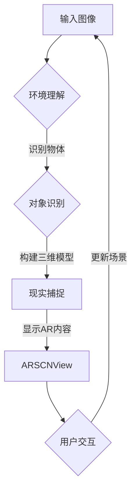

                 

 关键词：ARKit、增强现实、iOS、AR框架、AR体验、移动设备AR

> 摘要：本文将对苹果公司的ARKit框架进行深入分析，探讨其优势以及在iOS设备上创建逼真AR体验的能力。通过对ARKit的核心概念、算法原理、数学模型、项目实践等方面的详细介绍，为读者提供关于如何在移动设备上打造高质量AR应用的实用指导。

## 1. 背景介绍

增强现实（AR）技术近年来得到了广泛关注和快速发展。随着智能手机和处理能力的提升，AR技术已经从实验室走向了大众市场。苹果公司在2017年推出了ARKit，这是一款专门为iOS平台设计的增强现实开发框架。ARKit的出现极大地降低了开发者创建AR应用的技术门槛，使得开发者可以轻松地在iOS设备上实现高质量的AR体验。

### 1.1 ARKit的发展历程

自从ARKit问世以来，苹果公司不断地对其进行更新和改进。以下是ARKit的一些重要版本更新：

- **ARKit 1.0**：初始版本，支持基本的环境理解和对象检测。
- **ARKit 2.0**：增加了多视图支持、更准确的物体识别、面部识别等新功能。
- **ARKit 3.0**：引入了现实捕捉和场景构建功能，提高了AR体验的逼真度。
- **ARKit 4.0**：增加了对iPhone和iPad Pro的LiDAR扫描仪的支持，进一步提升了AR的精度和效果。

### 1.2 ARKit的优势

ARKit具有以下优势：

- **高性能**：利用iOS设备的高性能硬件和软件，ARKit能够提供流畅的AR体验。
- **易用性**：ARKit提供了丰富的API和工具，使得开发者可以快速上手。
- **丰富的功能**：ARKit支持多种AR效果，包括3D物体识别、环境映射、人体捕捉等。
- **跨设备兼容性**：ARKit可以在不同型号的iPhone和iPad上运行，确保了应用的广泛兼容性。

## 2. 核心概念与联系

### 2.1 ARKit的核心概念

ARKit的核心概念包括：

- **环境理解（Scene Understanding）**：通过摄像头捕捉周围环境，并对环境中的物体进行识别和分类。
- **现实捕捉（Reality Capture）**：使用iPhone和iPad的相机捕捉现实场景，并构建三维模型。
- **对象识别（Object Recognition）**：识别并跟踪现实中的物体，如书本、人脸等。
- **面部识别（Face Tracking）**：实时捕捉和跟踪用户的面部表情和动作。

### 2.2 ARKit的架构

ARKit的架构可以分为以下几个主要组件：

- **ARSCNView**：ARKit的视图层，用于显示AR场景。
- **ARSession**：ARKit的核心组件，用于处理相机输入、环境理解和对象识别等。
- **ARSCNNode**：用于在AR场景中创建和显示3D对象。
- **ARFaceTrackingConfiguration**：用于配置和跟踪用户面部。

### 2.3 ARKit的Mermaid流程图



## 3. 核心算法原理 & 具体操作步骤

### 3.1 算法原理概述

ARKit的核心算法包括：

- **图像识别与跟踪**：使用深度学习技术对摄像头捕捉的图像进行分析，识别和跟踪物体。
- **三维重建**：基于识别的物体和周围环境，使用三角测量法重建三维模型。
- **光线估计**：根据相机捕捉到的光线信息，对场景进行光线估计，提高渲染效果。

### 3.2 算法步骤详解

1. **图像识别与跟踪**：ARKit首先使用深度学习模型对摄像头捕捉的图像进行分析，识别其中的物体和特征点。
2. **三维重建**：根据识别的物体和特征点，使用三角测量法计算三维坐标，构建三维模型。
3. **光线估计**：使用相机捕捉到的光线信息，对场景进行光线估计，以优化渲染效果。

### 3.3 算法优缺点

- **优点**：ARKit提供了高效、准确的AR算法，使得开发者可以轻松创建高质量的AR应用。
- **缺点**：由于使用深度学习模型，需要大量的计算资源，可能对设备的性能有一定要求。

### 3.4 算法应用领域

ARKit的应用领域包括：

- **教育**：通过AR技术，为学生提供更加生动、互动的学习体验。
- **零售**：在电商平台上使用AR技术，让用户可以尝试虚拟商品。
- **娱乐**：开发各种AR游戏和应用程序，为用户提供新的娱乐方式。

## 4. 数学模型和公式 & 详细讲解 & 举例说明

### 4.1 数学模型构建

ARKit中的数学模型主要包括：

- **图像识别模型**：使用卷积神经网络（CNN）对图像进行分类和识别。
- **三维重建模型**：基于三角测量法计算三维坐标。
- **光线估计模型**：使用逆渲染技术估计场景中的光线信息。

### 4.2 公式推导过程

1. **图像识别模型**：使用卷积神经网络（CNN）对图像进行特征提取和分类。
2. **三维重建模型**：使用三角测量法计算三维坐标。

   $$  
   P = K[R|T]  
   $$

   其中，\(P\) 是相机坐标系中的三维点，\(K\) 是相机内参矩阵，\(R\) 和 \(T\) 分别是旋转矩阵和平移向量。

3. **光线估计模型**：使用逆渲染技术估计场景中的光线信息。

   $$  
   L_o(p) = L_e + L_d(p) + L_s(p)  
   $$

   其中，\(L_o(p)\) 是点 \(p\) 的光照强度，\(L_e\) 是环境光照，\(L_d(p)\) 是漫反射光照，\(L_s(p)\) 是镜面反射光照。

### 4.3 案例分析与讲解

#### 案例一：三维重建

假设我们有一个相机捕捉到的图像，其中包含一个书本。使用ARKit的三维重建算法，我们可以计算书本的三维坐标，并在AR场景中显示出来。

1. **图像识别**：首先，ARKit使用CNN对图像进行分析，识别出书本的位置和形状。
2. **三角测量**：然后，ARKit使用三角测量法计算书本的三维坐标。

   假设相机内参矩阵为 \(K\)，相机坐标为 \(P_c\)，图像坐标为 \(P_i\)，则书本的三维坐标 \(P\) 可以通过以下公式计算：

   $$  
   P = K^{-1}[R|T]^{-1}P_c  
   $$

3. **显示三维模型**：最后，ARKit在AR场景中显示书本的三维模型。

#### 案例二：光线估计

假设我们在一个室内场景中，使用ARKit的光线估计模型计算场景中的光照信息。

1. **环境光照**：首先，ARKit计算场景的环境光照强度。
2. **漫反射光照**：然后，ARKit使用法线向量计算场景中的漫反射光照。
3. **镜面反射光照**：最后，ARKit使用视线向量计算场景中的镜面反射光照。

通过以上三个步骤，ARKit可以计算场景中的光照信息，并在渲染过程中应用这些光照信息，提高AR场景的逼真度。

## 5. 项目实践：代码实例和详细解释说明

### 5.1 开发环境搭建

要在iOS设备上使用ARKit，首先需要在Xcode中创建一个AR应用项目。具体步骤如下：

1. 打开Xcode，点击“Create a new Xcode project”。
2. 选择“App”模板，并点击“Next”。
3. 输入项目名称和存储位置，选择“Swift”作为编程语言，并点击“Next”。
4. 选择一个团队和组织标识，并点击“Next”。
5. 选择“ARKit”作为界面模板，并点击“Next”。
6. 选择一个存储策略，并点击“Create”。

### 5.2 源代码详细实现

以下是一个简单的ARKit应用示例，该应用会在屏幕上显示一个三维方块。

```swift
import SceneKit
import ARKit

class ViewController: UIViewController, ARSCNViewDelegate {

    override func viewDidLoad() {
        super.viewDidLoad()
        
        // 配置AR视图
        let sceneView = ARSCNView(frame: view.bounds)
        sceneView.delegate = self
        view.addSubview(sceneView)
        
        // 创建一个三维方块
        let box = SCNBox(width: 0.2, height: 0.2, length: 0.2, chamferRadius: 0)
        let boxNode = SCNNode(geometry: box)
        boxNode.position = SCNVector3(0, 0.1, -1)
        sceneView.scene.rootNode.addChildNode(boxNode)
    }
    
    func renderer(_ renderer: SCNSceneRenderer, didUpdate scene: SCNScene, atTime time: TimeInterval) {
        // 更新场景中的光线信息
        if let light = scene.rootNode.childNode(withName: "light", recursively: true) {
            light.lightColor = UIColor.white
            light.intensity = 2
        }
    }
}
```

### 5.3 代码解读与分析

上述代码中，我们首先创建了一个ARSCNView，并将其作为视图添加到视图中。然后，我们创建了一个三维方块，并将其添加到AR场景中。最后，我们在场景中添加了一个光源，用于照亮方块。

### 5.4 运行结果展示

运行该应用后，我们可以在屏幕上看到一个三维方块，位于屏幕的前方。通过调整设备的角度和位置，我们可以从不同角度观察方块。

## 6. 实际应用场景

### 6.1 教育领域

在教育领域，ARKit可以用于创建互动的教学材料，如3D模型、动画和交互式实验。学生可以通过AR设备查看和操作这些内容，从而提高学习效果。

### 6.2 零售行业

在零售行业，ARKit可以用于创建虚拟试衣间、虚拟购物体验等。用户可以通过AR设备查看自己穿戴的衣物，并与其他物品进行搭配。

### 6.3 娱乐行业

在娱乐行业，ARKit可以用于开发各种AR游戏和应用。例如，用户可以在虚拟场景中探索、互动和冒险。

## 7. 工具和资源推荐

### 7.1 学习资源推荐

- **ARKit官方文档**：[ARKit Documentation](https://developer.apple.com/documentation/arkit)
- **Swift教程**：[Swift Documentation](https://docs.swift.org/swift-book/LanguageGuide/)
- **ARKit实战**：[ARKit by Tutorials](https://www.raywenderlich.com/121732/arkit-by-tutorials)

### 7.2 开发工具推荐

- **Xcode**：官方开发工具，用于创建和调试ARKit应用。
- **Unity**：跨平台游戏开发引擎，支持ARKit开发。

### 7.3 相关论文推荐

- **"Understanding Context for Real-Time Augmented Reality on Mobile Phones"**：探讨了移动AR应用的开发挑战和解决方案。
- **"Augmented Reality: Principles and Practice"**：介绍了AR技术的基本原理和应用实践。

## 8. 总结：未来发展趋势与挑战

### 8.1 研究成果总结

自ARKit推出以来，苹果公司不断对其进行更新和改进，使得ARKit成为iOS平台上最受欢迎的AR开发框架之一。ARKit在性能、功能和应用场景方面都取得了显著的成果。

### 8.2 未来发展趋势

未来，ARKit将继续朝着更高性能、更广泛应用和更逼真的AR体验发展。随着硬件和算法的进步，ARKit有望在更多领域得到应用，如医疗、建筑、制造等。

### 8.3 面临的挑战

尽管ARKit取得了巨大成功，但仍然面临一些挑战：

- **性能优化**：为了支持更复杂的AR应用，需要进一步提高硬件性能和算法效率。
- **开发者生态**：为了吸引更多开发者，需要提供更丰富的开发工具和资源。

### 8.4 研究展望

未来，ARKit将在AR技术发展中发挥重要作用。随着5G和边缘计算等新技术的普及，ARKit有望实现更广泛的场景应用和更高的AR体验质量。

## 9. 附录：常见问题与解答

### 9.1 如何解决ARKit性能问题？

- **优化算法**：使用更高效的算法和模型，减少计算量。
- **合理使用GPU**：充分利用GPU资源，提高渲染效率。
- **异步处理**：将计算任务分配给多个线程，提高处理速度。

### 9.2 如何处理ARKit中的物体识别问题？

- **增加训练数据**：提供更多的训练数据，提高模型的识别能力。
- **改进模型结构**：尝试使用更复杂的模型结构，提高识别准确度。

### 9.3 如何在ARKit中实现多视图同步？

- **使用多视图渲染**：在ARKit中，可以同时处理多个视图，实现多视图同步。
- **使用异步处理**：将多个视图的计算任务分配给多个线程，实现并行处理。

---

作者：禅与计算机程序设计艺术 / Zen and the Art of Computer Programming
----------------------------------------------------------------

在本文中，我们深入分析了苹果公司的ARKit框架，探讨了其在iOS设备上创建逼真AR体验的优势。通过对ARKit的核心概念、算法原理、数学模型、项目实践等方面的详细介绍，为读者提供了关于如何在移动设备上打造高质量AR应用的实用指导。随着AR技术的不断发展和ARKit的持续更新，我们期待ARKit在未来能够带来更多的创新和突破。同时，我们也鼓励开发者积极尝试和探索ARKit的各种应用场景，共同推动AR技术的发展。

