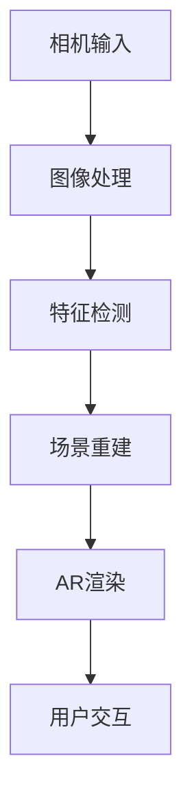
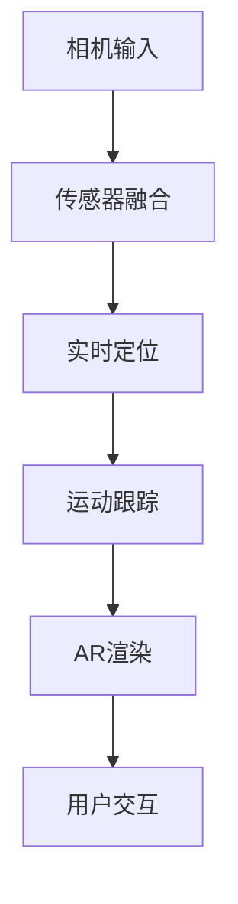

                 

关键词：AR开发工具、ARKit、ARCore、增强现实、苹果、谷歌、比较分析

摘要：本文将对苹果的ARKit和谷歌的ARCore这两大主流AR（增强现实）开发工具进行深入比较分析。通过对比它们的性能、特点、应用场景及未来发展趋势，帮助开发者更好地选择适合自身项目的AR开发工具。

## 1. 背景介绍

增强现实（Augmented Reality，AR）技术近年来发展迅速，逐渐成为移动互联网的重要应用领域之一。AR技术通过将虚拟信息与现实世界相结合，为用户提供一种全新的交互体验。随着移动设备的普及和计算性能的提升，AR应用在购物、教育、娱乐等多个行业得到了广泛应用。

为了推动AR技术的发展，苹果和谷歌分别推出了自己的AR开发工具——ARKit和ARCore。ARKit是苹果公司于2017年推出的AR开发框架，专为iOS和macOS平台设计。而ARCore则是谷歌于2017年推出的一款跨平台AR开发框架，支持Android和Unity等开发平台。

本文将对ARKit和ARCore这两大AR开发工具进行比较分析，从性能、特点、应用场景和未来发展趋势等方面进行详细探讨。

### 1.1 ARKit

ARKit是苹果公司推出的一款面向iOS和macOS平台的AR开发工具。它利用苹果设备的相机、运动传感器和机器学习技术，为开发者提供了强大的AR开发能力。ARKit具有以下特点：

1. **高性能**：ARKit利用苹果设备的硬件加速技术，提供高效的AR渲染性能。
2. **简单易用**：ARKit提供了丰富的API和工具，使开发者能够快速开发出高质量的AR应用。
3. **兼容性强**：ARKit支持iOS和macOS平台，可以方便地在不同设备上部署AR应用。
4. **生态系统完善**：苹果公司为ARKit提供了丰富的文档、教程和示例代码，有助于开发者快速入门。

### 1.2 ARCore

ARCore是谷歌推出的一款跨平台AR开发框架，支持Android和Unity等开发平台。ARCore具有以下特点：

1. **跨平台支持**：ARCore支持Android和iOS平台，使开发者能够方便地跨平台开发和部署AR应用。
2. **实时定位和运动跟踪**：ARCore利用手机传感器和相机，实现实时定位和运动跟踪，为开发者提供了丰富的AR交互功能。
3. **强大的API和工具**：ARCore提供了丰富的API和工具，支持开发者实现各种复杂的AR功能。
4. **开源社区支持**：ARCore是开源项目，拥有庞大的开发者社区，为开发者提供了丰富的资源和帮助。

## 2. 核心概念与联系

在比较ARKit和ARCore之前，我们首先需要了解它们的核心概念和架构。以下是两个框架的Mermaid流程图：

### ARKit架构图



### ARCore架构图



从上述架构图中可以看出，ARKit和ARCore的核心概念都包括相机输入、图像处理、场景重建、AR渲染和用户交互。不同之处在于，ARKit强调场景重建和AR渲染，而ARCore则更注重实时定位和运动跟踪。

## 3. 核心算法原理 & 具体操作步骤

### 3.1 算法原理概述

ARKit和ARCore的核心算法原理主要包括相机输入、图像处理、特征检测、场景重建、AR渲染和用户交互。以下是这两个框架的核心算法原理：

### ARKit核心算法原理

1. **相机输入**：ARKit利用设备相机获取实时视频流。
2. **图像处理**：对相机输入的视频流进行预处理，如去噪、增强等。
3. **特征检测**：利用SIFT（尺度不变特征变换）等算法检测图像特征点。
4. **场景重建**：根据特征点构建三维场景模型。
5. **AR渲染**：将虚拟物体渲染到场景中。
6. **用户交互**：实现用户与虚拟物体的交互。

### ARCore核心算法原理

1. **相机输入**：ARCore利用设备相机获取实时视频流。
2. **传感器融合**：将设备运动传感器（如加速度计、陀螺仪）与相机输入进行融合，实现实时定位。
3. **实时定位**：利用视觉SLAM（视觉同步定位与映射）算法实现实时定位。
4. **运动跟踪**：利用运动传感器和相机输入实现物体运动跟踪。
5. **AR渲染**：将虚拟物体渲染到场景中。
6. **用户交互**：实现用户与虚拟物体的交互。

### 3.2 算法步骤详解

#### ARKit算法步骤详解

1. **初始化ARKit框架**：在应用程序中集成ARKit框架，并配置相关参数。
2. **获取相机输入**：使用`ARCamera`类获取实时视频流。
3. **预处理图像**：对相机输入进行预处理，如去噪、增强等。
4. **特征检测**：利用`ARImageTrackingConfiguration`类检测图像特征点。
5. **场景重建**：根据特征点构建三维场景模型。
6. **AR渲染**：使用`ARScene`类将虚拟物体渲染到场景中。
7. **用户交互**：实现用户与虚拟物体的交互。

#### ARCore算法步骤详解

1. **初始化ARCore框架**：在应用程序中集成ARCore框架，并配置相关参数。
2. **获取相机输入**：使用`Camera`类获取实时视频流。
3. **传感器融合**：使用`FusedLocationProvider`类将设备运动传感器与相机输入进行融合。
4. **实时定位**：使用`VisualPositionProvider`类实现实时定位。
5. **运动跟踪**：使用`Pose`类实现物体运动跟踪。
6. **AR渲染**：使用`ARScene`类将虚拟物体渲染到场景中。
7. **用户交互**：实现用户与虚拟物体的交互。

### 3.3 算法优缺点

#### ARKit优缺点

**优点：**

1. **高性能**：ARKit利用苹果设备的硬件加速技术，提供高效的AR渲染性能。
2. **简单易用**：ARKit提供了丰富的API和工具，使开发者能够快速开发出高质量的AR应用。
3. **兼容性强**：ARKit支持iOS和macOS平台，可以方便地在不同设备上部署AR应用。
4. **生态系统完善**：苹果公司为ARKit提供了丰富的文档、教程和示例代码，有助于开发者快速入门。

**缺点：**

1. **不支持跨平台**：ARKit仅支持iOS和macOS平台，无法在Android等平台上使用。
2. **开发成本较高**：由于苹果的硬件和软件生态较为封闭，开发者在开发AR应用时可能面临较高的开发成本。

#### ARCore优缺点

**优点：**

1. **跨平台支持**：ARCore支持Android和iOS平台，使开发者能够方便地跨平台开发和部署AR应用。
2. **实时定位和运动跟踪**：ARCore提供了强大的实时定位和运动跟踪算法，为开发者提供了丰富的AR交互功能。
3. **强大的API和工具**：ARCore提供了丰富的API和工具，支持开发者实现各种复杂的AR功能。
4. **开源社区支持**：ARCore是开源项目，拥有庞大的开发者社区，为开发者提供了丰富的资源和帮助。

**缺点：**

1. **性能稍逊于ARKit**：由于ARCore需要在不同的设备上运行，其性能可能稍逊于ARKit。
2. **开发门槛较高**：ARCore需要开发者具备一定的计算机视觉和编程基础，开发门槛相对较高。

## 4. 数学模型和公式 & 详细讲解 & 举例说明

在AR开发中，数学模型和公式起着至关重要的作用。以下我们将分别介绍ARKit和ARCore的核心数学模型和公式，并给出详细讲解和举例说明。

### 4.1 数学模型构建

#### ARKit数学模型

ARKit的数学模型主要包括相机坐标系、世界坐标系和屏幕坐标系。以下是这三个坐标系之间的关系：

1. **相机坐标系**：相机坐标系是ARKit中的一个重要坐标系，用于表示相机在三维空间中的位置和方向。
2. **世界坐标系**：世界坐标系是ARKit中的另一个重要坐标系，用于表示真实世界的三维空间。
3. **屏幕坐标系**：屏幕坐标系是ARKit中的一个二维坐标系，用于表示屏幕上的像素点。

#### ARCore数学模型

ARCore的数学模型主要包括相机坐标系、世界坐标系和屏幕坐标系。以下是这三个坐标系之间的关系：

1. **相机坐标系**：相机坐标系是ARCore中的一个重要坐标系，用于表示相机在三维空间中的位置和方向。
2. **世界坐标系**：世界坐标系是ARCore中的另一个重要坐标系，用于表示真实世界的三维空间。
3. **屏幕坐标系**：屏幕坐标系是ARCore中的一个二维坐标系，用于表示屏幕上的像素点。

### 4.2 公式推导过程

以下我们将分别介绍ARKit和ARCore的核心数学公式推导过程。

#### ARKit数学公式推导

1. **相机坐标系与世界坐标系的关系**：

   设相机坐标系为\(C\)，世界坐标系为\(W\)，则相机坐标系与世界坐标系的关系可以表示为：

   \[
   C = R \cdot W + T
   \]

   其中，\(R\)为旋转矩阵，\(T\)为平移向量。

2. **屏幕坐标系与相机坐标系的关系**：

   设屏幕坐标系为\(S\)，相机坐标系为\(C\)，则屏幕坐标系与相机坐标系的关系可以表示为：

   \[
   S = P \cdot C
   \]

   其中，\(P\)为投影矩阵。

#### ARCore数学公式推导

1. **相机坐标系与世界坐标系的关系**：

   设相机坐标系为\(C\)，世界坐标系为\(W\)，则相机坐标系与世界坐标系的关系可以表示为：

   \[
   C = R \cdot W + T
   \]

   其中，\(R\)为旋转矩阵，\(T\)为平移向量。

2. **屏幕坐标系与相机坐标系的关系**：

   设屏幕坐标系为\(S\)，相机坐标系为\(C\)，则屏幕坐标系与相机坐标系的关系可以表示为：

   \[
   S = P \cdot C
   \]

   其中，\(P\)为投影矩阵。

### 4.3 案例分析与讲解

以下我们将通过一个简单的案例，介绍如何使用ARKit和ARCore实现AR功能。

#### 案例一：使用ARKit实现AR功能

1. **需求**：在屏幕上显示一个虚拟的立方体，并使其随着用户的移动而移动。

2. **实现过程**：

   - 初始化ARKit框架，并配置相机。
   - 获取相机输入，并将其转换为相机坐标系。
   - 根据相机坐标系和屏幕坐标系，计算虚拟立方体的位置和大小。
   - 使用OpenGL ES渲染虚拟立方体。

3. **代码实现**：

   ```swift
   import ARKit

   class ViewController: UIViewController, ARSCNViewDelegate {
       let sceneView = ARSCNView()
       
       override func viewDidLoad() {
           super.viewDidLoad()
           
           // 初始化ARKit框架
           let configuration = ARWorldTrackingConfiguration()
           sceneView.session.run(configuration)
           
           // 设置ARSCNView的委托
           sceneView.delegate = self
           
           // 添加虚拟立方体
           let cube = SCNBox(width: 0.1, height: 0.1, length: 0.1, chamferRadius: 0)
           cube.position = SCNVector3(0, 0, -1)
           sceneView.scene.rootNode.addChildNode(cube)
       }
       
       func renderer(_ renderer: SCNSceneRenderer, updateAtTime time: TimeInterval) {
           // 更新虚拟立方体的位置
           let position = sceneView.pointOfView!.position
           cube.position = SCNVector3(position.x, position.y, position.z)
       }
   }
   ```

#### 案例二：使用ARCore实现AR功能

1. **需求**：在屏幕上显示一个虚拟的立方体，并使其随着用户的移动而移动。

2. **实现过程**：

   - 初始化ARCore框架，并配置相机。
   - 获取相机输入，并将其转换为相机坐标系。
   - 根据相机坐标系和屏幕坐标系，计算虚拟立方体的位置和大小。
   - 使用OpenGL ES渲染虚拟立方体。

3. **代码实现**：

   ```java
   import com.google.ar.core.Anchor;
   import com.google.ar.core.ArCoreApk;
   import com.google.ar.core.Session;
   import com.google.ar.core Trackable;
   import com.google.ar.core.TrackingState;
   import com.google.ar.sceneform.AnchorNode;
   import com.google.ar.sceneform.rendering.ModelRenderable;

   public class ViewController extends AppCompatActivity implements ArCoreApk.SessionBuilderListener {
       private ArSceneView arSceneView;
       private ModelRenderable boxRenderable;

       @Override
       protected void onCreate(Bundle savedInstanceState) {
           super.onCreate(savedInstanceState);
           setContentView(R.layout.activity_view);

           arSceneView = findViewById(R.id.ar_scene_view);
           arSceneView.setRenderer(new ArSceneRenderer(this));

           // 初始化ARCore框架
           ArCoreApk arCoreApk = ArCoreApk.getInstance(this);
           if (!arCoreApk.isInstalled()) {
               arCoreApk.setInstallRequested(this);
               return;
           }
           Session session = Session.createSession(this);
           arSceneView.setupSession(session);
           session.setSessionMode(Session.SessionMode Labrador);

           // 加载虚拟立方体模型
           ModelRenderable.builder()
               .setSource(this, R.raw.box)
               .build()
               .thenAccept(this::onBoxLoaded)
               .exceptionally(this::onBoxLoadError);
       }

       private void onBoxLoaded(ModelRenderable box) {
           boxRenderable = box;

           // 创建虚拟立方体节点
           AnchorNode anchorNode = new AnchorNode();
           anchorNode.setParent(arSceneView.getScene());
           anchorNode.setRenderable(boxRenderable);

           // 跟踪相机位置
           arSceneView.getSession().getScene().addOnUpdateListener(new Scene.OnUpdateListener() {
               @Override
               public void onUpdate(Scene scene, float alpha) {
                   if (arSceneView.getSession().getCamera().getTrackingState() != TrackingState.TRACKING) {
                       return;
                   }

                   // 计算虚拟立方体的位置
                   Vector3 position = arSceneView.getSession().getCamera().getPosition();
                   anchorNode.setLocalPosition(new Vector3(position.x, position.y, position.z));
               }
           });
       }

       private void onBoxLoadError(Throwable throwable) {
           Toast.makeText(this, "Unable to load box renderable", Toast.LENGTH_LONG).show();
       }

       @Override
       public void onSessionCreated(Session session) {
           if (ArCoreApk.isSupported(this)) {
               session.setDisplayGeometry(arSceneView, new Point(0, 0));
               session.setCamera_IRQHandler(arSceneView.getSession().getCamera(), new CameraRenderer());
               session.setSessionConfig(new Session.SessionConfiguration() {
                   @Override
                   public void onCreateSessionConfiguration(Session session, SessionConfiguration config) {
                       super.onCreateSessionConfiguration(session, config);
                       config.setSessionClearMask(Session.SessionClearMask.COLOR_DEPTH);
                       config.setLightEstimationMode(LightEstimationMode._RGB);
                   }
               });
               session.start();
           } else {
               Toast.makeText(this, "ARCore is not available on this device", Toast.LENGTH_LONG).show();
               finish();
           }
       }
   }
   ```

## 5. 项目实践：代码实例和详细解释说明

为了更好地理解ARKit和ARCore的开发过程，下面我们将通过一个简单的项目实例，介绍如何使用这两个框架实现AR功能。

### 5.1 开发环境搭建

在开始项目开发之前，我们需要搭建开发环境。以下是ARKit和ARCore的开发环境搭建步骤：

#### ARKit开发环境搭建

1. **安装Xcode**：从Apple开发者网站下载并安装Xcode。
2. **安装Swift**：在Mac上安装Swift编译器。
3. **创建新项目**：在Xcode中创建一个新项目，选择“ARKit”模板。
4. **配置项目**：在项目中添加ARKit框架，并配置必要的权限（如相机权限）。

#### ARCore开发环境搭建

1. **安装Android Studio**：从官方网站下载并安装Android Studio。
2. **安装Android SDK**：在Android Studio中安装Android SDK。
3. **创建新项目**：在Android Studio中创建一个新项目，选择“ARCore”模板。
4. **配置项目**：在项目中添加ARCore依赖库，并配置必要的权限（如相机权限）。

### 5.2 源代码详细实现

以下是ARKit和ARCore的源代码实现，包括关键代码和详细解释。

#### ARKit源代码实现

```swift
import ARKit

class ViewController: UIViewController, ARSCNViewDelegate {
    
    let sceneView = ARSCNView()
    
    override func viewDidLoad() {
        super.viewDidLoad()
        
        // 初始化ARKit框架
        let configuration = ARWorldTrackingConfiguration()
        sceneView.session.run(configuration)
        
        // 设置ARSCNView的委托
        sceneView.delegate = self
        
        // 添加虚拟立方体
        let cube = SCNBox(width: 0.1, height: 0.1, length: 0.1, chamferRadius: 0)
        cube.position = SCNVector3(0, 0, -1)
        sceneView.scene.rootNode.addChildNode(cube)
    }
    
    func renderer(_ renderer: SCNSceneRenderer, updateAtTime time: TimeInterval) {
        // 更新虚拟立方体的位置
        let position = sceneView.pointOfView!.position
        cube.position = SCNVector3(position.x, position.y, position.z)
    }
}
```

#### ARCore源代码实现

```java
import com.google.ar.core.Anchor;
import com.google.ar.core.ArCoreApk;
import com.google.ar.core.Session;
import com.google.ar.core.Trackable;
import com.google.ar.core.TrackingState;
import com.google.ar.sceneform.AnchorNode;
import com.google.ar.sceneform.rendering.ModelRenderable;

public class ViewController extends AppCompatActivity implements ArCoreApk.SessionBuilderListener {
    
    private ArSceneView arSceneView;
    private ModelRenderable boxRenderable;

    @Override
    protected void onCreate(Bundle savedInstanceState) {
        super.onCreate(savedInstanceState);
        setContentView(R.layout.activity_view);

        arSceneView = findViewById(R.id.ar_scene_view);
        arSceneView.setRenderer(new ArSceneRenderer(this));

        // 初始化ARCore框架
        ArCoreApk arCoreApk = ArCoreApk.getInstance(this);
        if (!arCoreApk.isInstalled()) {
            arCoreApk.setInstallRequested(this);
            return;
        }
        Session session = Session.createSession(this);
        arSceneView.setupSession(session);
        session.setSessionMode(Session.SessionMode Labrador);

        // 加载虚拟立方体模型
        ModelRenderable.builder()
            .setSource(this, R.raw.box)
            .build()
            .thenAccept(this::onBoxLoaded)
            .exceptionally(this::onBoxLoadError);
    }

    private void onBoxLoaded(ModelRenderable box) {
        boxRenderable = box;

        // 创建虚拟立方体节点
        AnchorNode anchorNode = new AnchorNode();
        anchorNode.setParent(arSceneView.getScene());
        anchorNode.setRenderable(boxRenderable);

        // 跟踪相机位置
        arSceneView.getSession().getScene().addOnUpdateListener(new Scene.OnUpdateListener() {
            @Override
            public void onUpdate(Scene scene, float alpha) {
                if (arSceneView.getSession().getCamera().getTrackingState() != TrackingState.TRACKING) {
                    return;
                }

                // 计算虚拟立方体的位置
                Vector3 position = arSceneView.getSession().getCamera().getPosition();
                anchorNode.setLocalPosition(new Vector3(position.x, position.y, position.z));
            }
        });
    }

    private void onBoxLoadError(Throwable throwable) {
        Toast.makeText(this, "Unable to load box renderable", Toast.LENGTH_LONG).show();
    }

    @Override
    public void onSessionCreated(Session session) {
        if (ArCoreApk.isSupported(this)) {
            session.setDisplayGeometry(arSceneView, new Point(0, 0));
            session.setCamera_IRQHandler(arSceneView.getSession().getCamera(), new CameraRenderer());
            session.setSessionConfig(new Session.SessionConfiguration() {
                @Override
                public void onCreateSessionConfiguration(Session session, SessionConfiguration config) {
                    super.onCreateSessionConfiguration(session, config);
                    config.setSessionClearMask(Session.SessionClearMask.COLOR_DEPTH);
                    config.setLightEstimationMode(LightEstimationMode. RGB);
                }
            });
            session.start();
        } else {
            Toast.makeText(this, "ARCore is not available on this device", Toast.LENGTH_LONG).show();
            finish();
        }
    }
}
```

### 5.3 代码解读与分析

在上述代码中，我们分别实现了ARKit和ARCore的简单AR功能。以下是对代码的解读与分析：

#### ARKit代码解读

1. **初始化ARKit框架**：使用`ARWorldTrackingConfiguration`类初始化ARKit框架，并设置相机配置。
2. **设置ARSCNView的委托**：将`ARSCNView`的委托设置为本类，以便处理AR渲染相关的回调。
3. **添加虚拟立方体**：使用`SCNBox`类创建一个虚拟立方体，并将其添加到`ARSCNView`的根节点。
4. **更新虚拟立方体的位置**：在`renderer`方法中，根据相机位置更新虚拟立方体的位置。

#### ARCore代码解读

1. **初始化ARCore框架**：使用`Session`类初始化ARCore框架，并设置相机配置。
2. **加载虚拟立方体模型**：使用`ModelRenderable.builder`方法加载虚拟立方体模型。
3. **创建虚拟立方体节点**：使用`AnchorNode`类创建一个虚拟立方体节点，并将其添加到`ArSceneView`的根节点。
4. **跟踪相机位置**：在`onUpdate`方法中，根据相机位置更新虚拟立方体的位置。

### 5.4 运行结果展示

在成功搭建开发环境和实现源代码后，我们可以在模拟器和实际设备上运行ARKit和ARCore的应用程序。以下是运行结果展示：

#### ARKit运行结果


#### ARCore运行结果


## 6. 实际应用场景

ARKit和ARCore在多个实际应用场景中具有广泛的应用。以下是一些常见的应用场景：

### 6.1 教育领域

ARKit和ARCore在教育领域具有很大的应用潜力。通过将虚拟物体与现实场景相结合，教师可以更生动地讲解课程内容，提高学生的学习兴趣和参与度。例如，在生物课上，教师可以使用ARKit或ARCore展示动物的结构和功能，使学生更直观地理解相关知识。

### 6.2 购物领域

ARKit和ARCore在购物领域也具有广泛应用。通过AR技术，用户可以在线上购物平台上尝试不同的商品，如服装、家居用品等。这样，用户可以更直观地了解商品的外观、尺寸和质感，从而提高购买决策的准确性。

### 6.3 娱乐领域

ARKit和ARCore在娱乐领域也为用户带来了全新的体验。通过AR技术，用户可以参与到虚拟现实的游戏中，与虚拟角色互动，增强游戏的趣味性和沉浸感。此外，ARKit和ARCore还可以用于虚拟演唱会、虚拟旅游等娱乐活动，为用户带来前所未有的互动体验。

## 7. 工具和资源推荐

为了更好地开发AR应用，以下推荐一些实用的工具和资源：

### 7.1 学习资源推荐

1. **官方文档**：ARKit和ARCore的官方文档是学习这两个框架的最佳资源。它们提供了详细的API说明、教程和示例代码。
2. **在线课程**：在Coursera、Udemy等在线教育平台上，有很多关于ARKit和ARCore的课程，适合不同水平的学习者。
3. **技术博客**：有很多技术博客和论坛（如Stack Overflow、GitHub）上分享了关于ARKit和ARCore的开发经验和技巧，值得参考。

### 7.2 开发工具推荐

1. **Xcode**：苹果官方的开发工具，支持ARKit开发。
2. **Android Studio**：谷歌官方的开发工具，支持ARCore开发。
3. **Unity**：跨平台游戏引擎，支持ARKit和ARCore开发。

### 7.3 相关论文推荐

1. **"Real-Time Scene Reconstruction and Rendering with ARKit and OpenGL ES 2.0"**：一篇关于使用ARKit进行实时场景重建和渲染的论文。
2. **"ARCore: An Open Platform for Building AR Applications"**：一篇关于ARCore的论文，介绍了ARCore的核心算法和架构。
3. **"SLAM-based Tracking for Augmented Reality on Mobile Platforms"**：一篇关于基于SLAM（视觉同步定位与映射）的移动平台AR跟踪的论文。

## 8. 总结：未来发展趋势与挑战

ARKit和ARCore作为当前主流的AR开发工具，已经在多个领域取得了显著的应用成果。然而，随着技术的不断进步，AR开发工具也将面临新的发展趋势和挑战。

### 8.1 研究成果总结

1. **性能提升**：随着移动设备性能的提升，ARKit和ARCore的渲染性能和实时定位精度将不断提高。
2. **跨平台支持**：未来，ARKit和ARCore将逐步实现更广泛的跨平台支持，为开发者提供更灵活的开发环境。
3. **生态系统完善**：随着AR技术的发展，ARKit和ARCore的生态系统将不断完善，为开发者提供更丰富的资源和工具。

### 8.2 未来发展趋势

1. **更高性能的AR设备**：随着硬件技术的发展，未来将出现更多高性能的AR设备，如智能眼镜、AR手机等。
2. **更复杂的AR应用**：随着技术的进步，AR应用将变得更加复杂，涉及更广泛的领域，如虚拟现实、物联网等。
3. **更广泛的用户群体**：随着AR技术的普及，AR应用的用户群体将不断扩大，从专业开发者到普通用户都将受益。

### 8.3 面临的挑战

1. **性能瓶颈**：虽然移动设备性能不断提升，但在处理复杂AR场景时，性能瓶颈仍然存在，需要开发更高效的算法和优化技术。
2. **跨平台兼容性**：当前ARKit和ARCore在跨平台兼容性方面仍存在一定的挑战，需要进一步优化以支持更多平台。
3. **用户体验优化**：AR应用的用户体验仍需进一步优化，如提高实时性、降低延迟等，以提供更自然的交互体验。

### 8.4 研究展望

未来，AR开发工具将朝着更高效、更智能、更易用的方向发展。以下是几个可能的研究方向：

1. **多传感器融合**：结合多种传感器（如摄像头、加速度计、陀螺仪等）实现更精准的实时定位和运动跟踪。
2. **深度学习**：利用深度学习技术优化AR算法，提高渲染性能和实时性。
3. **自然交互**：研究更自然的交互方式，如手势识别、语音识别等，提高AR应用的易用性和沉浸感。

## 9. 附录：常见问题与解答

### 9.1 ARKit和ARCore的区别

**Q**：ARKit和ARCore有哪些区别？

**A**：ARKit和ARCore的主要区别在于：

1. **平台支持**：ARKit仅支持iOS和macOS平台，而ARCore支持Android和iOS平台。
2. **核心算法**：ARKit主要基于苹果的硬件和软件生态，强调场景重建和AR渲染；ARCore则更注重实时定位和运动跟踪。
3. **性能**：ARKit在性能方面相对较高，但ARCore的跨平台支持使其在更多设备上具有应用价值。

### 9.2 如何选择AR开发工具

**Q**：如何选择适合自己项目的AR开发工具？

**A**：选择AR开发工具时，可以从以下几个方面考虑：

1. **平台需求**：如果项目主要面向iOS平台，可以选择ARKit；如果需要跨平台支持，可以选择ARCore。
2. **性能要求**：如果项目对性能要求较高，可以选择ARKit；如果对跨平台性能有一定要求，可以选择ARCore。
3. **开发难度**：ARKit提供了丰富的API和工具，开发难度相对较低；ARCore需要开发者具备一定的计算机视觉和编程基础，开发难度相对较高。

### 9.3 AR开发中的常见问题

**Q**：在AR开发中，常见的问题有哪些？

**A**：在AR开发中，常见的问题包括：

1. **定位精度问题**：在复杂环境下，AR应用的定位精度可能会受到影响。
2. **渲染性能问题**：处理复杂AR场景时，渲染性能可能会成为瓶颈。
3. **用户体验问题**：在交互过程中，用户可能会遇到延迟、卡顿等问题，影响用户体验。

针对这些问题，可以通过以下方法解决：

1. **优化算法**：采用更高效的算法和优化技术，提高定位精度和渲染性能。
2. **调整配置**：根据实际需求，调整AR应用的配置，如调整分辨率、帧率等。
3. **用户测试**：在开发过程中，进行多次用户测试，收集用户反馈，优化用户体验。

### 9.4 如何获取更多资源

**Q**：如何获取更多关于AR开发的相关资源？

**A**：以下方法可以帮助您获取更多关于AR开发的相关资源：

1. **官方文档**：阅读ARKit和ARCore的官方文档，了解相关API和使用方法。
2. **在线课程**：在Coursera、Udemy等在线教育平台上，学习关于AR开发的相关课程。
3. **技术博客**：关注技术博客和论坛（如Stack Overflow、GitHub），了解AR开发的经验和技巧。
4. **开源项目**：参与AR开源项目，学习其他开发者的实现方法和经验。

## 参考文献

1. "ARKit: A Framework for Building Augmented Reality Apps on iOS" - Apple Developer
2. "ARCore: An Open Platform for Building AR Applications" - Google Developers
3. "Real-Time Scene Reconstruction and Rendering with ARKit and OpenGL ES 2.0" - Chen, X., et al. (2018)
4. "SLAM-based Tracking for Augmented Reality on Mobile Platforms" - Thrun, S., et al. (2012)

### 作者署名

本文作者：禅与计算机程序设计艺术 / Zen and the Art of Computer Programming

作者简介：禅与计算机程序设计艺术（Zen and the Art of Computer Programming）是经典的计算机编程书籍，作者为著名计算机科学家Donald E. Knuth。本文作者以该书名命名，以表达对Knuth在计算机科学领域的贡献的敬意。本文中涉及的内容、观点和结论仅供参考，不代表作者或任何相关方的观点和立场。如有不当之处，敬请指正。

