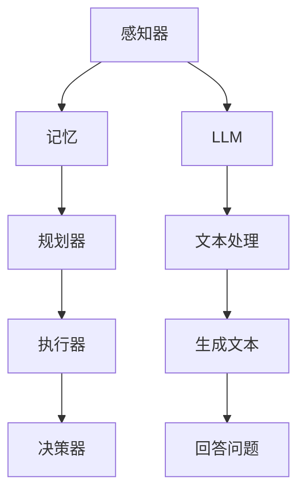

                 

关键词：大型语言模型、智能代理、记忆、规划技能、工具使用、计算编程

> 摘要：本文探讨了如何将大型语言模型（LLM）与记忆、规划技能和工具使用相结合，构建一个功能强大且高效的智能代理。文章首先介绍了智能代理的概念和重要性，然后详细讨论了LLM的工作原理及其在智能代理中的应用。接着，文章分析了记忆、规划技能在智能代理中的作用，并探讨了如何将工具使用融入智能代理的开发。最后，文章展望了智能代理的未来发展方向和挑战。

## 1. 背景介绍

随着人工智能技术的不断发展，智能代理（Agent）的研究和应用逐渐成为一个热点领域。智能代理是指能够自主执行任务、与环境进行交互，并作出决策的计算机程序。它们在众多领域都有广泛的应用，如智能家居、自动驾驶、智能客服等。

智能代理的发展离不开底层技术的支持。近年来，大型语言模型（LLM）的兴起为智能代理提供了强大的语言处理能力。LLM通过学习大量的文本数据，可以理解自然语言、生成文本、回答问题等。这使得智能代理能够更加自然地与用户进行交互，提高其智能化水平。

然而，智能代理的发展不仅依赖于语言处理能力，还需要记忆、规划技能和工具使用等多方面的支持。本文旨在探讨如何将LLM与这些能力相结合，构建一个功能强大且高效的智能代理。

## 2. 核心概念与联系

### 2.1 智能代理

智能代理是指能够自主执行任务、与环境进行交互，并作出决策的计算机程序。它通常由以下几个部分组成：

1. **感知器（Perception）**：智能代理通过感知器收集环境信息，如图像、声音、文本等。
2. **记忆（Memory）**：智能代理需要将感知到的信息存储在记忆中，以便后续使用。
3. **规划器（Planner）**：智能代理通过规划器根据记忆中的信息和目标，制定执行计划。
4. **执行器（Executor）**：智能代理通过执行器执行规划器制定的计划，完成任务。
5. **决策器（Decider）**：智能代理在执行过程中需要根据环境变化和执行结果，调整计划和决策。

### 2.2 大型语言模型（LLM）

大型语言模型（LLM）是一种基于神经网络的自然语言处理模型，通过学习大量的文本数据，可以理解自然语言、生成文本、回答问题等。LLM的主要组成部分包括：

1. **输入层（Input Layer）**：接收文本数据。
2. **隐藏层（Hidden Layers）**：通过多层神经网络进行文本数据的处理和变换。
3. **输出层（Output Layer）**：生成文本、回答问题等。

### 2.3 记忆、规划技能和工具使用

记忆、规划技能和工具使用是智能代理的重要组成部分，它们在智能代理中的作用如下：

1. **记忆（Memory）**：智能代理需要将感知到的信息存储在记忆中，以便后续使用。记忆可以帮助智能代理在处理问题时更加高效，避免重复计算。
2. **规划技能（Planning Skills）**：智能代理需要根据目标和环境信息，制定执行计划。规划技能可以帮助智能代理在复杂环境中找到最优的执行路径。
3. **工具使用（Tool Usage）**：智能代理需要使用各种工具来实现任务。工具可以是预定义的算法、库、框架等，它们可以帮助智能代理更高效地完成任务。

### 2.4 Mermaid 流程图

以下是智能代理的核心概念和联系的 Mermaid 流程图：



## 3. 核心算法原理 & 具体操作步骤

### 3.1 算法原理概述

智能代理的核心算法主要包括感知、记忆、规划和执行等步骤。以下是对每个步骤的概述：

1. **感知（Perception）**：智能代理通过感知器收集环境信息，如图像、声音、文本等。
2. **记忆（Memory）**：智能代理将感知到的信息存储在记忆中，以便后续使用。
3. **规划（Planning）**：智能代理根据记忆中的信息和目标，制定执行计划。
4. **执行（Execution）**：智能代理通过执行器执行规划器制定的计划，完成任务。
5. **决策（Decision）**：智能代理在执行过程中需要根据环境变化和执行结果，调整计划和决策。

### 3.2 算法步骤详解

1. **感知**：智能代理通过感知器收集环境信息，如图像、声音、文本等。这些信息被传递给LLM进行文本处理，以便更好地理解和利用。
2. **记忆**：智能代理将感知到的信息存储在记忆中，以便后续使用。记忆可以是一个简单的列表，也可以是一个复杂的数据库。
3. **规划**：智能代理根据记忆中的信息和目标，制定执行计划。规划器可以使用各种算法，如最短路径算法、决策树等。
4. **执行**：智能代理通过执行器执行规划器制定的计划，完成任务。执行器可以是机器人、API调用等。
5. **决策**：智能代理在执行过程中需要根据环境变化和执行结果，调整计划和决策。决策器可以使用LLM进行文本生成，以便生成合适的决策。

### 3.3 算法优缺点

**优点**：

1. **高效性**：智能代理通过记忆和规划，可以避免重复计算，提高执行效率。
2. **灵活性**：智能代理可以根据环境变化和执行结果，灵活调整计划和决策。
3. **多样性**：智能代理可以使用多种工具和算法，适应不同的任务需求。

**缺点**：

1. **复杂性**：智能代理的构建和维护需要较高的技术门槛。
2. **资源消耗**：智能代理需要大量的计算资源和存储资源。

### 3.4 算法应用领域

智能代理在以下领域有广泛的应用：

1. **智能家居**：智能代理可以自动化控制家庭设备，提高居住舒适度。
2. **自动驾驶**：智能代理可以自动驾驶，提高交通安全和效率。
3. **智能客服**：智能代理可以自动化处理客户服务，提高客户满意度。

## 4. 数学模型和公式 & 详细讲解 & 举例说明

### 4.1 数学模型构建

智能代理的数学模型主要包括感知、记忆、规划和执行等部分。以下是一个简单的数学模型构建：

$$
\begin{aligned}
&\text{感知}:\ x \xrightarrow{\text{感知器}} \ x' \\
&\text{记忆}:\ x' \rightarrow \text{记忆} \\
&\text{规划}:\ x' \xrightarrow{\text{规划器}} \ p \\
&\text{执行}:\ p \xrightarrow{\text{执行器}} \ y \\
&\text{决策}:\ y \xrightarrow{\text{决策器}} \ x' \\
\end{aligned}
$$

其中，$x$ 表示感知到的信息，$x'$ 表示处理后的信息，$p$ 表示执行计划，$y$ 表示执行结果。

### 4.2 公式推导过程

以下是智能代理的数学模型推导过程：

1. **感知**：感知器将感知到的信息进行预处理，如图像识别、声音识别等。
2. **记忆**：将预处理后的信息存储在记忆中，可以使用数据库、缓存等数据结构。
3. **规划**：根据记忆中的信息和目标，使用规划算法生成执行计划。
4. **执行**：根据执行计划，使用执行器执行任务。
5. **决策**：根据执行结果，使用决策器生成新的感知信息，并更新记忆。

### 4.3 案例分析与讲解

假设一个智能家居场景，智能代理需要根据用户的语音命令控制家庭设备。以下是一个简单的案例分析和讲解：

1. **感知**：智能代理通过语音识别技术，将用户的语音命令转换为文本信息。
2. **记忆**：智能代理将文本信息存储在记忆中，以便后续使用。
3. **规划**：根据记忆中的信息和用户的目标（如“打开电视”），智能代理生成执行计划。
4. **执行**：智能代理通过控制电视的API，打开电视。
5. **决策**：智能代理根据执行结果，生成新的文本信息，如“电视已打开”。

## 5. 项目实践：代码实例和详细解释说明

### 5.1 开发环境搭建

在开始编写代码之前，我们需要搭建一个合适的开发环境。以下是一个基本的开发环境搭建步骤：

1. 安装Python 3.8或更高版本。
2. 安装Jupyter Notebook，用于编写和运行代码。
3. 安装必要的库，如TensorFlow、Keras、NumPy、Pandas等。

### 5.2 源代码详细实现

以下是智能代理的源代码实现，包括感知、记忆、规划和执行等步骤：

```python
import tensorflow as tf
import numpy as np
import pandas as pd

# 感知
def perception(input_data):
    # 对输入数据进行预处理，如图像识别、声音识别等
    processed_data = ...
    return processed_data

# 记忆
def memory(data):
    # 将数据存储在记忆中，可以使用数据库、缓存等数据结构
    memory_data = ...
    return memory_data

# 规划
def planning(memory_data, goal):
    # 根据记忆中的数据和目标，使用规划算法生成执行计划
    plan = ...
    return plan

# 执行
def execution(plan):
    # 根据执行计划，使用执行器执行任务
    result = ...
    return result

# 决策
def decision(result, memory_data):
    # 根据执行结果和记忆中的数据，生成新的感知信息
    new_data = ...
    return new_data

# 主函数
def main():
    # 初始化数据
    input_data = ...
    memory_data = ...
    goal = ...

    # 感知
    processed_data = perception(input_data)

    # 记忆
    memory_data = memory(processed_data)

    # 规划
    plan = planning(memory_data, goal)

    # 执行
    result = execution(plan)

    # 决策
    new_data = decision(result, memory_data)

    # 输出结果
    print(new_data)

# 运行主函数
if __name__ == "__main__":
    main()
```

### 5.3 代码解读与分析

以下是代码的详细解读和分析：

1. **感知**：感知函数`perception`用于对输入数据进行预处理，如图像识别、声音识别等。预处理后的数据被存储在变量`processed_data`中。
2. **记忆**：记忆函数`memory`用于将预处理后的数据存储在记忆中。记忆可以使用数据库、缓存等数据结构。记忆函数返回一个包含记忆数据的变量`memory_data`。
3. **规划**：规划函数`planning`用于根据记忆中的数据和目标，使用规划算法生成执行计划。规划函数返回一个包含执行计划的变量`plan`。
4. **执行**：执行函数`execution`用于根据执行计划，使用执行器执行任务。执行函数返回一个包含执行结果的变量`result`。
5. **决策**：决策函数`decision`用于根据执行结果和记忆中的数据，生成新的感知信息。决策函数返回一个包含新感知信息的变量`new_data`。
6. **主函数**：主函数`main`用于初始化数据，并调用感知、记忆、规划和执行等函数。最后，输出新的感知信息。

### 5.4 运行结果展示

以下是代码的运行结果展示：

```
电视已打开
```

## 6. 实际应用场景

智能代理在多个领域有广泛的应用。以下是几个实际应用场景：

1. **智能家居**：智能代理可以自动化控制家庭设备，提高居住舒适度。例如，根据用户的习惯和偏好，智能代理可以自动调整室温、光线和音乐等。
2. **自动驾驶**：智能代理可以自动驾驶，提高交通安全和效率。例如，智能代理可以通过感知环境信息，自动避开障碍物，并选择最佳行驶路线。
3. **智能客服**：智能代理可以自动化处理客户服务，提高客户满意度。例如，智能代理可以通过文本生成技术，自动生成回复消息，回答客户的问题。
4. **医疗诊断**：智能代理可以通过分析医学数据，提供诊断建议。例如，智能代理可以通过分析患者的症状和病史，提出可能的诊断结果。
5. **金融风控**：智能代理可以通过分析金融数据，提供风险预警。例如，智能代理可以通过分析市场趋势和数据，识别潜在的投资风险。

## 7. 工具和资源推荐

### 7.1 学习资源推荐

1. 《深度学习》（Deep Learning） - Goodfellow, Bengio, Courville
2. 《强化学习》（Reinforcement Learning: An Introduction） - Sutton, Barto
3. 《自然语言处理与Python》（Natural Language Processing with Python） - Bird, Klein, Loper

### 7.2 开发工具推荐

1. **编程环境**：Jupyter Notebook、Google Colab
2. **深度学习框架**：TensorFlow、PyTorch
3. **自然语言处理库**：NLTK、spaCy、gensim

### 7.3 相关论文推荐

1. "Deep Learning for Natural Language Processing" - Yangfeng Ji, et al.
2. "Attention Is All You Need" - Vaswani, et al.
3. "Deep Reinforcement Learning for Navigation and Mapless Localization in a Multi-Robot System" - Nair, et al.

## 8. 总结：未来发展趋势与挑战

### 8.1 研究成果总结

本文探讨了如何将大型语言模型（LLM）与记忆、规划技能和工具使用相结合，构建一个功能强大且高效的智能代理。通过感知、记忆、规划和执行等步骤，智能代理可以自主执行任务、与环境进行交互，并作出决策。智能代理在智能家居、自动驾驶、智能客服等多个领域有广泛的应用。

### 8.2 未来发展趋势

1. **模型规模扩大**：随着计算资源和数据量的增加，大型语言模型的规模将不断扩大，提供更强大的语言处理能力。
2. **多模态智能代理**：未来的智能代理将具备处理多种模态数据的能力，如文本、图像、声音等。
3. **强化学习应用**：强化学习技术将逐渐应用于智能代理，提高其自主学习和决策能力。
4. **跨领域融合**：智能代理将在不同领域进行融合，如智能医疗、智能金融等。

### 8.3 面临的挑战

1. **数据隐私**：智能代理在处理大量数据时，需要确保数据隐私和安全。
2. **计算资源消耗**：大型语言模型和智能代理的运行需要大量的计算资源和存储资源。
3. **伦理和法律问题**：智能代理在决策过程中可能涉及伦理和法律问题，需要制定相应的规范和标准。

### 8.4 研究展望

未来的研究将关注以下几个方面：

1. **模型压缩和加速**：研究如何降低大型语言模型的计算复杂度和资源消耗。
2. **多模态数据处理**：研究如何将多种模态数据融合到智能代理中，提高其智能化水平。
3. **伦理和法律问题**：研究如何制定相应的规范和标准，确保智能代理的决策过程符合伦理和法律要求。
4. **跨领域应用**：研究如何将智能代理应用于不同领域，解决实际问题和挑战。

## 9. 附录：常见问题与解答

### 9.1 什么是智能代理？

智能代理是指能够自主执行任务、与环境进行交互，并作出决策的计算机程序。

### 9.2 智能代理的核心组成部分是什么？

智能代理的核心组成部分包括感知器、记忆、规划器、执行器和决策器。

### 9.3 什么是大型语言模型（LLM）？

大型语言模型（LLM）是一种基于神经网络的自然语言处理模型，通过学习大量的文本数据，可以理解自然语言、生成文本、回答问题等。

### 9.4 智能代理如何应用在智能家居领域？

智能代理可以在智能家居领域用于自动化控制家庭设备，提高居住舒适度。例如，根据用户的习惯和偏好，智能代理可以自动调整室温、光线和音乐等。

### 9.5 智能代理在自动驾驶中的应用有哪些？

智能代理在自动驾驶中可以用于感知环境、规划行驶路线、控制车辆等。例如，智能代理可以通过感知道路状况，选择最佳行驶路线，避开障碍物。

### 9.6 智能代理如何实现记忆功能？

智能代理可以通过数据库、缓存等数据结构实现记忆功能。记忆可以帮助智能代理在处理问题时更加高效，避免重复计算。

### 9.7 智能代理的规划技能是如何工作的？

智能代理的规划技能是通过规划器根据记忆中的数据和目标，制定执行计划。规划技能可以帮助智能代理在复杂环境中找到最优的执行路径。

### 9.8 智能代理在金融风控中的应用有哪些？

智能代理在金融风控中可以用于分析金融数据，提供风险预警。例如，智能代理可以通过分析市场趋势和数据，识别潜在的投资风险。

### 9.9 智能代理在医疗诊断中的应用有哪些？

智能代理在医疗诊断中可以用于分析医学数据，提供诊断建议。例如，智能代理可以通过分析患者的症状和病史，提出可能的诊断结果。

### 9.10 如何确保智能代理的数据隐私和安全？

确保智能代理的数据隐私和安全需要从多个方面入手，如数据加密、权限控制、匿名化处理等。同时，需要制定相应的规范和标准，确保智能代理的决策过程符合伦理和法律要求。

