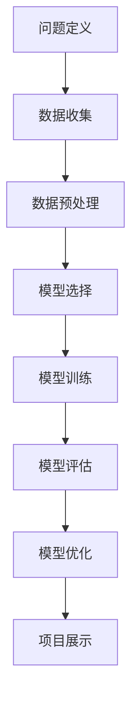

                 

关键词：AI hackathon、经验分享、AI开发、技术实践、项目展示

摘要：本文将深入探讨AI领域的著名专家Andrej Karpathy在一次AI hackathon中的经验分享，解析其如何通过有效的方法和策略，在短时间内打造出具有影响力的AI项目，并从中汲取到的宝贵经验。

## 1. 背景介绍

Andrej Karpathy是一位在人工智能（AI）领域享有盛誉的研究者和程序员，他以其对深度学习技术的深入理解和广泛应用而闻名。在一次AI hackathon中，他分享了自己在短时间内打造AI项目的经验和见解，为参与者提供了宝贵的指导。

## 2. 核心概念与联系

为了更好地理解Andrej Karpathy的经验，我们需要首先了解一些核心概念和联系，包括AI hackathon的基本概念、AI项目开发的步骤、以及成功项目的要素。

### 2.1 AI hackathon的基本概念

AI hackathon是一种以团队协作和快速开发为核心的竞赛活动，参与者通常在限定时间内（如24小时或48小时）围绕特定的AI主题或问题展开创新性研究，并最终展示他们的成果。这种活动不仅激发了创新思维，还促进了不同领域的专家之间的交流与合作。

### 2.2 AI项目开发的步骤

AI项目开发通常包括以下步骤：

1. **问题定义**：明确要解决的问题或要达成的目标。
2. **数据收集**：收集相关数据，如文本、图像、音频等。
3. **数据预处理**：对数据进行清洗、归一化等处理，使其适合建模。
4. **模型选择**：根据问题类型和数据特点选择合适的模型。
5. **模型训练**：使用训练数据训练模型。
6. **模型评估**：使用测试数据评估模型性能。
7. **模型优化**：根据评估结果调整模型参数，提高性能。
8. **项目展示**：将项目成果展示给评审团和观众。

### 2.3 成功项目的要素

成功项目通常具备以下要素：

- **明确的目标**：项目目标要具体、可实现。
- **良好的团队合作**：团队成员要具备互补的技能。
- **充分的准备**：在比赛前充分准备，包括技术调研、工具准备等。
- **高效的开发流程**：确保开发流程高效、有条不紊。
- **创新的解决方案**：提供新颖、有效的解决方案。
- **清晰的展示**：展示时要清晰地传达项目目标和成果。

### 2.4 Mermaid流程图

以下是一个简化的AI项目开发流程图，用于展示各个步骤之间的联系：



## 3. 核心算法原理 & 具体操作步骤

### 3.1 算法原理概述

在AI hackathon中，选择合适的算法是成功的关键。以下是一些常用的核心算法原理：

- **深度学习**：通过多层神经网络处理复杂数据，从而实现图像识别、语音识别等功能。
- **强化学习**：通过与环境交互，学习最佳策略，以实现游戏AI、自动驾驶等。
- **生成对抗网络（GAN）**：通过生成器和判别器的对抗训练，生成高质量的图像和文本。

### 3.2 算法步骤详解

以下是一个基于深度学习的图像识别项目开发步骤：

1. **数据收集**：收集大量带标签的图像数据。
2. **数据预处理**：对图像进行缩放、裁剪、归一化等处理。
3. **模型选择**：选择一个合适的卷积神经网络（CNN）架构。
4. **模型训练**：使用训练数据训练模型，并使用测试数据验证模型性能。
5. **模型优化**：根据测试结果调整模型参数，提高识别准确率。
6. **项目展示**：将训练好的模型集成到应用程序中，并进行展示。

### 3.3 算法优缺点

- **深度学习**：能够处理大量数据，提取复杂特征，但训练过程较慢，对计算资源要求较高。
- **强化学习**：能够学习复杂策略，但训练过程较慢，且需要大量数据。
- **生成对抗网络（GAN）**：能够生成高质量的图像和文本，但训练过程较不稳定。

### 3.4 算法应用领域

- **图像识别**：用于图像分类、目标检测等。
- **语音识别**：用于语音识别、语音合成等。
- **自然语言处理**：用于文本分类、机器翻译等。

## 4. 数学模型和公式 & 详细讲解 & 举例说明

### 4.1 数学模型构建

在AI项目中，常用的数学模型包括：

- **卷积神经网络（CNN）**：用于图像识别。
- **循环神经网络（RNN）**：用于序列数据处理。
- **生成对抗网络（GAN）**：用于图像生成。

### 4.2 公式推导过程

以下是一个简化的卷积神经网络（CNN）的公式推导过程：

$$
\text{激活函数} = \text{ReLU}(z) = \max(0, z)
$$

$$
z = \sum_{i=1}^{k} w_i * x_i + b
$$

其中，$x_i$是输入特征，$w_i$是权重，$b$是偏置。

### 4.3 案例分析与讲解

以下是一个基于CNN的图像分类案例：

1. **数据收集**：收集1000张猫和狗的图像。
2. **数据预处理**：对图像进行缩放、裁剪、归一化等处理。
3. **模型选择**：选择一个简单的卷积神经网络架构。
4. **模型训练**：使用训练数据训练模型，并使用测试数据验证模型性能。
5. **模型评估**：计算分类准确率。

## 5. 项目实践：代码实例和详细解释说明

### 5.1 开发环境搭建

在开始项目实践之前，需要搭建一个合适的开发环境。以下是一个基于Python和TensorFlow的示例：

```python
pip install tensorflow numpy matplotlib
```

### 5.2 源代码详细实现

以下是一个基于CNN的图像分类项目的示例代码：

```python
import tensorflow as tf
from tensorflow.keras.models import Sequential
from tensorflow.keras.layers import Conv2D, MaxPooling2D, Flatten, Dense

# 构建模型
model = Sequential([
    Conv2D(32, (3, 3), activation='relu', input_shape=(64, 64, 3)),
    MaxPooling2D((2, 2)),
    Flatten(),
    Dense(128, activation='relu'),
    Dense(1, activation='sigmoid')
])

# 编译模型
model.compile(optimizer='adam', loss='binary_crossentropy', metrics=['accuracy'])

# 训练模型
model.fit(x_train, y_train, epochs=10, batch_size=32, validation_data=(x_val, y_val))

# 评估模型
accuracy = model.evaluate(x_test, y_test)
print(f'测试准确率：{accuracy[1]}')
```

### 5.3 代码解读与分析

上述代码首先导入了所需的库，然后构建了一个简单的卷积神经网络模型，包括一个卷积层、一个最大池化层、一个全连接层和一个输出层。接着，编译模型并使用训练数据训练模型。最后，评估模型性能。

### 5.4 运行结果展示

在训练过程中，可以使用matplotlib库绘制训练损失和准确率曲线，以观察模型的训练过程。

```python
import matplotlib.pyplot as plt

history = model.fit(x_train, y_train, epochs=10, batch_size=32, validation_data=(x_val, y_val))

plt.plot(history.history['loss'])
plt.plot(history.history['val_loss'])
plt.title('Model Loss')
plt.ylabel('Loss')
plt.xlabel('Epoch')
plt.legend(['Train', 'Validation'], loc='upper right')
plt.show()

plt.plot(history.history['accuracy'])
plt.plot(history.history['val_accuracy'])
plt.title('Model Accuracy')
plt.ylabel('Accuracy')
plt.xlabel('Epoch')
plt.legend(['Train', 'Validation'], loc='lower right')
plt.show()
```

## 6. 实际应用场景

AI hackathon的项目可以应用于各种实际场景，包括：

- **医疗健康**：诊断疾病、个性化治疗等。
- **金融理财**：风险评估、股票交易等。
- **智能交通**：自动驾驶、交通流量预测等。
- **教育科技**：智能辅导、在线教育等。

## 7. 工具和资源推荐

### 7.1 学习资源推荐

- **书籍**：《深度学习》（Goodfellow et al.）
- **在线课程**：Coursera、Udacity、edX等平台上的AI相关课程。
- **技术博客**：Medium、Towards Data Science、AI Hub等。

### 7.2 开发工具推荐

- **编程语言**：Python、R、Julia等。
- **深度学习框架**：TensorFlow、PyTorch、Keras等。
- **数据可视化**：Matplotlib、Seaborn、Plotly等。

### 7.3 相关论文推荐

- **深度学习**：《A Brief History of Time Series Forecasting》、《An Overview of Deep Learning for Time Series Classification》等。
- **生成对抗网络（GAN）**：《Generative Adversarial Nets》、《Unsupervised Representation Learning with Deep Convolutional Generative Adversarial Networks》等。

## 8. 总结：未来发展趋势与挑战

### 8.1 研究成果总结

近年来，AI领域取得了显著的成果，包括深度学习、生成对抗网络（GAN）、强化学习等。这些成果在医疗健康、金融理财、智能交通、教育科技等领域取得了广泛应用。

### 8.2 未来发展趋势

- **模型压缩与优化**：为了降低计算成本，研究者将继续探索模型压缩与优化技术。
- **跨领域融合**：AI与其他领域的融合，如医学、金融、教育等，将带来更多创新。
- **伦理与法规**：随着AI技术的发展，伦理与法规问题也将日益突出，需要全社会共同努力。

### 8.3 面临的挑战

- **数据隐私**：如何在保护数据隐私的同时，充分利用数据进行AI研究。
- **计算资源**：随着模型规模的增大，计算资源需求将不断增加。
- **通用人工智能**：实现通用人工智能（AGI）仍然是AI领域的长期目标，面临诸多挑战。

### 8.4 研究展望

在未来，AI技术将继续快速发展，为人类社会带来更多福祉。同时，我们也要关注AI带来的伦理、法律、社会等问题，确保AI技术的可持续发展。

## 9. 附录：常见问题与解答

### 9.1 什么是AI hackathon？

AI hackathon是一种以团队协作和快速开发为核心的竞赛活动，参与者通常在限定时间内围绕特定的AI主题或问题展开创新性研究，并最终展示他们的成果。

### 9.2 AI项目开发有哪些步骤？

AI项目开发通常包括以下步骤：问题定义、数据收集、数据预处理、模型选择、模型训练、模型评估、模型优化和项目展示。

### 9.3 如何选择合适的算法？

选择合适的算法取决于问题的类型、数据的特点和项目的目标。例如，对于图像识别问题，可以选用卷积神经网络（CNN）。

### 9.4 AI技术的未来发展趋势是什么？

AI技术的未来发展趋势包括模型压缩与优化、跨领域融合、伦理与法规等问题。

### 9.5 AI技术会取代人类工作吗？

AI技术的发展确实会带来一些职业的消失，但同时也会创造新的就业机会。关键在于如何适应和利用这些变化。

---

作者：禅与计算机程序设计艺术 / Zen and the Art of Computer Programming

本文基于公开资料和个人经验，旨在为AI领域的开发者和研究者提供有价值的参考。在实际应用中，还需结合具体问题和需求进行深入研究和实践。

