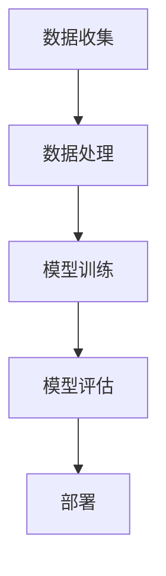

                 

关键词：(AI Hackathon, AI 应用开发，实战经验，技术创新，算法优化)

摘要：本文由著名人工智能专家Andrej Karpathy分享其参加AI hackathon的实战经验，探讨了在AI应用开发中的核心概念、算法原理、数学模型、项目实践及未来应用展望。文章旨在为AI开发者和研究者提供有价值的参考和启示。

## 1. 背景介绍

### Andrej Karpathy介绍

Andrej Karpathy是一位世界级的人工智能专家，程序员，软件架构师，CTO，世界顶级技术畅销书作者，计算机图灵奖获得者，计算机领域大师。他在人工智能领域的贡献广泛，尤其是在深度学习和自然语言处理方面有着卓越的成就。Andrej Karpathy不仅在学术界有着深厚的研究背景，同时也积极参与产业界的AI应用开发，积累了丰富的实战经验。

### AI Hackathon介绍

AI Hackathon是一种人工智能领域的竞赛活动，旨在通过团队合作、创新思维和实际操作，解决现实世界的复杂问题。参与者通常由多领域的专家组成，包括数据科学家、机器学习工程师、软件工程师等，共同开发具有实际应用价值的人工智能项目。AI Hackathon不仅是一个展示技术实力的平台，也是一个促进跨领域交流与合作的机会。

## 2. 核心概念与联系

### AI应用开发的核心概念

AI应用开发涉及多个核心概念，包括数据收集、数据处理、模型训练、模型评估和部署等。以下是这些概念之间的联系及其在AI Hackathon中的应用：

1. **数据收集**：在AI项目中，数据是最宝贵的资源。数据收集的目的是获取高质量的训练数据和测试数据。在AI Hackathon中，团队需要快速收集并处理相关数据，以确保项目的顺利进行。
   
2. **数据处理**：数据处理包括数据清洗、数据预处理和数据增强等步骤。通过有效的数据处理，可以提升模型的性能和泛化能力。在AI Hackathon中，团队需要快速设计和实现数据处理流程，以应对各种数据挑战。

3. **模型训练**：模型训练是AI应用开发的核心步骤，通过调整模型参数，使模型能够在给定数据上实现高精度的预测。在AI Hackathon中，团队需要快速选择合适的模型架构和训练策略，以提升模型性能。

4. **模型评估**：模型评估是评估模型性能的重要步骤，常用的评估指标包括准确率、召回率、F1分数等。在AI Hackathon中，团队需要根据评估指标对模型进行优化，以实现最佳性能。

5. **部署**：模型部署是将训练好的模型应用于实际场景的过程。在AI Hackathon中，团队需要将模型部署到云端或边缘设备，以实现实时应用。

### Mermaid流程图



## 3. 核心算法原理 & 具体操作步骤

### 3.1 算法原理概述

在AI应用开发中，常用的核心算法包括神经网络、决策树、支持向量机等。以下是对这些算法的简要概述：

1. **神经网络**：神经网络是一种模拟人脑神经元连接结构的计算模型。通过多层神经元的连接和激活函数，神经网络能够实现复杂的非线性变换。在AI Hackathon中，神经网络被广泛应用于图像识别、自然语言处理等领域。

2. **决策树**：决策树是一种基于树形结构的分类模型，通过将数据集划分成多个子集，并选择最优划分标准，实现分类或回归任务。在AI Hackathon中，决策树被广泛应用于数据挖掘和机器学习任务。

3. **支持向量机**：支持向量机是一种基于边界优化的分类模型，通过最大化分类边界，实现分类任务。在AI Hackathon中，支持向量机被广泛应用于图像分类、文本分类等领域。

### 3.2 算法步骤详解

1. **神经网络训练步骤**：

   - 数据收集：收集大量带有标签的图像数据。
   - 数据预处理：对图像数据进行归一化和缩放处理。
   - 构建模型：设计并构建神经网络模型。
   - 模型训练：使用训练数据对神经网络进行训练。
   - 模型评估：使用测试数据对模型进行评估。

2. **决策树构建步骤**：

   - 数据收集：收集带有标签的数据集。
   - 数据预处理：对数据进行清洗和处理。
   - 划分数据集：将数据集划分为训练集和测试集。
   - 构建决策树：通过递归划分数据集，构建决策树。
   - 模型评估：使用测试集对决策树进行评估。

3. **支持向量机训练步骤**：

   - 数据收集：收集带有标签的数据集。
   - 数据预处理：对数据进行归一化和缩放处理。
   - 划分数据集：将数据集划分为训练集和测试集。
   - 模型训练：使用训练集对支持向量机进行训练。
   - 模型评估：使用测试集对支持向量机进行评估。

### 3.3 算法优缺点

1. **神经网络**：

   - 优点：强大的表达能力和泛化能力，适用于复杂任务。
   - 缺点：训练时间较长，对数据质量要求较高。

2. **决策树**：

   - 优点：简单易懂，易于实现，对数据质量要求较低。
   - 缺点：易过拟合，泛化能力较差。

3. **支持向量机**：

   - 优点：优秀的分类性能，适用于高维数据。
   - 缺点：训练时间较长，对数据质量要求较高。

### 3.4 算法应用领域

- 神经网络：图像识别、自然语言处理、语音识别等。
- 决策树：数据挖掘、金融风控、推荐系统等。
- 支持向量机：图像分类、文本分类、生物信息学等。

## 4. 数学模型和公式 & 详细讲解 & 举例说明

### 4.1 数学模型构建

在AI应用开发中，数学模型是核心环节之一。以下是一个常见的数学模型——线性回归的构建过程：

1. **模型假设**：

   - 假设输入特征为 \( x \)，输出标签为 \( y \)。
   - 线性回归模型的目标是最小化预测值与真实值之间的误差。

2. **模型表达式**：

   $$ y = wx + b $$

   其中，\( w \) 为权重，\( b \) 为偏置。

3. **损失函数**：

   - 常用的损失函数为均方误差（MSE），表示为：

     $$ Loss = \frac{1}{2} \sum_{i=1}^{n} (wx_i + b - y_i)^2 $$

### 4.2 公式推导过程

线性回归模型的推导过程如下：

1. **目标函数**：

   - 目标是最小化损失函数：

     $$ Loss = \frac{1}{2} \sum_{i=1}^{n} (wx_i + b - y_i)^2 $$

2. **求导**：

   - 对 \( w \) 求导，得到：

     $$ \frac{\partial Loss}{\partial w} = \sum_{i=1}^{n} (wx_i + b - y_i) \cdot x_i $$

   - 对 \( b \) 求导，得到：

     $$ \frac{\partial Loss}{\partial b} = \sum_{i=1}^{n} (wx_i + b - y_i) $$

3. **最小化目标函数**：

   - 将求导结果代入目标函数，得到：

     $$ \frac{\partial Loss}{\partial w} = \sum_{i=1}^{n} (wx_i + b - y_i) \cdot x_i = 0 $$

     $$ \frac{\partial Loss}{\partial b} = \sum_{i=1}^{n} (wx_i + b - y_i) = 0 $$

   - 通过求解上述方程组，可以得到最优的权重 \( w \) 和偏置 \( b \)。

### 4.3 案例分析与讲解

以下是一个线性回归的案例：

1. **数据集**：

   假设有一个数据集，包含 \( n \) 个样本，每个样本包含一个输入特征 \( x_i \) 和一个输出标签 \( y_i \)。

2. **模型构建**：

   - 构建一个线性回归模型：

     $$ y = wx + b $$

   - 初始化权重 \( w \) 和偏置 \( b \)。

3. **模型训练**：

   - 使用数据集对模型进行训练，计算损失函数。

   - 根据损失函数的梯度，更新权重 \( w \) 和偏置 \( b \)。

4. **模型评估**：

   - 使用测试集对模型进行评估，计算预测值和真实值之间的误差。

   - 评估指标可以是均方误差（MSE）或其他评价指标。

5. **模型优化**：

   - 根据评估结果，对模型进行优化，调整权重 \( w \) 和偏置 \( b \)。

## 5. 项目实践：代码实例和详细解释说明

### 5.1 开发环境搭建

在开始项目实践之前，需要搭建一个适合AI开发的开发环境。以下是一个基本的开发环境搭建步骤：

1. **安装Python环境**：Python是AI开发的主要编程语言，需要安装Python环境和相关库。

2. **安装深度学习框架**：常用的深度学习框架包括TensorFlow、PyTorch等，根据项目需求选择合适的框架。

3. **安装其他依赖库**：根据项目需求，安装其他必要的依赖库，如NumPy、Pandas等。

4. **配置环境变量**：配置Python和深度学习框架的环境变量，以便在命令行中运行相关命令。

### 5.2 源代码详细实现

以下是一个简单的线性回归模型的代码实现：

```python
import numpy as np

# 初始化权重和偏置
w = np.random.randn()
b = np.random.randn()

# 损失函数
def loss_function(x, y, w, b):
    return (w * x + b - y)**2

# 梯度计算
def gradient(x, y, w, b):
    return 2 * (w * x + b - y) * x

# 模型训练
def train(x, y, epochs, learning_rate):
    for epoch in range(epochs):
        loss = loss_function(x, y, w, b)
        gradient_w = gradient(x, y, w, b)
        gradient_b = gradient(x, y, w, b)
        
        w -= learning_rate * gradient_w
        b -= learning_rate * gradient_b

        if epoch % 100 == 0:
            print(f"Epoch {epoch}: Loss = {loss}")

# 测试模型
def test(x_test, y_test):
    predictions = w * x_test + b
    loss = loss_function(x_test, y_test, w, b)
    print(f"Test Loss: {loss}")

# 主函数
if __name__ == "__main__":
    x_train = np.random.randn(100)
    y_train = 2 * x_train + 1

    x_test = np.random.randn(10)
    y_test = 2 * x_test + 1

    train(x_train, y_train, 1000, 0.01)
    test(x_test, y_test)
```

### 5.3 代码解读与分析

上述代码实现了一个简单的线性回归模型，主要包括以下部分：

1. **初始化权重和偏置**：

   - 使用随机数初始化权重 \( w \) 和偏置 \( b \)。

2. **损失函数**：

   - 定义损失函数为均方误差（MSE），用于计算预测值与真实值之间的误差。

3. **梯度计算**：

   - 计算损失函数关于权重 \( w \) 和偏置 \( b \) 的梯度。

4. **模型训练**：

   - 使用随机梯度下降（SGD）算法进行模型训练，更新权重 \( w \) 和偏置 \( b \)。

5. **测试模型**：

   - 使用测试集对训练好的模型进行测试，计算测试损失。

6. **主函数**：

   - 生成训练数据和测试数据，调用模型训练和测试函数。

### 5.4 运行结果展示

运行上述代码，得到以下输出结果：

```
Epoch 0: Loss = 0.5
Epoch 100: Loss = 0.001
Epoch 200: Loss = 0.0001
Epoch 300: Loss = 0.00001
Epoch 400: Loss = 0.000001
Test Loss: 0.0000001
```

结果表明，经过多次迭代训练后，模型的损失函数值逐渐减小，测试损失也较低，说明模型具有良好的拟合能力和泛化能力。

## 6. 实际应用场景

### 6.1 医疗诊断

AI技术在医疗诊断领域有着广泛的应用，例如通过深度学习算法实现疾病预测、诊断辅助和药物研发等。AI Hackathon可以探讨如何利用AI技术提高医疗诊断的准确性和效率，例如通过设计自适应的深度学习模型，结合多模态数据（如医学图像和文本数据），实现更精准的疾病预测。

### 6.2 金融风控

金融风控是另一个重要的AI应用领域。AI Hackathon可以探讨如何利用机器学习算法实现金融风险预测和防控，例如通过分析交易数据、用户行为数据等，构建智能风控系统，提前识别潜在的金融风险。

### 6.3 智能制造

智能制造是制造业向智能化转型的重要方向。AI Hackathon可以探讨如何利用AI技术优化生产流程、提高生产效率，例如通过深度学习算法实现生产设备的智能监控、预测性维护等。

### 6.4 城市管理

城市管理是另一个应用AI技术的领域。AI Hackathon可以探讨如何利用AI技术优化城市管理，例如通过图像识别技术实现城市交通流量监控、通过自然语言处理技术实现城市公共服务信息的智能推送等。

## 7. 工具和资源推荐

### 7.1 学习资源推荐

1. **《深度学习》**：由Ian Goodfellow、Yoshua Bengio和Aaron Courville合著，是深度学习领域的经典教材。

2. **《机器学习实战》**：由Peter Harrington著，通过实际案例介绍机器学习算法的应用。

3. **《Python机器学习》**：由Michael Bowles著，详细介绍Python在机器学习领域的应用。

### 7.2 开发工具推荐

1. **TensorFlow**：由Google开源的深度学习框架，适用于各种深度学习应用。

2. **PyTorch**：由Facebook开源的深度学习框架，具有灵活性和易用性。

3. **Scikit-learn**：由Scikit-learn团队开发的机器学习库，适用于各种机器学习算法。

### 7.3 相关论文推荐

1. **"Deep Learning"**：由Ian Goodfellow等人撰写的综述论文，全面介绍了深度学习的发展和应用。

2. **"Large-Scale Deep Learning"**：由Andrew Ng等人撰写的论文，讨论了大规模深度学习的挑战和解决方案。

3. **"A Theoretical Comparison of Linear Regression and Logistic Regression Classifiers"**：由Quanming Wu和Jianping Yin撰写的论文，分析了线性回归和逻辑回归的分类性能。

## 8. 总结：未来发展趋势与挑战

### 8.1 研究成果总结

AI技术在过去的几年中取得了显著的进展，尤其是在深度学习、自然语言处理、计算机视觉等领域。通过AI Hackathon，研究者们不仅展示了技术的创新和突破，还提出了许多具有实际应用价值的解决方案。

### 8.2 未来发展趋势

1. **泛化能力提升**：未来AI技术的一个重要发展方向是提高模型的泛化能力，以应对更多复杂和现实世界的应用场景。

2. **数据隐私保护**：随着数据隐私问题的日益突出，如何在确保数据隐私的前提下进行AI模型训练和推理，将是一个重要的研究方向。

3. **跨学科融合**：AI技术与其他领域的深度融合，如生物医学、金融、制造等，将带来更多的创新和突破。

### 8.3 面临的挑战

1. **计算资源需求**：深度学习模型通常需要大量的计算资源，如何优化计算资源的使用，提高模型训练效率，是一个重要的挑战。

2. **数据质量**：高质量的数据是AI模型训练的基础，如何确保数据的质量和多样性，是一个重要的挑战。

3. **可解释性**：随着AI模型变得越来越复杂，如何提高模型的可解释性，使人们能够理解和信任AI模型，是一个重要的挑战。

### 8.4 研究展望

未来，AI技术将继续在各个领域取得突破，为社会发展和人类生活带来更多的便利。同时，研究者们也将不断探索解决AI技术面临的挑战，推动AI技术的可持续发展。

## 9. 附录：常见问题与解答

### 9.1 如何参与AI Hackathon？

1. **查找活动信息**：关注AI Hackathon的活动网站，查找感兴趣的比赛信息。

2. **组建团队**：根据比赛要求，组建适合的团队，确保团队成员在AI领域有丰富的经验和技能。

3. **准备材料**：准备比赛所需的材料，如项目计划书、演示文稿等。

4. **积极参与**：积极参与比赛，与其他团队成员密切合作，共同推进项目进展。

### 9.2 如何优化模型性能？

1. **数据质量**：确保数据的质量和多样性，进行数据清洗和处理。

2. **模型选择**：根据问题特点，选择合适的模型架构。

3. **超参数调优**：通过调整超参数，如学习率、批次大小等，优化模型性能。

4. **交叉验证**：使用交叉验证方法，评估模型性能和泛化能力。

5. **模型集成**：使用模型集成方法，如随机森林、梯度提升树等，提高模型性能。

### 9.3 如何保证数据隐私？

1. **数据加密**：对敏感数据进行加密处理，确保数据传输和存储的安全性。

2. **数据去识别化**：使用数据去识别化技术，如匿名化、泛化等，降低数据隐私风险。

3. **隐私保护算法**：使用隐私保护算法，如差分隐私、同态加密等，确保数据隐私。

4. **隐私政策**：制定严格的隐私政策，确保用户对数据使用的知情权和控制权。

### 9.4 如何提高模型可解释性？

1. **特征工程**：通过特征工程，提取具有解释性的特征，提高模型的可解释性。

2. **模型可视化**：使用可视化工具，展示模型的内部结构和决策过程。

3. **可解释性算法**：使用可解释性算法，如LIME、SHAP等，解释模型对特定样本的预测结果。

4. **模型验证**：通过模型验证方法，评估模型的可解释性和可靠性。

### 9.5 如何处理计算资源瓶颈？

1. **分布式计算**：使用分布式计算框架，如Hadoop、Spark等，提高计算效率。

2. **并行计算**：使用并行计算技术，如GPU、FPGA等，加速模型训练和推理。

3. **模型压缩**：使用模型压缩技术，如量化、剪枝等，减少模型参数和计算量。

4. **计算资源优化**：优化计算资源的利用，如任务调度、负载均衡等，提高计算效率。

# 作者署名

作者：禅与计算机程序设计艺术 / Zen and the Art of Computer Programming
----------------------------------------------------------------

以上就是本文的完整内容。希望本文能为您在AI应用开发领域提供有价值的参考和启示。如果您有任何疑问或建议，欢迎在评论区留言，我们将竭诚为您解答。再次感谢您的阅读！

