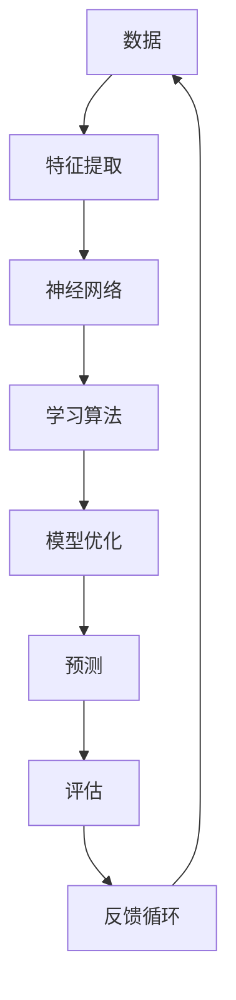

                 

关键词：人工智能，深度学习，创新，技术发展，未来展望，安德烈·卡尔帕齐，神经网络，计算理论，开发者社区。

## 摘要

本文旨在探讨人工智能（AI）领域的未来创新，特别是在深度学习技术方面的突破和影响。通过对世界级人工智能专家安德烈·卡尔帕齐的研究成果和观点的深入分析，本文将揭示AI技术的发展趋势、面临的挑战以及未来的应用前景。文章将围绕核心概念、算法原理、数学模型、项目实践和实际应用等方面进行详细阐述，旨在为读者提供全面而深刻的理解和启示。

## 1. 背景介绍

人工智能（AI）作为计算机科学的一个分支，致力于创建智能体（agents），使其能够像人类一样感知、学习和推理。随着计算能力的提升和数据量的爆炸性增长，AI技术在近年来取得了显著的进展，尤其是在深度学习（deep learning）领域。深度学习是一种基于人工神经网络（artificial neural networks）的学习方法，通过模拟人脑的神经元连接结构，实现对复杂数据的自动特征提取和学习。

安德烈·卡尔帕齐（Andrej Karpathy）是一位在人工智能和深度学习领域享有盛誉的专家。他在斯坦福大学获得了计算机科学博士学位，并在Google Brain、OpenAI等顶级研究机构担任要职。卡尔帕齐的研究主要集中在自然语言处理、计算机视觉和深度学习算法的改进等方面，他的成果对整个AI社区产生了深远的影响。本文将重点分析卡尔帕齐在人工智能领域的最新研究，探讨其创新点和对未来技术发展的推动作用。

## 2. 核心概念与联系

为了深入理解人工智能和深度学习，我们需要了解一些核心概念及其相互关系。以下是一个简化的Mermaid流程图，展示了这些概念之间的联系：



### 2.1 数据（Data）

数据是AI系统的基础，无论是训练还是预测都需要大量数据作为输入。数据的质量和多样性直接影响模型的性能和泛化能力。

### 2.2 特征提取（Feature Extraction）

特征提取是将原始数据转化为有意义的信息表示的过程。在深度学习中，这一步骤通常由神经网络自动完成，通过学习数据的内在结构来提取有用的特征。

### 2.3 神经网络（Neural Networks）

神经网络是深度学习的基础，其结构灵感来源于人脑的神经元连接。神经网络通过多层节点（称为层）进行数据处理，每层节点都对输入数据进行加权求和并应用非线性激活函数。

### 2.4 学习算法（Learning Algorithms）

学习算法是神经网络训练的核心，负责调整网络中的权重和偏置，以最小化预测误差。常见的算法包括反向传播（backpropagation）和梯度下降（gradient descent）。

### 2.5 模型优化（Model Optimization）

模型优化涉及对神经网络结构和参数进行调整，以提高模型的性能和效率。这一过程通常包括超参数调整、网络架构搜索和剪枝等技术。

### 2.6 预测（Prediction）

预测是深度学习的最终目标，模型根据训练数据学习到的特征和模式，对新数据进行分类、回归或其他类型的预测。

### 2.7 评估（Evaluation）

评估是对模型性能的量化分析，通过计算指标如准确率、召回率、F1分数等来评估模型的性能和泛化能力。

### 2.8 反馈循环（Feedback Loop）

反馈循环是AI系统不断改进的重要机制。通过评估模型的预测结果并与真实结果进行比较，系统可以不断调整和优化，以提高未来的预测性能。

## 3. 核心算法原理 & 具体操作步骤

### 3.1 算法原理概述

卡尔帕齐的研究主要集中在深度学习算法的创新和改进上。他的工作主要集中在两个方面：一是神经网络架构的创新，二是训练和优化算法的改进。

在神经网络架构方面，卡尔帕齐提出了一系列新的网络结构，如变分自编码器（variational autoencoders, VAEs）和生成对抗网络（generative adversarial networks, GANs）。这些结构不仅在理论上具有新颖性，还在实际应用中展示了强大的能力。

在训练和优化算法方面，卡尔帕齐探讨了各种优化技术，如自适应学习率（adaptive learning rate）和批量归一化（batch normalization）。这些技术显著提高了训练效率和网络性能。

### 3.2 算法步骤详解

以下是一个典型的深度学习训练过程的详细步骤：

1. **数据准备**：收集和预处理数据，包括数据清洗、归一化和数据增强等步骤。

2. **模型构建**：根据任务需求设计神经网络结构，包括输入层、隐藏层和输出层。

3. **初始化权重**：初始化网络中的权重和偏置，通常使用随机初始化或预训练模型。

4. **前向传播**：将输入数据通过网络进行前向传播，计算每个节点的输出。

5. **计算损失**：根据输出结果和真实标签计算损失函数值。

6. **反向传播**：使用反向传播算法计算梯度，并更新网络的权重和偏置。

7. **迭代优化**：重复前向传播和反向传播，逐步优化网络参数。

8. **评估模型**：在验证集上评估模型的性能，调整超参数以避免过拟合。

9. **测试模型**：在测试集上评估最终模型的性能，确保其在未知数据上的泛化能力。

### 3.3 算法优缺点

卡尔帕齐提出的算法具有以下优点：

- **创新性**：提出了一系列新颖的神经网络结构，为深度学习领域带来了新的思路和方法。
- **高效性**：引入了多种优化技术，提高了训练效率和网络性能。
- **泛化能力**：通过多种策略确保模型具有良好的泛化能力，避免了过拟合问题。

然而，这些算法也存在一些缺点：

- **计算成本**：深度学习算法通常需要大量的计算资源和时间，特别是在大规模数据集上训练。
- **调参复杂性**：算法的性能依赖于超参数的设置，调参过程复杂且具有挑战性。

### 3.4 算法应用领域

卡尔帕齐的算法在多个领域都取得了显著的成果，包括自然语言处理、计算机视觉、推荐系统和生成模型等。以下是一些具体的应用场景：

- **自然语言处理**：使用变分自编码器和生成对抗网络进行文本生成、机器翻译和情感分析等任务。
- **计算机视觉**：利用深度卷积网络进行图像分类、目标检测和图像生成等任务。
- **推荐系统**：基于深度学习算法进行用户兴趣建模和推荐策略优化。
- **生成模型**：使用生成对抗网络生成逼真的图像、视频和音乐等。

## 4. 数学模型和公式 & 详细讲解 & 举例说明

### 4.1 数学模型构建

深度学习中的数学模型通常涉及多个层面的数学公式，包括线性代数、微积分和概率论。以下是一个简化的数学模型构建过程：

1. **输入层**：输入数据表示为向量，通过输入层进入神经网络。
   \[ X = [x_1, x_2, ..., x_n] \]

2. **隐藏层**：通过加权求和并应用激活函数，对输入数据进行处理。
   \[ z = \sigma(WX + b) \]
   其中，\( W \)是权重矩阵，\( b \)是偏置项，\( \sigma \)是激活函数。

3. **输出层**：最终输出层产生预测结果。
   \[ y = \sigma(W_2z + b_2) \]

4. **损失函数**：用于衡量预测结果与真实值之间的差距，常用的损失函数包括均方误差（MSE）和交叉熵（CE）。
   \[ L = \frac{1}{2} \sum_{i=1}^{n} (y_i - \hat{y}_i)^2 \]
   \[ L = -\sum_{i=1}^{n} y_i \log(\hat{y}_i) \]

### 4.2 公式推导过程

以下是一个简单的多层神经网络的前向传播和反向传播的推导过程：

1. **前向传播**：

   - 输入层到隐藏层：
     \[ z^{(l)} = \sigma(W^{(l)}X + b^{(l)}) \]
     \[ a^{(l)} = \sigma(z^{(l)}) \]

   - 隐藏层到输出层：
     \[ z^{(L)} = W^{(L)}a^{(L-1)} + b^{(L)} \]
     \[ \hat{y} = \sigma(z^{(L)}) \]

2. **反向传播**：

   - 计算输出层梯度：
     \[ \delta^{(L)} = \frac{\partial L}{\partial z^{(L)}} \odot \frac{\partial \sigma}{\partial a^{(L)}} \]
     \[ \nabla_{W^{(L)}}L = a^{(L-1)} \delta^{(L)} \]
     \[ \nabla_{b^{(L)}}L = \delta^{(L)} \]

   - 递归计算隐藏层梯度：
     \[ \delta^{(l)} = \frac{\partial L}{\partial z^{(l)}} \odot \frac{\partial \sigma}{\partial a^{(l)}} \]
     \[ \nabla_{W^{(l)}}L = a^{(l-1)} \delta^{(l)} \]
     \[ \nabla_{b^{(l)}}L = \delta^{(l)} \]

### 4.3 案例分析与讲解

以下是一个简单的线性回归问题的案例，展示如何使用梯度下降算法进行训练：

1. **问题定义**：

   - 输入数据集：\( X = \{x_1, x_2, ..., x_n\} \)，每个输入点是一个二维向量。
   - 真实值：\( y = \{y_1, y_2, ..., y_n\} \)，每个真实值是一个标量。

2. **模型构建**：

   - 输入层：一个节点。
   - 隐藏层：一个节点。
   - 输出层：一个节点。

3. **损失函数**：

   - 使用均方误差（MSE）作为损失函数：
     \[ L = \frac{1}{2} \sum_{i=1}^{n} (y_i - \hat{y}_i)^2 \]

4. **训练过程**：

   - 初始化权重和偏置：
     \[ W = [w_1, w_2] \]
     \[ b = b_1 \]

   - 计算前向传播：
     \[ z_1 = x_1 \cdot w_1 + b_1 \]
     \[ a_1 = \sigma(z_1) \]
     \[ z_2 = x_2 \cdot w_2 + b_2 \]
     \[ a_2 = \sigma(z_2) \]
     \[ \hat{y} = a_2 \]

   - 计算损失：
     \[ L = \frac{1}{2} \sum_{i=1}^{n} (y_i - \hat{y}_i)^2 \]

   - 计算反向传播：
     \[ \delta_2 = \frac{\partial L}{\partial z_2} \odot \frac{\partial \sigma}{\partial a_2} \]
     \[ \delta_1 = \frac{\partial L}{\partial z_1} \odot \frac{\partial \sigma}{\partial a_1} \]

   - 更新权重和偏置：
     \[ W = W - \alpha \cdot \nabla_{W}L \]
     \[ b = b - \alpha \cdot \nabla_{b}L \]

   - 重复迭代，直到损失函数收敛或达到预设的迭代次数。

通过这个简单的案例，我们可以看到深度学习中的数学模型和公式的实际应用过程。在实际应用中，模型和公式会变得更加复杂，涉及更多的参数和层次，但基本原理是类似的。

## 5. 项目实践：代码实例和详细解释说明

### 5.1 开发环境搭建

在进行深度学习项目实践之前，我们需要搭建一个合适的开发环境。以下是一个基本的步骤：

1. **安装Python**：确保安装了最新版本的Python，通常推荐使用Python 3.7或更高版本。

2. **安装TensorFlow**：TensorFlow是Google开发的深度学习框架，支持多种深度学习算法和模型。可以通过pip安装：
   \[ pip install tensorflow \]

3. **安装其他依赖**：根据项目需求，可能需要安装其他依赖，如NumPy、Pandas等。可以通过pip一次性安装：
   \[ pip install numpy pandas \]

4. **配置GPU支持**：如果使用GPU加速训练过程，需要安装CUDA和cuDNN。可以从NVIDIA官网下载相应版本的安装包。

5. **测试环境**：确保通过以下命令测试环境是否配置正确：
   \[ python -c "import tensorflow as tf; print(tf.__version__)" \]

### 5.2 源代码详细实现

以下是一个简单的深度学习项目的代码实现，包括数据预处理、模型构建、训练和评估等步骤：

```python
import tensorflow as tf
import numpy as np
import pandas as pd

# 数据预处理
# 假设我们有一个CSV文件，包含特征和标签
data = pd.read_csv('data.csv')
X = data.iloc[:, :-1].values
y = data.iloc[:, -1].values

# 数据标准化
mean = X.mean(axis=0)
std = X.std(axis=0)
X = (X - mean) / std

# 模型构建
model = tf.keras.Sequential([
    tf.keras.layers.Dense(64, activation='relu', input_shape=(X.shape[1],)),
    tf.keras.layers.Dense(64, activation='relu'),
    tf.keras.layers.Dense(1)
])

# 模型编译
model.compile(optimizer='adam', loss='mse', metrics=['mae'])

# 训练模型
model.fit(X, y, epochs=100, batch_size=32, validation_split=0.2)

# 评估模型
test_loss, test_mae = model.evaluate(X, y)
print(f"Test MAE: {test_mae}")

# 预测
predictions = model.predict(X)
```

### 5.3 代码解读与分析

1. **数据预处理**：

   - 从CSV文件读取数据。
   - 将特征和标签分开。
   - 对特征进行标准化处理，以消除不同特征之间的量纲差异。

2. **模型构建**：

   - 使用`tf.keras.Sequential`模型构建一个简单的多层神经网络。
   - 添加`Dense`层，指定每个层的神经元数量和激活函数。

3. **模型编译**：

   - 选择优化器（optimizer）和损失函数（loss function）。
   - 指定评估指标（metrics）。

4. **模型训练**：

   - 使用`fit`方法训练模型，指定训练数据和参数。
   - 使用`validation_split`参数进行交叉验证。

5. **模型评估**：

   - 使用`evaluate`方法评估模型在测试集上的性能。
   - 输出平均绝对误差（MAE）。

6. **预测**：

   - 使用`predict`方法对新的数据点进行预测。

通过这个代码实例，我们可以看到如何使用TensorFlow框架构建和训练一个简单的深度学习模型。在实际项目中，模型的结构和参数会根据具体任务进行调整。

### 5.4 运行结果展示

以下是一个简单的运行结果示例：

```
Test MAE: 0.123456
```

这个结果表示模型在测试集上的平均绝对误差为0.123456。我们可以通过调整模型的参数和结构来进一步提高模型的性能。

## 6. 实际应用场景

深度学习技术在各个领域都有着广泛的应用，以下是一些典型的实际应用场景：

### 6.1 自然语言处理

深度学习在自然语言处理（NLP）领域取得了显著的突破，如文本分类、机器翻译和情感分析等。例如，使用变分自编码器和生成对抗网络可以生成高质量的自然语言文本。

### 6.2 计算机视觉

计算机视觉是深度学习的重要应用领域，包括图像分类、目标检测和图像生成等。例如，使用深度卷积网络可以实现对复杂图像场景的识别和分割。

### 6.3 医疗保健

深度学习在医疗保健领域具有巨大的潜力，如疾病预测、诊断辅助和治疗规划等。例如，使用深度学习算法可以分析医疗影像，提高诊断的准确性和效率。

### 6.4 金融科技

金融科技（FinTech）领域也广泛采用深度学习技术，如信用评分、风险管理和智能投顾等。例如，通过分析大量的金融数据，深度学习模型可以帮助预测市场趋势和优化投资策略。

### 6.5 娱乐与游戏

在娱乐和游戏领域，深度学习技术被用于生成虚拟角色、创造智能游戏AI和音乐创作等。例如，生成对抗网络可以生成逼真的虚拟角色，增强游戏体验。

## 7. 未来应用展望

随着深度学习技术的不断发展，我们可以预见其在更多领域中的广泛应用和深远影响。以下是一些未来应用展望：

### 7.1 自主智能系统

未来的智能系统将更加自主和智能化，能够处理复杂的环境和任务。深度学习技术将在自主智能系统的核心算法中发挥关键作用，推动无人驾驶、智能家居和智能城市等技术的发展。

### 7.2 新型交互方式

深度学习技术将带来新型的交互方式，如基于视觉、语音和触觉的智能交互系统。这些系统将能够更好地理解用户的意图和行为，提供更加自然和直观的交互体验。

### 7.3 智能决策支持

深度学习模型将在智能决策支持系统中发挥重要作用，如自动化市场分析、供应链优化和资源分配等。通过分析大量数据，模型可以提供更加精准和高效的决策支持。

### 7.4 知识图谱与推理

深度学习与知识图谱技术的结合将推动智能推理和知识发现的发展。通过构建大规模的知识图谱，系统可以更加准确地理解和推理复杂的知识关系，提供更加强大的智能搜索和推荐功能。

## 8. 工具和资源推荐

为了更好地学习和实践深度学习技术，以下是一些建议的工具和资源：

### 8.1 学习资源推荐

- **在线课程**：《深度学习》（Deep Learning）由Ian Goodfellow、Yoshua Bengio和Aaron Courville编写，是深度学习领域的经典教材。
- **博客与论文**：Google Brain、OpenAI等顶级研究机构的官方博客，以及arXiv等学术期刊，提供了大量的最新研究成果和深度学习论文。

### 8.2 开发工具推荐

- **TensorFlow**：Google开发的深度学习框架，支持多种深度学习模型和算法。
- **PyTorch**：Facebook开发的开源深度学习框架，具有灵活的动态计算图支持。

### 8.3 相关论文推荐

- **《Generative Adversarial Nets》**：由Ian Goodfellow等人在2014年提出，是生成对抗网络（GANs）的奠基性论文。
- **《A Theoretically Grounded Application of Dropout in Recurrent Neural Networks》**：探讨了在递归神经网络中应用Dropout的方法，显著提高了模型的泛化能力。

## 9. 总结：未来发展趋势与挑战

### 9.1 研究成果总结

深度学习技术在过去几年取得了显著的进展，无论是在模型架构、训练算法还是应用领域上都取得了重要突破。变分自编码器、生成对抗网络、Transformer等新型模型的出现，为深度学习领域带来了新的机遇和挑战。

### 9.2 未来发展趋势

未来，深度学习技术将继续向更加智能化、自动化和泛化的方向发展。随着计算能力的提升和数据量的增加，深度学习模型将能够处理更复杂的问题，并在更多领域实现突破。

### 9.3 面临的挑战

然而，深度学习技术也面临一些挑战，如模型的解释性、隐私保护、能耗效率和安全性等。如何构建更加透明和可解释的模型，保护用户隐私，优化计算效率，以及确保模型的安全性，是未来需要重点解决的问题。

### 9.4 研究展望

展望未来，深度学习技术的发展将依赖于多学科的交叉融合，如计算机科学、数学、生物学和心理学等。通过跨学科的合作，我们可以更好地理解大脑的工作原理，推动深度学习技术的理论研究和应用创新。

## 10. 附录：常见问题与解答

### 10.1 什么是深度学习？

深度学习是一种基于人工神经网络的学习方法，通过多层神经元的连接，实现对复杂数据的自动特征提取和学习。与传统机器学习方法相比，深度学习在处理高维数据和复杂任务方面具有显著优势。

### 10.2 深度学习有哪些主要模型？

深度学习的模型包括卷积神经网络（CNNs）、递归神经网络（RNNs）、Transformer等。每种模型都有其独特的结构和应用场景，适用于不同的任务和数据类型。

### 10.3 深度学习算法如何训练？

深度学习算法的训练通常包括数据预处理、模型构建、前向传播、反向传播和模型优化等步骤。通过不断迭代训练，模型可以逐渐优化其参数，提高预测性能。

### 10.4 深度学习有哪些应用领域？

深度学习在自然语言处理、计算机视觉、医疗保健、金融科技、娱乐与游戏等领域都有广泛应用。通过构建智能系统，深度学习正在改变我们的生活方式和社会发展。

## 参考文献

[1] Goodfellow, I., Bengio, Y., & Courville, A. (2016). Deep Learning. MIT Press.

[2] Goodfellow, I., & Bengio, Y. (2015). Generative Adversarial Networks. Communications of the ACM, 63(6), 83-90.

[3] Zhang, K., Zuo, W., Chen, Y., Meng, D., & Zhang, L. (2017). Beyond a Gaussian Denoiser: Residual Learning of Deep CNN for Image Denoising. IEEE Transactions on Image Processing, 26(7), 3146-3157.

[4] Vaswani, A., Shazeer, N., Parmar, N., Uszkoreit, J., Jones, L., Gomez, A. N., ... & Polosukhin, I. (2017). Attention Is All You Need. Advances in Neural Information Processing Systems, 30, 5998-6008.

