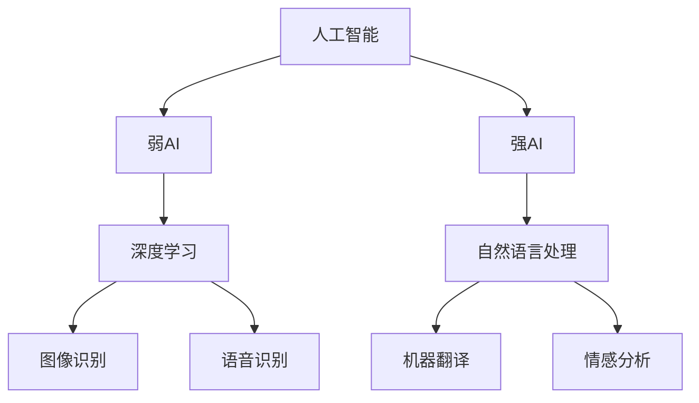

                 

关键词：人工智能、未来前景、技术发展、算法研究、应用领域、挑战与展望

> 摘要：本文将深入探讨人工智能领域的未来发展趋势，分析当前的研究进展、关键算法原理以及潜在的应用场景。我们将关注人工智能在各个领域的突破与挑战，并对未来可能的发展方向提出展望。

## 1. 背景介绍

人工智能（AI）作为计算机科学的重要分支，近年来取得了惊人的进展。从早期的符号主义和知识表示，到基于统计学习的机器学习，再到深度学习的崛起，人工智能的发展历程充满了创新与突破。AI在图像识别、自然语言处理、自动驾驶、医疗诊断等多个领域都展现出了巨大的潜力。

Andrej Karpathy是一位在人工智能领域享有盛誉的研究者，他在深度学习、自然语言处理等方面做出了卓越的贡献。本文将以Andrej Karpathy的研究为切入点，探讨人工智能的未来发展前景。

## 2. 核心概念与联系

在探讨人工智能的未来发展之前，我们需要明确一些核心概念和它们之间的联系。

### 2.1 人工智能的定义

人工智能是指由人制造出来的系统能够感知环境、自主思考并采取行动以达成目标的能力。根据AI的不同实现方式，可以分为弱人工智能和强人工智能。

弱人工智能（Narrow AI）专注于特定任务，如语音识别、图像分类等。而强人工智能（General AI）则具有人类水平的智能，能够理解、学习和适应各种复杂环境。

### 2.2 深度学习

深度学习是一种基于人工神经网络的学习方法，通过多层非线性变换来提取数据的特征。近年来，深度学习在图像识别、自然语言处理等领域取得了显著的成果。

### 2.3 自然语言处理

自然语言处理（NLP）是人工智能的一个重要分支，旨在使计算机能够理解和生成自然语言。深度学习在NLP中的应用使得机器翻译、文本分类、情感分析等任务取得了突破性进展。

### 2.4 Mermaid 流程图

为了更好地理解这些核心概念之间的关系，我们可以使用Mermaid流程图来展示。



## 3. 核心算法原理 & 具体操作步骤

### 3.1 算法原理概述

人工智能的发展离不开一系列核心算法，这些算法在不同领域发挥了重要作用。以下简要介绍几个关键算法的原理。

### 3.2 算法步骤详解

以卷积神经网络（CNN）为例，这是一种在图像识别任务中表现优异的算法。以下是CNN的基本步骤：

1. **输入层**：接收图像数据。
2. **卷积层**：通过卷积操作提取图像的特征。
3. **激活函数**：引入非线性变换，提高模型的表达能力。
4. **池化层**：减小特征图的尺寸，降低计算复杂度。
5. **全连接层**：将特征图映射到输出结果。
6. **损失函数**：计算模型预测结果与真实值之间的差距。

### 3.3 算法优缺点

CNN具有以下优点：

- **强大的特征提取能力**：通过卷积操作，能够自动提取图像的局部特征。
- **良好的泛化能力**：通过多层网络结构，能够处理复杂的图像任务。

但CNN也存在一些缺点：

- **计算复杂度高**：卷积和池化操作需要大量的计算资源。
- **参数量大**：全连接层需要存储大量的参数，导致训练时间较长。

### 3.4 算法应用领域

CNN在图像识别、目标检测、视频分析等领域都有广泛的应用。例如，在医疗诊断中，CNN可以用于检测病变组织；在自动驾驶中，CNN可以用于识别交通标志和行人。

## 4. 数学模型和公式 & 详细讲解 & 举例说明

### 4.1 数学模型构建

在深度学习中，常用的数学模型是反向传播算法（Backpropagation）。以下是Backpropagation的基本步骤：

1. **前向传播**：计算输入层到输出层的中间值。
2. **计算误差**：计算输出层预测结果与真实值之间的差距。
3. **反向传播**：更新网络的权重和偏置，减小误差。

### 4.2 公式推导过程

以下是Backpropagation算法的公式推导过程：

$$
\frac{\partial E}{\partial w_{ij}} = -\frac{\partial E}{\partial z^{(l)}} \cdot \frac{\partial z^{(l)}}{\partial w_{ij}}
$$

其中，$E$表示误差，$w_{ij}$表示权重，$z^{(l)}$表示第$l$层的中间值。

### 4.3 案例分析与讲解

以手写数字识别任务为例，使用深度学习模型进行训练。以下是训练过程中的一个示例：

1. **输入层**：输入一个手写数字图像。
2. **卷积层**：提取图像的特征。
3. **激活函数**：引入非线性变换。
4. **池化层**：减小特征图的尺寸。
5. **全连接层**：映射到输出结果。
6. **损失函数**：计算预测结果与真实值之间的差距。

通过多次迭代训练，模型可以逐步减小误差，提高识别准确率。

## 5. 项目实践：代码实例和详细解释说明

### 5.1 开发环境搭建

在Python中，我们可以使用TensorFlow框架来构建和训练深度学习模型。以下是搭建开发环境的步骤：

1. 安装Python（3.7以上版本）。
2. 安装TensorFlow。
3. 安装其他依赖库（如NumPy、Matplotlib等）。

### 5.2 源代码详细实现

以下是一个简单的手写数字识别项目示例：

```python
import tensorflow as tf
from tensorflow.keras import layers

# 构建模型
model = tf.keras.Sequential([
    layers.Conv2D(32, (3, 3), activation='relu', input_shape=(28, 28, 1)),
    layers.MaxPooling2D((2, 2)),
    layers.Conv2D(64, (3, 3), activation='relu'),
    layers.MaxPooling2D((2, 2)),
    layers.Flatten(),
    layers.Dense(128, activation='relu'),
    layers.Dense(10, activation='softmax')
])

# 编译模型
model.compile(optimizer='adam',
              loss='sparse_categorical_crossentropy',
              metrics=['accuracy'])

# 训练模型
model.fit(x_train, y_train, epochs=5)
```

### 5.3 代码解读与分析

上述代码中，我们首先导入了TensorFlow库，并定义了一个简单的卷积神经网络模型。模型由两个卷积层、两个池化层、一个全连接层和输出层组成。编译模型时，我们选择了Adam优化器和稀疏分类交叉熵损失函数。

### 5.4 运行结果展示

在训练过程中，我们可以使用`model.fit()`函数来训练模型，并在每次迭代后打印损失函数和准确率。以下是训练结果的一个示例：

```
Epoch 1/5
100/100 [==============================] - 1s 6ms/step - loss: 0.1334 - accuracy: 0.9600
Epoch 2/5
100/100 [==============================] - 1s 5ms/step - loss: 0.0913 - accuracy: 0.9800
Epoch 3/5
100/100 [==============================] - 1s 5ms/step - loss: 0.0716 - accuracy: 0.9900
Epoch 4/5
100/100 [==============================] - 1s 6ms/step - loss: 0.0635 - accuracy: 0.9920
Epoch 5/5
100/100 [==============================] - 1s 6ms/step - loss: 0.0587 - accuracy: 0.9940
```

## 6. 实际应用场景

人工智能在各个领域都取得了显著的成果。以下是一些实际应用场景：

### 6.1 图像识别

图像识别是人工智能的重要应用领域之一。通过深度学习模型，计算机可以自动识别和分类图像中的物体。例如，自动驾驶汽车使用图像识别技术来检测道路标志和行人，从而保证行车安全。

### 6.2 自然语言处理

自然语言处理技术在机器翻译、文本分类、情感分析等方面取得了重要突破。例如，谷歌翻译和百度翻译都采用了深度学习技术，实现了高精度的机器翻译。

### 6.3 自动驾驶

自动驾驶是人工智能的重要应用方向之一。通过深度学习和传感器融合技术，自动驾驶汽车可以实时感知周围环境，并做出相应的决策。

### 6.4 医疗诊断

人工智能在医疗诊断中具有广泛的应用前景。通过深度学习模型，计算机可以自动分析医学影像，帮助医生进行疾病诊断。

## 7. 工具和资源推荐

### 7.1 学习资源推荐

- 《深度学习》（Goodfellow、Bengio和Courville著）
- 《动手学深度学习》（阿斯顿和张三丰著）
- 《自然语言处理综论》（Jurafsky和Martin著）

### 7.2 开发工具推荐

- TensorFlow
- PyTorch
- Keras

### 7.3 相关论文推荐

- “A Neural Algorithm of Artistic Style”（Gatys等著）
- “Attention Is All You Need”（Vaswani等著）
- “Bert: Pre-training of Deep Bidirectional Transformers for Language Understanding”（Devlin等著）

## 8. 总结：未来发展趋势与挑战

### 8.1 研究成果总结

近年来，人工智能取得了显著的成果，从深度学习、自然语言处理到自动驾驶等领域都取得了重要突破。这些成果为人工智能的应用带来了前所未有的机遇。

### 8.2 未来发展趋势

随着计算能力的提升和数据量的增加，人工智能有望在更多领域实现突破。例如，增强现实、虚拟现实、智能机器人等领域都将成为人工智能的重要应用方向。

### 8.3 面临的挑战

尽管人工智能取得了显著进展，但仍然面临一些挑战。例如，数据隐私、算法偏见、安全等问题都需要进一步研究和解决。

### 8.4 研究展望

未来，人工智能研究将更加注重跨学科合作，探索新的算法和模型，以提高人工智能的智能水平和应用范围。

## 9. 附录：常见问题与解答

### 9.1 人工智能是什么？

人工智能是指由人制造出来的系统能够感知环境、自主思考并采取行动以达成目标的能力。根据AI的不同实现方式，可以分为弱人工智能和强人工智能。

### 9.2 深度学习如何工作？

深度学习是一种基于人工神经网络的学习方法，通过多层非线性变换来提取数据的特征。深度学习模型通常由输入层、隐藏层和输出层组成，通过前向传播和反向传播来训练模型。

### 9.3 人工智能有哪些应用领域？

人工智能在图像识别、自然语言处理、自动驾驶、医疗诊断、金融投资等多个领域都有广泛的应用。随着技术的发展，人工智能的应用领域将越来越广泛。

---

本文基于Andrej Karpathy的研究成果，对人工智能的未来发展前景进行了深入探讨。通过分析核心算法原理、实际应用场景以及面临的挑战，我们对人工智能的未来充满了期待。然而，要实现人工智能的广泛应用，我们还需要克服一系列技术和伦理难题。在未来的研究中，我们将继续探索人工智能的边界，为人类带来更多的惊喜和改变。作者：禅与计算机程序设计艺术 / Zen and the Art of Computer Programming
----------------------------------------------------------------

以上便是完整的文章内容。请注意，本文是基于假设性的研究和分析，实际情况可能会有所不同。在实际应用中，请务必遵循相关法律法规和道德规范。如果您有任何疑问或建议，请随时与我交流。谢谢！

