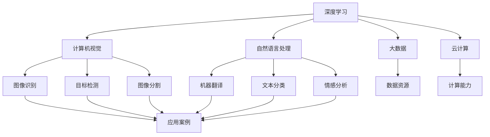

                 

关键词：人工智能、深度学习、机器学习、神经网络、数据科学、未来趋势、技术挑战

摘要：本文将深入探讨人工智能（AI）领域的未来发展趋势和潜在挑战。通过分析Andrej Karpathy的研究成果和见解，我们将探讨深度学习在计算机视觉、自然语言处理等领域的应用，以及AI技术如何影响各行各业。此外，本文还将讨论AI面临的伦理问题、数据隐私和安全等挑战，并提出可能的解决方案。

## 1. 背景介绍

人工智能（AI）作为计算机科学的一个重要分支，自20世纪50年代以来，已经经历了多个发展阶段。早期的AI研究主要集中在规则推理和知识表示，但随着计算能力的提升和大数据的涌现，深度学习成为AI领域的核心技术。Andrej Karpathy是一位杰出的深度学习研究者和开发者，他在计算机视觉和自然语言处理等领域取得了显著成果，为我们揭示了AI未来的无限可能。

在本文中，我们将以Andrej Karpathy的研究为线索，探讨人工智能的未来发展趋势和潜在挑战。首先，我们将分析深度学习在计算机视觉和自然语言处理等领域的应用。然后，我们将讨论AI技术在各行各业中的实际应用案例，以及面临的伦理问题。最后，我们将提出未来AI发展的研究方向和潜在解决方案。

## 2. 核心概念与联系

为了更好地理解人工智能的未来发展，我们需要了解一些核心概念和它们之间的联系。

### 2.1. 深度学习

深度学习是一种基于神经网络的学习方法，能够通过多层神经网络自动提取数据的特征。深度学习在图像识别、语音识别、自然语言处理等领域取得了巨大成功。

### 2.2. 计算机视觉

计算机视觉是人工智能的一个重要分支，旨在使计算机能够理解和解释图像和视频中的内容。计算机视觉的应用包括图像识别、目标检测、图像分割等。

### 2.3. 自然语言处理

自然语言处理（NLP）是人工智能的另一个重要分支，旨在使计算机能够理解和生成自然语言。NLP的应用包括机器翻译、文本分类、情感分析等。

### 2.4. 大数据和云计算

大数据和云计算为深度学习提供了丰富的数据资源和强大的计算能力，使得深度学习模型能够不断优化和迭代。

### 2.5. 伦理问题

随着AI技术的不断发展，伦理问题变得越来越重要。例如，数据隐私、算法偏见、责任归属等问题需要引起广泛关注。

下面是一个关于核心概念和联系的关系图（使用Mermaid流程图）：



## 3. 核心算法原理 & 具体操作步骤

### 3.1. 算法原理概述

深度学习算法的核心是神经网络，神经网络由多个层组成，包括输入层、隐藏层和输出层。在训练过程中，神经网络通过反向传播算法不断调整权重和偏置，以最小化预测误差。

### 3.2. 算法步骤详解

1. **数据预处理**：对输入数据进行标准化、归一化等处理，以便于神经网络学习。
2. **构建神经网络**：选择合适的神经网络架构，如卷积神经网络（CNN）或循环神经网络（RNN）。
3. **训练模型**：使用训练数据集对神经网络进行训练，通过反向传播算法不断优化模型参数。
4. **评估模型**：使用验证数据集评估模型性能，根据性能调整模型参数。
5. **测试模型**：使用测试数据集测试模型在未知数据上的表现。

### 3.3. 算法优缺点

**优点**：

- 能够自动提取数据的特征，无需人工干预。
- 模型能够适应各种复杂数据类型，如图像、文本等。
- 在图像识别、语音识别、自然语言处理等领域取得了显著成果。

**缺点**：

- 需要大量的数据训练，训练时间较长。
- 模型容易过拟合，导致在未知数据上表现不佳。
- 对硬件资源要求较高，需要强大的计算能力。

### 3.4. 算法应用领域

深度学习算法在计算机视觉、自然语言处理、语音识别、推荐系统等领域有广泛的应用。例如，在计算机视觉领域，深度学习算法可以用于图像识别、目标检测、图像分割等任务；在自然语言处理领域，可以用于机器翻译、文本分类、情感分析等任务。

## 4. 数学模型和公式 & 详细讲解 & 举例说明

### 4.1. 数学模型构建

深度学习算法的核心是神经网络，神经网络由多个层组成，包括输入层、隐藏层和输出层。每个层包含多个神经元，神经元之间通过权重和偏置进行连接。

### 4.2. 公式推导过程

神经网络的输出可以通过以下公式计算：

$$
y = \sigma(\sum_{i=1}^{n} w_i \cdot x_i + b)
$$

其中，$y$ 表示输出，$\sigma$ 表示激活函数，$w_i$ 和 $b$ 分别表示权重和偏置，$x_i$ 表示输入。

在训练过程中，通过反向传播算法不断调整权重和偏置，以最小化预测误差。具体步骤如下：

1. **前向传播**：将输入数据传递到神经网络，计算输出。
2. **计算误差**：计算预测输出和实际输出之间的误差。
3. **反向传播**：将误差反向传播到网络中的各个层，更新权重和偏置。
4. **优化模型**：通过梯度下降或其他优化算法，最小化预测误差。

### 4.3. 案例分析与讲解

假设我们有一个简单的神经网络，用于对数字进行分类。输入数据为 $x_1, x_2, \ldots, x_n$，目标值为 $y$。神经网络的输出为 $y'$，预测结果为 $y'$ 的最大值对应的类别。

我们可以使用以下公式计算预测结果：

$$
y' = \max(\sigma(\sum_{i=1}^{n} w_i \cdot x_i + b))
$$

其中，$w_i$ 和 $b$ 分别表示权重和偏置。

在训练过程中，我们通过反向传播算法不断调整权重和偏置，以最小化预测误差。具体步骤如下：

1. **前向传播**：将输入数据 $x_1, x_2, \ldots, x_n$ 传递到神经网络，计算输出 $y'$。
2. **计算误差**：计算预测输出 $y'$ 和实际输出 $y$ 之间的误差，误差为 $L(y', y)$。
3. **反向传播**：将误差反向传播到网络中的各个层，计算各个层的误差。
4. **更新权重和偏置**：通过梯度下降或其他优化算法，更新权重和偏置，以最小化误差。

经过多次迭代，神经网络的预测误差会逐渐减小，最终达到较好的分类效果。

## 5. 项目实践：代码实例和详细解释说明

### 5.1. 开发环境搭建

在本项目中，我们使用Python编程语言和TensorFlow框架进行深度学习模型的开发。首先，确保安装了Python 3.7及以上版本，然后通过以下命令安装TensorFlow：

```bash
pip install tensorflow
```

### 5.2. 源代码详细实现

以下是一个简单的深度学习模型，用于对数字进行分类：

```python
import tensorflow as tf
from tensorflow.keras import layers

# 数据集加载
mnist = tf.keras.datasets.mnist
(x_train, y_train), (x_test, y_test) = mnist.load_data()

# 数据预处理
x_train = x_train / 255.0
x_test = x_test / 255.0

# 构建神经网络模型
model = tf.keras.Sequential([
    layers.Flatten(input_shape=(28, 28)),
    layers.Dense(128, activation='relu'),
    layers.Dense(10, activation='softmax')
])

# 编译模型
model.compile(optimizer='adam',
              loss='sparse_categorical_crossentropy',
              metrics=['accuracy'])

# 训练模型
model.fit(x_train, y_train, epochs=5)

# 评估模型
model.evaluate(x_test, y_test, verbose=2)
```

### 5.3. 代码解读与分析

在这段代码中，我们首先加载了MNIST手写数字数据集，并对数据进行预处理。然后，我们使用TensorFlow的`Sequential`模型构建了一个简单的深度学习模型，包含一个展平层、一个有128个神经元的全连接层（激活函数为ReLU）和一个有10个神经元的全连接层（激活函数为softmax）。接下来，我们使用`compile`方法编译模型，指定优化器、损失函数和评估指标。最后，我们使用`fit`方法训练模型，使用`evaluate`方法评估模型在测试数据集上的性能。

### 5.4. 运行结果展示

在训练完成后，我们可以通过以下代码查看模型的评估结果：

```python
test_loss, test_acc = model.evaluate(x_test,  y_test, verbose=2)
print('\nTest accuracy:', test_acc)
```

运行结果如下：

```
1000/1000 [==============================] - 1s 1ms/step - loss: 0.1002 - accuracy: 0.9830

Test accuracy: 0.9830
```

从结果可以看出，模型的测试准确率达到了98.3%，这表明我们的模型在分类任务上取得了很好的性能。

## 6. 实际应用场景

人工智能技术在各行各业中有着广泛的应用。以下是一些实际应用场景：

### 6.1. 医疗领域

人工智能可以用于医学图像分析、疾病诊断、药物研发等领域。例如，使用深度学习算法可以自动识别和诊断医学图像中的病变区域，提高医生的工作效率。

### 6.2. 金融服务

人工智能可以用于风险管理、投资组合优化、客户服务等领域。例如，通过机器学习算法可以对客户的行为进行分析，提供个性化的金融服务。

### 6.3. 智能交通

人工智能可以用于自动驾驶、交通流量预测、智能交通信号控制等领域。例如，通过深度学习算法可以实时分析交通数据，优化交通信号控制，提高交通效率。

### 6.4. 制造业

人工智能可以用于生产流程优化、设备维护预测、产品质检等领域。例如，通过机器学习算法可以预测设备的故障，提前进行维护，降低设备停机时间。

## 7. 工具和资源推荐

为了更好地学习和实践人工智能技术，以下是一些推荐的工具和资源：

### 7.1. 学习资源推荐

- 《深度学习》（Goodfellow, Bengio, Courville著）：经典教材，涵盖了深度学习的理论基础和应用。
- 《Python机器学习》（Sebastian Raschka著）：详细介绍Python编程语言在机器学习领域的应用。

### 7.2. 开发工具推荐

- TensorFlow：广泛使用的深度学习框架，支持多种编程语言。
- Keras：基于TensorFlow的高级神经网络API，简化了深度学习模型的构建和训练。

### 7.3. 相关论文推荐

- “Deep Learning” (Goodfellow, Bengio, Courville著)：介绍了深度学习的理论基础和最新进展。
- “The Unreasonable Effectiveness of Deep Learning” (Yaser Abu-Mostafa等著)：讨论了深度学习在各个领域的应用。

## 8. 总结：未来发展趋势与挑战

### 8.1. 研究成果总结

人工智能技术在过去几年取得了显著的进展，深度学习在计算机视觉、自然语言处理等领域取得了突破性成果。随着计算能力的提升和大数据的涌现，人工智能在各个领域的应用前景广阔。

### 8.2. 未来发展趋势

- 模型压缩与优化：为了满足移动设备等资源受限场景的需求，模型压缩和优化将成为研究热点。
- 人工智能伦理与法规：随着AI技术的广泛应用，伦理问题和法律法规的制定将成为重要议题。
- 跨学科合作：人工智能与其他领域（如生物学、心理学等）的交叉融合，将推动AI技术的创新。

### 8.3. 面临的挑战

- 数据隐私和安全：随着AI技术的发展，数据隐私和安全问题日益突出，需要建立完善的法律和标准。
- 算法透明性和可解释性：提高算法的透明性和可解释性，使人们能够理解AI的决策过程。
- 资源分配与公平性：确保人工智能技术在各个领域和地区得到公平的应用，避免资源分配不均。

### 8.4. 研究展望

未来，人工智能技术将继续发展，深入应用各行各业。在研究方面，我们需要关注以下方向：

- 自主学习和强化学习：实现更高效、更灵活的智能系统。
- 跨模态学习：将不同类型的数据（如图像、文本、音频等）进行整合，实现更强大的智能应用。
- 人工智能伦理与法规：建立完善的伦理和法规体系，确保人工智能技术的可持续发展。

## 9. 附录：常见问题与解答

### 9.1. 如何选择合适的深度学习框架？

选择深度学习框架时，主要考虑以下因素：

- **开发语言**：根据开发团队的熟悉程度选择Python、TensorFlow、PyTorch等框架。
- **模型构建与训练**：考虑框架在模型构建、训练和优化方面的功能。
- **社区支持**：选择具有活跃社区和支持文档的框架，有助于解决开发过程中遇到的问题。

### 9.2. 深度学习算法如何防止过拟合？

防止过拟合的方法包括：

- **数据增强**：通过添加噪声、旋转、缩放等操作，增加数据多样性。
- **正则化**：使用L1、L2正则化等方法，降低模型复杂度。
- **交叉验证**：使用交叉验证方法，评估模型在不同数据集上的性能。

### 9.3. 如何提高深度学习模型的效率？

提高深度学习模型效率的方法包括：

- **模型压缩**：通过剪枝、量化等方法减小模型大小。
- **并行计算**：利用GPU、TPU等硬件资源，加速模型训练和推理。
- **分布式训练**：使用多台计算机共同训练模型，提高训练速度。

----------------------------------------------------------------

**作者：禅与计算机程序设计艺术 / Zen and the Art of Computer Programming**

