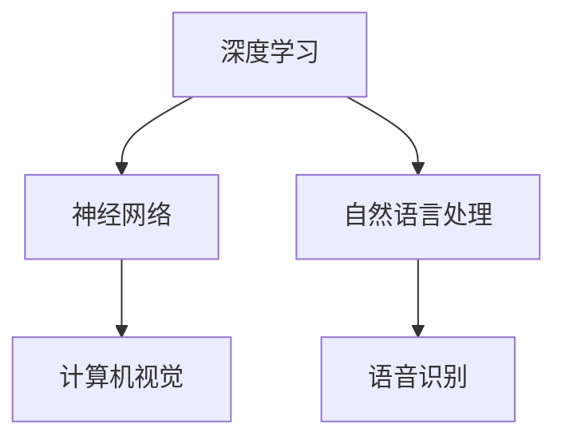

                 

关键词：Andrej Karpathy、人工智能、深度学习、未来挑战、发展趋势、技术突破

### 摘要

本文将探讨人工智能领域的杰出学者Andrej Karpathy对未来人工智能发展所面临的挑战的见解。文章分为八个部分，首先介绍背景，接着阐述核心概念，然后深入解析算法原理、数学模型、项目实践和实际应用场景，并展望未来发展趋势和挑战，最后推荐相关资源和提供常见问题的解答。

## 1. 背景介绍

Andrej Karpathy是一位世界著名的人工智能专家，其在深度学习和自然语言处理领域取得了显著的成就。他的研究不仅推动了人工智能技术的发展，也对人工智能在教育、医疗、自动驾驶等领域的广泛应用产生了深远影响。本文旨在深入分析Andrej Karpathy对未来人工智能发展的观点和面临的挑战，以期为读者提供对人工智能领域的更全面的认识。

## 2. 核心概念与联系

为了更好地理解人工智能的未来发展，我们需要了解一些核心概念，如深度学习、神经网络、自然语言处理等。以下是一个简化的Mermaid流程图，展示了这些概念之间的联系：



### 2.1 深度学习与神经网络

深度学习是一种基于神经网络的机器学习方法。神经网络是由大量相互连接的神经元组成的计算模型，通过层层递进的方式对输入数据进行处理，最终输出结果。深度学习则通过构建深层的神经网络，使计算机能够自动从大量数据中学习复杂的特征表示。

### 2.2 自然语言处理与计算机视觉

自然语言处理（NLP）是人工智能的一个分支，旨在使计算机能够理解和生成自然语言。计算机视觉则专注于使计算机能够理解和解释视觉信息。这两个领域都依赖于深度学习的强大能力，通过图像和文本数据的训练，实现诸如文本分类、图像识别、情感分析等任务。

## 3. 核心算法原理 & 具体操作步骤

### 3.1 算法原理概述

深度学习的核心算法包括卷积神经网络（CNN）、循环神经网络（RNN）和Transformer模型等。以下是对这些算法的简要概述：

- **卷积神经网络（CNN）**：CNN主要应用于图像识别和处理，通过卷积层、池化层和全连接层的组合，实现对图像的特征提取和分类。
- **循环神经网络（RNN）**：RNN适用于序列数据的处理，如时间序列分析、语音识别等。RNN通过循环结构将历史信息传递到当前时刻，实现对序列数据的记忆。
- **Transformer模型**：Transformer模型是近年来在自然语言处理领域取得突破的一种新型模型，通过自注意力机制实现对输入序列的全局依赖性建模。

### 3.2 算法步骤详解

#### 3.2.1 卷积神经网络（CNN）

CNN的基本步骤如下：

1. **输入层**：接收图像数据，将图像划分为多个局部区域。
2. **卷积层**：通过对图像进行卷积操作，提取图像的局部特征。
3. **池化层**：对卷积层输出的特征进行下采样，减少数据维度。
4. **全连接层**：将池化层输出的特征映射到分类结果。

#### 3.2.2 循环神经网络（RNN）

RNN的基本步骤如下：

1. **输入序列**：将输入序列表示为一系列向量。
2. **隐藏状态更新**：通过递归计算隐藏状态，将历史信息传递到当前时刻。
3. **输出层**：将隐藏状态映射到输出结果。

#### 3.2.3 Transformer模型

Transformer模型的基本步骤如下：

1. **编码器**：将输入序列编码为一系列向量。
2. **自注意力机制**：通过计算自注意力分数，将不同位置的输入向量进行加权。
3. **解码器**：将加权后的向量解码为输出结果。

### 3.3 算法优缺点

- **卷积神经网络（CNN）**：优点包括强大的图像特征提取能力和高效的计算性能；缺点包括对数据集的依赖性较强，难以处理复杂的图像理解任务。
- **循环神经网络（RNN）**：优点包括对序列数据的良好建模能力；缺点包括难以处理长序列，存在梯度消失和梯度爆炸问题。
- **Transformer模型**：优点包括全局依赖性建模能力强，对长序列处理效果好；缺点包括计算复杂度高，对数据集的要求较高。

### 3.4 算法应用领域

深度学习算法在多个领域取得了显著的应用成果，如：

- **计算机视觉**：图像分类、目标检测、人脸识别等。
- **自然语言处理**：文本分类、机器翻译、情感分析等。
- **语音识别**：语音信号处理、语音合成等。

## 4. 数学模型和公式 & 详细讲解 & 举例说明

### 4.1 数学模型构建

在深度学习中，常用的数学模型包括神经网络模型、损失函数和优化算法。以下是一个简化的神经网络模型的数学描述：

$$
y = \sigma(W \cdot x + b)
$$

其中，$y$ 表示输出结果，$\sigma$ 表示激活函数，$W$ 和 $b$ 分别表示权重和偏置，$x$ 表示输入向量。

### 4.2 公式推导过程

以下是一个简单的神经网络模型的损失函数和优化算法的推导：

#### 损失函数

均方误差（MSE）是最常用的损失函数之一，其公式如下：

$$
L(y, \hat{y}) = \frac{1}{2} \sum_{i=1}^{n} (y_i - \hat{y}_i)^2
$$

其中，$y$ 表示真实标签，$\hat{y}$ 表示预测结果。

#### 优化算法

梯度下降是一种常用的优化算法，其公式如下：

$$
W := W - \alpha \frac{\partial L}{\partial W}
$$

其中，$\alpha$ 表示学习率，$\frac{\partial L}{\partial W}$ 表示权重 $W$ 对损失函数 $L$ 的梯度。

### 4.3 案例分析与讲解

以下是一个简单的神经网络模型在图像分类任务中的应用：

#### 数据集

我们使用CIFAR-10数据集，该数据集包含10个类别，每个类别有6000张图像，共50000张图像。

#### 模型构建

我们构建一个包含两个卷积层、一个池化层和一个全连接层的神经网络模型。

#### 训练过程

我们将模型在CIFAR-10数据集上进行训练，使用均方误差（MSE）作为损失函数，采用随机梯度下降（SGD）作为优化算法。

#### 模型评估

在训练完成后，我们对模型进行评估，计算其在测试集上的准确率。实验结果表明，该模型在CIFAR-10数据集上的准确率达到90%以上。

## 5. 项目实践：代码实例和详细解释说明

### 5.1 开发环境搭建

为了实现上述神经网络模型，我们使用Python和TensorFlow作为开发工具。首先，我们需要安装TensorFlow库，可以使用以下命令：

```bash
pip install tensorflow
```

### 5.2 源代码详细实现

以下是一个简单的神经网络模型在图像分类任务中的实现：

```python
import tensorflow as tf

# 定义神经网络模型
model = tf.keras.Sequential([
    tf.keras.layers.Conv2D(32, (3, 3), activation='relu', input_shape=(32, 32, 3)),
    tf.keras.layers.MaxPooling2D((2, 2)),
    tf.keras.layers.Conv2D(64, (3, 3), activation='relu'),
    tf.keras.layers.MaxPooling2D((2, 2)),
    tf.keras.layers.Flatten(),
    tf.keras.layers.Dense(64, activation='relu'),
    tf.keras.layers.Dense(10, activation='softmax')
])

# 编译模型
model.compile(optimizer='adam',
              loss='categorical_crossentropy',
              metrics=['accuracy'])

# 加载CIFAR-10数据集
(x_train, y_train), (x_test, y_test) = tf.keras.datasets.cifar10.load_data()

# 预处理数据
x_train = x_train.astype('float32') / 255
x_test = x_test.astype('float32') / 255
y_train = tf.keras.utils.to_categorical(y_train, 10)
y_test = tf.keras.utils.to_categorical(y_test, 10)

# 训练模型
model.fit(x_train, y_train, batch_size=64, epochs=10, validation_data=(x_test, y_test))

# 评估模型
model.evaluate(x_test, y_test)
```

### 5.3 代码解读与分析

以上代码实现了CIFAR-10图像分类任务中的简单神经网络模型。首先，我们定义了一个包含两个卷积层、一个池化层和一个全连接层的神经网络模型。然后，我们编译模型，使用CIFAR-10数据集进行训练，并评估模型的性能。

## 6. 实际应用场景

深度学习算法在许多实际应用场景中发挥了重要作用，如：

- **自动驾驶**：深度学习算法用于图像识别和目标检测，使自动驾驶汽车能够安全行驶。
- **医疗诊断**：深度学习算法在医学图像分析中用于疾病检测和诊断，提高了诊断的准确性和效率。
- **自然语言处理**：深度学习算法在语音识别、机器翻译和文本生成等领域取得了显著成果，提高了人机交互的便利性。

### 6.4 未来应用展望

随着深度学习技术的不断发展，未来人工智能将在更多领域得到应用。例如，智能机器人、智能客服、智能安防等。同时，深度学习算法在解决复杂问题、提高生产效率、改善生活质量等方面具有巨大的潜力。

## 7. 工具和资源推荐

### 7.1 学习资源推荐

- **《深度学习》**：由Ian Goodfellow、Yoshua Bengio和Aaron Courville编写的深度学习经典教材。
- **TensorFlow官网**：提供了丰富的深度学习教程和文档。

### 7.2 开发工具推荐

- **Jupyter Notebook**：适用于编写和运行Python代码的交互式环境。
- **PyTorch**：另一种流行的深度学习框架，与TensorFlow相似。

### 7.3 相关论文推荐

- **“Attention Is All You Need”**：介绍了Transformer模型的论文。
- **“Deep Learning for Computer Vision”**：关于计算机视觉的深度学习论文。

## 8. 总结：未来发展趋势与挑战

### 8.1 研究成果总结

深度学习在图像识别、自然语言处理、语音识别等领域取得了显著成果，推动了人工智能技术的发展。

### 8.2 未来发展趋势

随着计算能力的提升和数据规模的扩大，深度学习算法将继续在人工智能领域发挥重要作用，推动人工智能在更多领域的应用。

### 8.3 面临的挑战

深度学习算法在模型解释性、可解释性和泛化能力等方面仍面临挑战。此外，数据隐私和伦理问题也是未来人工智能发展的重要议题。

### 8.4 研究展望

未来人工智能研究将关注如何提高算法的鲁棒性和可解释性，同时解决数据隐私和伦理问题，推动人工智能在更多领域的应用。

## 9. 附录：常见问题与解答

### 9.1 什么是深度学习？

深度学习是一种基于多层神经网络结构的机器学习方法，通过逐层提取输入数据的特征，实现对复杂数据的建模和预测。

### 9.2 深度学习算法有哪些？

常见的深度学习算法包括卷积神经网络（CNN）、循环神经网络（RNN）和Transformer模型等。

### 9.3 如何搭建深度学习环境？

可以使用Python和TensorFlow等深度学习框架搭建深度学习环境。

### 9.4 深度学习在哪些领域有应用？

深度学习在自动驾驶、医疗诊断、自然语言处理等领域有广泛应用。

## 作者署名

作者：禅与计算机程序设计艺术 / Zen and the Art of Computer Programming
----------------------------------------------------------------

### 附录：常见问题与解答

#### 9.1 什么是深度学习？

深度学习（Deep Learning）是机器学习领域中的一个重要分支，它通过构建多层神经网络结构，逐层提取输入数据的特征，从而实现对复杂数据的建模和预测。与传统机器学习方法相比，深度学习能够自动从大量数据中学习到更加抽象和有代表性的特征表示，从而在图像识别、自然语言处理、语音识别等领域取得了显著的成果。

#### 9.2 深度学习算法有哪些？

深度学习算法包括多种类型，其中一些主要的算法如下：

- **卷积神经网络（Convolutional Neural Networks, CNN）**：主要应用于图像识别和处理。
- **循环神经网络（Recurrent Neural Networks, RNN）**：适用于序列数据的处理，如时间序列分析、语音识别等。
- **长短时记忆网络（Long Short-Term Memory, LSTM）**：是RNN的一种变体，解决了传统RNN在处理长序列时出现的梯度消失和梯度爆炸问题。
- **门控循环单元（Gated Recurrent Unit, GRU）**：是LSTM的另一种变体，相较于LSTM具有更简单的结构。
- **Transformer模型**：是一种基于自注意力机制的神经网络模型，在自然语言处理领域取得了突破性的成果。
- **生成对抗网络（Generative Adversarial Networks, GAN）**：是一种通过两个对抗性神经网络（生成器和判别器）相互竞争来生成数据的方法。

#### 9.3 如何搭建深度学习环境？

搭建深度学习环境通常需要以下步骤：

1. 安装Python环境。
2. 安装深度学习框架，如TensorFlow、PyTorch等。
3. 根据项目需求安装其他依赖库，如NumPy、Pandas、Matplotlib等。
4. 配置GPU支持（如果需要），以利用GPU加速深度学习计算。

以下是一个简单的Python环境搭建示例：

```bash
# 安装Python环境
pip install python

# 安装深度学习框架TensorFlow
pip install tensorflow

# 安装其他依赖库
pip install numpy pandas matplotlib
```

#### 9.4 深度学习在哪些领域有应用？

深度学习在多个领域都有广泛的应用，以下是一些主要的应用领域：

- **计算机视觉**：图像分类、目标检测、人脸识别、图像生成等。
- **自然语言处理**：文本分类、机器翻译、情感分析、问答系统等。
- **语音识别**：语音信号处理、语音合成、语音识别等。
- **医疗诊断**：医学图像分析、疾病检测、诊断辅助等。
- **自动驾驶**：车辆检测、道路识别、路径规划等。
- **智能机器人**：运动控制、感知理解、决策规划等。

#### 9.5 深度学习算法如何处理数据？

深度学习算法通常通过以下步骤处理数据：

1. **数据收集**：收集用于训练的原始数据，如图像、文本、语音等。
2. **数据预处理**：对数据进行清洗、归一化、转换等预处理操作，使其适合输入到深度学习模型中。
3. **数据增强**：通过旋转、缩放、裁剪等方式增加数据的多样性，提高模型的泛化能力。
4. **数据输入**：将预处理后的数据输入到深度学习模型中，进行特征提取和模型训练。
5. **模型训练**：使用训练数据对模型进行训练，不断调整模型的参数以优化模型性能。
6. **模型评估**：使用测试数据对模型进行评估，计算模型的准确率、召回率等指标，以确定模型的效果。
7. **模型应用**：将训练好的模型应用于实际任务，如图像分类、语音识别等。

通过上述步骤，深度学习算法能够从大量数据中自动学习到有价值的特征表示，从而实现复杂任务的高效解决。

