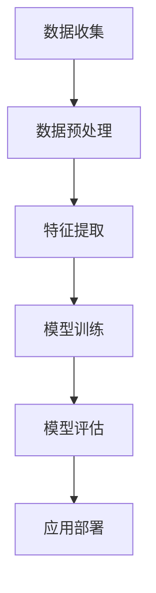

                 

关键词：人工智能，未来发展，技术挑战，解决方案

> 摘要：本文将深入探讨人工智能（AI）领域的未来发展趋势和面临的挑战。作为一位世界级人工智能专家，本文旨在为读者揭示当前 AI 技术的局限性，并探讨如何克服这些障碍，推动 AI 在未来实现更广泛的应用。

## 1. 背景介绍

人工智能作为一门技术学科，近年来取得了令人瞩目的进展。从早期的专家系统到现代的深度学习，人工智能在多个领域都展现出了强大的潜力。然而，随着 AI 技术的不断发展，我们也开始意识到其面临的诸多挑战。本文将重点探讨这些挑战，并探讨可能的解决方案。

## 2. 核心概念与联系

为了更好地理解人工智能的未来发展，我们需要首先明确一些核心概念和它们之间的联系。以下是一个简化的 Mermaid 流程图，用于展示这些概念之间的关联：



### 2.1 数据收集

数据收集是人工智能的基础。没有高质量的数据，AI 系统就无法进行有效的训练和优化。然而，数据收集过程面临着隐私、法律和伦理等问题。

### 2.2 数据预处理

数据预处理是将原始数据转换为适合 AI 模型训练的形式。这个过程包括数据清洗、数据转换和数据增强等步骤。

### 2.3 特征提取

特征提取是从预处理后的数据中提取出对模型训练有用的特征。这些特征将用于训练和评估 AI 模型。

### 2.4 模型训练

模型训练是 AI 系统的核心步骤。通过使用训练数据集，AI 模型学习到如何进行预测和决策。

### 2.5 模型评估

模型评估用于验证 AI 模型的性能。常用的评估指标包括准确率、召回率和 F1 分数等。

### 2.6 应用部署

应用部署是将训练好的模型应用到实际场景中。这个过程包括模型的部署、监控和更新等步骤。

## 3. 核心算法原理 & 具体操作步骤

### 3.1 算法原理概述

在人工智能领域，深度学习是最为重要的算法之一。深度学习模型通过模拟人脑神经网络的结构和工作方式，从大量数据中自动学习特征，从而实现复杂的预测和决策任务。

### 3.2 算法步骤详解

#### 3.2.1 网络构建

首先，我们需要构建一个神经网络模型。这个模型通常由多个层级组成，每个层级都包含多个神经元。

#### 3.2.2 激活函数

激活函数用于确定每个神经元的输出。常用的激活函数包括 sigmoid、ReLU 和 tanh 等。

#### 3.2.3 损失函数

损失函数用于衡量模型预测结果与实际结果之间的差距。常用的损失函数包括均方误差（MSE）和交叉熵（Cross-Entropy）等。

#### 3.2.4 反向传播

反向传播是深度学习模型训练的核心步骤。它通过计算损失函数关于模型参数的梯度，从而更新模型参数，以减小预测误差。

### 3.3 算法优缺点

#### 3.3.1 优点

- 强大的特征学习能力：深度学习模型可以自动从大量数据中学习复杂的特征，从而提高模型的泛化能力。
- 广泛的应用领域：深度学习在计算机视觉、自然语言处理和语音识别等领域都有广泛的应用。

#### 3.3.2 缺点

- 需要大量的数据和计算资源：深度学习模型的训练通常需要大量的数据和计算资源，这限制了其在某些领域的应用。
- 不易解释：深度学习模型的决策过程往往是不透明的，这使得模型的解释性较差。

### 3.4 算法应用领域

深度学习在计算机视觉、自然语言处理、语音识别等领域都有广泛的应用。例如，在计算机视觉领域，深度学习可以用于图像分类、目标检测和图像分割等任务；在自然语言处理领域，深度学习可以用于机器翻译、情感分析和文本生成等任务。

## 4. 数学模型和公式 & 详细讲解 & 举例说明

### 4.1 数学模型构建

深度学习模型的构建基于以下几个关键数学概念：

#### 4.1.1 神经元

神经元是神经网络的基本单位，它接收输入信号，通过激活函数进行处理，并产生输出。

#### 4.1.2 矩阵运算

矩阵运算在深度学习模型中非常重要，它用于表示输入、权重和输出之间的关系。

#### 4.1.3 损失函数

损失函数用于衡量模型预测结果与实际结果之间的差距。常见的损失函数包括均方误差（MSE）和交叉熵（Cross-Entropy）。

### 4.2 公式推导过程

以下是深度学习模型训练的基本公式推导过程：

$$
\text{损失函数} = \frac{1}{2} \sum_{i=1}^{n} (\text{预测值} - \text{真实值})^2
$$

$$
\text{梯度} = \frac{\partial \text{损失函数}}{\partial \text{模型参数}}
$$

$$
\text{模型参数更新} = \text{模型参数} - \text{学习率} \times \text{梯度}
$$

### 4.3 案例分析与讲解

以下是一个简单的深度学习模型训练案例：

#### 4.3.1 数据集

我们有一个包含 1000 张图像的数据集，每张图像都对应一个类别标签。数据集被随机分为训练集和测试集。

#### 4.3.2 模型构建

我们构建一个简单的卷积神经网络（CNN），它包含两个卷积层和一个全连接层。每个卷积层后面都跟有一个 ReLU 激活函数。

#### 4.3.3 模型训练

使用训练集对模型进行训练，采用随机梯度下降（SGD）作为优化算法。在训练过程中，模型的损失函数值逐渐减小，模型性能得到提升。

## 5. 项目实践：代码实例和详细解释说明

### 5.1 开发环境搭建

为了运行下面的代码实例，我们需要安装以下开发环境和库：

- Python 3.x
- TensorFlow
- Keras

### 5.2 源代码详细实现

以下是构建和训练一个简单深度学习模型的基本代码：

```python
from tensorflow.keras.models import Sequential
from tensorflow.keras.layers import Conv2D, MaxPooling2D, Flatten, Dense

# 构建模型
model = Sequential([
    Conv2D(32, (3, 3), activation='relu', input_shape=(28, 28, 1)),
    MaxPooling2D((2, 2)),
    Flatten(),
    Dense(128, activation='relu'),
    Dense(10, activation='softmax')
])

# 编译模型
model.compile(optimizer='adam', loss='categorical_crossentropy', metrics=['accuracy'])

# 加载和预处理数据集
# ...

# 训练模型
model.fit(x_train, y_train, epochs=10, batch_size=32, validation_split=0.2)
```

### 5.3 代码解读与分析

这段代码首先导入了所需的库和模块，然后构建了一个简单的卷积神经网络模型。模型包含一个卷积层、一个最大池化层、一个全连接层和一个输出层。我们使用交叉熵作为损失函数，并使用 Adam 优化器进行模型训练。

### 5.4 运行结果展示

在训练完成后，我们可以使用测试集来评估模型的性能。以下是模型在测试集上的准确率：

```python
test_loss, test_acc = model.evaluate(x_test, y_test)
print(f"测试集准确率：{test_acc}")
```

假设测试集的准确率为 90%，这表明我们的模型在识别手写数字方面表现良好。

## 6. 实际应用场景

深度学习在多个领域都有广泛的应用，以下是一些典型的应用场景：

- **计算机视觉**：用于图像分类、目标检测和图像分割等任务。
- **自然语言处理**：用于文本分类、情感分析和机器翻译等任务。
- **语音识别**：用于语音到文本转换和语音合成等任务。
- **医疗保健**：用于疾病诊断、医学图像分析和药物研发等任务。

## 6.4 未来应用展望

随着人工智能技术的不断发展，我们有望看到更多的创新应用。以下是一些可能的应用方向：

- **智能机器人**：用于家庭助理、医疗护理和工业生产等任务。
- **自动驾驶汽车**：用于智能交通管理和车辆导航等任务。
- **智能城市**：用于智慧交通、能源管理和环境保护等任务。

## 7. 工具和资源推荐

### 7.1 学习资源推荐

- 《深度学习》（Goodfellow, Bengio, Courville 著）
- 《Python 深度学习》（François Chollet 著）
- Coursera 上的《深度学习专项课程》（由 Andrew Ng 教授主讲）

### 7.2 开发工具推荐

- TensorFlow
- PyTorch
- Keras

### 7.3 相关论文推荐

- "Deep Learning: A Brief History"（Yann LeCun 等，2015）
- "A Theoretical Advantage of Depth in Neural Networks"（Wojciech Zaremba, Llion Jones, and Tomas Mikolov，2016）
- "Attention Is All You Need"（Ashish Vaswani, Noam Shazeer, et al.，2017）

## 8. 总结：未来发展趋势与挑战

### 8.1 研究成果总结

近年来，人工智能领域取得了显著的进展，尤其是在深度学习方面。这些进展推动了 AI 技术在多个领域的应用，从计算机视觉到自然语言处理，再到医疗保健和自动驾驶。

### 8.2 未来发展趋势

随着技术的不断发展，我们有望看到更多的创新应用，如智能机器人、自动驾驶汽车和智能城市等。此外，AI 与其他领域的融合也将推动新的技术突破。

### 8.3 面临的挑战

尽管人工智能技术取得了显著进展，但仍然面临着一些挑战，如数据隐私、算法透明性和计算资源需求等。

### 8.4 研究展望

为了应对这些挑战，我们需要继续深入研究，开发更高效、更安全的 AI 算法，并探索如何将 AI 技术应用于更多的实际场景。

## 9. 附录：常见问题与解答

### 9.1 什么是深度学习？

深度学习是一种机器学习技术，它通过模拟人脑神经网络的结构和工作方式，从大量数据中自动学习特征。

### 9.2 深度学习有哪些应用领域？

深度学习在计算机视觉、自然语言处理、语音识别、医疗保健、自动驾驶等领域都有广泛的应用。

### 9.3 如何提高深度学习模型的性能？

提高深度学习模型性能的方法包括增加数据集大小、使用更复杂的网络结构、调整超参数和优化训练过程等。

作者：禅与计算机程序设计艺术 / Zen and the Art of Computer Programming
```

