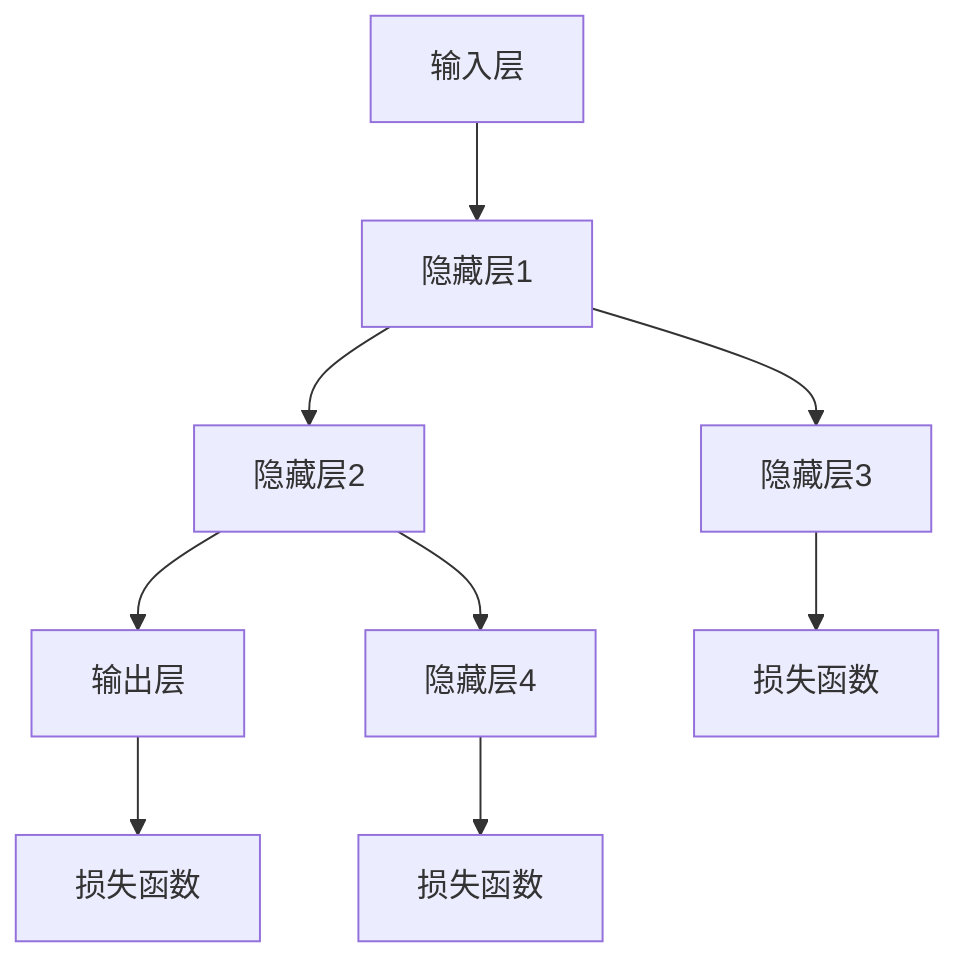

                 

关键词：人工智能，未来，发展机遇，技术趋势，应用场景，挑战与展望

> 摘要：本文深入探讨了人工智能领域未来的发展机遇，从技术趋势到应用场景，以及面临的挑战和未来展望，旨在为读者提供全面的视角，了解人工智能在当今社会和技术环境中的重要角色及其未来潜力。

## 1. 背景介绍

人工智能（Artificial Intelligence, AI）作为计算机科学的一个分支，旨在创建能够模拟、扩展甚至超越人类智能的系统。自1956年达特茅斯会议以来，人工智能经历了多次起伏，从最初的乐观期到90年代的低潮期，再到21世纪的复兴，其发展速度和影响力不断壮大。

近年来，深度学习、神经网络等技术的突破，为人工智能注入了新的活力。随着计算能力的提升、海量数据的积累以及算法的优化，人工智能在语音识别、图像处理、自然语言处理等多个领域取得了显著进展。Andrej Karpathy，作为世界顶级人工智能研究者，对人工智能的未来有着深刻的洞察和独到的见解。本文将基于Andrej Karpathy的研究成果，探讨人工智能的未来发展机遇。

## 2. 核心概念与联系

### 2.1  深度学习与神经网络

深度学习是人工智能的一个子领域，它通过多层神经网络对数据进行学习，实现从简单到复杂的特征提取。神经网络是模仿生物神经系统的计算模型，其基本组成单元是神经元。每个神经元通过权重和偏置与输入数据进行加权求和，并经过激活函数输出结果。

下面是一个简单的神经网络结构图（使用Mermaid流程图表示）：



### 2.2  人工智能应用领域

人工智能的应用领域非常广泛，包括但不限于：

- **语音识别**：将语音信号转换为文本，如苹果的Siri、亚马逊的Alexa等。
- **图像识别**：通过卷积神经网络对图像中的对象进行识别，如图像分类、物体检测等。
- **自然语言处理**：包括语言理解、文本生成、机器翻译等，如Google翻译、OpenAI的GPT等。
- **自动驾驶**：利用计算机视觉、传感器融合等技术实现无人驾驶汽车。
- **医疗诊断**：通过分析医学影像和患者数据，提供诊断建议和治疗方案。

## 3. 核心算法原理 & 具体操作步骤

### 3.1  算法原理概述

人工智能的核心算法主要包括深度学习算法和强化学习算法。深度学习算法通过多层神经网络对数据进行学习，而强化学习算法则通过智能体与环境互动，不断优化策略。

下面简要介绍深度学习算法的基本原理和操作步骤：

- **损失函数**：用于衡量模型预测值与真实值之间的差距，常用的损失函数包括均方误差（MSE）、交叉熵损失（Cross-Entropy Loss）等。
- **反向传播**：通过计算损失函数关于网络参数的梯度，反向传播到前一层，更新网络参数。
- **优化算法**：用于更新网络参数，常用的优化算法包括随机梯度下降（SGD）、Adam优化器等。

### 3.2  算法步骤详解

1. **数据预处理**：包括数据清洗、归一化、数据增强等步骤。
2. **模型构建**：根据任务需求设计网络结构，如卷积神经网络（CNN）、循环神经网络（RNN）等。
3. **训练过程**：通过前向传播计算输出，计算损失函数，反向传播更新参数，重复上述过程，直至达到预设的训练目标。
4. **评估与优化**：通过验证集和测试集评估模型性能，根据评估结果调整模型参数，优化模型结构。

### 3.3  算法优缺点

深度学习算法的优点：

- **强大的表示能力**：能够自动提取特征，减少人工干预。
- **广泛的适用性**：可以应用于各种复杂数据类型和任务场景。
- **高效的计算能力**：借助并行计算和GPU加速，训练速度大幅提升。

深度学习算法的缺点：

- **数据依赖性**：需要大量高质量的数据进行训练。
- **模型解释性差**：黑盒模型，难以理解模型内部的决策过程。
- **过拟合问题**：在训练数据上表现良好，但在未知数据上表现不佳。

### 3.4  算法应用领域

深度学习算法在以下领域具有广泛应用：

- **计算机视觉**：图像分类、目标检测、人脸识别等。
- **自然语言处理**：语言模型、机器翻译、文本生成等。
- **推荐系统**：基于用户行为和兴趣推荐相关内容。
- **医学诊断**：辅助医生进行疾病诊断和治疗方案制定。

## 4. 数学模型和公式 & 详细讲解 & 举例说明

### 4.1  数学模型构建

深度学习中的数学模型主要包括线性模型、非线性模型、多层感知器（MLP）等。以下是一个简单的线性模型：

$$
y = \theta_0 + \theta_1x_1 + \theta_2x_2 + \ldots + \theta_nx_n
$$

其中，$y$ 为输出，$x_1, x_2, \ldots, x_n$ 为输入特征，$\theta_0, \theta_1, \theta_2, \ldots, \theta_n$ 为模型参数。

### 4.2  公式推导过程

以多层感知器为例，我们考虑一个包含输入层、隐藏层和输出层的神经网络。假设输入层有 $m$ 个神经元，隐藏层有 $n$ 个神经元，输出层有 $k$ 个神经元。

- **前向传播**：

输入层到隐藏层的输出：

$$
z_j^{(2)} = \sum_{i=1}^{m} w_{ij}^{(1)}x_i + b_j^{(2)} \\
a_j^{(2)} = \sigma(z_j^{(2)})
$$

其中，$w_{ij}^{(1)}$ 为输入层到隐藏层的权重，$b_j^{(2)}$ 为隐藏层的偏置，$\sigma$ 为激活函数，通常采用 sigmoid 函数。

隐藏层到输出层的输出：

$$
z_k^{(3)} = \sum_{j=1}^{n} w_{kj}^{(2)}a_j^{(2)} + b_k^{(3)} \\
a_k^{(3)} = \sigma(z_k^{(3)})
$$

其中，$w_{kj}^{(2)}$ 为隐藏层到输出层的权重，$b_k^{(3)}$ 为输出层的偏置。

- **反向传播**：

计算输出层的损失函数：

$$
L(a_k^{(3)}, y_k) = -\sum_{k=1}^{k} [y_k\log(a_k^{(3)}) + (1 - y_k)\log(1 - a_k^{(3)})]
$$

其中，$y_k$ 为真实标签，$a_k^{(3)}$ 为输出层的预测值。

计算输出层关于隐藏层的梯度：

$$
\frac{\partial L}{\partial a_j^{(2)}} = \frac{\partial L}{\partial z_k^{(3)}} \cdot \frac{\partial z_k^{(3)}}{\partial a_j^{(2)}} \\
= \frac{\partial L}{\partial z_k^{(3)}} \cdot \sigma'(z_k^{(3)})
$$

计算隐藏层关于输入层的梯度：

$$
\frac{\partial L}{\partial x_i} = \sum_{j=1}^{n} w_{ij}^{(1)} \cdot \frac{\partial L}{\partial a_j^{(2)}} \\
= \sum_{j=1}^{n} w_{ij}^{(1)} \cdot \frac{\partial L}{\partial z_j^{(2)}} \cdot \sigma'(z_j^{(2)})
$$

更新网络参数：

$$
w_{ij}^{(1)} := w_{ij}^{(1)} - \alpha \cdot \frac{\partial L}{\partial w_{ij}^{(1)}} \\
b_j^{(2)} := b_j^{(2)} - \alpha \cdot \frac{\partial L}{\partial b_j^{(2)}} \\
w_{kj}^{(2)} := w_{kj}^{(2)} - \alpha \cdot \frac{\partial L}{\partial w_{kj}^{(2)}} \\
b_k^{(3)} := b_k^{(3)} - \alpha \cdot \frac{\partial L}{\partial b_k^{(3)}}
$$

其中，$\alpha$ 为学习率。

### 4.3  案例分析与讲解

假设我们有一个简单的线性回归问题，输入特征 $x$ 和输出标签 $y$ 如下：

| x | y |
|---|---|
| 1 | 2 |
| 2 | 4 |
| 3 | 6 |

我们希望训练一个线性模型 $y = \theta_0 + \theta_1x$ 来预测 $y$ 的值。首先，我们需要计算损失函数：

$$
L(\theta_0, \theta_1) = \sum_{i=1}^{3} (y_i - (\theta_0 + \theta_1x_i))^2
$$

为了最小化损失函数，我们需要计算损失函数关于 $\theta_0$ 和 $\theta_1$ 的梯度：

$$
\frac{\partial L}{\partial \theta_0} = -2\sum_{i=1}^{3} (y_i - (\theta_0 + \theta_1x_i)) \\
\frac{\partial L}{\partial \theta_1} = -2\sum_{i=1}^{3} x_i(y_i - (\theta_0 + \theta_1x_i))
$$

然后，我们可以使用梯度下降法更新模型参数：

$$
\theta_0 := \theta_0 - \alpha \cdot \frac{\partial L}{\partial \theta_0} \\
\theta_1 := \theta_1 - \alpha \cdot \frac{\partial L}{\partial \theta_1}
$$

通过多次迭代，我们可以得到最优的模型参数 $\theta_0$ 和 $\theta_1$，从而实现线性回归任务。

## 5. 项目实践：代码实例和详细解释说明

在本节中，我们将通过一个简单的深度学习项目，展示如何使用Python和TensorFlow实现一个基于神经网络的线性回归模型。该项目将涵盖以下步骤：

1. **开发环境搭建**
2. **数据预处理**
3. **模型构建**
4. **训练过程**
5. **评估与优化**
6. **运行结果展示**

### 5.1  开发环境搭建

首先，我们需要安装TensorFlow库。可以使用以下命令安装：

```python
pip install tensorflow
```

### 5.2  源代码详细实现

接下来，我们将编写一个简单的线性回归模型。以下是一个简单的实现示例：

```python
import tensorflow as tf
import numpy as np

# 创建随机数据集
x = np.random.uniform(0, 10, size=100)
y = 3 * x + 2 + np.random.normal(0, 1, size=100)

# 构建模型
model = tf.keras.Sequential([
    tf.keras.layers.Dense(units=1, input_shape=[1])
])

# 编译模型
model.compile(optimizer='sgd', loss='mean_squared_error')

# 训练模型
model.fit(x, y, epochs=100)

# 评估模型
loss = model.evaluate(x, y)
print(f"Model loss: {loss}")

# 预测
x_pred = np.linspace(0, 10, 100)
y_pred = model.predict(x_pred)

# 可视化结果
import matplotlib.pyplot as plt

plt.scatter(x, y)
plt.plot(x_pred, y_pred, color='red')
plt.show()
```

### 5.3  代码解读与分析

上述代码实现了一个简单的线性回归模型，主要分为以下几个部分：

1. **数据集创建**：我们创建了一个包含100个随机样本的数据集，每个样本的 $x$ 值在0到10之间，$y$ 值为 $3x + 2$ 加上随机噪声。
2. **模型构建**：使用 `tf.keras.Sequential` 创建了一个简单的全连接层（Dense Layer），输入形状为[1]，输出为1个神经元。
3. **模型编译**：指定了优化器和损失函数，这里使用随机梯度下降（SGD）和均方误差（MSE）。
4. **模型训练**：使用 `model.fit` 方法训练模型，指定训练轮数（epochs）。
5. **模型评估**：使用 `model.evaluate` 方法评估模型在测试集上的性能，输出损失值。
6. **模型预测**：使用 `model.predict` 方法进行预测，并使用 `matplotlib` 进行结果可视化。

### 5.4  运行结果展示

在运行上述代码后，我们可以在可视化图中观察到模型对数据的拟合效果。红色线条表示模型的预测值，蓝色散点表示实际数据点。通过训练，模型能够较好地拟合数据，实现线性回归任务。

## 6. 实际应用场景

人工智能在各个领域都有着广泛的应用，以下列举一些典型的实际应用场景：

- **自动驾驶**：通过计算机视觉、传感器融合等技术，实现无人驾驶汽车的自主导航和驾驶。
- **医疗诊断**：利用图像识别和自然语言处理技术，辅助医生进行疾病诊断和治疗方案制定。
- **金融风控**：通过数据挖掘和机器学习技术，预测金融风险，提供投资建议。
- **智能家居**：通过语音识别和自然语言处理技术，实现智能音箱、智能家电的语音控制。
- **智能制造**：通过机器学习和计算机视觉技术，实现工业生产线的自动化和智能化。

### 6.4  未来应用展望

随着技术的不断进步，人工智能在未来将会有更多的应用场景和发展机遇：

- **人机协作**：人工智能将更好地与人类协作，提高工作效率和生活质量。
- **智能医疗**：通过大数据和人工智能技术，实现精准医疗和个性化治疗。
- **智能交通**：通过智能交通系统，优化交通流量，减少交通事故和拥堵。
- **虚拟现实与增强现实**：利用人工智能技术，提升虚拟现实和增强现实体验。
- **可持续能源**：通过人工智能技术，优化能源利用，实现可持续发展。

## 7. 工具和资源推荐

为了更好地学习和实践人工智能技术，以下是一些建议的工具和资源：

### 7.1  学习资源推荐

- **《深度学习》（Goodfellow et al.）**：是一本经典的深度学习教材，适合初学者和进阶者。
- **TensorFlow官方文档**：提供了详细的API和使用指南，是学习TensorFlow的最佳资源。
- **Kaggle**：一个数据科学竞赛平台，提供了丰富的比赛数据和项目案例。

### 7.2  开发工具推荐

- **Google Colab**：免费的云端Python开发环境，支持TensorFlow等深度学习框架。
- **Jupyter Notebook**：用于交互式编程和数据可视化的Web应用程序，便于实验和演示。
- **PyCharm**：一个功能强大的Python集成开发环境（IDE），支持多种编程语言和框架。

### 7.3  相关论文推荐

- **“A Theoretical Analysis of the Classifier Probability Output Function”**：一篇关于分类器输出概率函数的理论分析论文。
- **“Deep Learning”**：由Ian Goodfellow、Yoshua Bengio和Aaron Courville撰写的深度学习综述论文。
- **“The Unreasonable Effectiveness of Deep Learning”**：一篇关于深度学习广泛应用场景的论文。

## 8. 总结：未来发展趋势与挑战

### 8.1  研究成果总结

近年来，人工智能在各个领域取得了显著的成果，深度学习、神经网络等技术的突破为人工智能的发展注入了新的活力。计算机视觉、自然语言处理、自动驾驶等领域的应用取得了实质性进展，人工智能已经成为现代社会不可或缺的一部分。

### 8.2  未来发展趋势

未来，人工智能将继续朝着以下几个方向发展：

- **更加智能化**：通过深度学习和强化学习等技术，实现更智能的决策和优化。
- **跨领域融合**：与其他技术（如大数据、物联网、区块链等）融合，产生新的应用场景。
- **人机协作**：实现人机协同工作，提高生产效率和生活质量。
- **可持续发展**：利用人工智能技术优化能源利用，实现可持续发展目标。

### 8.3  面临的挑战

尽管人工智能发展迅速，但仍然面临一些挑战：

- **数据隐私和安全**：如何保护用户数据隐私，确保数据安全。
- **算法透明性和解释性**：如何提高算法的透明性和解释性，降低黑盒模型的负面影响。
- **公平性和道德**：如何确保人工智能技术的公平性和道德性，避免歧视和不公正现象。

### 8.4  研究展望

展望未来，人工智能研究将朝着以下几个方向深入发展：

- **自主学习与自适应**：开发能够自主学习、适应环境的智能系统。
- **人机融合**：研究人机融合技术，实现更自然的交互和协作。
- **跨学科研究**：结合心理学、认知科学、哲学等学科，深入探索人工智能的本质和边界。

## 9. 附录：常见问题与解答

### Q1. 深度学习与机器学习有什么区别？

A1. 深度学习是机器学习的一个子领域，主要关注于使用多层神经网络进行学习。而机器学习则是一个更广泛的概念，包括了许多其他类型的算法，如线性回归、决策树、支持向量机等。

### Q2. 人工智能的主要应用领域有哪些？

A2. 人工智能的主要应用领域包括计算机视觉、自然语言处理、自动驾驶、医疗诊断、金融风控、智能家居等。

### Q3. 如何选择合适的神经网络架构？

A2. 选择合适的神经网络架构需要根据具体的应用场景和任务需求进行。常见的神经网络架构有卷积神经网络（CNN）、循环神经网络（RNN）、长短时记忆网络（LSTM）等。

### Q4. 深度学习中的优化算法有哪些？

A4. 深度学习中的优化算法包括随机梯度下降（SGD）、Adam优化器、RMSProp等。这些算法通过不同方式更新网络参数，以最小化损失函数。

### Q5. 如何处理过拟合问题？

A5. 处理过拟合问题可以通过以下几种方法：

- **数据增强**：增加训练数据量或生成新的训练样本。
- **正则化**：在损失函数中加入正则项，如L1正则化、L2正则化。
- **交叉验证**：使用验证集评估模型性能，避免过拟合。
- **Dropout**：在训练过程中随机丢弃部分神经元，降低模型的复杂度。

[作者：禅与计算机程序设计艺术 / Zen and the Art of Computer Programming]  
----------------------------------------------------------------

